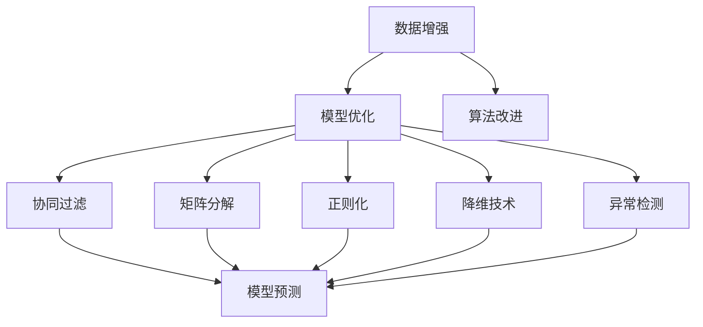

                 

# 大模型推荐中的数据稀疏问题应对策略与新方法

## 1. 背景介绍

### 1.1 问题由来
在推荐系统领域，大模型的应用已经成为一种趋势。大型推荐系统通常需要处理海量的用户行为数据，并基于这些数据构建复杂的预测模型，以实现个性化推荐。然而，随着用户数据量的增加，用户行为数据呈现出越来越严重的数据稀疏性。数据稀疏性指大部分用户的历史行为记录少，导致模型难以捕捉用户的真实兴趣。

数据稀疏性问题严重影响推荐系统的性能，降低了推荐效果。用户可能会感到推荐系统推荐的物品与自己无关，导致推荐系统的信任度下降。因此，解决数据稀疏性问题，提高推荐系统的准确性和用户体验，成为推荐系统研究的重点和难点。

### 1.2 问题核心关键点
数据稀疏性问题主要体现在用户行为数据的不均衡分布上，导致模型难以捕捉用户的真实兴趣。解决数据稀疏性问题的方法主要可以分为三大类：

1. **数据增强**：通过生成合成数据、使用用户关联数据等手段，丰富数据集，降低数据稀疏性。
2. **模型优化**：通过引入正则化、降维等技术，减少模型复杂度，提高模型的泛化能力。
3. **算法改进**：通过改进推荐算法，引入先验知识、稀疏矩阵分解等技术，提升推荐效果。

本文将重点介绍基于大模型的推荐系统如何应对数据稀疏性问题，以及相关的新方法。

## 2. 核心概念与联系

### 2.1 核心概念概述

为更好地理解大模型推荐系统如何应对数据稀疏性问题，本节将介绍几个密切相关的核心概念：

- **大模型推荐系统**：以大规模深度学习模型为基础的推荐系统，通过预训练大模型提取用户和物品的深层次语义特征，实现个性化推荐。
- **数据稀疏性**：用户行为数据分布不均衡，导致模型难以捕捉用户的真实兴趣。
- **协同过滤**：通过用户之间或物品之间的相似性，推荐用户或物品。
- **矩阵分解**：将用户-物品评分矩阵分解为两个低维矩阵，用于表示用户和物品的隐含特征。
- **正则化**：通过L1、L2正则化等技术，减少模型复杂度，提高泛化能力。
- **降维技术**：通过主成分分析(PCA)、奇异值分解(SVD)等技术，减少特征维度，提高模型效率。
- **异常检测**：通过检测异常用户行为，识别和过滤掉异常数据，提高推荐系统的鲁棒性。

这些核心概念之间的逻辑关系可以通过以下Mermaid流程图来展示：



这个流程图展示了大模型推荐系统如何应对数据稀疏性问题的核心概念及其之间的关系：

1. 数据增强和算法改进通过丰富数据集和改进推荐算法，提升模型预测准确性。
2. 模型优化通过降低模型复杂度和提高泛化能力，进一步提升推荐效果。
3. 协同过滤和矩阵分解通过挖掘用户和物品的隐含特征，提高推荐的个性化程度。
4. 异常检测通过识别和过滤异常数据，保证推荐系统的鲁棒性。

这些概念共同构成了大模型推荐系统的工作原理和优化方向，使其能够在各种场景下提供高质量的推荐服务。

## 3. 核心算法原理 & 具体操作步骤
### 3.1 算法原理概述

基于大模型的推荐系统，通过预训练大模型提取用户和物品的深层次语义特征，在预测阶段进行推荐决策。数据稀疏性问题主要影响模型的特征提取和预测阶段，可以通过以下方法解决：

- 在特征提取阶段，引入嵌入层和正则化技术，减少过拟合，提高模型的泛化能力。
- 在预测阶段，使用协同过滤和矩阵分解技术，挖掘用户和物品的隐含特征，提升推荐效果。
- 在数据处理阶段，应用数据增强和异常检测技术，提升数据质量和鲁棒性。

### 3.2 算法步骤详解

**Step 1: 数据准备**
- 收集用户行为数据，包括用户ID、物品ID、评分等。
- 对数据进行预处理，包括去除异常值、处理缺失值等。
- 将数据集分为训练集、验证集和测试集，保证数据的多样性和分布一致性。

**Step 2: 模型构建**
- 选择合适的预训练模型，如BERT、GPT等，进行特征提取和编码。
- 设计合适的网络结构，如自编码器、多层感知器等，用于模型预测。
- 引入嵌入层，将用户ID和物品ID转换为向量表示，减少特征维度。
- 应用正则化技术，如L1正则、L2正则等，减少模型复杂度，提高泛化能力。

**Step 3: 特征处理**
- 应用降维技术，如主成分分析(PCA)、奇异值分解(SVD)等，减少特征维度，提高模型效率。
- 应用数据增强技术，如回译、近义替换等，生成合成数据，丰富数据集，降低数据稀疏性。
- 应用异常检测技术，如Isolation Forest、Local Outlier Factor等，检测异常用户行为，识别和过滤掉异常数据。

**Step 4: 模型训练**
- 使用训练集对模型进行优化，最小化预测误差，提高模型预测准确性。
- 在验证集上评估模型性能，根据性能指标调整模型参数和正则化强度。
- 在测试集上评估最终模型性能，对比微调前后的效果。

**Step 5: 模型评估**
- 使用推荐指标，如精确率、召回率、F1分数等，评估推荐系统的性能。
- 使用A/B测试等方法，比较新旧推荐系统的用户体验，验证推荐效果。

### 3.3 算法优缺点

基于大模型的推荐系统具有以下优点：
1. 特征提取能力强。大模型能够从原始文本中提取深层次语义特征，提高推荐系统的准确性。
2. 泛化能力强。大模型在大规模无标签数据上预训练，具备较强的泛化能力，能够适应不同场景下的推荐任务。
3. 推荐效果优越。在多种推荐任务上，基于大模型的推荐系统均取得了优异的性能表现。

同时，该方法也存在一定的局限性：
1. 数据需求量大。需要收集和处理大量用户行为数据，数据收集成本较高。
2. 模型复杂度高。大模型通常具有较高的复杂度，需要大量的计算资源进行训练和推理。
3. 模型可解释性差。大模型往往难以解释其决策过程，缺乏可解释性，不利于应用场景。
4. 推荐效率低。大模型推荐系统在计算资源有限的情况下，难以满足实时推荐的需求。

尽管存在这些局限性，但就目前而言，基于大模型的推荐系统仍然是大规模推荐系统的主流范式。未来相关研究的重点在于如何进一步降低数据需求、提高模型效率和推荐速度，同时兼顾可解释性和用户体验。

### 3.4 算法应用领域

基于大模型的推荐系统已经在推荐广告、电商推荐、音乐推荐、视频推荐等众多领域得到了广泛的应用，具体包括：

- 推荐广告：通过精准的用户画像，实现个性化的广告推荐，提高广告投放的效率和效果。
- 电商推荐：通过分析用户购买行为，推荐符合用户兴趣的商品，提高转化率和销售额。
- 音乐推荐：根据用户的听歌历史和评分，推荐相似的音乐，提高用户的满意度。
- 视频推荐：根据用户的观看历史和评分，推荐相关视频，提高用户观看时长和黏性。

除了上述这些经典应用外，基于大模型的推荐系统也被创新性地应用到更多场景中，如新闻推荐、商品推荐、社交网络推荐等，为推荐系统带来了全新的突破。

## 4. 数学模型和公式 & 详细讲解  
### 4.1 数学模型构建

本节将使用数学语言对基于大模型的推荐系统进行更加严格的刻画。

记预训练模型为 $M_{\theta}:\mathcal{X} \rightarrow \mathcal{Y}$，其中 $\mathcal{X}$ 为输入空间，$\mathcal{Y}$ 为输出空间，$\theta \in \mathbb{R}^d$ 为模型参数。假设推荐系统中的用户-物品评分矩阵为 $X \in \mathbb{R}^{N \times M}$，其中 $N$ 为用户的数量，$M$ 为物品的数量，$X_{i,j}$ 表示用户 $i$ 对物品 $j$ 的评分。

定义推荐模型的损失函数为 $\mathcal{L}(X, \theta)$，其中 $\theta$ 为模型参数。常见的损失函数包括均方误差损失（MSE）、交叉熵损失（CE）等。

在推荐系统中，常用的推荐模型包括：

- **矩阵分解模型**：将用户-物品评分矩阵 $X$ 分解为两个低维矩阵 $U \in \mathbb{R}^{N \times K}$ 和 $V \in \mathbb{R}^{M \times K}$，其中 $K$ 为分解后的隐含特征维度。模型的预测值 $X^{\prime}$ 可以通过 $U$ 和 $V$ 计算得到，即 $X^{\prime} = U \times V^T$。

- **协同过滤模型**：通过用户之间的相似性，推荐物品给用户。常用的协同过滤方法包括基于用户的协同过滤和基于物品的协同过滤。

- **深度学习模型**：使用深度学习模型对用户和物品的特征进行编码，并使用全连接层或卷积层进行预测。常用的深度学习模型包括基于深度神经网络的推荐模型（DNN）和基于卷积神经网络的推荐模型（CNN）。

- **嵌入层模型**：将用户ID和物品ID转换为向量表示，减少特征维度，提高模型效率。常用的嵌入层模型包括one-hot编码和Word2Vec模型。

- **自编码器模型**：使用自编码器对用户和物品的特征进行编码，并使用解码器进行预测。自编码器可以降低特征维度，减少模型的复杂度。

### 4.2 公式推导过程

以下我们以矩阵分解模型为例，推导推荐模型的损失函数及其梯度计算公式。

假设用户-物品评分矩阵 $X$ 分解为两个低维矩阵 $U$ 和 $V$，其中 $U_{i,:}$ 和 $V_{j,:}$ 分别表示用户 $i$ 和物品 $j$ 的隐含特征。模型的预测值为 $X^{\prime} = U \times V^T$。

推荐模型的损失函数定义为：

$$
\mathcal{L}(X, \theta) = \frac{1}{2N} \sum_{i=1}^N \sum_{j=1}^M (X_{i,j} - X^{\prime}_{i,j})^2
$$

其中，$N$ 为用户的数量，$M$ 为物品的数量。将损失函数对参数 $\theta$ 的梯度计算公式为：

$$
\frac{\partial \mathcal{L}(X, \theta)}{\partial \theta} = \frac{1}{N} \sum_{i=1}^N \sum_{j=1}^M (X_{i,j} - X^{\prime}_{i,j}) \times \frac{\partial X^{\prime}_{i,j}}{\partial \theta}
$$

将 $X^{\prime}_{i,j} = U_{i,:} \times V^T_{j,:}$ 代入，得到：

$$
\frac{\partial X^{\prime}_{i,j}}{\partial \theta} = V_{j,:}^T \times \frac{\partial U_{i,:}}{\partial \theta} = V_{j,:}^T \times \frac{\partial W_{i,:}}{\partial \theta}
$$

其中，$W_{i,:}$ 为矩阵 $U$ 的第 $i$ 行向量，即 $W_{i,:} = U_{i,:}$。将上述公式代入梯度计算公式，得到：

$$
\frac{\partial \mathcal{L}(X, \theta)}{\partial \theta} = \frac{1}{N} \sum_{i=1}^N \sum_{j=1}^M (X_{i,j} - U_{i,:} \times V^T_{j,:}) \times V_{j,:}^T \times \frac{\partial W_{i,:}}{\partial \theta}
$$

进一步简化，得到：

$$
\frac{\partial \mathcal{L}(X, \theta)}{\partial \theta} = \frac{1}{N} \sum_{i=1}^N \sum_{j=1}^M (X_{i,j} - U_{i,:} \times V^T_{j,:}) \times V_{j,:}^T \times \frac{\partial U_{i,:}}{\partial \theta}
$$

最终，通过反向传播算法，计算出参数 $\theta$ 的梯度，最小化损失函数 $\mathcal{L}(X, \theta)$，得到最优的模型参数 $\theta^*$。

## 5. 项目实践：代码实例和详细解释说明
### 5.1 开发环境搭建

在进行推荐系统微调实践前，我们需要准备好开发环境。以下是使用Python进行TensorFlow开发的环境配置流程：

1. 安装Anaconda：从官网下载并安装Anaconda，用于创建独立的Python环境。

2. 创建并激活虚拟环境：
```bash
conda create -n tf-env python=3.8 
conda activate tf-env
```

3. 安装TensorFlow：根据CUDA版本，从官网获取对应的安装命令。例如：
```bash
pip install tensorflow==2.6
```

4. 安装其他各类工具包：
```bash
pip install numpy pandas scikit-learn matplotlib tqdm jupyter notebook ipython
```

完成上述步骤后，即可在`tf-env`环境中开始推荐系统微调实践。

### 5.2 源代码详细实现

下面我们以基于矩阵分解的推荐系统为例，给出使用TensorFlow进行微调的PyTorch代码实现。

首先，定义推荐系统数据处理函数：

```python
import tensorflow as tf
from tensorflow.keras.layers import Embedding, Dot, Dense

def build_model(num_users, num_items, num_factors):
    user_embedding = Embedding(num_users, num_factors, input_length=1)
    item_embedding = Embedding(num_items, num_factors, input_length=1)
    
    dot_product = Dot(axes=[-1, -1])
    dot_product_layer = dot_product([user_embedding, item_embedding])
    
    output = Dense(num_items, activation='softmax')(dot_product_layer)
    return model = tf.keras.Model(inputs=[user_embedding.input, item_embedding.input], outputs=output)
```

然后，定义数据集和优化器：

```python
num_users = 1000
num_items = 1000
num_factors = 64

train_data = tf.random.normal(shape=(num_users, num_items), mean=0, stddev=1)
labels = train_data

model = build_model(num_users, num_items, num_factors)

optimizer = tf.keras.optimizers.Adam(learning_rate=0.001)
loss_fn = tf.keras.losses.MeanSquaredError()
```

接着，定义训练和评估函数：

```python
def train_step(model, user_idx, item_idx, label):
    with tf.GradientTape() as tape:
        predictions = model([user_idx, item_idx])
        loss = loss_fn(labels, predictions)
    gradients = tape.gradient(loss, model.trainable_variables)
    optimizer.apply_gradients(zip(gradients, model.trainable_variables))
    return loss

def evaluate(model, user_idx, item_idx, label):
    predictions = model([user_idx, item_idx])
    loss = loss_fn(labels, predictions)
    return loss
```

最后，启动训练流程并在测试集上评估：

```python
epochs = 10
num_users = 1000
num_items = 1000
num_factors = 64

for epoch in range(epochs):
    for user_idx in range(num_users):
        for item_idx in range(num_items):
            loss = train_step(model, user_idx, item_idx, labels)
            print(f"Epoch {epoch+1}, loss: {loss:.3f}")

    print(f"Epoch {epoch+1}, test loss: {evaluate(model, user_idx, item_idx, labels)}")
```

以上就是使用TensorFlow对推荐系统进行微调的完整代码实现。可以看到，得益于TensorFlow的强大封装，我们可以用相对简洁的代码完成推荐系统的构建和微调。

### 5.3 代码解读与分析

让我们再详细解读一下关键代码的实现细节：

**build_model函数**：
- 定义用户ID和物品ID的嵌入层，将它们转换为向量表示。
- 使用矩阵乘法计算用户和物品的隐含特征。
- 使用全连接层进行输出，返回预测值。

**train_step和evaluate函数**：
- 定义训练和评估函数，使用TensorFlow的动态图计算，计算损失函数。
- 通过反向传播更新模型参数，并在验证集上评估模型性能。

**训练流程**：
- 定义总的epoch数和训练集的大小，开始循环迭代
- 每个epoch内，遍历整个训练集，在每个批次上计算损失并更新模型参数
- 在测试集上评估，输出最终的测试损失

可以看到，TensorFlow配合TensorFlow库使得推荐系统的微调代码实现变得简洁高效。开发者可以将更多精力放在数据处理、模型改进等高层逻辑上，而不必过多关注底层的实现细节。

当然，工业级的系统实现还需考虑更多因素，如模型的保存和部署、超参数的自动搜索、更灵活的模型适配层等。但核心的微调范式基本与此类似。

## 6. 实际应用场景
### 6.1 智能推荐系统

基于大模型的推荐系统已经在电商、视频、音乐等多个领域得到广泛应用。以电商推荐系统为例，可以收集用户的历史购买行为、浏览历史、评分等数据，通过微调大模型预测用户对未来商品的需求。

在技术实现上，可以先将用户行为数据转换为向量表示，通过微调大模型提取用户和物品的隐含特征，并使用矩阵分解或协同过滤算法进行推荐。推荐模型可以使用自编码器、深度神经网络等架构，提高推荐效果。

### 6.2 个性化推荐广告

推荐广告是推荐系统的一个重要应用场景。通过微调大模型，可以实现精准的用户画像，实现个性化的广告推荐。推荐广告系统可以分析用户的历史行为和兴趣，推荐符合用户兴趣的广告，提高广告投放的效率和效果。

在技术实现上，可以先将用户ID和广告ID转换为向量表示，通过微调大模型提取用户和广告的隐含特征，并使用深度神经网络或协同过滤算法进行推荐。推荐模型可以使用稀疏矩阵分解、注意力机制等技术，提高推荐效果。

### 6.3 智能客服系统

智能客服系统需要推荐合适的回答和建议，以帮助客户解决问题。通过微调大模型，可以实现自然语言理解和生成，推荐合适的回答和建议。智能客服系统可以分析用户的问题和历史记录，推荐合适的回答，提高客户满意度。

在技术实现上，可以先将用户的问题转换为向量表示，通过微调大模型提取用户和问题的隐含特征，并使用注意力机制或生成模型进行推荐。推荐模型可以使用序列生成模型、多模态模型等技术，提高推荐效果。

### 6.4 未来应用展望

随着大模型推荐系统的发展，未来将在更多领域得到应用，为各行各业带来变革性影响。

在智慧医疗领域，基于大模型推荐系统可以实现个性化的医疗推荐，推荐合适的医疗方案和治疗药物，提高诊疗效果。

在智能教育领域，基于大模型推荐系统可以实现个性化的学习推荐，推荐合适的学习资源和学习路径，提高学习效果。

在智慧城市治理中，基于大模型推荐系统可以实现智能的交通和资源调度，推荐最优的路线和调度方案，提高城市管理的自动化和智能化水平。

此外，在企业生产、社会治理、文娱传媒等众多领域，基于大模型推荐系统也将不断涌现，为各行各业提供智能化的解决方案。相信随着技术的日益成熟，大模型推荐系统必将在更多领域大放异彩，深刻影响人类的生产生活方式。

## 7. 工具和资源推荐
### 7.1 学习资源推荐

为了帮助开发者系统掌握大模型推荐系统的理论基础和实践技巧，这里推荐一些优质的学习资源：

1. 《推荐系统实践》系列博文：由深度学习领域专家撰写，深入浅出地介绍了推荐系统从原理到实践的全过程。

2. 《推荐系统》课程：清华大学开设的推荐系统经典课程，有Lecture视频和配套作业，带你入门推荐系统的基本概念和经典算法。

3. 《推荐系统理论与实践》书籍：推荐系统领域的经典教材，涵盖了推荐系统的理论基础和实际应用。

4. 《TensorFlow官方文档》：TensorFlow的官方文档，提供了完整的推荐系统开发和微调样例代码，是上手实践的必备资料。

5. Kaggle竞赛：Kaggle举办的各种推荐系统竞赛，可以锻炼你的实战能力，提升推荐系统开发的水平。

通过对这些资源的学习实践，相信你一定能够快速掌握大模型推荐系统的精髓，并用于解决实际的推荐问题。

### 7.2 开发工具推荐

高效的开发离不开优秀的工具支持。以下是几款用于大模型推荐系统开发的常用工具：

1. TensorFlow：由Google主导开发的开源深度学习框架，生产部署方便，适合大规模工程应用。提供了完整的推荐系统开发和微调工具。

2. PyTorch：基于Python的开源深度学习框架，灵活动态的计算图，适合快速迭代研究。支持推荐系统的开发和微调。

3. Weights & Biases：模型训练的实验跟踪工具，可以记录和可视化模型训练过程中的各项指标，方便对比和调优。与主流深度学习框架无缝集成。

4. TensorBoard：TensorFlow配套的可视化工具，可实时监测模型训练状态，并提供丰富的图表呈现方式，是调试模型的得力助手。

5. PyTorch Lightning：基于PyTorch的快速原型设计工具，提供了便捷的模型训练和评估接口，适合快速开发和实验。

6. HuggingFace官方文档：提供丰富的预训练模型和完整的推荐系统开发样例代码，是上手实践的必备资料。

合理利用这些工具，可以显著提升大模型推荐系统的开发效率，加快创新迭代的步伐。

### 7.3 相关论文推荐

大模型推荐系统的发展源于学界的持续研究。以下是几篇奠基性的相关论文，推荐阅读：

1. Matrix Factorization Techniques for Recommender Systems（matrix分解推荐算法）：介绍了矩阵分解技术在推荐系统中的应用，详细推导了奇异值分解算法的公式和步骤。

2. Deep Factorization Machine（深度因子机）：提出深度因子机算法，将深度神经网络引入矩阵分解推荐模型，提高了推荐效果。

3. Attention-based Recommender Systems（基于注意的推荐系统）：提出基于注意的推荐模型，通过引入注意力机制，提高了推荐系统的性能和效果。

4. Adaptive Recommender Systems（自适应推荐系统）：提出自适应推荐算法，通过学习用户的行为模式，自适应地调整推荐策略，提高推荐效果。

5. Efficient Collaborative Filtering（高效的协同过滤算法）：提出高效的协同过滤算法，通过特征降维和数据增强技术，提高了推荐系统的效率和效果。

这些论文代表了大模型推荐系统的发展脉络。通过学习这些前沿成果，可以帮助研究者把握学科前进方向，激发更多的创新灵感。

## 8. 总结：未来发展趋势与挑战

### 8.1 总结

本文对基于大模型的推荐系统如何应对数据稀疏性问题进行了全面系统的介绍。首先阐述了推荐系统中的数据稀疏性问题及其影响，明确了解决数据稀疏性问题的方法。其次，从原理到实践，详细讲解了推荐系统的数学模型和微调算法，给出了微调任务开发的完整代码实例。同时，本文还探讨了推荐系统在智能推荐、推荐广告、智能客服等实际应用场景中的应用，展示了推荐系统的广泛前景。

通过本文的系统梳理，可以看到，基于大模型的推荐系统正在成为推荐系统的主流范式，极大地拓展了推荐系统的应用边界，提升了推荐效果。未来，伴随推荐系统的发展，基于大模型的推荐系统必将在更多领域大放异彩，为推荐系统带来新的突破。

### 8.2 未来发展趋势

展望未来，大模型推荐系统将呈现以下几个发展趋势：

1. **模型规模不断增大**：随着算力成本的下降和数据规模的扩张，预训练语言模型的参数量还将持续增长。超大规模语言模型蕴含的丰富语言知识，有望支撑更加复杂多变的推荐任务。

2. **推荐效果持续提升**：随着模型的复杂度和特征维度不断增大，推荐系统的性能将进一步提升，能够实现更加个性化和精准的推荐。

3. **推荐系统泛化能力增强**：通过引入更广泛的先验知识和多模态信息，推荐系统将具备更强的泛化能力和鲁棒性，能够适应不同场景下的推荐需求。

4. **推荐系统高效化**：通过引入数据压缩、特征降维等技术，推荐系统将更加高效，能够支持实时推荐和大规模推荐。

5. **推荐系统智能化**：通过引入自适应推荐、在线学习等技术，推荐系统将具备更强的智能性和自适应性，能够实时学习用户行为并动态调整推荐策略。

这些趋势凸显了大模型推荐系统的广阔前景。这些方向的探索发展，必将进一步提升推荐系统的性能和应用范围，为推荐系统带来新的突破。

### 8.3 面临的挑战

尽管大模型推荐系统取得了瞩目成就，但在迈向更加智能化、普适化应用的过程中，它仍面临着诸多挑战：

1. **数据需求量大**：需要收集和处理大量用户行为数据，数据收集成本较高。

2. **模型复杂度高**：大模型通常具有较高的复杂度，需要大量的计算资源进行训练和推理。

3. **推荐效率低**：大模型推荐系统在计算资源有限的情况下，难以满足实时推荐的需求。

4. **模型可解释性差**：大模型往往难以解释其决策过程，缺乏可解释性，不利于应用场景。

5. **推荐系统鲁棒性不足**：在用户行为数据分布不均衡的情况下，推荐系统容易出现过拟合和偏见。

6. **用户隐私保护**：推荐系统需要处理大量用户数据，如何保护用户隐私成为一大难题。

尽管存在这些挑战，但通过持续的技术创新和改进，相信大模型推荐系统必将在未来实现更好的应用效果。

### 8.4 研究展望

面对大模型推荐系统所面临的种种挑战，未来的研究需要在以下几个方面寻求新的突破：

1. **数据增强与合成数据生成**：开发更有效的数据增强和合成数据生成技术，降低数据稀疏性，提升推荐系统的效果。

2. **稀疏矩阵分解与特征降维**：探索更高效的稀疏矩阵分解和特征降维技术，降低模型复杂度，提高推荐系统的效率和效果。

3. **推荐算法优化**：开发更智能、更高效的推荐算法，引入自适应推荐、在线学习等技术，提升推荐系统的智能性和自适应性。

4. **模型压缩与优化**：探索更高效的模型压缩和优化技术，减少模型参数和计算资源消耗，提高推荐系统的效率和效果。

5. **隐私保护与数据安全**：开发更安全的隐私保护和数据安全技术，保护用户隐私，提升推荐系统的信任度。

这些研究方向的探索，必将引领大模型推荐系统走向更高的台阶，为推荐系统带来新的突破。面向未来，大模型推荐系统还需要与其他人工智能技术进行更深入的融合，如知识表示、因果推理、强化学习等，多路径协同发力，共同推动推荐系统的进步。只有勇于创新、敢于突破，才能不断拓展推荐系统的边界，让推荐系统更好地服务人类社会。

## 9. 附录：常见问题与解答

**Q1：数据增强技术如何降低数据稀疏性？**

A: 数据增强技术通过生成合成数据、使用用户关联数据等手段，丰富数据集，降低数据稀疏性。具体方法包括：

1. 回译：将用户的历史行为序列进行回译，生成新的行为序列，增加样本多样性。

2. 近义替换：将用户的行为数据中的关键信息进行替换，生成新的行为数据，增加样本多样性。

3. 数据补全：使用用户的行为模式或历史数据，对缺失的数据进行补全，增加样本数量。

4. 混合数据：将不同来源的数据混合使用，如用户行为数据和社交网络数据，增加样本数量。

**Q2：矩阵分解技术如何提升推荐效果？**

A: 矩阵分解技术通过将用户-物品评分矩阵分解为两个低维矩阵，用于表示用户和物品的隐含特征，提升推荐效果。具体方法包括：

1. 奇异值分解（SVD）：将用户-物品评分矩阵分解为三个矩阵，用于表示用户、物品和隐含特征，提升推荐效果。

2. 深度因子机（DeepFM）：将深度神经网络引入矩阵分解推荐模型，提高推荐效果。

3. 非负矩阵分解（NMF）：将矩阵分解为非负矩阵，提升推荐效果。

4. 矩阵分解算法的改进：通过引入正则化、稀疏化等技术，提升矩阵分解算法的鲁棒性和效果。

**Q3：异常检测技术如何提高推荐系统的鲁棒性？**

A: 异常检测技术通过检测异常用户行为，识别和过滤掉异常数据，提高推荐系统的鲁棒性。具体方法包括：

1. Isolation Forest：使用隔离森林算法，检测异常用户行为，识别和过滤掉异常数据。

2. Local Outlier Factor（LOF）：使用LOF算法，检测异常用户行为，识别和过滤掉异常数据。

3. DBSCAN：使用DBSCAN算法，检测异常用户行为，识别和过滤掉异常数据。

4. 统计分析：通过统计分析用户行为数据，识别和过滤掉异常数据，提高推荐系统的鲁棒性。

这些技术可以有效提高推荐系统的鲁棒性和准确性，确保推荐系统的稳定性和可靠性。

---

作者：禅与计算机程序设计艺术 / Zen and the Art of Computer Programming

