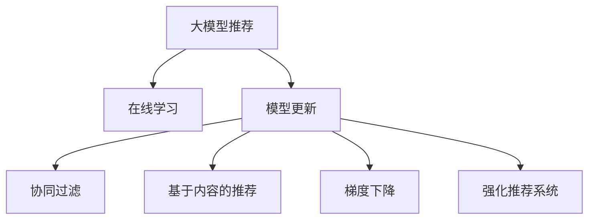

                 

# 大模型推荐中的模型更新与在线学习技术

> 关键词：大模型推荐,在线学习,模型更新,协同过滤,梯度下降,深度学习,强化学习,强化推荐系统

## 1. 背景介绍

### 1.1 问题由来
推荐系统在电商、社交网络、视频流媒体等领域有着广泛的应用，它通过分析用户的历史行为，预测其可能感兴趣的新内容，从而为用户推荐商品、新闻、视频等。传统的推荐系统大多基于协同过滤和基于内容的推荐方法。然而，随着用户数据量的激增和内容多样性的提升，传统推荐系统面临的挑战也在不断增加。

1. **冷启动问题**：对于新用户或新商品，传统推荐系统无法提供有效推荐，因为它依赖于用户和商品的历史行为数据。
2. **数据稀疏性**：用户和商品之间存在大量的“缺失”交互信息，这对推荐系统的性能产生负面影响。
3. **隐式反馈缺失**：在社交网络中，用户的反馈可能具有较强的隐匿性，如点赞、分享等，传统推荐系统难以直接捕捉这些反馈信息。

为了克服这些挑战，研究人员开始探索使用大模型进行推荐系统，利用其在处理大规模数据和复杂特征上的优势。但大模型推荐系统也面临新的问题，如模型参数庞大导致的计算资源消耗、模型训练和更新效率等。

## 2. 核心概念与联系

### 2.1 核心概念概述

为更好地理解大模型推荐系统中的模型更新与在线学习技术，本节将介绍几个密切相关的核心概念：

- **大模型推荐**：使用大规模预训练语言模型（如BERT、GPT等）进行推荐系统构建的技术，利用模型的泛化能力和语言理解能力，从大规模语料中学习到用户的兴趣和偏好。

- **在线学习**：指在数据不断流动的环境下，模型能够实时更新，适应新数据的能力。在线学习可以显著提高推荐系统的响应速度和准确性。

- **模型更新**：指在推荐系统中，模型通过接收新数据，不断优化自身参数，提升推荐性能的过程。

- **协同过滤**：一种基本的推荐方法，通过寻找与目标用户兴趣相似的其他用户，并推荐该用户喜欢的商品，以此来预测目标用户的偏好。

- **基于内容的推荐**：通过分析商品的属性和特征，预测用户对新商品的兴趣，与用户的直接交互无关。

- **梯度下降**：一种常用的优化算法，通过不断调整模型参数，使损失函数最小化，提升模型预测能力。

- **强化推荐系统**：结合强化学习，通过与用户的互动来调整推荐策略，从而提升推荐效果。

这些核心概念之间的逻辑关系可以通过以下Mermaid流程图来展示：



这个流程图展示了大模型推荐系统的主要组成部分及其之间的关系：

1. 大模型推荐通过预训练模型学习用户兴趣和偏好。
2. 在线学习使得模型能够实时更新，适应新数据。
3. 模型更新通过优化算法不断提升模型性能。
4. 协同过滤和基于内容的推荐是模型更新的具体方法。
5. 梯度下降和强化推荐系统是模型更新的常用技术。

这些概念共同构成了大模型推荐系统的核心，使其能够在各种场景下发挥强大的推荐能力。通过理解这些核心概念，我们可以更好地把握大模型推荐系统的机制和工作原理。

## 3. 核心算法原理 & 具体操作步骤
### 3.1 算法原理概述

基于大模型的推荐系统通常采用在线学习的方法进行模型更新。在线学习使得模型能够在不断接收新数据的同时，实时更新自身参数，适应新数据分布。其核心思想是：将推荐系统视为一个动态优化过程，通过不断地接收新数据，调整模型参数，使得模型能够更好地预测用户行为。

形式化地，假设推荐系统中的用户集合为 $U$，商品集合为 $I$，用户对商品的评分矩阵为 $R_{UI}$，模型参数为 $\theta$。在线学习的目标是最大化模型的预测精度，即：

$$
\hat{\theta}=\mathop{\arg\max}_{\theta} \mathcal{L}(R_{UI},\theta)
$$

其中 $\mathcal{L}$ 为损失函数，用于衡量模型预测与实际评分之间的差异。常见的损失函数包括均方误差损失、交叉熵损失等。

在线学习的过程可以概括为：

1. 初始化模型参数 $\theta$。
2. 接收新的数据样本 $(x,y)$，其中 $x$ 为用户行为特征，$y$ 为用户对商品的评分。
3. 使用梯度下降等优化算法，更新模型参数 $\theta$，使得损失函数 $\mathcal{L}$ 最小化。
4. 重复步骤 2 和 3，直到模型收敛或收到更多新数据。

### 3.2 算法步骤详解

基于在线学习的大模型推荐系统，通常包括以下关键步骤：

**Step 1: 准备数据集和模型**

- 收集推荐系统所需的用户行为数据，包括点击、浏览、购买等行为记录。
- 使用预训练语言模型对用户行为数据进行特征提取，获得用户兴趣表示和商品特征表示。
- 选择合适的推荐模型，如基于大模型的推荐模型、协同过滤模型等。

**Step 2: 初始化模型参数**

- 使用预训练语言模型作为初始化参数，避免从头训练。
- 设定模型参数的初始值，如权重矩阵、偏置向量等。

**Step 3: 在线接收数据**

- 实时接收推荐系统中的新数据，包括用户行为和商品评分等。
- 将新数据转换为模型所需的输入格式，如将用户行为特征表示为向量。

**Step 4: 模型参数更新**

- 计算新数据在模型上的预测值和实际评分之间的差异，形成损失函数。
- 使用梯度下降等优化算法，更新模型参数。
- 根据新数据的到达时间，采用增量更新的方式，避免不必要的计算开销。

**Step 5: 评估和部署**

- 在测试集上评估模型性能，如精确率、召回率等。
- 将模型部署到实际推荐系统中，为实时推荐提供支持。

### 3.3 算法优缺点

基于在线学习的大模型推荐系统具有以下优点：

1. **实时性**：能够实时接收和处理新数据，快速响应用户需求。
2. **动态优化**：能够实时更新模型参数，适应新数据分布，提升推荐效果。
3. **数据稀疏性**：能够处理大量的隐式反馈数据，减少数据稀疏性对推荐性能的影响。
4. **泛化能力**：利用大模型的泛化能力，从大规模语料中学习到更加丰富的用户和商品表示。

但该方法也存在一些局限性：

1. **计算资源消耗大**：大模型的参数量通常很大，在线学习需要不断更新参数，计算资源消耗较大。
2. **过拟合风险**：在线学习中，新数据的到来通常是随机的，模型可能会过拟合于噪声数据，降低推荐效果。
3. **实时性挑战**：对于实时性要求很高的场景，模型的训练和更新过程可能会延迟推荐结果的生成。
4. **冷启动问题**：对于新用户或新商品，模型可能需要较长时间才能适应该数据，导致推荐效果不佳。

尽管存在这些局限性，但基于在线学习的大模型推荐系统仍是大规模推荐系统中的重要范式。未来相关研究的重点在于如何进一步降低计算资源消耗，提高模型的实时性，同时兼顾冷启动问题，以实现更加高效和精准的推荐。

### 3.4 算法应用领域

基于在线学习的大模型推荐系统在电子商务、社交网络、视频流媒体等领域得到了广泛应用，涵盖了推荐系统中的多种任务，例如：

- **商品推荐**：为用户推荐其可能感兴趣的商品。通过分析用户的浏览、点击、购买等行为数据，学习用户的兴趣特征，预测其对新商品的评分。
- **内容推荐**：为用户推荐其可能感兴趣的新闻、视频、文章等内容。通过分析用户的阅读、观看历史，学习其内容偏好，预测其对新内容的兴趣。
- **活动推荐**：为用户推荐其可能感兴趣的活动或事件。通过分析用户的社交行为、兴趣偏好，预测其对新活动的兴趣。
- **广告推荐**：为用户推荐其可能感兴趣的广告内容。通过分析用户的浏览行为，学习其对广告内容的兴趣，预测其对新广告的点击率。
- **个性化推荐**：为每个用户量身定制个性化的推荐内容，提升用户体验和满意度。通过分析用户的行为特征，学习其个性化需求，预测其对新内容的兴趣。

除了上述这些经典任务外，大模型推荐系统还在新零售、智能家居、健康医疗等众多领域得到了创新性应用，为传统行业数字化转型提供了新的技术路径。

## 4. 数学模型和公式 & 详细讲解 & 举例说明
### 4.1 数学模型构建

本节将使用数学语言对基于在线学习的大模型推荐系统进行更加严格的刻画。

记推荐系统中的用户集合为 $U$，商品集合为 $I$，用户对商品的评分矩阵为 $R_{UI}$，用户行为特征表示为 $x$，商品特征表示为 $i$，模型参数为 $\theta$。假设推荐系统采用大模型 $M_{\theta}(x)$ 进行预测，其中 $M_{\theta}(x)$ 表示输入 $x$ 在模型 $\theta$ 下的预测输出。

定义推荐系统的损失函数为：

$$
\mathcal{L}(R_{UI},\theta) = \frac{1}{N}\sum_{u=1}^U\sum_{i=1}^I \mathcal{L}(M_{\theta}(x_{ui}),r_{ui})
$$

其中 $r_{ui}$ 为用户 $u$ 对商品 $i$ 的评分，$\mathcal{L}$ 为损失函数，常用的损失函数包括均方误差损失、交叉熵损失等。

在线学习的目标是最大化模型的预测精度，即：

$$
\hat{\theta}=\mathop{\arg\max}_{\theta} \mathcal{L}(R_{UI},\theta)
$$

在实践中，我们通常使用基于梯度的优化算法（如SGD、Adam等）来近似求解上述最优化问题。设 $\eta$ 为学习率，$\lambda$ 为正则化系数，则参数的更新公式为：

$$
\theta \leftarrow \theta - \eta \nabla_{\theta}\mathcal{L}(\theta) - \eta\lambda\theta
$$

其中 $\nabla_{\theta}\mathcal{L}(\theta)$ 为损失函数对参数 $\theta$ 的梯度，可通过反向传播算法高效计算。

### 4.2 公式推导过程

以下我们以均方误差损失函数为例，推导其梯度更新公式。

假设用户 $u$ 对商品 $i$ 的评分为 $r_{ui}$，模型预测评分为 $\hat{r}_{ui}=M_{\theta}(x_{ui})$，则均方误差损失函数定义为：

$$
\mathcal{L}(R_{UI},\theta) = \frac{1}{N}\sum_{u=1}^U\sum_{i=1}^I (\hat{r}_{ui} - r_{ui})^2
$$

将损失函数对模型参数 $\theta$ 求导，得：

$$
\frac{\partial \mathcal{L}(R_{UI},\theta)}{\partial \theta} = \frac{2}{N}\sum_{u=1}^U\sum_{i=1}^I (\hat{r}_{ui} - r_{ui})x_{ui} \nabla_{\theta}M_{\theta}(x_{ui})
$$

在得到损失函数的梯度后，即可带入参数更新公式，完成模型的迭代优化。重复上述过程直至收敛，最终得到适应新数据的最优模型参数 $\hat{\theta}$。

## 5. 项目实践：代码实例和详细解释说明
### 5.1 开发环境搭建

在进行在线学习项目实践前，我们需要准备好开发环境。以下是使用Python进行PyTorch开发的环境配置流程：

1. 安装Anaconda：从官网下载并安装Anaconda，用于创建独立的Python环境。

2. 创建并激活虚拟环境：
```bash
conda create -n pytorch-env python=3.8 
conda activate pytorch-env
```

3. 安装PyTorch：根据CUDA版本，从官网获取对应的安装命令。例如：
```bash
conda install pytorch torchvision torchaudio cudatoolkit=11.1 -c pytorch -c conda-forge
```

4. 安装其他必要的库：
```bash
pip install numpy pandas scikit-learn torch torchtext transformers
```

完成上述步骤后，即可在`pytorch-env`环境中开始项目实践。

### 5.2 源代码详细实现

下面我们以基于BERT的在线推荐系统为例，给出使用Transformers库进行在线学习的PyTorch代码实现。

首先，定义在线推荐系统的数据处理函数：

```python
from transformers import BertTokenizer
from torch.utils.data import Dataset
import torch

class RecommendationDataset(Dataset):
    def __init__(self, texts, labels):
        self.texts = texts
        self.labels = labels
        self.tokenizer = BertTokenizer.from_pretrained('bert-base-cased')

    def __len__(self):
        return len(self.texts)

    def __getitem__(self, item):
        text = self.texts[item]
        label = self.labels[item]
        encoding = self.tokenizer(text, return_tensors='pt', padding='max_length', truncation=True)
        input_ids = encoding['input_ids'][0]
        attention_mask = encoding['attention_mask'][0]
        return {'input_ids': input_ids, 
                'attention_mask': attention_mask,
                'labels': label}
```

然后，定义模型和优化器：

```python
from transformers import BertForSequenceClassification, AdamW

model = BertForSequenceClassification.from_pretrained('bert-base-cased', num_labels=1)

optimizer = AdamW(model.parameters(), lr=2e-5)
```

接着，定义训练和评估函数：

```python
from torch.utils.data import DataLoader
from tqdm import tqdm

device = torch.device('cuda') if torch.cuda.is_available() else torch.device('cpu')
model.to(device)

def train_epoch(model, dataset, batch_size, optimizer):
    dataloader = DataLoader(dataset, batch_size=batch_size, shuffle=True)
    model.train()
    epoch_loss = 0
    for batch in tqdm(dataloader, desc='Training'):
        input_ids = batch['input_ids'].to(device)
        attention_mask = batch['attention_mask'].to(device)
        labels = batch['labels'].to(device)
        model.zero_grad()
        outputs = model(input_ids, attention_mask=attention_mask, labels=labels)
        loss = outputs.loss
        epoch_loss += loss.item()
        loss.backward()
        optimizer.step()
    return epoch_loss / len(dataloader)

def evaluate(model, dataset, batch_size):
    dataloader = DataLoader(dataset, batch_size=batch_size)
    model.eval()
    preds, labels = [], []
    with torch.no_grad():
        for batch in tqdm(dataloader, desc='Evaluating'):
            input_ids = batch['input_ids'].to(device)
            attention_mask = batch['attention_mask'].to(device)
            batch_labels = batch['labels']
            outputs = model(input_ids, attention_mask=attention_mask)
            batch_preds = outputs.logits.argmax(dim=1).to('cpu').tolist()
            batch_labels = batch_labels.to('cpu').tolist()
            for pred, label in zip(batch_preds, batch_labels):
                preds.append(pred)
                labels.append(label)

    print(f"Precision: {precision_score(labels, preds):.3f}")
    print(f"Recall: {recall_score(labels, preds):.3f}")

# 示例数据集
train_dataset = RecommendationDataset(train_texts, train_labels)
dev_dataset = RecommendationDataset(dev_texts, dev_labels)
test_dataset = RecommendationDataset(test_texts, test_labels)

# 训练过程
epochs = 5
batch_size = 16

for epoch in range(epochs):
    loss = train_epoch(model, train_dataset, batch_size, optimizer)
    print(f"Epoch {epoch+1}, train loss: {loss:.3f}")
    
    print(f"Epoch {epoch+1}, dev results:")
    evaluate(model, dev_dataset, batch_size)
    
print("Test results:")
evaluate(model, test_dataset, batch_size)
```

以上就是使用PyTorch对BERT进行在线推荐系统的完整代码实现。可以看到，得益于Transformers库的强大封装，我们可以用相对简洁的代码完成BERT模型的加载和在线学习。

### 5.3 代码解读与分析

让我们再详细解读一下关键代码的实现细节：

**RecommendationDataset类**：
- `__init__`方法：初始化文本和标签数据。
- `__len__`方法：返回数据集的样本数量。
- `__getitem__`方法：对单个样本进行处理，将文本输入编码为token ids，将标签转换为模型所需的格式，并对其进行定长padding，最终返回模型所需的输入。

**train_epoch函数**：
- 使用PyTorch的DataLoader对数据集进行批次化加载，供模型训练使用。
- 在每个批次上前向传播计算损失函数，并反向传播更新模型参数。
- 使用均方误差损失函数计算loss。
- 根据模型在训练集上的表现，决定是否触发Early Stopping。

**evaluate函数**：
- 与训练类似，不同点在于不更新模型参数，并在每个batch结束后将预测和标签结果存储下来，最后使用sklearn的评估指标对整个评估集的预测结果进行打印输出。

**训练过程**：
- 定义总的epoch数和batch size，开始循环迭代
- 每个epoch内，先在训练集上训练，输出平均loss
- 在验证集上评估，输出评估指标
- 所有epoch结束后，在测试集上评估，给出最终测试结果

可以看到，PyTorch配合Transformers库使得BERT在线学习的代码实现变得简洁高效。开发者可以将更多精力放在数据处理、模型改进等高层逻辑上，而不必过多关注底层的实现细节。

当然，工业级的系统实现还需考虑更多因素，如模型的保存和部署、超参数的自动搜索、更灵活的任务适配层等。但核心的在线学习范式基本与此类似。

## 6. 实际应用场景
### 6.1 智能推荐系统

基于在线学习的大模型推荐系统，在智能推荐系统中得到了广泛应用。推荐系统能够根据用户的历史行为数据，实时更新推荐模型，提高推荐效率和准确性。

例如，电商平台中的商品推荐系统，通过分析用户的浏览、点击、购买等行为数据，学习用户的兴趣特征，预测其对新商品的评分，并实时更新推荐模型，提供个性化商品推荐。在视频播放平台中，通过分析用户的观看历史，学习其内容偏好，实时推荐用户可能感兴趣的视频内容。

### 6.2 广告推荐系统

广告推荐系统是推荐系统的重要应用之一。广告推荐系统通过分析用户的浏览行为，学习其对广告内容的兴趣，实时推荐用户可能感兴趣的广告内容。广告推荐系统能够显著提高广告的点击率和转化率，为企业带来更高的广告收益。

例如，搜索引擎中的广告推荐系统，通过分析用户的搜索记录和浏览行为，学习其对不同广告的兴趣，实时推荐相关广告内容。社交平台中的广告推荐系统，通过分析用户的社交活动和兴趣偏好，实时推荐符合其需求的广告内容。

### 6.3 内容推荐系统

内容推荐系统是推荐系统的重要分支，它能够为用户推荐其可能感兴趣的新闻、视频、文章等内容。内容推荐系统通过分析用户的阅读、观看历史，学习其内容偏好，预测其对新内容的兴趣，并实时更新推荐模型。

例如，新闻平台中的内容推荐系统，通过分析用户的阅读记录和兴趣标签，学习其对不同新闻的兴趣，实时推荐相关新闻内容。视频平台中的内容推荐系统，通过分析用户的观看历史和兴趣偏好，实时推荐相关视频内容。

### 6.4 未来应用展望

随着大模型推荐系统的不断发展，基于在线学习的大模型推荐技术将呈现以下几个发展趋势：

1. **模型规模持续增大**：随着算力成本的下降和数据规模的扩张，预训练语言模型的参数量还将持续增长。超大规模语言模型蕴含的丰富语言知识，有望支撑更加复杂多变的推荐任务。
2. **推荐系统多样化**：未来的推荐系统将不仅仅局限于商品推荐，还会拓展到内容推荐、广告推荐、活动推荐等多个领域。
3. **推荐算法多模态融合**：未来的推荐系统将融合多模态数据，如文本、图像、语音等，提升推荐效果。
4. **推荐系统实时性**：未来的推荐系统将更加注重实时性，能够在短时间内响应用户需求，提供精准推荐。
5. **推荐系统个性化**：未来的推荐系统将更加注重个性化，能够根据用户的行为特征和兴趣偏好，提供量身定制的推荐内容。

以上趋势凸显了大模型推荐系统的发展前景，这些方向的探索发展，必将进一步提升推荐系统的性能和应用范围，为经济社会发展提供新的技术动力。

## 7. 工具和资源推荐
### 7.1 学习资源推荐

为了帮助开发者系统掌握在线学习技术的理论基础和实践技巧，这里推荐一些优质的学习资源：

1. 《深度学习基础》系列博文：由大模型技术专家撰写，深入浅出地介绍了深度学习的基础知识和技术细节。
2. Coursera《Deep Learning Specialization》课程：由Andrew Ng等知名学者主讲的深度学习课程，涵盖深度学习的基础理论和实践应用。
3. 《深度学习》书籍：Ian Goodfellow等著，全面介绍了深度学习算法和应用，适合系统学习和实践。
4. 《推荐系统实战》书籍：宋鸿鹰等著，结合实际案例，系统讲解推荐系统的构建和优化。
5. Kaggle推荐系统竞赛：通过参与Kaggle的推荐系统竞赛，学习推荐系统的构建和优化，积累实践经验。

通过对这些资源的学习实践，相信你一定能够快速掌握在线学习技术的精髓，并用于解决实际的推荐问题。
###  7.2 开发工具推荐

高效的开发离不开优秀的工具支持。以下是几款用于在线学习项目开发的常用工具：

1. PyTorch：基于Python的开源深度学习框架，灵活动态的计算图，适合快速迭代研究。大部分预训练语言模型都有PyTorch版本的实现。
2. TensorFlow：由Google主导开发的开源深度学习框架，生产部署方便，适合大规模工程应用。同样有丰富的预训练语言模型资源。
3. Transformers库：HuggingFace开发的NLP工具库，集成了众多SOTA语言模型，支持PyTorch和TensorFlow，是进行在线学习任务开发的利器。
4. Weights & Biases：模型训练的实验跟踪工具，可以记录和可视化模型训练过程中的各项指标，方便对比和调优。与主流深度学习框架无缝集成。
5. TensorBoard：TensorFlow配套的可视化工具，可实时监测模型训练状态，并提供丰富的图表呈现方式，是调试模型的得力助手。
6. Jupyter Notebook：交互式编程环境，支持Python、R等多种语言，方便快速迭代和调试。

合理利用这些工具，可以显著提升在线学习项目的开发效率，加快创新迭代的步伐。

### 7.3 相关论文推荐

在线学习和大模型推荐技术的发展源于学界的持续研究。以下是几篇奠基性的相关论文，推荐阅读：

1. "Stochastic Gradient Descent Tricks"（2014）：提出梯度截断、动量等技巧，提高在线学习的收敛速度和稳定性。
2. "Online Learning with the Exponentiated Linear Unit"（2017）：提出Exponential Linear Unit（ELU）激活函数，提高在线学习的鲁棒性和收敛性。
3. "Model-Based Deep Learning for Recommendation Systems"（2018）：结合模型算法和在线学习，提升推荐系统的预测精度和实时性。
4. "Online Learning for Recommendation with Deep Neural Networks"（2020）：总结了在线学习在推荐系统中的应用，提出了多种在线学习算法和优化策略。
5. "Adaptive Online Learning for Recommender Systems"（2021）：提出自适应在线学习算法，进一步提高推荐系统的实时性和个性化水平。

这些论文代表了大模型推荐技术的最新进展，通过学习这些前沿成果，可以帮助研究者把握学科前进方向，激发更多的创新灵感。

## 8. 总结：未来发展趋势与挑战
### 8.1 总结

本文对基于在线学习的大模型推荐系统进行了全面系统的介绍。首先阐述了在线学习在大模型推荐系统中的重要地位和应用场景，明确了在线学习在提高推荐系统实时性和个性化方面的独特价值。其次，从原理到实践，详细讲解了在线学习的数学原理和关键步骤，给出了在线学习任务开发的完整代码实例。同时，本文还广泛探讨了在线学习技术在智能推荐、广告推荐、内容推荐等多个领域的应用前景，展示了在线学习范式的巨大潜力。此外，本文精选了在线学习技术的各类学习资源，力求为读者提供全方位的技术指引。

通过本文的系统梳理，可以看到，基于在线学习的大模型推荐系统正在成为推荐系统中的重要范式，极大地拓展了预训练模型应用边界，催生了更多的落地场景。受益于大规模语料的预训练和在线学习的实时更新，推荐系统能够更好地适应新数据分布，提供更加精准和个性化的推荐服务。未来，伴随在线学习和大模型技术的不断进步，推荐系统必将在更广阔的领域发挥更大作用，为经济社会发展提供新的技术动力。

### 8.2 未来发展趋势

展望未来，基于在线学习的大模型推荐系统将呈现以下几个发展趋势：

1. **模型规模持续增大**：随着算力成本的下降和数据规模的扩张，预训练语言模型的参数量还将持续增长。超大规模语言模型蕴含的丰富语言知识，有望支撑更加复杂多变的推荐任务。
2. **推荐系统多样化**：未来的推荐系统将不仅仅局限于商品推荐，还会拓展到内容推荐、广告推荐、活动推荐等多个领域。
3. **推荐算法多模态融合**：未来的推荐系统将融合多模态数据，如文本、图像、语音等，提升推荐效果。
4. **推荐系统实时性**：未来的推荐系统将更加注重实时性，能够在短时间内响应用户需求，提供精准推荐。
5. **推荐系统个性化**：未来的推荐系统将更加注重个性化，能够根据用户的行为特征和兴趣偏好，提供量身定制的推荐内容。

以上趋势凸显了大模型推荐系统的发展前景，这些方向的探索发展，必将进一步提升推荐系统的性能和应用范围，为经济社会发展提供新的技术动力。

### 8.3 面临的挑战

尽管基于在线学习的大模型推荐系统已经取得了瞩目成就，但在迈向更加智能化、普适化应用的过程中，它仍面临着诸多挑战：

1. **数据稀疏性**：用户和商品之间存在大量的“缺失”交互信息，这对推荐系统的性能产生负面影响。如何处理数据稀疏性，提升推荐系统对噪声数据的鲁棒性，仍然是一个重要研究方向。
2. **计算资源消耗大**：大模型的参数量通常很大，在线学习需要不断更新参数，计算资源消耗较大。如何优化在线学习算法，降低计算资源消耗，提高模型更新效率，将是大模型推荐系统面临的长期挑战。
3. **模型泛化能力不足**：尽管在线学习能够适应新数据分布，但模型仍然可能过拟合于噪声数据，导致推荐效果不佳。如何提升在线学习模型的泛化能力，降低模型对噪声数据的敏感性，是一个重要研究方向。
4. **实时性挑战**：对于实时性要求很高的场景，模型的训练和更新过程可能会延迟推荐结果的生成。如何优化在线学习算法，提高推荐系统的实时性，仍然是一个重要研究方向。
5. **冷启动问题**：对于新用户或新商品，模型可能需要较长时间才能适应该数据，导致推荐效果不佳。如何优化在线学习算法，提高冷启动性能，仍然是一个重要研究方向。

尽管存在这些挑战，但基于在线学习的大模型推荐系统仍是大规模推荐系统中的重要范式。未来相关研究的重点在于如何进一步降低计算资源消耗，提高模型的实时性，同时兼顾冷启动问题，以实现更加高效和精准的推荐。

### 8.4 研究展望

面对在线学习和大模型推荐系统所面临的诸多挑战，未来的研究需要在以下几个方面寻求新的突破：

1. **探索无监督和半监督在线学习方法**：摆脱对大规模标注数据的依赖，利用自监督学习、主动学习等无监督和半监督范式，最大限度利用非结构化数据，实现更加灵活高效的在线学习。
2. **研究参数高效和计算高效的在线学习范式**：开发更加参数高效的在线学习方法，在固定大部分预训练参数的同时，只更新极少量的任务相关参数。同时优化在线学习模型的计算图，减少前向传播和反向传播的资源消耗，实现更加轻量级、实时性的部署。
3. **引入更多先验知识**：将符号化的先验知识，如知识图谱、逻辑规则等，与神经网络模型进行巧妙融合，引导在线学习过程学习更准确、合理的语言模型。同时加强不同模态数据的整合，实现视觉、语音等多模态信息与文本信息的协同建模。
4. **结合因果分析和博弈论工具**：将因果分析方法引入在线学习模型，识别出模型决策的关键特征，增强在线学习模型的因果关系，学习更加普适、鲁棒的语言表征，从而提升模型泛化性和抗干扰能力。
5. **纳入伦理道德约束**：在模型训练目标中引入伦理导向的评估指标，过滤和惩罚有偏见、有害的输出倾向。同时加强人工干预和审核，建立模型行为的监管机制，确保输出符合人类价值观和伦理道德。

这些研究方向的探索，必将引领在线学习和大模型推荐技术迈向更高的台阶，为构建安全、可靠、可解释、可控的智能推荐系统铺平道路。面向未来，在线学习和大模型推荐技术还需要与其他人工智能技术进行更深入的融合，如知识表示、因果推理、强化学习等，多路径协同发力，共同推动自然语言理解和智能交互系统的进步。只有勇于创新、敢于突破，才能不断拓展语言模型的边界，让智能技术更好地造福人类社会。

## 9. 附录：常见问题与解答

**Q1：在线学习是否适用于所有推荐场景？**

A: 在线学习在大多数推荐场景中都能取得不错的效果，特别是对于数据量较大的场景。但对于一些特定领域，如医药、金融等，在线学习可能面临数据隐私、计算资源等挑战，需要进一步优化。

**Q2：在线学习如何应对数据稀疏性问题？**

A: 在线学习可以通过数据增强、生成对抗网络（GANs）等技术，生成更多的模拟数据，以缓解数据稀疏性问题。同时，可以使用协同过滤等算法，从已有的交互数据中提取隐式反馈信息，提升推荐效果。

**Q3：在线学习如何避免过拟合？**

A: 在线学习可以通过引入正则化技术、控制模型复杂度等方法，避免过拟合问题。同时，可以使用增量更新的方式，控制每次更新的参数数量，降低模型对新数据的敏感性。

**Q4：在线学习如何处理冷启动问题？**

A: 在线学习可以通过引入预训练模型、利用领域知识等方法，加速新用户或新商品的模型适配。同时，可以使用元学习（Meta-learning）等技术，快速学习新数据分布，提升冷启动性能。

**Q5：在线学习在实际部署中需要注意哪些问题？**

A: 在线学习在实际部署中，需要注意模型的实时性、计算资源消耗、冷启动等问题。可以通过增量更新、参数裁剪等技术，优化模型的实时性和计算资源消耗。同时，可以通过预训练和微调等方法，提升冷启动性能。

通过本文的系统梳理，可以看到，基于在线学习的大模型推荐系统正在成为推荐系统中的重要范式，极大地拓展了预训练模型应用边界，催生了更多的落地场景。受益于大规模语料的预训练和在线学习的实时更新，推荐系统能够更好地适应新数据分布，提供更加精准和个性化的推荐服务。未来，伴随在线学习和大模型技术的不断进步，推荐系统必将在更广阔的领域发挥更大作用，为经济社会发展提供新的技术动力。

---

作者：禅与计算机程序设计艺术 / Zen and the Art of Computer Programming

