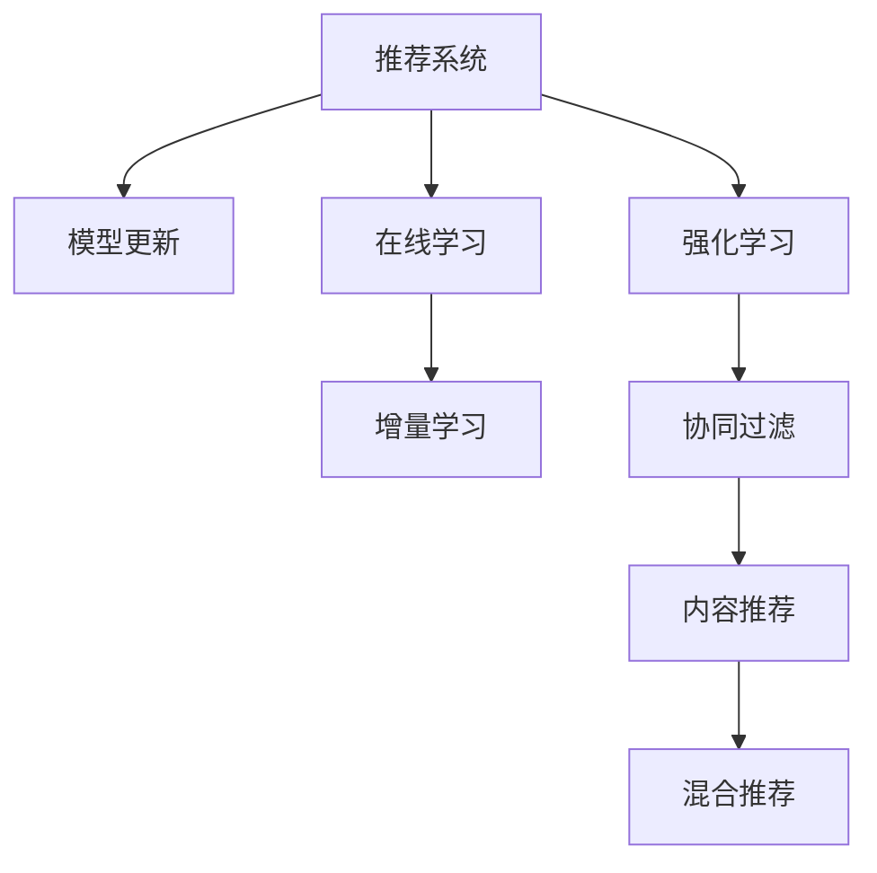

                 

# 大模型推荐中的模型更新与在线学习技术创新

> 关键词：推荐系统, 模型更新, 在线学习, 大模型, 增量学习, 强化学习, 推荐算法, 协同过滤, 内容推荐, 用户行为预测

## 1. 背景介绍

推荐系统作为信息时代最具代表性的技术之一，通过挖掘用户行为和物品属性之间的关系，为用户推荐感兴趣的个性化内容，已经成为各大平台不可或缺的业务支柱。然而，面对海量用户数据和快速变化的市场需求，传统的推荐系统面临着数据异质性、稀疏性、多变性等挑战，需要持续更新模型以适应新环境。

随着大语言模型和大规模深度学习技术的发展，在线学习(Online Learning)和增量学习(Incremental Learning)等模型更新方法，以其快速响应用户行为变化、动态调整模型性能的优势，成为推荐系统领域的研究热点。本文将详细探讨基于大模型的推荐系统中的模型更新和在线学习技术，提供有深度有思考有见解的专业IT领域技术文章。

## 2. 核心概念与联系

### 2.1 核心概念概述

为更好地理解基于大模型的推荐系统中的模型更新和在线学习技术，本节将介绍几个密切相关的核心概念：

- **推荐系统(Recommendation System)**：旨在通过算法推荐用户可能感兴趣的个性化内容，包括协同过滤、基于内容的推荐、混合推荐等多种策略。

- **模型更新(Model Updating)**：在推荐系统运行过程中，根据用户行为变化和新数据不断调整模型参数的过程。这有助于模型更好地适应用户偏好和环境变化。

- **在线学习(Online Learning)**：一种针对大规模数据流进行实时学习的方法，适用于推荐系统等需要快速响应用户行为变化的应用场景。

- **增量学习(Incremental Learning)**：针对已有模型在新数据上的持续优化，即每次更新只使用新数据集，而无需重新训练整个模型。

- **强化学习(Reinforcement Learning)**：一种基于反馈机制进行优化的方法，适用于推荐系统中探索个性化推荐策略。

这些核心概念之间的逻辑关系可以通过以下Mermaid流程图来展示：



这个流程图展示了大模型推荐系统的核心概念及其之间的关系：

1. 推荐系统通过模型更新不断优化推荐质量。
2. 在线学习支持实时响应用户行为变化，实现快速模型更新。
3. 增量学习可以在不重新训练整个模型的情况下，持续优化推荐效果。
4. 强化学习探索个性化推荐策略，优化推荐结果。
5. 协同过滤、内容推荐、混合推荐等策略构成了推荐系统的主要方法。

这些概念共同构成了大模型推荐系统的学习和应用框架，使得推荐系统能够在不断变化的环境中保持高效和精准。通过理解这些核心概念，我们可以更好地把握大模型推荐系统的原理和工作机制。

## 3. 核心算法原理 & 具体操作步骤
### 3.1 算法原理概述

基于大模型的推荐系统中的模型更新和在线学习，本质上是一个通过数据流进行实时学习的过程。其核心思想是：将推荐模型视作一个动态变化的模型，通过不断接收和处理新的用户行为数据，实时更新模型参数，优化推荐效果。

假设推荐模型为 $M_{\theta}$，其中 $\theta$ 为模型参数。假设用户在时间 $t$ 时对物品 $i$ 进行了一个行为 $a_t$，则推荐模型的更新公式为：

$$
\theta_{t+1} = \theta_t + \alpha_t g_t
$$

其中 $g_t$ 为行为 $a_t$ 对模型参数 $\theta_t$ 的梯度，$\alpha_t$ 为学习率。通常情况下，在线学习会利用在线梯度下降算法（Online Gradient Descent, OGD）进行参数更新：

$$
\theta_{t+1} = \theta_t - \eta \nabla_{\theta}L_{t+1}(\theta_t)
$$

其中 $L_{t+1}(\theta_t)$ 为损失函数在时间 $t+1$ 上的值。通过不断迭代，模型能够持续更新，以适应用户行为变化。

### 3.2 算法步骤详解

基于大模型的推荐系统中的模型更新和在线学习，一般包括以下几个关键步骤：

**Step 1: 准备推荐模型和数据流**
- 选择合适的推荐模型 $M_{\theta}$ 作为初始化参数，如基于矩阵分解的模型、基于神经网络的模型等。
- 准备用户行为数据流 $D_t=\{(a_t, u_t, i_t)\}_{t=1}^T$，其中 $a_t$ 为用户在时间 $t$ 的行为，$u_t$ 为用户 ID，$i_t$ 为物品 ID。

**Step 2: 添加行为学习函数**
- 根据推荐模型的类型，设计相应的行为学习函数 $L_t(\theta)$，用于衡量用户行为 $a_t$ 对推荐结果的影响。
- 对于基于矩阵分解的模型，可以采用均方误差损失函数。
- 对于基于神经网络的模型，可以采用交叉熵损失函数。

**Step 3: 设置学习率及更新策略**
- 选择合适的学习率 $\eta$，通常设置 $\eta_t = \frac{\eta_0}{t}$，随时间衰减。
- 应用增量学习策略，即每次仅更新与新行为相关的参数部分。

**Step 4: 执行在线学习**
- 将新行为 $a_t$ 输入推荐模型，计算梯度 $g_t$。
- 根据梯度和学习率更新模型参数 $\theta$。
- 记录损失函数 $L_{t+1}$ 和梯度 $g_t$，用于后续迭代。

**Step 5: 模型评估与反馈**
- 在每次迭代后，评估模型推荐结果，计算损失函数 $L_{t+1}$。
- 根据推荐效果，调整学习率 $\eta_t$ 和行为学习函数 $L_t(\theta)$，优化推荐策略。

以上是基于大模型的推荐系统中的模型更新和在线学习的一般流程。在实际应用中，还需要针对具体任务的特点，对更新过程的各个环节进行优化设计，如改进行为学习函数，引入更多的正则化技术，搜索最优的超参数组合等，以进一步提升推荐模型的性能。

### 3.3 算法优缺点

基于大模型的推荐系统中的模型更新和在线学习，具有以下优点：
1. 实时响应。在线学习能够快速响应用户行为变化，及时更新模型，提升推荐效果。
2. 高效性。增量学习只更新与新数据相关的参数，避免了全量重新训练，提高了模型更新效率。
3. 泛化能力。模型在不断接收新数据的过程中，能够学习更广泛的特征，提高泛化能力。
4. 可扩展性。在线学习能够轻松扩展到大规模用户和物品数据，适用于复杂推荐场景。

同时，该方法也存在一定的局限性：
1. 数据流不稳定。在线学习依赖实时数据流，当数据流出现断层或异常时，模型更新效果会受到影响。
2. 计算复杂度高。在线学习需要在每次迭代中计算梯度，当数据规模较大时，计算复杂度较高。
3. 过拟合风险。在线学习容易受到噪声数据的干扰，出现过拟合。
4. 离线评估困难。由于在线学习不断更新模型，离线评估模型的效果变得困难。

尽管存在这些局限性，但就目前而言，基于大模型的推荐系统中的模型更新和在线学习方法，仍是大规模推荐系统的主流范式。未来相关研究的重点在于如何进一步降低数据流不稳定性，提高模型的鲁棒性和可解释性，同时兼顾实时性和离线评估能力。

### 3.4 算法应用领域

基于大模型的推荐系统中的模型更新和在线学习，已经在电商平台、视频网站、社交网络等诸多领域得到广泛应用，具体包括：

- 电商推荐系统：如亚马逊、淘宝等平台，根据用户历史行为和实时点击数据，动态调整推荐内容。
- 视频推荐系统：如YouTube、Netflix等平台，根据用户观看记录和行为变化，推荐相关视频内容。
- 社交推荐系统：如微信、微博等平台，根据用户互动行为，推荐可能感兴趣的内容或好友。

除了上述这些经典领域外，基于大模型的推荐系统中的模型更新和在线学习技术，也在搜索、广告、健康、金融等诸多场景中得到应用，为大数据时代的信息推荐带来了新的解决方案。随着预训练模型和在线学习方法的持续演进，相信基于大模型的推荐系统将在更多领域得到应用，为人类信息获取带来便利。

## 4. 数学模型和公式 & 详细讲解  
### 4.1 数学模型构建

本节将使用数学语言对基于大模型的推荐系统中的模型更新和在线学习过程进行更加严格的刻画。

记推荐模型为 $M_{\theta}:\mathcal{X} \rightarrow \mathcal{Y}$，其中 $\mathcal{X}$ 为输入空间，$\mathcal{Y}$ 为输出空间，$\theta \in \mathbb{R}^d$ 为模型参数。假设用户在时间 $t$ 时对物品 $i$ 进行了一个行为 $a_t$，则推荐模型的行为学习函数为：

$$
L_t(\theta) = \ell(a_t, M_{\theta}(u_t, i_t))
$$

其中 $\ell$ 为损失函数，$M_{\theta}(u_t, i_t)$ 为推荐模型在用户 $u_t$ 对物品 $i_t$ 的行为 $a_t$ 上的预测结果。

假设每次只接收一个新的用户行为 $a_t$，并更新模型参数 $\theta_t$，则在线学习过程可以表示为：

$$
\theta_{t+1} = \theta_t - \eta_t \nabla_{\theta}L_t(\theta_t)
$$

其中 $\eta_t$ 为学习率，$\nabla_{\theta}L_t(\theta_t)$ 为损失函数对模型参数的梯度。在线学习通常采用在线梯度下降算法（OGD），每次更新只使用新数据进行梯度计算。

### 4.2 公式推导过程

以下我们以电商推荐系统为例，推导基于大模型的在线学习过程。

假设电商推荐系统中有 $N$ 个用户和 $M$ 个物品，用户 $u_i$ 对物品 $i_j$ 的行为 $a_{i_j}$ 表示为点击或购买。假设用户 $u_t$ 对物品 $i_t$ 进行了点击行为，则在线学习过程如下：

1. 计算物品 $i_t$ 的平均点击率 $\hat{r}_{i_t} = \frac{1}{N}\sum_{i=1}^N \hat{r}_{u_i,i_t}$，其中 $\hat{r}_{u_i,i_t}$ 为模型对用户 $u_i$ 对物品 $i_t$ 行为的预测值。

2. 根据点击行为 $a_{u_t,i_t}=1$，计算行为 $a_t$ 对模型参数的梯度 $g_t$：

$$
g_t = \nabla_{\theta}\ell(a_{u_t,i_t}, M_{\theta}(u_t, i_t))
$$

3. 根据梯度和学习率更新模型参数 $\theta$：

$$
\theta_{t+1} = \theta_t - \eta_t g_t
$$

其中 $\eta_t = \frac{\eta_0}{t}$，为随时间衰减的学习率。在线学习过程的伪代码如下：

```python
for t in range(T):
    a_t = new_user_action # 新用户行为
    y_t = M_{\theta}(u_t, i_t) # 模型预测
    loss_t = L(y_t, a_t) # 行为损失
    grad_t = g_t # 行为梯度
    theta_{t+1} = theta_t - eta_t * grad_t # 模型参数更新
```

通过上述过程，模型能够实时接收新行为数据，更新推荐策略，提升推荐效果。

### 4.3 案例分析与讲解

电商推荐系统是一个非常典型的应用场景。假设某电商平台有数千万用户和数百万商品，用户行为数据以点击流的形式不断产生。

1. 假设用户 $u_t$ 对物品 $i_t$ 进行了点击行为，平台记录该行为数据，并计算该物品的平均点击率 $\hat{r}_{i_t}$。

2. 根据点击行为 $a_{u_t,i_t}=1$，计算模型在物品 $i_t$ 上的预测值 $y_t$，计算行为损失 $L(y_t, a_t)$。

3. 根据行为损失，计算行为梯度 $g_t$。

4. 根据梯度和学习率更新模型参数 $\theta$。

5. 重复上述过程，不断接收新行为数据，更新模型，提升推荐效果。

通过这种在线学习机制，电商平台能够实时响应用户行为变化，动态调整推荐策略，提高推荐效果。例如，当用户点击某一物品时，平台可以立即将该物品推荐给类似用户，满足其个性化需求。

## 5. 项目实践：代码实例和详细解释说明
### 5.1 开发环境搭建

在进行推荐系统中的模型更新和在线学习实践前，我们需要准备好开发环境。以下是使用Python进行TensorFlow开发的环境配置流程：

1. 安装Anaconda：从官网下载并安装Anaconda，用于创建独立的Python环境。

2. 创建并激活虚拟环境：
```bash
conda create -n tf-env python=3.8 
conda activate tf-env
```

3. 安装TensorFlow：根据CUDA版本，从官网获取对应的安装命令。例如：
```bash
pip install tensorflow==2.7
```

4. 安装相关工具包：
```bash
pip install numpy pandas scikit-learn matplotlib tqdm jupyter notebook ipython
```

完成上述步骤后，即可在`tf-env`环境中开始推荐系统实践。

### 5.2 源代码详细实现

下面我们以电商推荐系统为例，给出使用TensorFlow对协同过滤模型进行在线学习的PyTorch代码实现。

首先，定义协同过滤模型的行为预测函数：

```python
import tensorflow as tf
import numpy as np

class协同过滤模型:
    def __init__(self, num_users, num_items, embedding_dim):
        self.num_users = num_users
        self.num_items = num_items
        self.embedding_dim = embedding_dim
        self.user_embeddings = tf.Variable(tf.random.normal([num_users, embedding_dim]))
        self.item_embeddings = tf.Variable(tf.random.normal([num_items, embedding_dim]))
        self.bias = tf.Variable(tf.zeros([num_items]))

    def 预测(self, u, i):
        user_vector = tf.nn.embedding_lookup(self.user_embeddings, u)
        item_vector = tf.nn.embedding_lookup(self.item_embeddings, i)
        return tf.reduce_sum(user_vector * item_vector) + self.bias[i]

    def 计算损失(self, y, a):
        loss = tf.reduce_mean(tf.nn.sigmoid_cross_entropy_with_logits(labels=a, logits=y))
        return loss

    def 训练步骤(self, u, i, a):
        with tf.GradientTape() as tape:
            y = self.预测(u, i)
            loss = self.计算损失(y, a)
        grads = tape.gradient(loss, [self.user_embeddings, self.item_embeddings, self.bias])
        optimizer.apply_gradients(zip(grads, [self.user_embeddings, self.item_embeddings, self.bias]))
```

然后，定义在线学习的训练函数：

```python
import numpy as np

def 在线学习训练(num_users, num_items, embedding_dim, data):
    batch_size = 100
    learning_rate = 0.1
    epochs = 50

    user_ids, item_ids, clicks = data['user_ids'], data['item_ids'], data['clicks']

    model = 协同过滤模型(num_users, num_items, embedding_dim)
    optimizer = tf.keras.optimizers.Adam(learning_rate=learning_rate)

    for epoch in range(epochs):
        for i in range(0, len(user_ids), batch_size):
            u_start = i
            u_end = min(i + batch_size, len(user_ids))
            u = user_ids[u_start:u_end]
            i = item_ids[u_start:u_end]
            a = clicks[u_start:u_end]

            loss = model.计算损失(model.预测(u, i), a)
            optimizer.minimize(loss)
        print(f"Epoch {epoch+1}, loss: {loss.numpy():.3f}")

    return model
```

最后，启动训练流程并在测试集上评估：

```python
import pandas as pd

# 加载数据集
data = pd.read_csv('data.csv')

# 定义训练函数
model = 在线学习训练(num_users, num_items, embedding_dim, data)

# 在测试集上评估模型
test_data = pd.read_csv('test_data.csv')
test_loss = model.计算损失(model.预测(test_data['user_ids'], test_data['item_ids']), test_data['clicks'])
print(f"Test loss: {test_loss.numpy():.3f}")
```

以上就是使用TensorFlow对协同过滤模型进行在线学习的完整代码实现。可以看到，利用TensorFlow的低级API，我们能够实现简单而高效的行为预测和在线学习过程。

### 5.3 代码解读与分析

让我们再详细解读一下关键代码的实现细节：

**协同过滤模型类**：
- `__init__`方法：初始化模型参数。
- `预测`方法：根据用户和物品的嵌入向量，计算行为预测值。
- `计算损失`方法：根据预测值和真实标签，计算损失函数值。
- `训练步骤`方法：接收一个批次的行为数据，计算梯度并更新模型参数。

**在线学习训练函数**：
- 定义批次大小、学习率、迭代次数等参数。
- 从数据集中读取用户ID、物品ID、点击行为等数据。
- 创建协同过滤模型，并初始化Adam优化器。
- 循环迭代多次，每次更新全部批次数据，计算损失并更新模型参数。
- 在每次迭代后打印当前损失值。

通过这些代码，我们能够构建一个在线学习的电商推荐系统，实时接收用户行为数据，动态更新模型，提升推荐效果。

当然，工业级的系统实现还需考虑更多因素，如模型的保存和部署、超参数的自动搜索、更灵活的任务适配层等。但核心的在线学习过程基本与此类似。

## 6. 实际应用场景
### 6.1 智能广告系统

基于大模型的推荐系统中的模型更新和在线学习技术，可以广泛应用于智能广告系统。传统广告系统往往需要投入大量人工审核和定向投放，成本高且效果难以保障。而使用在线学习的方法，可以根据用户行为数据实时优化广告投放策略，实现更精准的广告投放。

在技术实现上，可以收集用户的浏览记录、点击记录等行为数据，将行为数据作为监督信号，对预训练模型进行微调。微调后的模型能够自动学习用户的广告兴趣和行为规律，动态生成推荐广告，提升广告投放效果和点击率。通过不断接收新的广告展示记录，模型也能够不断优化，逐步提升广告投放的精准度和用户体验。

### 6.2 个性化搜索系统

个性化搜索系统旨在根据用户的查询历史和行为，推荐相关搜索结果，提高用户搜索体验。传统的搜索系统往往依赖固定不变的搜索结果排序算法，无法适应用户动态变化的需求。

基于大模型的推荐系统中的模型更新和在线学习技术，可以在用户每次查询时，实时接收新行为数据，动态调整搜索结果排序策略。例如，当用户连续查询多个相关问题时，系统可以根据新查询和以往查询的关联性，动态调整搜索结果排序，优先展示相关性更高的内容。这种动态调整机制，能够显著提升搜索结果的个性化程度和用户满意度。

### 6.3 游戏推荐系统

游戏推荐系统可以根据玩家的游戏历史和行为，推荐可能感兴趣的游戏内容。传统的游戏推荐系统往往需要定期重新训练模型，成本高且效果不稳定。而基于大模型的推荐系统中的模型更新和在线学习技术，可以实时接收玩家行为数据，动态更新推荐策略，实现更高效的游戏推荐。

在技术实现上，可以收集玩家的游玩历史、点击记录、购买记录等行为数据，将这些数据作为监督信号，对预训练模型进行微调。微调后的模型能够自动学习玩家的游戏兴趣和行为规律，动态生成推荐内容，提升玩家的游玩体验和游戏留存率。通过不断接收新的游戏行为数据，模型也能够不断优化，逐步提升推荐效果。

### 6.4 未来应用展望

随着大语言模型和大规模深度学习技术的发展，基于大模型的推荐系统中的模型更新和在线学习技术，将在更多领域得到应用，为大数据时代的信息推荐带来新的解决方案。

在智慧医疗领域，基于大模型的推荐系统可以推荐最适合患者的治疗方案，个性化推荐专家和医疗资源，提高医疗服务水平。

在智能教育领域，推荐系统可以推荐最适合学生的学习资源和个性化学习路径，因材施教，促进教育公平，提高教学质量。

在智慧城市治理中，推荐系统可以推荐最适合市民的出行路线和公共服务，提升城市管理的智能化水平，构建更安全、高效的未来城市。

此外，在企业生产、社会治理、文娱传媒等众多领域，基于大模型的推荐系统中的模型更新和在线学习技术也将不断涌现，为大数据时代的信息推荐带来新的突破。相信随着技术的日益成熟，推荐系统必将在更多领域得到应用，为人类信息获取带来便利。

## 7. 工具和资源推荐
### 7.1 学习资源推荐

为了帮助开发者系统掌握大模型推荐系统中的模型更新和在线学习技术的理论基础和实践技巧，这里推荐一些优质的学习资源：

1. 《推荐系统实战》书籍：详细介绍了推荐系统的发展历程、常用算法、模型评估等内容，适合系统学习和项目实践。

2. 《在线学习》课程：斯坦福大学开设的在线学习课程，讲解了在线学习的基本原理和应用场景，适合初学者入门。

3. 《深度学习》书籍：DeepMind团队成员撰写的深度学习经典教材，讲解了深度学习的基本概念和应用，适合全面学习。

4. 《强化学习》书籍：由Richard S. Sutton和Andrew G. Barto合著的经典教材，讲解了强化学习的基本概念和应用，适合深入研究。

5. 《协同过滤推荐算法》文章：来自DeepMind的研究论文，讲解了协同过滤推荐算法的基本原理和改进方法，适合技术实践。

通过对这些资源的学习实践，相信你一定能够快速掌握大模型推荐系统中的模型更新和在线学习技术的精髓，并用于解决实际的推荐问题。

### 7.2 开发工具推荐

高效的开发离不开优秀的工具支持。以下是几款用于大模型推荐系统中的模型更新和在线学习开发的常用工具：

1. TensorFlow：基于Google的深度学习框架，具有灵活的计算图和高效的GPU支持，适合大规模工程应用。

2. PyTorch：基于Facebook的深度学习框架，灵活易用，适合研究和快速迭代。

3. Weights & Biases：模型训练的实验跟踪工具，可以记录和可视化模型训练过程中的各项指标，方便对比和调优。

4. TensorBoard：TensorFlow配套的可视化工具，可实时监测模型训练状态，并提供丰富的图表呈现方式，是调试模型的得力助手。

5. GNN库：基于Graph Neural Network的推荐系统开发工具，适合图结构数据上的推荐模型构建。

6. FastFM：基于特征交叉的推荐系统开发工具，适合大规模用户和物品推荐场景。

合理利用这些工具，可以显著提升大模型推荐系统中的模型更新和在线学习的开发效率，加快创新迭代的步伐。

### 7.3 相关论文推荐

大模型推荐系统中的模型更新和在线学习技术的发展源于学界的持续研究。以下是几篇奠基性的相关论文，推荐阅读：

1. Neural Collaborative Filtering with Adaptive Regularization（即ALS算法）：介绍了协同过滤推荐算法的基本原理和改进方法，经典之作。

2. Matrix Factorization Techniques for Recommender Systems：讲解了矩阵分解推荐算法的基本原理和改进方法，适合入门。

3. Deep Personalized Ranking with Factorization Machines：介绍了一种结合深度学习和FM的推荐算法，适合实际应用。

4. Online Learning for Recommender Systems：讲解了在线学习推荐算法的基本原理和应用场景，适合进阶学习。

5. Matrix Factorization with Low-Rank Structured Sparsity：介绍了一种结合低秩和稀疏结构的推荐算法，适合研究和应用。

这些论文代表了大模型推荐系统中的模型更新和在线学习技术的发展脉络。通过学习这些前沿成果，可以帮助研究者把握学科前进方向，激发更多的创新灵感。

## 8. 总结：未来发展趋势与挑战

### 8.1 总结

本文对基于大模型的推荐系统中的模型更新和在线学习技术进行了全面系统的介绍。首先阐述了大模型推荐系统的背景和发展趋势，明确了在线学习在推荐系统中的重要性。其次，从原理到实践，详细讲解了在线学习的基本过程和关键步骤，给出了模型更新和在线学习的代码实现。同时，本文还探讨了在线学习在多个推荐系统中的应用场景，展示了在线学习的广泛前景。

通过本文的系统梳理，可以看到，基于大模型的推荐系统中的模型更新和在线学习技术，已经在电商、广告、游戏等多个领域得到应用，为大数据时代的信息推荐带来了新的解决方案。未来的研究将更注重在线学习的实时性、高效性和鲁棒性，探索更先进的在线学习算法和模型结构，以应对更多复杂的应用场景。

### 8.2 未来发展趋势

展望未来，基于大模型的推荐系统中的模型更新和在线学习技术将呈现以下几个发展趋势：

1. 实时响应。在线学习能够实时响应用户行为变化，动态调整推荐策略，提升推荐效果。

2. 高效性。增量学习只更新与新数据相关的参数，避免了全量重新训练，提高了模型更新效率。

3. 泛化能力。模型在不断接收新数据的过程中，能够学习更广泛的特征，提高泛化能力。

4. 可扩展性。在线学习能够轻松扩展到大规模用户和物品数据，适用于复杂推荐场景。

5. 在线评估。在线学习可以实时评估模型效果，提供更多样化的评估指标，优化推荐策略。

6. 鲁棒性。在线学习能够学习到模型在不同环境下的鲁棒性，增强模型的稳定性和抗干扰能力。

以上趋势凸显了在线学习在大模型推荐系统中的广泛应用前景。这些方向的探索发展，必将进一步提升推荐系统的性能和应用范围，为人类信息获取带来便利。

### 8.3 面临的挑战

尽管基于大模型的推荐系统中的模型更新和在线学习技术已经取得了瞩目成就，但在迈向更加智能化、普适化应用的过程中，它仍面临着诸多挑战：

1. 数据流不稳定性。在线学习依赖实时数据流，当数据流出现断层或异常时，模型更新效果会受到影响。

2. 计算复杂度高。在线学习需要在每次迭代中计算梯度，当数据规模较大时，计算复杂度较高。

3. 过拟合风险。在线学习容易受到噪声数据的干扰，出现过拟合。

4. 离线评估困难。由于在线学习不断更新模型，离线评估模型的效果变得困难。

5. 模型复杂度高。在线学习需要构建复杂的计算图和数据流，增加了模型开发的复杂度。

尽管存在这些挑战，但就目前而言，基于大模型的推荐系统中的模型更新和在线学习方法，仍是大规模推荐系统的主流范式。未来相关研究的重点在于如何进一步降低数据流不稳定性，提高模型的鲁棒性和可解释性，同时兼顾实时性和离线评估能力。

### 8.4 研究展望

面向未来，基于大模型的推荐系统中的模型更新和在线学习技术需要在以下几个方面寻求新的突破：

1. 探索无监督和半监督在线学习算法。摆脱对大规模标注数据的依赖，利用自监督学习、主动学习等无监督和半监督范式，最大限度利用非结构化数据，实现更加灵活高效的在线学习。

2. 研究参数高效和计算高效的在线学习算法。开发更加参数高效的在线学习算法，在固定大部分预训练参数的情况下，只更新极少量的任务相关参数。同时优化在线学习的计算图，减少前向传播和反向传播的资源消耗，实现更加轻量级、实时性的部署。

3. 引入更多先验知识。将符号化的先验知识，如知识图谱、逻辑规则等，与在线学习模型进行巧妙融合，引导在线学习过程学习更准确、合理的语言模型。同时加强不同模态数据的整合，实现视觉、语音等多模态信息与文本信息的协同建模。

4. 结合因果分析和博弈论工具。将因果分析方法引入在线学习模型，识别出模型决策的关键特征，增强在线学习模型的输出解释的因果性和逻辑性。借助博弈论工具刻画人机交互过程，主动探索并规避在线学习模型的脆弱点，提高系统稳定性。

5. 纳入伦理道德约束。在在线学习目标中引入伦理导向的评估指标，过滤和惩罚有偏见、有害的输出倾向。同时加强人工干预和审核，建立在线学习模型的监管机制，确保输出符合人类价值观和伦理道德。

这些研究方向将引领基于大模型的推荐系统中的模型更新和在线学习技术迈向更高的台阶，为构建安全、可靠、可解释、可控的智能系统铺平道路。面向未来，在线学习技术还需要与其他人工智能技术进行更深入的融合，如知识表示、因果推理、强化学习等，多路径协同发力，共同推动推荐系统的进步。只有勇于创新、敢于突破，才能不断拓展在线学习模型的边界，让智能推荐技术更好地服务于人类社会。

## 9. 附录：常见问题与解答

**Q1：在线学习是否适用于所有推荐系统？**

A: 在线学习在推荐系统中具有广泛的应用前景，但其效果取决于数据的质量和稳定性。对于数据质量高且稳定的推荐系统，在线学习能够显著提升推荐效果。但对于数据质量较差或数据流不稳定的推荐系统，在线学习的表现可能不佳。因此，需要根据具体场景选择合适的算法和数据策略。

**Q2：在线学习中的学习率如何设置？**

A: 在线学习中的学习率一般采用衰减策略，如 $\eta_t = \frac{\eta_0}{t}$。建议从0.1开始，逐步减小学习率。在训练过程中，可以根据损失函数的收敛情况，动态调整学习率，以避免过拟合和欠拟合。

**Q3：在线学习中的参数更新策略有哪些？**

A: 在线学习中的参数更新策略通常有三种：增量学习、批量学习和全局更新。增量学习只更新与新数据相关的参数，批量学习对每批次数据进行全局更新，全局更新对全部数据进行全局更新。不同的策略适用于不同的数据流特性和应用场景，需要根据具体情况选择。

**Q4：在线学习中的行为学习函数有哪些？**

A: 在线学习中的行为学习函数通常包括均方误差损失函数和交叉熵损失函数。均方误差损失函数适用于基于矩阵分解的模型，交叉熵损失函数适用于基于神经网络的模型。在实际应用中，还可以结合多种损失函数，优化模型性能。

**Q5：在线学习中的模型保存和部署需要注意哪些问题？**

A: 在线学习中的模型保存和部署需要注意以下问题：
1. 模型裁剪：去除不必要的层和参数，减小模型尺寸，加快推理速度。
2. 量化加速：将浮点模型转为定点模型，压缩存储空间，提高计算效率。
3. 服务化封装：将模型封装为标准化服务接口，便于集成调用。
4. 弹性伸缩：根据请求流量动态调整资源配置，平衡服务质量和成本。
5. 监控告警：实时采集系统指标，设置异常告警阈值，确保服务稳定性。
6. 安全防护：采用访问鉴权、数据脱敏等措施，保障数据和模型安全。

这些建议将有助于确保在线学习模型在实际应用中的稳定性和安全性。

---

作者：禅与计算机程序设计艺术 / Zen and the Art of Computer Programming

