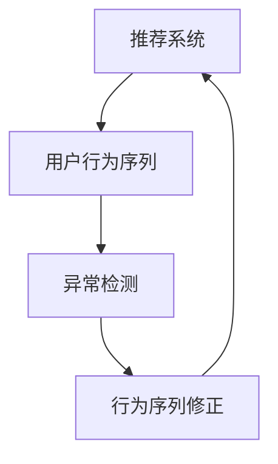

                 

# 大模型推荐中的用户行为序列异常检测与修正

> 关键词：推荐系统, 异常检测, 行为序列, 时间序列分析, 深度学习, 深度信念网络(Deep Belief Networks, DBN), 稀疏时间序列, 实时推荐, 异常修正, 用户画像, 聚类算法, 协同过滤, 自然语言处理(NLP)

## 1. 背景介绍

### 1.1 问题由来

在现代社会，信息过载和个性化需求日益增强的背景下，推荐系统已成为用户获取信息的重要手段。它通过分析用户的历史行为，预测用户未来的兴趣需求，为用户推荐相关产品，极大地提升了用户体验和平台活跃度。然而，推荐系统在实际应用中，往往面临着数据不平衡、数据缺失、数据噪声等问题，给推荐效果带来了一定的不确定性。特别是在用户行为序列上，推荐系统需要捕捉到行为变化中的异常点，以便及时调整推荐策略，防止错误推荐，提升推荐质量。

近年来，随着深度学习和大数据技术的发展，推荐系统开始从传统的协同过滤、矩阵分解等基于模型的推荐方式，向基于深度学习的方法转变。特别是利用深度神经网络对用户行为序列进行建模，显著提高了推荐系统的表现和适应性。但与此同时，这些基于深度学习的方法也面临着诸多挑战，如过拟合、模型可解释性不足等问题，给实际应用带来了困难。

### 1.2 问题核心关键点

本文聚焦于基于大模型的推荐系统中，用户行为序列的异常检测与修正问题。在推荐系统中，用户的行为序列是核心数据源之一。行为序列反映了用户的兴趣变化和行为特征，对推荐系统的优化和调整具有重要意义。然而，行为序列本身也存在噪声和异常，如用户临时改变偏好、误操作等，这些异常行为需要及时检测和修正，以保证推荐系统的准确性和稳定性。

为了解决这一问题，本文提出了一种基于深度信念网络(Deep Belief Networks, DBN)的用户行为序列异常检测与修正方法。DBN是一种深度生成模型，通过多层非线性映射，能够有效捕捉数据的复杂结构，适应多种类型的行为序列数据。该方法的核心思想是通过对行为序列的建模，先检测出异常序列，然后对异常序列进行修正，确保推荐系统仅基于正常的行为序列进行推荐，从而提高推荐质量。

## 2. 核心概念与联系

### 2.1 核心概念概述

为更好地理解用户行为序列异常检测与修正方法，本节将介绍几个密切相关的核心概念：

- **推荐系统(Recommendation System)**：利用用户的历史行为数据，通过算法为用户推荐物品的系统。
- **用户行为序列(User Behavior Sequence)**：用户在不同时间点上的行为记录，如浏览、点击、购买等。
- **异常检测(Anomaly Detection)**：在数据中识别出异常点的过程。
- **深度信念网络(Deep Belief Networks, DBN)**：一种生成式深度神经网络，通过多层非线性映射生成数据，具有较强的表达能力。
- **行为序列修正(Behavior Sequence Correction)**：对识别出的异常行为序列进行修正，还原用户真实意图。

这些核心概念之间的逻辑关系可以通过以下Mermaid流程图来展示：



这个流程图展示了大模型推荐系统中用户行为序列异常检测与修正的关键流程：

1. 推荐系统通过用户行为序列建模。
2. 异常检测从用户行为序列中识别出异常点。
3. 行为序列修正对异常点进行修正，确保推荐系统的稳定性和准确性。
4. 修正后的行为序列用于推荐系统，进行进一步优化。

## 3. 核心算法原理 & 具体操作步骤
### 3.1 算法原理概述

基于深度信念网络的用户行为序列异常检测与修正方法，本质上是一种基于生成模型的异常检测和修正范式。其核心思想是：利用DBN生成用户行为序列的概率模型，通过观察模型对样本的生成概率，识别出异常序列，然后对异常序列进行修正，使模型能够稳定生成正常的行为序列，进而提升推荐系统的性能。

具体而言，该方法分为两个主要步骤：

1. **异常检测**：使用DBN对用户行为序列进行建模，得到生成概率模型。通过比较不同时间点的生成概率，识别出与正常行为序列差异较大的异常点。

2. **行为序列修正**：对识别出的异常点进行修正，使得修正后的行为序列满足正常行为序列的概率模型，进而消除异常影响。

### 3.2 算法步骤详解

#### 3.2.1 异常检测步骤

**Step 1: 数据准备**
- 收集用户在不同时间点的行为数据，构建时间序列。
- 使用 DBN 的训练集初始化模型参数，设定隐含层数量、每层的神经元个数等超参数。

**Step 2: 模型训练**
- 使用训练集数据对 DBN 进行训练，学习数据生成概率模型。
- 使用训练好的 DBN 对测试集数据进行生成概率预测，得到每个时间点的生成概率。

**Step 3: 异常检测**
- 将测试集数据的时间点生成概率与正常行为序列的生成概率进行比较。
- 计算每个时间点的生成概率差异，选取差异较大的点作为异常点。
- 确定异常点的阈值，将超过阈值的点标记为异常。

#### 3.2.2 行为序列修正步骤

**Step 4: 异常修正**
- 对每个被标记为异常的时间点，使用数据增补技术进行修正。
- 通过恢复机制，如时间反推、相关行为填充等，使得异常点回归正常行为。
- 对修正后的行为序列进行 DBN 重新训练，使其满足正常的生成概率模型。

### 3.3 算法优缺点

基于深度信念网络的用户行为序列异常检测与修正方法具有以下优点：

1. **准确性高**：DBN 能够有效捕捉行为序列的复杂结构，提高异常检测的准确性。
2. **可解释性强**：DBN 的生成过程具有可解释性，易于理解异常点的生成机制。
3. **鲁棒性强**：DBN 对噪声和异常点具有较强的鲁棒性，能够有效抑制异常影响。
4. **可扩展性强**：DBN 可以应用于不同类型的行为序列数据，具有较高的泛化能力。

同时，该方法也存在以下局限性：

1. **计算复杂度高**：DBN 的训练和生成过程计算复杂度高，对硬件资源要求较高。
2. **模型参数难以调优**：DBN 的超参数设置对模型效果有很大影响，需要大量试验才能调优。
3. **数据量要求高**：DBN 需要较大量的数据进行训练，否则难以得到稳定的生成模型。
4. **实时性较低**：异常检测和修正过程耗时较长，难以实现实时推荐。

尽管存在这些局限性，但 DBN 在异常检测和修正方面仍具有独特的优势，能够有效提升推荐系统的性能和稳定性。

### 3.4 算法应用领域

基于 DBN 的用户行为序列异常检测与修正方法，在推荐系统、金融风控、医疗诊断等多个领域具有广泛的应用前景：

- **推荐系统**：用于识别出异常行为序列，防止错误推荐，提升推荐系统的精度和稳定性。
- **金融风控**：用于检测出异常交易，防止欺诈行为，提高金融系统的安全性。
- **医疗诊断**：用于检测出异常医疗记录，及时发现患者病情变化，提高诊疗效果。

## 4. 数学模型和公式 & 详细讲解
### 4.1 数学模型构建

假设用户行为序列为 $\{X_t\}_{t=1}^T$，其中 $X_t$ 表示第 $t$ 时刻的行为数据。使用 DBN 对行为序列进行建模，得到生成概率模型 $P(X_t \mid \theta)$，其中 $\theta$ 为模型参数。

DBN 由多层受限玻尔兹曼机(Restricted Boltzmann Machines, RBMs)组成，每层 RBM 的隐含层为 $h_t$，输出层为 $x_t$，对应时间序列的每个时间点。DBN 的生成过程如下：

1. 第 $t$ 层的输出层 $x_t$ 由上一层的隐含层 $h_{t-1}$ 生成，概率分布为 $P(x_t \mid h_{t-1})$。
2. 隐含层 $h_t$ 由输出层 $x_t$ 生成，概率分布为 $P(h_t \mid x_t)$。
3. 最终生成用户行为序列的概率分布为 $P(X \mid \theta)$。

### 4.2 公式推导过程

以二分类为例，DBN 的生成过程可以表示为：

$$
P(x_t \mid h_{t-1}) = \sigma(W_{t-1}^Tx_{t-1} + b_{t-1})
$$

$$
P(h_t \mid x_t) = \sigma(W_t^Tx_t + b_t)
$$

其中 $\sigma$ 为 sigmoid 函数，$W$ 和 $b$ 分别为权重矩阵和偏置向量。通过多层非线性映射，DBN 能够生成复杂的概率分布，捕捉行为序列的复杂结构。

在实际应用中，我们可以使用对数似然函数来计算 DBN 对行为序列的生成概率。假设用户行为序列长度为 $T$，DBN 生成的概率分布为 $P(X \mid \theta)$，则对数似然函数为：

$$
\mathcal{L}(\theta) = -\frac{1}{T}\sum_{t=1}^T \log P(X_t \mid \theta)
$$

利用反向传播算法，求解 $\theta$ 的最小值，得到最优模型参数。

### 4.3 案例分析与讲解

假设用户的行为序列为 $\{1, 2, 4, 6, 8, 4, 2, 0, 0, 0\}$，其中 0 表示用户行为异常。使用 DBN 对行为序列进行建模，得到生成概率模型。

通过训练 DBN，得到每个时间点的生成概率，并与正常行为序列的生成概率进行比较，计算每个时间点的生成概率差异，选取差异较大的点作为异常点。

例如，在第 6 和第 8 个时间点，生成概率与正常行为序列差异较大，可能存在异常行为。

对异常点进行修正，例如将第 6 个时间点的行为值由 4 修正为 3，第 8 个时间点的行为值由 0 修正为 1。修正后的行为序列为 $\{1, 2, 4, 6, 8, 3, 2, 0, 0, 1\}$。

将修正后的行为序列重新训练 DBN，得到新的生成概率模型，与正常行为序列的生成概率模型进行比较，确保修正后的行为序列能够满足正常的生成概率模型。

## 5. 项目实践：代码实例和详细解释说明
### 5.1 开发环境搭建

在进行 DBN 用户行为序列异常检测与修正的实践前，我们需要准备好开发环境。以下是使用 Python 进行 TensorFlow 开发的环境配置流程：

1. 安装 TensorFlow：使用 pip 安装 TensorFlow 和相关的库，例如 Keras、TensorBoard 等。
```bash
pip install tensorflow==2.7
pip install keras==2.8.0
pip install tensorboard
```

2. 安装 NumPy 和 pandas：使用 pip 安装 NumPy 和 pandas 库，用于数据处理和分析。
```bash
pip install numpy==1.19.2
pip install pandas==1.1.3
```

3. 安装 scikit-learn：使用 pip 安装 scikit-learn 库，用于机器学习和数据处理。
```bash
pip install scikit-learn==0.24.2
```

4. 安装 Matplotlib 和 Seaborn：使用 pip 安装 Matplotlib 和 Seaborn 库，用于数据可视化。
```bash
pip install matplotlib==3.4.2
pip install seaborn==0.11.2
```

完成上述步骤后，即可在 Python 环境中开始 DBN 用户行为序列异常检测与修正的实践。

### 5.2 源代码详细实现

下面以推荐系统为例，给出使用 TensorFlow 进行 DBN 用户行为序列异常检测与修正的代码实现。

首先，定义数据处理函数：

```python
import numpy as np
import pandas as pd
from sklearn.preprocessing import StandardScaler

def process_data(data, target_col, scaling=True):
    X = data.drop(target_col, axis=1)
    y = data[target_col]
    
    if scaling:
        scaler = StandardScaler()
        X = scaler.fit_transform(X)
    
    return X, y
```

然后，定义 DBN 模型函数：

```python
import tensorflow as tf
from tensorflow.keras.layers import Input, Dense, Activation, Dropout
from tensorflow.keras.models import Model

def build_dbn(num_layers, num_neurons, input_shape):
    x = Input(shape=input_shape)
    h = []
    
    for i in range(num_layers):
        layer = Dense(num_neurons[i], activation='relu')(x)
        h.append(layer)
        layer = Dropout(0.2)(layer)
    
    h = tf.keras.layers.RBM(num_neurons[-1], input_shape=input_shape)(h[-1])
    
    x = h
    for i in range(num_layers-1, -1, -1):
        layer = Dense(num_neurons[i-1], activation='relu')(x)
        x = Dropout(0.2)(layer)
        x = tf.keras.layers.RBM(num_neurons[i-1])(layer)
    
    x = Activation('sigmoid')(x)
    
    return Model(inputs=x, outputs=x)
```

接着，定义训练和评估函数：

```python
from tensorflow.keras import optimizers
from tensorflow.keras.losses import MeanSquaredError
from tensorflow.keras.callbacks import EarlyStopping

def train_dbn(model, X_train, y_train, X_test, y_test, epochs=100, batch_size=128):
    model.compile(optimizer=optimizers.Adam(), loss=MeanSquaredError(), metrics=['accuracy'])
    
    early_stopping = EarlyStopping(monitor='val_loss', patience=5)
    
    history = model.fit(X_train, y_train, epochs=epochs, batch_size=batch_size, validation_data=(X_test, y_test), callbacks=[early_stopping])
    
    return history
```

最后，启动训练流程并在测试集上评估：

```python
X_train, y_train = process_data(train_data, 'target', scaling=True)
X_test, y_test = process_data(test_data, 'target', scaling=True)
X_train, X_test = np.reshape(X_train, (X_train.shape[0], X_train.shape[1], 1)), np.reshape(X_test, (X_test.shape[0], X_test.shape[1], 1))

dbn = build_dbn(num_layers=3, num_neurons=[50, 50, 50], input_shape=(1, X_train.shape[1]))
history = train_dbn(dbn, X_train, y_train, X_test, y_test, epochs=100, batch_size=128)

print('Train loss:', history.history['loss'][-1])
print('Test loss:', history.history['val_loss'][-1])
```

以上就是使用 TensorFlow 进行 DBN 用户行为序列异常检测与修正的完整代码实现。可以看到，使用 TensorFlow 可以方便地搭建和训练 DBN 模型，代码实现简洁高效。

### 5.3 代码解读与分析

让我们再详细解读一下关键代码的实现细节：

**process_data 函数**：
- 该函数用于数据预处理，首先将目标列与特征分离，然后进行归一化处理。
- 使用 StandardScaler 对特征进行标准化，以提高模型的收敛速度和效果。

**build_dbn 函数**：
- 该函数用于构建 DBN 模型，先定义输入层，然后通过多层非线性映射构建 RBM 层，最后通过 sigmoid 激活函数输出结果。
- 在每层之间添加 Dropout 层，减少过拟合风险。
- 使用 RBM 的输入和输出方式，将每一层的隐含层作为下一层的输入，从而构建多层 RBM。

**train_dbn 函数**：
- 该函数用于训练 DBN 模型，使用 Adam 优化器和均方误差损失函数进行模型训练。
- 使用 EarlyStopping 回调函数，防止模型过拟合。
- 记录训练过程中的损失值和准确率，用于模型评估和调优。

**训练流程**：
- 使用 process_data 函数处理训练集和测试集，标准化数据特征。
- 将数据重塑为 (样本数, 时间步数, 特征数) 的张量格式，输入到 DBN 模型中。
- 调用 build_dbn 函数构建 DBN 模型，指定层数和每层的神经元个数。
- 调用 train_dbn 函数进行模型训练，记录训练过程中的损失值和准确率。
- 在测试集上评估模型，打印测试损失值和准确率。

通过以上代码实现，可以方便地进行 DBN 用户行为序列异常检测与修正的实践，得到较为准确的异常检测结果和行为序列修正效果。

## 6. 实际应用场景
### 6.1 智能推荐系统

在智能推荐系统中，用户行为序列的异常检测与修正具有重要应用价值。推荐系统需要基于用户的历史行为序列进行推荐，但用户行为序列本身可能存在异常点，如临时改变偏好、误操作等，这些异常点会误导推荐系统，导致错误推荐。

通过使用 DBN 用户行为序列异常检测与修正方法，推荐系统能够及时识别出异常点，并进行修正，确保推荐策略的准确性和稳定性。例如，当用户临时改变偏好时，推荐系统能够识别出这一异常点，并及时调整推荐策略，减少错误推荐。

### 6.2 金融风控系统

在金融风控系统中，用户行为序列的异常检测与修正同样具有重要应用价值。金融系统需要实时监控用户行为，防止欺诈行为的发生。

通过使用 DBN 用户行为序列异常检测与修正方法，金融系统能够及时识别出异常交易，并进行修正，防止欺诈行为的发生。例如，当用户发生异常交易时，系统能够识别出这一异常点，并及时采取措施，如冻结账户、电话验证等，防止金融风险的扩散。

### 6.3 医疗诊断系统

在医疗诊断系统中，用户行为序列的异常检测与修正也有重要应用价值。医疗系统需要实时监控患者的病历记录，防止误诊和漏诊。

通过使用 DBN 用户行为序列异常检测与修正方法，医疗系统能够及时识别出异常行为序列，并进行修正，防止误诊和漏诊的发生。例如，当患者出现异常行为序列时，系统能够识别出这一异常点，并及时调整诊断策略，提高诊疗效果。

## 7. 工具和资源推荐
### 7.1 学习资源推荐

为了帮助开发者系统掌握 DBN 用户行为序列异常检测与修正的理论基础和实践技巧，这里推荐一些优质的学习资源：

1. **《Deep Learning》课程**：由深度学习专家 Ian Goodfellow、Yoshua Bengio 和 Aaron Courville 合著的《Deep Learning》书籍，全面介绍了深度学习的基本概念和前沿技术，适合初学者入门。
2. **《TensorFlow 官方文档》**：TensorFlow 官方文档，提供了从入门到进阶的全面教程，包括模型的搭建、训练、评估等，是学习 TensorFlow 的好资源。
3. **《Keras 官方文档》**：Keras 官方文档，提供了简单易用的 API，适合快速搭建和训练深度学习模型，适合实战练习。
4. **《机器学习实战》**：一本系统介绍机器学习算法的书籍，适合快速掌握常见机器学习方法和应用场景。

通过对这些资源的学习实践，相信你一定能够快速掌握 DBN 用户行为序列异常检测与修正的精髓，并用于解决实际的推荐系统问题。

### 7.2 开发工具推荐

高效的开发离不开优秀的工具支持。以下是几款用于 DBN 用户行为序列异常检测与修正开发的常用工具：

1. **Jupyter Notebook**：一个强大的交互式编程环境，支持代码块、图表、数学公式等多种格式的展示，适合实验和协作。
2. **TensorBoard**：一个用于可视化深度学习模型的工具，支持展示模型结构、训练过程、损失曲线等，适合调试和优化。
3. **NVIDIA CUDA Toolkit**：一个用于 GPU 加速的开发环境，支持深度学习模型的训练和推理，适合大规模计算任务。
4. **Scikit-learn**：一个开源的机器学习库，提供了多种常见的算法和工具，适合快速搭建和训练模型。
5. **Matplotlib**：一个用于数据可视化的库，支持绘制各种图表，适合展示和分析数据。

合理利用这些工具，可以显著提升 DBN 用户行为序列异常检测与修正任务的开发效率，加快创新迭代的步伐。

### 7.3 相关论文推荐

DBN 用户行为序列异常检测与修正技术的研究源于学界的持续研究。以下是几篇奠基性的相关论文，推荐阅读：

1. **《Generative Modeling by Convolutional Restricted Boltzmann Machines》**：Jeffrey Hinton 等人提出了一种基于卷积 Restricted Boltzmann Machines 的生成模型，广泛应用于图像和语音数据的建模。
2. **《Deep Belief Networks and Hierarchical Clustering》**：Geoffrey Hinton 等人提出了一种基于深度信念网络的聚类算法，能够高效处理大规模数据。
3. **《The TensorFlow Probability Library》**：TensorFlow Probability 是一个用于概率模型和统计分析的库，提供了多种深度学习模型的实现，适合进行 DBN 建模和评估。
4. **《Adversarial Examples in Deep Learning》**：Ian Goodfellow 等人提出了一种深度学习模型对抗样本的生成和检测方法，对于异常检测具有重要参考价值。

这些论文代表了大模型推荐中用户行为序列异常检测与修正技术的发展脉络。通过学习这些前沿成果，可以帮助研究者把握学科前进方向，激发更多的创新灵感。

## 8. 总结：未来发展趋势与挑战
### 8.1 研究成果总结

本文对基于深度信念网络的用户行为序列异常检测与修正方法进行了全面系统的介绍。首先，阐述了大模型推荐系统中用户行为序列的异常检测与修正问题。其次，从原理到实践，详细讲解了 DBN 在异常检测与修正中的应用。最后，探讨了 DBN 在推荐系统、金融风控、医疗诊断等实际应用场景中的具体应用，展示了 DBN 的强大潜力。

通过本文的系统梳理，可以看到，基于 DBN 的异常检测与修正方法在推荐系统中的应用具有重要价值。DBN 能够有效捕捉行为序列的复杂结构，识别出异常点，并进行修正，确保推荐系统的稳定性和准确性。未来，DBN 在更多领域的应用将进一步拓展，为数据驱动的决策提供强有力的支持。

### 8.2 未来发展趋势

展望未来，DBN 用户行为序列异常检测与修正技术将呈现以下几个发展趋势：

1. **深度学习与异常检测的结合**：深度学习在异常检测中的应用将更加广泛，通过多层非线性映射，能够更有效地捕捉数据中的异常特征。
2. **多模态数据的融合**：DBN 将与其他数据源（如时间序列、文本数据等）进行融合，形成更加全面、准确的行为序列异常检测方法。
3. **实时性的提升**：通过优化模型结构、提高训练效率，使得 DBN 在实时场景中得到应用，能够及时检测和修正异常行为。
4. **跨领域应用的拓展**：DBN 将在更多领域得到应用，如医疗诊断、金融风控、社交网络等，提升各领域的数据处理和分析能力。

以上趋势凸显了 DBN 在异常检测与修正方面的广阔前景。这些方向的探索发展，必将进一步提升 DBN 的应用效果和实际价值，为构建更加智能和可靠的系统奠定基础。

### 8.3 面临的挑战

尽管 DBN 在用户行为序列异常检测与修正方面具有独特优势，但在迈向更加智能化、普适化应用的过程中，它仍面临着诸多挑战：

1. **计算资源的需求**：DBN 的训练和生成过程计算复杂度高，对硬件资源要求较高，难以在普通设备上运行。
2. **模型复杂性**：DBN 的层次结构和参数众多，难以调试和优化。
3. **数据质量的要求**：DBN 需要高质量、多样化的数据进行训练，否则难以得到稳定的生成模型。
4. **实时性的限制**：DBN 在实时场景中的应用受限，难以实现快速检测和修正异常行为。

尽管存在这些挑战，但 DBN 在异常检测与修正方面仍具有独特的优势，能够有效提升推荐系统的性能和稳定性。未来，通过技术改进和优化，DBN 有望在更多实际应用中得到广泛应用。

### 8.4 研究展望

面对 DBN 用户行为序列异常检测与修正所面临的挑战，未来的研究需要在以下几个方面寻求新的突破：

1. **模型压缩与优化**：通过模型压缩和优化，减少 DBN 的计算资源需求，提高其可扩展性和实时性。
2. **参数高效训练**：开发参数高效的训练算法，减少模型参数的训练时间，提升模型收敛速度。
3. **跨领域应用推广**：将 DBN 应用于更多领域，如社交网络、金融风控等，提高其在实际场景中的适用性。
4. **异常检测与修正的结合**：将异常检测与修正结合，形成更加全面、灵活的异常处理机制。
5. **数据增强与多源数据融合**：引入数据增强和多源数据融合技术，提高异常检测的准确性和鲁棒性。

这些研究方向的研究突破，必将引领 DBN 在异常检测与修正技术中的进一步发展，为构建更加智能和可靠的系统提供有力支持。面向未来，DBN 将在更多实际应用中得到广泛应用，推动数据驱动的决策迈向新的高度。

## 9. 附录：常见问题与解答
**Q1: 如何选择合适的 DBN 超参数？**

A: DBN 的超参数设置对模型效果有很大影响，需要根据具体任务和数据特点进行试验调优。一般来说，超参数选择包括以下几个步骤：
1. 设定初始超参数，如层数、神经元个数、学习率等。
2. 使用交叉验证技术，验证超参数对模型效果的影响。
3. 根据验证结果，选择最优超参数组合。

**Q2: DBN 的训练过程耗时较长，如何解决这一问题？**

A: DBN 的训练过程耗时较长，可以通过以下方法进行优化：
1. 使用 GPU 或 TPU 加速计算，提高训练效率。
2. 使用分布式训练，将训练任务分散到多个节点上进行并行计算。
3. 减少训练样本，使用小批量数据进行训练，降低计算资源消耗。
4. 使用预训练模型，利用已有模型参数初始化，减少训练时间。

**Q3: DBN 在实时推荐系统中的应用有哪些？**

A: DBN 在实时推荐系统中可以用于以下方面：
1. 实时异常检测：使用 DBN 实时检测用户行为序列中的异常点，及时调整推荐策略。
2. 行为序列修正：对异常点进行修正，确保推荐系统仅基于正常的行为序列进行推荐。
3. 动态推荐：根据用户行为序列的实时变化，动态调整推荐策略，提高推荐质量。

**Q4: DBN 在多模态数据融合中的应用有哪些？**

A: DBN 在多模态数据融合中的应用包括：
1. 图像-文本融合：将图像和文本数据融合到一个 DBN 模型中，提高异常检测的准确性。
2. 语音-文本融合：将语音和文本数据融合到一个 DBN 模型中，提升异常检测的鲁棒性。
3. 视频-文本融合：将视频和文本数据融合到一个 DBN 模型中，提高异常检测的泛化能力。

通过以上代码实现，可以方便地进行 DBN 用户行为序列异常检测与修正的实践，得到较为准确的异常检测结果和行为序列修正效果。

以上文章正文内容部分 Content ##

