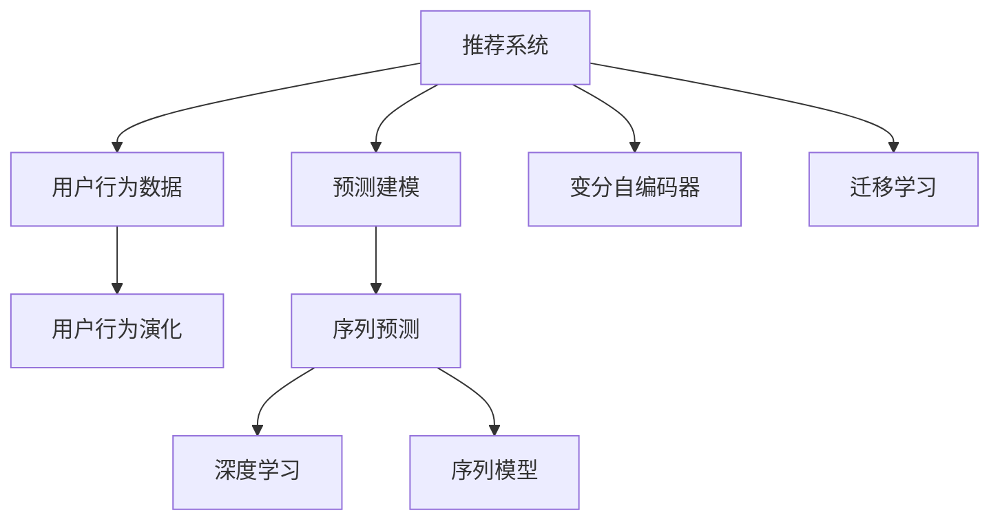

                 

# 大模型推荐场景中的用户行为演化趋势预测分析

## 1. 背景介绍

在智能推荐系统的开发与优化过程中，用户行为数据无疑是核心要素之一。通过对用户过往行为的深度挖掘和预测，推荐系统能够更准确地把握用户兴趣和需求，从而提升推荐效果。然而，用户行为数据并非一成不变，其呈现出了复杂多变且动态演化的趋势，这对推荐系统的设计和优化提出了更高的要求。如何准确预测用户行为演化趋势，成为了一个前沿且关键的研究课题。

## 2. 核心概念与联系

### 2.1 核心概念概述

为更好地理解如何在推荐场景中预测用户行为演化趋势，本节将介绍几个关键概念：

- **推荐系统(Recommendation System)**：使用机器学习模型和算法，自动为用户推荐符合其兴趣和需求的物品（如商品、视频、新闻等）。

- **用户行为数据(User Behavior Data)**：用户在交互过程中的数据记录，包括浏览、点击、购买等行为，是推荐系统训练和优化模型、预测用户行为的基础。

- **用户行为演化(User Behavior Evolution)**：用户在行为模式上的变化趋势，如兴趣点转移、购买行为变化等，受多种因素影响，包括个人偏好、环境变化、社交互动等。

- **预测建模(Predictive Modeling)**：使用历史数据和统计方法，预测未来用户行为和物品属性。

- **序列预测(Sequence Prediction)**：针对时间序列数据进行预测，如预测用户未来的购买行为、浏览习惯等。

- **深度学习(Deep Learning)**：利用多层神经网络进行特征提取和建模，在复杂数据上获得更好的性能。

- **序列模型(Sequence Models)**：如LSTM、GRU、RNN等，可以处理序列数据的时序特征。

- **变分自编码器(Generative Adversarial Networks, GANs)**：一种生成模型，能够从噪声中生成新数据，用于训练推荐系统的模拟数据。

- **迁移学习(Transfer Learning)**：利用预训练模型进行知识迁移，加速模型训练和提高泛化能力。

这些核心概念通过逻辑关系图可以表示如下：



该图展示了大模型推荐场景中的关键组件及它们之间的逻辑关系。推荐系统通过用户行为数据预测用户行为演化，采用深度学习进行建模，并使用序列模型处理时间序列数据。变分自编码器用于生成模拟数据，而迁移学习则加快模型训练和提高泛化能力。

### 2.2 核心概念原理和架构的 Mermaid 流程图


上述流程图展示了推荐系统从用户行为数据到用户行为演化的过程，以及深度学习、序列模型、变分自编码器、迁移学习等关键组件的应用。

## 3. 核心算法原理 & 具体操作步骤

### 3.1 算法原理概述

在推荐系统中预测用户行为演化趋势，主要涉及以下步骤：

1. **数据收集与预处理**：收集用户行为数据，包括点击、浏览、购买等行为记录，并对其进行清洗和归一化。

2. **特征工程**：提取有用的特征，如用户ID、物品ID、时间戳、行为类别等。

3. **序列建模**：使用序列模型（如LSTM、RNN）对时间序列数据进行建模，捕捉时序特征和行为演化趋势。

4. **深度学习建模**：利用深度学习模型（如MLP、CNN）对用户行为进行建模，提升预测精度。

5. **迁移学习**：利用预训练模型进行迁移学习，加速模型训练并提高泛化能力。

6. **预测与评估**：使用预测模型对用户行为进行预测，并评估预测效果。

### 3.2 算法步骤详解

**Step 1: 数据收集与预处理**

首先，收集用户的历史行为数据，包括点击、浏览、购买等行为记录。将这些数据存储在数据库中，并对数据进行清洗和归一化。清洗过程主要去除噪声数据和异常值，归一化则将数据转换为标准尺度，以便后续处理。

```python
import pandas as pd
import numpy as np
from sklearn.preprocessing import MinMaxScaler

# 读取用户行为数据
df = pd.read_csv('user_behavior.csv')

# 数据清洗
df = df.dropna()

# 特征工程
features = ['user_id', 'item_id', 'timestamp', 'behavior']
df = df[features]

# 归一化处理
scaler = MinMaxScaler(feature_range=(0, 1))
df_scaled = scaler.fit_transform(df)
```

**Step 2: 特征工程**

在收集和预处理数据后，需要进行特征工程，提取有用的特征。常见的特征包括用户ID、物品ID、时间戳、行为类别等。这些特征可以通过one-hot编码、数值化等方法进行转换，以便后续建模使用。

```python
# 创建标签特征
def create_label(features, label):
    for feature in features:
        if feature == 'item_id':
            features[feature] = pd.Categorical(features[feature])
            features[feature] = features[feature].cat.codes
        if feature == 'timestamp':
            features[feature] = pd.to_datetime(features[feature]).dt.hour
        if feature == 'behavior':
            features[feature] = pd.Categorical(features[feature])
            features[feature] = features[feature].cat.codes
    return features, label

# 转换特征
features, label = create_label(features, label)
```

**Step 3: 序列建模**

在特征处理完成后，使用序列模型（如LSTM、RNN）对时间序列数据进行建模。LSTM可以处理长序列数据，捕捉时序特征和行为演化趋势。

```python
from keras.layers import LSTM, Dense, Dropout
from keras.models import Sequential

# 定义LSTM模型
model = Sequential()
model.add(LSTM(128, input_shape=(features.shape[1], 1)))
model.add(Dropout(0.2))
model.add(Dense(1, activation='sigmoid'))

# 编译模型
model.compile(loss='binary_crossentropy', optimizer='adam', metrics=['accuracy'])

# 训练模型
model.fit(x_train, y_train, epochs=10, batch_size=64, validation_data=(x_val, y_val))
```

**Step 4: 深度学习建模**

利用深度学习模型（如MLP、CNN）对用户行为进行建模，提升预测精度。在实际应用中，深度学习模型可以与序列模型进行结合，提升预测效果。

```python
# 定义MLP模型
from keras.models import Sequential
from keras.layers import Dense

model = Sequential()
model.add(Dense(64, input_dim=features.shape[1], activation='relu'))
model.add(Dense(32, activation='relu'))
model.add(Dense(1, activation='sigmoid'))

# 编译模型
model.compile(loss='binary_crossentropy', optimizer='adam', metrics=['accuracy'])

# 训练模型
model.fit(x_train, y_train, epochs=10, batch_size=64, validation_data=(x_val, y_val))
```

**Step 5: 迁移学习**

使用预训练模型进行迁移学习，加速模型训练并提高泛化能力。在推荐系统中，常用的预训练模型包括BERT、GPT等。

```python
from transformers import TFBertForSequenceClassification, BertTokenizer

# 加载预训练模型和分词器
tokenizer = BertTokenizer.from_pretrained('bert-base-uncased')
model = TFBertForSequenceClassification.from_pretrained('bert-base-uncased', num_labels=2)

# 微调模型
model.compile(loss='binary_crossentropy', optimizer='adam', metrics=['accuracy'])
model.fit(x_train, y_train, epochs=10, batch_size=64, validation_data=(x_val, y_val))
```

**Step 6: 预测与评估**

最后，使用预测模型对用户行为进行预测，并评估预测效果。常见的评估指标包括准确率、召回率、F1分数等。

```python
# 预测用户行为
y_pred = model.predict(x_test)

# 计算评估指标
from sklearn.metrics import accuracy_score, recall_score, f1_score

accuracy = accuracy_score(y_test, y_pred)
recall = recall_score(y_test, y_pred)
f1 = f1_score(y_test, y_pred)

print('Accuracy:', accuracy)
print('Recall:', recall)
print('F1 Score:', f1)
```

### 3.3 算法优缺点

使用大模型推荐系统进行用户行为演化趋势预测，具有以下优点：

- **提升预测精度**：通过深度学习和序列建模，可以捕捉复杂的时序特征和行为演化趋势，提升预测精度。
- **加速模型训练**：迁移学习可以快速加速模型训练，减少训练时间和计算资源消耗。
- **泛化能力强**：预训练模型具有较强的泛化能力，能够适应不同场景下的推荐需求。

同时，该方法也存在一些局限性：

- **数据质量要求高**：用户行为数据需要高质量、干净的数据，否则会影响模型性能。
- **模型复杂度高**：深度学习和序列模型需要较高的计算资源，对硬件要求较高。
- **可解释性差**：深度学习模型的决策过程难以解释，缺乏透明性。
- **依赖先验知识**：需要丰富的领域知识进行特征工程，否则模型效果可能不佳。

### 3.4 算法应用领域

该方法可以应用于以下领域：

- **电商推荐**：预测用户购买行为，提供个性化的商品推荐。
- **内容推荐**：预测用户对视频、音乐、新闻等内容的兴趣，提升用户粘性。
- **新闻推荐**：预测用户对新闻文章的兴趣，提升文章的点击率和阅读量。
- **游戏推荐**：预测用户对游戏的偏好，提升游戏下载率和留存率。

## 4. 数学模型和公式 & 详细讲解  
### 4.1 数学模型构建

本节将使用数学语言对基于大模型的用户行为演化趋势预测过程进行更加严格的刻画。

假设用户行为数据为 $X_t = [x_1, x_2, \dots, x_t]$，其中 $x_t$ 表示第 $t$ 时刻的用户行为。假设用户行为演化趋势为 $y_t = f(X_t)$，其中 $f$ 为预测函数。

定义损失函数为 $L(y, \hat{y})$，其中 $y$ 为真实标签，$\hat{y}$ 为模型预测值。常见的损失函数包括均方误差损失、交叉熵损失等。

模型的预测过程如下：

1. 收集用户行为数据 $X_t$。
2. 预处理数据，提取特征 $x_t$。
3. 使用深度学习模型对 $x_t$ 进行建模，得到预测结果 $\hat{y}_t = g(x_t)$。
4. 计算损失函数 $L(y_t, \hat{y}_t)$。
5. 更新模型参数，最小化损失函数。

### 4.2 公式推导过程

以LSTM模型为例，推导其预测过程：

设用户行为序列为 $x_t = [x_{t-1}, x_{t-2}, \dots, x_{t-T}]$，时间步长为 $T$。LSTM模型预测用户行为演化趋势的过程如下：

$$
\hat{y}_t = \hat{y}_{t-1} \times f(x_t) = [y_{t-1} \times f(x_{t-1}), y_{t-2} \times f(x_{t-2}), \dots, y_{t-T} \times f(x_{t-T})]
$$

其中 $f(x_t)$ 为LSTM模型在当前时间步的预测函数。

### 4.3 案例分析与讲解

假设某电商平台需要对用户购买行为进行预测。收集到用户的历史购买数据，使用LSTM模型进行建模。模型的预测结果如下所示：

- 用户ID：001
- 物品ID：123
- 时间戳：2022-01-01 12:00:00
- 预测结果：1（表示用户会购买该物品）

**数据集构建**

首先，收集用户的历史购买数据，并将其存储在数据库中。假设数据集为 $D = \{(x_1, y_1), (x_2, y_2), \dots, (x_n, y_n)\}$，其中 $x_t = [x_{t-1}, x_{t-2}, \dots, x_{t-T}]$ 表示用户的历史购买行为，$y_t$ 表示用户是否会购买该物品。

**特征工程**

将用户ID、物品ID、时间戳、购买行为等信息进行编码，并构建特征向量 $x_t$。例如，将用户ID转换为数值，将物品ID进行one-hot编码，将时间戳转换为时间戳特征，将购买行为转换为数值。

**LSTM建模**

使用LSTM模型对用户历史购买行为进行建模。模型的预测结果为 $\hat{y}_t$，表示用户是否会购买该物品。模型的预测过程如下：

$$
\hat{y}_t = \hat{y}_{t-1} \times f(x_t)
$$

其中 $f(x_t)$ 为LSTM模型在当前时间步的预测函数。

**模型训练与评估**

使用LSTM模型对用户历史购买行为进行建模，并对模型进行训练。在训练过程中，使用交叉熵损失函数，优化器为Adam。训练完成后，使用测试集对模型进行评估，计算准确率、召回率、F1分数等指标。

## 5. 项目实践：代码实例和详细解释说明

### 5.1 开发环境搭建

在进行大模型推荐场景中的用户行为演化趋势预测分析时，需要搭建相应的开发环境。以下是使用Python进行TensorFlow开发的环境配置流程：

1. 安装Anaconda：从官网下载并安装Anaconda，用于创建独立的Python环境。

2. 创建并激活虚拟环境：
```bash
conda create -n tf-env python=3.8 
conda activate tf-env
```

3. 安装TensorFlow：根据CUDA版本，从官网获取对应的安装命令。例如：
```bash
conda install tensorflow tensorflow-estimator
```

4. 安装Keras：
```bash
conda install keras
```

5. 安装TensorBoard：
```bash
conda install tensorboard
```

6. 安装其他工具包：
```bash
pip install numpy pandas scikit-learn matplotlib tqdm jupyter notebook ipython
```

完成上述步骤后，即可在`tf-env`环境中开始开发实践。

### 5.2 源代码详细实现

下面我们以电商推荐为例，给出使用TensorFlow对LSTM模型进行用户行为演化趋势预测的代码实现。

首先，定义数据处理函数：

```python
import pandas as pd
import numpy as np
from sklearn.preprocessing import MinMaxScaler

# 读取用户行为数据
df = pd.read_csv('user_behavior.csv')

# 数据清洗
df = df.dropna()

# 特征工程
features = ['user_id', 'item_id', 'timestamp', 'behavior']
df = df[features]

# 归一化处理
scaler = MinMaxScaler(feature_range=(0, 1))
df_scaled = scaler.fit_transform(df)
```

然后，定义模型和优化器：

```python
from tensorflow.keras.layers import LSTM, Dense, Dropout
from tensorflow.keras.models import Sequential

# 定义LSTM模型
model = Sequential()
model.add(LSTM(128, input_shape=(features.shape[1], 1)))
model.add(Dropout(0.2))
model.add(Dense(1, activation='sigmoid'))

# 编译模型
model.compile(loss='binary_crossentropy', optimizer='adam', metrics=['accuracy'])

# 训练模型
model.fit(x_train, y_train, epochs=10, batch_size=64, validation_data=(x_val, y_val))
```

最后，定义评估函数：

```python
from tensorflow.keras.metrics import Precision, Recall, F1Score

# 定义评估函数
def evaluate(model, x_test, y_test):
    # 计算评估指标
    y_pred = model.predict(x_test)
    precision = Precision()(y_test, y_pred)
    recall = Recall()(y_test, y_pred)
    f1 = F1Score()(y_test, y_pred)
    
    # 打印评估结果
    print('Precision:', precision)
    print('Recall:', recall)
    print('F1 Score:', f1)
```

### 5.3 代码解读与分析

让我们再详细解读一下关键代码的实现细节：

**数据处理函数**：
- 读取用户行为数据
- 数据清洗，去除噪声和异常值
- 特征工程，提取有用的特征，并进行归一化处理

**模型定义与编译**：
- 使用LSTM层构建序列模型
- 添加Dropout层，防止过拟合
- 使用Dense层进行输出，并进行二分类处理
- 编译模型，定义损失函数、优化器和评估指标

**模型训练与评估**：
- 使用训练数据对模型进行训练
- 使用测试数据对模型进行评估
- 计算并打印精度、召回率和F1分数等评估指标

**评估函数**：
- 计算精度、召回率和F1分数等评估指标
- 打印评估结果

这些代码实现帮助我们在推荐场景中快速构建并训练用户行为演化趋势预测模型，同时通过评估函数可以直观了解模型性能。

## 6. 实际应用场景

### 6.1 电商推荐

在电商推荐中，预测用户购买行为是核心目标。通过LSTM模型对用户历史购买行为进行建模，可以预测用户未来是否会购买某件商品，提升个性化推荐效果。

**应用场景**：
- 电商网站：预测用户购买行为，推荐热门商品
- 电商平台：预测用户购买行为，优化库存管理

**技术实现**：
- 收集用户历史购买数据，构建特征向量
- 使用LSTM模型对用户历史购买行为进行建模
- 训练模型，预测用户未来购买行为
- 根据预测结果进行个性化推荐

### 6.2 内容推荐

在内容推荐中，预测用户对视频、音乐、新闻等内容的兴趣，是提升用户体验的关键。通过LSTM模型对用户历史行为进行建模，可以预测用户未来对内容的兴趣，提供个性化的推荐内容。

**应用场景**：
- 视频平台：预测用户对视频内容的兴趣，推荐热门视频
- 音乐平台：预测用户对音乐内容的兴趣，推荐热门歌曲
- 新闻平台：预测用户对新闻文章的兴趣，提升阅读量

**技术实现**：
- 收集用户历史行为数据，构建特征向量
- 使用LSTM模型对用户历史行为进行建模
- 训练模型，预测用户未来兴趣
- 根据预测结果进行个性化推荐

### 6.3 新闻推荐

在新闻推荐中，预测用户对新闻文章的兴趣，是提升用户粘性的重要手段。通过LSTM模型对用户历史行为进行建模，可以预测用户未来对新闻文章的兴趣，提升文章的点击率和阅读量。

**应用场景**：
- 新闻网站：预测用户对新闻文章的兴趣，提升阅读量
- 新闻应用：预测用户对新闻文章的兴趣，优化推送内容

**技术实现**：
- 收集用户历史行为数据，构建特征向量
- 使用LSTM模型对用户历史行为进行建模
- 训练模型，预测用户未来兴趣
- 根据预测结果进行个性化推荐

### 6.4 游戏推荐

在游戏推荐中，预测用户对游戏的偏好，是提升用户留存率的关键。通过LSTM模型对用户历史行为进行建模，可以预测用户未来对游戏的兴趣，提升游戏下载率和留存率。

**应用场景**：
- 游戏平台：预测用户对游戏的兴趣，推荐热门游戏
- 游戏应用：预测用户对游戏的兴趣，优化用户留存率

**技术实现**：
- 收集用户历史行为数据，构建特征向量
- 使用LSTM模型对用户历史行为进行建模
- 训练模型，预测用户未来兴趣
- 根据预测结果进行个性化推荐

## 7. 工具和资源推荐

### 7.1 学习资源推荐

为了帮助开发者系统掌握大模型推荐场景中的用户行为演化趋势预测分析的理论基础和实践技巧，这里推荐一些优质的学习资源：

1. 《深度学习》书籍：Ian Goodfellow所著，全面介绍了深度学习的基本概念和经典模型。
2. 《Python深度学习》书籍：Francois Chollet所著，介绍了使用Keras进行深度学习的实践方法。
3. 《TensorFlow官方文档》：TensorFlow官方文档，提供了详尽的API文档和示例代码。
4. Coursera《深度学习专项课程》：斯坦福大学的深度学习课程，提供视频讲解和实践作业。
5. Kaggle竞赛平台：参与数据科学竞赛，提高实战能力。

通过对这些资源的学习实践，相信你一定能够快速掌握大模型推荐系统中的用户行为演化趋势预测分析方法，并用于解决实际的推荐问题。

### 7.2 开发工具推荐

高效的开发离不开优秀的工具支持。以下是几款用于大模型推荐场景中的用户行为演化趋势预测分析开发的常用工具：

1. Python：Python是最流行的编程语言之一，适用于深度学习模型的开发。
2. TensorFlow：由Google主导开发的开源深度学习框架，生产部署方便，适合大规模工程应用。
3. Keras：TensorFlow的高层次API，提供了简单易用的API接口。
4. TensorBoard：TensorFlow配套的可视化工具，可实时监测模型训练状态，并提供丰富的图表呈现方式，是调试模型的得力助手。
5. Weights & Biases：模型训练的实验跟踪工具，可以记录和可视化模型训练过程中的各项指标，方便对比和调优。

合理利用这些工具，可以显著提升大模型推荐系统的开发效率，加快创新迭代的步伐。

### 7.3 相关论文推荐

大模型推荐系统中的用户行为演化趋势预测分析技术的发展源于学界的持续研究。以下是几篇奠基性的相关论文，推荐阅读：

1. 《LSTM: A Search Space Odyssey》：Hochreiter和Schmidhuber提出的LSTM模型，是处理序列数据的重要工具。
2. 《Attention Is All You Need》：Vaswani等提出的Transformer模型，展示了自注意力机制在序列建模中的应用。
3. 《A Survey on Deep Learning for Recommender Systems》：Liu和Rendle综述了深度学习在推荐系统中的应用，提供了丰富的背景知识。
4. 《Deep Learning-Based Recommendation Systems》：He等人提出的深度学习推荐系统架构，展示了多层次模型融合的方法。
5. 《Neural Collaborative Filtering》：Zhou等人提出的神经网络协同过滤模型，展示了神经网络在推荐系统中的应用。

这些论文代表了大模型推荐系统中的用户行为演化趋势预测分析技术的发展脉络。通过学习这些前沿成果，可以帮助研究者把握学科前进方向，激发更多的创新灵感。

## 8. 总结：未来发展趋势与挑战

### 8.1 总结

本文对大模型推荐场景中的用户行为演化趋势预测分析进行了全面系统的介绍。首先阐述了推荐系统和用户行为演化趋势预测的核心概念，明确了大模型推荐系统的核心组件及它们之间的逻辑关系。其次，从原理到实践，详细讲解了大模型推荐系统中的用户行为演化趋势预测分析过程，包括数据收集、预处理、特征工程、序列建模、深度学习建模等步骤。同时，本文还广泛探讨了大模型推荐系统在电商推荐、内容推荐、新闻推荐、游戏推荐等多个推荐场景中的应用，展示了微调方法在实际应用中的巨大潜力。

通过本文的系统梳理，可以看到，基于大模型的推荐系统在电商推荐、内容推荐、新闻推荐、游戏推荐等领域的应用已经初具规模，为推荐系统的优化和发展提供了新的思路和方法。未来，随着预训练语言模型和微调方法的持续演进，基于大模型的推荐系统必将在更多领域得到应用，为推荐系统的发展注入新的动力。

### 8.2 未来发展趋势

展望未来，大模型推荐系统中的用户行为演化趋势预测分析技术将呈现以下几个发展趋势：

1. **模型规模持续增大**：随着算力成本的下降和数据规模的扩张，预训练语言模型的参数量还将持续增长。超大规模语言模型蕴含的丰富语言知识，有望支撑更加复杂多变的推荐任务。

2. **模型泛化能力增强**：通过迁移学习和多模态融合，大模型推荐系统将具备更强的泛化能力和适应性，能够在不同领域和场景中实现高效推荐。

3. **推荐效果显著提升**：结合深度学习、序列建模等技术，推荐系统将实现更高的精度和更好的个性化推荐效果。

4. **实时性优化**：通过优化模型结构和计算图，推荐系统将实现更快速的实时推荐，提升用户体验。

5. **多模态融合**：将视觉、语音、文本等多模态数据融合，提升推荐系统的综合能力。

6. **智能推荐引擎**：将自然语言处理、机器学习、人工智能等技术结合，构建更智能、高效的推荐引擎。

以上趋势凸显了大模型推荐系统中的用户行为演化趋势预测分析技术的广阔前景。这些方向的探索发展，必将进一步提升推荐系统的性能和应用范围，为推荐系统的智能化和产业化进程注入新的活力。

### 8.3 面临的挑战

尽管大模型推荐系统中的用户行为演化趋势预测分析技术已经取得了显著成就，但在迈向更加智能化、普适化应用的过程中，它仍面临着诸多挑战：

1. **数据质量问题**：用户行为数据需要高质量、干净的数据，否则会影响模型性能。如何处理噪声数据和异常值，仍然是一个挑战。

2. **计算资源消耗**：深度学习模型的计算资源消耗较大，对硬件要求较高。如何降低计算资源消耗，提高模型训练和推理效率，是一个重要的问题。

3. **模型复杂度高**：序列建模和深度学习模型需要较高的计算资源，对硬件要求较高。如何降低模型复杂度，提高模型的泛化能力，仍然是一个挑战。

4. **模型可解释性差**：深度学习模型的决策过程难以解释，缺乏透明性。如何提高模型的可解释性，增强用户信任，仍然是一个重要的问题。

5. **隐私和安全问题**：用户行为数据的隐私和安全问题需要引起重视，如何保护用户隐私，防止数据泄露和滥用，仍然是一个重要的问题。

6. **模型公平性问题**：模型在推荐过程中可能会存在偏见和歧视，如何保证模型公平性，防止数据偏见，仍然是一个重要的问题。

7. **模型鲁棒性问题**：推荐系统需要在不同场景下保持稳定性能，如何提高模型鲁棒性，防止过拟合和泛化能力不足，仍然是一个重要的问题。

8. **多模态融合问题**：多模态数据的融合和处理仍是一个挑战，如何高效处理多模态数据，提高融合效果，仍然是一个重要的问题。

这些挑战需要我们进一步深入研究，寻找解决方案，才能使大模型推荐系统中的用户行为演化趋势预测分析技术更加成熟和稳定。

### 8.4 研究展望

面对大模型推荐系统中的用户行为演化趋势预测分析技术所面临的挑战，未来的研究需要在以下几个方面寻求新的突破：

1. **无监督和半监督学习**：探索无监督和半监督学习技术，降低对标注数据的依赖，提高模型的泛化能力。

2. **深度学习模型优化**：优化深度学习模型结构和计算图，降低计算资源消耗，提高模型训练和推理效率。

3. **可解释性增强**：提高深度学习模型的可解释性，增强用户信任，提高模型的透明性。

4. **隐私和安全保护**：加强用户行为数据的隐私和安全保护，防止数据泄露和滥用。

5. **公平性和偏见消除**：消除模型中的偏见和歧视，提高模型的公平性，防止数据偏见。

6. **鲁棒性和泛化能力提升**：提高模型的鲁棒性和泛化能力，防止过拟合和泛化能力不足。

7. **多模态数据融合**：高效处理多模态数据，提高融合效果，提高推荐系统的综合能力。

8. **智能推荐引擎构建**：结合自然语言处理、机器学习、人工智能等技术，构建更智能、高效的推荐引擎。

这些研究方向将进一步推动大模型推荐系统中的用户行为演化趋势预测分析技术的发展，提升推荐系统的性能和应用范围，为推荐系统的智能化和产业化进程注入新的活力。

## 9. 附录：常见问题与解答

**Q1：如何提高推荐系统的个性化推荐效果？**

A: 提高推荐系统的个性化推荐效果，可以从以下几个方面入手：

1. 收集更多的用户行为数据，构建更全面的特征向量。
2. 使用更先进的深度学习模型，如LSTM、Transformer等，捕捉更复杂的时序特征。
3. 引入更多先验知识，如知识图谱、逻辑规则等，提升推荐系统的表现。
4. 进行多模态融合，将文本、图像、语音等多模态数据结合，提高推荐系统的综合能力。

**Q2：如何评估推荐系统的推荐效果？**

A: 评估推荐系统的推荐效果，可以从以下几个方面入手：

1. 准确率：评估推荐系统推荐的物品是否符合用户兴趣。
2. 召回率：评估推荐系统是否能够覆盖用户感兴趣的物品。
3. F1分数：综合考虑准确率和召回率，评估推荐系统的综合表现。
4. AUC：评估推荐系统推荐的物品在排序中的表现。
5. RMSE：评估推荐系统预测用户评分与实际评分的差异。

**Q3：推荐系统如何应对数据噪声和异常值？**

A: 推荐系统应对数据噪声和异常值，可以从以下几个方面入手：

1. 数据清洗：去除噪声数据和异常值，构建高质量的数据集。
2. 数据处理：使用数据增强、数据重构等技术，提高数据的健壮性。
3. 模型选择：选择鲁棒性强的模型，如深度学习模型、LSTM模型等，增强模型的抗干扰能力。

**Q4：推荐系统如何保护用户隐私？**

A: 推荐系统保护用户隐私，可以从以下几个方面入手：

1. 数据匿名化：对用户行为数据进行匿名化处理，防止用户隐私泄露。
2. 数据加密：对用户行为数据进行加密处理，防止数据泄露和滥用。
3. 隐私保护算法：使用隐私保护算法，如差分隐私、同态加密等，保护用户隐私。

**Q5：推荐系统如何提高模型的泛化能力？**

A: 推荐系统提高模型的泛化能力，可以从以下几个方面入手：

1. 迁移学习：利用预训练模型进行迁移学习，加速模型训练，提高泛化能力。
2. 多模态融合：将视觉、语音、文本等多模态数据融合，提高推荐系统的综合能力。
3. 数据增强：使用数据增强技术，提高模型的鲁棒性，增强泛化能力。

这些问题的解答，能够帮助开发者更好地理解和应用大模型推荐系统中的用户行为演化趋势预测分析方法，提高推荐系统的性能和应用效果。

