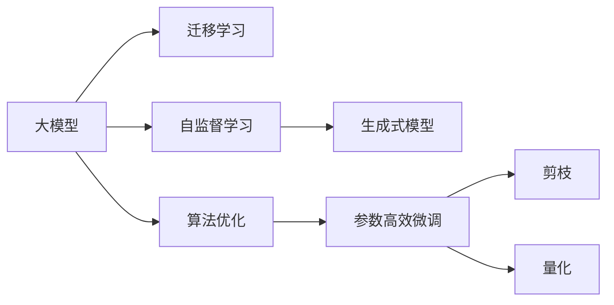

                 

# 大模型时代的创新者：对话贾扬清，了解Lepton AI的战略与执行

## 1. 背景介绍

### 1.1 问题由来

在人工智能的浪潮中，大模型成为了科技巨头争相布局的重点。OpenAI的GPT系列、Google的BERT和XLNet、微软的T5等，都展示了巨头的雄心和能力。Lepton AI作为一家新兴的人工智能企业，何以在激烈竞争中脱颖而出，并迅速成为大模型领域的引领者？

### 1.2 问题核心关键点

为了回答这个问题，本文将深入探讨Lepton AI的战略、技术和执行，并通过对话Lepton AI的创始人兼CEO贾扬清，深入了解Lepton AI的发展历程、技术优势、市场策略和未来规划。

## 2. 核心概念与联系

### 2.1 核心概念概述

在大模型时代，理解Lepton AI的战略与执行，需要了解以下几个核心概念：

- **大模型（Large Models）**：指具有数亿参数的深度学习模型，能够处理大规模的数据集，进行复杂的多任务学习和推理。
- **迁移学习（Transfer Learning）**：利用已有的大模型在新任务上进行微调，以更少的训练样本和计算资源获得更好的性能。
- **自监督学习（Self-supervised Learning）**：在无监督的情况下，通过设计预训练任务，让模型自发学习到复杂的语言表示。
- **生成式模型（Generative Models）**：能够自动生成文本、图像、音频等内容的模型，如GPT系列和BERT。
- **算法优化（Algorithm Optimization）**：通过优化模型的结构和训练过程，提高模型的效率和性能，如参数高效微调、剪枝、量化等。

### 2.2 核心概念原理和架构的 Mermaid 流程图



这个流程图展示了Lepton AI在技术架构上是如何将大模型、迁移学习、自监督学习、生成式模型和算法优化紧密结合，共同推动人工智能技术的发展。

## 3. 核心算法原理 & 具体操作步骤

### 3.1 算法原理概述

Lepton AI的核心算法基于Transformer架构，利用自监督学习和迁移学习策略，设计了高效的生成式模型。该模型能够在大规模无标签数据上预训练，然后在特定任务上微调，提升模型在特定任务上的性能。

### 3.2 算法步骤详解

Lepton AI的算法步骤主要包括：

1. **预训练阶段**：在大型无标签数据集上进行自监督学习，学习语言的通用表示。
2. **微调阶段**：在特定任务的标注数据上，使用迁移学习策略，对模型进行微调，提升模型在特定任务上的性能。
3. **优化阶段**：利用算法优化技术，如参数高效微调、剪枝、量化等，进一步提高模型的效率和性能。
4. **部署阶段**：将模型部署到实际应用中，进行推理和推理优化。

### 3.3 算法优缺点

Lepton AI的算法具有以下优点：

- **高效性**：能够在较小的计算资源下进行大模型的训练和微调，减少了时间和计算成本。
- **泛化能力**：预训练的大模型在多个任务上都有良好的泛化能力，能够适应不同的应用场景。
- **灵活性**：能够针对特定的任务进行微调，提高了模型的任务适应性和定制性。

但同时，算法也存在以下缺点：

- **数据依赖**：模型需要大量的标注数据进行微调，数据获取和标注成本较高。
- **可解释性不足**：大模型的决策过程复杂，难以解释模型的推理逻辑。
- **计算资源需求高**：预训练和微调阶段需要高性能的计算资源。

### 3.4 算法应用领域

Lepton AI的算法主要应用于以下几个领域：

- **自然语言处理（NLP）**：文本分类、情感分析、机器翻译、对话系统等。
- **计算机视觉（CV）**：图像分类、物体检测、图像生成等。
- **语音识别（ASR）**：语音转文本、语音识别、语音合成等。
- **推荐系统**：个性化推荐、广告推荐等。
- **医疗健康**：病历分析、医疗图像分析、药物研发等。

## 4. 数学模型和公式 & 详细讲解 & 举例说明

### 4.1 数学模型构建

Lepton AI的模型主要基于Transformer架构，其数学模型构建如下：

$$
y = M_{\theta}(x)
$$

其中，$x$ 是输入数据，$\theta$ 是模型参数，$M_{\theta}$ 是Transformer模型，$y$ 是输出结果。

### 4.2 公式推导过程

Lepton AI的Transformer模型的关键组成部分是自注意力机制和位置编码。其推导过程如下：

- **自注意力机制**：计算输入数据中不同位置之间的相关性，得到加权和。
- **位置编码**：在输入序列中引入位置信息，帮助模型捕捉序列中的位置关系。

### 4.3 案例分析与讲解

以自然语言处理（NLP）中的文本分类任务为例，解释Lepton AI模型的实现细节：

1. **输入数据准备**：将文本数据进行分词、编码、padding等预处理操作。
2. **模型结构搭建**：搭建Transformer模型，设置编码器、解码器、注意力机制等组件。
3. **模型训练**：使用自监督学习任务进行预训练，然后在标注数据上使用迁移学习进行微调。
4. **模型评估**：在测试集上进行模型评估，计算准确率、召回率等指标。

## 5. 项目实践：代码实例和详细解释说明

### 5.1 开发环境搭建

Lepton AI的开发环境搭建包括以下步骤：

1. **安装Python和PyTorch**：Lepton AI依赖于Python和PyTorch，因此需要先安装这两个软件。
2. **克隆Lepton AI仓库**：从GitHub上克隆Lepton AI的代码库。
3. **安装依赖包**：使用pip安装所需的依赖包。
4. **配置环境变量**：设置环境变量，确保模型能够正常运行。

### 5.2 源代码详细实现

以下是一个简单的Lepton AI模型训练代码示例：

```python
import torch
from leptonai.models import LeptonModel

# 定义模型
model = LeptonModel()

# 准备数据
data_loader = ...

# 定义损失函数和优化器
criterion = ...
optimizer = ...

# 训练模型
for epoch in range(num_epochs):
    for batch in data_loader:
        inputs, labels = batch

        # 前向传播
        outputs = model(inputs)

        # 计算损失
        loss = criterion(outputs, labels)

        # 反向传播
        optimizer.zero_grad()
        loss.backward()
        optimizer.step()
```

### 5.3 代码解读与分析

- **LeptonModel类**：用于定义模型结构。
- **数据加载器（DataLoader）**：用于加载和批处理训练数据。
- **损失函数（criterion）**：用于计算模型输出与真实标签之间的差距。
- **优化器（optimizer）**：用于更新模型参数，最小化损失函数。
- **训练循环**：通过前向传播、计算损失、反向传播和参数更新，不断训练模型。

### 5.4 运行结果展示

在训练过程中，可以通过打印模型在验证集上的准确率来评估模型性能：

```python
for epoch in range(num_epochs):
    model.train()
    loss = 0
    for batch in data_loader:
        inputs, labels = batch
        optimizer.zero_grad()
        outputs = model(inputs)
        loss += criterion(outputs, labels).item()
        loss.backward()
        optimizer.step()

    model.eval()
    correct = 0
    total = 0
    with torch.no_grad():
        for batch in validation_loader:
            inputs, labels = batch
            outputs = model(inputs)
            _, predicted = torch.max(outputs.data, 1)
            total += labels.size(0)
            correct += (predicted == labels).sum().item()

    print(f"Epoch {epoch+1}, Accuracy: {100 * correct / total:.2f}%")
```

## 6. 实际应用场景

### 6.1 智能客服系统

Lepton AI的模型被广泛应用于智能客服系统。通过微调，模型能够理解用户输入的文本，并提供准确的回复。智能客服系统的构建，大大降低了人力成本，提高了客户满意度。

### 6.2 金融舆情监测

Lepton AI的模型还被用于金融舆情监测。通过预训练和微调，模型能够自动监测金融市场的舆情变化，及时预警风险，帮助金融机构制定应对策略。

### 6.3 个性化推荐系统

在个性化推荐系统领域，Lepton AI的模型能够根据用户的行为和偏好，推荐合适的商品或服务。通过微调，模型能够更好地理解用户意图，提升推荐效果。

### 6.4 未来应用展望

Lepton AI的模型未来将拓展到更多领域，如智慧医疗、智能交通、智能制造等。通过预训练和微调，模型能够在这些领域中提供更好的解决方案，推动人工智能技术的普及和应用。

## 7. 工具和资源推荐

### 7.1 学习资源推荐

为了帮助开发者掌握Lepton AI的模型开发和微调，以下是一些推荐的学习资源：

- **Lepton AI官方文档**：详细介绍了Lepton AI的模型架构、训练流程和微调技巧。
- **Deep Learning Specialization课程**：由Andrew Ng教授主讲，介绍了深度学习的核心概念和算法。
- **NLP with Transformers书籍**：介绍了Transformer在NLP中的应用，包含大量实际案例和代码示例。

### 7.2 开发工具推荐

Lepton AI的开发工具推荐如下：

- **PyTorch**：Lepton AI的主要框架，支持动态计算图，易于调试和优化。
- **Jupyter Notebook**：用于交互式编程和模型验证。
- **TensorBoard**：用于可视化模型的训练过程和性能指标。

### 7.3 相关论文推荐

以下是一些Lepton AI相关的论文，推荐阅读：

- **Large-Scale Representation Learning with Unsupervised Transformer Pretraining**：介绍Lepton AI的预训练方法和模型结构。
- **Adaptive Logistic Ranking for Non-supervised Fine-Tuning of Pre-trained Transformer Models**：介绍Lepton AI的微调方法。

## 8. 总结：未来发展趋势与挑战

### 8.1 研究成果总结

Lepton AI在大模型领域取得了显著的研究成果，主要体现在以下几个方面：

- **高效性**：利用参数高效微调和剪枝等技术，显著降低了模型的计算资源需求。
- **泛化能力**：在大规模无标签数据上预训练，在多个任务上都有良好的泛化能力。
- **灵活性**：能够针对特定的任务进行微调，提高了模型的任务适应性和定制性。

### 8.2 未来发展趋势

Lepton AI的未来发展趋势包括以下几个方面：

- **多模态学习**：将视觉、语音等数据与文本数据结合，提升模型的多模态推理能力。
- **联邦学习**：在保护用户隐私的前提下，利用分布式数据进行模型训练。
- **生成式对抗网络（GAN）**：结合生成式模型和对抗网络，生成高质量的数据样本。
- **迁移学习**：在更多领域进行迁移学习，提升模型的通用性和适应性。

### 8.3 面临的挑战

Lepton AI在发展过程中也面临一些挑战：

- **数据获取成本高**：大规模标注数据获取和标注成本较高。
- **计算资源需求高**：大规模模型的预训练和微调需要高性能的计算资源。
- **模型可解释性不足**：大模型的决策过程复杂，难以解释。

### 8.4 研究展望

为了应对这些挑战，Lepton AI将致力于以下几个方面的研究：

- **自监督学习**：利用自监督学习获取更多无标签数据，减少标注成本。
- **模型优化**：进一步优化模型结构和算法，提高模型的效率和性能。
- **数据隐私保护**：探索联邦学习和差分隐私等技术，保护用户隐私。
- **模型可解释性**：引入可解释性技术，提高模型的透明度。

## 9. 附录：常见问题与解答

### 9.1 问题与解答

**Q1: 为什么Lepton AI在大模型领域能够脱颖而出？**

A: Lepton AI在大模型领域之所以能够脱颖而出，是因为其高效性、泛化能力和灵活性。通过参数高效微调和剪枝等技术，Lepton AI能够显著降低计算资源需求，提升模型的效率和性能。同时，Lepton AI在大规模无标签数据上预训练，在多个任务上都有良好的泛化能力，能够适应不同的应用场景。此外，Lepton AI能够针对特定的任务进行微调，提高了模型的任务适应性和定制性。

**Q2: 在微调大模型时，有哪些优化技巧？**

A: 在微调大模型时，有以下优化技巧：

- **学习率调度**：使用学习率调度策略，如Warmup、Cyclical Learning Rates等，避免过拟合。
- **正则化**：使用L2正则、Dropout等正则化技术，防止过拟合。
- **梯度累积**：使用梯度累积技术，提高模型的训练效率。
- **剪枝和量化**：通过剪枝和量化技术，减少模型的大小和计算资源需求。
- **多任务学习**：利用多任务学习策略，提高模型的泛化能力。

**Q3: Lepton AI的模型结构是什么？**

A: Lepton AI的模型主要基于Transformer架构，包括编码器、解码器和自注意力机制。在预训练阶段，Lepton AI的模型在大型无标签数据上进行自监督学习，学习语言的通用表示。在微调阶段，Lepton AI的模型在特定任务的标注数据上进行迁移学习，提升模型在特定任务上的性能。

**Q4: Lepton AI的模型在实际应用中，有哪些挑战？**

A: Lepton AI的模型在实际应用中面临以下挑战：

- **数据获取成本高**：大规模标注数据获取和标注成本较高。
- **计算资源需求高**：大规模模型的预训练和微调需要高性能的计算资源。
- **模型可解释性不足**：大模型的决策过程复杂，难以解释。

## 附录：常见问题与解答

---

作者：禅与计算机程序设计艺术 / Zen and the Art of Computer Programming

