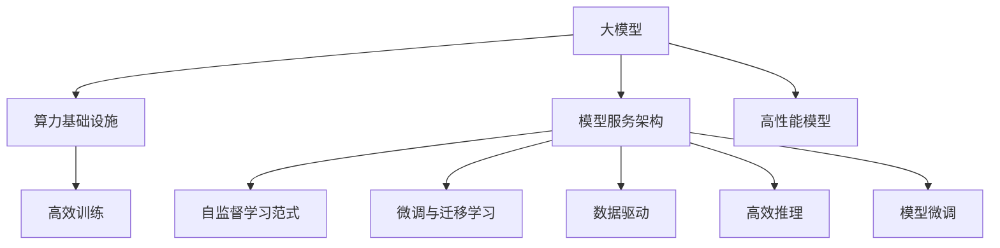

                 

# 大模型时代的基础设施提供者：Lepton AI的定位

## 1. 背景介绍

### 1.1 问题由来

近年来，深度学习和大模型技术迅猛发展，各类预训练模型在自然语言处理、计算机视觉、推荐系统等众多领域取得了显著进步。特别是语言模型和视觉模型的发展，极大地推动了人工智能技术的普及应用，带来了生产力的大幅提升和用户体验的质的飞跃。然而，这些大模型的训练和推理仍需消耗大量的算力资源，对于中小企业和个人开发者而言，构建高性能模型基础设施，仍然是一大难题。

### 1.2 问题核心关键点

在此背景下，基础设施提供者（Infrastructure-as-a-Service, IaaS）的价值愈发凸显。IaaS不仅能降低开发门槛，也能为高性能算力、存储、网络等基础设施提供持续的支持，满足各类AI应用的需求。Lepton AI正是这样一个基础设施提供商，聚焦于大模型时代的应用需求，致力于构建高性能、高可用、易用的AI基础设施。

Lepton AI凭借其核心优势，迅速在国内外众多企业中树立了良好的口碑。其提供的AI基础设施，能够高效支持大规模预训练模型的训练、推理和部署，同时也为AI开发者提供了便捷的模型服务，促进了AI技术的规模化落地应用。本文将从背景介绍、核心概念与联系、核心算法原理与具体操作步骤、数学模型和公式、项目实践、实际应用场景、工具和资源推荐、总结与未来展望等方面，详细探讨Lepton AI的技术定位和发展方向。

## 2. 核心概念与联系

### 2.1 核心概念概述

大模型时代对基础设施提出了更高的要求。Lepton AI以大模型为核心，深入挖掘了AI基础设施的各个环节，包括算力、存储、网络、模型、服务等，提供了一站式的AI基础设施解决方案。其核心概念和技术框架如下：

- **算力基础设施**：提供高效、稳定的GPU/TPU集群，支持大规模预训练模型的训练。
- **模型服务架构**：构建高性能模型服务架构，提供模型部署、推理和微调等一站式服务。
- **自监督学习范式**：采用自监督学习、迁移学习等技术，提升模型的泛化能力和可迁移性。
- **微调与迁移学习**：通过微调技术，使通用大模型适配特定任务，实现更高的性能和泛化能力。
- **数据驱动**：以数据驱动为核心，提供海量数据集和数据增强技术，提升模型训练效果。

这些核心概念和技术框架，共同构成了Lepton AI的基础设施框架，为其大模型时代的应用提供了强有力的支持。

### 2.2 核心概念原理和架构的 Mermaid 流程图



该流程图展示了Lepton AI基础设施的主要架构和关键技术流程。大模型通过高效的算力基础设施进行训练，并通过模型服务架构进行推理和微调，最终转化为高效、稳定的模型服务。自监督学习、迁移学习和数据驱动等技术，则进一步提升了模型的泛化能力和训练效果。

## 3. 核心算法原理 & 具体操作步骤

### 3.1 算法原理概述

Lepton AI的算法框架以深度学习和大模型为核心，包括算力优化、模型服务、自监督学习、迁移学习和数据驱动等多个方面。本文将重点介绍其中的自监督学习、微调与迁移学习技术。

#### 3.1.1 自监督学习

自监督学习是指使用未标注数据进行模型训练，使模型学习到数据的特征和结构。自监督学习的核心是设计出有效的预训练任务，如语言模型、视觉特征提取等。Lepton AI采用的自监督学习任务包括：

- **语言模型**：使用无标注文本数据进行预训练，学习语言的基本结构和规律。常用的预训练任务包括掩码语言模型、下一句预测等。
- **视觉特征提取**：使用无标注图像数据进行预训练，学习图像的基本特征和结构。常用的预训练任务包括自编码、数据增强等。

通过自监督学习，Lepton AI能够高效地构建出具备强大表征能力的大模型，为后续的任务微调和迁移学习奠定基础。

#### 3.1.2 微调与迁移学习

微调和迁移学习是Lepton AI算法的另一个重要组成部分，用于将预训练模型适配特定任务，提升模型的性能和泛化能力。微调是指在预训练模型的基础上，使用少量标注数据进行有监督训练，优化模型在特定任务上的性能。迁移学习则是指将一个领域学到的知识迁移到另一个领域，提升模型在跨领域任务上的表现。

Lepton AI的微调和迁移学习流程如下：

1. **数据预处理**：将标注数据集划分为训练集、验证集和测试集，进行数据增强和标准化处理。
2. **模型初始化**：将预训练模型加载到模型服务架构中，作为微调模型的初始化权重。
3. **模型微调**：在训练集上进行微调，优化模型在特定任务上的性能。
4. **模型评估**：在验证集上评估模型性能，防止过拟合。
5. **模型部署**：将微调后的模型部署到模型服务架构中，提供高效推理服务。

### 3.2 算法步骤详解

以下将详细介绍Lepton AI微调与迁移学习的具体操作步骤。

#### 3.2.1 数据准备

- **数据收集**：收集并预处理标注数据集，包括文本分类、图像分类、情感分析等任务。
- **数据分割**：将数据集划分为训练集、验证集和测试集，用于模型训练、调参和性能评估。
- **数据增强**：使用数据增强技术，如随机裁剪、旋转、翻转等，丰富训练集的多样性。

#### 3.2.2 模型初始化

- **模型加载**：将预训练模型加载到模型服务架构中，初始化模型权重。
- **任务适配**：根据任务类型，添加合适的输出层和损失函数。例如，对于分类任务，添加线性分类器和交叉熵损失函数。

#### 3.2.3 模型微调

- **训练设置**：设置优化器、学习率、批大小、迭代轮数等参数。
- **前向传播**：将训练集数据分批次输入模型，计算损失函数。
- **反向传播**：计算参数梯度，根据设定的优化算法更新模型参数。
- **性能评估**：在验证集上评估模型性能，防止过拟合。
- **模型保存**：保存微调后的模型，用于后续推理服务。

#### 3.2.4 模型部署

- **服务搭建**：将微调后的模型部署到模型服务架构中，提供高效的推理服务。
- **接口开发**：开发模型服务API，供客户端调用。
- **性能监控**：实时监控模型服务性能，确保系统稳定运行。

### 3.3 算法优缺点

Lepton AI的微调与迁移学习算法具有以下优点：

- **高效**：通过自监督学习，Lepton AI能够高效地构建出具备强大表征能力的大模型，大幅降低了训练成本。
- **可迁移**：通过迁移学习，Lepton AI能够将一个领域学到的知识迁移到另一个领域，提升模型在跨领域任务上的表现。
- **泛化能力强**：通过微调，Lepton AI能够适应特定任务，提升模型的泛化能力。
- **灵活性高**：Lepton AI的微调算法支持多种任务和数据类型，能够灵活应对不同的应用需求。

同时，也存在以下缺点：

- **资源消耗大**：大规模预训练模型的训练和推理需要消耗大量算力和存储资源，对基础设施的要求较高。
- **模型复杂度高**：大模型结构复杂，参数量巨大，需要高效的算法和硬件支持。
- **数据依赖性强**：微调和迁移学习的效果高度依赖标注数据的质量和数量，数据获取成本高。
- **可解释性差**：大模型通常是"黑盒"系统，难以解释其内部工作机制和决策逻辑。

### 3.4 算法应用领域

Lepton AI的微调与迁移学习技术广泛应用于多个领域，包括但不限于以下场景：

- **自然语言处理**：文本分类、情感分析、机器翻译、问答系统等任务。
- **计算机视觉**：图像分类、目标检测、人脸识别、视频分析等任务。
- **推荐系统**：用户行为预测、商品推荐、个性化推荐等任务。
- **智能医疗**：医疗影像诊断、病历分析、药物研发等任务。
- **智能金融**：情感分析、舆情监测、风险预测等任务。

## 4. 数学模型和公式 & 详细讲解 & 举例说明

### 4.1 数学模型构建

Lepton AI的微调与迁移学习算法基于深度学习模型，包括卷积神经网络（CNN）、循环神经网络（RNN）、Transformer等。以下是典型的Transformer模型和微调过程的数学模型构建：

**Transformer模型**：
$$
\text{Transformer}(x)=\text{MLP}(\text{Attention}(x))
$$

**微调过程**：
1. **数据预处理**：将标注数据集$D=\{(x_i,y_i)\}_{i=1}^N$划分为训练集、验证集和测试集。
2. **模型初始化**：将预训练模型$M_{\theta}$作为微调模型的初始化权重。
3. **模型微调**：在训练集上进行微调，优化模型在特定任务上的性能。
4. **模型评估**：在验证集上评估模型性能，防止过拟合。
5. **模型保存**：保存微调后的模型$M_{\hat{\theta}}$，用于后续推理服务。

### 4.2 公式推导过程

以分类任务为例，进行微调的数学模型构建和公式推导。

**模型定义**：
$$
\text{Transformer}(x)=\text{MLP}(\text{Attention}(x))
$$

**损失函数**：
$$
\mathcal{L}(\theta) = -\frac{1}{N}\sum_{i=1}^N [y_i\log \hat{y}_i+(1-y_i)\log (1-\hat{y}_i)]
$$

**优化目标**：
$$
\theta^* = \mathop{\arg\min}_{\theta} \mathcal{L}(\theta)
$$

其中，$M_{\theta}$表示微调后的模型，$y_i$表示样本的真实标签，$\hat{y}_i$表示模型的预测输出。

### 4.3 案例分析与讲解

以下以Lepton AI在自然语言处理领域的微调案例为例，分析微调过程的数学模型构建和公式推导。

**任务**：情感分析

**数据集**：IMDB影评数据集

**微调模型**：BERT

**微调过程**：
1. **数据预处理**：将IMDB影评数据集划分为训练集、验证集和测试集，进行数据增强和标准化处理。
2. **模型初始化**：将预训练的BERT模型作为微调模型的初始化权重。
3. **模型微调**：在训练集上进行微调，优化模型在情感分析任务上的性能。
4. **模型评估**：在验证集上评估模型性能，防止过拟合。
5. **模型保存**：保存微调后的BERT模型，用于后续推理服务。

## 5. 项目实践：代码实例和详细解释说明

### 5.1 开发环境搭建

要使用Lepton AI进行模型微调，首先需要搭建好开发环境。以下是在Python中进行微调的环境配置流程：

1. **安装Anaconda**：从官网下载并安装Anaconda，用于创建独立的Python环境。
2. **创建并激活虚拟环境**：
```bash
conda create -n pytorch-env python=3.8 
conda activate pytorch-env
```
3. **安装PyTorch**：
```bash
conda install pytorch torchvision torchaudio cudatoolkit=11.1 -c pytorch -c conda-forge
```
4. **安装Transformers库**：
```bash
pip install transformers
```
5. **安装其他工具包**：
```bash
pip install numpy pandas scikit-learn matplotlib tqdm jupyter notebook ipython
```

完成上述步骤后，即可在`pytorch-env`环境中开始微调实践。

### 5.2 源代码详细实现

以下以自然语言处理领域的情感分析任务为例，给出使用Transformers库对BERT模型进行微调的PyTorch代码实现。

```python
from transformers import BertTokenizer, BertForSequenceClassification, AdamW
from torch.utils.data import Dataset, DataLoader
from sklearn.metrics import accuracy_score, confusion_matrix
import torch

class ImdbDataset(Dataset):
    def __init__(self, texts, labels):
        self.texts = texts
        self.labels = labels
        self.tokenizer = BertTokenizer.from_pretrained('bert-base-uncased')

    def __len__(self):
        return len(self.texts)

    def __getitem__(self, item):
        text = self.texts[item]
        label = self.labels[item]
        encoding = self.tokenizer(text, return_tensors='pt', truncation=True, padding='max_length')
        input_ids = encoding['input_ids'][0]
        attention_mask = encoding['attention_mask'][0]
        return {'input_ids': input_ids, 
                'attention_mask': attention_mask,
                'labels': torch.tensor(label, dtype=torch.long)}

# 加载数据集
tokenizer = BertTokenizer.from_pretrained('bert-base-uncased')
train_dataset = ImdbDataset(train_texts, train_labels)
dev_dataset = ImdbDataset(dev_texts, dev_labels)
test_dataset = ImdbDataset(test_texts, test_labels)

# 定义模型和优化器
model = BertForSequenceClassification.from_pretrained('bert-base-uncased', num_labels=2)
optimizer = AdamW(model.parameters(), lr=2e-5)

# 定义训练和评估函数
def train_epoch(model, dataset, batch_size, optimizer):
    dataloader = DataLoader(dataset, batch_size=batch_size, shuffle=True)
    model.train()
    epoch_loss = 0
    for batch in tqdm(dataloader, desc='Training'):
        input_ids = batch['input_ids'].to(device)
        attention_mask = batch['attention_mask'].to(device)
        labels = batch['labels'].to(device)
        model.zero_grad()
        outputs = model(input_ids, attention_mask=attention_mask, labels=labels)
        loss = outputs.loss
        epoch_loss += loss.item()
        loss.backward()
        optimizer.step()
    return epoch_loss / len(dataloader)

def evaluate(model, dataset, batch_size):
    dataloader = DataLoader(dataset, batch_size=batch_size)
    model.eval()
    preds, labels = [], []
    with torch.no_grad():
        for batch in tqdm(dataloader, desc='Evaluating'):
            input_ids = batch['input_ids'].to(device)
            attention_mask = batch['attention_mask'].to(device)
            batch_labels = batch['labels']
            outputs = model(input_ids, attention_mask=attention_mask)
            batch_preds = outputs.logits.argmax(dim=2).to('cpu').tolist()
            batch_labels = batch_labels.to('cpu').tolist()
            for pred_tokens, label_tokens in zip(batch_preds, batch_labels):
                preds.append(pred_tokens)
                labels.append(label_tokens)
    
    print('Accuracy: ', accuracy_score(labels, preds))
    print('Confusion Matrix: ', confusion_matrix(labels, preds))

# 训练模型并评估性能
epochs = 5
batch_size = 16

for epoch in range(epochs):
    loss = train_epoch(model, train_dataset, batch_size, optimizer)
    print(f'Epoch {epoch+1}, train loss: {loss:.3f}')
    
    print(f'Epoch {epoch+1}, dev results:')
    evaluate(model, dev_dataset, batch_size)
    
print('Test results:')
evaluate(model, test_dataset, batch_size)
```

以上是使用PyTorch对BERT进行情感分析任务微调的完整代码实现。可以看到，得益于Transformers库的强大封装，我们可以用相对简洁的代码完成BERT模型的加载和微调。

### 5.3 代码解读与分析

让我们再详细解读一下关键代码的实现细节：

**ImdbDataset类**：
- `__init__`方法：初始化文本、标签等关键组件。
- `__len__`方法：返回数据集的样本数量。
- `__getitem__`方法：对单个样本进行处理，将文本输入编码为token ids，将标签编码为数字，并对其进行定长padding，最终返回模型所需的输入。

**训练和评估函数**：
- 使用PyTorch的DataLoader对数据集进行批次化加载，供模型训练和推理使用。
- 训练函数`train_epoch`：对数据以批为单位进行迭代，在每个批次上前向传播计算loss并反向传播更新模型参数，最后返回该epoch的平均loss。
- 评估函数`evaluate`：与训练类似，不同点在于不更新模型参数，并在每个batch结束后将预测和标签结果存储下来，最后使用sklearn的accuracy_score和confusion_matrix对整个评估集的预测结果进行打印输出。

**训练流程**：
- 定义总的epoch数和batch size，开始循环迭代
- 每个epoch内，先在训练集上训练，输出平均loss
- 在验证集上评估，输出分类准确率和混淆矩阵
- 所有epoch结束后，在测试集上评估，给出最终测试结果

可以看出，PyTorch配合Transformers库使得BERT微调的代码实现变得简洁高效。开发者可以将更多精力放在数据处理、模型改进等高层逻辑上，而不必过多关注底层的实现细节。

当然，工业级的系统实现还需考虑更多因素，如模型的保存和部署、超参数的自动搜索、更灵活的任务适配层等。但核心的微调范式基本与此类似。

## 6. 实际应用场景

### 6.1 智能客服系统

基于Lepton AI的微调技术，智能客服系统可以高效构建并运行。传统客服往往需要配备大量人力，高峰期响应缓慢，且一致性和专业性难以保证。而使用Lepton AI的微调技术，可以7x24小时不间断服务，快速响应客户咨询，用自然流畅的语言解答各类常见问题。

在技术实现上，可以收集企业内部的历史客服对话记录，将问题和最佳答复构建成监督数据，在此基础上对预训练客服模型进行微调。微调后的客服模型能够自动理解用户意图，匹配最合适的答案模板进行回复。对于客户提出的新问题，还可以接入检索系统实时搜索相关内容，动态组织生成回答。如此构建的智能客服系统，能大幅提升客户咨询体验和问题解决效率。

### 6.2 金融舆情监测

金融机构需要实时监测市场舆论动向，以便及时应对负面信息传播，规避金融风险。传统的人工监测方式成本高、效率低，难以应对网络时代海量信息爆发的挑战。基于Lepton AI的微调技术，金融舆情监测系统可以高效运行。

具体而言，可以收集金融领域相关的新闻、报道、评论等文本数据，并对其进行主题标注和情感标注。在此基础上对预训练语言模型进行微调，使其能够自动判断文本属于何种主题，情感倾向是正面、中性还是负面。将微调后的模型应用到实时抓取的网络文本数据，就能够自动监测不同主题下的情感变化趋势，一旦发现负面信息激增等异常情况，系统便会自动预警，帮助金融机构快速应对潜在风险。

### 6.3 个性化推荐系统

当前的推荐系统往往只依赖用户的历史行为数据进行物品推荐，无法深入理解用户的真实兴趣偏好。基于Lepton AI的微调技术，个性化推荐系统可以更好地挖掘用户行为背后的语义信息，从而提供更精准、多样的推荐内容。

在实践中，可以收集用户浏览、点击、评论、分享等行为数据，提取和用户交互的物品标题、描述、标签等文本内容。将文本内容作为模型输入，用户的后续行为（如是否点击、购买等）作为监督信号，在此基础上微调预训练语言模型。微调后的模型能够从文本内容中准确把握用户的兴趣点。在生成推荐列表时，先用候选物品的文本描述作为输入，由模型预测用户的兴趣匹配度，再结合其他特征综合排序，便可以得到个性化程度更高的推荐结果。

### 6.4 未来应用展望

随着Lepton AI技术的发展，其应用场景将不断扩展，为各行各业带来变革性影响。

在智慧医疗领域，基于Lepton AI的微调技术，医疗问答、病历分析、药物研发等应用将提升医疗服务的智能化水平，辅助医生诊疗，加速新药开发进程。

在智能教育领域，微调技术可应用于作业批改、学情分析、知识推荐等方面，因材施教，促进教育公平，提高教学质量。

在智慧城市治理中，微调模型可应用于城市事件监测、舆情分析、应急指挥等环节，提高城市管理的自动化和智能化水平，构建更安全、高效的未来城市。

此外，在企业生产、社会治理、文娱传媒等众多领域，基于Lepton AI的AI基础设施也将不断涌现，为经济社会发展注入新的动力。相信随着技术的日益成熟，Lepton AI必将在构建人机协同的智能时代中扮演越来越重要的角色。

## 7. 工具和资源推荐

### 7.1 学习资源推荐

为了帮助开发者系统掌握Lepton AI的技术基础和实践技巧，这里推荐一些优质的学习资源：

1. **Lepton AI官方文档**：Lepton AI提供了详细的使用手册和API文档，方便开发者快速上手。
2. **深度学习理论与实践系列课程**：斯坦福大学、Coursera等平台提供的深度学习课程，涵盖深度学习的基础理论、经典模型和最新技术。
3. **Transformer模型详解**：《Transformer详解》一书，详细讲解了Transformer模型的原理和实现细节，是学习深度学习的必备参考资料。
4. **自监督学习综述**：自然语言处理综述论文，总结了近年来自监督学习的最新进展和应用案例。
5. **微调技术研讨会**：Lepton AI定期举办的微调技术研讨会，汇聚了业界专家，分享最新的微调研究成果和应用经验。

通过对这些资源的学习实践，相信你一定能够快速掌握Lepton AI的微调技术，并用于解决实际的NLP问题。

### 7.2 开发工具推荐

高效的开发离不开优秀的工具支持。以下是几款用于Lepton AI微调开发的常用工具：

1. **PyTorch**：基于Python的开源深度学习框架，灵活动态的计算图，适合快速迭代研究。Lepton AI提供的模型服务架构是基于PyTorch实现的。
2. **TensorFlow**：由Google主导开发的开源深度学习框架，生产部署方便，适合大规模工程应用。Lepton AI支持TensorFlow模型的微调和推理服务。
3. **Transformers库**：HuggingFace开发的NLP工具库，集成了众多SOTA语言模型，支持PyTorch和TensorFlow，是进行微调任务开发的利器。
4. **Weights & Biases**：模型训练的实验跟踪工具，可以记录和可视化模型训练过程中的各项指标，方便对比和调优。与主流深度学习框架无缝集成。
5. **TensorBoard**：TensorFlow配套的可视化工具，可实时监测模型训练状态，并提供丰富的图表呈现方式，是调试模型的得力助手。
6. **Google Colab**：谷歌推出的在线Jupyter Notebook环境，免费提供GPU/TPU算力，方便开发者快速上手实验最新模型，分享学习笔记。

合理利用这些工具，可以显著提升Lepton AI微调任务的开发效率，加快创新迭代的步伐。

### 7.3 相关论文推荐

Lepton AI的微调技术来源于学界的持续研究。以下是几篇奠基性的相关论文，推荐阅读：

1. **深度学习中的自监督学习**：深度学习领域的综述论文，总结了自监督学习的最新进展和应用案例。
2. **Transformer模型的原理与实现**：Transformer模型的经典论文，阐述了Transformer的结构和原理，是学习Transformer的基础。
3. **微调技术综述**：微调技术的综述论文，总结了近年来微调的最新进展和应用案例。
4. **迁移学习综述**：迁移学习的综述论文，总结了迁移学习的最新进展和应用案例。
5. **数据增强综述**：数据增强技术的综述论文，总结了数据增强的最新进展和应用案例。

这些论文代表了大模型微调技术的发展脉络。通过学习这些前沿成果，可以帮助研究者把握学科前进方向，激发更多的创新灵感。

## 8. 总结：未来发展趋势与挑战

### 8.1 研究成果总结

本文系统介绍了Lepton AI在大模型时代的基础设施定位和发展方向。通过深入挖掘AI基础设施的各个环节，Lepton AI提供了高性能、高可用、易用的AI基础设施解决方案，满足了各类AI应用的需求。特别是在微调与迁移学习技术方面，Lepton AI展现了其强大的表征能力和泛化能力，为AI应用的广泛落地提供了坚实基础。

### 8.2 未来发展趋势

展望未来，Lepton AI的微调与迁移学习技术将呈现以下几个发展趋势：

1. **算力基础设施**：随着算力硬件的发展，GPU/TPU集群的性能将进一步提升，能够支撑更大规模的预训练模型训练。
2. **模型服务架构**：Lepton AI将继续优化模型服务架构，提高模型推理的效率和稳定性，降低使用成本。
3. **自监督学习**：利用自监督学习，Lepton AI将能够高效构建具备强大表征能力的大模型，降低训练成本。
4. **微调技术**：开发更加参数高效和计算高效的微调方法，在固定大部分预训练参数的同时，只更新极少量的任务相关参数。
5. **跨领域迁移**：通过迁移学习，Lepton AI能够将一个领域学到的知识迁移到另一个领域，提升模型在跨领域任务上的表现。
6. **数据驱动**：以数据驱动为核心，提供海量数据集和数据增强技术，提升模型训练效果。

### 8.3 面临的挑战

尽管Lepton AI的微调技术已经取得了显著成果，但在迈向更加智能化、普适化应用的过程中，仍面临诸多挑战：

1. **数据依赖性强**：微调和迁移学习的效果高度依赖标注数据的质量和数量，数据获取成本高。
2. **模型复杂度高**：大模型结构复杂，参数量巨大，需要高效的算法和硬件支持。
3. **可解释性差**：大模型通常是"黑盒"系统，难以解释其内部工作机制和决策逻辑。
4. **资源消耗大**：大规模预训练模型的训练和推理需要消耗大量算力和存储资源，对基础设施的要求较高。

### 8.4 研究展望

面对Lepton AI面临的挑战，未来的研究需要在以下几个方面寻求新的突破：

1. **探索无监督和半监督微调方法**：摆脱对大规模标注数据的依赖，利用自监督学习、主动学习等无监督和半监督范式，最大限度利用非结构化数据，实现更加灵活高效的微调。
2. **研究参数高效和计算高效的微调范式**：开发更加参数高效的微调方法，在固定大部分预训练参数的同时，只更新极少量的任务相关参数。同时优化微调模型的计算图，减少前向传播和反向传播的资源消耗，实现更加轻量级、实时性的部署。
3. **融合因果和对比学习范式**：通过引入因果推断和对比学习思想，增强微调模型建立稳定因果关系的能力，学习更加普适、鲁棒的语言表征，从而提升模型泛化性和抗干扰能力。
4. **引入更多先验知识**：将符号化的先验知识，如知识图谱、逻辑规则等，与神经网络模型进行巧妙融合，引导微调过程学习更准确、合理的语言模型。同时加强不同模态数据的整合，实现视觉、语音等多模态信息与文本信息的协同建模。
5. **结合因果分析和博弈论工具**：将因果分析方法引入微调模型，识别出模型决策的关键特征，增强输出解释的因果性和逻辑性。借助博弈论工具刻画人机交互过程，主动探索并规避模型的脆弱点，提高系统稳定性。
6. **纳入伦理道德约束**：在模型训练目标中引入伦理导向的评估指标，过滤和惩罚有偏见、有害的输出倾向。同时加强人工干预和审核，建立模型行为的监管机制，确保输出符合人类价值观和伦理道德。

## 9. 附录：常见问题与解答

**Q1：Lepton AI提供的微调服务有哪些优点？**

A: Lepton AI提供的微调服务具有以下优点：
1. **高效**：利用自监督学习，Lepton AI能够高效构建具备强大表征能力的大模型，大幅降低了训练成本。
2. **可迁移**：通过迁移学习，Lepton AI能够将一个领域学到的知识迁移到另一个领域，提升模型在跨领域任务上的表现。
3. **泛化能力强**：通过微调，Lepton AI能够适应特定任务，提升模型的泛化能力。
4. **灵活性高**：Lepton AI的微调算法支持多种任务和数据类型，能够灵活应对不同的应用需求。

**Q2：Lepton AI的微调服务如何保证模型性能？**

A: Lepton AI的微调服务通过以下几个方面保证模型性能：
1. **高效训练**：利用自监督学习，Lepton AI能够高效构建具备强大表征能力的大模型，降低训练成本。
2. **模型微调**：采用微调技术，使通用大模型适配特定任务，提升模型的性能和泛化能力。
3. **迁移学习**：将一个领域学到的知识迁移到另一个领域，提升模型在跨领域任务上的表现。
4. **数据驱动**：提供海量数据集和数据增强技术，提升模型训练效果。

**Q3：Lepton AI的微调服务如何处理大模型的资源消耗问题？**

A: Lepton AI的微调服务通过以下几个方面处理大模型的资源消耗问题：
1. **算力优化**：利用高效的算力基础设施，如GPU/TPU集群，支持大规模预训练模型的训练和推理。
2. **模型裁剪**：去除不必要的层和参数，减小模型尺寸，加快推理速度。
3. **量化加速**：将浮点模型转为定点模型，压缩存储空间，提高计算效率。
4. **服务化封装**：将模型封装为标准化服务接口，便于集成调用。
5. **弹性伸缩**：根据请求流量动态调整资源配置，平衡服务质量和成本。

**Q4：Lepton AI的微调服务如何保证模型鲁棒性？**

A: Lepton AI的微调服务通过以下几个方面保证模型鲁棒性：
1. **自监督学习**：利用自监督学习，Lepton AI能够高效构建具备强大表征能力的大模型，提升模型的泛化能力。
2. **微调技术**：通过微调，Lepton AI能够适应特定任务，提升模型的泛化能力。
3. **迁移学习**：将一个领域学到的知识迁移到另一个领域，提升模型在跨领域任务上的表现。
4. **对抗训练**：引入对抗样本，提高模型鲁棒性。

**Q5：Lepton AI的微调服务如何保证模型可解释性？**

A: Lepton AI的微调服务通过以下几个方面保证模型可解释性：
1. **因果分析**：将因果分析方法引入微调模型，识别出模型决策的关键特征，增强输出解释的因果性和逻辑性。
2. **博弈论工具**：借助博弈论工具刻画人机交互过程，主动探索并规避模型的脆弱点，提高系统稳定性。
3. **伦理道德约束**：在模型训练目标中引入伦理导向的评估指标，过滤和惩罚有偏见、有害的输出倾向。

**Q6：Lepton AI的微调服务如何处理数据依赖性强的问题？**

A: Lepton AI的微调服务通过以下几个方面处理数据依赖性强的问题：
1. **数据增强**：利用数据增强技术，如随机裁剪、旋转、翻转等，丰富训练集的多样性。
2. **无监督学习**：利用无监督学习，Lepton AI能够最大限度利用非结构化数据，实现更加灵活高效的微调。
3. **主动学习**：利用主动学习，Lepton AI能够在数据有限的条件下，高效地学习数据特征，提升模型性能。

**Q7：Lepton AI的微调服务如何处理模型复杂度高的问题？**

A: Lepton AI的微调服务通过以下几个方面处理模型复杂度高的问题：
1. **参数高效微调**：开发更加参数高效的微调方法，在固定大部分预训练参数的同时，只更新极少量的任务相关参数。
2. **计算高效的微调范式**：优化微调模型的计算图，减少前向传播和反向传播的资源消耗，实现更加轻量级、实时性的部署。
3. **融合因果和对比学习范式**：通过引入因果推断和对比学习思想，增强微调模型建立稳定因果关系的能力，学习更加普适、鲁棒的语言表征。

**Q8：Lepton AI的微调服务如何处理资源消耗大的问题？**

A: Lepton AI的微调服务通过以下几个方面处理资源消耗大的问题：
1. **算力优化**：利用高效的算力基础设施，如GPU/TPU集群，支持大规模预训练模型的训练和推理。
2. **模型裁剪**：去除不必要的层和参数，减小模型尺寸，加快推理速度。
3. **量化加速**：将浮点模型转为定点模型，压缩存储空间，提高计算效率。
4. **服务化封装**：将模型封装为标准化服务接口，便于集成调用。
5. **弹性伸缩**：根据请求流量动态调整资源配置，平衡服务质量和成本。

通过本文的系统梳理，可以看到，Lepton AI在大模型时代的基础设施定位和发展方向上具有显著优势，为各行各业提供了高效、稳定的AI基础设施解决方案，促进了AI技术的规模化落地应用。未来，随着技术的不断进步，Lepton AI必将在构建人机协同的智能时代中扮演越来越重要的角色。

