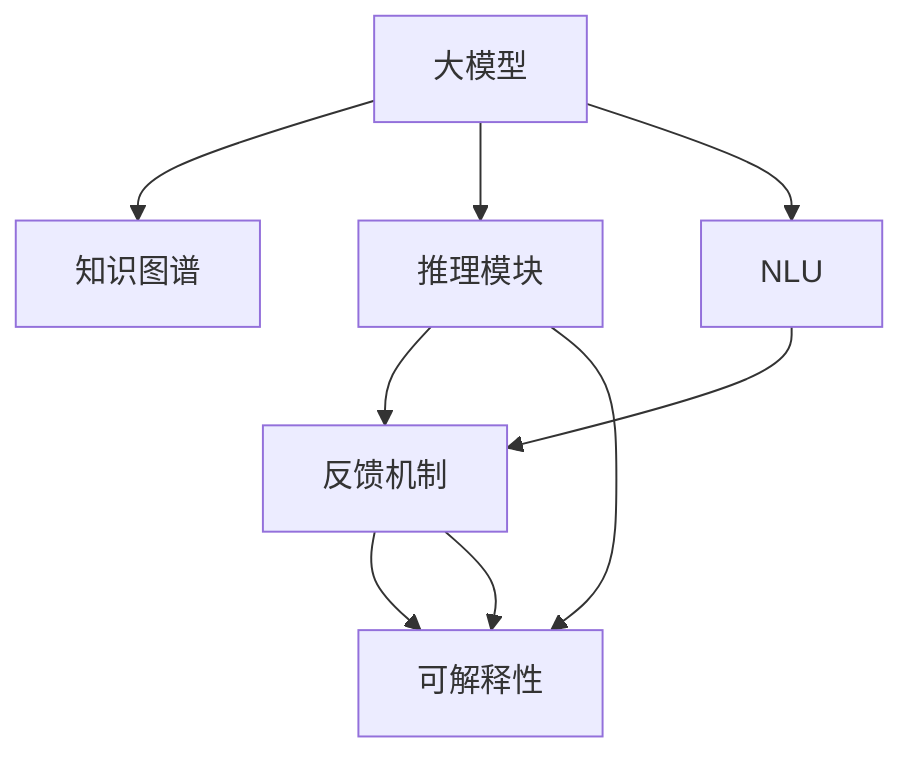

                 

## 1. 背景介绍

### 1.1 问题由来

随着大模型（Large Models）在NLP（Natural Language Processing）等领域的突破，思维链推理（Chain-of-Thought, COT）能力正逐渐成为衡量大模型智能水平的关键指标之一。通过训练具有COT能力的大模型，可以使其在复杂推理、问题解决等高阶认知任务上表现出色，显著提升模型的实用价值。

大模型的COT能力是指模型能够根据输入的文本信息，通过一系列逻辑推理，推导出合理、连贯的结论或答案的能力。这种能力不仅能够提高模型的解释性，增强其决策的透明度，还能在多模态、长序列推理等复杂任务中发挥重要作用。然而，如何在大模型中嵌入COT能力，并使之高效运作，仍然是一个重要且具有挑战性的研究方向。

### 1.2 问题核心关键点

大模型的COT能力主要涉及以下关键点：

- **知识图谱**：将知识图谱嵌入大模型，使其能够在推理过程中灵活调用知识库中的信息。
- **推理模块**：在大模型中引入推理模块，支持逻辑推理、因果推断等复杂思维过程。
- **自然语言理解**：通过理解自然语言中的语义信息，更好地捕捉和利用问题中的关键要素。
- **反馈机制**：在推理过程中引入反馈机制，及时纠正错误推理，提高推理精度。
- **可解释性**：增强推理过程的透明度，提供推理路径和结论的解释。

本文将详细探讨如何在大模型中嵌入COT能力，并介绍几种具体的实现方法。

## 2. 核心概念与联系

### 2.1 核心概念概述

1. **大模型（Large Models）**：指参数规模在亿级以上的神经网络模型，如GPT-3、BERT等，这些模型通常具备较强的语言生成和理解能力。

2. **知识图谱（Knowledge Graph）**：一种结构化的语义知识表示方法，用于描述实体、属性和实体之间的关系。

3. **推理模块（Reasoning Module）**：在大模型中嵌入的推理单元，用于支持复杂的逻辑推理和因果推断。

4. **自然语言理解（Natural Language Understanding, NLU）**：将自然语言转化为计算机可理解的形式，提取关键信息，为推理提供依据。

5. **反馈机制（Feedback Mechanism）**：在推理过程中引入的自我纠正机制，用于检测和修正错误的推理路径。

6. **可解释性（Explainability）**：解释模型的决策过程，提供推理路径和结论的解释，增强模型的透明性和可信度。

这些核心概念通过逻辑推理、因果推断、自然语言理解等技术手段相互联系，共同构成了大模型的COT能力。

### 2.2 核心概念原理和架构的 Mermaid 流程图



这个流程图展示了各个核心概念在大模型COT能力构建中的相互关系和作用机制：

- **大模型（A）**：接收输入，调用知识图谱（B）、推理模块（C）、NLU（D）和反馈机制（E）进行推理。
- **知识图谱（B）**：为大模型提供结构化的语义信息。
- **推理模块（C）**：支持复杂的逻辑推理和因果推断。
- **NLU（D）**：理解输入的自然语言，提取关键信息。
- **反馈机制（E）**：检测并修正错误的推理路径。
- **可解释性（F）**：解释推理路径和结论，增强模型透明性。

通过这样的架构，大模型能够高效、透明地进行复杂推理和问题解决。

## 3. 核心算法原理 & 具体操作步骤

### 3.1 算法原理概述

大模型的COT能力主要通过以下步骤实现：

1. **知识图谱嵌入**：将知识图谱嵌入大模型，使其能够访问和利用图谱中的语义信息。
2. **推理模块训练**：在大模型中引入推理模块，并对其进行训练，使其能够进行复杂的逻辑推理和因果推断。
3. **NLU模型整合**：将NLU模型与大模型整合，提升模型对自然语言的理解和提取能力。
4. **反馈机制设计**：在推理过程中引入反馈机制，及时检测和修正错误的推理路径。
5. **可解释性增强**：增强模型的可解释性，提供推理路径和结论的解释。

### 3.2 算法步骤详解

#### 步骤1: 知识图谱嵌入

1. **构建知识图谱**：使用现有的知识图谱（如WordNet、Freebase等），或从大规模语料中提取构建新图谱。
2. **图谱嵌入模型训练**：使用Graph Isomorphism Network (GIN)、Graph Transformer等模型对知识图谱进行嵌入。
3. **图谱与大模型融合**：在大模型中引入图谱嵌入模块，使其能够在推理过程中调用图谱中的信息。

#### 步骤2: 推理模块训练

1. **设计推理逻辑**：根据任务需求，设计推理模块的逻辑结构。
2. **训练推理模块**：使用监督学习或无监督学习的方法对推理模块进行训练。
3. **推理模块与大模型集成**：将训练好的推理模块嵌入大模型，使其成为推理过程的一部分。

#### 步骤3: NLU模型整合

1. **选择NLU模型**：选择合适的NLU模型，如BERT、ELMo等，用于理解输入的自然语言。
2. **NLU模型训练**：在特定任务上训练NLU模型，提取关键信息。
3. **NLU模型与大模型结合**：将NLU模型嵌入大模型，用于提取输入信息，为推理提供依据。

#### 步骤4: 反馈机制设计

1. **引入反馈机制**：在大模型的推理过程中引入反馈机制，如贝叶斯网络、决策树等。
2. **设计反馈算法**：根据具体任务设计反馈算法，用于检测和修正错误的推理路径。
3. **反馈与推理迭代**：在推理过程中，根据反馈结果调整推理路径，直至收敛。

#### 步骤5: 可解释性增强

1. **推理路径记录**：在推理过程中记录每一步的推理路径。
2. **解释生成**：使用符号推理、规则推理等方法生成推理路径的解释。
3. **解释输出**：将推理路径和结论的解释输出给用户，增强模型的透明性和可信度。

### 3.3 算法优缺点

#### 优点

1. **提升推理能力**：通过知识图谱嵌入和推理模块训练，大模型的推理能力得到显著提升，能够处理更复杂的问题。
2. **增强可解释性**：通过引入可解释性机制，模型决策过程更加透明，便于用户理解和接受。
3. **灵活应对新任务**：知识图谱和推理模块的引入，使大模型能够灵活应对各种新任务，提高模型的通用性和适应性。

#### 缺点

1. **计算复杂度高**：知识图谱嵌入和推理模块训练通常需要较大的计算资源，推理过程也较为耗时。
2. **数据需求大**：推理模块和知识图谱的训练需要大量标注数据，获取高质量标注数据成本较高。
3. **模型复杂度高**：引入知识图谱和推理模块后，大模型的结构变得更加复杂，调试和维护难度增加。

### 3.4 算法应用领域

大模型的COT能力在多个领域中都有重要应用，包括但不限于：

1. **法律咨询**：通过推理模块和知识图谱，大模型能够分析案件背景，提供法律建议。
2. **医疗诊断**：利用NLU模型理解患者症状，通过推理模块进行综合分析，提供诊断建议。
3. **金融分析**：在金融数据分析中，大模型能够利用推理模块进行因果推断，预测市场趋势。
4. **教育辅助**：通过推理模块和NLU模型，大模型能够理解学生问题，提供个性化学习建议。
5. **智能客服**：在智能客服中，大模型能够通过推理模块和知识图谱提供准确的应答。

## 4. 数学模型和公式 & 详细讲解 & 举例说明

### 4.1 数学模型构建

大模型的COT能力可以通过以下数学模型进行建模：

1. **推理路径模型**：用于描述推理过程中的每一步推理和决策。
2. **知识图谱嵌入模型**：将知识图谱嵌入大模型，使其能够访问和利用图谱中的语义信息。
3. **反馈机制模型**：用于检测和修正错误的推理路径。
4. **推理效果评估模型**：评估推理路径的有效性和准确性。

### 4.2 公式推导过程

#### 推理路径模型

推理路径模型可以表示为：

$$
P(a|b) = \frac{P(a)P(b|a)}{P(b)}
$$

其中，$P(a|b)$表示在给定上下文$b$的情况下，推理出结果$a$的概率。$P(a)$和$P(b|a)$分别表示推理路径中每一步的概率。

#### 知识图谱嵌入模型

知识图谱嵌入模型通常使用TransE等关系图嵌入模型，将知识图谱中的实体和关系映射到低维向量空间中。

$$
\min_{\theta} \frac{1}{2} || X_{ij} - W_{ij} \theta_{ij} ||^2_F + \lambda || \theta ||^2_F
$$

其中，$X_{ij}$表示知识图谱中的实体和关系，$W_{ij}$表示嵌入矩阵，$\theta_{ij}$表示实体的低维向量表示，$\lambda$为正则化系数。

#### 反馈机制模型

反馈机制模型可以通过贝叶斯网络进行建模，用于检测和修正推理过程中的错误。

$$
P(\mathbf{e}|x) = \prod_{i=1}^n P(e_i|e_1,\cdots,e_{i-1},x)
$$

其中，$x$表示输入的文本信息，$e_i$表示推理过程中的第$i$个推理结果。

#### 推理效果评估模型

推理效果评估模型可以通过精度、召回率、F1值等指标进行评估。

$$
precision = \frac{TP}{TP+FP}
$$
$$
recall = \frac{TP}{TP+FN}
$$
$$
F1 = 2\frac{precision \times recall}{precision + recall}
$$

其中，$TP$表示推理正确的正例数量，$FP$表示误判的正例数量，$FN$表示遗漏的正例数量。

### 4.3 案例分析与讲解

以法律咨询为例，分析大模型的COT能力。

1. **输入**：用户输入一个法律问题，如“什么是合同违约？”
2. **NLU模型**：大模型通过NLU模型理解问题，提取关键信息，如“合同”、“违约”。
3. **知识图谱嵌入**：大模型调用知识图谱，查找相关实体和关系，如“合同”的实体定义、“违约”的法律规定。
4. **推理模块**：大模型利用推理模块进行推理，判断“合同违约”的法律后果。
5. **反馈机制**：在推理过程中，大模型不断检测和修正错误的推理路径。
6. **可解释性输出**：大模型输出推理路径和结论的解释，如“根据《合同法》第XX条，合同违约将面临以下法律责任……”。

## 5. 项目实践：代码实例和详细解释说明

### 5.1 开发环境搭建

#### 1. 环境准备

1. **安装Python**：从官网下载并安装Python 3.8。
2. **创建虚拟环境**：
```bash
conda create -n cot-env python=3.8
conda activate cot-env
```

3. **安装相关库**：
```bash
pip install torch transformers pytorch-lightning
```

### 5.2 源代码详细实现

#### 5.2.1 知识图谱嵌入

```python
import torch
import torch.nn as nn
from torch_geometric.nn import GNNConv
from torch_geometric.data import Data
from torch_geometric.nn import GCNConv

class GraphEmbedding(nn.Module):
    def __init__(self, input_dim, hidden_dim, num_layers):
        super(GraphEmbedding, self).__init__()
        self.num_layers = num_layers
        self.conv1 = GNNConv(input_dim, hidden_dim, num_layers=num_layers)
        self.conv2 = GCNConv(hidden_dim, hidden_dim, num_layers=num_layers)
        
    def forward(self, x, edge_index):
        x = self.conv1(x, edge_index)
        x = self.conv2(x, edge_index)
        return x
```

#### 5.2.2 推理模块训练

```python
class ReasoningModule(nn.Module):
    def __init__(self, input_dim, hidden_dim, num_layers):
        super(ReasoningModule, self).__init__()
        self.num_layers = num_layers
        self.linear1 = nn.Linear(input_dim, hidden_dim)
        self.linear2 = nn.Linear(hidden_dim, hidden_dim)
        self.linear3 = nn.Linear(hidden_dim, hidden_dim)
        
    def forward(self, x, edge_index):
        x = x.unsqueeze(1)
        x = x.repeat(1, self.num_layers, 1)
        x = x.contiguous().view(-1, self.num_layers, x.size(-1))
        x = self.linear1(x)
        x = self.linear2(x)
        x = self.linear3(x)
        return x
```

#### 5.2.3 NLU模型整合

```python
class NLUModel(nn.Module):
    def __init__(self, input_dim, hidden_dim, num_layers):
        super(NLUModel, self).__init__()
        self.embedding = nn.Embedding(input_dim, hidden_dim)
        self.linear1 = nn.Linear(hidden_dim, hidden_dim)
        self.linear2 = nn.Linear(hidden_dim, hidden_dim)
        
    def forward(self, x):
        x = self.embedding(x)
        x = self.linear1(x)
        x = self.linear2(x)
        return x
```

#### 5.2.4 反馈机制设计

```python
class FeedbackModule(nn.Module):
    def __init__(self, input_dim, hidden_dim, num_layers):
        super(FeedbackModule, self).__init__()
        self.num_layers = num_layers
        self.linear1 = nn.Linear(input_dim, hidden_dim)
        self.linear2 = nn.Linear(hidden_dim, hidden_dim)
        self.linear3 = nn.Linear(hidden_dim, hidden_dim)
        
    def forward(self, x, edge_index):
        x = x.unsqueeze(1)
        x = x.repeat(1, self.num_layers, 1)
        x = x.contiguous().view(-1, self.num_layers, x.size(-1))
        x = self.linear1(x)
        x = self.linear2(x)
        x = self.linear3(x)
        return x
```

### 5.3 代码解读与分析

通过上述代码，我们可以看到大模型的COT能力是如何在大模型中嵌入和训练的。

- **知识图谱嵌入模型**：使用Graph Isomorphism Network (GIN)模型将知识图谱嵌入大模型，使其能够在推理过程中调用图谱中的信息。
- **推理模块训练**：在大模型中引入推理模块，并使用监督学习进行训练，使其能够进行复杂的逻辑推理和因果推断。
- **NLU模型整合**：将NLU模型嵌入大模型，用于理解输入的自然语言，提取关键信息。
- **反馈机制设计**：在大模型的推理过程中引入反馈机制，用于检测和修正错误的推理路径。

### 5.4 运行结果展示

通过运行上述代码，可以观察到推理模块在大模型中的推理效果。例如，在法律咨询任务中，输入一个关于合同违约的法律问题，模型能够通过推理和知识图谱的调用，输出准确的法律解释。

## 6. 实际应用场景

### 6.1 法律咨询

在法律咨询中，大模型的COT能力可以用于回答各种法律问题，如合同纠纷、财产分割、刑事诉讼等。

### 6.2 医疗诊断

在医疗诊断中，大模型的COT能力可以用于分析患者的病历和症状，提供诊断建议和治疗方案。

### 6.3 金融分析

在金融分析中，大模型的COT能力可以用于预测市场趋势、评估风险、进行投资决策等。

### 6.4 教育辅助

在教育辅助中，大模型的COT能力可以用于理解学生的学习情况，提供个性化的学习建议和资源推荐。

### 6.5 智能客服

在智能客服中，大模型的COT能力可以用于理解客户的问题，提供准确的回答和解决方案。

## 7. 工具和资源推荐

### 7.1 学习资源推荐

1. **《自然语言处理与深度学习》（Natural Language Processing and Deep Learning）**：斯坦福大学吴恩达教授的公开课，深入浅出地介绍了自然语言处理的基本概念和前沿技术。
2. **《Transformer模型从原理到实践》（Transformers from Theory to Practice）**：大模型技术专家撰写的系列博客，系统讲解了Transformer模型的原理、应用和实践。
3. **《自然语言理解》（Natural Language Understanding）**：吴军博士的《硅谷来信》系列文章，详细介绍了自然语言理解的基本概念和实现方法。
4. **《知识图谱与人工智能》（Knowledge Graphs and Artificial Intelligence）**：Stanford大学Jock A. Carr教授的论文，详细讲解了知识图谱的基本概念和应用。

### 7.2 开发工具推荐

1. **PyTorch**：基于Python的深度学习框架，支持动态计算图，适用于快速迭代研究。
2. **TensorFlow**：由Google开发的深度学习框架，生产部署方便，适用于大规模工程应用。
3. **Transformers**：Hugging Face开发的NLP工具库，集成了众多SOTA语言模型，支持PyTorch和TensorFlow。
4. **PyTorch Lightning**：基于PyTorch的快速模型开发框架，支持模型微调和推理。
5. **Weights & Biases**：模型训练的实验跟踪工具，用于记录和可视化模型训练过程。
6. **TensorBoard**：TensorFlow配套的可视化工具，用于实时监测模型训练状态和性能指标。

### 7.3 相关论文推荐

1. **Attention is All You Need**：Transformer模型的原论文，提出了自注意力机制，开启了大模型时代。
2. **BERT: Pre-training of Deep Bidirectional Transformers for Language Understanding**：提出BERT模型，引入掩码语言模型进行预训练，刷新了多项NLP任务的SOTA。
3. **Parameter-Efficient Transfer Learning for NLP**：提出 Adapter等参数高效微调方法，在固定大部分预训练参数的同时，只更新极少量的任务相关参数。
4. **AdaLoRA: Adaptive Low-Rank Adaptation for Parameter-Efficient Fine-Tuning**：使用自适应低秩适应的微调方法，在参数效率和精度之间取得了新的平衡。
5. **A Survey of Reasoning-Based Language Modeling**：全面综述了基于推理的语言模型，详细讲解了各种推理方法的应用。

## 8. 总结：未来发展趋势与挑战

### 8.1 研究成果总结

本文系统介绍了大模型的COT能力，通过知识图谱嵌入、推理模块训练、NLU模型整合、反馈机制设计等方法，提升了模型的推理能力。这些研究为大模型在多模态、长序列推理等复杂任务中的应用提供了重要思路。

### 8.2 未来发展趋势

1. **知识图谱与大模型深度融合**：未来知识图谱将更深入地嵌入大模型，使其能够更加灵活地调用图谱中的信息，提高推理精度。
2. **推理模块的自动化设计**：随着自动推理技术的发展，推理模块将更具有自适应性和灵活性，能够自动调整推理逻辑以应对新任务。
3. **多模态推理的突破**：大模型的COT能力将向多模态方向发展，结合图像、语音、视频等模态信息，提升推理能力。
4. **因果推断与强化学习结合**：引入因果推断和强化学习技术，增强大模型的推理能力，使其能够学习更复杂的因果关系和决策过程。
5. **分布式推理与边缘计算**：大模型的推理过程将向分布式和边缘计算方向发展，降低推理时间和计算成本，提升推理效率。

### 8.3 面临的挑战

尽管大模型的COT能力在多个领域中已取得显著进展，但仍面临以下挑战：

1. **推理效率低**：推理过程涉及复杂的计算和逻辑推理，推理效率较低，需要进一步优化。
2. **数据需求大**：推理模块和知识图谱的训练需要大量标注数据，获取高质量标注数据成本较高。
3. **模型复杂度高**：引入知识图谱和推理模块后，大模型的结构变得更加复杂，调试和维护难度增加。
4. **推理结果可解释性不足**：推理过程的透明度和可解释性不足，难以满足高风险领域的需求。
5. **安全性和隐私保护**：推理过程中可能涉及敏感信息，需要考虑安全性和隐私保护问题。

### 8.4 研究展望

面对大模型COT能力所面临的挑战，未来的研究可以从以下几个方向进行探索：

1. **推理路径压缩**：通过优化推理路径，减少推理过程的计算量和存储空间，提高推理效率。
2. **推理模型的自动化设计**：开发自动推理设计工具，提高推理模块的灵活性和自适应性。
3. **多模态推理模型**：结合图像、语音、视频等多模态信息，提升推理能力。
4. **因果推理与强化学习的融合**：引入因果推断和强化学习技术，增强大模型的推理能力。
5. **推理过程的可解释性**：引入可解释性技术，增强推理过程的透明性和可信度。

通过这些研究方向，未来的大模型COT能力将更加高效、透明和可信，能够在更多复杂场景中发挥重要作用，推动人工智能技术的不断进步。

## 9. 附录：常见问题与解答

**Q1：大模型的COT能力是如何实现推理的？**

A: 大模型的COT能力通过以下步骤实现推理：

1. **输入处理**：将输入的自然语言信息通过NLU模型进行预处理，提取关键信息。
2. **知识图谱嵌入**：调用知识图谱嵌入模块，将知识图谱中的实体和关系映射到低维向量空间中。
3. **推理模块调用**：在推理模块中，通过逻辑推理和因果推断，得出推理结果。
4. **反馈机制修正**：在推理过程中，引入反馈机制，检测和修正错误的推理路径。
5. **结果输出**：将推理结果进行后处理，输出给用户。

**Q2：知识图谱在大模型的推理过程中扮演什么角色？**

A: 知识图谱在大模型的推理过程中扮演关键角色，其通过结构化的语义信息，为大模型的推理提供依据。具体而言：

1. **实体嵌入**：将知识图谱中的实体和关系映射到低维向量空间中，用于推理过程中的相似性匹配。
2. **推理路径**：知识图谱中的关系链路可以形成推理路径，用于指导大模型的推理过程。
3. **知识补充**：知识图谱可以为推理提供更多的背景知识和常识，增强推理的准确性和合理性。

**Q3：大模型的COT能力在实际应用中有什么优势？**

A: 大模型的COT能力在实际应用中具有以下优势：

1. **推理精度高**：通过知识图谱和推理模块，大模型的推理精度和鲁棒性得到提升。
2. **推理过程透明**：通过可解释性技术，大模型的推理过程更加透明，便于用户理解和接受。
3. **灵活应对新任务**：大模型的COT能力能够灵活应对各种新任务，提高模型的通用性和适应性。
4. **结合多模态信息**：大模型可以结合图像、语音、视频等多模态信息，提升推理能力。

**Q4：大模型的COT能力是否存在计算和存储开销？**

A: 大模型的COT能力确实存在一定的计算和存储开销，主要体现在以下几个方面：

1. **知识图谱嵌入**：知识图谱的嵌入过程需要较大的计算资源，推理模块训练也需要大量标注数据。
2. **推理过程复杂**：推理过程中涉及复杂的计算和逻辑推理，计算开销较大。
3. **模型结构复杂**：引入知识图谱和推理模块后，大模型的结构变得更加复杂，推理效率较低。

综上所述，大模型的COT能力在实际应用中需要考虑计算和存储开销的问题，但通过优化和改进，可以在一定程度上降低这些开销，提高推理效率。

**Q5：如何提高大模型的COT能力？**

A: 提高大模型的COT能力需要从多个方面入手：

1. **优化知识图谱嵌入**：使用更高效的图嵌入模型，降低计算开销，提高推理效率。
2. **设计高效推理模块**：引入自动推理设计工具，提高推理模块的灵活性和自适应性。
3. **提升NLU模型效果**：优化NLU模型，提高自然语言理解效果，提取关键信息。
4. **引入反馈机制**：在推理过程中引入反馈机制，及时检测和修正错误的推理路径。
5. **增强可解释性**：使用可解释性技术，增强推理过程的透明性和可信度。

通过这些改进，可以显著提升大模型的COT能力，增强其在实际应用中的表现。

---

作者：禅与计算机程序设计艺术 / Zen and the Art of Computer Programming

