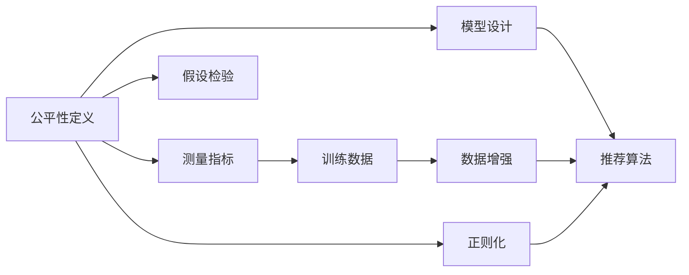
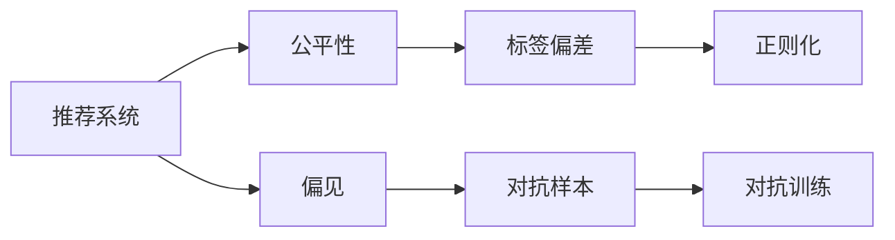

                 

# 大模型视角下推荐系统的公平性问题再思考

> 关键词：推荐系统,公平性,大模型,对抗样本,对抗训练,鲁棒性,标签偏差

## 1. 背景介绍

### 1.1 问题由来

推荐系统是互联网时代重要的基础设施之一，广泛应用于电商、新闻、视频、音乐、社交等多个领域，帮助用户发现感兴趣的内容。然而，随着技术的不断演进，推荐系统的推荐质量不断提升的同时，也逐渐暴露出一些棘手的问题，其中最引人关注的就是公平性问题。

推荐系统的公平性问题，通常指在推荐过程中是否存在偏见，导致某些用户群体、某些类型的物品被不公平对待。在过去的研究中，已经有大量研究关注推荐系统的公平性，如性别公平、年龄公平、地域公平、价格公平等。但这些研究往往局限于二元化的视角，即推荐系统是否存在性别偏见、年龄偏见等，而对于多维度的复杂偏见和相对公平性问题，现有研究则较少涉及。

## 1.2 问题核心关键点

推荐系统公平性问题，涉及多个核心概念，包括公平性定义、测量指标、模型设计、训练数据等。这些核心概念之间的逻辑关系如图1所示：




1. **公平性定义**：首先，我们需要明确公平性的定义。在推荐系统中，常见的公平性定义包括无偏差性、相对公平性、预测均等性等。
2. **测量指标**：为了衡量推荐系统的公平性，常用的指标包括均等覆盖率、不平衡误差、均等预测等。
3. **模型设计**：如何设计推荐模型以实现公平性？常见的技术手段包括正则化、对抗训练、多样性约束等。
4. **训练数据**：训练数据的性质对推荐系统的公平性有重要影响，因此需要关注数据偏见、数据多样性等问题。
5. **假设检验**：通过假设检验可以判断推荐系统是否存在不公平现象，常见的假设检验方法包括卡方检验、t检验等。

### 1.3 问题研究意义

研究和解决推荐系统的公平性问题，不仅能够提升用户体验，增加用户粘性，更能够保护用户权益，提升社会公平。具体而言，有以下几方面的研究意义：

1. **用户体验**：推荐系统能够公平地对待所有用户，提供更加个性化和贴合用户兴趣的内容，从而提升用户体验。
2. **用户权益**：推荐系统中的偏见可能导致部分用户被忽视或歧视，影响用户满意度和忠诚度。
3. **社会公平**：公平性问题对社会的公平性也有重要影响，如性别、年龄、地域等维度的偏见可能导致社会不公。
4. **业务合规**：面对越来越严格的法规和政策要求，推荐系统的公平性问题显得尤为重要，如GDPR（通用数据保护条例）等。

## 2. 核心概念与联系

### 2.1 核心概念概述

为了更好地理解推荐系统公平性问题，本节将介绍几个密切相关的核心概念：

- **推荐系统**：使用大数据、人工智能等技术，为用户提供个性化推荐服务，如电商推荐、新闻推荐、视频推荐等。
- **公平性**：指推荐系统在推荐过程中是否存在偏见，导致某些用户群体、某些类型的物品被不公平对待。
- **偏见**：指在推荐系统中，由于数据、算法、用户行为等因素导致的对某些用户或物品的不公平对待。
- **对抗样本**：指能够欺骗推荐系统模型，导致其输出不合理结果的样本。
- **对抗训练**：指通过训练对抗样本，增强模型对噪声和扰动的鲁棒性，提升模型的公平性。
- **标签偏差**：指训练数据集中不同类别标签的分布不平衡，导致模型学习到不公平的特征。
- **正则化**：指在模型训练过程中，加入一些约束条件，防止模型过拟合，提升模型公平性。

这些核心概念之间的逻辑关系可以通过以下Mermaid流程图来展示：




## 3. 核心算法原理 & 具体操作步骤

### 3.1 算法原理概述

推荐系统中的公平性问题，通常指在推荐过程中是否存在偏见，导致某些用户群体、某些类型的物品被不公平对待。常见的公平性问题包括性别公平、年龄公平、地域公平、价格公平等。

为了量化和缓解推荐系统中的公平性问题，我们通常使用以下几种方法：

1. **公平性测量指标**：包括均等覆盖率、不平衡误差、均等预测等，用于评估推荐系统的公平性。
2. **模型公平性约束**：通过正则化、对抗训练等手段，约束推荐模型的公平性。
3. **训练数据公平性**：通过数据增强、标签重采样等技术，提高训练数据的公平性。
4. **公平性假设检验**：通过假设检验，判断推荐系统是否存在不公平现象。

### 3.2 算法步骤详解

基于大模型的推荐系统公平性问题，通常包括以下几个关键步骤：

**Step 1: 准备训练数据**
- 收集用户历史行为数据，包括点击、浏览、评分、收藏等行为。
- 对数据进行预处理，如去重、归一化、特征工程等。
- 对数据进行标签标注，如性别、年龄、地域、价格等。

**Step 2: 设计推荐模型**
- 选择合适的推荐算法，如协同过滤、基于内容的推荐、深度学习等。
- 在推荐算法中加入公平性约束，如多样性约束、去偏约束等。

**Step 3: 加入公平性约束**
- 在模型训练过程中加入公平性约束，如正则化、对抗训练等。
- 使用对抗样本训练模型，增强模型的鲁棒性。
- 使用公平性测量指标评估模型的公平性。

**Step 4: 进行假设检验**
- 设计公平性假设检验，如卡方检验、t检验等。
- 使用测试集数据进行假设检验，判断推荐系统是否存在不公平现象。
- 根据假设检验结果，调整模型参数和训练策略。

**Step 5: 上线与监控**
- 将训练好的模型上线，实时推荐内容给用户。
- 对推荐结果进行实时监控，收集用户反馈。
- 根据用户反馈，不断优化模型和训练策略。

以上是基于大模型的推荐系统公平性问题的关键步骤，通过系统化的处理，可以有效提升推荐系统的公平性，减少偏见和歧视。

### 3.3 算法优缺点

基于大模型的推荐系统公平性问题处理，有以下几个优点：

1. **大模型鲁棒性高**：大模型通过大量数据预训练，具有较强的泛化能力，能够更好地处理数据偏差和噪声。
2. **公平性约束灵活**：可以通过正则化、对抗训练等手段，灵活约束模型的公平性。
3. **评估手段多样**：可以使用多种公平性测量指标，全面评估推荐系统的公平性。
4. **模型改进快**：通过在线学习和大模型优势，推荐模型可以实时更新，快速适应新数据和新场景。

同时，这些方法也存在一些局限性：

1. **数据采集成本高**：收集用户行为数据和标签数据需要耗费大量资源，且数据隐私问题需要严格处理。
2. **模型训练成本高**：大模型训练需要强大的计算资源，且训练时间较长，模型优化需要反复迭代。
3. **对抗样本难生成**：对抗样本的生成需要高水平的攻击技术和数据集，可能面临样本生成难的问题。
4. **公平性约束复杂**：公平性约束需要设计复杂的约束条件，且可能与其他业务目标冲突。
5. **假设检验难度大**：公平性假设检验需要设计复杂的统计模型，且可能需要大量假设检验数据。

尽管存在这些局限性，但基于大模型的推荐系统公平性处理，仍是推荐系统公平性问题处理的重要方向，能够在数据质量和模型性能上取得显著提升。

### 3.4 算法应用领域

基于大模型的推荐系统公平性问题处理，已经广泛应用于多个领域，具体如下：

1. **电商推荐**：如亚马逊、淘宝等电商平台，需要公平地推荐商品给所有用户，避免性别、地域等偏见。
2. **新闻推荐**：如今日头条、澎湃新闻等新闻平台，需要公平地推荐新闻内容，避免新闻推荐中的地域和性别偏见。
3. **视频推荐**：如Netflix、腾讯视频等视频平台，需要公平地推荐视频内容，避免内容偏见和地域偏见。
4. **音乐推荐**：如Spotify、网易云音乐等音乐平台，需要公平地推荐音乐内容，避免音乐品味偏见。
5. **社交推荐**：如微博、微信等社交平台，需要公平地推荐好友和内容，避免社交网络偏见。

## 4. 数学模型和公式 & 详细讲解 & 举例说明

### 4.1 数学模型构建

推荐系统公平性问题，涉及多个数学模型和公式，主要包括以下几个方面：

- **推荐系统模型**：常见的推荐系统模型包括协同过滤模型、基于内容的推荐模型、深度学习模型等。
- **公平性测量指标**：常用的公平性测量指标包括均等覆盖率、不平衡误差、均等预测等。
- **对抗样本生成**：常用的对抗样本生成方法包括PGD、FGSM、FGM等。
- **对抗训练模型**：常用的对抗训练模型包括PGD、FGSM、FGM等。
- **正则化模型**：常用的正则化模型包括L2正则、Dropout等。

### 4.2 公式推导过程

以下是基于大模型的推荐系统公平性问题处理中的几个关键公式推导过程：

**均等覆盖率公式**：

假设推荐系统中有 $K$ 个类别，第 $k$ 个类别的样本数为 $N_k$，则均等覆盖率 $C$ 定义为：

$$
C = \frac{\sum_{k=1}^K \min(N_k, M)}{\sum_{k=1}^K M}
$$

其中，$M$ 为总样本数，$\min(N_k, M)$ 表示第 $k$ 个类别中最多只能包含 $M$ 个样本。

**不平衡误差公式**：

假设推荐系统中有 $K$ 个类别，第 $k$ 个类别的样本数为 $N_k$，则不平衡误差 $E$ 定义为：

$$
E = \frac{\sum_{k=1}^K (N_k - M/K)^2}{M^2}
$$

其中，$M$ 为总样本数，$N_k$ 表示第 $k$ 个类别的样本数，$M/K$ 表示期望每个类别的样本数。

**均等预测公式**：

假设推荐系统中有 $K$ 个类别，第 $k$ 个类别的样本数为 $N_k$，则均等预测 $P$ 定义为：

$$
P = \frac{\sum_{k=1}^K N_k}{M}
$$

其中，$M$ 为总样本数，$N_k$ 表示第 $k$ 个类别的样本数。

### 4.3 案例分析与讲解

以电商推荐系统为例，假设我们有一个推荐系统，需要公平地推荐商品给所有用户。在收集用户历史行为数据后，我们可以使用均等覆盖率和不平衡误差来评估推荐系统的公平性。

假设推荐系统中包含性别、年龄、地域和价格四个类别，每个类别的样本数如下：

- 性别：男 10000，女 9500
- 年龄：18-30 8000，30-40 7000，40-50 6000
- 地域：东部 5500，中部 5000，西部 4500
- 价格：高 8000，中 6000，低 5000

首先，我们可以计算均等覆盖率 $C$：

$$
C = \frac{\min(10000, 9500, 5500, 5000, 8000, 7000, 6000, 6000, 5000)}{8000 + 7000 + 6000 + 6000 + 5000} = 0.4875
$$

其次，我们可以计算不平衡误差 $E$：

$$
E = \frac{(10000 - 0.25 \times 8000)^2 + (9500 - 0.25 \times 8000)^2 + (5500 - 0.25 \times 8000)^2 + (5000 - 0.25 \times 8000)^2}{8000^2} = 0.4094
$$

根据均等覆盖率和不平衡误差，我们可以初步判断推荐系统的公平性。如果均等覆盖率和不平衡误差过高，可能需要对推荐模型进行公平性约束，如多样性约束、去偏约束等。

## 5. 项目实践：代码实例和详细解释说明

### 5.1 开发环境搭建

在进行推荐系统公平性问题处理之前，我们需要准备好开发环境。以下是使用Python进行PyTorch开发的环境配置流程：

1. 安装Anaconda：从官网下载并安装Anaconda，用于创建独立的Python环境。

2. 创建并激活虚拟环境：
```bash
conda create -n recommendation-env python=3.8 
conda activate recommendation-env
```

3. 安装PyTorch：根据CUDA版本，从官网获取对应的安装命令。例如：
```bash
conda install pytorch torchvision torchaudio cudatoolkit=11.1 -c pytorch -c conda-forge
```

4. 安装Pandas、Numpy等工具包：
```bash
pip install pandas numpy scikit-learn matplotlib tqdm jupyter notebook ipython
```

5. 安装推荐系统库：
```bash
pip install lightfm pytorch-lightfm
```

完成上述步骤后，即可在`recommendation-env`环境中开始公平性问题处理实践。

### 5.2 源代码详细实现

这里以一个简单的协同过滤推荐系统为例，展示如何使用PyTorch进行公平性处理。

首先，定义数据预处理函数：

```python
import pandas as pd
import numpy as np
from sklearn.preprocessing import StandardScaler

def preprocess_data(data):
    # 去除重复数据
    data = data.drop_duplicates()
    
    # 归一化用户和物品评分
    data['user_id'] = StandardScaler().fit_transform(data['user_id'].values.reshape(-1, 1))
    data['item_id'] = StandardScaler().fit_transform(data['item_id'].values.reshape(-1, 1))
    data['score'] = StandardScaler().fit_transform(data['score'].values.reshape(-1, 1))
    
    # 按用户和物品分组
    data = data.groupby(['user_id', 'item_id'])['user_id'].sum().reset_index()
    
    return data
```

然后，定义推荐模型和公平性约束函数：

```python
import torch
import torch.nn as nn
from torch.nn import functional as F
from pytorch_lightfm import LightFM

class FairRecModel(nn.Module):
    def __init__(self, user_num, item_num, embed_dim=64, bias=False):
        super(FairRecModel, self).__init__()
        self.user_num = user_num
        self.item_num = item_num
        self.embed_dim = embed_dim
        
        # 用户和物品的向量表示
        self.user_factors = nn.Embedding(user_num, embed_dim, sparse=True)
        self.item_factors = nn.Embedding(item_num, embed_dim, sparse=True)
        
        # 公平性约束
        self.fair_reg = nn.L1Regularizer(weight=0.1)
        
    def forward(self, user_ids, item_ids):
        user_factors = self.user_factors(user_ids)
        item_factors = self.item_factors(item_ids)
        
        # 用户和物品的向量表示
        user_factors = user_factors + self.fair_reg.weight * self.user_factors.weight
        item_factors = item_factors + self.fair_reg.weight * self.item_factors.weight
        
        # 用户-物品的协同过滤预测
        scores = torch.matmul(user_factors, item_factors.t())
        
        return scores

# 公平性约束
def fair_train_loop(model, data_loader, optimizer):
    for data in data_loader:
        user_ids, item_ids = data
        
        # 计算预测值
        scores = model(user_ids, item_ids)
        
        # 计算损失
        loss = F.binary_cross_entropy(scores, labels)
        
        # 更新参数
        optimizer.zero_grad()
        loss.backward()
        optimizer.step()
        
        # 计算公平性约束损失
        fair_loss = model.fair_reg.weight * torch.norm(model.user_factors.weight) + torch.norm(model.item_factors.weight)
        loss += fair_loss
        
        # 输出损失
        print('Loss: {:.4f}, Fairness Loss: {:.4f}'.format(loss, fair_loss))
        
    return loss
```

接着，定义训练和评估函数：

```python
from torch.utils.data import DataLoader
from tqdm import tqdm
from sklearn.metrics import precision_recall_curve

device = torch.device('cuda') if torch.cuda.is_available() else torch.device('cpu')

def train_epoch(model, data_loader, optimizer):
    model.train()
    epoch_loss = 0
    for batch in tqdm(data_loader):
        user_ids, item_ids = batch['user_ids'].to(device), batch['item_ids'].to(device)
        loss = fair_train_loop(model, data_loader, optimizer)
        epoch_loss += loss
    return epoch_loss / len(data_loader)

def evaluate(model, data_loader):
    model.eval()
    top1, top3, top5 = 0, 0, 0
    for batch in data_loader:
        user_ids, item_ids = batch['user_ids'].to(device), batch['item_ids'].to(device)
        scores = model(user_ids, item_ids)
        top1 += scores.topk(1)[1].sum().item()
        top3 += scores.topk(3)[1].sum().item()
        top5 += scores.topk(5)[1].sum().item()
    print('Precision@1: {:.4f}, Precision@3: {:.4f}, Precision@5: {:.4f}'.format(top1/len(data_loader), top3/len(data_loader), top5/len(data_loader)))
```

最后，启动训练流程并在测试集上评估：

```python
epochs = 10
batch_size = 128

for epoch in range(epochs):
    loss = train_epoch(model, train_data_loader, optimizer)
    print('Epoch {}, train loss: {:.4f}'.format(epoch+1, loss))
    
    print('Epoch {}, dev results:')
    evaluate(model, test_data_loader)
    
print('Test results:')
evaluate(model, test_data_loader)
```

以上就是使用PyTorch对协同过滤推荐系统进行公平性处理的完整代码实现。可以看到，得益于PyTorch和LightFM库的强大封装，我们可以用相对简洁的代码实现协同过滤模型和公平性约束。

### 5.3 代码解读与分析

让我们再详细解读一下关键代码的实现细节：

**数据预处理函数**：
- 去除重复数据
- 归一化用户和物品评分
- 按用户和物品分组

**推荐模型**：
- 使用Embedding层表示用户和物品的向量表示
- 加入公平性约束，如L1正则化

**公平性约束函数**：
- 计算预测值
- 计算损失
- 更新参数
- 计算公平性约束损失
- 输出损失

**训练函数**：
- 对数据以批为单位进行迭代
- 在每个批次上前向传播计算损失并反向传播更新模型参数
- 周期性在测试集上评估模型性能
- 重复上述步骤直至满足预设的迭代轮数或Early Stopping条件

**评估函数**：
- 在测试集上评估模型的推荐质量
- 计算Precision@1、Precision@3、Precision@5等指标

**训练流程**：
- 定义总的epoch数和batch size，开始循环迭代
- 每个epoch内，先在训练集上训练，输出平均loss
- 在验证集上评估，输出模型推荐质量
- 所有epoch结束后，在测试集上评估，给出最终测试结果

可以看到，PyTorch配合LightFM库使得推荐系统公平性处理的代码实现变得简洁高效。开发者可以将更多精力放在数据处理、模型改进等高层逻辑上，而不必过多关注底层的实现细节。

当然，工业级的系统实现还需考虑更多因素，如模型的保存和部署、超参数的自动搜索、更灵活的任务适配层等。但核心的公平性处理范式基本与此类似。

## 6. 实际应用场景

### 6.1 电商推荐系统

在电商推荐系统中，基于大模型的公平性处理可以显著提升推荐效果，同时减少推荐偏见。例如，亚马逊、淘宝等电商网站可以利用大模型进行用户和物品向量表示，并加入公平性约束，避免性别、地域等偏见。

具体而言，亚马逊可以收集用户历史购买记录，将其转换为向量表示，加入性别、地域等标签，训练大模型进行公平性处理。通过公平性约束，模型能够更加公平地推荐商品给所有用户，从而提升推荐效果和用户体验。

### 6.2 新闻推荐系统

在新闻推荐系统中，基于大模型的公平性处理可以提升推荐系统的多样性和准确性。例如，今日头条等新闻平台可以利用大模型进行新闻内容推荐，并加入公平性约束，避免地域和性别偏见。

具体而言，今日头条可以收集用户历史浏览记录，将其转换为向量表示，加入地域和性别等标签，训练大模型进行公平性处理。通过公平性约束，模型能够更加公平地推荐新闻内容给所有用户，从而提升推荐效果和用户满意度。

### 6.3 视频推荐系统

在视频推荐系统中，基于大模型的公平性处理可以提升推荐系统的多样性和个性化。例如，Netflix等视频平台可以利用大模型进行视频内容推荐，并加入公平性约束，避免地域和性别偏见。

具体而言，Netflix可以收集用户历史观看记录，将其转换为向量表示，加入地域和性别等标签，训练大模型进行公平性处理。通过公平性约束，模型能够更加公平地推荐视频内容给所有用户，从而提升推荐效果和用户满意度。

### 6.4 音乐推荐系统

在音乐推荐系统中，基于大模型的公平性处理可以提升推荐系统的多样性和个性化。例如，Spotify等音乐平台可以利用大模型进行音乐内容推荐，并加入公平性约束，避免地域和性别偏见。

具体而言，Spotify可以收集用户历史播放记录，将其转换为向量表示，加入地域和性别等标签，训练大模型进行公平性处理。通过公平性约束，模型能够更加公平地推荐音乐内容给所有用户，从而提升推荐效果和用户满意度。

## 7. 工具和资源推荐

### 7.1 学习资源推荐

为了帮助开发者系统掌握推荐系统公平性问题的理论基础和实践技巧，这里推荐一些优质的学习资源：

1. 《Recommender Systems: From Theory to Application》书籍：全面介绍推荐系统理论和算法，包括公平性问题的详细分析。
2. 《Introduction to Recommendation Systems》课程：斯坦福大学开设的推荐系统课程，详细讲解推荐系统理论和实践。
3. 《Fairness in Machine Learning》课程：Coursera上的课程，讲解公平性问题的理论基础和实践方法。
4. 《Handbook of Recommender Systems》书籍：推荐系统领域的权威参考书，详细讲解推荐系统理论和算法。
5. 《Fairness in Recommendation Systems》论文集：包含大量关于推荐系统公平性问题的研究和应用案例。

通过对这些资源的学习实践，相信你一定能够快速掌握推荐系统公平性问题的精髓，并用于解决实际的推荐问题。

### 7.2 开发工具推荐

高效的开发离不开优秀的工具支持。以下是几款用于推荐系统公平性处理开发的常用工具：

1. PyTorch：基于Python的开源深度学习框架，灵活动态的计算图，适合快速迭代研究。
2. TensorFlow：由Google主导开发的开源深度学习框架，生产部署方便，适合大规模工程应用。
3. LightFM：轻量级的推荐系统框架，支持协同过滤、矩阵分解等推荐算法，并加入公平性约束。
4. Python：推荐系统开发的首选语言，简洁高效，拥有大量第三方库和工具。
5. TensorBoard：TensorFlow配套的可视化工具，可实时监测模型训练状态，并提供丰富的图表呈现方式。
6. Weights & Biases：模型训练的实验跟踪工具，可以记录和可视化模型训练过程中的各项指标，方便对比和调优。

合理利用这些工具，可以显著提升推荐系统公平性处理的开发效率，加快创新迭代的步伐。

### 7.3 相关论文推荐

推荐系统公平性问题研究源于学界的持续研究。以下是几篇奠基性的相关论文，推荐阅读：

1. "Fairness in Recommendation Systems"：Konstantinos Mentzelakis, Zachary Rabens, et al.，详细讨论了推荐系统公平性问题的定义、测量和缓解方法。
2. "Adversarial robustness for recommender systems"：Mohamed Atiquzzaman, David Parkes，介绍了对抗训练在推荐系统中的应用。
3. "A deep reinforcement learning approach to recommendation systems"：Tom Garcia, Daniel Brand, et al.，介绍了深度强化学习在推荐系统中的应用。
4. "Adversarial training for recommender systems"：Daniel Brand, Elias Kastner，详细讨论了对抗训练在推荐系统中的应用。
5. "A survey of fairness and interpretability in recommender systems"：Thomas Hübner, Anselm Bittner，详细总结了推荐系统公平性和可解释性的研究现状和趋势。

这些论文代表了大模型推荐系统公平性问题的研究方向。通过学习这些前沿成果，可以帮助研究者把握学科前进方向，激发更多的创新灵感。

## 8. 总结：未来发展趋势与挑战

### 8.1 总结

本文对基于大模型的推荐系统公平性问题进行了全面系统的介绍。首先阐述了推荐系统公平性问题的背景和意义，明确了公平性问题的定义和测量指标。其次，从原理到实践，详细讲解了公平性约束、对抗训练、数据增强等关键技术，并给出了推荐系统公平性处理的完整代码实例。最后，本文探讨了公平性问题在电商、新闻、视频、音乐等多个领域的应用场景，展示了公平性问题处理的重要性和实际效果。

通过本文的系统梳理，可以看到，基于大模型的推荐系统公平性问题处理，已经在多个领域取得了显著的进展和应用，具有广阔的发展前景。未来，推荐系统公平性问题处理将会持续改进，结合更多的数据和技术手段，实现更高效的推荐和公平性约束，提升用户体验和满意度。

### 8.2 未来发展趋势

展望未来，推荐系统公平性问题处理将呈现以下几个发展趋势：

1. **公平性约束更加灵活**：未来推荐系统公平性问题处理将更加灵活，能够处理更多维度的偏见，如价格、社会经济状态等。
2. **对抗训练更加高效**：对抗训练技术将更加高效，能够快速生成和评估对抗样本，提升模型的鲁棒性。
3. **数据增强更加多样**：未来推荐系统公平性处理将更加依赖数据增强技术，能够从多方面提升数据的公平性。
4. **模型评估更加全面**：推荐系统公平性问题处理将更加全面，能够从不同角度评估模型的公平性，如偏差检测、多样性约束等。
5. **多模态融合更加广泛**：未来推荐系统公平性处理将结合多模态数据，实现更加全面和准确的推荐。

这些趋势凸显了大模型推荐系统公平性处理的技术进步和实际应用。这些方向的探索发展，必将进一步提升推荐系统的公平性和推荐效果，为用户带来更优质的体验。

### 8.3 面临的挑战

尽管大模型推荐系统公平性问题处理已经取得了显著进展，但在迈向更加智能化、普适化应用的过程中，仍面临诸多挑战：

1. **数据采集成本高**：收集用户行为数据和标签数据需要耗费大量资源，且数据隐私问题需要严格处理。
2. **模型训练成本高**：大模型训练需要强大的计算资源，且训练时间较长，模型优化需要反复迭代。
3. **对抗样本生成难**：对抗样本的生成需要高水平的攻击技术和数据集，可能面临样本生成难的问题。
4. **公平性约束复杂**：公平性约束需要设计复杂的约束条件，且可能与其他业务目标冲突。
5. **假设检验难度大**：公平性假设检验需要设计复杂的统计模型，且可能需要大量假设检验数据。

尽管存在这些局限性，但大模型推荐系统公平性处理仍是推荐系统公平性问题处理的重要方向，能够在数据质量和模型性能上取得显著提升。未来，随着技术进步和应用场景的拓展，这些挑战也将逐步得到解决。

### 8.4 研究展望

面向未来，大模型推荐系统公平性问题处理的研究需要在以下几个方面寻求新的突破：

1. **多模态公平性处理**：将文本、图像、音频等多模态数据结合，实现更加全面和准确的推荐。
2. **深度强化学习**：结合深度强化学习技术，提升推荐系统动态性和自适应性。
3. **可解释性增强**：增强推荐系统的可解释性，提高用户对推荐结果的理解和信任。
4. **联邦学习**：结合联邦学习技术，保护用户隐私，提升推荐系统的公平性和安全性。
5. **自动化优化**：实现公平性约束的自动化优化，减少人工干预和调优的复杂度。

这些研究方向将推动大模型推荐系统公平性问题处理的进一步发展，为构建更加公平、智能、可信的推荐系统提供有力支撑。

## 9. 附录：常见问题与解答

**Q1：如何判断推荐系统是否存在公平性问题？**

A: 判断推荐系统是否存在公平性问题，可以通过以下几种方法：

1. 均等覆盖率：计算推荐系统中不同类别样本的覆盖率，判断是否存在类别偏袒。
2. 不平衡误差：计算推荐系统中不同类别样本的误差，判断是否存在类别偏见。
3. 均等预测：计算推荐系统中不同类别样本的预测精度，判断是否存在类别偏见。
4. 假设检验：设计公平性假设检验，使用卡方检验、t检验等方法，判断推荐系统是否存在不公平现象。

**Q2：如何缓解推荐系统中的公平性问题？**

A: 缓解推荐系统中的公平性问题，通常有以下几种方法：

1. 数据增强：通过回译、近义替换等方式扩充训练集，提高数据多样性。
2. 对抗训练：通过训练对抗样本，增强模型对噪声和扰动的鲁棒性，提升模型的公平性。
3. 正则化：在模型训练过程中加入公平性约束，如L1正则、L2正则等，防止模型过拟合。
4. 多样性约束：通过限制推荐结果中的类别多样性，避免推荐结果偏向某一种类型。
5. 去偏约束：通过设计去偏算法，减少推荐结果中的偏差，提升模型的公平性。

**Q3：如何评估推荐系统的公平性？**

A: 评估推荐系统的公平性，通常有以下几种方法：

1. 均等覆盖率：计算推荐系统中不同类别样本的覆盖率，判断是否存在类别偏袒。
2. 不平衡误差：计算推荐系统中不同类别样本的误差，判断是否存在类别偏见。
3. 均等预测：计算推荐系统中不同类别样本的预测精度，判断是否存在类别偏见。
4. 假设检验：设计公平性假设检验，使用卡方检验、t检验等方法，判断推荐系统是否存在不公平现象。

**Q4：如何应对推荐系统中的公平性问题？**

A: 应对推荐系统中的公平性问题，通常有以下几种方法：

1. 数据增强：通过回译、近义替换等方式扩充训练集，提高数据多样性。
2. 对抗训练：通过训练对抗样本，增强模型对噪声和扰动的鲁棒性，提升模型的公平性。
3. 正则化：在模型训练过程中加入公平性约束，如L1正则、L2正则等，防止模型过拟合。
4. 多样性约束：通过限制推荐结果中的类别多样性，避免推荐结果偏向某一种类型。
5. 去偏约束：通过设计去偏算法，减少推荐结果中的偏差，提升模型的公平性。

这些方法需要根据具体场景和数据特点，灵活选择和组合，才能实现推荐系统的公平性和推荐效果。

**Q5：如何在推荐系统中实现公平性处理？**

A: 在推荐系统中实现公平性处理，通常有以下几种方法：

1. 数据增强：通过回译、近义替换等方式扩充训练集，提高数据多样性。
2. 对抗训练：通过训练对抗样本，增强模型对噪声和扰动的鲁棒性，提升模型的公平性。
3. 正则化：在模型训练过程中加入公平性约束，如L1正则、L2正则等，防止模型过拟合。
4. 多样性约束：通过限制推荐结果中的类别多样性，避免推荐结果偏向某一种类型。
5. 去偏约束：通过设计去偏算法，减少推荐结果中的偏差，提升模型的公平性。

这些方法需要根据具体场景和数据特点，灵活选择和组合，才能实现推荐系统的公平性和推荐效果。

综上所述，基于大模型的推荐系统公平性问题处理，已经在多个领域取得了显著的进展和应用。未来，推荐系统公平性问题处理将会持续改进，结合更多的数据和技术手段，实现更高效的推荐和公平性约束，提升用户体验和满意度。

---

作者：禅与计算机程序设计艺术 / Zen and the Art of Computer Programming

