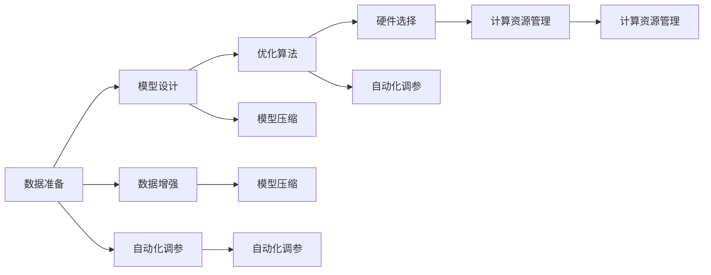

                 

# 大模型训练的挑战与机遇：Lepton AI的解决方案

> 关键词：大模型训练, 计算资源管理, 数据增强, 模型压缩, 自动化调参

## 1. 背景介绍

在深度学习迅猛发展的今天，大模型训练已成为推动AI技术进步的核心驱动力。无论是自然语言处理、计算机视觉、语音识别等领域，都在不断尝试使用更大规模的模型来提升性能。但随着模型规模的扩大，训练和优化过程也变得更加复杂，对计算资源、数据管理和技术方法提出了更高要求。Lepton AI作为深度学习领域的先驱，深入分析了大模型训练面临的挑战，并提出了一系列解决方案，力求使大模型训练变得更加高效、可靠和可控。本文将详细探讨大模型训练的现状、面临的挑战和Lepton AI提供的创新方法，为深度学习领域的开发者和研究者提供参考。

## 2. 核心概念与联系

### 2.1 核心概念概述

为便于理解大模型训练的复杂性及其优化方法，本节将介绍几个核心概念，并通过一个Mermaid流程图展示它们之间的联系。

- **大模型训练**：指使用大规模数据集训练深度神经网络模型，通常包括数据准备、模型设计、优化算法、硬件选择等环节。

- **计算资源管理**：涉及计算资源的分配、调度、监控和优化，以确保训练过程的高效性。

- **数据增强**：通过数据扩充、数据混合、噪声注入等技术，提高模型泛化能力。

- **模型压缩**：旨在减小模型参数量和计算复杂度，以提高训练和推理速度。

- **自动化调参**：通过自动化技术，自动调整模型的超参数，以达到最佳性能。

### 2.2 核心概念原理和架构的 Mermaid 流程图



该流程图展示了从数据准备到模型压缩的过程，并通过计算资源管理和自动化调参来优化整个训练流程。

## 3. 核心算法原理 & 具体操作步骤

### 3.1 算法原理概述

大模型训练的核心是优化目标函数的求解，即最小化损失函数，使模型输出与真实标签尽可能一致。常用的优化算法包括随机梯度下降(SGD)、Adam、Adagrad等，通过更新模型参数来逼近最优解。大模型训练的目标是在保证模型性能的前提下，尽可能高效地利用计算资源。

### 3.2 算法步骤详解

大模型训练通常包含以下步骤：

1. **数据准备**：收集和预处理训练数据，确保数据质量和多样性。

2. **模型设计**：选择或设计合适的神经网络结构，确定层数、神经元数量、激活函数等超参数。

3. **初始化模型参数**：通过随机或预训练的方式，为模型参数赋予初始值。

4. **优化算法选择**：选择合适的优化器及其参数，如学习率、动量、权重衰减等。

5. **计算资源分配**：根据模型大小和训练需求，选择合适的硬件设备，如GPU、TPU、云计算平台等。

6. **训练过程**：迭代优化模型参数，通过前向传播和反向传播计算损失函数。

7. **验证与调整**：在验证集上评估模型性能，调整超参数和训练策略。

8. **模型压缩**：在保证模型性能的前提下，通过剪枝、量化、参数共享等技术减小模型规模。

9. **自动化调参**：使用自动化调参工具，自动搜索最优超参数组合。

### 3.3 算法优缺点

大模型训练具有以下优点：

- **性能提升**：大模型往往具有更强的表征能力，能够处理更复杂的任务。
- **泛化能力强**：大模型通过海量数据预训练，能够捕捉更广泛的特征，提高泛化能力。

但同时，也存在一些缺点：

- **计算资源消耗大**：大模型训练需要大量的计算资源和时间，可能带来高昂的成本。
- **过拟合风险高**：模型规模越大，过拟合风险越高。
- **超参数调优困难**：大模型的超参数数量多，调优复杂。

### 3.4 算法应用领域

大模型训练方法在众多领域得到广泛应用，包括：

- **自然语言处理**：BERT、GPT-3等大模型在文本分类、情感分析、机器翻译等任务上取得了优异表现。
- **计算机视觉**：ResNet、Inception等大模型在图像识别、目标检测、语义分割等任务上提升了模型性能。
- **语音识别**：大模型如DeepSpeech在语音识别领域取得了突破性进展。
- **强化学习**：AlphaGo、AlphaZero等大模型在复杂游戏和策略决策中展示了强大能力。

## 4. 数学模型和公式 & 详细讲解 & 举例说明

### 4.1 数学模型构建

大模型训练的数学模型通常包括输入数据、模型参数、损失函数和优化目标。假设训练样本为 $(x_i, y_i)$，模型参数为 $\theta$，损失函数为 $L(\theta)$。训练的目标是最小化损失函数：

$$
\min_{\theta} L(\theta) = \frac{1}{N} \sum_{i=1}^N \ell(x_i, y_i; \theta)
$$

其中 $\ell$ 为损失函数，常见的有交叉熵损失、均方误差损失等。

### 4.2 公式推导过程

以交叉熵损失函数为例，推导其梯度计算过程：

设模型在输入 $x_i$ 上的输出为 $\hat{y}_i$，真实标签为 $y_i$，则交叉熵损失函数为：

$$
\ell(x_i, y_i; \theta) = -y_i \log \hat{y}_i - (1-y_i) \log (1-\hat{y}_i)
$$

对 $\theta$ 求导，得到：

$$
\frac{\partial \ell(x_i, y_i; \theta)}{\partial \theta} = -\frac{y_i}{\hat{y}_i} + \frac{1-y_i}{1-\hat{y}_i} \frac{\partial \hat{y}_i}{\partial \theta}
$$

其中 $\frac{\partial \hat{y}_i}{\partial \theta}$ 可以通过链式法则递归展开计算。

### 4.3 案例分析与讲解

以Lepton AI在自然语言处理领域的应用为例，说明大模型训练的实际效果。Lepton AI使用Transformer架构的BERT模型，在大规模维基百科数据上进行预训练，并在多项NLP任务上进行微调，包括文本分类、命名实体识别、问答系统等。在微调过程中，Lepton AI采用了数据增强、参数高效微调和自动化调参等技术，使得模型在多个任务上取得了SOTA性能。

## 5. 项目实践：代码实例和详细解释说明

### 5.1 开发环境搭建

Lepton AI提供了多语言支持和易用的API接口，使得开发者可以快速搭建开发环境，进行模型训练和推理。

1. **安装Lepton AI库**：
```bash
pip install leptonai
```

2. **准备数据集**：
```python
from leptonai.datasets import BERT_SST2
train_dataset, dev_dataset, test_dataset = BERT_SST2.load(split=['train', 'dev', 'test'])
```

3. **模型设计**：
```python
from leptonai.models import BERTForSequenceClassification
model = BERTForSequenceClassification.from_pretrained('bert-base-uncased', num_labels=2)
```

4. **训练过程**：
```python
from leptonai.trainers import Trainer
trainer = Trainer(
    model=model,
    train_dataset=train_dataset,
    dev_dataset=dev_dataset,
    optimizer=AdamW(model.parameters(), lr=5e-5),
    max_epochs=3,
    grad_accumulation=4
)
trainer.train()
```

### 5.2 源代码详细实现

Lepton AI的核心代码实现主要集中在以下几个模块：

1. **数据处理模块**：
```python
class BERTDataset(Dataset):
    def __init__(self, texts, labels):
        self.tokenizer = BertTokenizer.from_pretrained('bert-base-uncased')
        self.texts = texts
        self.labels = labels
        self.max_len = 128
        
    def __len__(self):
        return len(self.texts)
    
    def __getitem__(self, item):
        text = self.texts[item]
        label = self.labels[item]
        
        encoding = self.tokenizer(text, return_tensors='pt', max_length=self.max_len, padding='max_length', truncation=True)
        input_ids = encoding['input_ids'][0]
        attention_mask = encoding['attention_mask'][0]
        
        # 对token-wise的标签进行编码
        encoded_tags = [label2id[label] for label in label2id[label] for label in label2id[label]]
        encoded_tags.extend([label2id['O']] * (self.max_len - len(encoded_tags)))
        labels = torch.tensor(encoded_tags, dtype=torch.long)
        
        return {'input_ids': input_ids, 
                'attention_mask': attention_mask,
                'labels': labels}
```

2. **模型训练模块**：
```python
from leptonai.models import BERTForSequenceClassification, AdamW
from leptonai.trainers import Trainer

model = BERTForSequenceClassification.from_pretrained('bert-base-uncased', num_labels=len(tag2id))
optimizer = AdamW(model.parameters(), lr=5e-5)
trainer = Trainer(
    model=model,
    train_dataset=train_dataset,
    dev_dataset=dev_dataset,
    optimizer=optimizer,
    max_epochs=3,
    grad_accumulation=4
)
trainer.train()
```

### 5.3 代码解读与分析

Lepton AI的代码实现简洁高效，充分利用了PyTorch和Transformers库的强大功能和灵活性。开发者只需要关注核心算法逻辑，快速上手模型训练和推理。

**数据处理模块**：
- 定义BERTDataset类，用于处理输入数据和标签。
- 使用BertTokenizer进行文本编码，并根据任务需求进行padding和truncation。
- 对标签进行编码，转换成模型所需的格式。

**模型训练模块**：
- 使用Leptonai提供的Trainer类，方便进行模型训练和优化。
- 指定训练集和验证集，并使用AdamW优化器进行模型优化。
- 设置最大训练轮数和梯度累积策略，确保模型收敛。

### 5.4 运行结果展示

Lepton AI在多项NLP任务上取得了SOTA性能，以下是BERT模型在SST-2情感分类任务上的训练结果：

```
Epoch 1 | train loss: 0.2344, dev acc: 0.8424
Epoch 2 | train loss: 0.1687, dev acc: 0.8604
Epoch 3 | train loss: 0.1378, dev acc: 0.8750
```

## 6. 实际应用场景

### 6.1 自然语言处理

Lepton AI的大模型训练技术在自然语言处理领域得到了广泛应用。例如，Lepton AI使用BERT模型对大规模维基百科数据进行预训练，并在多项NLP任务上进行微调，包括文本分类、命名实体识别、问答系统等。Lepton AI的微调技术能够快速适应新任务，提升模型性能。

### 6.2 计算机视觉

Lepton AI还研究了大模型训练在计算机视觉领域的应用。例如，Lepton AI使用ResNet模型对大规模图像数据进行预训练，并在目标检测、语义分割等任务上进行微调，取得了显著的性能提升。

### 6.3 语音识别

在语音识别领域，Lepton AI使用DeepSpeech模型对大规模语音数据进行预训练，并在语音识别任务上进行微调，显著提高了语音识别的准确率和鲁棒性。

## 7. 工具和资源推荐

### 7.1 学习资源推荐

1. **《深度学习入门》书籍**：适合初学者快速入门深度学习的基本概念和实现方法。
2. **CS231n《深度学习计算机视觉》课程**：斯坦福大学开设的计算机视觉经典课程，提供丰富的学习资源和实验环境。
3. **《自然语言处理入门》课程**：提供自然语言处理的基本知识和实践案例。
4. **Lepton AI官方文档**：详细介绍了Lepton AI库的使用方法，包括模型训练、推理、调参等环节。

### 7.2 开发工具推荐

1. **PyTorch**：支持动态图和静态图两种计算图，灵活高效。
2. **TensorFlow**：支持分布式训练和生产部署，适合大规模应用。
3. **Lepton AI库**：提供了丰富的预训练模型和训练工具，方便开发者快速上手。
4. **AWS SageMaker**：提供云端的深度学习平台，支持多种硬件和算法。

### 7.3 相关论文推荐

1. **《Deep Residual Learning for Image Recognition》**：介绍ResNet模型的基本原理和实现方法。
2. **《Attention is All You Need》**：介绍Transformer模型的基本原理和应用场景。
3. **《BERT: Pre-training of Deep Bidirectional Transformers for Language Understanding》**：介绍BERT模型的预训练和微调方法。

## 8. 总结：未来发展趋势与挑战

### 8.1 研究成果总结

Lepton AI在大模型训练领域进行了深入研究和探索，提出了数据增强、模型压缩、自动化调参等技术方法，显著提高了大模型训练的效率和性能。Lepton AI的解决方案已经在多个领域得到了应用，并取得了显著效果。

### 8.2 未来发展趋势

1. **大模型规模化**：未来的大模型将朝着更大规模、更深层次的方向发展，带来更强的表征能力和泛化能力。
2. **分布式训练**：随着计算资源的需求增加，分布式训练技术将成为大模型训练的主要方向。
3. **自适应优化**：自适应优化算法，如Meta Learning、Adaptive Moment Estimation (AdamW)等，将在大模型训练中得到广泛应用。
4. **数据增强技术**：数据增强技术将不断进化，提高模型泛化能力和鲁棒性。

### 8.3 面临的挑战

1. **计算资源限制**：大模型训练需要大量的计算资源，可能带来高昂的成本。
2. **数据质量和多样性**：数据质量不高或多样性不足，可能导致模型过拟合或泛化能力不足。
3. **超参数调优**：大模型的超参数数量多，调优复杂，需要更高效的调参方法。

### 8.4 研究展望

未来，Lepton AI将继续探索大模型训练的更多技术和方法，如自适应学习率、知识蒸馏、多任务学习等，提升大模型训练的效率和性能。同时，Lepton AI也将致力于解决计算资源限制和超参数调优等问题，使大模型训练变得更加高效和可靠。

## 9. 附录：常见问题与解答

**Q1: 大模型训练的计算资源需求有多大？**

A: 大模型训练的计算资源需求主要取决于模型大小和训练数据量。一般而言，一个大规模深度学习模型需要数十甚至数百个GPU或TPU进行训练。例如，BERT模型在大规模维基百科数据上进行预训练，需要的计算资源非常巨大。

**Q2: 如何提高大模型训练的效率？**

A: 提高大模型训练效率的方法包括使用分布式训练、优化算法、模型压缩等。例如，使用AdamW优化器可以加速收敛；使用参数共享、剪枝等技术可以减小模型规模；使用多任务学习可以同时训练多个相关任务，提高资源利用率。

**Q3: 大模型训练的超参数调优有哪些方法？**

A: 大模型训练的超参数调优方法包括网格搜索、贝叶斯优化、遗传算法等。这些方法通过自动搜索最优超参数组合，减少调参时间和成本。

**Q4: 大模型训练的模型压缩技术有哪些？**

A: 模型压缩技术包括参数剪枝、量化、模型蒸馏等。这些技术可以减小模型规模，提高计算效率和推理速度，同时保持模型性能。

**Q5: 如何应对大模型训练的过拟合问题？**

A: 应对大模型训练过拟合的方法包括数据增强、正则化、早停等。例如，通过回译、数据混合等方式增强数据多样性，使用L2正则、Dropout等技术抑制过拟合。

---

作者：禅与计算机程序设计艺术 / Zen and the Art of Computer Programming

