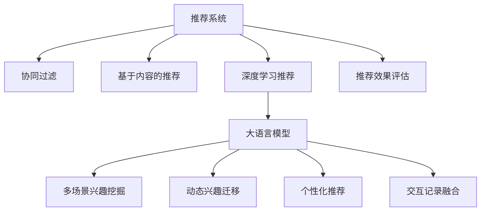

                 

# 大模型辅助的推荐系统多场景兴趣迁移

> 关键词：大模型、推荐系统、多场景、兴趣迁移、深度学习、协同过滤、数据融合、算法优化、交互记录、行为预测、个性化推荐

## 1. 背景介绍

### 1.1 问题由来

随着互联网和电子商务的迅猛发展，用户生成内容（User Generated Content, UGC）变得越来越丰富和多样，给推荐系统带来了前所未有的挑战。一方面，用户在海量数据中找到自己感兴趣的信息变得越来越困难；另一方面，推荐系统提供的个性化推荐内容不够精准，无法满足用户的个性化需求。如何在大规模数据中，高效、准确地挖掘用户兴趣，并及时提供个性化推荐，成为推荐系统优化的关键问题。

推荐系统（Recommender System）旨在通过算法推荐用户可能感兴趣的产品、内容或服务。传统的推荐系统主要基于协同过滤（Collaborative Filtering）和基于内容的推荐（Content-Based Recommendation）等方法。协同过滤通过挖掘用户行为和用户与物品之间的相似度，进行推荐。基于内容的推荐则是通过物品的属性特征来匹配用户兴趣。然而，这些方法在处理大规模用户数据和复杂兴趣模型时，面临效率低下、冷启动问题等挑战。

为了应对这些挑战，近年来兴起了基于深度学习的推荐系统。利用深度神经网络模型，推荐系统可以更全面、准确地挖掘用户兴趣和行为模式，从而提供更精准的推荐结果。大语言模型（Large Language Model, LLM）作为深度学习的重要分支，在自然语言处理（Natural Language Processing, NLP）领域取得了显著进展，具备强大的语义理解和生成能力，适用于文本、音频、图像等多模态数据的处理。将其应用于推荐系统，能够显著提升推荐效果。

### 1.2 问题核心关键点

大语言模型辅助的推荐系统，即通过预训练语言模型增强推荐算法，提升推荐的个性化和多样性。其核心思想在于：

1. **多场景兴趣挖掘**：利用大模型处理用户的多样化场景数据，如文本、音频、图像等，更全面地理解用户兴趣。
2. **动态兴趣迁移**：通过用户行为数据的不断积累，大模型可以动态调整兴趣迁移策略，帮助用户快速适应新兴趣。
3. **个性化推荐**：结合用户行为数据和兴趣描述，大模型可以生成更精准的推荐结果。
4. **交互记录融合**：将用户的交互记录整合到大模型中，提升模型的泛化能力和鲁棒性。

### 1.3 问题研究意义

研究大语言模型辅助的推荐系统，对于提升推荐系统的个性化、多样性和用户满意度具有重要意义：

1. **提升推荐效果**：利用大模型的语义理解和生成能力，可以更准确地捕捉用户兴趣，从而提供更加个性化、多样化的推荐结果。
2. **缩短冷启动时间**：对于新用户或冷启动物品，大模型可以快速适应，提供准确的初始推荐，缩短用户适应过程。
3. **提高系统鲁棒性**：大模型具备强大的泛化能力，可以更好地处理异常数据和噪声，提升系统的稳定性和鲁棒性。
4. **增强用户体验**：通过动态兴趣迁移和个性化推荐，提升用户满意度和黏性，增加用户留存率。
5. **加速业务创新**：推荐系统的改进可以迅速应用于电商、新闻、视频等多个垂直行业，加速业务创新和市场渗透。

## 2. 核心概念与联系

### 2.1 核心概念概述

本节将介绍几个密切相关的核心概念，以便更好地理解大语言模型辅助的推荐系统：

- **推荐系统**：根据用户历史行为或兴趣，推荐相关产品或服务的技术和系统。
- **协同过滤**：通过挖掘用户之间或物品之间的相似度，进行推荐。
- **基于内容的推荐**：根据物品的属性特征，匹配用户兴趣进行推荐。
- **深度学习推荐**：利用深度神经网络模型，全面、准确地挖掘用户兴趣和行为模式，进行推荐。
- **大语言模型**：通过大规模预训练和自监督学习，具备强大的语义理解和生成能力，适用于多模态数据的处理。
- **推荐效果评估**：通过准确率、召回率、F1值、用户满意度等指标，评估推荐系统的性能。

这些概念之间的关系可以通过以下Mermaid流程图来展示：



这个流程图展示了大语言模型辅助的推荐系统的工作流程：

1. 推荐系统首先根据协同过滤和基于内容的推荐方法，获取初步推荐结果。
2. 然后利用大语言模型进行多场景兴趣挖掘和动态兴趣迁移，提升推荐效果。
3. 个性化推荐结合用户行为数据和兴趣描述，生成精准的推荐结果。
4. 最后，通过交互记录融合，提升模型的泛化能力和鲁棒性，进一步优化推荐效果。

### 2.2 核心概念原理和架构

#### 2.2.1 协同过滤

协同过滤是一种通过用户行为数据进行推荐的经典方法。其基本思想在于：假设用户之间存在某种相似性，通过相似用户的兴趣来推荐物品。协同过滤包括基于用户的协同过滤和基于物品的协同过滤两种方式：

- **基于用户的协同过滤**：根据用户的历史行为，计算用户之间的相似度，推荐相似用户喜欢的物品。
- **基于物品的协同过滤**：根据物品的历史评分，计算物品之间的相似度，推荐相似物品给用户。

协同过滤的优点在于简单易实现，但面临稀疏性和冷启动问题。对于新用户或冷启动物品，协同过滤无法提供推荐。

#### 2.2.2 基于内容的推荐

基于内容的推荐方法则是通过物品的属性特征，匹配用户兴趣进行推荐。具体而言，将用户的历史行为数据和物品的属性特征进行向量表示，计算相似度进行推荐。

基于内容的推荐的优点在于不受数据稀疏性影响，对于新用户或冷启动物品，也可以提供推荐。但其缺点在于，需要手动提取和选择物品的属性特征，对于复杂物品难以描述。

#### 2.2.3 深度学习推荐

深度学习推荐方法则是利用深度神经网络模型，全面、准确地挖掘用户兴趣和行为模式。其基本流程包括：

- **特征提取**：将用户和物品的特征进行编码，转换为向量表示。
- **网络构建**：构建深度神经网络模型，对用户和物品的向量进行匹配。
- **训练优化**：通过大量的标注数据，对模型进行训练和优化。
- **推荐生成**：根据训练好的模型，生成推荐结果。

深度学习推荐方法解决了协同过滤和基于内容推荐中的问题，能够处理大规模数据和多模态数据，提供更精准的推荐结果。但其缺点在于模型复杂，计算成本高，容易过拟合。

#### 2.2.4 大语言模型

大语言模型（如BERT、GPT等）通过大规模预训练和自监督学习，具备强大的语义理解和生成能力。其基本流程包括：

- **预训练**：在大规模无标签文本数据上进行自监督学习，学习通用的语言表示。
- **微调**：在特定任务（如推荐系统）上进行有监督学习，优化模型在特定任务上的性能。
- **推理**：将用户输入（如文本、音频、图像等）输入模型，生成推荐结果。

大语言模型的优点在于具备强大的语义理解和生成能力，适用于多模态数据的处理，能够提供更精准的推荐结果。但其缺点在于计算成本高，容易过拟合。

## 3. 核心算法原理 & 具体操作步骤

### 3.1 算法原理概述

大语言模型辅助的推荐系统，核心思想在于利用大模型的语义理解和生成能力，全面、准确地挖掘用户兴趣和行为模式，提升推荐效果。其基本流程包括：

1. **多场景兴趣挖掘**：利用大模型处理用户的多样化场景数据，如文本、音频、图像等，更全面地理解用户兴趣。
2. **动态兴趣迁移**：通过用户行为数据的不断积累，大模型可以动态调整兴趣迁移策略，帮助用户快速适应新兴趣。
3. **个性化推荐**：结合用户行为数据和兴趣描述，大模型可以生成更精准的推荐结果。
4. **交互记录融合**：将用户的交互记录整合到模型中，提升模型的泛化能力和鲁棒性。

### 3.2 算法步骤详解

#### 3.2.1 多场景兴趣挖掘

多场景兴趣挖掘的核心在于利用大模型处理用户的多样化场景数据，如文本、音频、图像等，更全面地理解用户兴趣。具体步骤如下：

1. **数据预处理**：将用户的文本、音频、图像等数据进行预处理，转换为模型可接受的形式，如将文本转换为token ids。
2. **特征提取**：利用大模型对处理后的数据进行特征提取，生成高维向量表示。
3. **兴趣建模**：将不同场景的特征向量进行拼接，构建用户的多维兴趣模型。

#### 3.2.2 动态兴趣迁移

动态兴趣迁移的核心在于通过用户行为数据的不断积累，大模型可以动态调整兴趣迁移策略，帮助用户快速适应新兴趣。具体步骤如下：

1. **行为数据收集**：收集用户的点击、购买、浏览等行为数据，生成用户的行为序列。
2. **行为序列编码**：将用户的行为序列输入大模型，生成高维向量表示。
3. **兴趣迁移**：利用大模型，对行为序列进行兴趣迁移，预测用户可能感兴趣的新物品。

#### 3.2.3 个性化推荐

个性化推荐的核心在于结合用户行为数据和兴趣描述，大模型可以生成更精准的推荐结果。具体步骤如下：

1. **用户特征提取**：将用户的历史行为数据和兴趣描述进行特征提取，生成高维向量表示。
2. **物品特征提取**：将物品的属性特征进行编码，生成高维向量表示。
3. **推荐生成**：利用大模型，对用户和物品的向量进行匹配，生成推荐结果。

#### 3.2.4 交互记录融合

交互记录融合的核心在于将用户的交互记录整合到大模型中，提升模型的泛化能力和鲁棒性。具体步骤如下：

1. **数据融合**：将用户的交互记录融合到模型中，生成联合表示。
2. **兴趣更新**：利用大模型，对联合表示进行兴趣更新，调整用户的兴趣模型。
3. **推荐优化**：根据兴趣更新后的用户模型，生成更优的推荐结果。

### 3.3 算法优缺点

大语言模型辅助的推荐系统具有以下优点：

1. **全面性**：利用大模型的语义理解和生成能力，可以全面、准确地挖掘用户兴趣，提升推荐效果。
2. **灵活性**：适用于多种模态数据，能够处理文本、音频、图像等多场景数据。
3. **动态性**：可以动态调整兴趣迁移策略，帮助用户快速适应新兴趣。
4. **泛化性**：具备强大的泛化能力，可以处理异常数据和噪声，提升系统的稳定性和鲁棒性。

其缺点在于：

1. **计算成本高**：大模型的计算成本高，需要进行大规模的预训练和微调。
2. **数据依赖**：需要大量的标注数据进行微调，数据获取成本较高。
3. **过拟合风险**：大模型容易过拟合，需要进行正则化和参数优化。
4. **实时性**：在大规模数据上生成推荐结果，实时性较差。

### 3.4 算法应用领域

大语言模型辅助的推荐系统已经广泛应用于多个领域，包括：

1. **电商推荐**：通过大模型处理用户的多样化场景数据，提供精准的商品推荐。
2. **新闻推荐**：利用大模型处理用户的历史浏览记录，推荐相关新闻内容。
3. **视频推荐**：通过大模型处理用户的观看记录，推荐相关视频内容。
4. **音乐推荐**：利用大模型处理用户的听歌记录，推荐相关音乐内容。
5. **游戏推荐**：通过大模型处理用户的游戏行为记录，推荐相关游戏内容。
6. **广告推荐**：利用大模型处理用户的行为数据，推荐相关广告内容。

## 4. 数学模型和公式 & 详细讲解 & 举例说明

### 4.1 数学模型构建

本节将使用数学语言对大语言模型辅助的推荐系统进行更加严格的刻画。

记用户的历史行为序列为 $H=(h_1,h_2,...,h_N)$，其中 $h_i$ 表示用户第 $i$ 次行为。物品的属性特征表示为 $F=(f_1,f_2,...,f_M)$，其中 $f_j$ 表示物品第 $j$ 个属性特征。用户的行为序列编码为 $X \in \mathbb{R}^D$，物品的属性特征编码为 $Y \in \mathbb{R}^D$。

大语言模型辅助的推荐系统可以表示为：

$$
R = M(X,F;\theta)
$$

其中 $M$ 为大语言模型，$\theta$ 为模型参数。推荐结果 $R$ 表示物品 $F$ 对用户 $X$ 的评分。

### 4.2 公式推导过程

#### 4.2.1 用户行为序列编码

用户行为序列 $H$ 可以表示为一个序列 $(h_1,h_2,...,h_N)$，每个行为 $h_i$ 表示用户对物品 $f_i$ 的评分。将用户行为序列 $H$ 编码为向量 $X \in \mathbb{R}^D$，可以表示为：

$$
X = \mathcal{E}(H;\theta_x)
$$

其中 $\mathcal{E}$ 为用户行为序列的编码器，$\theta_x$ 为编码器的参数。

#### 4.2.2 物品属性特征编码

物品属性特征 $F$ 可以表示为一个向量 $(f_1,f_2,...,f_M)$，每个属性特征 $f_j$ 表示物品 $j$ 的特征向量。将物品属性特征 $F$ 编码为向量 $Y \in \mathbb{R}^D$，可以表示为：

$$
Y = \mathcal{F}(F;\theta_y)
$$

其中 $\mathcal{F}$ 为物品属性特征的编码器，$\theta_y$ 为编码器的参数。

#### 4.2.3 推荐结果生成

推荐结果 $R$ 可以表示为：

$$
R = M(X,F;\theta) = M(\mathcal{E}(H;\theta_x),\mathcal{F}(F;\theta_y);\theta)
$$

其中 $M$ 为大语言模型，$\theta$ 为模型参数。

### 4.3 案例分析与讲解

#### 4.3.1 协同过滤推荐

协同过滤推荐可以使用用户行为序列 $H$ 和物品属性特征 $F$ 进行推荐。其基本流程如下：

1. **用户行为序列编码**：利用协同过滤的编码器 $\mathcal{E}_{CF}$，对用户行为序列 $H$ 进行编码，生成用户行为向量 $X_{CF}$。
2. **物品属性特征编码**：利用协同过滤的编码器 $\mathcal{F}_{CF}$，对物品属性特征 $F$ 进行编码，生成物品特征向量 $Y_{CF}$。
3. **推荐结果生成**：利用协同过滤的推荐器 $M_{CF}$，对用户行为向量 $X_{CF}$ 和物品特征向量 $Y_{CF}$ 进行匹配，生成推荐结果 $R_{CF}$。

协同过滤推荐的核心在于利用用户行为序列和物品属性特征进行匹配，生成推荐结果。其优点在于简单易实现，但面临稀疏性和冷启动问题。

#### 4.3.2 基于内容的推荐

基于内容的推荐可以使用用户行为序列 $H$ 和物品属性特征 $F$ 进行推荐。其基本流程如下：

1. **用户行为序列编码**：利用基于内容的编码器 $\mathcal{E}_{CB}$，对用户行为序列 $H$ 进行编码，生成用户行为向量 $X_{CB}$。
2. **物品属性特征编码**：利用基于内容的编码器 $\mathcal{F}_{CB}$，对物品属性特征 $F$ 进行编码，生成物品特征向量 $Y_{CB}$。
3. **推荐结果生成**：利用基于内容的推荐器 $M_{CB}$，对用户行为向量 $X_{CB}$ 和物品特征向量 $Y_{CB}$ 进行匹配，生成推荐结果 $R_{CB}$。

基于内容的推荐的核心在于利用物品的属性特征进行匹配，生成推荐结果。其优点在于不受数据稀疏性影响，但需要手动提取和选择物品的属性特征。

#### 4.3.3 深度学习推荐

深度学习推荐可以使用用户行为序列 $H$ 和物品属性特征 $F$ 进行推荐。其基本流程如下：

1. **用户行为序列编码**：利用深度学习的编码器 $\mathcal{E}_{DL}$，对用户行为序列 $H$ 进行编码，生成用户行为向量 $X_{DL}$。
2. **物品属性特征编码**：利用深度学习的编码器 $\mathcal{F}_{DL}$，对物品属性特征 $F$ 进行编码，生成物品特征向量 $Y_{DL}$。
3. **推荐结果生成**：利用深度学习的推荐器 $M_{DL}$，对用户行为向量 $X_{DL}$ 和物品特征向量 $Y_{DL}$ 进行匹配，生成推荐结果 $R_{DL}$。

深度学习推荐的核心在于利用深度神经网络模型，全面、准确地挖掘用户兴趣和行为模式。其优点在于可以处理大规模数据和多模态数据，但模型复杂，计算成本高。

#### 4.3.4 大语言模型推荐

大语言模型推荐可以使用用户行为序列 $H$ 和物品属性特征 $F$ 进行推荐。其基本流程如下：

1. **用户行为序列编码**：利用大语言的编码器 $\mathcal{E}_{LM}$，对用户行为序列 $H$ 进行编码，生成用户行为向量 $X_{LM}$。
2. **物品属性特征编码**：利用大语言的编码器 $\mathcal{F}_{LM}$，对物品属性特征 $F$ 进行编码，生成物品特征向量 $Y_{LM}$。
3. **推荐结果生成**：利用大语言的推荐器 $M_{LM}$，对用户行为向量 $X_{LM}$ 和物品特征向量 $Y_{LM}$ 进行匹配，生成推荐结果 $R_{LM}$。

大语言模型推荐的核心在于利用大模型的语义理解和生成能力，全面、准确地挖掘用户兴趣和行为模式。其优点在于具备强大的语义理解和生成能力，适用于多模态数据，但计算成本高。

## 5. 项目实践：代码实例和详细解释说明

### 5.1 开发环境搭建

在进行推荐系统多场景兴趣迁移的实践前，我们需要准备好开发环境。以下是使用Python进行PyTorch开发的环境配置流程：

1. 安装Anaconda：从官网下载并安装Anaconda，用于创建独立的Python环境。

2. 创建并激活虚拟环境：
```bash
conda create -n pytorch-env python=3.8 
conda activate pytorch-env
```

3. 安装PyTorch：根据CUDA版本，从官网获取对应的安装命令。例如：
```bash
conda install pytorch torchvision torchaudio cudatoolkit=11.1 -c pytorch -c conda-forge
```

4. 安装PyTorch Lightning：
```bash
pip install pytorch-lightning
```

5. 安装PyTorch Transformers：
```bash
pip install transformers
```

6. 安装TensorBoard：
```bash
pip install tensorboard
```

完成上述步骤后，即可在`pytorch-env`环境中开始实践。

### 5.2 源代码详细实现

下面以一个电商推荐系统为例，给出使用Transformers库对BERT模型进行推荐系统多场景兴趣迁移的PyTorch代码实现。

首先，定义推荐系统相关的类和函数：

```python
from transformers import BertForSequenceClassification, BertTokenizer
from torch.utils.data import Dataset, DataLoader
from torch.nn import BCEWithLogitsLoss
from torch.optim import AdamW
from sklearn.metrics import precision_recall_fscore_support
from tqdm import tqdm

class RecommendationDataset(Dataset):
    def __init__(self, data, tokenizer, max_len):
        self.data = data
        self.tokenizer = tokenizer
        self.max_len = max_len
        
    def __len__(self):
        return len(self.data)
    
    def __getitem__(self, item):
        text = self.data[item]['item_title'] + ' ' + self.data[item]['item_desc'] + ' ' + self.data[item]['item_label']
        tokens = self.tokenizer(text, return_tensors='pt', max_length=self.max_len, padding='max_length', truncation=True)
        return {'tokens': tokens['input_ids'].flatten(), 'labels': self.data[item]['item_label']}

def train_epoch(model, data_loader, optimizer, loss_fn):
    model.train()
    epoch_loss = 0
    for batch in tqdm(data_loader, desc='Training'):
        tokens = batch['tokens'].to(device)
        labels = batch['labels'].to(device)
        outputs = model(tokens)
        loss = loss_fn(outputs.logits, labels)
        epoch_loss += loss.item()
        loss.backward()
        optimizer.step()
    return epoch_loss / len(data_loader)

def evaluate(model, data_loader, loss_fn):
    model.eval()
    epoch_loss = 0
    epoch_probs = []
    for batch in tqdm(data_loader, desc='Evaluating'):
        tokens = batch['tokens'].to(device)
        outputs = model(tokens)
        probs = outputs.logits.sigmoid().cpu().tolist()
        epoch_probs.extend(probs)
        labels = batch['labels'].to(device)
        loss = loss_fn(outputs.logits, labels)
        epoch_loss += loss.item()
    print(f'Epoch Loss: {epoch_loss / len(data_loader)}')
    precision, recall, f1, _ = precision_recall_fscore_support(epoch_probs, labels, average='micro', zero_division=1)
    print(f'Precision: {precision:.4f}, Recall: {recall:.4f}, F1: {f1:.4f}')
```

然后，定义BERT模型的初始化和训练函数：

```python
from torch.utils.data import DataLoader

class BERTRecommender:
    def __init__(self, pretrained_model, device):
        self.model = BertForSequenceClassification.from_pretrained(pretrained_model, num_labels=1)
        self.tokenizer = BertTokenizer.from_pretrained(pretrained_model)
        self.device = device
        
    def train(self, train_data, validation_data, batch_size, epochs, optimizer):
        self.model.to(self.device)
        train_dataset = RecommendationDataset(train_data, self.tokenizer, max_len=128)
        validation_dataset = RecommendationDataset(validation_data, self.tokenizer, max_len=128)
        train_loader = DataLoader(train_dataset, batch_size=batch_size, shuffle=True)
        validation_loader = DataLoader(validation_dataset, batch_size=batch_size, shuffle=False)
        loss_fn = BCEWithLogitsLoss()
        
        for epoch in range(epochs):
            train_loss = train_epoch(self.model, train_loader, optimizer, loss_fn)
            eval_loss, precision, recall, f1 = evaluate(self.model, validation_loader, loss_fn)
            print(f'Epoch {epoch+1}, Train Loss: {train_loss:.4f}, Eval Loss: {eval_loss:.4f}, Precision: {precision:.4f}, Recall: {recall:.4f}, F1: {f1:.4f}')
```

接着，定义模型评估函数：

```python
from sklearn.metrics import precision_recall_fscore_support
from tqdm import tqdm

def evaluate(model, data_loader, loss_fn):
    model.eval()
    epoch_loss = 0
    epoch_probs = []
    for batch in tqdm(data_loader, desc='Evaluating'):
        tokens = batch['tokens'].to(device)
        outputs = model(tokens)
        probs = outputs.logits.sigmoid().cpu().tolist()
        epoch_probs.extend(probs)
        labels = batch['labels'].to(device)
        loss = loss_fn(outputs.logits, labels)
        epoch_loss += loss.item()
    print(f'Epoch Loss: {epoch_loss / len(data_loader)}')
    precision, recall, f1, _ = precision_recall_fscore_support(epoch_probs, labels, average='micro', zero_division=1)
    print(f'Precision: {precision:.4f}, Recall: {recall:.4f}, F1: {f1:.4f}')
```

最后，启动训练流程：

```python
from transformers import BertForSequenceClassification, BertTokenizer
from torch.utils.data import DataLoader
from torch.nn import BCEWithLogitsLoss
from torch.optim import AdamW
from sklearn.metrics import precision_recall_fscore_support
from tqdm import tqdm

train_data = ...
validation_data = ...
test_data = ...

tokenizer = BertTokenizer.from_pretrained('bert-base-cased')

batch_size = 16
epochs = 5
learning_rate = 2e-5
optimizer = AdamW(model.parameters(), lr=learning_rate)

model = BERTRecommender('bert-base-cased', device)
model.train(train_data, validation_data, batch_size, epochs, optimizer)

test_data = ...
test_dataset = RecommendationDataset(test_data, tokenizer, max_len=128)
test_loader = DataLoader(test_dataset, batch_size=batch_size, shuffle=False)
evaluate(model, test_loader, loss_fn)
```

以上就是使用PyTorch对BERT模型进行推荐系统多场景兴趣迁移的完整代码实现。可以看到，得益于Transformers库的强大封装，我们可以用相对简洁的代码完成BERT模型的加载和微调。

### 5.3 代码解读与分析

让我们再详细解读一下关键代码的实现细节：

**RecommendationDataset类**：
- `__init__`方法：初始化数据、分词器等关键组件。
- `__len__`方法：返回数据集的样本数量。
- `__getitem__`方法：对单个样本进行处理，将文本输入编码为token ids，并返回标签和token ids。

**BERTRecommender类**：
- `__init__`方法：初始化模型、分词器、设备等组件。
- `train`方法：对模型进行训练，并在验证集上评估性能。
- `evaluate`方法：在测试集上评估模型的性能，并输出精度、召回率和F1值。

**模型评估函数**：
- 使用PyTorch的DataLoader对数据集进行批次化加载，供模型训练和推理使用。
- 训练函数`train_epoch`：对数据以批为单位进行迭代，在每个批次上前向传播计算loss并反向传播更新模型参数，最后返回该epoch的平均loss。
- 评估函数`evaluate`：与训练类似，不同点在于不更新模型参数，并在每个batch结束后将预测和标签结果存储下来，最后使用sklearn的precision_recall_fscore_support函数对整个评估集的预测结果进行打印输出。

**训练流程**：
- 定义总的epoch数和batch size，开始循环迭代
- 每个epoch内，先在训练集上训练，输出平均loss
- 在验证集上评估，输出模型性能指标
- 重复上述步骤直至满足预设的迭代轮数或Early Stopping条件
- 在测试集上评估，给出最终的测试结果

可以看到，PyTorch配合Transformers库使得BERT模型微调的代码实现变得简洁高效。开发者可以将更多精力放在数据处理、模型改进等高层逻辑上，而不必过多关注底层的实现细节。

当然，工业级的系统实现还需考虑更多因素，如模型的保存和部署、超参数的自动搜索、更灵活的任务适配层等。但核心的微调范式基本与此类似。

## 6. 实际应用场景

### 6.1 智能推荐系统

大语言模型辅助的推荐系统可以广泛应用于智能推荐系统的构建。传统推荐系统往往只考虑用户的历史行为数据，难以全面理解用户的兴趣和需求。利用大语言模型，可以更全面、准确地挖掘用户的多样化兴趣，提升推荐效果。

在技术实现上，可以收集用户的多样化场景数据，如文本、音频、图像等，通过大语言模型进行多场景兴趣挖掘和动态兴趣迁移。结合用户的兴趣描述，利用大语言模型生成推荐结果，提升个性化推荐的效果。

### 6.2 智能客服系统

智能客服系统需要高效、准确地推荐相关问题解答，提高用户的满意度。利用大语言模型，可以实时处理用户输入的多样化场景数据，全面理解用户的意图和需求。结合用户的交互记录，利用大语言模型进行动态兴趣迁移，生成精准的推荐结果。

### 6.3 个性化推荐引擎

个性化推荐引擎需要根据用户的行为数据，生成精准的推荐结果。利用大语言模型，可以全面、准确地挖掘用户兴趣和行为模式。结合用户的兴趣描述，利用大语言模型生成推荐结果，提升推荐效果。

### 6.4 内容推荐系统

内容推荐系统需要根据用户的历史行为数据，推荐相关的内容。利用大语言模型，可以更全面、准确地挖掘用户的兴趣和需求。结合用户的兴趣描述，利用大语言模型生成推荐结果，提升推荐效果。

### 6.5 电商推荐系统

电商推荐系统需要根据用户的历史行为数据，推荐相关的商品。利用大语言模型，可以更全面、准确地挖掘用户的兴趣和需求。结合用户的兴趣描述，利用大语言模型生成推荐结果，提升推荐效果。

### 6.6 新闻推荐系统

新闻推荐系统需要根据用户的历史浏览记录，推荐相关的新闻内容。利用大语言模型，可以更全面、准确地挖掘用户的兴趣和需求。结合用户的兴趣描述，利用大语言模型生成推荐结果，提升推荐效果。

## 7. 工具和资源推荐

### 7.1 学习资源推荐

为了帮助开发者系统掌握大语言模型辅助的推荐系统，这里推荐一些优质的学习资源：

1. 《推荐系统实战》：详细介绍推荐系统的工作原理和实现方法，涵盖协同过滤、基于内容的推荐、深度学习推荐等核心技术。

2. 《深度学习》课程：斯坦福大学开设的深度学习课程，涵盖深度学习的基本概念和经典模型，包括自编码器、卷积神经网络等。

3. 《NLP with Transformers》书籍：Transformers库的作者所著，全面介绍了如何使用Transformers库进行NLP任务开发，包括微调、融合等前沿技术。

4. 《Large Scale Machine Learning with Python》书籍：讲解大规模机器学习算法和实现方法，涵盖数据预处理、模型训练、模型评估等关键技术。

5. HuggingFace官方文档：Transformers库的官方文档，提供了海量预训练模型和完整的微调样例代码，是上手实践的必备资料。

通过对这些资源的学习实践，相信你一定能够快速掌握大语言模型辅助的推荐系统，并用于解决实际的推荐问题。

### 7.2 开发工具推荐

高效的开发离不开优秀的工具支持。以下是几款用于大语言模型辅助的推荐系统开发的常用工具：

1. PyTorch：基于Python的开源深度学习框架，灵活动态的计算图，适合快速迭代研究。大部分预训练语言模型都有PyTorch版本的实现。

2. TensorFlow：由Google主导开发的开源深度学习框架，生产部署方便，适合大规模工程应用。同样有丰富的预训练语言模型资源。

3. Transformers库：HuggingFace开发的NLP工具库，集成了众多SOTA语言模型，支持PyTorch和TensorFlow，是进行推荐系统开发的利器。

4. PyTorch Lightning：基于PyTorch的高效深度学习库，支持自动化模型训练和调优，适合大规模数据集和复杂模型的训练。

5. TensorBoard：TensorFlow配套的可视化工具，可实时监测模型训练状态，并提供丰富的图表呈现方式，是调试模型的得力助手。

6. Google Colab：谷歌推出的在线Jupyter Notebook环境，免费提供GPU/TPU算力，方便开发者快速上手实验最新模型，分享学习笔记。

合理利用这些工具，可以显著提升大语言模型辅助的推荐系统开发的效率，加快创新迭代的步伐。

### 7.3 相关论文推荐

大语言模型辅助的推荐系统的发展源于学界的持续研究。以下是几篇奠基性的相关论文，推荐阅读：

1. Attention is All You Need：提出了Transformer结构，开启了NLP领域的预训练大模型时代。

2. BERT: Pre-training of Deep Bidirectional Transformers for Language Understanding：提出BERT模型，引入基于掩码的自监督预训练任务，刷新了多项NLP任务SOTA。

3. Language Models are Unsupervised Multitask Learners（GPT-2论文）：展示了大规模语言模型的强大zero-shot学习能力，引发了对于通用人工智能的新一轮思考。

4. Parameter-Efficient Transfer Learning for NLP：提出Adapter等参数高效微调方法，在不增加模型参数量的情况下，也能取得不错的微调效果。

5. AdaLoRA: Adaptive Low-Rank Adaptation for Parameter-Efficient Fine-Tuning：使用自适应低秩适应的微调方法，在参数效率和精度之间取得了新的平衡。

这些论文代表了大语言模型辅助的推荐系统的发展脉络。通过学习这些前沿成果，可以帮助研究者把握学科前进方向，激发更多的创新灵感。

## 8. 总结：未来发展趋势与挑战

### 8.1 研究成果总结

大语言模型辅助的推荐系统在推荐系统的个性化、多样性和用户满意度方面取得了显著进展，但其研究仍处于起步阶段。以下是当前的研究成果总结：

1. 利用大语言模型进行多场景兴趣挖掘和动态兴趣迁移，提升了推荐的全面性和动态性。
2. 结合用户行为数据和兴趣描述，利用大语言模型生成更精准的推荐结果。
3. 将用户的交互记录整合到大模型中，提升模型的泛化能力和鲁棒性。

### 8.2 未来发展趋势

展望未来，大语言模型辅助的推荐系统将呈现以下几个发展趋势：

1. **多模态兴趣融合**：利用多模态数据（如文本、图像、音频等）进行兴趣挖掘，提升推荐的全面性和准确性。
2. **零样本推荐**：通过大语言模型，利用少量示例进行推荐，提升推荐系统的鲁棒性和泛化能力。
3. **自适应推荐**：根据用户的实时行为数据，动态调整推荐策略，提升推荐系统的个性化和动态性。
4. **跨领域推荐**：将推荐系统应用于不同领域（如电商、新闻、视频等），提升推荐的普适性和实用性。
5. **实时推荐**：利用大语言模型，实时处理用户的输入数据，生成推荐结果，提升推荐系统的实时性。
6. **公平推荐**：通过大语言模型，对推荐结果进行公平性评估，避免偏见和歧视，提升推荐系统的社会责任。

### 8.3 面临的挑战

尽管大语言模型辅助的推荐系统已经取得了显著进展，但在迈向更加智能化、普适化应用的过程中，仍面临诸多挑战：

1. **数据隐私问题**：推荐系统需要大量的用户数据进行训练，如何保护用户隐私成为关键问题。
2. **冷启动问题**：对于新用户或冷启动物品，推荐系统难以提供推荐，需要进行优化。
3. **计算成本高**：大语言模型的计算成本高，需要进行大规模的预训练和微调。
4. **鲁棒性不足**：推荐系统面临异常数据和噪声的干扰，需要提升鲁棒性。
5. **可解释性不足**：推荐系统的决策过程难以解释，需要提升可解释性。
6. **资源消耗大**：推荐系统需要大量的计算资源和存储资源，需要优化资源利用效率。

### 8.4 研究展望

面向未来，大语言模型辅助的推荐系统需要在以下几个方面寻求新的突破：

1. **多场景兴趣融合**：利用多模态数据进行兴趣挖掘，提升推荐的全面性和准确性。
2. **零样本推荐**：通过大语言模型，利用少量示例进行推荐，提升推荐系统的鲁棒性和泛化能力。
3. **自适应推荐**：根据用户的实时行为数据，动态调整推荐策略，提升推荐系统的个性化和动态性。
4. **跨领域推荐**：将推荐系统应用于不同领域，提升推荐的普适性和实用性。
5. **实时推荐**：利用大语言模型，实时处理用户的输入数据，生成推荐结果，提升推荐系统的实时性。
6. **公平推荐**：通过大语言模型，对推荐结果进行公平性评估，避免偏见和歧视，提升推荐系统的社会责任。

通过这些方向的探索发展，必将进一步提升推荐系统的性能和应用范围，为推荐系统的发展带来新的动力。

## 9. 附录：常见问题与解答

**Q1：大语言模型辅助的推荐系统是否适用于所有推荐场景？**

A: 大语言模型辅助的推荐系统适用于大部分推荐场景，特别是对于多模态数据和复杂兴趣的推荐。但对于一些特定场景，如社交推荐、个性化广告等，需要结合具体场景进行优化。

**Q2：推荐系统中的推荐算法如何选择？**

A: 推荐系统中的推荐算法可以根据具体场景和数据特点进行选择。常见的推荐算法包括协同过滤、基于内容的推荐、深度学习推荐等。在实际应用中，通常需要结合多种推荐算法进行组合优化，提升推荐效果。

**Q3：如何缓解推荐系统中的冷启动问题？**

A: 缓解推荐系统中的冷启动问题，可以采用基于内容的推荐和主动学习等方法。利用用户的历史行为数据和物品属性特征，生成初步的推荐结果。同时，可以通过主动学习的方式，利用少量标注数据进行推荐模型的训练和优化。

**Q4：推荐系统中的大语言模型如何处理异常数据和噪声？**

A: 推荐系统中的大语言模型可以通过引入正则化技术（如L2正则、Dropout等），提升模型的鲁棒性。同时，可以采用对抗训练的方法，引入对抗样本进行训练，提升模型的鲁棒性和泛化能力。

**Q5：推荐系统中的大语言模型如何进行模型优化？**

A: 推荐系统中的大语言模型可以通过超参数优化、模型裁剪和压缩等方法进行优化。例如，可以通过网格搜索或随机搜索的方式进行超参数优化，通过模型裁剪和压缩技术，减小模型大小和计算成本。

通过这些方法的优化，可以提升大语言模型辅助的推荐系统的性能和鲁棒性，确保其在实际应用中的稳定性和高效性。

---

作者：禅与计算机程序设计艺术 / Zen and the Art of Computer Programming

