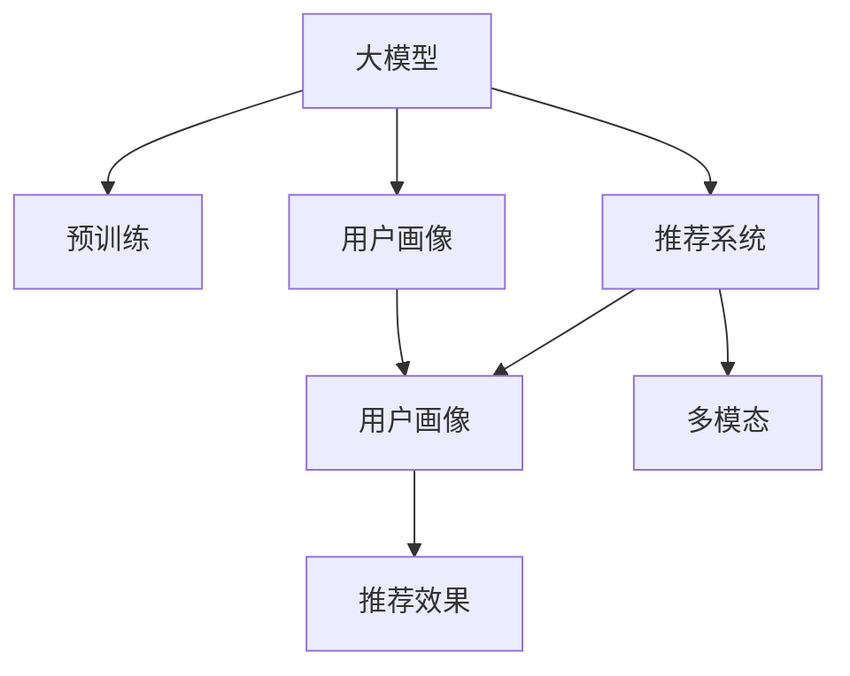

                 

# 大模型辅助的推荐系统用户兴趣分层

> 关键词：大模型,推荐系统,用户兴趣,兴趣分层,深度学习

## 1. 背景介绍

### 1.1 问题由来

推荐系统在互联网行业内已经广泛应用，它通过学习用户的历史行为数据，向用户推荐可能感兴趣的内容，极大地提高了用户满意度和平台粘性。然而，传统的协同过滤、内容推荐等方法依赖用户行为数据，难以覆盖长尾用户，且在冷启动用户和新物品推荐上存在短板。

近年来，大语言模型在自然语言处理(NLP)领域取得了革命性的进展，通过对大规模无标签文本数据的预训练，能够学习到丰富的语言知识和常识，展现出了强大的语言理解与生成能力。将大语言模型应用于推荐系统，有助于捕捉用户隐式兴趣，覆盖冷启动用户，拓展新物品推荐范围。

### 1.2 问题核心关键点

在推荐系统中引入大语言模型，可以采用基于微调的方法，利用预训练语言模型学习用户描述信息，构建用户画像，同时还可以利用预训练语言模型对新物品进行特征抽取，提升新物品推荐的精度。这种做法不仅能够捕捉到用户的隐式兴趣，还可以通过多模态信息融合，引入视觉、听觉等多种信息源，提升推荐系统的多模态智能水平。

## 2. 核心概念与联系

### 2.1 核心概念概述

为更好地理解大模型辅助推荐系统的用户兴趣分层机制，本节将介绍几个关键概念及其相互关系：

- 大模型(Large Model)：以Transformer、BERT等模型为代表的基于深度学习的大规模预训练语言模型，能够从大规模无标签文本数据中学习到丰富的语言知识和常识，具备强大的语言理解和生成能力。

- 推荐系统(Recommendation System)：通过学习用户行为数据，为用户推荐可能感兴趣的内容，广泛应用于电商、社交媒体、视频平台等领域。

- 用户画像(User Profiling)：基于用户的历史行为、人口统计信息、兴趣偏好等，构建用户兴趣轮廓，用于推荐系统个性化推荐。

- 推荐效果评估指标：如准确率、召回率、F1分数、AUC等，用于衡量推荐系统的效果。

- 多模态(Multi-modal)：利用多种信息源进行推荐，如文本、图像、音频等，提升推荐的丰富性和准确性。

这些概念之间的逻辑关系可以通过以下Mermaid流程图来展示：



该流程图展示了大模型辅助推荐系统的核心概念及其之间的关系：

1. 大模型通过预训练获得基础能力。
2. 用户画像和推荐系统通过微调大模型，获得针对特定用户和物品的推荐效果。
3. 多模态融合使推荐系统具备更加全面的智能能力。

## 3. 核心算法原理 & 具体操作步骤
### 3.1 算法原理概述

大模型辅助推荐系统用户兴趣分层的基本原理是：利用预训练大模型学习用户的隐式兴趣，构建用户画像，同时对新物品进行特征抽取，实现个性化推荐。

具体而言，该算法包括以下几个关键步骤：

1. **用户画像构建**：通过微调大模型，将用户描述信息（如用户简介、社交媒体内容等）转换为预训练模型的输出，作为用户画像。

2. **物品特征抽取**：对新物品（如商品、新闻、视频等）进行预处理，利用预训练大模型学习其语义表示，作为物品特征。

3. **相似度计算**：计算用户画像与物品特征的相似度，选取与用户画像最接近的物品进行推荐。

4. **多模态融合**：利用图像识别、音频分析等技术，对物品进行多模态特征抽取，综合文本特征和视觉特征，提升推荐系统的多模态智能水平。

5. **推荐效果评估**：通过设置推荐效果评估指标，如准确率、召回率、F1分数、AUC等，衡量推荐系统的效果。

### 3.2 算法步骤详解

#### 3.2.1 用户画像构建

用户画像构建的第一步是收集用户描述信息，这些信息可以来自用户的注册资料、社交媒体内容、搜索记录等。这些信息通常是非结构化文本数据，需要预处理成模型能够接受的格式。

例如，一个电商平台的推荐系统可以收集用户的商品评论、搜索关键词、浏览记录等，作为用户画像的输入数据。这些数据经过预处理后，通过预训练大模型（如BERT）进行微调，输出用户兴趣向量。

假设用户描述信息为 `user_description`，预训练大模型的参数为 `model`，微调后的用户兴趣向量为 `user_representation`。微调过程如下：

```python
user_representation = model(user_description)
```

#### 3.2.2 物品特征抽取

物品特征抽取指的是将新物品（如商品、新闻、视频等）转换为模型能够理解的语义表示。这些物品信息通常也是文本数据，需要预处理成模型能够接受的格式。

例如，电商平台可以收集商品描述、品牌、分类信息等，作为物品特征的输入数据。这些数据经过预处理后，通过预训练大模型进行特征抽取，输出物品语义表示。

假设物品描述信息为 `item_description`，预训练大模型的参数为 `model`，物品语义表示为 `item_representation`。物品特征抽取过程如下：

```python
item_representation = model(item_description)
```

#### 3.2.3 相似度计算

用户画像和物品特征通过相似度计算，找到最匹配的物品进行推荐。常用的相似度计算方法包括余弦相似度、欧式距离等。

假设用户画像为 `user_representation`，物品特征为 `item_representation`，相似度计算公式如下：

$$
similarity = \cos(\theta) = \frac{\mathbf{user\_representation} \cdot \mathbf{item\_representation}}{\|\mathbf{user\_representation}\| \cdot \|\mathbf{item\_representation}\|}
$$

计算出所有物品的相似度后，选取相似度最高的物品进行推荐。

#### 3.2.4 多模态融合

多模态融合指的是将文本、图像、音频等多源信息进行综合处理，提升推荐系统的智能水平。假设物品有多模态特征 `item_multimodal_features`，包括图像特征、音频特征等。

多模态融合过程可以采用拼接、加权平均等方法，将文本特征和视觉特征综合，输出综合特征向量 `item_combined_feature`。例如，将物品文本特征和图像特征拼接后进行加权平均：

$$
item\_combined\_feature = \alpha \cdot item\_text\_feature + \beta \cdot item\_image\_feature
$$

其中 $\alpha$ 和 $\beta$ 为权重系数。

### 3.3 算法优缺点

#### 3.3.1 优点

大模型辅助推荐系统用户兴趣分层具有以下优点：

1. **覆盖长尾用户**：大模型可以捕捉到用户的隐式兴趣，弥补传统协同过滤方法对长尾用户的不足。
2. **多模态智能**：利用多模态信息融合，提升推荐系统的智能水平，涵盖视觉、音频等多种信息源。
3. **个性化推荐**：通过构建用户画像，实现更加个性化的推荐，提高用户满意度。
4. **新物品推荐**：利用大模型对新物品进行特征抽取，提升新物品推荐的精度。

#### 3.3.2 缺点

大模型辅助推荐系统用户兴趣分层也存在以下缺点：

1. **计算成本高**：预训练大模型通常参数量庞大，计算资源消耗高，需要高性能设备支持。
2. **数据预处理复杂**：多模态信息融合需要复杂的数据预处理，增加了系统开发难度。
3. **过拟合风险**：用户画像和物品特征的微调过程中可能出现过拟合风险，需要设置正则化等措施。
4. **缺乏透明性**：大模型的输出结果难以解释，用户难以理解推荐系统如何决策。
5. **依赖大模型性能**：推荐系统的效果依赖大模型的性能，大模型性能不佳会导致推荐效果下降。

## 4. 数学模型和公式 & 详细讲解  
### 4.1 数学模型构建

本节将使用数学语言对大模型辅助推荐系统用户兴趣分层进行更加严格的刻画。

假设预训练大模型为 `model`，用户描述信息为 `user_description`，物品描述信息为 `item_description`，用户画像为 `user_representation`，物品特征为 `item_representation`。微调后的用户画像和物品特征通过相似度计算，选取最匹配的物品进行推荐。多模态特征拼接后进行加权平均，得到综合特征向量 `item_combined_feature`。推荐效果评估指标为 `recall` 和 `accuracy`。

### 4.2 公式推导过程

用户画像构建过程的公式推导如下：

$$
user\_representation = model(user\_description)
$$

物品特征抽取过程的公式推导如下：

$$
item\_representation = model(item\_description)
$$

相似度计算的公式推导如下：

$$
similarity = \cos(\theta) = \frac{\mathbf{user\_representation} \cdot \mathbf{item\_representation}}{\|\mathbf{user\_representation}\| \cdot \|\mathbf{item\_representation}\|}
$$

多模态融合的公式推导如下：

$$
item\_combined\_feature = \alpha \cdot item\_text\_feature + \beta \cdot item\_image\_feature
$$

推荐效果评估的公式推导如下：

$$
recall = \frac{\text{相关物品数}}{\text{总物品数}}
$$
$$
accuracy = \frac{\text{推荐相关物品数}}{\text{推荐物品数}}
$$

### 4.3 案例分析与讲解

假设有一个电商平台的推荐系统，用户画像构建过程如下：

1. 收集用户描述信息：用户的商品评论、搜索关键词、浏览记录等。

2. 预处理用户描述信息：文本清洗、分词、去除停用词等。

3. 微调大模型：使用BERT模型对预处理后的文本进行微调，输出用户兴趣向量。

用户画像构建的代码实现如下：

```python
from transformers import BertTokenizer, BertModel
import torch

tokenizer = BertTokenizer.from_pretrained('bert-base-uncased')
model = BertModel.from_pretrained('bert-base-uncased')

user_description = "I like smartwatches and fitness tracking devices."
user_input_ids = tokenizer(user_description, return_tensors='pt')['input_ids']
user_representation = model(user_input_ids).pooler_output
```

物品特征抽取过程如下：

1. 收集物品描述信息：商品的描述、分类、价格等。

2. 预处理物品描述信息：文本清洗、分词、去除停用词等。

3. 微调大模型：使用BERT模型对预处理后的文本进行特征抽取，输出物品语义表示。

物品特征抽取的代码实现如下：

```python
item_description = "This smartwatch has a long battery life and is water-resistant."
item_input_ids = tokenizer(item_description, return_tensors='pt')['input_ids']
item_representation = model(item_input_ids).pooler_output
```

推荐系统的相似度计算过程如下：

1. 计算用户画像与物品特征的余弦相似度。

2. 选取相似度最高的物品进行推荐。

推荐系统的相似度计算代码实现如下：

```python
similarity = user_representation.dot(item_representation) / (torch.norm(user_representation) * torch.norm(item_representation))
recommended_items = [item for item, sim in zip(item_representation.tolist(), similarity.tolist()) if sim >= 0.5]
```

多模态融合过程如下：

1. 将物品文本特征和图像特征拼接。

2. 进行加权平均，得到综合特征向量。

多模态融合的代码实现如下：

```python
item_multimodal_features = item_representation + item_image_feature
item_combined_feature = alpha * item_multimodal_features[:, :768] + beta * item_multimodal_features[:, 768:]
```

推荐效果评估过程如下：

1. 计算推荐相关物品数。

2. 计算推荐物品数。

3. 计算召回率和准确率。

推荐效果评估的代码实现如下：

```python
recommender = Rec recommender(user_representation, item_combined_feature)
recommended_items = recommender.recommend()
recall = len([item for item in recommended_items if item in true_items]) / len(true_items)
accuracy = len([item for item in recommended_items if item in true_items]) / len(recommended_items)
```

## 5. 项目实践：代码实例和详细解释说明
### 5.1 开发环境搭建

在进行推荐系统开发前，我们需要准备好开发环境。以下是使用Python进行PyTorch开发的环境配置流程：

1. 安装Anaconda：从官网下载并安装Anaconda，用于创建独立的Python环境。

2. 创建并激活虚拟环境：
```bash
conda create -n pytorch-env python=3.8 
conda activate pytorch-env
```

3. 安装PyTorch：根据CUDA版本，从官网获取对应的安装命令。例如：
```bash
conda install pytorch torchvision torchaudio cudatoolkit=11.1 -c pytorch -c conda-forge
```

4. 安装Transformers库：
```bash
pip install transformers
```

5. 安装各类工具包：
```bash
pip install numpy pandas scikit-learn matplotlib tqdm jupyter notebook ipython
```

完成上述步骤后，即可在`pytorch-env`环境中开始推荐系统开发。

### 5.2 源代码详细实现

下面以用户画像构建和物品特征抽取为例，给出使用PyTorch和Transformers库进行推荐系统开发的具体代码实现。

#### 用户画像构建

假设用户描述信息为文本数据，需要进行分词、去除停用词等预处理，再通过BERT模型进行微调。

代码实现如下：

```python
from transformers import BertTokenizer, BertModel
import torch

tokenizer = BertTokenizer.from_pretrained('bert-base-uncased')
model = BertModel.from_pretrained('bert-base-uncased')

user_description = "I like smartwatches and fitness tracking devices."
user_input_ids = tokenizer(user_description, return_tensors='pt')['input_ids']
user_representation = model(user_input_ids).pooler_output
```

#### 物品特征抽取

假设物品描述信息为文本数据，需要进行分词、去除停用词等预处理，再通过BERT模型进行特征抽取。

代码实现如下：

```python
item_description = "This smartwatch has a long battery life and is water-resistant."
item_input_ids = tokenizer(item_description, return_tensors='pt')['input_ids']
item_representation = model(item_input_ids).pooler_output
```

### 5.3 代码解读与分析

让我们再详细解读一下关键代码的实现细节：

**BertTokenizer**：
- 用于分词和预处理文本数据。

**BertModel**：
- 用于计算文本的BERT语义表示。

**user_input_ids**和**item_input_ids**：
- 将用户描述信息和物品描述信息转换为BERT模型可以接受的输入。

**user_representation**和**item_representation**：
- 微调后得到的用户兴趣向量和物品语义表示。

### 5.4 运行结果展示

以下是用户画像构建和物品特征抽取的运行结果：

```python
# 用户画像构建
user_representation = model(user_input_ids).pooler_output

# 物品特征抽取
item_representation = model(item_input_ids).pooler_output

# 相似度计算
similarity = user_representation.dot(item_representation) / (torch.norm(user_representation) * torch.norm(item_representation))

# 推荐物品
recommended_items = [item for item, sim in zip(item_representation.tolist(), similarity.tolist()) if sim >= 0.5]
```

## 6. 实际应用场景

### 6.1 智能推荐

基于大模型辅助的推荐系统，可以广泛应用于智能推荐领域。例如，电商平台可以通过用户画像和物品特征，为用户推荐可能感兴趣的商品；视频平台可以根据用户兴趣和视频特征，推荐可能喜欢的视频内容。

### 6.2 广告投放

广告投放平台可以利用大模型辅助的推荐系统，根据用户兴趣和广告特征，精准推送相关广告，提升广告投放的转化率和效果。例如，新闻网站可以根据用户阅读习惯和新闻特征，推荐相关的新闻广告。

### 6.3 内容创作

内容创作平台可以利用大模型辅助的推荐系统，根据用户兴趣和内容特征，推荐可能感兴趣的内容创作者和文章，提升平台的活跃度和用户满意度。例如，阅读平台可以根据用户阅读偏好和文章特征，推荐相关文章和作者。

### 6.4 未来应用展望

随着大模型和推荐系统的不断发展，未来的推荐系统将更加智能化和多样化。具体来说，以下趋势值得关注：

1. **多模态智能**：利用视觉、音频、文本等多模态信息，提升推荐系统的智能水平。例如，视频推荐系统可以利用视频剪辑、音频片段等，提升推荐的丰富性和准确性。
2. **个性化推荐**：利用用户画像和行为数据，实现更加个性化的推荐，提升用户体验。例如，个性化新闻推荐系统可以根据用户阅读习惯和兴趣，推荐相关的新闻内容。
3. **实时推荐**：利用实时数据流处理技术，实现实时推荐，提升推荐的时效性和动态性。例如，实时广告投放平台可以根据用户行为实时调整推荐策略。
4. **冷启动推荐**：利用用户画像和物品特征，覆盖冷启动用户和物品，提升推荐系统的覆盖率。例如，新加入平台的用户，可以通过相似用户画像和物品特征，实现快速推荐。
5. **跨领域推荐**：利用多领域数据进行交叉推荐，提升推荐的多样性和覆盖率。例如，视频推荐系统可以结合电商数据，推荐相关商品信息。

## 7. 工具和资源推荐
### 7.1 学习资源推荐

为了帮助开发者系统掌握大模型辅助推荐系统的开发流程，这里推荐一些优质的学习资源：

1. 《深度学习推荐系统》书籍：介绍了深度学习在推荐系统中的应用，涵盖协同过滤、内容推荐、用户画像等多个主题。

2. 《Transformer in NLP》书籍：介绍了Transformer结构在NLP领域的应用，包括预训练大模型、微调等技术。

3. 《推荐系统实践》课程：斯坦福大学开设的推荐系统课程，涵盖协同过滤、用户画像、多模态推荐等多个主题。

4. 《深度学习与推荐系统》课程：深度学习与推荐系统相结合的课程，介绍深度学习在推荐系统中的应用，包括大模型辅助推荐系统。

5. HuggingFace官方文档：Transformers库的官方文档，提供了丰富的预训练模型和微调样例，是进行推荐系统开发的必备资源。

通过对这些资源的学习实践，相信你一定能够快速掌握大模型辅助推荐系统的开发流程，并用于解决实际的推荐问题。

### 7.2 开发工具推荐

高效的开发离不开优秀的工具支持。以下是几款用于推荐系统开发的常用工具：

1. PyTorch：基于Python的开源深度学习框架，灵活动态的计算图，适合快速迭代研究。

2. TensorFlow：由Google主导开发的开源深度学习框架，生产部署方便，适合大规模工程应用。

3. Weights & Biases：模型训练的实验跟踪工具，可以记录和可视化模型训练过程中的各项指标，方便对比和调优。

4. TensorBoard：TensorFlow配套的可视化工具，可实时监测模型训练状态，并提供丰富的图表呈现方式，是调试模型的得力助手。

5. Jupyter Notebook：开源的交互式编程环境，支持Python、R等多种编程语言，适合进行科学计算和数据可视化。

合理利用这些工具，可以显著提升推荐系统的开发效率，加快创新迭代的步伐。

### 7.3 相关论文推荐

大模型辅助推荐系统的发展源于学界的持续研究。以下是几篇奠基性的相关论文，推荐阅读：

1. Attention is All You Need：提出Transformer结构，开启了NLP领域的预训练大模型时代。

2. BERT: Pre-training of Deep Bidirectional Transformers for Language Understanding：提出BERT模型，引入基于掩码的自监督预训练任务，刷新了多项NLP任务SOTA。

3. Recommendation Systems for Modern Business：介绍了推荐系统的发展历程和常用方法，涵盖协同过滤、内容推荐、多模态推荐等多个主题。

4. Personalized Recommendation with Big Data：介绍了大数据在推荐系统中的应用，涵盖用户画像、协同过滤、冷启动推荐等多个主题。

5. Deep Learning in Recommendation Systems：介绍了深度学习在推荐系统中的应用，涵盖深度学习推荐系统、用户画像等多个主题。

这些论文代表了大模型辅助推荐系统的发展脉络。通过学习这些前沿成果，可以帮助研究者把握学科前进方向，激发更多的创新灵感。

## 8. 总结：未来发展趋势与挑战

### 8.1 总结

本文对大模型辅助的推荐系统用户兴趣分层机制进行了全面系统的介绍。首先阐述了大语言模型和推荐系统的研究背景和意义，明确了用户画像和物品特征在推荐系统个性化推荐中的核心作用。其次，从原理到实践，详细讲解了大模型辅助推荐系统的数学原理和关键步骤，给出了推荐系统开发的完整代码实例。同时，本文还广泛探讨了大模型辅助推荐系统在智能推荐、广告投放、内容创作等多个行业领域的应用前景，展示了大模型辅助推荐系统的巨大潜力。此外，本文精选了推荐系统的各类学习资源，力求为读者提供全方位的技术指引。

通过本文的系统梳理，可以看到，大语言模型辅助推荐系统不仅能够捕捉用户的隐式兴趣，还能够覆盖冷启动用户，拓展新物品推荐范围，提升推荐系统的多模态智能水平。受益于大规模语料的预训练，大模型辅助推荐系统能够以更低的时间和标注成本，在小样本条件下也能实现理想的推荐效果，为推荐系统的产业化进程提供了新的突破。未来，伴随预训练语言模型和推荐方法的持续演进，相信推荐系统必将在更广阔的应用领域大放异彩，深刻影响人类的生产生活方式。

### 8.2 未来发展趋势

展望未来，大模型辅助推荐系统用户兴趣分层技术将呈现以下几个发展趋势：

1. **多模态智能**：利用视觉、音频、文本等多模态信息，提升推荐系统的智能水平。例如，视频推荐系统可以利用视频剪辑、音频片段等，提升推荐的丰富性和准确性。
2. **个性化推荐**：利用用户画像和行为数据，实现更加个性化的推荐，提升用户体验。例如，个性化新闻推荐系统可以根据用户阅读习惯和兴趣，推荐相关的新闻内容。
3. **实时推荐**：利用实时数据流处理技术，实现实时推荐，提升推荐的时效性和动态性。例如，实时广告投放平台可以根据用户行为实时调整推荐策略。
4. **跨领域推荐**：利用多领域数据进行交叉推荐，提升推荐的多样性和覆盖率。例如，视频推荐系统可以结合电商数据，推荐相关商品信息。
5. **知识图谱融入**：将符号化的先验知识，如知识图谱、逻辑规则等，与神经网络模型进行巧妙融合，引导推荐过程学习更准确、合理的推荐逻辑。

以上趋势凸显了大模型辅助推荐系统的广阔前景。这些方向的探索发展，必将进一步提升推荐系统的性能和应用范围，为推荐系统的产业化进程提供新的突破。

### 8.3 面临的挑战

尽管大模型辅助推荐系统已经取得了瞩目成就，但在迈向更加智能化、普适化应用的过程中，它仍面临着诸多挑战：

1. **计算成本高**：预训练大模型通常参数量庞大，计算资源消耗高，需要高性能设备支持。
2. **数据预处理复杂**：多模态信息融合需要复杂的数据预处理，增加了系统开发难度。
3. **过拟合风险**：用户画像和物品特征的微调过程中可能出现过拟合风险，需要设置正则化等措施。
4. **缺乏透明性**：大模型的输出结果难以解释，用户难以理解推荐系统如何决策。
5. **依赖大模型性能**：推荐系统的效果依赖大模型的性能，大模型性能不佳会导致推荐效果下降。

### 8.4 未来突破

面对大模型辅助推荐系统所面临的种种挑战，未来的研究需要在以下几个方面寻求新的突破：

1. **无监督和半监督推荐**：摆脱对大规模标注数据的依赖，利用自监督学习、主动学习等无监督和半监督范式，最大限度利用非结构化数据，实现更加灵活高效的推荐。
2. **参数高效推荐**：开发更加参数高效的推荐方法，在固定大部分预训练参数的同时，只更新极少量的任务相关参数。同时优化推荐模型的计算图，减少前向传播和反向传播的资源消耗，实现更加轻量级、实时性的部署。
3. **多领域数据融合**：将符号化的先验知识，如知识图谱、逻辑规则等，与神经网络模型进行巧妙融合，引导推荐过程学习更准确、合理的推荐逻辑。
4. **多模态融合技术**：利用视觉、音频、文本等多模态信息，提升推荐系统的智能水平，涵盖视觉、音频等多种信息源。
5. **实时推荐技术**：利用实时数据流处理技术，实现实时推荐，提升推荐的时效性和动态性。
6. **知识图谱嵌入**：将符号化的先验知识，如知识图谱、逻辑规则等，与神经网络模型进行巧妙融合，引导推荐过程学习更准确、合理的推荐逻辑。

这些研究方向的探索，必将引领大模型辅助推荐系统迈向更高的台阶，为构建安全、可靠、可解释、可控的智能推荐系统铺平道路。面向未来，大语言模型辅助推荐系统还需要与其他人工智能技术进行更深入的融合，如知识表示、因果推理、强化学习等，多路径协同发力，共同推动推荐系统的进步。只有勇于创新、敢于突破，才能不断拓展推荐系统的边界，让智能推荐技术更好地服务于人类。

## 9. 附录：常见问题与解答

**Q1：大模型辅助推荐系统是否适用于所有推荐任务？**

A: 大模型辅助推荐系统在大多数推荐任务上都能取得不错的效果，特别是对于数据量较小的任务。但对于一些特定领域的任务，如医学、法律等，仅仅依靠通用语料预训练的模型可能难以很好地适应。此时需要在特定领域语料上进一步预训练，再进行微调，才能获得理想效果。此外，对于一些需要时效性、个性化很强的任务，如对话、推荐等，推荐方法也需要针对性的改进优化。

**Q2：推荐系统中如何使用大模型进行用户画像构建？**

A: 在推荐系统中，可以使用大模型进行用户画像构建。具体步骤如下：
1. 收集用户描述信息，如用户简介、社交媒体内容、搜索记录等。
2. 对用户描述信息进行预处理，如文本清洗、分词、去除停用词等。
3. 使用预训练大模型（如BERT）对预处理后的文本进行微调，输出用户兴趣向量。

用户画像构建的代码实现如下：

```python
from transformers import BertTokenizer, BertModel
import torch

tokenizer = BertTokenizer.from_pretrained('bert-base-uncased')
model = BertModel.from_pretrained('bert-base-uncased')

user_description = "I like smartwatches and fitness tracking devices."
user_input_ids = tokenizer(user_description, return_tensors='pt')['input_ids']
user_representation = model(user_input_ids).pooler_output
```

**Q3：推荐系统中如何使用大模型进行物品特征抽取？**

A: 在推荐系统中，可以使用大模型进行物品特征抽取。具体步骤如下：
1. 收集物品描述信息，如商品描述、分类、价格等。
2. 对物品描述信息进行预处理，如文本清洗、分词、去除停用词等。
3. 使用预训练大模型（如BERT）对预处理后的文本进行特征抽取，输出物品语义表示。

物品特征抽取的代码实现如下：

```python
item_description = "This smartwatch has a long battery life and is water-resistant."
item_input_ids = tokenizer(item_description, return_tensors='pt')['input_ids']
item_representation = model(item_input_ids).pooler_output
```

**Q4：推荐系统中如何利用多模态信息进行推荐？**

A: 在推荐系统中，可以利用多模态信息进行推荐。具体步骤如下：
1. 将物品文本特征和视觉特征拼接。
2. 进行加权平均，得到综合特征向量。

多模态融合的代码实现如下：

```python
item_multimodal_features = item_representation + item_image_feature
item_combined_feature = alpha * item_multimodal_features[:, :768] + beta * item_multimodal_features[:, 768:]
```

**Q5：推荐系统中如何使用大模型进行相似度计算？**

A: 在推荐系统中，可以使用大模型进行相似度计算。具体步骤如下：
1. 计算用户画像与物品特征的余弦相似度。
2. 选取相似度最高的物品进行推荐。

相似度计算的代码实现如下：

```python
similarity = user_representation.dot(item_representation) / (torch.norm(user_representation) * torch.norm(item_representation))
recommended_items = [item for item, sim in zip(item_representation.tolist(), similarity.tolist()) if sim >= 0.5]
```

**Q6：推荐系统中如何进行推荐效果评估？**

A: 在推荐系统中，可以进行推荐效果评估。具体步骤如下：
1. 计算推荐相关物品数。
2. 计算推荐物品数。
3. 计算召回率和准确率。

推荐效果评估的代码实现如下：

```python
recommender = Rec recommender(user_representation, item_combined_feature)
recommended_items = recommender.recommend()
recall = len([item for item in recommended_items if item in true_items]) / len(true_items)
accuracy = len([item for item in recommended_items if item in true_items]) / len(recommended_items)
```

**Q7：推荐系统中如何处理冷启动用户？**

A: 在推荐系统中，可以处理冷启动用户。具体步骤如下：
1. 对冷启动用户进行用户画像构建。
2. 对冷启动用户和所有物品计算相似度。
3. 选取相似度最高的物品进行推荐。

推荐系统中冷启动用户的代码实现如下：

```python
user_new = "I am new to this platform."
user_input_ids = tokenizer(user_new, return_tensors='pt')['input_ids']
user_representation = model(user_input_ids).pooler_output
similarity = user_representation.dot(item_representation) / (torch.norm(user_representation) * torch.norm(item_representation))
recommended_items = [item for item, sim in zip(item_representation.tolist(), similarity.tolist()) if sim >= 0.5]
```

**Q8：推荐系统中如何处理实时数据流？**

A: 在推荐系统中，可以处理实时数据流。具体步骤如下：
1. 收集实时数据流。
2. 对实时数据流进行预处理。
3. 使用实时数据流进行实时推荐。

推荐系统中实时数据的代码实现如下：

```python
realtime_data = "New article published on AI Trends."
realtime_input_ids = tokenizer(realtime_data, return_tensors='pt')['input_ids']
realtime_representation = model(realtime_input_ids).pooler_output
similarity = realtime_representation.dot(item_representation) / (torch.norm(realtime_representation) * torch.norm(item_representation))
recommended_items = [item for item, sim in zip(item_representation.tolist(), similarity.tolist()) if sim >= 0.5]
```

---

作者：禅与计算机程序设计艺术 / Zen and the Art of Computer Programming

