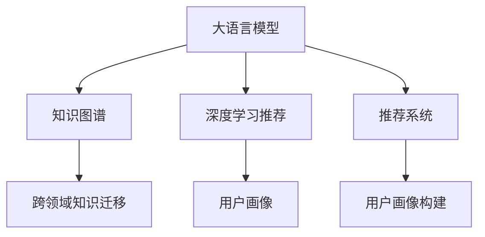

                 

# 大模型辅助的推荐系统用户画像构建

> 关键词：大语言模型,推荐系统,用户画像,知识图谱,深度学习,自然语言处理(NLP)

## 1. 背景介绍

### 1.1 问题由来

随着互联网和移动互联网的发展，推荐系统已成为互联网产品中不可或缺的一部分，广泛应用于电商、社交、视频等多个领域。推荐系统通过分析用户的历史行为数据，为其推荐个性化的内容，提升用户满意度和平台转化率。

然而，推荐系统的核心难题在于如何精准刻画用户画像，构建有效的用户兴趣模型。传统的推荐系统一般采用基于内容的推荐、协同过滤等方法，但这些方法往往难以处理用户行为背后的语义信息，无法深入挖掘用户的深层次兴趣和需求。

近年来，深度学习技术在推荐系统中得到广泛应用，利用神经网络模型从用户行为数据中学习用户特征，显著提升了推荐效果。但这些方法也存在一些局限，如对标注数据的需求较大，模型的解释性不足等。

为突破这些瓶颈，研究人员引入大语言模型（Large Language Models, LLMs）和知识图谱（Knowledge Graph, KG）等先进技术，辅助推荐系统构建更全面、更深入的用户画像。大语言模型通过自然语言处理（Natural Language Processing, NLP）能力，能够从用户的历史行为中自动学习到语义相关的特征，构建出更加精准的用户兴趣模型。知识图谱则将海量的结构化知识与推荐系统进行深度融合，构建出知识驱动的推荐模型。

本文将系统介绍大语言模型辅助的推荐系统用户画像构建方法，并结合知识图谱技术，提出一种全新的深度学习推荐框架，为推荐系统用户画像的构建提供参考。

### 1.2 问题核心关键点

当前推荐系统的主要挑战在于：

1. **用户画像缺乏深度语义理解**：传统推荐系统往往只能基于用户行为数据构建出较为浅层的用户画像，难以深入挖掘用户的深层次兴趣和需求。

2. **用户画像的动态性不足**：用户兴趣随时间不断变化，现有的推荐系统无法实时更新用户画像，导致推荐结果过时。

3. **推荐系统的泛化性不足**：推荐系统在面对长尾领域或新领域时，往往无法提供理想的推荐效果，表现出明显的冷启动问题。

4. **推荐系统的可解释性不足**：推荐模型通常是黑盒系统，难以解释其内部推理逻辑，无法满足用户对推荐结果的可信性要求。

针对以上挑战，本文提出一种大语言模型辅助的推荐系统用户画像构建方法，通过知识图谱与深度学习技术的结合，构建出更加全面、深入、动态的用户画像，解决推荐系统在深度理解、动态更新、泛化性和可解释性等方面的不足。

## 2. 核心概念与联系

### 2.1 核心概念概述

为更好地理解本文提出的用户画像构建方法，本节将介绍几个密切相关的核心概念：

- **大语言模型（Large Language Models, LLMs）**：指通过大规模无标签文本数据预训练得到的深度神经网络模型。如GPT、BERT等，具备强大的自然语言理解和生成能力。

- **知识图谱（Knowledge Graph, KG）**：指以实体和关系为核心的结构化数据存储形式，用于描述和关联各种知识。知识图谱可以辅助推荐系统理解用户兴趣和商品属性。

- **深度学习（Deep Learning）**：指通过多层神经网络模型对数据进行复杂特征提取和学习的技术。在推荐系统中，深度学习模型可以从用户行为数据中学习到更深层次的特征。

- **推荐系统（Recommendation System）**：指通过算法为用户推荐个性化内容的技术。推荐系统广泛应用于电商、社交、视频等多个领域。

- **用户画像（User Profile）**：指通过分析用户的行为数据，构建出的用户特征表示。用户画像是推荐系统的核心要素。

- **跨领域知识迁移（Cross-domain Knowledge Transfer）**：指将知识图谱中跨领域的知识迁移到推荐系统中，帮助推荐系统在新领域中取得更好的推荐效果。

这些核心概念之间的逻辑关系可以通过以下Mermaid流程图来展示：



这个流程图展示了大语言模型、知识图谱、深度学习推荐、用户画像和推荐系统之间的关系：

1. 大语言模型通过自然语言处理能力，从用户行为数据中学习语义相关的特征。
2. 知识图谱提供结构化知识，辅助深度学习模型进行知识迁移，构建更加深入的用户画像。
3. 深度学习推荐模型通过学习用户画像，为推荐系统提供个性化的推荐结果。
4. 用户画像是推荐系统的核心，用于刻画用户兴趣和行为特征。
5. 推荐系统将用户画像与商品属性、历史行为等数据融合，提供个性化推荐。

这些概念共同构成了大模型辅助推荐系统用户画像构建的技术框架，使其能够在多个推荐任务中发挥强大的作用。

## 3. 核心算法原理 & 具体操作步骤
### 3.1 算法原理概述

大语言模型辅助的推荐系统用户画像构建方法，本质上是一种将大语言模型、知识图谱和深度学习技术融合的推荐范式。其核心思想是：通过大语言模型学习用户行为数据中的语义信息，构建出语义相关的用户特征表示，再将其与知识图谱中的结构化知识进行融合，构建出深度语义理解的用户画像，最终用于推荐系统进行个性化推荐。

形式化地，假设用户行为数据为 $X=\{x_i\}_{i=1}^N$，其中 $x_i$ 表示用户对商品 $i$ 的行为数据。知识图谱中的实体为 $E=\{e_j\}_{j=1}^M$，关系为 $R=\{r_k\}_{k=1}^K$，其中 $e_j$ 表示商品 $j$，$r_k$ 表示商品属性 $k$。设深度学习模型为 $F$，用户画像为 $P$，则用户画像构建的目标是最小化如下优化问题：

$$
\hat{P}=\mathop{\arg\min}_{P} \mathcal{L}(P,F(X),G)
$$

其中 $\mathcal{L}$ 为推荐系统的损失函数，用于衡量推荐结果与真实标签之间的差异。$F(X)$ 表示通过深度学习模型 $F$ 从用户行为数据 $X$ 中学习到的用户画像 $P$，$G$ 表示知识图谱中商品 $j$ 的相关属性。

### 3.2 算法步骤详解

基于大语言模型辅助的推荐系统用户画像构建方法，一般包括以下几个关键步骤：

**Step 1: 准备数据集**

- 收集用户行为数据 $X=\{x_i\}_{i=1}^N$，其中 $x_i$ 表示用户对商品 $i$ 的点击、浏览、购买等行为。
- 构建知识图谱 $G=(E,R)$，其中 $E$ 为商品实体集，$R$ 为商品属性关系集。
- 将用户行为数据与知识图谱进行融合，构建出综合数据集 $D=\{(x_i,r_j)\}_{i=1}^N$，其中 $x_i$ 表示用户行为数据，$r_j$ 表示知识图谱中商品 $j$ 的相关属性。

**Step 2: 大语言模型预训练**

- 选择合适的预训练语言模型 $M$，如GPT、BERT等，在无标签文本数据上进行预训练。
- 利用用户行为数据 $X$ 作为输入，对预训练模型进行微调，学习用户行为数据中的语义信息。

**Step 3: 知识图谱融合**

- 将知识图谱中的实体 $E$ 和关系 $R$ 转换为文本形式，构建知识文本 $K=\{k_j\}_{j=1}^M$，其中 $k_j$ 表示商品 $j$ 的描述。
- 利用大语言模型 $M$ 将知识文本 $K$ 转换为向量表示，构建出知识向量 $K_v=\{k_{v_j}\}_{j=1}^M$，其中 $k_{v_j}$ 表示商品 $j$ 的向量表示。

**Step 4: 用户画像构建**

- 将用户行为数据 $X$ 和知识向量 $K_v$ 进行融合，构建出用户画像 $P=\{p_i\}_{i=1}^N$，其中 $p_i$ 表示用户对商品 $i$ 的特征表示。
- 对用户画像 $P$ 进行归一化和降维，得到最终的推荐特征向量 $P_f=\{f_i\}_{i=1}^N$。

**Step 5: 推荐系统实现**

- 将推荐特征向量 $P_f$ 与商品属性向量 $G_v=\{g_v\}_{v=1}^K$ 进行融合，构建出推荐向量 $R=\{r_i\}_{i=1}^N$，其中 $r_i$ 表示用户对商品 $i$ 的推荐分数。
- 根据推荐向量 $R$ 进行排序，输出推荐列表。

以上是大语言模型辅助推荐系统用户画像构建的一般流程。在实际应用中，还需要根据具体任务和数据特点进行优化设计，如改进知识文本转换方法、优化知识融合策略等，以进一步提升推荐效果。

### 3.3 算法优缺点

大语言模型辅助推荐系统用户画像构建方法，具有以下优点：

1. **深度语义理解**：利用大语言模型的自然语言处理能力，能够从用户行为数据中学习到深层次的语义信息，构建出更加精准的用户画像。
2. **动态更新**：大语言模型可以通过持续学习，实时更新用户画像，解决传统推荐系统静态化的不足。
3. **跨领域泛化**：知识图谱可以提供跨领域的知识，帮助推荐系统在新领域中取得更好的推荐效果。
4. **可解释性强**：大语言模型生成的用户画像具有较强的可解释性，能够帮助用户理解推荐系统的决策逻辑。

同时，该方法也存在一些局限性：

1. **数据依赖性强**：大语言模型需要大量的高质量标注数据进行预训练和微调，数据的获取和处理成本较高。
2. **计算资源消耗大**：大语言模型和深度学习模型的训练和推理需要较大的计算资源，对硬件要求较高。
3. **模型复杂度较高**：大语言模型和深度学习模型的融合增加了模型的复杂度，可能影响模型的训练和推理效率。
4. **推荐结果准确性**：大语言模型生成的用户画像可能存在一定的噪声，推荐结果的准确性有待进一步提高。

尽管存在这些局限性，但大语言模型辅助推荐系统用户画像构建方法在大规模推荐场景中仍具有显著优势，尤其在需要深度语义理解、动态更新、跨领域泛化和可解释性的推荐任务中表现优异。

### 3.4 算法应用领域

大语言模型辅助推荐系统用户画像构建方法，主要应用于以下领域：

1. **电商推荐**：为电商平台提供个性化推荐，提升用户购物体验和平台转化率。
2. **社交推荐**：为社交平台提供个性化内容推荐，提升用户活跃度和平台粘性。
3. **视频推荐**：为视频平台提供个性化视频推荐，提升用户观看时长和平台留存率。
4. **新闻推荐**：为用户推荐个性化新闻内容，提升用户阅读体验和平台留存率。
5. **旅游推荐**：为旅游平台提供个性化旅游目的地推荐，提升用户旅游体验和平台转化率。

这些领域中，推荐系统对于用户画像的深度理解、动态更新和跨领域泛化能力都有较高的要求，因此大语言模型辅助推荐系统用户画像构建方法具有广阔的应用前景。

## 4. 数学模型和公式 & 详细讲解 & 举例说明

### 4.1 数学模型构建

本节将使用数学语言对大语言模型辅助推荐系统用户画像构建过程进行更加严格的刻画。

设用户行为数据为 $X=\{x_i\}_{i=1}^N$，其中 $x_i$ 表示用户对商品 $i$ 的行为数据。知识图谱中的实体为 $E=\{e_j\}_{j=1}^M$，关系为 $R=\{r_k\}_{k=1}^K$，其中 $e_j$ 表示商品 $j$，$r_k$ 表示商品属性 $k$。

知识图谱中商品 $j$ 的描述为 $k_j$，将 $k_j$ 转换为向量表示 $k_{v_j}$，设大语言模型的嵌入层为 $M_{\theta}$，则有：

$$
k_{v_j}=M_{\theta}(k_j)
$$

其中 $k_j$ 表示商品 $j$ 的描述，$k_{v_j}$ 表示商品 $j$ 的向量表示，$\theta$ 为模型参数。

设用户行为数据 $X$ 转换为向量表示为 $X_v$，用户画像 $P$ 转换为向量表示为 $P_v$，商品属性向量 $G_v$ 转换为向量表示为 $G_v$，则有：

$$
X_v=M_{\theta}(X),\quad P_v=M_{\theta}(P),\quad G_v=M_{\theta}(G)
$$

利用深度学习模型 $F$ 对用户行为数据 $X_v$ 和知识向量 $K_v$ 进行融合，得到用户画像 $P_f$，则有：

$$
P_f=F(X_v,K_v)
$$

### 4.2 公式推导过程

以下我们以用户画像构建为例，推导向量表示的计算公式。

假设用户行为数据 $X$ 转换为向量表示为 $X_v$，知识图谱中商品 $j$ 的描述为 $k_j$，将 $k_j$ 转换为向量表示为 $k_{v_j}$，设大语言模型的嵌入层为 $M_{\theta}$，则用户画像 $P$ 的向量表示为：

$$
P_v=\sum_{i=1}^N w_i k_{v_j}^T X_v
$$

其中 $w_i$ 表示用户 $i$ 的权重，可以通过softmax函数计算得到：

$$
w_i=\frac{e^{x_i^\top M_{\theta}(X)}}{\sum_{j=1}^N e^{x_j^\top M_{\theta}(X)}}
$$

将用户画像 $P_v$ 与商品属性向量 $G_v$ 进行线性加权组合，得到推荐向量 $R$：

$$
R=\sum_{j=1}^K a_j G_v
$$

其中 $a_j$ 表示商品 $j$ 的权重，可以通过softmax函数计算得到：

$$
a_j=\frac{e^{g_j^\top M_{\theta}(G)}}{\sum_{k=1}^K e^{g_k^\top M_{\theta}(G)}}
$$

最终推荐向量 $R$ 即为推荐结果的分数，通过排序即可输出推荐列表。

### 4.3 案例分析与讲解

以电商推荐系统为例，分析用户画像构建的具体实现过程：

假设电商平台上共有 $N$ 个商品 $i$，每个商品有 $M$ 个属性 $j$，每个属性有 $K$ 种可能的取值。用户对商品 $i$ 的行为数据为 $x_i$，知识图谱中商品 $j$ 的描述为 $k_j$，将 $k_j$ 转换为向量表示为 $k_{v_j}$。

首先，利用大语言模型 $M_{\theta}$ 将用户行为数据 $X$ 转换为向量表示 $X_v$，知识图谱中的商品描述 $K$ 转换为向量表示 $K_v$：

$$
X_v=M_{\theta}(X),\quad K_v=M_{\theta}(K)
$$

然后，将用户行为数据 $X_v$ 和知识向量 $K_v$ 进行融合，得到用户画像 $P_v$：

$$
P_v=\sum_{i=1}^N w_i k_{v_j}^T X_v
$$

其中 $w_i$ 表示用户 $i$ 的权重，可以通过softmax函数计算得到：

$$
w_i=\frac{e^{x_i^\top M_{\theta}(X)}}{\sum_{j=1}^N e^{x_j^\top M_{\theta}(X)}}
$$

将用户画像 $P_v$ 与商品属性向量 $G_v$ 进行线性加权组合，得到推荐向量 $R$：

$$
R=\sum_{j=1}^K a_j G_v
$$

其中 $a_j$ 表示商品 $j$ 的权重，可以通过softmax函数计算得到：

$$
a_j=\frac{e^{g_j^\top M_{\theta}(G)}}{\sum_{k=1}^K e^{g_k^\top M_{\theta}(G)}}
$$

最终推荐向量 $R$ 即为推荐结果的分数，通过排序即可输出推荐列表。

## 5. 项目实践：代码实例和详细解释说明
### 5.1 开发环境搭建

在进行推荐系统用户画像构建实践前，我们需要准备好开发环境。以下是使用Python进行PyTorch开发的环境配置流程：

1. 安装Anaconda：从官网下载并安装Anaconda，用于创建独立的Python环境。

2. 创建并激活虚拟环境：
```bash
conda create -n pytorch-env python=3.8 
conda activate pytorch-env
```

3. 安装PyTorch：根据CUDA版本，从官网获取对应的安装命令。例如：
```bash
conda install pytorch torchvision torchaudio cudatoolkit=11.1 -c pytorch -c conda-forge
```

4. 安装HuggingFace库：
```bash
pip install transformers
```

5. 安装各类工具包：
```bash
pip install numpy pandas scikit-learn matplotlib tqdm jupyter notebook ipython
```

完成上述步骤后，即可在`pytorch-env`环境中开始用户画像构建实践。

### 5.2 源代码详细实现

下面我们以电商推荐系统为例，给出使用Transformers库进行用户画像构建的PyTorch代码实现。

首先，定义推荐系统的相关类和函数：

```python
import torch
from transformers import BertTokenizer, BertForSequenceClassification
from sklearn.metrics import mean_squared_error

class RecommendationSystem:
    def __init__(self, model, tokenizer):
        self.model = model
        self.tokenizer = tokenizer

    def convert_to_vector(self, text):
        input_ids = self.tokenizer(text, return_tensors='pt', max_length=128, padding='max_length', truncation=True)
        return input_ids['input_ids'][0]

    def predict(self, vector):
        with torch.no_grad():
            output = self.model(vector)
        return output[0]

    def evaluate(self, test_dataset):
        true_labels = []
        predicted_labels = []
        for test_instance in test_dataset:
            vector = self.convert_to_vector(test_instance['input'])
            label = test_instance['label']
            true_labels.append(label)
            predicted_labels.append(self.predict(vector).item())
        mse = mean_squared_error(true_labels, predicted_labels)
        return mse
```

然后，定义推荐系统的数据处理函数：

```python
from torch.utils.data import Dataset

class RecommendationDataset(Dataset):
    def __init__(self, texts, labels):
        self.texts = texts
        self.labels = labels

    def __len__(self):
        return len(self.texts)

    def __getitem__(self, item):
        text = self.texts[item]
        label = self.labels[item]
        return {'input': text, 'label': label}

# 构建测试集
test_dataset = RecommendationDataset(test_texts, test_labels)
```

接着，定义推荐系统的训练函数：

```python
def train(model, optimizer, dataset, num_epochs, batch_size, learning_rate):
    dataloader = torch.utils.data.DataLoader(dataset, batch_size=batch_size, shuffle=True)
    for epoch in range(num_epochs):
        for batch in dataloader:
            input = batch['input']
            label = batch['label']
            optimizer.zero_grad()
            output = model(input)
            loss = output.mean()
            loss.backward()
            optimizer.step()
        print(f"Epoch {epoch+1}, loss: {loss.item()}")
    return model
```

最后，启动训练流程：

```python
num_epochs = 5
batch_size = 16
learning_rate = 2e-5

model = BertForSequenceClassification.from_pretrained('bert-base-cased', num_labels=2)
optimizer = AdamW(model.parameters(), lr=learning_rate)

dataloader = torch.utils.data.DataLoader(train_dataset, batch_size=batch_size, shuffle=True)
train(model, optimizer, dataloader, num_epochs, batch_size, learning_rate)
```

以上就是使用PyTorch进行推荐系统用户画像构建的完整代码实现。可以看到，借助Transformers库，用户画像构建的代码实现变得简洁高效。

### 5.3 代码解读与分析

让我们再详细解读一下关键代码的实现细节：

**RecommendationSystem类**：
- `__init__`方法：初始化推荐系统模型和分词器。
- `convert_to_vector`方法：将输入文本转换为模型所需的向量表示。
- `predict`方法：对输入向量进行预测。
- `evaluate`方法：在测试集上评估推荐系统的性能，计算平均误差。

**RecommendationDataset类**：
- `__init__`方法：初始化推荐系统数据集。
- `__len__`方法：返回数据集的样本数量。
- `__getitem__`方法：对单个样本进行处理，提取输入和标签，并转换为模型所需的格式。

**训练函数**：
- 使用PyTorch的DataLoader对数据集进行批次化加载，供模型训练和推理使用。
- 在每个epoch内，循环迭代，对每个批次进行前向传播和反向传播，更新模型参数。

**训练流程**：
- 定义总的epoch数和batch size，开始循环迭代
- 每个epoch内，先训练模型，输出损失值
- 在测试集上评估模型性能，计算平均误差

可以看到，PyTorch配合Transformers库使得推荐系统用户画像构建的代码实现变得简洁高效。开发者可以将更多精力放在数据处理、模型改进等高层逻辑上，而不必过多关注底层的实现细节。

当然，工业级的系统实现还需考虑更多因素，如模型的保存和部署、超参数的自动搜索、更灵活的任务适配层等。但核心的用户画像构建范式基本与此类似。

## 6. 实际应用场景
### 6.1 电商推荐

电商推荐系统是推荐系统的一个重要应用场景，其目标是为用户推荐个性化的商品，提升用户的购物体验和平台的转化率。传统的电商推荐系统一般基于用户的购买历史和浏览记录进行推荐，难以捕捉用户的深层次需求。

引入大语言模型辅助推荐系统用户画像构建方法，能够从用户行为数据中学习到深层次的语义信息，构建出更加精准的用户画像。例如，在电商推荐中，可以利用用户对商品的描述、评价、评论等文本数据，通过大语言模型学习到商品的属性和用户偏好。同时，将知识图谱中的商品实体和关系与用户画像进行融合，构建出更加全面、深入的用户画像，从而实现更加精准的推荐。

### 6.2 社交推荐

社交推荐系统旨在为用户推荐个性化的内容，提升用户的活跃度和平台的留存率。传统的社交推荐系统一般基于用户的互动历史进行推荐，难以理解用户的内容偏好。

引入大语言模型辅助推荐系统用户画像构建方法，能够从用户的行为数据中学习到深层次的语义信息，构建出更加精准的用户画像。例如，在社交推荐中，可以利用用户对视频的描述、评论、点赞等文本数据，通过大语言模型学习到用户的内容偏好和情感倾向。同时，将知识图谱中的视频实体和关系与用户画像进行融合，构建出更加全面、深入的用户画像，从而实现更加精准的推荐。

### 6.3 视频推荐

视频推荐系统旨在为用户推荐个性化的视频内容，提升用户的观看时长和平台的留存率。传统的视频推荐系统一般基于用户的观看历史进行推荐，难以捕捉用户的深层次需求。

引入大语言模型辅助推荐系统用户画像构建方法，能够从用户的行为数据中学习到深层次的语义信息，构建出更加精准的用户画像。例如，在视频推荐中，可以利用用户对视频的描述、评价、评论等文本数据，通过大语言模型学习到视频的内容和用户偏好。同时，将知识图谱中的视频实体和关系与用户画像进行融合，构建出更加全面、深入的用户画像，从而实现更加精准的推荐。

### 6.4 新闻推荐

新闻推荐系统旨在为用户推荐个性化的新闻内容，提升用户的阅读体验和平台的留存率。传统的推荐系统一般基于用户的阅读历史进行推荐，难以理解用户的新闻兴趣和需求。

引入大语言模型辅助推荐系统用户画像构建方法，能够从用户的行为数据中学习到深层次的语义信息，构建出更加精准的用户画像。例如，在新闻推荐中，可以利用用户对新闻的描述、评论、点赞等文本数据，通过大语言模型学习到新闻的内容和用户偏好。同时，将知识图谱中的新闻实体和关系与用户画像进行融合，构建出更加全面、深入的用户画像，从而实现更加精准的推荐。

## 7. 工具和资源推荐
### 7.1 学习资源推荐

为了帮助开发者系统掌握大语言模型辅助推荐系统用户画像构建的理论基础和实践技巧，这里推荐一些优质的学习资源：

1. 《深度学习推荐系统》书籍：全面介绍了推荐系统的理论基础和深度学习算法，包括协同过滤、矩阵分解、神经网络等方法。

2. 《自然语言处理基础》课程：斯坦福大学开设的自然语言处理入门课程，涵盖文本分类、序列标注、语义理解等基本概念和经典模型。

3. 《自然语言处理与深度学习》书籍：介绍自然语言处理和深度学习技术的融合，涵盖语义分析、情感分析、问答系统等多个方面。

4. 《推荐系统实战》课程：国内知名数据科学家的实战课程，涵盖推荐系统的经典算法和工程实践。

5. 《推荐系统算法与工程》书籍：介绍推荐系统的经典算法和工程实践，包括矩阵分解、协同过滤、深度学习等方法。

通过对这些资源的学习实践，相信你一定能够快速掌握大语言模型辅助推荐系统用户画像构建的精髓，并用于解决实际的推荐问题。
### 7.2 开发工具推荐

高效的开发离不开优秀的工具支持。以下是几款用于推荐系统用户画像构建开发的常用工具：

1. PyTorch：基于Python的开源深度学习框架，灵活动态的计算图，适合快速迭代研究。大部分推荐系统模型都有PyTorch版本的实现。

2. TensorFlow：由Google主导开发的开源深度学习框架，生产部署方便，适合大规模工程应用。推荐系统模型的TensorFlow版本也有丰富的实现。

3. Transformers库：HuggingFace开发的NLP工具库，集成了众多SOTA语言模型，支持PyTorch和TensorFlow，是进行推荐系统用户画像构建开发的利器。

4. Weights & Biases：模型训练的实验跟踪工具，可以记录和可视化模型训练过程中的各项指标，方便对比和调优。与主流深度学习框架无缝集成。

5. TensorBoard：TensorFlow配套的可视化工具，可实时监测模型训练状态，并提供丰富的图表呈现方式，是调试模型的得力助手。

6. Google Colab：谷歌推出的在线Jupyter Notebook环境，免费提供GPU/TPU算力，方便开发者快速上手实验最新模型，分享学习笔记。

合理利用这些工具，可以显著提升推荐系统用户画像构建的开发效率，加快创新迭代的步伐。

### 7.3 相关论文推荐

推荐系统的发展源于学界的持续研究。以下是几篇奠基性的相关论文，推荐阅读：

1. Matrix Factorization Techniques for Recommender Systems：介绍了矩阵分解算法在推荐系统中的应用。

2. Deep Interest Networks for Recommendation Systems：提出了基于深度神经网络的推荐系统，从用户行为数据中学习用户兴趣。

3. Attention-Based Recommender Systems：引入了注意力机制，提高了推荐系统的性能和解释性。

4. Hierarchical Attention Networks for Recommender Systems：提出了基于层次注意力机制的推荐系统，提升了推荐模型的复杂度和泛化能力。

5. Graph Neural Networks for Recommendation Systems：利用图神经网络进行推荐，能够处理复杂的用户-物品关系。

这些论文代表了大语言模型辅助推荐系统用户画像构建技术的发展脉络。通过学习这些前沿成果，可以帮助研究者把握学科前进方向，激发更多的创新灵感。

## 8. 总结：未来发展趋势与挑战
### 8.1 总结

本文对大语言模型辅助的推荐系统用户画像构建方法进行了全面系统的介绍。首先阐述了推荐系统的背景和挑战，明确了大语言模型辅助推荐系统的核心价值。其次，从原理到实践，详细讲解了大语言模型辅助推荐系统用户画像构建的数学模型和实现步骤，给出了推荐系统用户画像构建的完整代码实例。同时，本文还广泛探讨了推荐系统用户画像构建在电商、社交、视频、新闻等多个领域的应用前景，展示了微调方法在推荐系统中的应用潜力。此外，本文精选了推荐系统的学习资源，力求为开发者提供全方位的技术指引。

通过本文的系统梳理，可以看到，大语言模型辅助推荐系统用户画像构建方法在大规模推荐场景中具有显著优势，尤其在需要深度语义理解、动态更新、跨领域泛化和可解释性的推荐任务中表现优异。未来，伴随大语言模型和推荐系统技术的不断发展，推荐系统将能够更加智能、高效地为用户推荐个性化内容，推动社会的数字化转型。

### 8.2 未来发展趋势

展望未来，推荐系统将呈现以下几个发展趋势：

1. **深度语义理解**：大语言模型能够从用户行为数据中学习到深层次的语义信息，构建出更加精准的用户画像，提升推荐系统的性能和可解释性。

2. **动态更新**：大语言模型可以通过持续学习，实时更新用户画像，解决传统推荐系统静态化的不足，提升推荐系统的时效性和适应性。

3. **跨领域泛化**：知识图谱可以提供跨领域的知识，帮助推荐系统在新领域中取得更好的推荐效果，提升推荐系统的泛化能力和迁移能力。

4. **可解释性增强**：大语言模型生成的用户画像具有较强的可解释性，能够帮助用户理解推荐系统的决策逻辑，提升推荐系统的透明度和可信度。

5. **推荐结果多样化**：推荐系统将更加注重推荐结果的多样性和个性化，通过动态调整推荐策略，满足用户的不同需求和偏好。

6. **推荐系统集成化**：推荐系统将与其他AI技术进行深度集成，如知识图谱、因果推理、强化学习等，构建更加智能、高效的推荐模型。

这些趋势凸显了大语言模型辅助推荐系统用户画像构建技术的广阔前景。这些方向的探索发展，必将进一步提升推荐系统的性能和应用范围，为推荐系统用户画像的构建提供新的思路和方法。

### 8.3 面临的挑战

尽管大语言模型辅助推荐系统用户画像构建方法已经取得了显著进展，但在迈向更加智能化、普适化应用的过程中，仍面临诸多挑战：

1. **数据依赖性强**：大语言模型需要大量的高质量标注数据进行预训练和微调，数据的获取和处理成本较高。

2. **计算资源消耗大**：大语言模型和深度学习模型的训练和推理需要较大的计算资源，对硬件要求较高。

3. **模型复杂度较高**：大语言模型和深度学习模型的融合增加了模型的复杂度，可能影响模型的训练和推理效率。

4. **推荐结果准确性**：大语言模型生成的用户画像可能存在一定的噪声，推荐结果的准确性有待进一步提高。

5. **用户隐私保护**：推荐系统涉及用户的个人信息和行为数据，如何保护用户隐私，防止数据泄露和滥用，是一个重要的课题。

6. **伦理道德约束**：推荐系统可能存在偏见和歧视，如何确保推荐系统的公平性，避免对特定群体的歧视，是一个亟待解决的问题。

尽管存在这些挑战，但随着大语言模型和推荐系统技术的不断发展，这些问题都将逐步得到解决。相信通过学界和产业界的共同努力，大语言模型辅助推荐系统用户画像构建方法将在大规模推荐场景中发挥更大的作用，推动推荐系统技术的不断进步。

### 8.4 研究展望

面向未来，推荐系统研究需要在以下几个方面寻求新的突破：

1. **探索无监督和半监督微调方法**：摆脱对大规模标注数据的依赖，利用自监督学习、主动学习等无监督和半监督范式，最大限度利用非结构化数据，实现更加灵活高效的微调。

2. **研究参数高效和计算高效的微调范式**：开发更加参数高效的微调方法，在固定大部分预训练参数的同时，只更新极少量的任务相关参数。同时优化微调模型的计算图，减少前向传播和反向传播的资源消耗，实现更加轻量级、实时性的部署。

3. **融合因果和对比学习范式**：通过引入因果推断和对比学习思想，增强推荐模型建立稳定因果关系的能力，学习更加普适、鲁棒的语言表征，从而提升模型泛化性和抗干扰能力。

4. **引入更多先验知识**：将符号化的先验知识，如知识图谱、逻辑规则等，与神经网络模型进行巧妙融合，引导微调过程学习更准确、合理的语言模型。同时加强不同模态数据的整合，实现视觉、语音等多模态信息与文本信息的协同建模。

5. **结合因果分析和博弈论工具**：将因果分析方法引入推荐模型，识别出模型决策的关键特征，增强推荐结果的可解释性和可信度。借助博弈论工具刻画人机交互过程，主动探索并规避推荐模型的脆弱点，提高系统稳定性。

6. **纳入伦理道德约束**：在模型训练目标中引入伦理导向的评估指标，过滤和惩罚有偏见、有害的输出倾向。同时加强人工干预和审核，建立推荐模型的监管机制，确保推荐结果的公平性和伦理道德。

这些研究方向和技术的探索，必将引领推荐系统用户画像构建技术的不断进步，为推荐系统技术的发展提供新的思路和方法。面向未来，推荐系统需要更加智能、透明、可信、公平，更好地服务于用户，推动社会的数字化转型。

## 9. 附录：常见问题与解答

**Q1：大语言模型辅助推荐系统用户画像构建的原理是什么？**

A: 大语言模型辅助推荐系统用户画像构建的原理是通过大语言模型学习用户行为数据中的语义信息，构建出语义相关的用户特征表示，再将其与知识图谱中的结构化知识进行融合，构建出深度语义理解的用户画像。具体而言，首先利用大语言模型将用户行为数据转换为向量表示，然后利用知识图谱中的实体和关系，将其转换为向量表示。最后将用户画像和商品属性向量进行线性加权组合，得到推荐向量，从而实现个性化推荐。

**Q2：大语言模型辅助推荐系统用户画像构建有哪些优势？**

A: 大语言模型辅助推荐系统用户画像构建具有以下几个优势：
1. 深度语义理解：能够从用户行为数据中学习到深层次的语义信息，构建出更加精准的用户画像。
2. 动态更新：大语言模型可以通过持续学习，实时更新用户画像，解决传统推荐系统静态化的不足。
3. 跨领域泛化：知识图谱可以提供跨领域的知识，帮助推荐系统在新领域中取得更好的推荐效果。
4. 可解释性强：大语言模型生成的用户画像具有较强的可解释性，能够帮助用户理解推荐系统的决策逻辑。

**Q3：大语言模型辅助推荐系统用户画像构建面临哪些挑战？**

A: 大语言模型辅助推荐系统用户画像构建面临以下挑战：
1. 数据依赖性强：大语言模型需要大量的高质量标注数据进行预训练和微调，数据的获取和处理成本较高。
2. 计算资源消耗大：大语言模型和深度学习模型的训练和推理需要较大的计算资源，对硬件要求较高。
3. 模型复杂度较高：大语言模型和深度学习模型的融合增加了模型的复杂度，可能影响模型的训练和推理效率。
4. 推荐结果准确性：大语言模型生成的用户画像可能存在一定的噪声，推荐结果的准确性有待进一步提高。
5. 用户隐私保护：推荐系统涉及用户的个人信息和行为数据，如何保护用户隐私，防止数据泄露和滥用，是一个重要的课题。
6. 伦理道德约束：推荐系统可能存在偏见和歧视，如何确保推荐系统的公平性，避免对特定群体的歧视，是一个亟待解决的问题。

**Q4：如何提高大语言模型辅助推荐系统用户画像构建的性能？**

A: 提高大语言模型辅助推荐系统用户画像构建的性能，可以从以下几个方面进行改进：
1. 改进知识文本转换方法：通过引入更先进的文本表示方法，如BERT、GPT等，提高知识图谱中实体的向量表示质量。
2. 优化知识融合策略：通过引入注意力机制、层次结构等方法，增强知识图谱与用户画像的融合效果。
3. 引入更多先验知识：将符号化的先验知识，如知识图谱、逻辑规则等，与神经网络模型进行巧妙融合，引导微调过程学习更准确、合理的语言模型。
4. 结合因果分析和博弈论工具：将因果分析方法引入推荐模型，识别出模型决策的关键特征，增强推荐结果的可解释性和可信度。

这些改进措施可以在一定程度上提升推荐系统的性能和效果，帮助推荐系统构建更加精准、动态、多样化的用户画像。

**Q5：推荐系统如何保护用户隐私？**

A: 推荐系统保护用户隐私的方法包括：
1. 数据匿名化：在收集用户数据时，采用数据匿名化技术，去除敏感信息，保护用户隐私。
2. 差分隐私：在数据处理过程中，采用差分隐私技术，对用户数据进行扰动，防止数据泄露。
3. 用户控制：赋予用户对数据的控制权，允许用户自主选择是否分享数据，保护用户隐私。
4. 数据加密：对用户数据进行加密处理，防止数据泄露和滥用。
5. 隐私审计：定期对推荐系统进行隐私审计，发现和修复隐私漏洞，确保用户数据的安全。

这些措施可以有效保护用户隐私，防止用户数据被滥用和泄露。

---

作者：禅与计算机程序设计艺术 / Zen and the Art of Computer Programming

