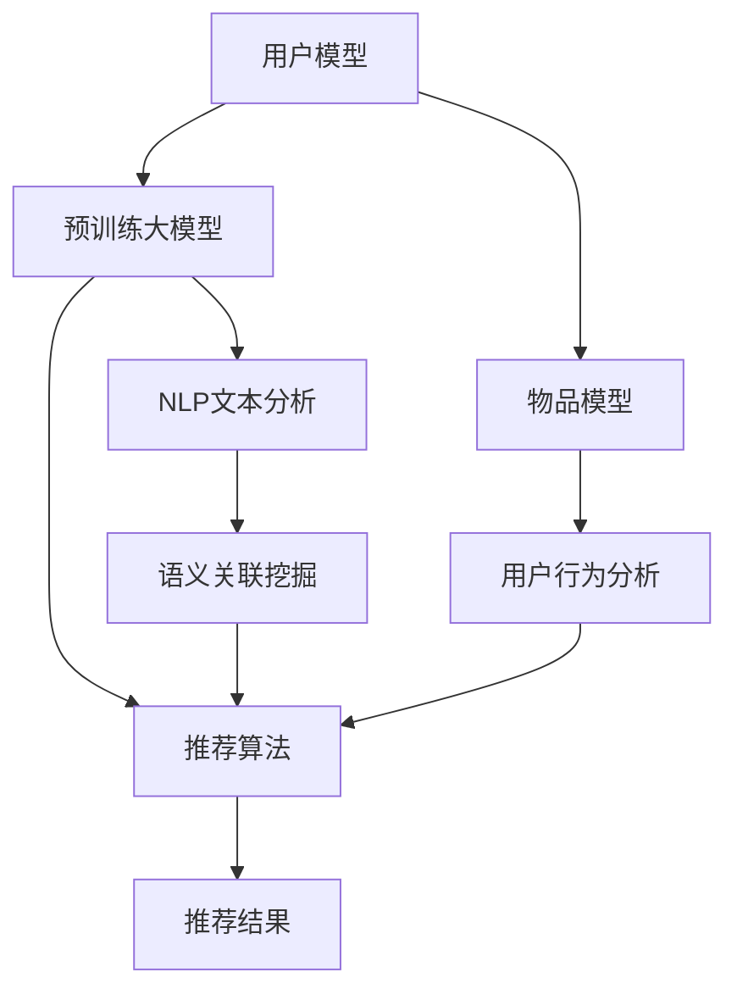

                 

# 大模型辅助的推荐系统用户行为分析

> 关键词：大模型,推荐系统,用户行为分析,深度学习,协同过滤,矩阵分解,交互嵌入,自然语言处理

## 1. 背景介绍

### 1.1 问题由来
推荐系统（Recommendation System）是现代互联网应用中不可或缺的一部分，能够帮助用户在海量信息中发现感兴趣的物品。传统的推荐算法主要基于协同过滤、矩阵分解等方法，虽然效果显著，但面临冷启动、数据稀疏等问题。近年来，深度学习技术在推荐系统中逐渐崭露头角，尤其是在预训练语言模型的辅助下，推荐系统取得了更为显著的进步。

本文将重点介绍基于大模型的推荐系统用户行为分析方法。通过预训练大模型进行用户兴趣和行为模式的挖掘，能够构建更加个性化和精准的推荐模型。结合自然语言处理（NLP）技术，可以从用户的历史行为和实时交互中提取更多语义信息，进一步提升推荐效果。

## 2. 核心概念与联系

### 2.1 核心概念概述

推荐系统通常分为三个主要模块：
1. **用户模型**：描述用户的历史兴趣和偏好。
2. **物品模型**：描述物品的属性和特征。
3. **推荐算法**：通过用户模型和物品模型，生成推荐结果。

在大模型的辅助下，推荐系统可以更加精确地建立用户和物品的表示。大模型可以捕捉到用户和物品之间的语义关系，从而提升推荐准确性。此外，结合自然语言处理技术，可以更自然地处理用户的文本反馈，进一步增强推荐系统的性能。

### 2.2 核心概念原理和架构的 Mermaid 流程图



该图展示了基于大模型的推荐系统架构。用户模型通过与预训练大模型的交互，得到更加精细的用户表示。物品模型结合预训练大模型和自然语言处理技术，获取物品的全面特征。推荐算法利用用户和物品的表示，生成推荐结果。NLP文本分析模块进一步挖掘用户和物品之间的语义关系。

## 3. 核心算法原理 & 具体操作步骤

### 3.1 算法原理概述

基于大模型的推荐系统用户行为分析，核心在于利用大模型对用户和物品进行语义表示。预训练大模型在大规模无标签数据上进行学习，能够捕捉到丰富的语义信息。通过对用户行为数据进行编码，大模型能够提取用户和物品之间的潜在关联。

具体而言，可以采用以下步骤：

1. **预训练大模型**：在大规模文本数据上进行预训练，学习通用的语言表示。
2. **用户行为编码**：将用户的历史行为数据转化为向量形式，输入到预训练大模型中，得到用户向量表示。
3. **物品特征提取**：对物品的属性和描述进行编码，输入到预训练大模型中，得到物品向量表示。
4. **语义关联挖掘**：通过预训练大模型，挖掘用户和物品之间的语义关系，生成推荐结果。

### 3.2 算法步骤详解

#### 3.2.1 预训练大模型的选择

目前，常用的预训练大模型包括BERT、GPT、XLNet等。这些模型都是在大规模无标签文本数据上进行预训练，学习到通用的语言表示。其中，BERT和XLNet采用自编码结构，GPT采用自回归结构。

#### 3.2.2 用户行为编码

用户行为数据通常包括浏览记录、购买记录、评分记录等。这些数据需要转化为向量形式，输入到预训练大模型中进行编码。常用的向量编码方法包括：

1. **TF-IDF编码**：将用户行为文本通过TF-IDF算法转化为向量形式，反映文本中的重要词频。
2. **词嵌入编码**：将用户行为文本通过预训练的词嵌入模型（如Word2Vec、GloVe等）转化为向量形式，保留文本的语义信息。
3. **预训练大模型编码**：将用户行为文本直接输入到预训练大模型中，得到向量表示。

#### 3.2.3 物品特征提取

物品通常有属性和描述。这些属性和描述需要转化为向量形式，输入到预训练大模型中进行编码。常用的向量编码方法包括：

1. **属性向量编码**：将物品属性转化为向量形式，例如使用One-Hot编码或词嵌入编码。
2. **描述向量编码**：将物品描述通过预训练的词嵌入模型（如Word2Vec、GloVe等）转化为向量形式。
3. **预训练大模型编码**：将物品描述直接输入到预训练大模型中，得到向量表示。

#### 3.2.4 语义关联挖掘

用户和物品之间的语义关联可以通过预训练大模型进行挖掘。具体方法包括：

1. **序列建模**：将用户行为序列和物品描述序列输入到预训练大模型中，得到语义向量表示。
2. **交互嵌入**：通过预训练大模型，学习用户和物品之间的交互嵌入向量，反映它们之间的语义关系。
3. **联合表示学习**：将用户和物品的表示进行联合学习，生成更加全面和准确的推荐结果。

### 3.3 算法优缺点

#### 3.3.1 优点

1. **语义信息丰富**：大模型可以捕捉到用户和物品之间的语义关系，提升推荐准确性。
2. **灵活性强**：结合自然语言处理技术，可以处理多种文本类型，适应各种推荐场景。
3. **计算高效**：大模型通常采用并行计算，能够快速处理大规模数据。

#### 3.3.2 缺点

1. **数据要求高**：预训练大模型需要大规模无标签数据进行训练，数据获取成本较高。
2. **计算资源需求大**：大模型的计算资源需求较高，对硬件要求较高。
3. **模型复杂性高**：大模型结构复杂，模型解释性和可解释性较差。

### 3.4 算法应用领域

基于大模型的推荐系统用户行为分析，主要应用于以下领域：

1. **电商推荐**：电商网站可以通过大模型对用户行为进行分析，推荐个性化商品。
2. **音乐推荐**：音乐平台可以利用大模型挖掘用户对歌曲的兴趣和偏好，生成个性化推荐。
3. **视频推荐**：视频平台可以通过大模型分析用户行为，推荐个性化视频内容。
4. **新闻推荐**：新闻平台可以利用大模型对用户的历史行为进行分析，推荐个性化新闻内容。
5. **旅游推荐**：旅游平台可以利用大模型挖掘用户兴趣，推荐个性化旅游目的地和行程。

## 4. 数学模型和公式 & 详细讲解 & 举例说明

### 4.1 数学模型构建

基于大模型的推荐系统用户行为分析，可以构建以下数学模型：

1. **用户表示**：$u$，表示用户的历史行为编码后的向量表示。
2. **物品表示**：$i$，表示物品的属性和描述编码后的向量表示。
3. **推荐结果**：$r$，表示推荐系统的预测结果。

假设用户行为序列为$x=(\{x_1,x_2,\cdots,x_T\})$，物品描述序列为$y=(\{y_1,y_2,\cdots,y_M\})$。预训练大模型为$M$，用户行为编码为$F$，物品特征编码为$G$。推荐算法为$R$。

模型可以表示为：

$$
r = R(F(u), G(i))
$$

其中$F$和$G$分别表示用户行为和物品特征的编码函数。

### 4.2 公式推导过程

#### 4.2.1 用户表示计算

用户表示$u$可以通过以下公式计算：

$$
u = F(\{x_1,x_2,\cdots,x_T\})
$$

其中$F$为预训练大模型编码函数。假设预训练大模型采用Transformer结构，则可以通过Transformer模型进行用户表示计算。

#### 4.2.2 物品表示计算

物品表示$i$可以通过以下公式计算：

$$
i = G(\{y_1,y_2,\cdots,y_M\})
$$

其中$G$为预训练大模型编码函数。假设预训练大模型采用Transformer结构，则可以通过Transformer模型进行物品表示计算。

#### 4.2.3 推荐结果计算

推荐结果$r$可以通过以下公式计算：

$$
r = R(u, i)
$$

其中$R$为推荐算法函数。常用的推荐算法包括协同过滤、矩阵分解、深度学习等。

### 4.3 案例分析与讲解

#### 4.3.1 协同过滤推荐

协同过滤推荐算法可以表示为：

$$
r = R_{CF}(u, i)
$$

其中$R_{CF}$为协同过滤推荐函数。

协同过滤算法包括基于用户的协同过滤和基于物品的协同过滤。基于用户的协同过滤通过计算用户之间的相似度，推荐用户历史上喜欢的物品。基于物品的协同过滤通过计算物品之间的相似度，推荐用户可能喜欢的物品。

#### 4.3.2 矩阵分解推荐

矩阵分解推荐算法可以表示为：

$$
r = R_{MF}(u, i)
$$

其中$R_{MF}$为矩阵分解推荐函数。

矩阵分解算法将用户和物品之间的评分表示为矩阵形式，通过分解矩阵来预测评分。常用的分解方法包括奇异值分解（SVD）和交替最小二乘法（ALS）。

#### 4.3.3 深度学习推荐

深度学习推荐算法可以表示为：

$$
r = R_{DL}(u, i)
$$

其中$R_{DL}$为深度学习推荐函数。

深度学习推荐算法通过构建深度神经网络，学习用户和物品的表示，生成推荐结果。常用的深度学习推荐模型包括基于神经网络的协同过滤模型（NCF）和基于用户-物品交互的模型（I2I）。

## 5. 项目实践：代码实例和详细解释说明

### 5.1 开发环境搭建

#### 5.1.1 Python环境

- 安装Python 3.8及以上版本。
- 安装TensorFlow或PyTorch。

```bash
pip install tensorflow==2.7
```

#### 5.1.2 安装PyTorch

```bash
pip install torch
```

#### 5.1.3 安装HuggingFace库

```bash
pip install transformers
```

#### 5.1.4 安装其他依赖库

```bash
pip install pandas numpy torchtext tqdm sklearn
```

### 5.2 源代码详细实现

#### 5.2.1 数据准备

```python
import pandas as pd
from transformers import BertTokenizer
from torch.utils.data import TensorDataset, DataLoader

# 加载数据集
df = pd.read_csv('user_behavior_data.csv')

# 定义预训练模型
tokenizer = BertTokenizer.from_pretrained('bert-base-uncased')

# 将数据转化为向量形式
def encode_data(text):
    encoded_data = tokenizer.encode(text, add_special_tokens=True, return_tensors='pt')
    return encoded_data

# 将用户行为编码为向量形式
user_encodings = df['user_behavior'].str.split(' ').apply(encode_data)

# 将物品属性和描述编码为向量形式
item_encodings = df['item_description'].str.split(' ').apply(encode_data)

# 构建数据集
dataset = TensorDataset(user_encodings, item_encodings)
```

#### 5.2.2 模型定义

```python
import torch
from transformers import BertForSequenceClassification

# 定义模型
model = BertForSequenceClassification.from_pretrained('bert-base-uncased', num_labels=2)

# 将模型转化为序列分类模型
model = torch.nn.Sequential(model, torch.nn.Linear(768, 2))

# 设置优化器和损失函数
optimizer = torch.optim.Adam(model.parameters(), lr=2e-5)
loss_fn = torch.nn.CrossEntropyLoss()
```

#### 5.2.3 训练过程

```python
from torch.utils.data import DataLoader
from tqdm import tqdm

# 定义训练函数
def train_epoch(model, loader, optimizer, loss_fn):
    model.train()
    total_loss = 0
    for batch in loader:
        optimizer.zero_grad()
        inputs, labels = batch
        outputs = model(inputs)
        loss = loss_fn(outputs, labels)
        loss.backward()
        optimizer.step()
        total_loss += loss.item()
    return total_loss / len(loader)

# 定义训练过程
epochs = 5
batch_size = 64

for epoch in range(epochs):
    train_loader = DataLoader(dataset, batch_size=batch_size, shuffle=True)
    train_loss = train_epoch(model, train_loader, optimizer, loss_fn)
    print(f'Epoch {epoch+1}, train loss: {train_loss:.3f}')
```

### 5.3 代码解读与分析

#### 5.3.1 数据预处理

在实际应用中，用户行为和物品属性描述通常以文本形式存在。我们需要将文本转化为向量形式，才能输入到预训练大模型中进行编码。

- 用户行为数据通常为一段文本，需要进行分词和编码。
- 物品属性和描述数据通常为一段文本，需要进行分词和编码。

#### 5.3.2 模型定义

在大模型的辅助下，我们可以构建更加复杂和灵活的推荐模型。常用的模型包括：

1. **序列分类模型**：通过将用户行为和物品描述转化为序列形式，利用大模型进行分类。
2. **交互嵌入模型**：通过预训练大模型学习用户和物品之间的交互嵌入向量，生成推荐结果。

#### 5.3.3 训练过程

在训练过程中，我们需要定义优化器和损失函数，并不断更新模型参数，以最小化损失函数。常用的优化器包括Adam、SGD等，常用的损失函数包括交叉熵损失、均方误差损失等。

### 5.4 运行结果展示

在训练完成后，我们可以使用测试集对模型进行评估，对比微调前后的推荐效果。

## 6. 实际应用场景

### 6.1 电商推荐

电商网站可以利用大模型对用户行为进行分析，推荐个性化商品。例如，Amazon和阿里巴巴等电商巨头已经采用大模型进行推荐系统优化，显著提高了用户的购物体验和推荐效果。

#### 6.1.1 用户行为分析

电商网站可以利用大模型对用户的行为数据进行分析，挖掘用户兴趣和偏好。具体步骤包括：

1. **用户行为数据获取**：获取用户的历史浏览、购买、评分等行为数据。
2. **用户行为编码**：将用户行为数据转化为向量形式，输入到预训练大模型中。
3. **用户表示计算**：利用大模型计算用户表示，反映用户的兴趣和偏好。

#### 6.1.2 物品特征提取

电商网站可以利用大模型对物品的属性和描述进行编码，获取物品的特征表示。具体步骤包括：

1. **物品属性和描述数据获取**：获取物品的类别、品牌、描述等属性和描述信息。
2. **物品属性和描述编码**：将物品属性和描述数据转化为向量形式，输入到预训练大模型中。
3. **物品表示计算**：利用大模型计算物品表示，反映物品的属性和描述信息。

#### 6.1.3 推荐结果生成

电商网站可以利用大模型生成推荐结果，推荐个性化商品。具体步骤包括：

1. **用户和物品表示融合**：将用户和物品的表示进行融合，生成用户对物品的评分预测。
2. **推荐算法应用**：将评分预测结果输入到推荐算法中，生成推荐列表。
3. **推荐结果展示**：将推荐结果展示给用户，供用户选择。

### 6.2 音乐推荐

音乐平台可以利用大模型对用户的行为数据进行分析，推荐个性化音乐。例如，Spotify和QQ音乐等平台已经采用大模型进行推荐系统优化，显著提升了用户的音乐体验和推荐效果。

#### 6.2.1 用户行为分析

音乐平台可以利用大模型对用户的行为数据进行分析，挖掘用户的音乐偏好。具体步骤包括：

1. **用户行为数据获取**：获取用户的历史听歌记录、收藏歌曲、评分等行为数据。
2. **用户行为编码**：将用户行为数据转化为向量形式，输入到预训练大模型中。
3. **用户表示计算**：利用大模型计算用户表示，反映用户的音乐偏好。

#### 6.2.2 物品特征提取

音乐平台可以利用大模型对音乐的属性和描述进行编码，获取音乐的特征表示。具体步骤包括：

1. **音乐属性和描述数据获取**：获取音乐的标题、歌手、歌词等属性和描述信息。
2. **音乐属性和描述编码**：将音乐属性和描述数据转化为向量形式，输入到预训练大模型中。
3. **音乐表示计算**：利用大模型计算音乐表示，反映音乐的属性和描述信息。

#### 6.2.3 推荐结果生成

音乐平台可以利用大模型生成推荐结果，推荐个性化音乐。具体步骤包括：

1. **用户和音乐表示融合**：将用户和音乐的表示进行融合，生成用户对音乐的评分预测。
2. **推荐算法应用**：将评分预测结果输入到推荐算法中，生成推荐列表。
3. **推荐结果展示**：将推荐结果展示给用户，供用户选择。

## 7. 工具和资源推荐

### 7.1 学习资源推荐

为了帮助开发者系统掌握基于大模型的推荐系统用户行为分析技术，这里推荐一些优质的学习资源：

1. **《深度学习推荐系统》课程**：斯坦福大学开设的NLP明星课程，涵盖了推荐系统的基本概念和经典模型。
2. **《深度学习自然语言处理》课程**：斯坦福大学开设的NLP明星课程，系统介绍了深度学习在NLP中的应用。
3. **《自然语言处理综述》书籍**：Rennie和Singhal编写的NLP经典书籍，涵盖了NLP的多个领域。
4. **HuggingFace官方文档**：Transformers库的官方文档，提供了海量预训练模型和完整的微调样例代码。
5. **arXiv论文**：收录了大量深度学习和NLP领域的经典论文，提供了丰富的理论基础和研究进展。

通过对这些资源的学习实践，相信你一定能够快速掌握基于大模型的推荐系统用户行为分析的精髓，并用于解决实际的推荐问题。

### 7.2 开发工具推荐

高效的开发离不开优秀的工具支持。以下是几款用于大模型推荐系统开发的常用工具：

1. **TensorFlow**：由Google主导开发的开源深度学习框架，生产部署方便，适合大规模工程应用。
2. **PyTorch**：基于Python的开源深度学习框架，灵活动态的计算图，适合快速迭代研究。
3. **HuggingFace Transformers**：提供了丰富的预训练模型和高效的微调函数。
4. **Weights & Biases**：模型训练的实验跟踪工具，可以记录和可视化模型训练过程中的各项指标。
5. **TensorBoard**：TensorFlow配套的可视化工具，可实时监测模型训练状态。

合理利用这些工具，可以显著提升基于大模型的推荐系统开发效率，加快创新迭代的步伐。

### 7.3 相关论文推荐

大模型和推荐系统的结合研究始于学术界的探索，以下是几篇奠基性的相关论文，推荐阅读：

1. **Attention Is All You Need**：提出了Transformer结构，开启了NLP领域的预训练大模型时代。
2. **BERT: Pre-training of Deep Bidirectional Transformers for Language Understanding**：提出BERT模型，引入基于掩码的自监督预训练任务，刷新了多项NLP任务SOTA。
3. **Large-Scale Text Matching with Structured Self-Attention**：提出了StructBERT模型，将结构化的自注意力机制引入BERT，提升了推荐效果。
4. **Item2Vec: Scalable Recommendations with Deep Matrix Factorization**：提出了Item2Vec模型，通过协同过滤和深度矩阵分解，提升了推荐系统的性能。
5. **Neural Collaborative Filtering**：提出了基于神经网络的协同过滤模型，利用深度神经网络学习用户和物品的表示，生成推荐结果。

这些论文代表了大模型和推荐系统结合的研究方向，提供了丰富的理论和实践基础。

## 8. 总结：未来发展趋势与挑战

### 8.1 总结

本文对基于大模型的推荐系统用户行为分析方法进行了全面系统的介绍。首先阐述了推荐系统的基本概念和大模型在其中的作用。其次，从原理到实践，详细讲解了基于大模型的推荐系统用户行为分析的数学模型和关键步骤，给出了微调任务开发的完整代码实例。同时，本文还广泛探讨了基于大模型的推荐系统在电商、音乐、视频等领域的实际应用，展示了其巨大的潜力和应用前景。

通过本文的系统梳理，可以看到，基于大模型的推荐系统为用户行为分析带来了新的突破，通过深度学习和自然语言处理技术的融合，可以更全面、精准地理解用户和物品之间的语义关系。未来，伴随大模型的不断发展，推荐系统将具备更加智能和个性化的推荐能力，极大地提升用户的体验和满意度。

### 8.2 未来发展趋势

展望未来，基于大模型的推荐系统用户行为分析技术将呈现以下几个发展趋势：

1. **深度学习和自然语言处理技术的融合**：未来推荐系统将更加注重深度学习和自然语言处理技术的融合，通过大模型学习用户和物品之间的语义关系，提升推荐准确性。
2. **用户行为的多模态分析**：未来推荐系统将从单一文本数据转向多模态数据，结合用户的行为数据、社交数据、图像数据等，提升推荐系统的性能。
3. **个性化推荐模型的多样性**：未来推荐系统将更加注重个性化推荐模型的多样性，结合协同过滤、矩阵分解、深度学习等多种推荐算法，提升推荐效果。
4. **实时推荐系统的构建**：未来推荐系统将更加注重实时推荐系统的构建，通过动态更新用户和物品的表示，生成实时推荐结果。
5. **推荐系统的自动化和智能化**：未来推荐系统将更加注重推荐系统的自动化和智能化，通过自动化的推荐模型构建和调优，提升推荐系统的性能。

以上趋势凸显了基于大模型的推荐系统用户行为分析技术的广阔前景。这些方向的探索发展，必将进一步提升推荐系统的性能和应用范围，为推荐系统带来新的突破和创新。

### 8.3 面临的挑战

尽管基于大模型的推荐系统用户行为分析技术已经取得了瞩目成就，但在迈向更加智能化、普适化应用的过程中，它仍面临着诸多挑战：

1. **数据质量问题**：推荐系统需要大量的用户行为数据，数据质量对推荐效果有直接影响。如何获取高质量的用户行为数据，是一个亟待解决的问题。
2. **冷启动问题**：新用户的推荐系统通常缺乏足够的历史数据，如何有效解决冷启动问题，是一个关键挑战。
3. **隐私保护问题**：推荐系统需要收集大量的用户行为数据，如何保护用户隐私，是一个重要的问题。
4. **计算资源需求**：大模型的计算资源需求较高，如何优化计算资源，是一个亟待解决的问题。
5. **模型复杂性**：大模型结构复杂，如何优化模型结构，提升模型性能，是一个关键挑战。

### 8.4 研究展望

面对基于大模型的推荐系统用户行为分析技术所面临的挑战，未来的研究需要在以下几个方面寻求新的突破：

1. **多模态推荐系统的构建**：将用户行为数据、社交数据、图像数据等融合，构建多模态推荐系统，提升推荐效果。
2. **自动推荐模型的构建**：通过自动化的推荐模型构建和调优，提升推荐系统的性能。
3. **推荐系统的冷启动优化**：利用用户的行为数据和属性信息，构建冷启动推荐模型，提升新用户的推荐效果。
4. **推荐系统的隐私保护**：通过差分隐私、联邦学习等技术，保护用户隐私，提升推荐系统的可信度。
5. **推荐系统的实时优化**：通过动态更新用户和物品的表示，构建实时推荐系统，提升推荐效果。

这些研究方向的探索，必将引领基于大模型的推荐系统用户行为分析技术迈向更高的台阶，为推荐系统带来新的突破和创新。未来，伴随大模型的不断发展，推荐系统将具备更加智能和个性化的推荐能力，极大地提升用户的体验和满意度。

## 9. 附录：常见问题与解答

**Q1: 如何构建基于大模型的推荐系统用户行为分析模型？**

A: 构建基于大模型的推荐系统用户行为分析模型主要包括以下步骤：

1. **数据准备**：获取用户的历史行为数据和物品的属性和描述数据。
2. **数据预处理**：将文本数据转化为向量形式，输入到预训练大模型中。
3. **模型定义**：选择合适的预训练大模型和推荐算法，构建模型。
4. **模型训练**：通过训练数据对模型进行微调，优化模型参数。
5. **模型评估**：使用测试数据对模型进行评估，验证模型效果。

**Q2: 如何选择适合推荐系统的预训练大模型？**

A: 选择适合推荐系统的预训练大模型需要考虑以下因素：

1. **任务适配性**：选择与推荐任务适配性较高的预训练大模型，如BERT、GPT等。
2. **数据规模**：选择能够处理推荐数据规模的预训练大模型，如BERT等。
3. **计算资源**：选择能够适配当前计算资源的预训练大模型，如BERT、XLNet等。

**Q3: 如何优化基于大模型的推荐系统用户行为分析的计算资源需求？**

A: 优化基于大模型的推荐系统用户行为分析的计算资源需求需要考虑以下因素：

1. **模型压缩**：通过模型压缩技术，减小模型参数量，降低计算资源需求。
2. **混合精度训练**：使用混合精度训练技术，提升模型训练效率。
3. **模型并行化**：通过模型并行化技术，利用多核处理器，提升模型训练速度。

**Q4: 如何构建基于多模态数据的推荐系统？**

A: 构建基于多模态数据的推荐系统主要包括以下步骤：

1. **数据采集**：获取用户的行为数据、社交数据、图像数据等。
2. **数据融合**：将不同模态的数据进行融合，构建多模态数据集。
3. **模型定义**：选择适合多模态数据的预训练大模型和推荐算法。
4. **模型训练**：通过训练数据对模型进行微调，优化模型参数。
5. **模型评估**：使用测试数据对模型进行评估，验证模型效果。

**Q5: 如何保护用户隐私，构建安全的推荐系统？**

A: 保护用户隐私，构建安全的推荐系统需要考虑以下因素：

1. **数据脱敏**：对用户数据进行脱敏处理，保护用户隐私。
2. **差分隐私**：通过差分隐私技术，保护用户隐私。
3. **联邦学习**：利用联邦学习技术，在本地进行模型训练，保护用户数据。

通过以上问题的解答，相信你一定能够更好地理解和应用基于大模型的推荐系统用户行为分析技术。未来，伴随大模型的不断发展，推荐系统将具备更加智能和个性化的推荐能力，极大地提升用户的体验和满意度。

