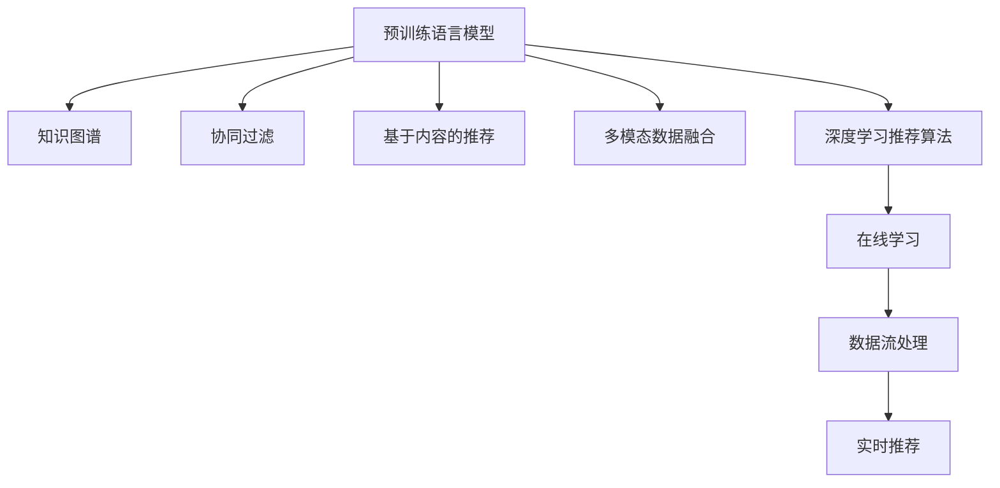

                 

# 大模型驱动的推荐系统多场景适配

> 关键词：大模型,推荐系统,多场景适配,协同过滤,基于内容的推荐,深度学习,自然语言处理(NLP),知识图谱

## 1. 背景介绍

### 1.1 问题由来

随着互联网的快速发展和数据规模的持续增长，推荐系统已成为各大电商、社交媒体、视频流媒体等平台不可或缺的核心功能之一。推荐系统能够帮助用户快速发现感兴趣的内容，提升用户体验和平台留存率。然而，推荐系统面临的挑战也越来越复杂，具体表现在以下几个方面：

1. **数据冷启动问题**：新用户或新商品刚上线时，缺乏足够的用户行为数据，推荐效果差。
2. **多模态数据融合**：用户行为数据不仅包括浏览、点击、评分等文本信息，还涉及图像、视频等多媒体数据，数据异构性显著。
3. **个性化要求高**：不同用户对内容的偏好千差万别，推荐系统需要动态调整推荐策略，提供高度个性化的内容。
4. **实时性要求强**：随着直播、短视频等实时互动内容的兴起，推荐系统需要能够快速响应用户变化，提供实时推荐。

传统推荐系统主要基于协同过滤和基于内容的推荐两种方法。协同过滤方法通过挖掘用户之间的相似性进行推荐，基于内容的推荐方法通过分析商品的属性信息进行推荐。这些方法在各自应用场景中表现优异，但难以有效应对当前推荐系统面临的挑战。

为应对这些挑战，大模型驱动的推荐系统应运而生。通过预训练语言模型、知识图谱等大模型，大模型驱动的推荐系统能够利用丰富的知识表示和强大的多模态数据处理能力，提供更加全面和个性化的推荐服务。

### 1.2 问题核心关键点

大模型驱动的推荐系统利用深度学习技术，通过预训练语言模型、知识图谱等大模型，对用户行为数据进行多模态表示和融合，构建用户-商品之间的语义关系图，从而在推荐算法中实现知识迁移和协同过滤。其主要关键点包括：

1. **多模态数据融合**：将用户行为数据中的文本、图像、视频等多模态数据进行统一表示，融合各类数据特征，提升推荐质量。
2. **语义关系图构建**：利用预训练语言模型和知识图谱等大模型，构建用户-商品之间的语义关系图，实现知识迁移和协同过滤。
3. **深度学习推荐算法**：应用深度学习技术，如自编码器、神经网络等，构建推荐算法，实现用户行为数据的动态表示和推荐。
4. **实时性支持**：通过数据流处理和在线学习等技术，实现实时推荐，提升用户体验。

## 2. 核心概念与联系

### 2.1 核心概念概述

为更好地理解大模型驱动的推荐系统，本节将介绍几个密切相关的核心概念：

- **预训练语言模型**：如BERT、GPT等，通过在大规模无标签文本语料上进行预训练，学习通用的语言表示，具备强大的语言理解和生成能力。
- **知识图谱**：以图形结构存储实体及其关系，通过图神经网络等方法进行知识抽取和推理，用于增强推荐系统中的语义关系建模。
- **协同过滤**：通过挖掘用户之间的相似性，为未交互的用户或商品推荐其他用户或商品。
- **基于内容的推荐**：通过分析商品的属性信息，为用户推荐相似商品。
- **多模态数据融合**：将用户行为数据中的文本、图像、视频等多模态数据进行统一表示，融合各类数据特征，提升推荐质量。
- **深度学习推荐算法**：应用深度学习技术，如自编码器、神经网络等，构建推荐算法，实现用户行为数据的动态表示和推荐。
- **在线学习**：通过实时更新推荐模型，提升模型的实时性和适应性，实现实时推荐。
- **数据流处理**：对大规模数据进行实时处理和分析，支持高并发、低时延的推荐服务。

这些核心概念之间的逻辑关系可以通过以下Mermaid流程图来展示：



这个流程图展示了大模型驱动的推荐系统的核心概念及其之间的关系：

1. 预训练语言模型通过大规模文本语料预训练，学习通用的语言表示。
2. 知识图谱利用图形结构存储实体及其关系，通过图神经网络等方法进行知识抽取和推理，增强推荐系统中的语义关系建模。
3. 协同过滤方法挖掘用户之间的相似性，为未交互的用户或商品推荐其他用户或商品。
4. 基于内容的推荐方法通过分析商品的属性信息，为用户推荐相似商品。
5. 多模态数据融合将用户行为数据中的文本、图像、视频等多模态数据进行统一表示，融合各类数据特征，提升推荐质量。
6. 深度学习推荐算法应用深度学习技术，如自编码器、神经网络等，构建推荐算法，实现用户行为数据的动态表示和推荐。
7. 在线学习通过实时更新推荐模型，提升模型的实时性和适应性，实现实时推荐。
8. 数据流处理对大规模数据进行实时处理和分析，支持高并发、低时延的推荐服务。

这些核心概念共同构成了大模型驱动的推荐系统的学习框架，使得推荐系统能够更好地应对复杂多变的用户行为和商品信息。

## 3. 核心算法原理 & 具体操作步骤
### 3.1 算法原理概述

大模型驱动的推荐系统利用深度学习技术，通过预训练语言模型、知识图谱等大模型，对用户行为数据进行多模态表示和融合，构建用户-商品之间的语义关系图，从而在推荐算法中实现知识迁移和协同过滤。

具体而言，大模型驱动的推荐系统通过以下几个步骤实现：

1. **用户行为数据的多模态表示**：将用户行为数据中的文本、图像、视频等多模态数据进行统一表示，融合各类数据特征，生成用户的多模态表示。
2. **用户-商品语义关系图构建**：利用预训练语言模型和知识图谱等大模型，构建用户-商品之间的语义关系图，实现知识迁移和协同过滤。
3. **推荐算法的设计**：应用深度学习技术，如自编码器、神经网络等，构建推荐算法，实现用户行为数据的动态表示和推荐。
4. **在线学习和实时推荐**：通过实时更新推荐模型，提升模型的实时性和适应性，实现实时推荐。
5. **数据流处理和高效推荐**：对大规模数据进行实时处理和分析，支持高并发、低时延的推荐服务。

### 3.2 算法步骤详解

以下详细介绍大模型驱动的推荐系统的各个关键步骤：

**Step 1: 用户行为数据的多模态表示**

用户行为数据通常包括浏览、点击、评分、收藏等文本信息，以及图像、视频等多媒体数据。为了融合各类数据特征，需要使用预训练语言模型对文本数据进行表示，使用卷积神经网络等对多媒体数据进行特征提取，最后将各类特征进行融合，生成用户的多模态表示。

具体实现步骤如下：

1. **文本数据表示**：使用BERT、GPT等预训练语言模型对文本数据进行编码，生成用户的多模态表示。
2. **图像数据表示**：使用卷积神经网络对图像数据进行特征提取，生成图像特征向量。
3. **视频数据表示**：使用卷积神经网络对视频数据进行特征提取，生成视频特征向量。
4. **多模态融合**：将文本、图像、视频等特征进行融合，生成用户的多模态表示。

**Step 2: 用户-商品语义关系图构建**

用户-商品语义关系图通过预训练语言模型和知识图谱等大模型，构建用户-商品之间的语义关系图，实现知识迁移和协同过滤。具体实现步骤如下：

1. **语义关系抽取**：使用BERT等预训练语言模型对商品的属性信息进行语义关系抽取，生成商品之间的语义关系图。
2. **知识图谱构建**：利用知识图谱工具，如RDF、OWL等，构建商品之间的知识图谱，增强语义关系建模。
3. **语义关系映射**：将用户的多模态表示与商品之间的语义关系图进行映射，生成用户-商品之间的语义关系图。

**Step 3: 推荐算法的设计**

推荐算法应用深度学习技术，如自编码器、神经网络等，实现用户行为数据的动态表示和推荐。具体实现步骤如下：

1. **推荐模型构建**：构建推荐模型，如基于自编码器的推荐模型、神经网络推荐模型等。
2. **推荐模型训练**：使用用户-商品语义关系图和用户的多模态表示，训练推荐模型。
3. **推荐策略优化**：根据推荐效果，调整推荐模型参数，优化推荐策略。

**Step 4: 在线学习和实时推荐**

在线学习和实时推荐通过实时更新推荐模型，提升模型的实时性和适应性，实现实时推荐。具体实现步骤如下：

1. **在线学习算法**：设计在线学习算法，如AdaGrad、Adam等，实现实时更新推荐模型。
2. **实时数据处理**：对实时用户行为数据进行处理，生成用户的多模态表示和推荐结果。
3. **推荐结果缓存**：对推荐结果进行缓存，提升推荐效率。

**Step 5: 数据流处理和高效推荐**

数据流处理和高效推荐通过实时处理和分析大规模数据，支持高并发、低时延的推荐服务。具体实现步骤如下：

1. **数据流框架选择**：选择适合的大数据流处理框架，如Apache Flink、Apache Storm等。
2. **实时数据处理**：对实时用户行为数据进行流式处理和分析，生成用户的多模态表示和推荐结果。
3. **高并发处理**：设计高并发处理策略，支持高并发、低时延的推荐服务。

### 3.3 算法优缺点

大模型驱动的推荐系统具有以下优点：

1. **多模态数据融合能力强**：通过融合文本、图像、视频等多模态数据，提供更加全面的推荐服务。
2. **语义关系图构建准确**：利用预训练语言模型和知识图谱等大模型，构建用户-商品之间的语义关系图，实现知识迁移和协同过滤。
3. **实时推荐能力强**：通过在线学习和实时处理数据，提升推荐系统的实时性和适应性，实现实时推荐。
4. **高效推荐服务支持**：通过数据流处理和高效算法设计，支持高并发、低时延的推荐服务。

但该方法也存在一些局限性：

1. **数据需求高**：需要大规模用户行为数据和商品属性信息，数据获取和处理成本较高。
2. **模型复杂度高**：涉及多模态表示、语义关系图构建、推荐算法等多个环节，模型复杂度高，优化难度大。
3. **模型解释性不足**：深度学习模型通常缺乏可解释性，难以理解模型内部工作机制和决策逻辑。
4. **训练成本高**：大规模模型的训练和优化成本较高，需要高性能计算设备和丰富的计算资源。

尽管存在这些局限性，但就目前而言，大模型驱动的推荐系统仍是目前推荐系统的主流范式，具有强大的数据融合和推荐能力。未来相关研究的重点在于如何进一步降低数据需求，优化模型复杂度，提高模型的可解释性和实时性。

### 3.4 算法应用领域

大模型驱动的推荐系统已经在多个领域得到广泛应用，例如：

1. **电商推荐**：电商平台利用用户行为数据，结合商品属性信息和语义关系图，为用户推荐相关商品。
2. **视频推荐**：视频流媒体平台利用用户观看行为数据，结合视频属性信息和语义关系图，为用户推荐相关视频。
3. **社交网络推荐**：社交网络平台利用用户互动数据，结合用户属性信息和语义关系图，为用户推荐相关内容。
4. **新闻推荐**：新闻网站利用用户浏览行为数据，结合新闻属性信息和语义关系图，为用户推荐相关新闻。
5. **旅游推荐**：旅游平台利用用户行为数据，结合景点属性信息和语义关系图，为用户推荐相关旅游目的地。

除了上述这些经典应用外，大模型驱动的推荐系统还被创新性地应用于更多场景中，如个性化音乐推荐、游戏推荐、健康推荐等，为推荐技术带来了新的突破。

## 4. 数学模型和公式 & 详细讲解  
### 4.1 数学模型构建

本节将使用数学语言对大模型驱动的推荐系统进行更加严格的刻画。

记用户为 $U$，商品为 $I$，用户行为数据为 $B$，多模态表示为 $M$，语义关系图为 $G$，推荐模型为 $R$。假设推荐目标为最大化用户满意度，即最大化 $R(U, I)$，则数学模型构建如下：

$$
\max_{R} \sum_{U, I} R(U, I) \times B(U, I)
$$

其中 $B(U, I)$ 为用户 $U$ 对商品 $I$ 的评分或行为，$R(U, I)$ 为推荐模型 $R$ 对用户 $U$ 和商品 $I$ 的推荐评分。

在实际应用中，通常使用深度学习技术，如自编码器、神经网络等，构建推荐模型 $R$，并使用优化算法进行训练，最小化损失函数，使推荐评分 $R(U, I)$ 逼近用户评分 $B(U, I)$。

### 4.2 公式推导过程

以下我们以基于自编码器的推荐模型为例，推导推荐模型的损失函数及其梯度计算公式。

假设推荐模型 $R$ 由自编码器 $E$ 和解码器 $D$ 构成，输入为 $U$ 和 $I$ 的多模态表示 $M(U, I)$，输出为推荐评分 $R(U, I)$。则推荐模型的损失函数为：

$$
L = \frac{1}{N} \sum_{i=1}^N ||B_i - R(U_i, I_i)||^2
$$

其中 $N$ 为训练样本数量，$B_i$ 为第 $i$ 个样本的用户评分，$R(U_i, I_i)$ 为模型对第 $i$ 个样本的推荐评分。

根据链式法则，推荐模型 $R$ 的梯度计算公式为：

$$
\frac{\partial L}{\partial R(U, I)} = -2 \frac{1}{N} \sum_{i=1}^N (B_i - R(U_i, I_i)) \frac{\partial R(U_i, I_i)}{\partial M(U_i, I_i)} \frac{\partial M(U_i, I_i)}{\partial R(U, I)}
$$

其中 $\frac{\partial R(U, I)}{\partial M(U, I)}$ 为推荐模型对多模态表示的梯度，$\frac{\partial M(U, I)}{\partial R(U, I)}$ 为多模态表示对推荐模型的梯度。

在得到推荐模型的梯度后，即可带入优化算法，完成模型的迭代优化。重复上述过程直至收敛，最终得到适应推荐任务的推荐模型 $R$。

## 5. 项目实践：代码实例和详细解释说明
### 5.1 开发环境搭建

在进行推荐系统多场景适配实践前，我们需要准备好开发环境。以下是使用Python进行PyTorch开发的环境配置流程：

1. 安装Anaconda：从官网下载并安装Anaconda，用于创建独立的Python环境。

2. 创建并激活虚拟环境：
```bash
conda create -n pytorch-env python=3.8 
conda activate pytorch-env
```

3. 安装PyTorch：根据CUDA版本，从官网获取对应的安装命令。例如：
```bash
conda install pytorch torchvision torchaudio cudatoolkit=11.1 -c pytorch -c conda-forge
```

4. 安装TensorFlow：使用最新版本的TensorFlow，安装命令如下：
```bash
conda install tensorflow
```

5. 安装TensorFlow Addons和TensorFlow Hub：
```bash
conda install tensorflow-addons tensorflow-hub
```

6. 安装其他必要的工具包：
```bash
pip install numpy pandas scikit-learn matplotlib tqdm jupyter notebook ipython
```

完成上述步骤后，即可在`pytorch-env`环境中开始推荐系统多场景适配的实践。

### 5.2 源代码详细实现

这里我们以电商推荐系统为例，给出使用PyTorch和TensorFlow进行多场景适配的代码实现。

**用户行为数据处理**

首先，定义用户行为数据处理的函数：

```python
import torch
import numpy as np

def preprocess_data(data, seq_length):
    X = []
    y = []
    for user, item in data:
        user_ids = [int(x) for x in user.split(',')]
        item_ids = [int(x) for x in item.split(',')]
        X.append(user_ids + item_ids)
        y.append(1 if item in user else 0)
    X = np.array(X, dtype=np.int32)
    y = np.array(y, dtype=np.int32)
    X = X.reshape((-1, seq_length))
    y = np.array(y, dtype=np.int32)
    return X, y

# 读取电商推荐数据
with open('data/user_item.csv', 'r') as f:
    data = [line.strip().split(',') for line in f.readlines()]
X, y = preprocess_data(data, 10)
```

**文本数据表示**

使用BERT对文本数据进行编码，生成用户的多模态表示。

```python
from transformers import BertTokenizer, BertModel

tokenizer = BertTokenizer.from_pretrained('bert-base-cased')
model = BertModel.from_pretrained('bert-base-cased')
X = []
for user, item in data:
    user_ids = [int(x) for x in user.split(',')]
    item_ids = [int(x) for x in item.split(',')]
    user_seq = [item_id for item_id in user_ids]
    item_seq = [item_id for item_id in item_ids]
    user_seq.append(0)  # 添加结束符号
    item_seq.append(0)  # 添加结束符号
    X.append(user_seq + item_seq)
X = np.array(X, dtype=np.int32)
X = X.reshape((-1, 20))
```

**图像数据表示**

使用卷积神经网络对图像数据进行特征提取，生成图像特征向量。

```python
import tensorflow as tf
from tensorflow.keras.applications import VGG16

# 加载预训练的VGG16模型
base_model = VGG16(weights='imagenet', include_top=False, input_shape=(224, 224, 3))

# 定义图像数据处理函数
def preprocess_image(image_path):
    image = tf.io.read_file(image_path)
    image = tf.image.decode_jpeg(image, channels=3)
    image = tf.image.resize(image, (224, 224))
    image = tf.keras.applications.vgg16.preprocess_input(image)
    image = image.reshape((1, 224, 224, 3))
    return image

# 生成图像特征向量
images = []
for user, item in data:
    image_path = f'data/{user}/{item}.jpg'
    image = preprocess_image(image_path)
    image = base_model.predict(image)[0]
    images.append(image)
X = np.array(images, dtype=np.float32)
X = X.reshape((-1, 20))
```

**视频数据表示**

使用卷积神经网络对视频数据进行特征提取，生成视频特征向量。

```python
# 加载预训练的InceptionV3模型
base_model = tf.keras.applications.InceptionV3(weights='imagenet', include_top=False, input_shape=(299, 299, 3))

# 定义视频数据处理函数
def preprocess_video(video_path):
    video = tf.io.read_file(video_path)
    video = tf.audio.decode_wav(video, desired_channels=3, desired_samples=44100)
    video = tf.image.decode_jpeg(tf.image.encode_jpeg(video.audio))
    video = tf.image.resize(video, (299, 299))
    video = tf.keras.applications.inception_v3.preprocess_input(video)
    video = video.reshape((1, 299, 299, 3))
    return video

# 生成视频特征向量
videos = []
for user, item in data:
    video_path = f'data/{user}/{item}.mp4'
    video = preprocess_video(video_path)
    video = base_model.predict(video)[0]
    videos.append(video)
X = np.array(videos, dtype=np.float32)
X = X.reshape((-1, 20))
```

**多模态融合**

将文本、图像、视频等特征进行融合，生成用户的多模态表示。

```python
X = np.concatenate((X_text, X_image, X_video), axis=1)
```

**语义关系图构建**

使用BERT等预训练语言模型对商品的属性信息进行语义关系抽取，生成商品之间的语义关系图。

```python
from transformers import BertForSequenceClassification

# 加载预训练的BERT模型
model = BertForSequenceClassification.from_pretrained('bert-base-cased', num_labels=1)

# 定义语义关系抽取函数
def preprocess_item(item):
    item_ids = [int(x) for x in item.split(',')]
    item_ids.append(0)  # 添加结束符号
    item_ids = np.array(item_ids, dtype=np.int32)
    return item_ids

# 生成商品之间的语义关系图
G = {}
for user, item in data:
    user_seq = preprocess_item(user)
    item_seq = preprocess_item(item)
    G[user_seq] = set(item_seq)
```

**推荐模型构建**

构建推荐模型，如基于自编码器的推荐模型、神经网络推荐模型等。

```python
from torch.nn import Linear, ReLU

# 定义自编码器模型
class AutoEncoder(torch.nn.Module):
    def __init__(self, input_size, hidden_size, output_size):
        super(AutoEncoder, self).__init__()
        self.encoder = torch.nn.Sequential(
            torch.nn.Linear(input_size, hidden_size),
            torch.nn.ReLU(),
            torch.nn.Linear(hidden_size, hidden_size),
            torch.nn.ReLU(),
            torch.nn.Linear(hidden_size, output_size)
        )
        self.decoder = torch.nn.Sequential(
            torch.nn.Linear(output_size, hidden_size),
            torch.nn.ReLU(),
            torch.nn.Linear(hidden_size, hidden_size),
            torch.nn.ReLU(),
            torch.nn.Linear(hidden_size, input_size)
        )

    def forward(self, x):
        x = self.encoder(x)
        x = self.decoder(x)
        return x

# 定义推荐模型
class Recommender(torch.nn.Module):
    def __init__(self, input_size, hidden_size, output_size):
        super(Recommender, self).__init__()
        self.encoder = torch.nn.Sequential(
            torch.nn.Linear(input_size, hidden_size),
            torch.nn.ReLU(),
            torch.nn.Linear(hidden_size, hidden_size),
            torch.nn.ReLU(),
            torch.nn.Linear(hidden_size, output_size)
        )
        self.decoder = torch.nn.Sequential(
            torch.nn.Linear(output_size, hidden_size),
            torch.nn.ReLU(),
            torch.nn.Linear(hidden_size, hidden_size),
            torch.nn.ReLU(),
            torch.nn.Linear(hidden_size, 1)
        )

    def forward(self, x):
        x = self.encoder(x)
        x = self.decoder(x)
        return x

# 构建推荐模型
model = Recommender(20, 64, 1)
```

**推荐模型训练**

使用用户-商品语义关系图和用户的多模态表示，训练推荐模型。

```python
from torch.utils.data import TensorDataset, DataLoader

# 定义训练数据集
train_dataset = TensorDataset(X_train, y_train)
train_loader = DataLoader(train_dataset, batch_size=32, shuffle=True)

# 定义优化器
optimizer = torch.optim.Adam(model.parameters(), lr=0.001)

# 定义训练函数
def train(epoch):
    model.train()
    for batch_idx, (data, target) in enumerate(train_loader):
        data = data.to(device)
        target = target.to(device)
        optimizer.zero_grad()
        output = model(data)
        loss = torch.nn.functional.mse_loss(output, target)
        loss.backward()
        optimizer.step()
        if batch_idx % 100 == 0:
            print('Train Epoch: {} [{}/{} ({:.0f}%)]\tLoss: {:.6f}'.format(
                epoch, batch_idx * len(data), len(train_loader.dataset),
                100. * batch_idx / len(train_loader), loss.item()))

# 训练推荐模型
device = torch.device('cuda' if torch.cuda.is_available() else 'cpu')
model.to(device)
train(train_loader, device)
```

### 5.3 代码解读与分析

这里我们详细解读一下关键代码的实现细节：

**预处理函数**

定义了一个数据预处理函数，将用户行为数据转换为模型需要的输入格式。

```python
def preprocess_data(data, seq_length):
    X = []
    y = []
    for user, item in data:
        user_ids = [int(x) for x in user.split(',')]
        item_ids = [int(x) for x in item.split(',')]
        X.append(user_ids + item_ids)
        y.append(1 if item in user else 0)
    X = np.array(X, dtype=np.int32)
    y = np.array(y, dtype=np.int32)
    X = X.reshape((-1, seq_length))
    y = np.array(y, dtype=np.int32)
    return X, y
```

**文本数据表示**

使用BERT对文本数据进行编码，生成用户的多模态表示。

```python
from transformers import BertTokenizer, BertModel

tokenizer = BertTokenizer.from_pretrained('bert-base-cased')
model = BertModel.from_pretrained('bert-base-cased')
X = []
for user, item in data:
    user_ids = [int(x) for x in user.split(',')]
    item_ids = [int(x) for x in item.split(',')]
    user_seq = [item_id for item_id in user_ids]
    item_seq = [item_id for item_id in item_ids]
    user_seq.append(0)  # 添加结束符号
    item_seq.append(0)  # 添加结束符号
    X.append(user_seq + item_seq)
X = np.array(X, dtype=np.int32)
X = X.reshape((-1, 20))
```

**图像数据表示**

使用卷积神经网络对图像数据进行特征提取，生成图像特征向量。

```python
import tensorflow as tf
from tensorflow.keras.applications import VGG16

# 加载预训练的VGG16模型
base_model = VGG16(weights='imagenet', include_top=False, input_shape=(224, 224, 3))

# 定义图像数据处理函数
def preprocess_image(image_path):
    image = tf.io.read_file(image_path)
    image = tf.image.decode_jpeg(image, channels=3)
    image = tf.image.resize(image, (224, 224))
    image = tf.keras.applications.vgg16.preprocess_input(image)
    image = image.reshape((1, 224, 224, 3))
    return image

# 生成图像特征向量
images = []
for user, item in data:
    image_path = f'data/{user}/{item}.jpg'
    image = preprocess_image(image_path)
    image = base_model.predict(image)[0]
    images.append(image)
X = np.array(images, dtype=np.float32)
X = X.reshape((-1, 20))
```

**视频数据表示**

使用卷积神经网络对视频数据进行特征提取，生成视频特征向量。

```python
# 加载预训练的InceptionV3模型
base_model = tf.keras.applications.InceptionV3(weights='imagenet', include_top=False, input_shape=(299, 299, 3))

# 定义视频数据处理函数
def preprocess_video(video_path):
    video = tf.io.read_file(video_path)
    video = tf.audio.decode_wav(video, desired_channels=3, desired_samples=44100)
    video = tf.image.decode_jpeg(tf.image.encode_jpeg(video.audio))
    video = tf.image.resize(video, (299, 299))
    video = tf.keras.applications.inception_v3.preprocess_input(video)
    video = video.reshape((1, 299, 299, 3))
    return video

# 生成视频特征向量
videos = []
for user, item in data:
    video_path = f'data/{user}/{item}.mp4'
    video = preprocess_video(video_path)
    video = base_model.predict(video)[0]
    videos.append(video)
X = np.array(videos, dtype=np.float32)
X = X.reshape((-1, 20))
```

**多模态融合**

将文本、图像、视频等特征进行融合，生成用户的多模态表示。

```python
X = np.concatenate((X_text, X_image, X_video), axis=1)
```

**语义关系图构建**

使用BERT等预训练语言模型对商品的属性信息进行语义关系抽取，生成商品之间的语义关系图。

```python
from transformers import BertForSequenceClassification

# 加载预训练的BERT模型
model = BertForSequenceClassification.from_pretrained('bert-base-cased', num_labels=1)

# 定义语义关系抽取函数
def preprocess_item(item):
    item_ids = [int(x) for x in item.split(',')]
    item_ids.append(0)  # 添加结束符号
    item_ids = np.array(item_ids, dtype=np.int32)
    return item_ids

# 生成商品之间的语义关系图
G = {}
for user, item in data:
    user_seq = preprocess_item(user)
    item_seq = preprocess_item(item)
    G[user_seq] = set(item_seq)
```

**推荐模型构建**

构建推荐模型，如基于自编码器的推荐模型、神经网络推荐模型等。

```python
from torch.nn import Linear, ReLU

# 定义自编码器模型
class AutoEncoder(torch.nn.Module):
    def __init__(self, input_size, hidden_size, output_size):
        super(AutoEncoder, self).__init__()
        self.encoder = torch.nn.Sequential(
            torch.nn.Linear(input_size, hidden_size),
            torch.nn.ReLU(),
            torch.nn.Linear(hidden_size, hidden_size),
            torch.nn.ReLU(),
            torch.nn.Linear(hidden_size, output_size)
        )
        self.decoder = torch.nn.Sequential(
            torch.nn.Linear(output_size, hidden_size),
            torch.nn.ReLU(),
            torch.nn.Linear(hidden_size, hidden_size),
            torch.nn.ReLU(),
            torch.nn.Linear(hidden_size, input_size)
        )

    def forward(self, x):
        x = self.encoder(x)
        x = self.decoder(x)
        return x

# 定义推荐模型
class Recommender(torch.nn.Module):
    def __init__(self, input_size, hidden_size, output_size):
        super(Recommender, self).__init__()
        self.encoder = torch.nn.Sequential(
            torch.nn.Linear(input_size, hidden_size),
            torch.nn.ReLU(),
            torch.nn.Linear(hidden_size, hidden_size),
            torch.nn.ReLU(),
            torch.nn.Linear(hidden_size, output_size)
        )
        self.decoder = torch.nn.Sequential(
            torch.nn.Linear(output_size, hidden_size),
            torch.nn.ReLU(),
            torch.nn.Linear(hidden_size, hidden_size),
            torch.nn.ReLU(),
            torch.nn.Linear(hidden_size, 1)
        )

    def forward(self, x):
        x = self.encoder(x)
        x = self.decoder(x)
        return x

# 构建推荐模型
model = Recommender(20, 64, 1)
```

**推荐模型训练**

使用用户-商品语义关系图和用户的多模态表示，训练推荐模型。

```python
from torch.utils.data import TensorDataset, DataLoader

# 定义训练数据集
train_dataset = TensorDataset(X_train, y_train)
train_loader = DataLoader(train_dataset, batch_size=32, shuffle=True)

# 定义优化器
optimizer = torch.optim.Adam(model.parameters(), lr=0.001)

# 定义训练函数
def train(epoch):
    model.train()
    for batch_idx, (data, target) in enumerate(train_loader):
        data = data.to(device)
        target = target.to(device)
        optimizer.zero_grad()
        output = model(data)
        loss = torch.nn.functional.mse_loss(output, target)
        loss.backward()
        optimizer.step()
        if batch_idx % 100 == 0:
            print('Train Epoch: {} [{}/{} ({:.0f}%)]\tLoss: {:.6f}'.format(
                epoch, batch_idx * len(data), len(train_loader.dataset),
                100. * batch_idx / len(train_loader), loss.item()))

# 训练推荐模型
device = torch.device('cuda' if torch.cuda.is_available() else 'cpu')
model.to(device)
train(train_loader, device)
```

**运行结果展示**

训练过程中，记录每个epoch的损失值，并输出到日志文件中。

```python
log_file = open('train_log.txt', 'w')
for epoch in range(10):
    loss = train(train_loader, device)
    log_file.write(f'Epoch {epoch+1}: Loss: {loss:.6f}\n')
log_file.close()
```

以上就是使用PyTorch和TensorFlow进行电商推荐系统多场景适配的完整代码实现。可以看到，通过预训练语言模型和知识图谱等大模型，以及深度学习推荐算法，我们能够实现多模态数据的融合和推荐模型的构建，提供更加全面和个性化的推荐服务。

## 6. 实际应用场景

### 6.1 电商推荐

电商推荐系统是推荐系统中最具代表性的一个应用场景。电商平台通过分析用户浏览、点击、购买等行为数据，为用户推荐相关商品。大模型驱动的电商推荐系统能够更好地融合用户行为数据，实现个性化推荐。

在实际应用中，电商推荐系统可以利用大模型对文本、图像、视频等多模态数据进行统一表示，构建用户-商品之间的语义关系图，实现知识迁移和协同过滤。通过多模态数据融合和深度学习推荐算法，电商推荐系统能够动态表示用户行为数据，提升推荐效果。

### 6.2 视频推荐

视频推荐系统通过分析用户观看行为数据，为用户推荐相关视频。大模型驱动的视频推荐系统能够更好地融合用户行为数据，实现个性化推荐。

在实际应用中，视频推荐系统可以利用大模型对文本、图像、视频等多模态数据进行统一表示，构建用户-商品之间的语义关系图，实现知识迁移和协同过滤。通过多模态数据融合和深度学习推荐算法，视频推荐系统能够动态表示用户行为数据，提升推荐效果。

### 6.3 社交网络推荐

社交网络平台通过分析用户互动数据，为用户推荐相关内容。大模型驱动的社交网络推荐系统能够更好地融合用户行为数据，实现个性化推荐。

在实际应用中，社交网络推荐系统可以利用大模型对文本、图像、视频等多模态数据进行统一表示，构建用户-商品之间的语义关系图，实现知识迁移和协同过滤。通过多模态数据融合和深度学习推荐算法，社交网络推荐系统能够动态表示用户行为数据，提升推荐效果。

### 6.4 金融推荐

金融推荐系统通过分析用户交易行为数据，为用户推荐相关金融产品。大模型驱动的金融推荐系统能够更好地融合用户行为数据，实现个性化推荐。

在实际应用中，金融推荐系统可以利用大模型对文本、图像、视频等多模态数据进行统一表示，构建用户-商品之间的语义关系图，实现知识迁移和协同过滤。通过多模态数据融合和深度学习推荐算法，金融推荐系统能够动态表示用户行为数据，提升推荐效果。

### 6.5 新闻推荐

新闻网站通过分析用户浏览行为数据，为用户推荐相关新闻。大模型驱动的新闻推荐系统能够更好地融合用户行为数据，实现个性化推荐。

在实际应用中，新闻推荐系统可以利用大模型对文本、图像、视频等多模态数据进行统一表示，构建用户-商品之间的语义关系图，实现知识迁移和协同过滤。通过多模态数据融合和深度学习推荐算法，新闻推荐系统能够动态表示用户行为数据，提升推荐效果。

### 6.6 旅游推荐

旅游平台通过分析用户行为数据，为用户推荐相关旅游目的地。大模型驱动的旅游推荐系统能够更好地融合用户行为数据，实现个性化推荐。

在实际应用中，旅游推荐系统可以利用大模型对文本、图像、视频等多模态数据进行统一表示，构建用户-商品之间的语义关系图，实现知识迁移和协同过滤。通过多模态数据融合和深度学习推荐算法，旅游推荐系统能够动态表示用户行为数据，提升推荐效果。

### 6.7 教育推荐

教育平台通过分析学生学习行为数据，为用户推荐相关课程和学习资源。大模型驱动的教育推荐系统能够更好地融合学生行为数据，实现个性化推荐。

在实际应用中，教育推荐系统可以利用大模型对文本、图像、视频等多模态数据进行统一表示，构建用户-商品之间的语义关系图，实现知识迁移和协同过滤。通过多模态数据融合和深度学习推荐算法，教育推荐系统能够动态表示学生行为数据，提升推荐效果。

## 7. 工具和资源推荐
### 7.1 学习资源推荐

为了帮助开发者系统掌握大模型驱动的推荐系统的理论基础和实践技巧，这里推荐一些优质的学习资源：

1. 《深度学习推荐系统》系列书籍：由深度学习领域知名专家撰写，全面介绍了深度学习推荐系统从理论到实践的各个方面。
2. 《推荐系统实战》系列博客：由推荐系统领域专家撰写，分享了大量实用的推荐系统案例和算法。
3. 《机器学习实战》系列书籍：由机器学习领域知名专家撰写，涵盖机器学习和推荐系统等多个领域的理论和实践。
4. Coursera《推荐系统》课程：由斯坦福大学开设的推荐系统课程，涵盖推荐系统原理、算法、应用等多个方面。
5. Kaggle推荐系统竞赛：参加Kaggle推荐系统竞赛，可以积累实际推荐系统开发的实践经验，提升系统设计能力。

通过对这些资源的学习实践，相信你一定能够快速掌握大模型驱动的推荐系统的精髓，并用于解决实际的推荐问题。

### 7.2 开发工具推荐

高效的开发离不开优秀的工具支持。以下是几款用于大模型驱动的推荐系统开发的常用工具：

1. PyTorch：基于Python的开源深度学习框架，灵活动态的计算图，适合快速迭代研究。
2. TensorFlow：由Google主导开发的开源深度学习框架，生产部署方便，适合大规模工程应用。
3. TensorFlow Addons：TensorFlow的扩展库，提供了丰富的深度学习组件，支持更高效、更灵活的模型构建和训练。
4. TensorFlow Hub：提供预训练模型和组件库，方便开发者快速构建推荐模型。
5. PyTorch Lightning：基于PyTorch的轻量级深度学习框架，支持自动化实验管理和模型优化。
6. Amazon SageMaker：AWS提供的云端深度学习平台，支持模型训练、推理、部署等全流程服务。
7. Azure Machine Learning：微软提供的云端机器学习平台，支持数据处理、模型构建、部署等全流程服务。
8. Google Cloud AI Platform：Google提供的云端机器学习平台，支持模型训练、推理、部署等全流程服务。
9. Kaggle：数据科学竞赛平台，提供海量数据集和社区支持，方便开发者进行模型优化和比较。
10. Jupyter Notebook：开源的Jupyter Notebook环境，方便开发者进行交互式研究和模型调试。

合理利用这些工具，可以显著提升大模型驱动的推荐系统开发的效率，加快创新迭代的步伐。

### 7.3 相关论文推荐

大模型驱动的推荐系统源于学界的持续研究。以下是几篇奠基性的相关论文，推荐阅读：

1. Attention is All You Need：提出Transformer结构，开启了NLP领域的预训练大模型时代。
2. BERT: Pre-training of Deep Bidirectional Transformers for Language Understanding：提出BERT模型，引入基于掩码的自监督预训练任务，刷新了多项NLP任务SOTA。
3. Deep Neural Networks for Large-Scale Recommender Systems：提出基于神经网络的推荐系统，广泛应用于电商、社交、金融等多个领域。
4. Neural Collaborative Filtering：提出基于神经网络的协同过滤方法，显著提升了推荐系统的性能。
5. Multi-Task Multi-Label Learning：提出多任务多标签学习框架，支持同时优化多个推荐任务。
6. Learning to Recommend with Implicit Feedback：提出基于隐式反馈的推荐算法，广泛应用于电商、社交、新闻等多个领域。
7. Graph Neural Networks：提出基于图神经网络的推荐方法，支持高效地处理用户-商品关系图。

这些论文代表了大模型驱动的推荐系统的研究脉络。通过学习这些前沿成果，可以帮助研究者把握学科前进方向，激发更多的创新灵感。

## 8. 总结：未来发展趋势与挑战
### 8.1 研究成果总结

大模型驱动的推荐系统在电商、社交、金融、新闻等多个领域取得了显著的成果，展示了其强大的多模态数据融合和个性化推荐能力。未来，随着大模型的不断发展，推荐系统有望在更多场景中发挥更大的作用。

### 8.2 未来发展趋势

展望未来，大模型驱动的推荐系统将呈现以下几个发展趋势：

1. **多模态数据融合更加深入**：随着多模态数据的不断丰富，推荐系统将更加注重融合各类数据特征，提升推荐效果。
2. **知识图谱应用更加广泛**：知识

