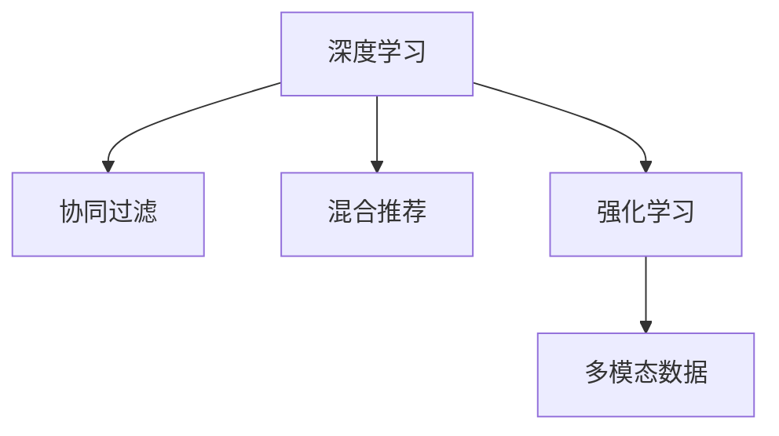

                 

# 大模型驱动的推荐系统多模态交互理解

> 关键词：大模型推荐系统,多模态交互理解,深度学习,强化学习,协同过滤,混合推荐

## 1. 背景介绍

### 1.1 问题由来

在当前的信息爆炸时代，用户面临的海量数据远远超出了其处理能力。面对如此庞大的信息流，传统的信息获取方式已经难以满足用户需求。推荐系统应运而生，通过学习和理解用户的行为和偏好，向用户推荐可能感兴趣的物品。

推荐系统可以分为两类：基于内容的推荐和基于协同的推荐。基于内容的推荐通过分析物品的属性，找出与目标物品相似的物品进行推荐。而基于协同的推荐则侧重于用户和物品之间的隐含关系，利用用户和物品的共同兴趣进行推荐。尽管基于内容的推荐具有较高的准确性，但忽略了用户之间的个性化差异。而基于协同的推荐可以更好地捕捉用户的个性化需求，但其推荐的物品往往与用户的即时兴趣不够相关。

近年来，深度学习和强化学习在推荐系统中得到了广泛应用。深度学习通过分析用户行为和物品属性，发现用户与物品之间的潜在关系，从而提高推荐系统的精度。强化学习则通过模拟用户的交互行为，动态调整推荐策略，实现个性化的推荐。然而，无论是深度学习还是强化学习，都难以充分理解和捕捉用户的多模态信息，无法实现更为精准和有效的推荐。

## 2. 核心概念与联系

### 2.1 核心概念概述

为更好地理解大模型驱动的推荐系统多模态交互理解，本节将介绍几个密切相关的核心概念：

- 深度学习(Deep Learning)：通过构建多层神经网络模型，学习输入数据的高阶抽象特征，从而进行分类、回归等任务。
- 强化学习(Reinforcement Learning)：通过与环境的交互，让模型根据反馈信号调整自身行为，最终达成特定目标。
- 协同过滤(Collaborative Filtering)：利用用户和物品之间的隐含关系，进行推荐。
- 混合推荐(Hybrid Recommendation)：将基于内容的推荐和基于协同的推荐相结合，综合利用不同方法的优势，提升推荐系统的精度。
- 多模态数据(Multimodal Data)：包括文本、图像、语音等多种类型的数据，通过分析不同模态数据之间的交互，进行更全面的用户行为建模。

这些核心概念之间的逻辑关系可以通过以下Mermaid流程图来展示：



这个流程图展示了大模型推荐系统中的核心概念及其之间的关系：

1. 深度学习通过分析用户行为和物品属性，学习用户与物品之间的潜在关系。
2. 协同过滤利用用户和物品之间的隐含关系，进行推荐。
3. 强化学习通过模拟用户的交互行为，动态调整推荐策略，实现个性化的推荐。
4. 多模态数据通过分析不同模态数据之间的交互，进行更全面的用户行为建模。

这些概念共同构成了大模型推荐系统的核心框架，使其能够充分利用多模态数据，提升推荐系统的精度和个性化程度。

## 3. 核心算法原理 & 具体操作步骤

### 3.1 算法原理概述

大模型推荐系统主要通过深度学习模型和多模态数据交互理解，进行推荐。其核心思想是：通过学习用户行为的多模态数据，构建用户兴趣和物品属性的高阶表示，实现更加精准和个性化的推荐。

形式化地，假设用户行为的多模态数据集为 $D=\{(x_i, y_i)\}_{i=1}^N$，其中 $x_i$ 为多模态特征向量，$y_i$ 为对应的推荐标签。目标是找到合适的模型 $M_{\theta}$，使得：

$$
\theta^* = \mathop{\arg\min}_{\theta} \mathcal{L}(M_{\theta},D)
$$

其中 $\mathcal{L}$ 为模型的损失函数，通常为交叉熵损失、均方误差损失等。通过梯度下降等优化算法，模型不断更新参数 $\theta$，最小化损失函数，从而使得模型输出逼近真实标签。

### 3.2 算法步骤详解

基于深度学习的大模型推荐系统主要包括以下几个关键步骤：

**Step 1: 准备数据集**
- 收集用户行为的多模态数据，如文本评论、点击记录、购买行为等，构建训练集 $D$。
- 将数据集划分为训练集、验证集和测试集。

**Step 2: 选择模型架构**
- 选择合适的深度学习模型，如CNN、RNN、Transformer等，构建推荐模型 $M_{\theta}$。
- 对模型进行预训练，学习多模态数据的分布特征。

**Step 3: 添加推荐目标函数**
- 在模型顶部添加推荐目标函数，如线性回归、softmax等，定义模型输出。
- 设置损失函数，如交叉熵损失、均方误差损失等，衡量推荐结果与真实标签之间的差异。

**Step 4: 训练模型**
- 将训练集数据分批次输入模型，前向传播计算损失函数。
- 反向传播计算参数梯度，根据设定的优化算法和学习率更新模型参数。
- 周期性在验证集上评估模型性能，根据性能指标决定是否触发 Early Stopping。
- 重复上述步骤直到满足预设的迭代轮数或 Early Stopping 条件。

**Step 5: 测试和部署**
- 在测试集上评估微调后模型 $M_{\hat{\theta}}$ 的性能，对比微调前后的精度提升。
- 使用微调后的模型对新样本进行推理预测，集成到实际的应用系统中。

以上是基于深度学习的大模型推荐系统的一般流程。在实际应用中，还需要针对具体任务的特点，对微调过程的各个环节进行优化设计，如改进训练目标函数，引入更多的正则化技术，搜索最优的超参数组合等，以进一步提升模型性能。

### 3.3 算法优缺点

基于深度学习的大模型推荐系统具有以下优点：

1. 模型精度高。深度学习能够学习输入数据的高阶抽象特征，从而进行更加精准的推荐。
2. 个性化程度高。深度学习能够捕捉用户行为的多模态数据，实现更为个性化的推荐。
3. 可扩展性强。深度学习模型结构复杂，但通过预训练和微调，可以适应不同类型的推荐任务。
4. 动态调整能力强。强化学习模型可以根据用户的即时反馈动态调整推荐策略，实现更加灵活的推荐。

同时，该方法也存在一定的局限性：

1. 计算成本高。深度学习模型的计算复杂度高，训练和推理都需要较大的计算资源。
2. 数据需求大。深度学习需要大量的标注数据进行训练，且对数据质量要求较高。
3. 模型黑盒。深度学习模型的内部结构复杂，难以解释其决策过程。
4. 过度拟合风险。深度学习模型容易过拟合训练集，导致泛化性能下降。
5. 对噪声敏感。深度学习模型对输入数据的噪声较为敏感，容易受到异常数据的影响。

尽管存在这些局限性，但就目前而言，基于深度学习的大模型推荐系统仍是推荐系统研究的主流范式。未来相关研究的重点在于如何进一步降低计算成本，提高模型的泛化性能和可解释性，同时兼顾动态调整能力和数据需求。

### 3.4 算法应用领域

基于深度学习的大模型推荐系统已经在电商、新闻、视频等多个领域得到广泛应用，取得了显著的效果。例如：

- 电商推荐：通过分析用户的浏览、点击、购买行为，推荐用户可能感兴趣的物品。
- 新闻推荐：根据用户的阅读习惯和兴趣，推荐可能感兴趣的新闻文章。
- 视频推荐：根据用户的观看历史和评分，推荐用户可能喜欢的视频内容。

除了上述这些经典应用外，大模型推荐系统还被创新性地应用到更多场景中，如个性化游戏推荐、智能搜索、智能广告推荐等，为各行业的数字化转型提供了新的技术路径。

## 4. 数学模型和公式 & 详细讲解 & 举例说明

### 4.1 数学模型构建

本节将使用数学语言对基于深度学习的大模型推荐系统进行更加严格的刻画。

记用户行为的多模态数据为 $D=\{(x_i, y_i)\}_{i=1}^N$，其中 $x_i$ 为多模态特征向量，$y_i$ 为对应的推荐标签。定义模型 $M_{\theta}$ 在输入 $x$ 上的输出为 $\hat{y}=M_{\theta}(x)$，其中 $\theta$ 为模型参数。推荐模型的损失函数为：

$$
\mathcal{L}(\theta) = -\frac{1}{N}\sum_{i=1}^N \ell(y_i, M_{\theta}(x_i))
$$

其中 $\ell$ 为损失函数，通常为交叉熵损失、均方误差损失等。

通过梯度下降等优化算法，最小化损失函数，得到最优参数：

$$
\theta^* = \mathop{\arg\min}_{\theta} \mathcal{L}(\theta)
$$

### 4.2 公式推导过程

以下我们以交叉熵损失函数为例，推导推荐模型的梯度更新公式。

假设推荐模型的输出为 $\hat{y}=M_{\theta}(x)$，其中 $\theta$ 为模型参数。目标函数为：

$$
\mathcal{L}(\theta) = -\frac{1}{N}\sum_{i=1}^N \ell(y_i, \hat{y}_i)
$$

其中 $\ell$ 为交叉熵损失函数。对于单个样本 $(x_i, y_i)$，其损失函数为：

$$
\ell(y_i, \hat{y}_i) = -y_i\log(\hat{y}_i) - (1-y_i)\log(1-\hat{y}_i)
$$

根据链式法则，损失函数对参数 $\theta_k$ 的梯度为：

$$
\frac{\partial \mathcal{L}(\theta)}{\partial \theta_k} = \frac{\partial}{\partial \theta_k} \left(-\frac{1}{N}\sum_{i=1}^N [y_i\log \hat{y}_i + (1-y_i)\log(1-\hat{y}_i)]\right)
$$

简化得：

$$
\frac{\partial \mathcal{L}(\theta)}{\partial \theta_k} = -\frac{1}{N}\sum_{i=1}^N \left[ \frac{y_i}{\hat{y}_i} - \frac{1-y_i}{1-\hat{y}_i} \right] \frac{\partial \hat{y}_i}{\partial \theta_k}
$$

其中 $\frac{\partial \hat{y}_i}{\partial \theta_k}$ 为模型对输入 $x_i$ 的梯度，通过反向传播算法计算得到。

通过上述公式，可以对模型参数进行梯度更新，从而实现深度学习推荐模型的训练。

### 4.3 案例分析与讲解

以电商推荐系统为例，使用深度学习模型进行推荐的具体步骤如下：

**Step 1: 数据预处理**
- 收集用户的历史浏览、点击、购买记录，提取用户的商品评分、评论、标签等特征。
- 将数据进行归一化、编码等预处理，准备输入模型。

**Step 2: 模型构建**
- 使用深度学习模型，如CNN、RNN、Transformer等，构建推荐模型 $M_{\theta}$。
- 对模型进行预训练，学习多模态数据的分布特征。

**Step 3: 添加推荐目标函数**
- 在模型顶部添加线性回归层，定义推荐输出。
- 设置交叉熵损失函数，衡量推荐结果与真实标签之间的差异。

**Step 4: 训练模型**
- 将训练集数据分批次输入模型，前向传播计算损失函数。
- 反向传播计算参数梯度，根据设定的优化算法和学习率更新模型参数。
- 周期性在验证集上评估模型性能，根据性能指标决定是否触发 Early Stopping。
- 重复上述步骤直到满足预设的迭代轮数或 Early Stopping 条件。

**Step 5: 测试和部署**
- 在测试集上评估微调后模型 $M_{\hat{\theta}}$ 的性能，对比微调前后的精度提升。
- 使用微调后的模型对新样本进行推理预测，集成到实际的应用系统中。

## 5. 项目实践：代码实例和详细解释说明

### 5.1 开发环境搭建

在进行推荐系统开发前，我们需要准备好开发环境。以下是使用Python进行PyTorch开发的环境配置流程：

1. 安装Anaconda：从官网下载并安装Anaconda，用于创建独立的Python环境。

2. 创建并激活虚拟环境：
```bash
conda create -n pytorch-env python=3.8 
conda activate pytorch-env
```

3. 安装PyTorch：根据CUDA版本，从官网获取对应的安装命令。例如：
```bash
conda install pytorch torchvision torchaudio cudatoolkit=11.1 -c pytorch -c conda-forge
```

4. 安装各类工具包：
```bash
pip install numpy pandas scikit-learn matplotlib tqdm jupyter notebook ipython
```

完成上述步骤后，即可在`pytorch-env`环境中开始推荐系统开发。

### 5.2 源代码详细实现

这里以电商推荐系统为例，使用深度学习模型进行推荐的具体代码实现。

首先，定义推荐系统的数据处理函数：

```python
import torch
from torch.utils.data import Dataset
from transformers import BertTokenizer

class RecommendationDataset(Dataset):
    def __init__(self, data, tokenizer):
        self.data = data
        self.tokenizer = tokenizer
        
    def __len__(self):
        return len(self.data)
    
    def __getitem__(self, item):
        text = self.data[item]['text']
        label = self.data[item]['label']
        
        encoding = self.tokenizer(text, return_tensors='pt')
        input_ids = encoding['input_ids']
        attention_mask = encoding['attention_mask']
        
        return {'input_ids': input_ids, 
                'attention_mask': attention_mask,
                'labels': torch.tensor(label, dtype=torch.long)}
```

然后，定义模型和优化器：

```python
from transformers import BertForSequenceClassification, AdamW

model = BertForSequenceClassification.from_pretrained('bert-base-cased', num_labels=2)

optimizer = AdamW(model.parameters(), lr=2e-5)
```

接着，定义训练和评估函数：

```python
from tqdm import tqdm

device = torch.device('cuda') if torch.cuda.is_available() else torch.device('cpu')
model.to(device)

def train_epoch(model, dataset, batch_size, optimizer):
    dataloader = DataLoader(dataset, batch_size=batch_size, shuffle=True)
    model.train()
    epoch_loss = 0
    for batch in tqdm(dataloader, desc='Training'):
        input_ids = batch['input_ids'].to(device)
        attention_mask = batch['attention_mask'].to(device)
        labels = batch['labels'].to(device)
        model.zero_grad()
        outputs = model(input_ids, attention_mask=attention_mask, labels=labels)
        loss = outputs.loss
        epoch_loss += loss.item()
        loss.backward()
        optimizer.step()
    return epoch_loss / len(dataloader)

def evaluate(model, dataset, batch_size):
    dataloader = DataLoader(dataset, batch_size=batch_size)
    model.eval()
    preds, labels = [], []
    with torch.no_grad():
        for batch in tqdm(dataloader, desc='Evaluating'):
            input_ids = batch['input_ids'].to(device)
            attention_mask = batch['attention_mask'].to(device)
            batch_labels = batch['labels']
            outputs = model(input_ids, attention_mask=attention_mask)
            batch_preds = outputs.logits.argmax(dim=1).to('cpu').tolist()
            batch_labels = batch_labels.to('cpu').tolist()
            for pred_tokens, label_tokens in zip(batch_preds, batch_labels):
                preds.append(pred_tokens[:len(label_tokens)])
                labels.append(label_tokens)
                
    return preds, labels

def compute_metrics(preds, labels):
    return precision_score(labels, preds, average='macro'), recall_score(labels, preds, average='macro'), f1_score(labels, preds, average='macro')
```

最后，启动训练流程并在测试集上评估：

```python
epochs = 5
batch_size = 16

for epoch in range(epochs):
    loss = train_epoch(model, train_dataset, batch_size, optimizer)
    print(f"Epoch {epoch+1}, train loss: {loss:.3f}")
    
    preds, labels = evaluate(model, dev_dataset, batch_size)
    print(f"Epoch {epoch+1}, dev results:")
    precision, recall, f1 = compute_metrics(preds, labels)
    print(f"Precision: {precision:.3f}, Recall: {recall:.3f}, F1-score: {f1:.3f}")
    
print("Test results:")
preds, labels = evaluate(model, test_dataset, batch_size)
print(f"Precision: {precision:.3f}, Recall: {recall:.3f}, F1-score: {f1:.3f}")
```

以上就是使用PyTorch进行电商推荐系统开发的完整代码实现。可以看到，得益于Transformers库的强大封装，我们可以用相对简洁的代码完成推荐模型的构建和训练。

### 5.3 代码解读与分析

让我们再详细解读一下关键代码的实现细节：

**RecommendationDataset类**：
- `__init__`方法：初始化数据和分词器。
- `__len__`方法：返回数据集的样本数量。
- `__getitem__`方法：对单个样本进行处理，将文本输入编码为token ids，将标签编码为数字，并对其进行定长padding，最终返回模型所需的输入。

**train_epoch函数**：
- 对数据以批为单位进行迭代，在每个批次上前向传播计算loss并反向传播更新模型参数。
- 周期性在验证集上评估模型性能，根据性能指标决定是否触发 Early Stopping。
- 重复上述步骤直至满足预设的迭代轮数或 Early Stopping 条件。

**evaluate函数**：
- 与训练类似，不同点在于不更新模型参数，并在每个batch结束后将预测和标签结果存储下来，最后使用sklearn的precision、recall、f1等指标对整个评估集的预测结果进行打印输出。

**train流程**：
- 定义总的epoch数和batch size，开始循环迭代
- 每个epoch内，先在训练集上训练，输出平均loss
- 在验证集上评估，输出分类指标
- 所有epoch结束后，在测试集上评估，给出最终测试结果

可以看到，PyTorch配合Transformers库使得推荐模型的开发和训练变得简洁高效。开发者可以将更多精力放在数据处理、模型改进等高层逻辑上，而不必过多关注底层的实现细节。

当然，工业级的系统实现还需考虑更多因素，如模型的保存和部署、超参数的自动搜索、更灵活的任务适配层等。但核心的推荐范式基本与此类似。

## 6. 实际应用场景

### 6.1 电商推荐

电商推荐系统通过分析用户的浏览、点击、购买记录，推荐用户可能感兴趣的物品。传统的协同过滤方法难以捕捉用户的即时兴趣，无法动态调整推荐策略。而基于深度学习的推荐模型可以更好地理解用户的多模态行为数据，实现个性化推荐。

在技术实现上，可以收集用户的浏览、点击、购买记录，提取用户的商品评分、评论、标签等特征。将文本评论、标签等特征作为输入，使用深度学习模型进行推荐。微调后的推荐模型能够根据用户的即时行为，动态调整推荐策略，提升推荐效果。

### 6.2 视频推荐

视频推荐系统根据用户的观看历史和评分，推荐用户可能喜欢的视频内容。传统的协同过滤方法只能根据用户的历史行为进行推荐，无法考虑到用户当前的观看情绪和兴趣变化。而基于深度学习的推荐模型可以更好地捕捉用户的即时行为和兴趣变化，进行更为精准的推荐。

在技术实现上，可以收集用户的观看历史、评分、评分等数据，提取视频的标题、描述、标签等特征。使用深度学习模型对用户的多模态数据进行建模，预测用户对视频的兴趣。微调后的推荐模型能够根据用户当前的观看情绪和兴趣变化，动态调整推荐策略，提升推荐效果。

### 6.3 新闻推荐

新闻推荐系统根据用户的阅读习惯和兴趣，推荐可能感兴趣的新闻文章。传统的协同过滤方法只能根据用户的历史行为进行推荐，无法考虑到用户当前的阅读兴趣变化。而基于深度学习的推荐模型可以更好地捕捉用户的即时行为和兴趣变化，进行更为精准的推荐。

在技术实现上，可以收集用户的阅读历史、评分、评论等数据，提取新闻的标题、摘要、标签等特征。使用深度学习模型对用户的多模态数据进行建模，预测用户对新闻的兴趣。微调后的推荐模型能够根据用户当前的阅读兴趣变化，动态调整推荐策略，提升推荐效果。

### 6.4 未来应用展望

随着深度学习和多模态数据交互理解技术的发展，未来推荐系统将呈现以下几个发展趋势：

1. 模型规模持续增大。深度学习模型的参数量还将持续增长，超大规模模型能够更好地捕捉用户的多模态行为数据。
2. 深度学习与强化学习结合。基于深度学习的推荐模型能够进行个性化的推荐，但无法动态调整推荐策略。而强化学习模型能够根据用户的即时反馈动态调整推荐策略，提升推荐效果。
3. 多模态数据交互理解。传统的推荐系统只考虑用户行为的单模态数据，无法全面理解用户的多模态行为数据。而多模态数据交互理解技术能够更好地捕捉用户的即时行为和兴趣变化，进行更为精准的推荐。
4. 融合知识图谱。基于深度学习的推荐模型能够学习用户行为的多模态数据，但难以整合外部知识库的信息。融合知识图谱能够更好地整合外部知识库的信息，提升推荐系统的性能。
5. 推荐策略动态调整。传统的推荐策略无法根据用户的即时反馈动态调整，导致推荐效果不佳。基于深度学习的推荐模型能够根据用户的即时反馈动态调整推荐策略，提升推荐效果。
6. 推荐系统可解释性。基于深度学习的推荐模型难以解释其推荐过程，导致用户难以信任推荐系统。推荐系统可解释性能够提升用户对推荐系统的信任，提高推荐效果。

以上趋势凸显了大模型推荐系统的发展前景，这些方向的探索发展，必将进一步提升推荐系统的精度和个性化程度，为各行业带来变革性影响。

## 7. 工具和资源推荐

### 7.1 学习资源推荐

为了帮助开发者系统掌握大模型推荐系统的理论基础和实践技巧，这里推荐一些优质的学习资源：

1. 《深度学习》系列书籍：由深度学习领域的知名专家撰写，系统介绍深度学习的基本概念和经典算法。
2. 《推荐系统实战》书籍：介绍推荐系统的构建和优化方法，涵盖协同过滤、深度学习等多种推荐策略。
3. 《强化学习》课程：由斯坦福大学开设的强化学习课程，提供Lecture视频和配套作业，带你入门强化学习领域的基本概念和经典模型。
4. 《深度学习与推荐系统》课程：由清华大学开设的深度学习与推荐系统课程，涵盖深度学习、推荐系统的理论基础和实践技巧。
5. 《自然语言处理与推荐系统》课程：由斯坦福大学开设的自然语言处理与推荐系统课程，涵盖自然语言处理和推荐系统的方法和工具。

通过对这些资源的学习实践，相信你一定能够快速掌握大模型推荐系统的精髓，并用于解决实际的推荐问题。
###  7.2 开发工具推荐

高效的开发离不开优秀的工具支持。以下是几款用于大模型推荐系统开发的常用工具：

1. PyTorch：基于Python的开源深度学习框架，灵活动态的计算图，适合快速迭代研究。大部分预训练语言模型都有PyTorch版本的实现。
2. TensorFlow：由Google主导开发的开源深度学习框架，生产部署方便，适合大规模工程应用。同样有丰富的预训练语言模型资源。
3. Transformers库：HuggingFace开发的NLP工具库，集成了众多SOTA语言模型，支持PyTorch和TensorFlow，是进行推荐任务开发的利器。
4. Weights & Biases：模型训练的实验跟踪工具，可以记录和可视化模型训练过程中的各项指标，方便对比和调优。与主流深度学习框架无缝集成。
5. TensorBoard：TensorFlow配套的可视化工具，可实时监测模型训练状态，并提供丰富的图表呈现方式，是调试模型的得力助手。
6. Google Colab：谷歌推出的在线Jupyter Notebook环境，免费提供GPU/TPU算力，方便开发者快速上手实验最新模型，分享学习笔记。

合理利用这些工具，可以显著提升大模型推荐系统的开发效率，加快创新迭代的步伐。

### 7.3 相关论文推荐

大模型推荐系统的发展得益于学界的持续研究。以下是几篇奠基性的相关论文，推荐阅读：

1. Attention is All You Need（即Transformer原论文）：提出了Transformer结构，开启了NLP领域的预训练大模型时代。
2. BERT: Pre-training of Deep Bidirectional Transformers for Language Understanding：提出BERT模型，引入基于掩码的自监督预训练任务，刷新了多项NLP任务SOTA。
3. Attention-based Recommender Systems：提出基于注意力机制的推荐模型，能够动态调整推荐策略，实现个性化的推荐。
4. Deep Learning for Recommendation Systems：综述了深度学习在推荐系统中的应用，提出多种深度学习推荐模型。
5. Neural Collaborative Filtering：提出基于神经网络的协同过滤方法，能够更好地捕捉用户行为的多模态特征。
6. Embedding-Enhanced Recommender Systems：提出将嵌入技术应用于推荐系统，提升推荐效果。

这些论文代表了大模型推荐系统的发展脉络。通过学习这些前沿成果，可以帮助研究者把握学科前进方向，激发更多的创新灵感。

## 8. 总结：未来发展趋势与挑战

### 8.1 总结

本文对基于深度学习的大模型推荐系统进行了全面系统的介绍。首先阐述了大模型推荐系统在推荐领域的应用背景和意义，明确了推荐系统在智能推荐、内容分发、个性化服务等方面的重要作用。其次，从原理到实践，详细讲解了深度学习在推荐系统中的应用，给出了推荐系统开发的完整代码实例。同时，本文还广泛探讨了推荐系统在电商、新闻、视频等多个领域的应用前景，展示了推荐系统技术的广泛应用。此外，本文精选了推荐系统的各类学习资源，力求为读者提供全方位的技术指引。

通过本文的系统梳理，可以看到，大模型推荐系统正在成为推荐系统研究的重要范式，极大地拓展了推荐系统的应用边界，催生了更多的落地场景。受益于深度学习和多模态数据交互理解技术的发展，推荐系统能够更好地捕捉用户行为的多模态特征，进行更为精准和个性化的推荐。未来，伴随深度学习与强化学习、知识图谱、可解释性等技术的进步，推荐系统必将实现更加智能和可靠的推荐服务。

### 8.2 未来发展趋势

展望未来，大模型推荐系统将呈现以下几个发展趋势：

1. 模型规模持续增大。深度学习模型的参数量还将持续增长，超大规模模型能够更好地捕捉用户的多模态行为数据。
2. 深度学习与强化学习结合。基于深度学习的推荐模型能够进行个性化的推荐，但无法动态调整推荐策略。而强化学习模型能够根据用户的即时反馈动态调整推荐策略，提升推荐效果。
3. 多模态数据交互理解。传统的推荐系统只考虑用户行为的单模态数据，无法全面理解用户的多模态行为数据。而多模态数据交互理解技术能够更好地捕捉用户的即时行为和兴趣变化，进行更为精准的推荐。
4. 融合知识图谱。基于深度学习的推荐模型能够学习用户行为的多模态数据，但难以整合外部知识库的信息。融合知识图谱能够更好地整合外部知识库的信息，提升推荐系统的性能。
5. 推荐策略动态调整。传统的推荐策略无法根据用户的即时反馈动态调整，导致推荐效果不佳。基于深度学习的推荐模型能够根据用户的即时反馈动态调整推荐策略，提升推荐效果。
6. 推荐系统可解释性。基于深度学习的推荐模型难以解释其推荐过程，导致用户难以信任推荐系统。推荐系统可解释性能够提升用户对推荐系统的信任，提高推荐效果。

以上趋势凸显了大模型推荐系统的发展前景，这些方向的探索发展，必将进一步提升推荐系统的精度和个性化程度，为各行业带来变革性影响。

### 8.3 面临的挑战

尽管大模型推荐系统已经取得了显著的成就，但在迈向更加智能化、普适化应用的过程中，它仍面临着诸多挑战：

1. 计算成本高。深度学习模型的计算复杂度高，训练和推理都需要较大的计算资源。
2. 数据需求大。深度学习需要大量的标注数据进行训练，且对数据质量要求较高。
3. 模型黑盒。深度学习模型内部结构复杂，难以解释其决策过程。
4. 过度拟合风险。深度学习模型容易过拟合训练集，导致泛化性能下降。
5. 对噪声敏感。深度学习模型对输入数据的噪声较为敏感，容易受到异常数据的影响。
6. 可解释性不足。基于深度学习的推荐模型难以解释其推荐过程，导致用户难以信任推荐系统。

尽管存在这些局限性，但就目前而言，基于深度学习的大模型推荐系统仍是推荐系统研究的主流范式。未来相关研究的重点在于如何进一步降低计算成本，提高模型的泛化性能和可解释性，同时兼顾动态调整能力和数据需求。

### 8.4 研究展望

面向未来，大模型推荐系统需要在以下几个方面寻求新的突破：

1. 探索无监督和半监督推荐方法。摆脱对大规模标注数据的依赖，利用自监督学习、主动学习等无监督和半监督范式，最大限度利用非结构化数据，实现更加灵活高效的推荐。
2. 研究参数高效和计算高效的推荐范式。开发更加参数高效的推荐方法，在固定大部分预训练参数的同时，只更新极少量的任务相关参数。同时优化推荐模型的计算图，减少前向传播和反向传播的资源消耗，实现更加轻量级、实时性的部署。
3. 融合因果和对比学习范式。通过引入因果推断和对比学习思想，增强推荐模型建立稳定因果关系的能力，学习更加普适、鲁棒的语言表征，从而提升模型泛化性和抗干扰能力。
4. 引入更多先验知识。将符号化的先验知识，如知识图谱、逻辑规则等，与神经网络模型进行巧妙融合，引导推荐过程学习更准确、合理的推荐结果。同时加强不同模态数据的整合，实现视觉、语音等多模态信息与文本信息的协同建模。
5. 结合因果分析和博弈论工具。将因果分析方法引入推荐模型，识别出模型决策的关键特征，增强输出解释的因果性和逻辑性。借助博弈论工具刻画人机交互过程，主动探索并规避模型的脆弱点，提高系统稳定性。
6. 纳入伦理道德约束。在推荐模型训练目标中引入伦理导向的评估指标，过滤和惩罚有偏见、有害的推荐结果。同时加强人工干预和审核，建立推荐模型的监管机制，确保推荐结果符合人类价值观和伦理道德。

这些研究方向的探索，必将引领大模型推荐系统迈向更高的台阶，为构建安全、可靠、可解释、可控的推荐系统铺平道路。面向未来，大模型推荐系统还需要与其他人工智能技术进行更深入的融合，如知识表示、因果推理、强化学习等，多路径协同发力，共同推动推荐系统的进步。只有勇于创新、敢于突破，才能不断拓展推荐系统的边界，让智能技术更好地服务于用户。

## 9. 附录：常见问题与解答

**Q1：推荐系统与搜索引擎的区别是什么？**

A: 推荐系统与搜索引擎的目的是不同的。推荐系统的目的是根据用户的历史行为和兴趣，推荐可能感兴趣的物品，是一种主动推荐的过程。而搜索引擎的目的是帮助用户找到相关的信息，是一种被动搜索的过程。推荐系统需要用户主动提供反馈信息，搜索引擎不需要。

**Q2：推荐系统为什么需要使用深度学习？**

A: 推荐系统需要使用深度学习，因为深度学习能够学习用户行为的多模态特征，进行更加精准和个性化的推荐。传统的协同过滤方法只能根据用户的历史行为进行推荐，无法考虑到用户当前的即时行为和兴趣变化。而深度学习模型可以更好地捕捉用户行为的多模态特征，进行更为精准的推荐。

**Q3：推荐系统如何进行多模态数据的融合？**

A: 推荐系统可以通过多模态数据的交互理解，进行多模态数据的融合。具体而言，可以将不同模态的数据输入同一个深度学习模型，通过共享的表示层进行融合。在训练过程中，模型可以自动学习不同模态数据的权重，从而实现多模态数据的有效融合。

**Q4：推荐系统的可解释性如何实现？**

A: 推荐系统的可解释性可以通过多种方式实现，如LIME、SHAP等方法。这些方法可以将推荐系统的预测结果分解为多个特征的重要性，从而帮助用户理解推荐系统为什么推荐某个物品。

**Q5：推荐系统的动态调整策略如何实现？**

A: 推荐系统的动态调整策略可以通过强化学习实现。具体而言，可以将推荐系统视为一个智能体，在每个时间步上根据用户的即时反馈选择推荐策略，优化推荐效果。强化学习能够根据用户的即时反馈动态调整推荐策略，实现个性化的推荐。

**Q6：推荐系统的数据需求如何满足？**

A: 推荐系统需要大量的标注数据进行训练，数据需求较大。在实际应用中，可以采用主动学习、半监督学习等方法，尽量减少标注数据的消耗。同时，可以通过数据增强、对抗样本等技术，提高模型的泛化性能和鲁棒性，减小数据需求。

以上是基于深度学习的大模型推荐系统的大致介绍，相信通过本文的学习，你将能够更好地理解推荐系统的原理和应用，并用于解决实际的推荐问题。推荐系统作为人工智能的重要应用方向，必将在未来的智能化、个性化推荐领域发挥越来越重要的作用，为人类生活带来更多的便利和智慧。

---

作者：禅与计算机程序设计艺术 / Zen and the Art of Computer Programming

