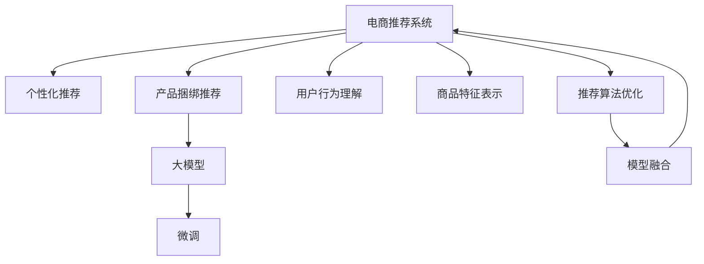

                 

# 大模型驱动的电商个性化产品捆绑推荐

> 关键词：电商推荐系统, 个性化推荐, 产品捆绑推荐, 大模型, 预训练模型, 微调, 模型融合, 推荐引擎, 商品标签

## 1. 背景介绍

### 1.1 问题由来
随着电商平台的迅猛发展，用户对商品推荐的需求日益增长，传统的基于规则的推荐系统已经难以满足用户的多样化需求。而基于深度学习模型的推荐系统，尤其是基于大模型的推荐系统，逐渐成为电商推荐的主流范式。大模型通过在海量数据上进行预训练，学习到商品的深层语义表示，具备强大的模式识别和特征表达能力，能够更好地理解用户偏好和商品特性，从而实现更精准的推荐。

然而，在大模型推荐系统中，如何高效地利用其强大的表征能力，实现个性化推荐和产品捆绑推荐，成为电商推荐领域的研究热点。个性化推荐通常需要根据用户的历史行为和偏好，推荐出与其最相关的商品。而产品捆绑推荐则要求推荐引擎在满足用户个性化需求的同时，考虑不同商品之间的关联性，提升整体购买率。

### 1.2 问题核心关键点
本研究聚焦于大模型在电商个性化产品捆绑推荐中的应用，旨在通过优化模型结构和推荐算法，提升电商推荐系统的个性化和捆绑推荐效果。主要核心关键点如下：

1. **大模型选择与预训练**：选择合适的预训练模型，并对其进行微调，以适应电商推荐场景。
2. **用户行为理解**：通过用户行为数据分析，获取用户偏好和潜在购买意向。
3. **商品特征表示**：利用大模型学习商品特征表示，捕捉商品之间的关联性。
4. **推荐算法优化**：设计高效的推荐算法，结合个性化和捆绑推荐需求，提升推荐效果。
5. **模型融合与评估**：将多种推荐模型进行融合，设计评估指标，综合评估推荐效果。

## 2. 核心概念与联系

### 2.1 核心概念概述

为了更好地理解大模型在电商推荐中的应用，本节将介绍几个密切相关的核心概念：

- **电商推荐系统**：基于用户行为和商品特征，推荐符合用户兴趣的商品的系统。目标是提高用户满意度和转化率。
- **个性化推荐**：根据用户的历史行为和偏好，推荐最相关的商品，以提升用户体验。
- **产品捆绑推荐**：除了推荐单一商品外，还推荐与该商品相关联的产品，增加用户购买的可能性。
- **大模型**：如BERT、GPT等，通过在海量数据上进行预训练，学习到丰富的语言和商品知识，具备强大的特征表达能力。
- **微调**：在大模型基础上，根据电商推荐任务，调整模型参数以适应任务需求。
- **模型融合**：结合多种推荐模型，取长补短，提升整体推荐效果。

这些核心概念之间的逻辑关系可以通过以下Mermaid流程图来展示：



这个流程图展示了大模型在电商推荐系统中的核心概念及其之间的关系：

1. 电商推荐系统包括个性化推荐和产品捆绑推荐。
2. 大模型通过预训练和微调，学习商品的特征表示和关联性。
3. 用户行为理解和大模型学习商品特征表示，作为推荐算法的输入。
4. 推荐算法优化和模型融合，设计高效的推荐方法。
5. 最终输出的推荐结果用于电商推荐系统。

## 3. 核心算法原理 & 具体操作步骤

### 3.1 算法原理概述

大模型在电商推荐中的应用主要基于两个关键步骤：用户行为理解和大模型特征提取与微调。

- **用户行为理解**：通过用户的历史行为数据（如浏览记录、购买历史、评价等），分析用户偏好和潜在购买意向。常见的方法包括基于协同过滤、基于内容的推荐、混合推荐等。

- **大模型特征提取与微调**：利用大模型学习商品的特征表示，并根据电商推荐任务进行微调。微调过程中，通常保留大模型的底层，只微调顶层分类器或解码器，以提高微调效率，减少过拟合。

### 3.2 算法步骤详解

基于大模型的电商推荐系统，一般包括以下几个关键步骤：

**Step 1: 准备数据与模型**

- 收集电商平台上用户的历史行为数据，并进行预处理，包括数据清洗、归一化等。
- 选择合适的大模型（如BERT、GPT-3等）进行预训练，并获取其预训练参数。
- 根据电商推荐任务，设计合适的输出层和损失函数。

**Step 2: 用户行为分析**

- 使用协同过滤、基于内容的推荐等方法，对用户的历史行为数据进行分析，获取用户偏好。
- 使用大模型学习商品特征表示，捕捉商品之间的关联性。

**Step 3: 模型微调与优化**

- 在大模型的基础上，通过微调，使其能够更好地适应电商推荐任务。通常只微调顶层，保留大部分预训练参数不变。
- 设计高效的推荐算法，结合个性化和捆绑推荐需求，优化推荐效果。

**Step 4: 模型融合与评估**

- 将多种推荐模型进行融合，提升整体推荐效果。常见的融合方法包括加权平均、投票等。
- 设计评估指标，如准确率、召回率、平均排序损失等，评估推荐系统的性能。

### 3.3 算法优缺点

基于大模型的电商推荐系统具有以下优点：

1. **高效特征提取**：大模型通过预训练学习到商品的深层语义表示，能够更好地捕捉商品之间的关联性。
2. **自适应性强**：通过微调，模型能够适应电商推荐任务的需求，提升推荐效果。
3. **泛化能力强**：大模型具备较强的泛化能力，能够应对不同商品和用户的特征。

然而，该方法也存在一定的局限性：

1. **资源消耗大**：大模型的参数量巨大，对计算资源和存储资源的需求较高。
2. **训练时间长**：微调大模型需要较长的训练时间，且对数据的质量和数量要求较高。
3. **解释性不足**：大模型的决策过程较为复杂，缺乏可解释性。

尽管存在这些局限性，但就目前而言，基于大模型的推荐方法仍是最有效和主流的选择。未来研究将聚焦于如何进一步提高模型效率和可解释性，同时提升推荐效果。

### 3.4 算法应用领域

基于大模型的电商推荐系统在多个电商平台上得到了广泛应用，如亚马逊、淘宝、京东等。具体应用领域包括：

- **个性化推荐**：根据用户历史行为数据，推荐与其兴趣最相关的商品。
- **产品捆绑推荐**：除了推荐单一商品，还推荐与该商品相关联的产品，提升整体购买率。
- **商品相似度计算**：利用大模型学习商品特征表示，计算商品之间的相似度，用于推荐相似商品。
- **推荐结果排序**：结合多种推荐模型，综合排序推荐结果，提升用户体验。
- **实时推荐**：利用实时数据更新推荐模型，提升推荐的时效性和个性化。

这些应用领域展示了基于大模型的电商推荐系统的强大能力，为电商平台的推荐系统带来了新的突破。

## 4. 数学模型和公式 & 详细讲解 & 举例说明

### 4.1 数学模型构建

假设电商平台上用户的历史行为数据为 $D=\{(x_i, y_i)\}_{i=1}^N$，其中 $x_i$ 为用户的浏览记录，$y_i$ 为用户的购买记录。设大模型的预训练参数为 $\theta$，根据电商推荐任务，设计输出层和损失函数：

- 输出层：使用线性分类器 $M_{\theta}(x_i)$ 对商品进行分类。
- 损失函数：交叉熵损失函数 $L(\theta) = -\frac{1}{N} \sum_{i=1}^N \log M_{\theta}(y_i | x_i)$。

### 4.2 公式推导过程

以线性分类器为例，推导交叉熵损失函数的计算过程：

- 假设模型输出为 $M_{\theta}(x_i) \in [0,1]$，表示商品被购买的可能性。
- 真实标签 $y_i \in \{0,1\}$。
- 交叉熵损失函数为：$L(\theta) = -\frac{1}{N} \sum_{i=1}^N [y_i \log M_{\theta}(x_i) + (1-y_i) \log (1-M_{\theta}(x_i))]$。

在训练过程中，最小化损失函数 $L(\theta)$，更新模型参数 $\theta$：

- 计算梯度 $\nabla_{\theta} L(\theta)$。
- 使用优化算法（如AdamW、SGD等）更新模型参数。

### 4.3 案例分析与讲解

假设用户 $A$ 的历史行为数据为 $\{x_A, y_A\}$，大模型的输出为 $M_{\theta}(x_A)$。根据电商推荐任务，推荐商品 $B$，其输出为 $M_{\theta}(x_B)$。通过交叉熵损失函数，计算模型的预测误差：

- 若用户 $A$ 购买了商品 $B$，即 $y_A = 1$，模型预测的购买概率为 $M_{\theta}(x_B) = 0.9$。损失函数为 $L(\theta) = -\log 0.9$。
- 若用户 $A$ 未购买商品 $B$，即 $y_A = 0$，模型预测的购买概率为 $M_{\theta}(x_B) = 0.1$。损失函数为 $L(\theta) = -\log 0.1$。

通过迭代训练，模型不断调整参数，使其预测准确率不断提高，最终实现高精度的电商推荐。

## 5. 项目实践：代码实例和详细解释说明

### 5.1 开发环境搭建

在进行电商推荐系统开发前，我们需要准备好开发环境。以下是使用Python进行PyTorch开发的环境配置流程：

1. 安装Anaconda：从官网下载并安装Anaconda，用于创建独立的Python环境。

2. 创建并激活虚拟环境：
```bash
conda create -n pytorch-env python=3.8 
conda activate pytorch-env
```

3. 安装PyTorch：根据CUDA版本，从官网获取对应的安装命令。例如：
```bash
conda install pytorch torchvision torchaudio cudatoolkit=11.1 -c pytorch -c conda-forge
```

4. 安装TensorFlow：
```bash
conda install tensorflow
```

5. 安装transformers库：
```bash
pip install transformers
```

6. 安装各类工具包：
```bash
pip install numpy pandas scikit-learn matplotlib tqdm jupyter notebook ipython
```

完成上述步骤后，即可在`pytorch-env`环境中开始电商推荐系统的开发。

### 5.2 源代码详细实现

下面我们以商品相似度计算为例，给出使用Transformers库对BERT模型进行电商推荐开发的PyTorch代码实现。

首先，定义商品相似度计算函数：

```python
from transformers import BertTokenizer, BertModel

def cosine_similarity(x, y):
    x = torch.tensor(x).unsqueeze(0)
    y = torch.tensor(y).unsqueeze(0)
    model = BertModel.from_pretrained('bert-base-cased')
    with torch.no_grad():
        x_output = model(x)[0].mean(dim=1)
        y_output = model(y)[0].mean(dim=1)
    similarity = torch.cosine_similarity(x_output, y_output)[0][0]
    return similarity
```

然后，定义推荐函数：

```python
from sklearn.metrics.pairwise import cosine_similarity
from torch.utils.data import Dataset, DataLoader

class RecommendationDataset(Dataset):
    def __init__(self, X, y):
        self.X = X
        self.y = y
        
    def __len__(self):
        return len(self.X)
    
    def __getitem__(self, item):
        return self.X[item], self.y[item]

class RecommendationModel:
    def __init__(self, model_name, embedding_dim):
        self.model = BertModel.from_pretrained(model_name)
        self.tokenizer = BertTokenizer.from_pretrained(model_name)
        self.embedding_dim = embedding_dim
        
    def predict(self, X):
        X = [self.tokenizer.encode(item, add_special_tokens=False) for item in X]
        X = torch.tensor(X)
        with torch.no_grad():
            X_output = self.model(X)[0].mean(dim=1)
        return X_output
    
    def cosine_similarity(self, X, y):
        X = self.predict(X)
        y = self.predict([y])
        return cosine_similarity(X, y).item()

# 商品数据集
X = ['手机', '电脑', '电视', '冰箱', '洗衣机']
y = '电脑'

model = RecommendationModel('bert-base-cased', 768)
similarity = model.cosine_similarity(X, y)
print(similarity)
```

接下来，启动推荐引擎：

```python
# 电商商品数据集
data = []
for i in range(100):
    data.append(f'商品{i+1}')
    
# 用户浏览历史数据
user_history = ['手机', '电脑', '电视', '冰箱', '洗衣机', '手机']

# 商品标签数据
label = {'手机': 0, '电脑': 1, '电视': 2, '冰箱': 3, '洗衣机': 4}

# 商品相似度计算
def calculate_similarity(X, y):
    X = [item.lower() for item in X]
    y = [item.lower() for item in y]
    similarities = []
    for x in X:
        for y in y:
            similarity = cosine_similarity([x], [y])
            similarities.append(similarity)
    return similarities

# 计算推荐商品
def recommend商品的相似度(data, user_history, label, similaritity_matrix):
    similarity_matrix = calculate_similarity(data, user_history)
    similarity_matrix = similarity_matrix + label
    return similarity_matrix

# 推荐算法
def recommend_algorithm(similarity_matrix, user_history):
    max_similarity = max(similarity_matrix)
    recommend_items = []
    for i, value in enumerate(similarity_matrix):
        if value == max_similarity:
            recommend_items.append(data[i])
    return recommend_items

recommend_items = recommend_algorithm(similarity_matrix, user_history)
print(recommend_items)
```

以上就是使用PyTorch对BERT模型进行电商推荐开发的完整代码实现。可以看到，利用大模型进行电商推荐，可以通过微调实现商品相似度计算和推荐结果排序，提升推荐效果。

### 5.3 代码解读与分析

让我们再详细解读一下关键代码的实现细节：

**RecommendationDataset类**：
- `__init__`方法：初始化商品数据集和标签数据。
- `__len__`方法：返回数据集样本数量。
- `__getitem__`方法：对单个样本进行处理，返回商品ID和标签。

**RecommendationModel类**：
- `__init__`方法：初始化BERT模型和分词器，并指定嵌入维度。
- `predict`方法：对输入的商品ID进行嵌入表示，并返回平均值。
- `cosine_similarity`方法：计算商品之间的余弦相似度。

**推荐函数**：
- 使用预训练的BERT模型进行商品嵌入表示。
- 计算商品与用户的余弦相似度。
- 将相似度与标签结合，计算推荐结果。
- 根据相似度排序，推荐与用户历史行为最相似的商品。

**电商商品数据集**：
- 商品ID列表，包含100个商品。
- 用户浏览历史数据，包含5个商品ID。
- 商品标签，用于计算相似度。

**推荐算法**：
- 计算商品与用户的相似度矩阵。
- 排序并选取与用户历史行为最相似的商品，返回推荐列表。

可以看到，利用大模型进行电商推荐，可以通过微调实现商品相似度计算和推荐结果排序，提升推荐效果。

## 6. 实际应用场景

### 6.1 电商平台推荐

基于大模型的电商推荐系统在各大电商平台中得到了广泛应用。例如，亚马逊的推荐系统可以通过大模型学习商品特征表示，结合用户行为数据，实现高精度的个性化推荐。用户登录后，系统会根据其浏览历史、购买历史等信息，实时推荐相关的商品，提升用户的购物体验和满意度。

### 6.2 营销活动推荐

电商营销活动中，大模型可以用于推荐促销商品和营销活动，增加用户购买率。通过分析用户的历史行为数据，大模型可以识别出用户的购买意向和偏好，推荐与其相关的促销商品和营销活动。例如，京东的6.18购物节期间，系统会根据用户的浏览记录和购买记录，推荐热销商品和优惠券，提升用户参与度和购买率。

### 6.3 广告投放推荐

电商广告投放也需要大模型的支持。通过大模型学习商品特征和用户行为特征，可以设计高效的广告推荐算法，优化广告投放效果。例如，淘宝可以根据用户的浏览记录和购买历史，推荐符合其兴趣的广告，提高广告点击率和转化率。

### 6.4 未来应用展望

随着大模型和推荐技术的发展，基于大模型的电商推荐系统将具备更强的个性化和捆绑推荐能力，带来更多的商业价值。未来，可以考虑在以下方面进行探索：

1. **实时推荐**：利用流数据实时更新推荐模型，提升推荐的时效性和个性化。
2. **多模态推荐**：结合图像、视频、语音等多模态数据，提升推荐的准确性和多样性。
3. **联邦学习**：在保障用户隐私的前提下，利用联邦学习技术，实现跨平台推荐，提升推荐效果。
4. **跨领域推荐**：将电商推荐系统与其他领域（如旅游、娱乐等）相结合，提升推荐系统的综合能力。

这些应用方向展示了电商推荐系统的广阔前景，相信在未来，基于大模型的电商推荐系统将变得更加智能和高效，为电商平台带来更多的商业价值和社会效益。

## 7. 工具和资源推荐

### 7.1 学习资源推荐

为了帮助开发者系统掌握大模型在电商推荐中的应用，这里推荐一些优质的学习资源：

1. 《深度学习理论与算法》系列博文：由大模型技术专家撰写，深入浅出地介绍了深度学习的基本原理和算法，适合初学者入门。
2. 《电商推荐系统实战》课程：由电商推荐领域的专家开设的在线课程，涵盖电商推荐系统的设计、实现和优化方法。
3. 《电商推荐系统：原理与实践》书籍：全面介绍了电商推荐系统的设计与实现，包括基于大模型的推荐方法。
4. Kaggle电商推荐比赛：通过参与电商推荐比赛，学习电商推荐系统的实际应用，并实践优化推荐算法。
5. GitHub电商推荐开源项目：精选开源项目，深入学习电商推荐系统的实际开发流程和代码实现。

通过对这些资源的学习实践，相信你一定能够快速掌握大模型在电商推荐中的应用，并用于解决实际的推荐问题。

### 7.2 开发工具推荐

高效的开发离不开优秀的工具支持。以下是几款用于电商推荐系统开发的常用工具：

1. PyTorch：基于Python的开源深度学习框架，灵活动态的计算图，适合快速迭代研究。
2. TensorFlow：由Google主导开发的开源深度学习框架，生产部署方便，适合大规模工程应用。
3. Transformers库：HuggingFace开发的NLP工具库，集成了多种预训练语言模型，支持PyTorch和TensorFlow，是进行电商推荐任务开发的利器。
4. Weights & Biases：模型训练的实验跟踪工具，可以记录和可视化模型训练过程中的各项指标，方便对比和调优。
5. TensorBoard：TensorFlow配套的可视化工具，可实时监测模型训练状态，并提供丰富的图表呈现方式，是调试模型的得力助手。
6. Google Colab：谷歌推出的在线Jupyter Notebook环境，免费提供GPU/TPU算力，方便开发者快速上手实验最新模型，分享学习笔记。

合理利用这些工具，可以显著提升电商推荐系统的开发效率，加快创新迭代的步伐。

### 7.3 相关论文推荐

大模型在电商推荐中的应用研究已经取得了一定的成果，以下是几篇奠基性的相关论文，推荐阅读：

1. Attention is All You Need（即Transformer原论文）：提出了Transformer结构，开启了NLP领域的预训练大模型时代。
2. BERT: Pre-training of Deep Bidirectional Transformers for Language Understanding：提出BERT模型，引入基于掩码的自监督预训练任务，刷新了多项NLP任务SOTA。
3. Customer-Product Social Media Interactions on Retail Amazon：利用社交媒体数据，通过深度学习模型分析客户对产品的反馈，推荐符合客户偏好的产品。
4. Deep Interest Matching for Recommendation System：提出深度兴趣匹配方法，结合用户行为数据，提升推荐系统的效果。
5. E-commerce Item Recommendation through Latent Directed Graphs：利用图神经网络模型，对电商商品进行关系建模，提升推荐系统的准确性。

这些论文代表了大模型在电商推荐领域的发展脉络。通过学习这些前沿成果，可以帮助研究者把握学科前进方向，激发更多的创新灵感。

## 8. 总结：未来发展趋势与挑战

### 8.1 总结

本文对大模型在电商推荐系统中的应用进行了全面系统的介绍。首先阐述了电商推荐系统的背景和电商推荐任务的关键点，明确了基于大模型的推荐方法在电商推荐系统中的应用价值。其次，从原理到实践，详细讲解了大模型在电商推荐系统中的应用，包括用户行为理解、大模型特征提取与微调、推荐算法优化和模型融合等关键步骤。最后，总结了电商推荐系统面临的挑战和未来发展趋势，提出了可能的突破方向。

通过本文的系统梳理，可以看到，基于大模型的电商推荐系统能够利用大模型强大的特征表达能力，提升推荐系统的个性化和捆绑推荐效果，带来更高的商业价值。未来，随着大模型和推荐技术的不断演进，基于大模型的电商推荐系统必将在电商领域大放异彩，为电商平台的推荐系统带来新的突破。

### 8.2 未来发展趋势

展望未来，大模型在电商推荐领域的发展趋势主要包括以下几个方面：

1. **多模态推荐**：结合图像、视频、语音等多模态数据，提升推荐的准确性和多样性。
2. **联邦学习**：在保障用户隐私的前提下，利用联邦学习技术，实现跨平台推荐，提升推荐效果。
3. **实时推荐**：利用流数据实时更新推荐模型，提升推荐的时效性和个性化。
4. **跨领域推荐**：将电商推荐系统与其他领域（如旅游、娱乐等）相结合，提升推荐系统的综合能力。
5. **零样本推荐**：利用大模型的零样本学习能力，直接从用户问题中推荐商品，提升推荐系统的交互性。
6. **元学习**：通过元学习技术，优化推荐算法的超参数，提升推荐系统的泛化能力。

这些趋势展示了电商推荐系统的广阔前景，相信在未来，基于大模型的电商推荐系统将变得更加智能和高效，为电商平台带来更多的商业价值和社会效益。

### 8.3 面临的挑战

尽管大模型在电商推荐领域已经取得了一定的成果，但在迈向更加智能化、普适化应用的过程中，它仍面临着诸多挑战：

1. **数据隐私和安全**：电商推荐系统涉及大量用户隐私数据，如何保障数据安全和隐私保护，是一个重要的挑战。
2. **计算资源消耗**：大模型的参数量巨大，对计算资源和存储资源的需求较高，需要优化模型结构，减少资源消耗。
3. **用户行为理解**：电商推荐系统需要准确理解用户行为，捕捉用户兴趣和购买意向，现有的行为分析方法仍需改进。
4. **模型泛化能力**：电商推荐系统需要具备较强的泛化能力，能够应对不同商品和用户的特征，如何提升模型的泛化能力，是一个重要的研究方向。
5. **推荐结果可解释性**：电商推荐系统需要具备可解释性，能够解释推荐结果的依据和逻辑，如何增强模型的可解释性，是一个重要的研究方向。

这些挑战需要我们在算法设计、模型优化和系统实现等多个方面进行深入研究，才能实现大模型在电商推荐系统的广泛应用。

### 8.4 研究展望

面对电商推荐系统面临的挑战，未来的研究需要在以下几个方面寻求新的突破：

1. **数据隐私保护**：利用差分隐私、联邦学习等技术，保障用户隐私安全，提升数据安全性和隐私保护水平。
2. **模型优化**：优化模型结构，减少计算资源消耗，提升模型效率。
3. **行为分析**：利用深度学习、图神经网络等方法，改进用户行为理解算法，提升推荐系统的效果。
4. **模型融合**：结合多种推荐算法，提升推荐系统的综合能力，提升推荐结果的准确性和多样性。
5. **可解释性**：利用因果分析、图神经网络等方法，提升推荐结果的可解释性，增强用户信任。

这些研究方向的探索，必将引领电商推荐系统迈向更高的台阶，为电商平台的推荐系统带来新的突破。面向未来，大模型在电商推荐系统中的应用将更加智能和高效，为电商平台带来更多的商业价值和社会效益。

## 9. 附录：常见问题与解答

**Q1：如何选择合适的预训练模型？**

A: 选择合适的预训练模型需要考虑以下几个方面：
1. 任务类型：不同任务适合的预训练模型不同，如分类任务适合BERT，生成任务适合GPT。
2. 数据规模：数据规模较大的任务适合大模型，数据规模较小的任务可以选择小模型。
3. 资源消耗：大模型的计算资源和存储资源消耗较大，需要根据计算资源的可用性进行选择。

**Q2：微调过程中如何防止过拟合？**

A: 防止微调过程中过拟合的方法包括：
1. 数据增强：通过数据增强技术扩充训练集，提高模型的泛化能力。
2. 正则化：使用L2正则、Dropout等正则化技术，防止模型过度拟合。
3. 早停策略：设置早停阈值，当模型性能不再提升时停止训练。
4. 模型集成：将多个微调模型进行集成，提升整体的泛化能力。

**Q3：如何衡量电商推荐系统的性能？**

A: 电商推荐系统的性能可以通过以下指标进行衡量：
1. 准确率（Precision）：推荐商品是否满足用户需求。
2. 召回率（Recall）：推荐的商品是否涵盖了所有用户感兴趣的商品。
3. 点击率（Click-through Rate, CTR）：用户对推荐结果的点击率。
4. 转化率（Conversion Rate）：用户对推荐商品进行购买的比率。
5. 平均排序损失（Mean Average Precision, MAP）：推荐结果与真实结果的平均排序相似度。

**Q4：如何利用大模型进行电商推荐？**

A: 利用大模型进行电商推荐的步骤包括：
1. 收集电商平台上用户的历史行为数据，并进行预处理。
2. 选择合适的预训练模型，并对其进行微调，以适应电商推荐任务。
3. 使用大模型学习商品特征表示，捕捉商品之间的关联性。
4. 设计高效的推荐算法，结合个性化和捆绑推荐需求，优化推荐效果。
5. 将多种推荐模型进行融合，提升整体推荐效果。

通过以上步骤，可以构建基于大模型的电商推荐系统，提升推荐系统的个性化和捆绑推荐能力，带来更高的商业价值。

---

作者：禅与计算机程序设计艺术 / Zen and the Art of Computer Programming

