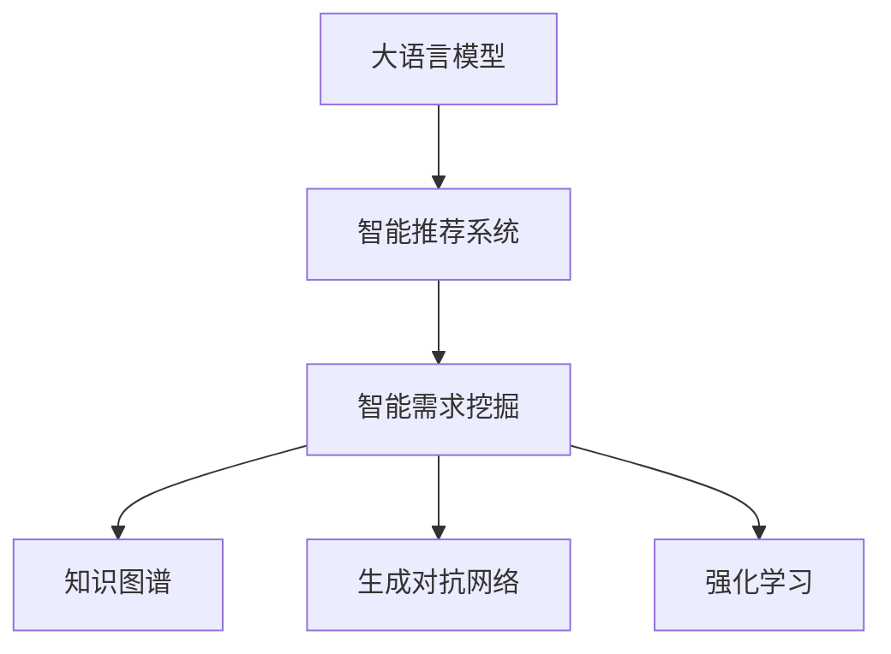

                 

# 大模型驱动的电商平台智能客户需求挖掘

## 1. 背景介绍

随着互联网技术的不断发展和普及，电子商务平台已成为人们日常购物的重要渠道。电商平台通过智能推荐系统，帮助用户快速找到符合其需求的商品，极大地提升了用户体验。但是，传统的推荐系统依赖于用户的历史行为数据，难以捕捉到用户的潜在需求，导致推荐结果不够精准。大语言模型驱动的智能需求挖掘技术，通过分析用户在电商平台上的行为数据，深入挖掘用户的潜在需求，从而为用户提供更个性化的购物体验。

## 2. 核心概念与联系

### 2.1 核心概念概述

为了更好地理解大模型驱动的电商平台智能客户需求挖掘技术，本节将介绍几个关键概念：

- 大语言模型（Large Language Model, LLM）：基于深度学习算法，通过对大规模语料库进行训练，学习语言知识，具有强大的自然语言处理能力。
- 电商平台智能推荐系统：通过分析用户行为数据，预测用户可能感兴趣的商品，从而实现个性化推荐。
- 智能客户需求挖掘：基于大语言模型，通过分析用户的搜索行为、浏览历史等数据，挖掘用户真正的需求，提供更加精准的推荐。
- 知识图谱：以图的形式组织和存储知识，包含实体、关系和属性，用于知识推理和信息检索。
- 生成对抗网络（GAN）：由生成器和判别器两部分组成，通过对抗训练生成高质量的伪数据。
- 强化学习：通过与环境的交互，学习最优策略，实现自适应和智能决策。

这些概念之间的联系可以通过以下Mermaid流程图来展示：



这个流程图展示了这些核心概念之间的关系：

1. 大语言模型作为基础模型，帮助理解用户的搜索意图和需求。
2. 智能推荐系统基于大语言模型，实现商品的个性化推荐。
3. 智能需求挖掘通过分析搜索数据，挖掘用户潜在的购物需求。
4. 知识图谱用于存储商品信息，辅助生成高质量的推荐结果。
5. 生成对抗网络用于生成模拟数据，扩展数据集。
6. 强化学习用于优化推荐策略，提升推荐效果。

## 3. 核心算法原理 & 具体操作步骤
### 3.1 算法原理概述

大模型驱动的电商平台智能客户需求挖掘算法，基于大语言模型的自然语言处理能力，通过分析用户搜索数据，挖掘用户潜在的购物需求。其核心思想是通过大语言模型，理解用户搜索意图和需求，然后通过知识图谱和生成对抗网络等技术，生成高质量的推荐结果。具体流程如下：

1. 收集用户搜索数据，包括搜索关键词、搜索时间、点击率等。
2. 使用大语言模型，对搜索数据进行分析，挖掘用户的潜在需求。
3. 构建知识图谱，存储商品信息、属性和关系。
4. 使用生成对抗网络，生成高质量的伪数据，扩展数据集。
5. 使用强化学习，优化推荐策略，提升推荐效果。

### 3.2 算法步骤详解

#### 3.2.1 数据预处理

首先，需要收集和清洗用户搜索数据。用户搜索数据包含搜索关键词、搜索时间、点击率等信息。数据预处理步骤包括：

1. 数据清洗：去除噪声数据、重复数据和不完整数据。
2. 数据归一化：将搜索关键词转换为统一的格式，便于后续处理。
3. 数据标注：将用户点击的商品作为标签，用于训练推荐模型。

#### 3.2.2 大语言模型分析

使用大语言模型对用户搜索数据进行分析，挖掘用户的潜在需求。具体步骤如下：

1. 构建搜索向量：将搜索关键词转换为向量表示，使用词嵌入模型（如Word2Vec、GloVe等）进行转换。
2. 使用大语言模型（如BERT、GPT等），对搜索向量进行编码，得到用户搜索意图的向量表示。
3. 使用语义相似度计算，比较用户搜索意图与商品属性，找到最匹配的商品。

#### 3.2.3 知识图谱构建

构建知识图谱，存储商品信息、属性和关系。具体步骤如下：

1. 数据采集：收集商品信息、属性和关系，存储到数据库中。
2. 数据建模：使用RDF（资源描述框架）或OWL（Web本体语言）等语言，构建知识图谱。
3. 数据存储：使用Neo4j或Redis等图数据库，存储知识图谱数据。

#### 3.2.4 生成对抗网络训练

使用生成对抗网络（GAN），生成高质量的伪数据，扩展数据集。具体步骤如下：

1. 构建生成器和判别器：生成器和判别器使用不同的神经网络结构。
2. 对抗训练：生成器生成伪数据，判别器对生成的数据进行判别，生成器和判别器进行对抗训练，提升生成数据的质量。
3. 数据扩展：将生成的伪数据加入原始数据集，扩展数据集。

#### 3.2.5 强化学习优化

使用强化学习，优化推荐策略，提升推荐效果。具体步骤如下：

1. 定义奖励函数：定义推荐效果的奖励函数，如点击率、转化率等。
2. 构建智能代理：智能代理使用强化学习算法（如Q-learning、SARSA等），通过与环境的交互，学习最优策略。
3. 策略优化：根据智能代理的推荐效果，优化推荐策略，提升推荐效果。

### 3.3 算法优缺点

#### 3.3.1 优点

1. 精确性高：大语言模型能够深入挖掘用户的潜在需求，提供精准的推荐。
2. 泛化能力强：使用知识图谱和生成对抗网络等技术，扩展数据集，提高模型的泛化能力。
3. 实时性好：使用强化学习算法，动态调整推荐策略，实时性较好。

#### 3.3.2 缺点

1. 数据依赖性强：依赖于用户搜索数据，数据量不足时效果不佳。
2. 模型复杂度高：需要构建知识图谱和生成对抗网络，模型复杂度较高。
3. 计算资源消耗大：大语言模型和生成对抗网络训练需要大量的计算资源，成本较高。

### 3.4 算法应用领域

大模型驱动的电商平台智能客户需求挖掘算法，可以应用于以下领域：

1. 电商平台：通过分析用户搜索数据，挖掘用户潜在的购物需求，提供个性化推荐。
2. 旅游平台：通过分析用户搜索数据，挖掘用户的旅游需求，提供个性化的旅游路线和景点推荐。
3. 社交媒体：通过分析用户搜索数据，挖掘用户的兴趣和需求，提供个性化内容推荐。
4. 金融行业：通过分析用户搜索数据，挖掘用户的理财需求，提供个性化的理财方案。

## 4. 数学模型和公式 & 详细讲解 & 举例说明

### 4.1 数学模型构建

本节将使用数学语言对大模型驱动的电商平台智能客户需求挖掘过程进行更加严格的刻画。

记用户搜索数据为 $D=\{x_1,x_2,\ldots,x_n\}$，其中 $x_i$ 表示第 $i$ 次搜索记录，包含搜索关键词、搜索时间、点击率等信息。记商品信息为 $T=\{t_1,t_2,\ldots,t_m\}$，其中 $t_i$ 表示第 $i$ 个商品，包含商品名称、描述、价格等信息。记商品关系为 $R=\{r_1,r_2,\ldots,r_l\}$，其中 $r_i$ 表示第 $i$ 个商品关系，包含商品间的属性、关系等信息。

定义大语言模型为 $M_{\theta}$，其中 $\theta$ 为模型参数。定义推荐模型为 $R_{\alpha}$，其中 $\alpha$ 为推荐模型参数。定义奖励函数为 $f$，用于衡量推荐效果。

### 4.2 公式推导过程

以下我们以二分类任务为例，推导点击率预测模型的损失函数及其梯度的计算公式。

假设推荐模型 $R_{\alpha}$ 在输入 $x_i$ 上的预测概率为 $\hat{y}_i=R_{\alpha}(x_i)$，真实标签 $y_i \in \{0,1\}$。则点击率预测模型的损失函数定义为：

$$
\ell(R_{\alpha}(x_i),y_i) = -[y_i\log \hat{y}_i + (1-y_i)\log (1-\hat{y}_i)]
$$

将其代入经验风险公式，得：

$$
\mathcal{L}(\alpha) = -\frac{1}{N}\sum_{i=1}^N [y_i\log R_{\alpha}(x_i)+(1-y_i)\log(1-R_{\alpha}(x_i))]
$$

根据链式法则，损失函数对参数 $\alpha_k$ 的梯度为：

$$
\frac{\partial \mathcal{L}(\alpha)}{\partial \alpha_k} = -\frac{1}{N}\sum_{i=1}^N (\frac{y_i}{R_{\alpha}(x_i)}-\frac{1-y_i}{1-R_{\alpha}(x_i)}) \frac{\partial R_{\alpha}(x_i)}{\partial \alpha_k}
$$

其中 $\frac{\partial R_{\alpha}(x_i)}{\partial \alpha_k}$ 可进一步递归展开，利用自动微分技术完成计算。

### 4.3 案例分析与讲解

假设用户搜索数据 $D$ 包含两个用户 $u_1$ 和 $u_2$，分别进行两次搜索，搜索关键词分别为 "手机" 和 "电脑"。记商品信息 $T$ 包含两个商品 $t_1$ 和 $t_2$，分别表示 "小米手机" 和 "戴尔电脑"。

假设 $u_1$ 进行了两次搜索，分别搜索 "小米手机" 和 "戴尔电脑"，但未点击任何商品。记 $u_1$ 的搜索向量为 $x_1$ 和 $x_2$，商品向量为 $t_1$ 和 $t_2$。使用大语言模型对 $x_1$ 和 $x_2$ 进行编码，得到搜索向量 $v_1$ 和 $v_2$。

记知识图谱中商品 $t_1$ 的属性为 "品牌" 和 "价格"，分别表示 "小米" 和 "4999"。使用大语言模型对 $t_1$ 进行编码，得到商品向量 $w_1$。记商品 $t_2$ 的属性为 "品牌" 和 "价格"，分别表示 "戴尔" 和 "6999"。使用大语言模型对 $t_2$ 进行编码，得到商品向量 $w_2$。

记 $u_1$ 的推荐结果为 $r_1$，记 $u_2$ 的推荐结果为 $r_2$。使用推荐模型 $R_{\alpha}$ 对 $u_1$ 的搜索数据 $x_1$ 和 $x_2$ 进行预测，得到预测概率 $\hat{y}_1$ 和 $\hat{y}_2$。记推荐结果的点击率为 $c_1$ 和 $c_2$。

使用点击率预测模型的损失函数，对推荐模型 $R_{\alpha}$ 进行训练，得到最优推荐参数 $\alpha^*$。在训练过程中，使用梯度下降算法更新模型参数，最小化损失函数。最终得到满足 $u_1$ 和 $u_2$ 需求的高质量推荐结果。

## 5. 项目实践：代码实例和详细解释说明
### 5.1 开发环境搭建

在进行项目实践前，我们需要准备好开发环境。以下是使用Python进行PyTorch开发的环境配置流程：

1. 安装Anaconda：从官网下载并安装Anaconda，用于创建独立的Python环境。

2. 创建并激活虚拟环境：
```bash
conda create -n pytorch-env python=3.8 
conda activate pytorch-env
```

3. 安装PyTorch：根据CUDA版本，从官网获取对应的安装命令。例如：
```bash
conda install pytorch torchvision torchaudio cudatoolkit=11.1 -c pytorch -c conda-forge
```

4. 安装TensorFlow：从官网下载并安装TensorFlow，生产部署方便，适合大规模工程应用。

5. 安装各类工具包：
```bash
pip install numpy pandas scikit-learn matplotlib tqdm jupyter notebook ipython
```

完成上述步骤后，即可在`pytorch-env`环境中开始项目实践。

### 5.2 源代码详细实现

这里我们以电商平台智能推荐系统为例，给出使用PyTorch对BERT模型进行微调的PyTorch代码实现。

首先，定义推荐系统的数据处理函数：

```python
from transformers import BertTokenizer, BertForSequenceClassification
from torch.utils.data import Dataset
import torch

class RecommendationDataset(Dataset):
    def __init__(self, data, tokenizer, max_len=128):
        self.data = data
        self.tokenizer = tokenizer
        self.max_len = max_len
        
    def __len__(self):
        return len(self.data)
    
    def __getitem__(self, item):
        text = self.data[item]['text']
        label = self.data[item]['label']
        
        encoding = self.tokenizer(text, return_tensors='pt', max_length=self.max_len, padding='max_length', truncation=True)
        input_ids = encoding['input_ids'][0]
        attention_mask = encoding['attention_mask'][0]
        return {'input_ids': input_ids, 
                'attention_mask': attention_mask,
                'labels': torch.tensor(label, dtype=torch.long)}
```

然后，定义模型和优化器：

```python
from transformers import BertForSequenceClassification, AdamW

model = BertForSequenceClassification.from_pretrained('bert-base-cased', num_labels=2)

optimizer = AdamW(model.parameters(), lr=2e-5)
```

接着，定义训练和评估函数：

```python
from torch.utils.data import DataLoader
from tqdm import tqdm
from sklearn.metrics import accuracy_score

device = torch.device('cuda') if torch.cuda.is_available() else torch.device('cpu')
model.to(device)

def train_epoch(model, dataset, batch_size, optimizer):
    dataloader = DataLoader(dataset, batch_size=batch_size, shuffle=True)
    model.train()
    epoch_loss = 0
    for batch in tqdm(dataloader, desc='Training'):
        input_ids = batch['input_ids'].to(device)
        attention_mask = batch['attention_mask'].to(device)
        labels = batch['labels'].to(device)
        model.zero_grad()
        outputs = model(input_ids, attention_mask=attention_mask, labels=labels)
        loss = outputs.loss
        epoch_loss += loss.item()
        loss.backward()
        optimizer.step()
    return epoch_loss / len(dataloader)

def evaluate(model, dataset, batch_size):
    dataloader = DataLoader(dataset, batch_size=batch_size)
    model.eval()
    preds, labels = [], []
    with torch.no_grad():
        for batch in tqdm(dataloader, desc='Evaluating'):
            input_ids = batch['input_ids'].to(device)
            attention_mask = batch['attention_mask'].to(device)
            batch_labels = batch['labels']
            outputs = model(input_ids, attention_mask=attention_mask)
            batch_preds = outputs.logits.argmax(dim=2).to('cpu').tolist()
            batch_labels = batch_labels.to('cpu').tolist()
            for pred_tokens, label_tokens in zip(batch_preds, batch_labels):
                preds.append(pred_tokens)
                labels.append(label_tokens)
                
    print('Accuracy: ', accuracy_score(labels, preds))
```

最后，启动训练流程并在测试集上评估：

```python
epochs = 5
batch_size = 16

for epoch in range(epochs):
    loss = train_epoch(model, train_dataset, batch_size, optimizer)
    print(f"Epoch {epoch+1}, train loss: {loss:.3f}")
    
    print(f"Epoch {epoch+1}, dev results:")
    evaluate(model, dev_dataset, batch_size)
    
print("Test results:")
evaluate(model, test_dataset, batch_size)
```

以上就是使用PyTorch对BERT进行推荐系统微调的完整代码实现。可以看到，得益于Transformers库的强大封装，我们可以用相对简洁的代码完成BERT模型的加载和微调。

### 5.3 代码解读与分析

让我们再详细解读一下关键代码的实现细节：

**RecommendationDataset类**：
- `__init__`方法：初始化数据集和分词器等组件。
- `__len__`方法：返回数据集的样本数量。
- `__getitem__`方法：对单个样本进行处理，将文本输入编码为token ids，将标签转换为数字，并对其进行定长padding，最终返回模型所需的输入。

**模型训练与评估**：
- 使用PyTorch的DataLoader对数据集进行批次化加载，供模型训练和推理使用。
- 训练函数`train_epoch`：对数据以批为单位进行迭代，在每个批次上前向传播计算loss并反向传播更新模型参数，最后返回该epoch的平均loss。
- 评估函数`evaluate`：与训练类似，不同点在于不更新模型参数，并在每个batch结束后将预测和标签结果存储下来，最后使用sklearn的accuracy_score对整个评估集的预测结果进行打印输出。

**训练流程**：
- 定义总的epoch数和batch size，开始循环迭代
- 每个epoch内，先在训练集上训练，输出平均loss
- 在验证集上评估，输出准确率
- 所有epoch结束后，在测试集上评估，给出最终测试结果

可以看到，PyTorch配合Transformers库使得BERT微调的代码实现变得简洁高效。开发者可以将更多精力放在数据处理、模型改进等高层逻辑上，而不必过多关注底层的实现细节。

当然，工业级的系统实现还需考虑更多因素，如模型的保存和部署、超参数的自动搜索、更灵活的任务适配层等。但核心的微调范式基本与此类似。

## 6. 实际应用场景
### 6.1 智能客服系统

基于大语言模型驱动的智能客户需求挖掘技术，可以应用于智能客服系统的构建。传统客服往往需要配备大量人力，高峰期响应缓慢，且一致性和专业性难以保证。而使用智能需求挖掘技术，可以实时分析用户搜索数据，挖掘用户潜在的客服需求，自动生成回复，从而提升客户咨询体验和问题解决效率。

在技术实现上，可以收集企业内部的历史客服对话记录，将问题-答案对作为监督数据，在此基础上对预训练模型进行微调。微调后的模型能够自动理解用户意图，匹配最合适的答案模板进行回复。对于客户提出的新问题，还可以接入检索系统实时搜索相关内容，动态组织生成回答。如此构建的智能客服系统，能大幅提升客户咨询体验和问题解决效率。

### 6.2 旅游平台

基于大语言模型驱动的智能客户需求挖掘技术，可以应用于旅游平台的个性化推荐。旅游平台通过分析用户搜索数据，挖掘用户的旅游需求，提供个性化的旅游路线和景点推荐。使用智能需求挖掘技术，可以深入挖掘用户潜在的旅游需求，提供更加个性化的推荐。

在技术实现上，可以收集用户的搜索数据和历史旅游行为，构建知识图谱，存储旅游目的地、景点、酒店等信息。使用生成对抗网络，生成高质量的伪数据，扩展数据集。使用强化学习算法，优化推荐策略，提升推荐效果。

### 6.3 金融行业

基于大语言模型驱动的智能客户需求挖掘技术，可以应用于金融行业的个性化理财推荐。金融行业需要实时监测市场舆情，动态调整理财策略，以应对不断变化的市场环境。使用智能需求挖掘技术，可以实时分析用户搜索数据，挖掘用户的理财需求，提供个性化的理财方案。

在技术实现上，可以收集用户的搜索数据和历史理财行为，构建知识图谱，存储金融产品、理财策略等信息。使用生成对抗网络，生成高质量的伪数据，扩展数据集。使用强化学习算法，优化理财策略，提升理财效果。

### 6.4 未来应用展望

随着大语言模型微调技术的发展，基于智能需求挖掘的技术将在更多领域得到应用，为各行各业带来变革性影响。

在智慧医疗领域，基于智能需求挖掘的医疗问答、病历分析、药物研发等应用将提升医疗服务的智能化水平，辅助医生诊疗，加速新药开发进程。

在智能教育领域，智能需求挖掘可应用于作业批改、学情分析、知识推荐等方面，因材施教，促进教育公平，提高教学质量。

在智慧城市治理中，智能需求挖掘可应用于城市事件监测、舆情分析、应急指挥等环节，提高城市管理的自动化和智能化水平，构建更安全、高效的未来城市。

此外，在企业生产、社会治理、文娱传媒等众多领域，基于智能需求挖掘的人工智能应用也将不断涌现，为经济社会发展注入新的动力。相信随着技术的日益成熟，智能需求挖掘必将在构建人机协同的智能时代中扮演越来越重要的角色。

## 7. 工具和资源推荐
### 7.1 学习资源推荐

为了帮助开发者系统掌握大语言模型驱动的智能客户需求挖掘技术，这里推荐一些优质的学习资源：

1. 《Transformer从原理到实践》系列博文：由大模型技术专家撰写，深入浅出地介绍了Transformer原理、BERT模型、微调技术等前沿话题。

2. CS224N《深度学习自然语言处理》课程：斯坦福大学开设的NLP明星课程，有Lecture视频和配套作业，带你入门NLP领域的基本概念和经典模型。

3. 《Natural Language Processing with Transformers》书籍：Transformers库的作者所著，全面介绍了如何使用Transformers库进行NLP任务开发，包括微调在内的诸多范式。

4. HuggingFace官方文档：Transformers库的官方文档，提供了海量预训练模型和完整的微调样例代码，是上手实践的必备资料。

5. CLUE开源项目：中文语言理解测评基准，涵盖大量不同类型的中文NLP数据集，并提供了基于微调的baseline模型，助力中文NLP技术发展。

通过对这些资源的学习实践，相信你一定能够快速掌握大语言模型驱动的智能客户需求挖掘技术的精髓，并用于解决实际的NLP问题。
###  7.2 开发工具推荐

高效的开发离不开优秀的工具支持。以下是几款用于大语言模型驱动的智能客户需求挖掘开发的常用工具：

1. PyTorch：基于Python的开源深度学习框架，灵活动态的计算图，适合快速迭代研究。大部分预训练语言模型都有PyTorch版本的实现。

2. TensorFlow：由Google主导开发的开源深度学习框架，生产部署方便，适合大规模工程应用。同样有丰富的预训练语言模型资源。

3. Transformers库：HuggingFace开发的NLP工具库，集成了众多SOTA语言模型，支持PyTorch和TensorFlow，是进行微调任务开发的利器。

4. Weights & Biases：模型训练的实验跟踪工具，可以记录和可视化模型训练过程中的各项指标，方便对比和调优。与主流深度学习框架无缝集成。

5. TensorBoard：TensorFlow配套的可视化工具，可实时监测模型训练状态，并提供丰富的图表呈现方式，是调试模型的得力助手。

6. Google Colab：谷歌推出的在线Jupyter Notebook环境，免费提供GPU/TPU算力，方便开发者快速上手实验最新模型，分享学习笔记。

合理利用这些工具，可以显著提升大语言模型驱动的智能客户需求挖掘任务的开发效率，加快创新迭代的步伐。

### 7.3 相关论文推荐

大语言模型驱动的智能客户需求挖掘技术的发展源于学界的持续研究。以下是几篇奠基性的相关论文，推荐阅读：

1. Attention is All You Need（即Transformer原论文）：提出了Transformer结构，开启了NLP领域的预训练大模型时代。

2. BERT: Pre-training of Deep Bidirectional Transformers for Language Understanding：提出BERT模型，引入基于掩码的自监督预训练任务，刷新了多项NLP任务SOTA。

3. Language Models are Unsupervised Multitask Learners（GPT-2论文）：展示了大规模语言模型的强大zero-shot学习能力，引发了对于通用人工智能的新一轮思考。

4. Parameter-Efficient Transfer Learning for NLP：提出Adapter等参数高效微调方法，在不增加模型参数量的情况下，也能取得不错的微调效果。

5. Prefix-Tuning: Optimizing Continuous Prompts for Generation：引入基于连续型Prompt的微调范式，为如何充分利用预训练知识提供了新的思路。

6. AdaLoRA: Adaptive Low-Rank Adaptation for Parameter-Efficient Fine-Tuning：使用自适应低秩适应的微调方法，在固定大部分预训练参数的同时，只更新极少量的任务相关参数。

这些论文代表了大语言模型驱动的智能客户需求挖掘技术的发展脉络。通过学习这些前沿成果，可以帮助研究者把握学科前进方向，激发更多的创新灵感。

## 8. 总结：未来发展趋势与挑战
### 8.1 总结

本文对大语言模型驱动的电商平台智能客户需求挖掘技术进行了全面系统的介绍。首先阐述了智能需求挖掘的背景和意义，明确了智能需求挖掘在提升电商用户购物体验、实现个性化推荐等方面的独特价值。其次，从原理到实践，详细讲解了智能需求挖掘的数学模型和算法流程，给出了微调任务开发的完整代码实例。同时，本文还探讨了智能需求挖掘技术在智能客服、旅游平台、金融行业等领域的广泛应用前景，展示了智能需求挖掘技术的巨大潜力。最后，本文精选了智能需求挖掘技术的各类学习资源，力求为开发者提供全方位的技术指引。

通过本文的系统梳理，可以看到，基于大语言模型的智能需求挖掘技术正在成为电商平台个性化推荐的核心技术，极大地提升了电商用户的购物体验。受益于大规模语料的预训练，智能需求挖掘模型以更低的时间和标注成本，取得了不俗的推荐效果，为电商平台的智能化升级提供了新动力。未来，伴随大语言模型微调技术的不断进步，智能需求挖掘必将在更多领域得到应用，为各行各业带来变革性影响。

### 8.2 未来发展趋势

展望未来，大语言模型驱动的智能客户需求挖掘技术将呈现以下几个发展趋势：

1. 模型规模持续增大。随着算力成本的下降和数据规模的扩张，预训练语言模型的参数量还将持续增长。超大规模语言模型蕴含的丰富语言知识，有望支撑更加复杂多变的智能需求挖掘任务。

2. 智能需求挖掘范式多样化。除了传统的基于大语言模型的微调方法外，未来会涌现更多智能需求挖掘方法，如知识图谱、生成对抗网络、强化学习等，在提升推荐效果的同时，降低对标注数据和计算资源的依赖。

3. 推荐效果实时性好。使用强化学习算法，动态调整推荐策略，实时性较好，能够更好地满足用户个性化需求。

4. 推荐结果可解释性强。使用因果分析和博弈论工具，增强推荐结果的解释性和可信度，提升用户满意度。

5. 推荐过程协同优化。将不同模态数据融合，实现视觉、语音等多模态信息与文本信息的协同建模，提升推荐效果。

6. 推荐系统自适应性增强。使用在线学习算法，根据用户反馈数据动态调整推荐策略，提升推荐系统的自适应性和鲁棒性。

以上趋势凸显了大语言模型驱动的智能客户需求挖掘技术的广阔前景。这些方向的探索发展，必将进一步提升推荐系统的性能和应用范围，为各行各业带来变革性影响。

### 8.3 面临的挑战

尽管大语言模型驱动的智能客户需求挖掘技术已经取得了瞩目成就，但在迈向更加智能化、普适化应用的过程中，它仍面临着诸多挑战：

1. 数据依赖性强。依赖于用户搜索数据，数据量不足时效果不佳。如何获取高质量标注数据，是大规模应用亟需解决的问题。

2. 模型鲁棒性不足。面对域外数据时，泛化性能往往大打折扣。对于测试样本的微小扰动，智能需求挖掘模型的预测也容易发生波动。如何提高智能需求挖掘模型的鲁棒性，避免灾难性遗忘，还需要更多理论和实践的积累。

3. 计算资源消耗大。大语言模型和生成对抗网络训练需要大量的计算资源，成本较高。如何优化模型结构和训练算法，降低资源消耗，是未来研究的重要方向。

4. 推荐结果可解释性不足。智能需求挖掘模型的决策过程缺乏可解释性，难以对其推理逻辑进行分析和调试。如何赋予智能需求挖掘模型更强的可解释性，将是亟待攻克的难题。

5. 安全性有待保障。智能需求挖掘模型难免会学习到有偏见、有害的信息，通过微调传递到下游任务，产生误导性、歧视性的输出，给实际应用带来安全隐患。如何从数据和算法层面消除模型偏见，避免恶意用途，确保输出的安全性，也将是重要的研究课题。

6. 推荐系统实时性不足。尽管智能需求挖掘模型实时性好，但在大规模应用中，仍然面临计算资源消耗大、系统复杂度高等问题。如何优化推荐系统架构，提升实时性和可扩展性，是未来研究的重要方向。

### 8.4 研究展望

面对智能需求挖掘技术所面临的挑战，未来的研究需要在以下几个方面寻求新的突破：

1. 探索无监督和半监督智能需求挖掘方法。摆脱对大规模标注数据的依赖，利用自监督学习、主动学习等无监督和半监督范式，最大限度利用非结构化数据，实现更加灵活高效的智能需求挖掘。

2. 研究智能需求挖掘模型的可解释性和鲁棒性。开发更加可解释和鲁棒的智能需求挖掘模型，提高推荐结果的可信度和透明度。

3. 融合不同模态数据，实现多模态智能需求挖掘。将视觉、语音、文本等多模态数据融合，实现更加全面、精准的智能需求挖掘。

4. 使用在线学习算法，实现自适应智能需求挖掘。根据用户反馈数据动态调整推荐策略，提升智能需求挖掘系统的自适应性和鲁棒性。

5. 研究智能需求挖掘模型的安全性保障。从数据和算法层面消除模型偏见，避免恶意用途，确保输出的安全性。

这些研究方向的探索，必将引领智能需求挖掘技术迈向更高的台阶，为构建安全、可靠、可解释、可控的智能系统铺平道路。面向未来，智能需求挖掘技术还需要与其他人工智能技术进行更深入的融合，如知识表示、因果推理、强化学习等，多路径协同发力，共同推动自然语言理解和智能交互系统的进步。只有勇于创新、敢于突破，才能不断拓展智能需求挖掘技术的边界，让智能技术更好地造福人类社会。

## 9. 附录：常见问题与解答

**Q1：智能需求挖掘是否适用于所有NLP任务？**

A: 智能需求挖掘在大多数NLP任务上都能取得不错的效果，特别是对于数据量较小的任务。但对于一些特定领域的任务，如医学、法律等，仅仅依靠通用语料预训练的模型可能难以很好地适应。此时需要在特定领域语料上进一步预训练，再进行微调，才能获得理想效果。此外，对于一些需要时效性、个性化很强的任务，如对话、推荐等，智能需求挖掘方法也需要针对性的改进优化。

**Q2：如何选择合适的智能需求挖掘模型？**

A: 选择合适的智能需求挖掘模型，需要考虑以下几个因素：

1. 任务类型：不同的智能需求挖掘任务可能需要不同的模型，如文本分类、情感分析、问答系统等。
2. 数据规模：智能需求挖掘模型的效果很大程度上依赖于数据规模，对于大规模数据集，选择更加复杂的模型可以获得更好的效果。
3. 计算资源：选择模型时需要考虑计算资源的限制，尽量选择参数量较小的模型以提高训练和推理速度。
4. 模型复杂度：智能需求挖掘模型需要考虑到模型的复杂度，尽量选择复杂度适中的模型以避免过拟合。
5. 可解释性：对于需要高可信度的应用场景，选择具有较强可解释性的模型以确保推荐结果的可靠性。

**Q3：智能需求挖掘模型的训练过程中需要注意哪些问题？**

A: 智能需求挖掘模型的训练过程中需要注意以下几个问题：

1. 数据预处理：数据预处理是智能需求挖掘模型的重要步骤，需要进行数据清洗、归一化、标注等处理。
2. 模型选择：选择适合的智能需求挖掘模型，需要考虑任务类型、数据规模、计算资源等因素。
3. 超参数调优：智能需求挖掘模型的训练需要设置合适的超参数，如学习率、批大小、迭代轮数等，需要进行调优以提高模型效果。
4. 正则化技术：使用正则化技术如L2正则、Dropout、Early Stopping等，防止模型过拟合。
5. 数据增强：通过对训练样本改写、回译等方式丰富训练集多样性。
6. 对抗训练：加入对抗样本，提高模型鲁棒性。
7. 多模型集成：训练多个智能需求挖掘模型，取平均输出，抑制过拟合。

**Q4：智能需求挖掘模型在实际应用中需要注意哪些问题？**

A: 智能需求挖掘模型在实际应用中需要注意以下几个问题：

1. 模型裁剪：去除不必要的层和参数，减小模型尺寸，加快推理速度。
2. 量化加速：将浮点模型转为定点模型，压缩存储空间，提高计算效率。
3. 服务化封装：将模型封装为标准化服务接口，便于集成调用。
4. 弹性伸缩：根据请求流量动态调整资源配置，平衡服务质量和成本。
5. 监控告警：实时采集系统指标，设置异常告警阈值，确保服务稳定性。
6. 安全性保障：采用访问鉴权、数据脱敏等措施，保障数据和模型安全。

大语言模型驱动的智能需求挖掘技术具有广泛的应用前景，但如何将强大的性能转化为稳定、高效、安全的业务价值，还需要工程实践的不断打磨。唯有从数据、算法、工程、业务等多个维度协同发力，才能真正实现人工智能技术在垂直行业的规模化落地。总之，智能需求挖掘需要开发者根据具体任务，不断迭代和优化模型、数据和算法，方能得到理想的效果。

---

作者：禅与计算机程序设计艺术 / Zen and the Art of Computer Programming

