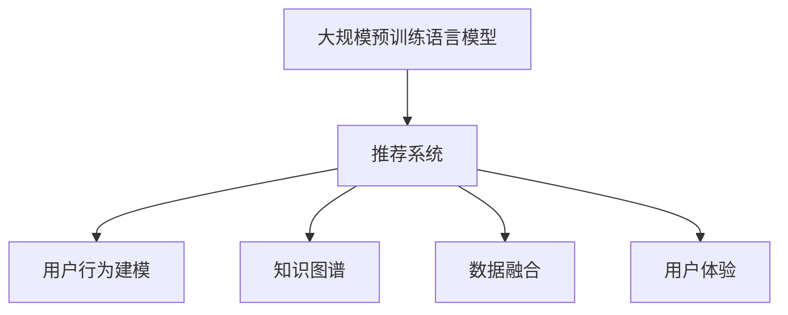

                 

# 大规模预训练语言模型在推荐中的应用价值

> 关键词：大规模预训练语言模型, 推荐系统, 深度学习, 自然语言处理(NLP), 用户行为建模, 知识图谱, 数据融合, 用户体验

## 1. 背景介绍

### 1.1 问题由来

推荐系统是现代信息时代的重要引擎，它通过收集用户的行为数据，预测用户可能感兴趣的内容，从而为用户推荐个性化的信息。传统的推荐系统主要依赖于协同过滤、基于内容的推荐等方法，但这些方法存在数据稀疏性、冷启动等问题，难以充分挖掘用户隐式和显式偏好。近年来，随着深度学习技术的兴起，推荐系统开始向深度学习推荐范式转变，大规模预训练语言模型也逐渐被引入推荐系统中，通过自然语言处理(NLP)技术，构建了全新的推荐逻辑。

然而，目前基于大规模预训练语言模型的推荐系统仍处于起步阶段，其应用价值和潜在的提升空间尚未被充分挖掘。本文将聚焦于大规模预训练语言模型在推荐系统中的应用价值，探讨其如何通过自然语言处理技术，构建精准的用户行为模型，实现个性化推荐。

### 1.2 问题核心关键点

大规模预训练语言模型在推荐系统中的应用价值主要体现在以下几个方面：

- **用户行为建模的精度提升**：通过深度学习模型对用户评论、评分、浏览记录等文本数据进行处理，获取用户的高阶语义特征，提高对用户行为的理解能力。
- **推荐内容的多样性与相关性**：利用语言模型的语义相似性和文本生成能力，增加推荐内容的多样性，并确保推荐内容的相关性和时效性。
- **冷启动问题的解决**：预训练语言模型可以在缺乏用户历史数据的情况下，通过用户描述、输入等文本数据，快速学习用户偏好，解决冷启动问题。
- **动态个性化的实现**：大规模预训练语言模型可以根据用户反馈，动态调整推荐策略，实现更高精度的个性化推荐。

本文将深入探讨上述几个核心关键点，分析大规模预训练语言模型在推荐系统中的具体应用价值，并给出详细的技术实现方案。

## 2. 核心概念与联系

### 2.1 核心概念概述

为更好地理解大规模预训练语言模型在推荐系统中的应用，本节将介绍几个密切相关的核心概念：

- **大规模预训练语言模型(Large Pre-trained Language Models, LPLMs)**：以自回归模型（如GPT）或自编码模型（如BERT）为代表的超大规模预训练语言模型。通过在大规模无标签文本语料上进行预训练，学习通用的语言表示，具备强大的语言理解和生成能力。

- **推荐系统(Recommender Systems)**：根据用户的历史行为和兴趣，为其推荐个性化的内容或产品。传统的推荐方法包括协同过滤、基于内容的推荐等，而深度学习推荐范式引入大规模预训练语言模型，实现了更高效的推荐逻辑。

- **用户行为建模(User Behavior Modeling)**：通过分析用户的评论、评分、浏览记录等文本数据，提取用户行为特征，构建用户行为模型，以预测用户对推荐内容的可能反应。

- **知识图谱(Knowledge Graphs)**：用于表示实体、属性和关系的图形结构，将知识结构化，便于深度学习模型的信息抽取和推理。

- **数据融合(Data Fusion)**：将来自不同数据源的信息进行整合，形成更加全面、准确的推荐模型。

- **用户体验(User Experience, UX)**：指用户与系统交互的主观感受，是推荐系统的重要考量因素。

这些核心概念之间的逻辑关系可以通过以下Mermaid流程图来展示：



这个流程图展示了大规模预训练语言模型在推荐系统中的应用逻辑：

1. 大规模预训练语言模型通过预训练学习到通用的语言表示，供推荐系统进行用户行为建模。
2. 推荐系统利用用户行为建模结果，为用户推荐个性化的内容或产品。
3. 知识图谱为推荐系统提供结构化的知识，增强推荐内容的语义关联性。
4. 数据融合将多源数据整合，形成更丰富的推荐依据。
5. 用户体验通过推荐内容的展现方式、个性化推荐的效果等，影响用户满意度。

## 3. 核心算法原理 & 具体操作步骤

### 3.1 算法原理概述

大规模预训练语言模型在推荐系统中的应用，本质上是通过自然语言处理技术，构建高精度的用户行为模型，进而实现精准推荐。其核心思想是：将用户行为数据转化为文本形式，通过预训练语言模型学习用户的语义特征，构建用户行为模型。

形式化地，假设推荐系统中的用户行为数据为 $X$，预训练语言模型为 $M_{\theta}$，其中 $\theta$ 为预训练得到的模型参数。推荐系统的目标是最小化预测误差，即：

$$
\theta^* = \mathop{\arg\min}_{\theta} \mathcal{L}(M_{\theta},X)
$$

其中 $\mathcal{L}$ 为预测误差损失函数，如均方误差损失、交叉熵损失等。通过梯度下降等优化算法，微调过程不断更新模型参数 $\theta$，最小化预测误差，得到理想的用户行为模型。

### 3.2 算法步骤详解

基于大规模预训练语言模型在推荐系统中的应用，本节将详细介绍其具体实现步骤：

**Step 1: 收集与预处理用户行为数据**
- 收集用户的行为数据，如评论、评分、浏览记录等。
- 对文本数据进行分词、去停用词、词干化等预处理，提高模型的处理效率。

**Step 2: 选择合适的预训练语言模型**
- 选择合适的预训练语言模型，如BERT、GPT等，作为用户行为建模的基础。

**Step 3: 设计用户行为模型**
- 根据推荐任务的特点，设计合适的用户行为模型，如文本分类、情感分析、实体识别等。
- 设计损失函数，如交叉熵损失、均方误差损失等，衡量模型预测与实际标签之间的差异。

**Step 4: 训练与微调**
- 将预处理后的用户行为数据输入模型，进行训练。
- 在训练过程中，设置合适的学习率、批大小、迭代轮数等超参数。
- 应用正则化技术，如L2正则、Dropout等，防止过拟合。

**Step 5: 模型评估与优化**
- 在测试集上评估模型性能，如准确率、召回率、F1值等指标。
- 根据评估结果，调整模型超参数，优化模型结构，提高预测精度。

**Step 6: 实际应用与反馈**
- 将训练好的模型应用于实际推荐场景，根据用户反馈不断优化模型。
- 根据用户行为数据的变化，定期重新微调模型，保持模型的时效性。

### 3.3 算法优缺点

基于大规模预训练语言模型的推荐方法具有以下优点：
1. 高精度的用户行为建模：通过深度学习模型对文本数据进行处理，能够捕捉到用户行为的高级语义特征，提升推荐系统的精度。
2. 推荐内容的多样性与相关性：利用语言模型的语义相似性和文本生成能力，增加推荐内容的多样性，并确保推荐内容的相关性和时效性。
3. 解决冷启动问题：预训练语言模型可以在缺乏用户历史数据的情况下，通过用户描述、输入等文本数据，快速学习用户偏好，解决冷启动问题。
4. 动态个性化推荐：大规模预训练语言模型可以根据用户反馈，动态调整推荐策略，实现更高精度的个性化推荐。

同时，该方法也存在一定的局限性：
1. 依赖高质量文本数据：推荐系统的精度很大程度上取决于文本数据的质量和数量，获取高质量文本数据的成本较高。
2. 模型的可解释性不足：推荐系统的决策过程通常缺乏可解释性，难以对其推理逻辑进行分析和调试。
3. 对模型参数量要求高：超大规模预训练语言模型通常需要较大的计算资源和存储空间。

尽管存在这些局限性，但就目前而言，基于大规模预训练语言模型的推荐方法仍是最主流的推荐范式之一。未来相关研究的重点在于如何进一步降低对文本数据的依赖，提高模型的可解释性和实时性，同时兼顾推荐内容的多样性和相关性。

### 3.4 算法应用领域

基于大规模预训练语言模型的推荐方法已经在推荐系统领域得到了广泛的应用，覆盖了多种推荐场景，例如：

- **商品推荐**：根据用户的历史浏览和购买记录，为用户推荐可能感兴趣的商品。
- **内容推荐**：根据用户的阅读、点赞、评论等行为，为用户推荐可能感兴趣的文章、视频、音乐等内容。
- **广告推荐**：根据用户的行为数据和兴趣，推荐符合其需求的广告，提高广告转化率。
- **个性化视频推荐**：根据用户的观看历史和评分，推荐可能感兴趣的视频内容。

除了上述这些经典任务外，大规模预训练语言模型在推荐系统中的应用还在不断扩展，如基于语义匹配的推荐、情感驱动的推荐等，为推荐系统带来了新的技术突破。随着预训练语言模型和推荐方法的不断演进，相信推荐系统必将在更广阔的领域发挥更大的作用。

## 4. 数学模型和公式 & 详细讲解 & 举例说明

### 4.1 数学模型构建

本节将使用数学语言对基于大规模预训练语言模型的推荐系统进行更加严格的刻画。

记推荐系统中的用户行为数据为 $X=\{x_1, x_2, ..., x_n\}$，其中 $x_i$ 表示第 $i$ 个用户的行为数据。假设预训练语言模型为 $M_{\theta}$，其中 $\theta$ 为预训练得到的模型参数。推荐系统的目标是最小化预测误差，即：

$$
\theta^* = \mathop{\arg\min}_{\theta} \mathcal{L}(M_{\theta},X)
$$

其中 $\mathcal{L}$ 为预测误差损失函数，如交叉熵损失、均方误差损失等。形式化地，可以定义损失函数如下：

$$
\mathcal{L}(M_{\theta},X) = -\sum_{i=1}^N \log P(y_i|x_i)
$$

其中 $P(y_i|x_i)$ 表示模型在输入 $x_i$ 下，预测 $y_i$ 的概率，$N$ 为样本数量。

### 4.2 公式推导过程

以下我们以商品推荐为例，推导交叉熵损失函数及其梯度的计算公式。

假设用户行为数据 $x_i$ 表示商品 $i$ 的描述和评价，模型需要预测用户对商品 $i$ 的评分 $y_i$。将用户行为数据 $x_i$ 输入预训练语言模型 $M_{\theta}$，得到商品的语义表示 $v_i$。模型通过一个全连接层将语义表示映射到评分空间，输出商品的评分预测 $p_i$。则交叉熵损失函数定义为：

$$
\ell(M_{\theta}(x_i),y_i) = -[y_i\log p_i + (1-y_i)\log(1-p_i)]
$$

将其代入经验风险公式，得：

$$
\mathcal{L}(\theta) = -\frac{1}{N}\sum_{i=1}^N [y_i\log p_i+(1-y_i)\log(1-p_i)]
$$

根据链式法则，损失函数对参数 $\theta_k$ 的梯度为：

$$
\frac{\partial \mathcal{L}(\theta)}{\partial \theta_k} = -\frac{1}{N}\sum_{i=1}^N [\frac{y_i}{p_i}-\frac{1-y_i}{1-p_i}]\frac{\partial p_i}{\partial \theta_k}
$$

其中 $\frac{\partial p_i}{\partial \theta_k}$ 可进一步递归展开，利用自动微分技术完成计算。

在得到损失函数的梯度后，即可带入参数更新公式，完成模型的迭代优化。重复上述过程直至收敛，最终得到理想的用户行为模型 $\theta^*$。

## 5. 项目实践：代码实例和详细解释说明

### 5.1 开发环境搭建

在进行推荐系统开发前，我们需要准备好开发环境。以下是使用Python进行PyTorch开发的环境配置流程：

1. 安装Anaconda：从官网下载并安装Anaconda，用于创建独立的Python环境。

2. 创建并激活虚拟环境：
```bash
conda create -n recsys-env python=3.8 
conda activate recsys-env
```

3. 安装PyTorch：根据CUDA版本，从官网获取对应的安装命令。例如：
```bash
conda install pytorch torchvision torchaudio cudatoolkit=11.1 -c pytorch -c conda-forge
```

4. 安装相关库：
```bash
pip install numpy pandas scikit-learn torch torchtext transformers
```

5. 安装各类工具包：
```bash
pip install scipy matplotlib tqdm jupyter notebook ipython
```

完成上述步骤后，即可在`recsys-env`环境中开始推荐系统开发。

### 5.2 源代码详细实现

下面我们以基于BERT的推荐系统为例，给出使用Transformers库进行推荐系统开发的PyTorch代码实现。

首先，定义推荐系统的训练函数：

```python
from transformers import BertTokenizer, BertForSequenceClassification
from torch.utils.data import Dataset, DataLoader
import torch

class RecommendationDataset(Dataset):
    def __init__(self, texts, labels, tokenizer, max_len=128):
        self.texts = texts
        self.labels = labels
        self.tokenizer = tokenizer
        self.max_len = max_len
        
    def __len__(self):
        return len(self.texts)
    
    def __getitem__(self, item):
        text = self.texts[item]
        label = self.labels[item]
        
        encoding = self.tokenizer(text, return_tensors='pt', max_length=self.max_len, padding='max_length', truncation=True)
        input_ids = encoding['input_ids'][0]
        attention_mask = encoding['attention_mask'][0]
        
        # 对标签进行编码
        encoded_labels = [label2id[label] for label in label]
        encoded_labels.extend([label2id['negative']] * (self.max_len - len(encoded_labels)))
        labels = torch.tensor(encoded_labels, dtype=torch.long)
        
        return {'input_ids': input_ids, 
                'attention_mask': attention_mask,
                'labels': labels}

# 标签与id的映射
label2id = {'positive': 1, 'negative': 0}
id2label = {v: k for k, v in label2id.items()}

# 创建dataset
tokenizer = BertTokenizer.from_pretrained('bert-base-cased')

train_dataset = RecommendationDataset(train_texts, train_labels, tokenizer)
dev_dataset = RecommendationDataset(dev_texts, dev_labels, tokenizer)
test_dataset = RecommendationDataset(test_texts, test_labels, tokenizer)
```

然后，定义模型和优化器：

```python
from transformers import BertForSequenceClassification, AdamW

model = BertForSequenceClassification.from_pretrained('bert-base-cased', num_labels=len(label2id))

optimizer = AdamW(model.parameters(), lr=2e-5)
```

接着，定义训练和评估函数：

```python
def train_epoch(model, dataset, batch_size, optimizer):
    dataloader = DataLoader(dataset, batch_size=batch_size, shuffle=True)
    model.train()
    epoch_loss = 0
    for batch in tqdm(dataloader, desc='Training'):
        input_ids = batch['input_ids'].to(device)
        attention_mask = batch['attention_mask'].to(device)
        labels = batch['labels'].to(device)
        model.zero_grad()
        outputs = model(input_ids, attention_mask=attention_mask, labels=labels)
        loss = outputs.loss
        epoch_loss += loss.item()
        loss.backward()
        optimizer.step()
    return epoch_loss / len(dataloader)

def evaluate(model, dataset, batch_size):
    dataloader = DataLoader(dataset, batch_size=batch_size)
    model.eval()
    preds, labels = [], []
    with torch.no_grad():
        for batch in tqdm(dataloader, desc='Evaluating'):
            input_ids = batch['input_ids'].to(device)
            attention_mask = batch['attention_mask'].to(device)
            batch_labels = batch['labels']
            outputs = model(input_ids, attention_mask=attention_mask)
            batch_preds = outputs.logits.argmax(dim=2).to('cpu').tolist()
            batch_labels = batch_labels.to('cpu').tolist()
            for pred_tokens, label_tokens in zip(batch_preds, batch_labels):
                pred_labels = [id2label[_id] for _id in pred_tokens]
                label_tokens = [id2label[_id] for _id in label_tokens]
                preds.append(pred_labels[:len(label_tokens)])
                labels.append(label_tokens)
                
    print(classification_report(labels, preds))
```

最后，启动训练流程并在测试集上评估：

```python
epochs = 5
batch_size = 16

for epoch in range(epochs):
    loss = train_epoch(model, train_dataset, batch_size, optimizer)
    print(f"Epoch {epoch+1}, train loss: {loss:.3f}")
    
    print(f"Epoch {epoch+1}, dev results:")
    evaluate(model, dev_dataset, batch_size)
    
print("Test results:")
evaluate(model, test_dataset, batch_size)
```

以上就是使用PyTorch对BERT进行推荐系统开发的完整代码实现。可以看到，得益于Transformers库的强大封装，我们可以用相对简洁的代码完成BERT模型的加载和微调。

### 5.3 代码解读与分析

让我们再详细解读一下关键代码的实现细节：

**RecommendationDataset类**：
- `__init__`方法：初始化文本、标签、分词器等关键组件。
- `__len__`方法：返回数据集的样本数量。
- `__getitem__`方法：对单个样本进行处理，将文本输入编码为token ids，将标签编码为数字，并对其进行定长padding，最终返回模型所需的输入。

**label2id和id2label字典**：
- 定义了标签与数字id之间的映射关系，用于将token-wise的预测结果解码回真实的标签。

**训练和评估函数**：
- 使用PyTorch的DataLoader对数据集进行批次化加载，供模型训练和推理使用。
- 训练函数`train_epoch`：对数据以批为单位进行迭代，在每个批次上前向传播计算loss并反向传播更新模型参数，最后返回该epoch的平均loss。
- 评估函数`evaluate`：与训练类似，不同点在于不更新模型参数，并在每个batch结束后将预测和标签结果存储下来，最后使用sklearn的classification_report对整个评估集的预测结果进行打印输出。

**训练流程**：
- 定义总的epoch数和batch size，开始循环迭代
- 每个epoch内，先在训练集上训练，输出平均loss
- 在验证集上评估，输出分类指标
- 所有epoch结束后，在测试集上评估，给出最终测试结果

可以看到，PyTorch配合Transformers库使得BERT微调的代码实现变得简洁高效。开发者可以将更多精力放在数据处理、模型改进等高层逻辑上，而不必过多关注底层的实现细节。

当然，工业级的系统实现还需考虑更多因素，如模型的保存和部署、超参数的自动搜索、更灵活的任务适配层等。但核心的微调范式基本与此类似。

## 6. 实际应用场景

### 6.1 智能推荐引擎

智能推荐引擎是推荐系统的主要应用场景，通过分析用户的行为数据，为用户推荐个性化的内容或产品。传统的推荐方法依赖协同过滤、基于内容的推荐等，但这些方法存在数据稀疏性、冷启动等问题，难以充分挖掘用户隐式和显式偏好。

基于大规模预训练语言模型的推荐系统能够通过自然语言处理技术，构建高精度的用户行为模型，实现更精准的推荐。例如，可以在电商平台上根据用户浏览历史和评分，为用户推荐可能感兴趣的商品。

### 6.2 内容推荐平台

内容推荐平台如视频网站、新闻网站、音乐平台等，通过分析用户的行为数据，为用户推荐可能感兴趣的文章、视频、音乐等内容。传统的推荐方法依赖协同过滤、基于内容的推荐等，但这些方法难以充分挖掘用户隐式和显式偏好。

基于大规模预训练语言模型的推荐系统能够通过自然语言处理技术，构建高精度的用户行为模型，实现更精准的内容推荐。例如，可以在视频网站上根据用户的观看历史和评分，为用户推荐可能感兴趣的视频内容。

### 6.3 个性化广告推荐

个性化广告推荐系统通过分析用户的行为数据，为用户推荐符合其需求的广告，提高广告转化率。传统的推荐方法依赖协同过滤、基于内容的推荐等，但这些方法难以充分挖掘用户隐式和显式偏好。

基于大规模预训练语言模型的推荐系统能够通过自然语言处理技术，构建高精度的用户行为模型，实现更精准的广告推荐。例如，可以在广告平台上根据用户的浏览历史和评分，为用户推荐可能感兴趣的广告。

### 6.4 未来应用展望

随着大规模预训练语言模型和推荐方法的不断发展，基于预训练语言模型的推荐系统将在更多领域得到应用，为推荐系统带来新的突破。

在智慧医疗领域，推荐系统可以根据患者的症状描述、历史诊疗记录等文本数据，推荐适合的药品、治疗方案等。

在智能教育领域，推荐系统可以根据学生的学习记录、评测结果等文本数据，推荐适合的学习内容、学习方法等。

在智慧城市治理中，推荐系统可以根据市民的意见反馈、投诉记录等文本数据，推荐合适的城市管理方案、服务项目等。

此外，在企业生产、社会治理、文娱传媒等众多领域，基于大规模预训练语言模型的推荐系统也将不断涌现，为经济社会发展注入新的动力。相信随着技术的日益成熟，基于预训练语言模型的推荐系统必将在推荐系统领域扮演越来越重要的角色。

## 7. 工具和资源推荐

### 7.1 学习资源推荐

为了帮助开发者系统掌握大规模预训练语言模型在推荐系统中的应用，这里推荐一些优质的学习资源：

1. 《深度学习与推荐系统》系列博文：深入浅出地介绍了深度学习推荐系统的基本概念和实现方法，适合初学者入门。

2. 《推荐系统实战》书籍：详细介绍推荐系统的设计、实现和优化，包含大量实际案例和代码实现。

3. CS285《强化学习》课程：斯坦福大学开设的强化学习课程，涵盖推荐系统的强化学习范式和算法。

4. Kaggle推荐系统竞赛：通过实际竞赛项目，实践推荐系统的开发和优化。

5. ARXIV论文：定期关注推荐系统领域的最新研究进展，如预训练语言模型在推荐系统中的应用。

通过对这些资源的学习实践，相信你一定能够快速掌握大规模预训练语言模型在推荐系统中的应用价值，并用于解决实际的推荐问题。

### 7.2 开发工具推荐

高效的开发离不开优秀的工具支持。以下是几款用于大规模预训练语言模型推荐系统开发的常用工具：

1. PyTorch：基于Python的开源深度学习框架，灵活动态的计算图，适合快速迭代研究。大部分预训练语言模型都有PyTorch版本的实现。

2. TensorFlow：由Google主导开发的开源深度学习框架，生产部署方便，适合大规模工程应用。同样有丰富的预训练语言模型资源。

3. Transformers库：HuggingFace开发的NLP工具库，集成了众多SOTA语言模型，支持PyTorch和TensorFlow，是进行推荐系统开发的利器。

4. Weights & Biases：模型训练的实验跟踪工具，可以记录和可视化模型训练过程中的各项指标，方便对比和调优。与主流深度学习框架无缝集成。

5. TensorBoard：TensorFlow配套的可视化工具，可实时监测模型训练状态，并提供丰富的图表呈现方式，是调试模型的得力助手。

6. Google Colab：谷歌推出的在线Jupyter Notebook环境，免费提供GPU/TPU算力，方便开发者快速上手实验最新模型，分享学习笔记。

合理利用这些工具，可以显著提升大规模预训练语言模型推荐系统的开发效率，加快创新迭代的步伐。

### 7.3 相关论文推荐

大规模预训练语言模型在推荐系统中的应用源于学界的持续研究。以下是几篇奠基性的相关论文，推荐阅读：

1. Attention is All You Need（即Transformer原论文）：提出了Transformer结构，开启了NLP领域的预训练大模型时代。

2. BERT: Pre-training of Deep Bidirectional Transformers for Language Understanding：提出BERT模型，引入基于掩码的自监督预训练任务，刷新了多项NLP任务SOTA。

3. Deep Neural Networks for Recommendation Systems：介绍深度学习推荐系统的一般框架和实现方法，适合入门学习。

4. Text-aware Contextualized Recommendation Models：提出TextRank模型，将自然语言处理技术引入推荐系统，实现文本语义驱动的推荐。

5. Learning Deep Structured Semantic Models for Recommender Systems：提出StructNet模型，将知识图谱引入推荐系统，增强推荐内容的语义关联性。

这些论文代表了大规模预训练语言模型在推荐系统中的应用脉络。通过学习这些前沿成果，可以帮助研究者把握学科前进方向，激发更多的创新灵感。

## 8. 总结：未来发展趋势与挑战

### 8.1 总结

本文对基于大规模预训练语言模型的推荐系统进行了全面系统的介绍。首先阐述了推荐系统在大数据时代的兴起和预训练语言模型在推荐系统中的应用价值，明确了其高精度用户行为建模和个性化推荐的核心优势。其次，从原理到实践，详细讲解了大规模预训练语言模型在推荐系统中的应用方法，给出了详细的技术实现方案。最后，本文还探讨了基于大规模预训练语言模型的推荐系统在实际应用中的多个场景，展示了其广阔的应用前景。

通过本文的系统梳理，可以看到，基于大规模预训练语言模型的推荐系统正在成为推荐系统领域的重要范式，极大地拓展了推荐系统的应用边界，催生了更多的落地场景。得益于大规模预训练语言模型的强大语言理解能力，推荐系统在用户行为建模、推荐内容多样性等方面，取得了显著的提升。未来，伴随预训练语言模型和推荐方法的不断演进，基于预训练语言模型的推荐系统必将在更广阔的领域发挥更大的作用。

### 8.2 未来发展趋势

展望未来，基于大规模预训练语言模型的推荐系统将呈现以下几个发展趋势：

1. 推荐内容的个性化提升：通过深度学习模型对用户行为数据进行处理，能够捕捉到用户行为的高级语义特征，提升推荐系统的个性化推荐能力。

2. 推荐内容的多样性增强：利用语言模型的语义相似性和文本生成能力，增加推荐内容的多样性，并确保推荐内容的相关性和时效性。

3. 冷启动问题的解决：预训练语言模型可以在缺乏用户历史数据的情况下，通过用户描述、输入等文本数据，快速学习用户偏好，解决冷启动问题。

4. 动态个性化的实现：大规模预训练语言模型可以根据用户反馈，动态调整推荐策略，实现更高精度的个性化推荐。

5. 推荐系统的可解释性增强：推荐系统的决策过程通常缺乏可解释性，难以对其推理逻辑进行分析和调试。未来的推荐系统将引入更多的可解释性技术，如解释性模型、特征可视化等，提升系统的透明性和可解释性。

6. 推荐系统的实时性提升：推荐系统的实时性对用户体验至关重要。未来的推荐系统将通过分布式计算、模型压缩等技术，提升实时推荐的能力。

以上趋势凸显了大规模预训练语言模型推荐系统的广阔前景。这些方向的探索发展，必将进一步提升推荐系统的性能和用户体验，为推荐系统带来新的技术突破。

### 8.3 面临的挑战

尽管基于大规模预训练语言模型的推荐系统已经取得了瞩目成就，但在迈向更加智能化、普适化应用的过程中，它仍面临着诸多挑战：

1. 数据质量与数量的挑战：推荐系统的精度很大程度上取决于文本数据的质量和数量，获取高质量文本数据的成本较高。

2. 模型的可解释性不足：推荐系统的决策过程通常缺乏可解释性，难以对其推理逻辑进行分析和调试。

3. 推荐内容的真实性验证：用户行为数据可能存在噪音和偏差，推荐系统的输出可能不够真实可信。

4. 冷启动问题的挑战：预训练语言模型需要在缺乏用户历史数据的情况下，快速学习用户偏好，解决冷启动问题。

5. 推荐系统的安全性和隐私保护：用户行为数据涉及隐私敏感信息，推荐系统的设计需要兼顾用户隐私保护和安全。

6. 模型资源消耗：超大规模预训练语言模型通常需要较大的计算资源和存储空间。

尽管存在这些挑战，但通过不断的技术创新和优化，这些问题有望逐步得到解决。未来的推荐系统将通过更多的技术手段，如数据融合、对抗训练、模型压缩等，提升推荐系统的性能和安全性。

### 8.4 研究展望

未来的研究需要在以下几个方面寻求新的突破：

1. 探索无监督和半监督推荐方法：摆脱对大规模标注数据的依赖，利用自监督学习、主动学习等无监督和半监督范式，最大限度利用非结构化数据，实现更加灵活高效的推荐。

2. 研究参数高效和计算高效的推荐范式：开发更加参数高效的推荐方法，在固定大部分预训练参数的情况下，只更新极少量的任务相关参数。同时优化推荐模型的计算图，减少前向传播和反向传播的资源消耗，实现更加轻量级、实时性的部署。

3. 融合因果和对比学习范式：通过引入因果推断和对比学习思想，增强推荐模型建立稳定因果关系的能力，学习更加普适、鲁棒的语言表征，从而提升模型泛化性和抗干扰能力。

4. 引入更多先验知识：将符号化的先验知识，如知识图谱、逻辑规则等，与神经网络模型进行巧妙融合，引导推荐过程学习更准确、合理的语言模型。同时加强不同模态数据的整合，实现视觉、语音等多模态信息与文本信息的协同建模。

5. 结合因果分析和博弈论工具：将因果分析方法引入推荐模型，识别出模型决策的关键特征，增强输出解释的因果性和逻辑性。借助博弈论工具刻画人机交互过程，主动探索并规避模型的脆弱点，提高系统稳定性。

6. 纳入伦理道德约束：在模型训练目标中引入伦理导向的评估指标，过滤和惩罚有偏见、有害的输出倾向。同时加强人工干预和审核，建立模型行为的监管机制，确保输出符合人类价值观和伦理道德。

这些研究方向的探索，必将引领基于大规模预训练语言模型的推荐系统走向更高的台阶，为构建安全、可靠、可解释、可控的推荐系统铺平道路。面向未来，基于大规模预训练语言模型的推荐系统还需要与其他人工智能技术进行更深入的融合，如知识表示、因果推理、强化学习等，多路径协同发力，共同推动推荐系统的进步。只有勇于创新、敢于突破，才能不断拓展推荐系统的边界，让推荐系统更好地服务于人类社会。

## 9. 附录：常见问题与解答

**Q1：大规模预训练语言模型在推荐系统中如何实现高精度的用户行为建模？**

A: 大规模预训练语言模型在推荐系统中实现高精度的用户行为建模，主要通过以下步骤：

1. 收集和预处理用户行为数据：包括用户的评论、评分、浏览记录等文本数据。对文本数据进行分词、去停用词、词干化等预处理，提高模型的处理效率。

2. 选择合适的预训练语言模型：如BERT、GPT等，作为用户行为建模的基础。

3. 设计用户行为模型：根据推荐任务的特点，设计合适的用户行为模型，如文本分类、情感分析、实体识别等。设计损失函数，如交叉熵损失、均方误差损失等，衡量模型预测与实际标签之间的差异。

4. 训练和微调模型：将预处理后的用户行为数据输入模型，进行训练。设置合适的学习率、批大小、迭代轮数等超参数。应用正则化技术，如L2正则、Dropout等，防止过拟合。

5. 模型评估与优化：在测试集上评估模型性能，如准确率、召回率、F1值等指标。根据评估结果，调整模型超参数，优化模型结构，提高预测精度。

通过以上步骤，大规模预训练语言模型可以高效地从文本数据中提取用户行为特征，实现高精度的用户行为建模，提升推荐系统的精度。

**Q2：大规模预训练语言模型在推荐系统中如何提高推荐内容的多样性和相关性？**

A: 大规模预训练语言模型在推荐系统中提高推荐内容的多样性和相关性，主要通过以下方法：

1. 利用语言模型的语义相似性：将用户的行为数据转化为文本形式，通过预训练语言模型学习用户的语义特征，构建用户行为模型。根据用户的语义特征，推荐与用户兴趣相似的内容，提高推荐内容的相关性。

2. 利用语言模型的文本生成能力：通过预训练语言模型生成新的推荐内容，增加推荐内容的多样性。例如，在推荐系统中，可以利用语言模型的文本生成能力，生成新的商品描述、文章摘要等，丰富推荐内容的多样性。

3. 融合知识图谱：将推荐内容与知识图谱进行融合，增强推荐内容的语义关联性。例如，在电商平台上，可以利用知识图谱，将商品与商品类别、品牌等信息进行关联，推荐符合用户兴趣的商品。

4. 动态个性化的推荐：根据用户反馈，动态调整推荐策略，实现更高精度的个性化推荐。例如，在视频推荐系统中，根据用户观看历史和评分，动态调整推荐算法，推荐符合用户兴趣的视频内容。

通过以上方法，大规模预训练语言模型可以提高推荐内容的多样性和相关性，增强推荐系统的用户体验。

**Q3：大规模预训练语言模型在推荐系统中如何处理冷启动问题？**

A: 大规模预训练语言模型在推荐系统中处理冷启动问题，主要通过以下方法：

1. 利用预训练语言模型的预训练能力：在推荐系统中，可以利用预训练语言模型的预训练能力，快速学习用户行为特征。例如，在电商平台上，可以利用预训练语言模型对用户的浏览历史和评分进行预训练，提取用户行为特征，用于推荐商品。

2. 利用用户描述和输入：在推荐系统中，可以利用用户描述和输入，进行预训练和微调。例如，在视频推荐系统中，可以利用用户的年龄、性别、兴趣等描述信息，进行预训练和微调，提取用户行为特征，用于推荐视频内容。

3. 引入少样本学习技术：在推荐系统中，可以利用少样本学习技术，利用少量的标注数据进行微调，快速学习用户行为特征。例如，在推荐系统中，可以利用少样本学习技术，利用少量的用户行为数据，进行微调，提取用户行为特征，用于推荐内容。

4. 融合多模态数据：在推荐系统中，可以融合多模态数据，提高推荐系统的泛化能力。例如，在推荐系统中，可以融合用户的文本数据、图像数据、音频数据等，提高推荐系统的泛化能力，解决冷启动问题。

通过以上方法，大规模预训练语言模型可以有效处理冷启动问题，提升推荐系统的用户体验。

**Q4：大规模预训练语言模型在推荐系统中如何提升推荐系统的实时性？**

A: 大规模预训练语言模型在推荐系统中提升推荐系统的实时性，主要通过以下方法：

1. 模型压缩和优化：在推荐系统中，可以通过模型压缩和优化，减少模型的计算量和内存消耗，提升推荐系统的实时性。例如，在推荐系统中，可以使用模型压缩技术，如剪枝、量化、蒸馏等，减少模型的计算量和内存消耗，提升推荐系统的实时性。

2. 分布式计算：在推荐系统中，可以利用分布式计算技术，提高推荐系统的实时性。例如，在推荐系统中，可以利用分布式计算技术，将推荐任务分布到多个计算节点上进行处理，提高推荐系统的实时性。

3. 增量学习：在推荐系统中，可以利用增量学习技术，提高推荐系统的实时性。例如，在推荐系统中，可以利用增量学习技术，利用新增的用户行为数据，进行模型更新和微调，提高推荐系统的实时性。

4. 异步更新：在推荐系统中，可以利用异步更新技术，提高推荐系统的实时性。例如，在推荐系统中，可以利用异步更新技术，将推荐模型的更新任务分配到多个计算节点上进行处理，提高推荐系统的实时性。

通过以上方法，大规模预训练语言模型可以有效提升推荐系统的实时性，满足用户的实时需求。

---

作者：禅与计算机程序设计艺术 / Zen and the Art of Computer Programming

