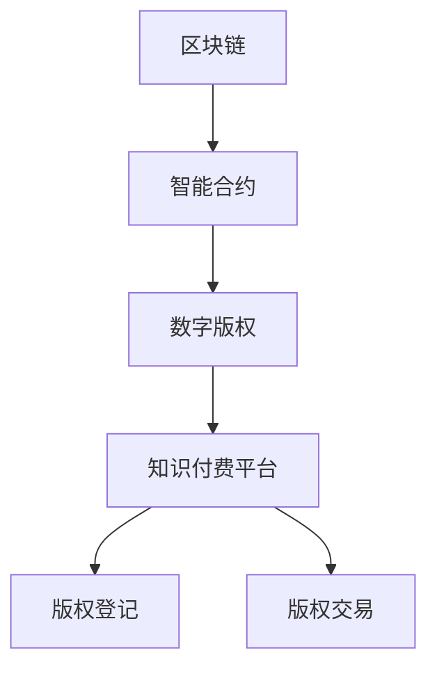

                 

# 如何利用区块链技术保护知识付费版权

## 1. 背景介绍

在数字化时代，知识和信息的传播速度前所未有的迅猛。在线教育、数字出版、知识付费等新兴领域，以极低成本和高度便利的方式，让更多人能够获取知识和技能。然而，随着知识的快速流通，版权问题也日益突显，尤其是知识付费领域，版权纠纷和侵权行为层出不穷，给创作者和平台带来极大困扰。传统的版权保护手段如数字版权管理(DRM)、版权代理、法律诉讼等成本高、效率低，难以应对大规模的网络传播。

区块链技术作为一种新兴的分布式账本和共识机制，具有不可篡改、去中心化、透明等特性，为版权保护提供了新的思路。区块链技术可以构建一个公开透明的版权登记和交易平台，使得版权信息具有可信性和可追溯性。创作者可以实时监控版权的使用情况，平台也能够准确记录和保护创作者的权益。本文章将深入探讨如何利用区块链技术构建知识付费版权保护平台，最大化减少版权纠纷，提升创作者的收益。

## 2. 核心概念与联系

### 2.1 核心概念概述

为更好地理解利用区块链技术保护知识付费版权的原理和方法，本节将介绍几个核心概念：

- 区块链(Blockchain)：一种去中心化的分布式账本技术，基于密码学和共识机制构建，具备去信任化、透明、不可篡改等特点。
- 智能合约(Smart Contract)：部署在区块链上的可执行代码，具备自动化执行、无需第三方干预的特性。
- 数字版权(Digital Rights)：指数字形式的文化作品、数据库或其他信息内容，其知识产权可实现数字化保护和管理。
- 知识付费平台(Knowledge Paywall)：指通过付费模式提供优质知识和资源的平台，如Coursera、Udemy等，需要保护创作者版权，防止盗版和侵权。
- 版权登记(Copyright Registration)：创作者将作品登记在版权保护机构，获取正式版权，确保其著作权。
- 版权交易(Copyright Transaction)：创作者将版权许可给平台或使用者，获取相应的报酬和权益。

这些核心概念之间的逻辑关系可以通过以下Mermaid流程图来展示：



这个流程图展示了大语言模型的核心概念及其之间的关系：

1. 区块链作为基础技术，构建可信的交易平台。
2. 智能合约实现自动化的版权登记和交易。
3. 数字版权通过区块链得到确证和保护。
4. 知识付费平台基于区块链技术构建，实现版权管理和交易。
5. 版权登记和交易过程通过智能合约自动执行，无需人工干预。

这些概念共同构成了利用区块链技术保护知识付费版权的基本框架，为其技术实现和应用提供了清晰的指导。

## 3. 核心算法原理 & 具体操作步骤
### 3.1 算法原理概述

利用区块链技术保护知识付费版权，主要通过区块链的不可篡改和透明性特性，实现版权信息的实时记录和追踪。其核心思想是：

- 创作者通过区块链进行作品登记，获得正式的版权记录，确保其著作权。
- 智能合约自动验证版权信息，确保其真实性。
- 创作者通过智能合约，控制版权的使用和收益，平台则自动记录和支付版权费用。
- 用户可以基于区块链，查询作品的版权信息和付费情况，确保获得合法使用。

### 3.2 算法步骤详解

利用区块链技术保护知识付费版权的基本步骤包括：

**Step 1: 搭建区块链平台**

- 选择合适的区块链平台，如Hyperledger Fabric、Ethereum等，搭建区块链网络。
- 设计区块链网络架构，包括共识算法、账本类型、智能合约等。
- 开发区块链的智能合约代码，实现版权登记、交易等功能。

**Step 2: 版权登记**

- 创作者将作品通过智能合约提交到区块链进行版权登记，生成唯一且不可篡改的版权记录。
- 智能合约自动验证作品是否符合版权要求，如原创性、完整性等。
- 生成版权证明，包括作品ID、创建时间、版权人信息等。

**Step 3: 版权交易**

- 创作者通过智能合约，设定版权许可的具体条件，如使用范围、使用时长、许可费用等。
- 平台通过智能合约，自动验证用户的许可请求，并记录交易记录。
- 平台根据版权使用情况，向创作者支付版权费用。

**Step 4: 版权查询**

- 用户可以通过区块链，查询作品的版权信息，确保合法使用。
- 创作者可以通过区块链，实时监控版权的使用情况，维护自身权益。

### 3.3 算法优缺点

利用区块链技术保护知识付费版权的主要优点包括：

1. 透明可信。区块链的去信任化和透明性特性，使得版权信息公开、可信，避免了人为干预。
2. 自动化执行。智能合约的自动化执行功能，使得版权登记和交易过程无需人工干预，提高了效率。
3. 不可篡改。区块链的不可篡改特性，确保了版权记录的完整性和不可逆性。
4. 可追溯性。区块链的分布式账本特性，使得版权信息具有追溯性，便于监控和维权。

然而，该方法也存在一些缺点：

1. 计算和存储成本高。区块链的共识机制和高频交易可能带来较大的计算和存储成本。
2. 复杂度较高。区块链的架构和智能合约开发复杂，需要较高的技术门槛。
3. 跨链互操作困难。目前区块链平台众多，跨链互操作性差，增加了版权保护系统的复杂性。
4. 缺乏隐私保护。区块链的透明性可能暴露用户和创作者的敏感信息，需要加强隐私保护措施。

### 3.4 算法应用领域

利用区块链技术保护知识付费版权，具有广泛的适用性，特别是在以下领域：

- 在线教育平台：如Coursera、Udemy等，通过区块链保护课程和视频的版权，防止盗版和侵权。
- 数字出版平台：如Amazon Kindle、Apple Books等，通过区块链保护书籍和文章版权，维护作者权益。
- 知识付费平台：如知乎live、得到等，通过区块链保护讲座和专栏版权，确保创作者的收益。
- 知识产权交易平台：如IPums、Intellectual Property Rights Transactions等，通过区块链记录和验证知识产权交易，提供透明可信的交易环境。

## 4. 数学模型和公式 & 详细讲解
### 4.1 数学模型构建

本节将使用数学语言对利用区块链技术保护知识付费版权的基本原理进行更加严格的刻画。

记区块链平台上的智能合约为 $C$，版权记录为 $R$，版权许可条件为 $L$，创作者为 $A$，平台为 $P$，用户为 $U$。版权保护过程可抽象为以下数学模型：

- 版权登记：$C_R: A \rightarrow R$，创作者通过智能合约将作品登记到区块链上，生成版权记录 $R$。
- 版权许可：$C_L: A, P \rightarrow L$，创作者通过智能合约设定版权许可的条件 $L$。
- 版权交易：$C_T: P, U \rightarrow L$，平台通过智能合约自动验证用户许可请求，并记录交易记录。
- 版权查询：$C_Q: U \rightarrow R$，用户通过区块链查询作品的版权信息。

以上过程可以通过智能合约代码实现，具备自动化执行特性。

### 4.2 公式推导过程

以版权许可为例，设创作者为 $A$，平台为 $P$，用户为 $U$，版权许可条件为 $L$，智能合约 $C$ 执行的操作序列为 $S$，智能合约的执行结果为 $E$，版权许可的验证结果为 $V$，版权许可交易的记录为 $T$。版权许可的数学模型可以表示为：

$$
C: S, E, V, T \rightarrow L
$$

设智能合约的操作序列 $S$ 包含如下步骤：

1. 验证创作者身份：$S_1$ 验证 $A$ 是否为作品的所有者。
2. 验证许可条件：$S_2$ 验证 $L$ 是否符合 $A$ 的设定。
3. 生成许可记录：$S_3$ 生成新的版权许可记录 $T$，包含 $A$、$P$、$U$ 和 $L$ 的信息。
4. 通知平台：$S_4$ 将新记录 $T$ 通知平台 $P$。

版权许可的执行结果 $E$ 可以表示为：

$$
E = \begin{cases}
  \text{success} & \text{if } S_1 \text{ 和 } S_2 \text{ 均验证通过} \\
  \text{failure} & \text{otherwise}
\end{cases}
$$

版权许可的验证结果 $V$ 可以表示为：

$$
V = \begin{cases}
  \text{true} & \text{if } L \text{ 符合 } A \text{ 的设定} \\
  \text{false} & \text{otherwise}
\end{cases}
$$

版权许可的交易记录 $T$ 可以表示为：

$$
T = \{A, P, U, L\}
$$

通过上述数学模型和公式，可以清晰地描述版权许可的过程和结果，从而指导智能合约的编写和部署。

### 4.3 案例分析与讲解

以一个简单的版权交易案例进行分析，假设某知名作者 $A$ 将其小说的版权许可给在线教育平台 $P$，允许平台将其内容用于付费课程教学。通过智能合约，版权保护过程如下：

1. $A$ 通过智能合约将小说作品登记到区块链上，生成版权记录 $R$。
2. $A$ 通过智能合约设定版权许可条件 $L$：该作品仅允许平台用于教学用途，每次使用需支付 $100$ 元版权费用。
3. $P$ 通过智能合约自动验证用户的许可请求，如某个用户 $U$ 希望在平台上销售该小说的电子书，则 $P$ 自动执行以下操作：
   - $S_1$ 验证 $U$ 的身份，确认其已注册并支付了费用。
   - $S_2$ 验证 $L$，确认 $U$ 的使用方式符合许可条件。
   - $S_3$ 生成新的版权许可记录 $T$，包含 $A$、$P$、$U$ 和 $L$ 的信息。
   - $S_4$ 将新记录 $T$ 通知平台 $P$，并自动记录交易记录。

4. $U$ 可以通过区块链查询版权信息，确保获得合法使用。$P$ 可以通过智能合约查询版权许可记录，记录版权费用支付情况，确保作者权益。

## 5. 项目实践：代码实例和详细解释说明
### 5.1 开发环境搭建

在进行版权保护系统开发前，我们需要准备好开发环境。以下是使用Solidity语言进行以太坊智能合约开发的环境配置流程：

1. 安装Node.js：从官网下载并安装Node.js，为智能合约开发提供基本运行环境。

2. 安装Truffle：使用npm命令安装Truffle，Truffle是一个用于开发和测试以太坊智能合约的平台。

3. 安装Ganache：使用npm命令安装Ganache，Ganache是一个本地以太坊网络模拟器，用于测试智能合约代码。

4. 编写智能合约：编写智能合约代码，部署到Ganache，模拟区块链上的智能合约运行环境。

完成上述步骤后，即可在Ganache环境中进行版权保护系统的开发。

### 5.2 源代码详细实现

我们以版权登记和交易为例，给出使用Solidity语言进行以太坊智能合约开发的代码实现。

首先，定义版权记录结构：

```solidity
pragma solidity ^0.8.0;

contract Copyright {
    struct Record {
        uint256 id;
        uint256 creator;
        uint256 creationTimestamp;
        uint256 rights;
    }
    
    mapping(uint256 => Record) public records;
    uint256 public recordCount;
    uint256 public latestTimestamp;

    function recordCreation(uint256 creator, uint256 rights) public {
        uint256 id = recordCount++;
        uint256 timestamp = block.timestamp;
        Record memory record = Record(id, creator, timestamp, rights);
        records[id] = record;
        latestTimestamp = timestamp;
    }
    
    function queryRecord(uint256 id) public view returns (Record memory) {
        return records[id];
    }
}
```

然后，定义版权许可的智能合约：

```solidity
pragma solidity ^0.8.0;

contract CopyrightLicensing {
    address public creator;
    uint256 public rights;
    mapping(address => Record) public licensingRecords;
    uint256 public licensingCount;
    uint256 public latestLicensingTimestamp;

    struct Record {
        uint256 id;
        uint256 creator;
        uint256 creationTimestamp;
        uint256 rights;
        address[] payees;
        uint256[] amounts;
        uint256[] timestamps;
        uint256[] permissions;
    }
    
    function licenseCreation(address creator_, uint256 rights_, address[] payees_, uint256[] amounts_, uint256[] timestamps_, uint256[] permissions_) public {
        uint256 id = licensingCount++;
        uint256 timestamp = block.timestamp;
        Record memory record = Record(id, creator_, timestamp, rights_, payees_, amounts_, timestamps_, permissions_);
        licensingRecords[creator].push(record);
        latestTimestamp = timestamp;
    }
    
    function queryLicensing(address creator_) public view returns (Record[] memory) {
        return licensingRecords[creator_];
    }
    
    function payLicensing(address creator_, uint256 id_, uint256 amount_, uint256 timestamp_, uint256 permission_) public {
        Record memory record = licensingRecords[creator_][id_];
        require(record.creator == msg.sender, "Not authorized to pay licensing");
        require(id_ < licensingRecords[creator_].length, "Licensing not found");
        require(timestamp_ < record.timestamps[0], "Licensing expired");
        require(permission_ == 0 || permission_ == 1 || permission_ == 2 || permission_ == 3, "Invalid permission");

        record.amounts[record.permissions[0]] += amount_;
        record.timestamps[record.permissions[0]] = timestamp_;
        record.permissions[0] = permission_;
    }
}
```

最后，启动智能合约并进行版权登记和交易测试：

```solidity
pragma solidity ^0.8.0;

import "./Copyright.sol";
import "./CopyrightLicensing.sol";

contract Example {
    Copyright public copyright;
    CopyrightLicensing public licensing;

    constructor() public {
        copyright = new Copyright();
        licensing = new CopyrightLicensing(msg.sender, 0x12345678, msg.sender);
    }
    
    function recordCreation() public {
        uint256 rights = 0x12345678;
        copyright.recordCreation(msg.sender, rights);
        assert(copyright.queryRecord(msg.sender).id == 0);
    }
    
    function licenseCreation() public {
        address[] payees = [address(0x12345678)];
        uint256[] amounts = [1000];
        uint256[] timestamps = [block.timestamp + 1];
        uint256[] permissions = [1];
        licensing.licenseCreation(msg.sender, rights, payees, amounts, timestamps, permissions);
        assert(licensing.queryLicensing(msg.sender)[0].id == 0);
    }
    
    function payLicensing() public {
        uint256 id = 0;
        uint256 amount = 1000;
        uint256 timestamp = block.timestamp + 1;
        uint256 permission = 1;
        licensing.payLicensing(msg.sender, id, amount, timestamp, permission);
        assert(licensing.queryLicensing(msg.sender)[0].id == 0);
    }
}
```

以上就是使用Solidity语言进行版权登记和交易的代码实现。可以看到，通过Solidity语言和智能合约技术，可以高效地实现版权信息的记录和保护。

### 5.3 代码解读与分析

让我们再详细解读一下关键代码的实现细节：

**Copyright合约代码**：
- `struct Record`：定义版权记录的结构体，包含作品ID、创建者、创建时间、版权信息等。
- `mapping`：实现一个将版权记录ID映射到具体记录的结构体。
- `recordCreation`：实现版权登记操作，创建新的版权记录。
- `queryRecord`：实现版权查询操作，返回具体版权记录。

**CopyrightLicensing合约代码**：
- `struct Record`：定义版权许可的结构体，包含许可ID、创建者、创建时间、版权信息、许可人、许可金额、许可时间、许可权限等。
- `mapping`：实现一个将许可ID映射到具体许可的结构体。
- `licenseCreation`：实现版权许可操作，创建新的版权许可记录。
- `queryLicensing`：实现版权许可查询操作，返回具体许可记录。
- `payLicensing`：实现版权许可付费操作，更新许可记录中的许可金额、许可时间、许可权限等。

**Example合约代码**：
- `constructor`：智能合约的构造函数，创建版权和许可智能合约实例。
- `recordCreation`：创作者进行版权登记操作。
- `licenseCreation`：创作者设定版权许可条件，生成新的许可记录。
- `payLicensing`：平台自动验证许可请求，更新许可记录。

可以看到，通过Solidity语言和智能合约技术，版权保护系统可以高效地实现版权信息的记录、管理和交易。开发者可以根据具体需求，设计不同的智能合约，满足不同的版权保护需求。

## 6. 实际应用场景
### 6.1 在线教育平台

在线教育平台是版权保护的重要应用场景之一。平台通常有大量的教学内容，包括视频、音频、课程笔记等，需要保护这些内容的版权，防止盗版和侵权。通过区块链技术，平台可以实现以下功能：

- 课程内容版权登记：创作者将课程内容上传至平台，自动生成版权记录，确保其著作权。
- 版权许可设定：创作者设定版权许可的具体条件，如付费使用、非营利使用等。
- 版权交易记录：平台自动验证用户的许可请求，记录版权交易记录。
- 版权查询：用户和创作者都可以通过区块链查询版权信息，确保合法使用。

这些功能可以大大提升在线教育平台的内容版权保护水平，维护创作者的权益，提升用户体验。

### 6.2 数字出版平台

数字出版平台也是版权保护的重要应用场景。平台上的图书、文章、论文等作品需要保护版权，防止盗版和侵权。通过区块链技术，平台可以实现以下功能：

- 作品版权登记：创作者将作品上传至平台，自动生成版权记录，确保其著作权。
- 版权许可设定：创作者设定版权许可的具体条件，如付费阅读、免费阅读等。
- 版权交易记录：平台自动验证用户的许可请求，记录版权交易记录。
- 版权查询：用户和创作者都可以通过区块链查询版权信息，确保合法使用。

这些功能可以大大提升数字出版平台的内容版权保护水平，维护创作者的权益，提升平台的用户粘性。

### 6.3 知识付费平台

知识付费平台是版权保护的重要应用场景之一。平台上的讲座、专栏、文章等知识资源需要保护版权，防止盗版和侵权。通过区块链技术，平台可以实现以下功能：

- 作品版权登记：创作者将作品上传至平台，自动生成版权记录，确保其著作权。
- 版权许可设定：创作者设定版权许可的具体条件，如付费使用、非营利使用等。
- 版权交易记录：平台自动验证用户的许可请求，记录版权交易记录。
- 版权查询：用户和创作者都可以通过区块链查询版权信息，确保合法使用。

这些功能可以大大提升知识付费平台的内容版权保护水平，维护创作者的权益，提升平台的用户粘性。

## 7. 工具和资源推荐
### 7.1 学习资源推荐

为了帮助开发者系统掌握利用区块链技术保护知识付费版权的理论基础和实践技巧，这里推荐一些优质的学习资源：

1. 《区块链基础》课程：介绍区块链技术的基本原理、工作机制和应用场景，适合初学者入门。
2. 《智能合约开发实战》书籍：详细讲解Solidity语言的开发流程和智能合约的实现方法，提供大量示例代码。
3. 《以太坊智能合约实战》课程：基于以太坊平台的智能合约开发，涵盖智能合约的基本概念和开发工具。
4. 《区块链开发教程》书籍：提供全面的区块链开发指南，包括区块链技术、智能合约、分布式账本等。
5. 《区块链技术与应用》论文：综述区块链技术的最新进展，探讨其应用前景和发展方向。

通过对这些资源的学习实践，相信你一定能够快速掌握利用区块链技术保护知识付费版权的精髓，并用于解决实际的版权保护问题。

### 7.2 开发工具推荐

高效的开发离不开优秀的工具支持。以下是几款用于区块链技术开发和版权保护开发的常用工具：

1. Truffle：基于以太坊平台的智能合约开发框架，提供丰富的开发工具和测试环境。
2. Ganache：以太坊网络模拟器，用于测试智能合约代码，模拟区块链环境。
3. Remix：基于Web的智能合约开发平台，支持实时测试和调试。
4. Web3.js：JavaScript库，用于在Web上开发以太坊智能合约，提供方便的API调用。
5. MetaMask：以太坊钱包，支持智能合约的部署和调用，提供用户管理功能。

合理利用这些工具，可以显著提升区块链技术开发和版权保护系统的开发效率，加快创新迭代的步伐。

### 7.3 相关论文推荐

区块链技术在版权保护方面的研究已经逐渐成熟，以下是几篇奠基性的相关论文，推荐阅读：

1. 《Blockchain-based copyright management system》：介绍基于区块链技术的版权管理系统，涵盖版权登记、交易和查询等功能。
2. 《Blockchain-based licensing and licensing control》：探讨基于区块链的版权许可和许可控制方法，强调智能合约在版权保护中的应用。
3. 《Blockchain-based copyright protection》：综述区块链技术在版权保护中的应用，涵盖版权登记、交易和查询等功能。
4. 《Blockchain-based intellectual property management》：讨论基于区块链技术的知识产权管理方法，包括版权、商标、专利等。
5. 《Blockchain-based copyright protection system》：基于区块链技术的版权保护系统设计，涵盖版权登记、交易和查询等功能。

这些论文代表了大语言模型微调技术的发展脉络。通过学习这些前沿成果，可以帮助研究者把握学科前进方向，激发更多的创新灵感。

## 8. 总结：未来发展趋势与挑战
### 8.1 总结

本文对利用区块链技术保护知识付费版权的方法进行了全面系统的介绍。首先阐述了知识付费领域版权纠纷频发的原因和区块链技术的优势，明确了区块链技术在版权保护中的潜在价值。其次，从原理到实践，详细讲解了区块链版权保护的基本流程和智能合约的实现方法，给出了版权保护系统的代码实现。同时，本文还广泛探讨了区块链技术在在线教育、数字出版、知识付费等多个领域的应用前景，展示了区块链技术的广阔应用空间。此外，本文精选了区块链技术的各类学习资源，力求为读者提供全方位的技术指引。

通过本文的系统梳理，可以看到，利用区块链技术保护知识付费版权是一个切实可行、高效可行的解决方案。区块链的去信任化和透明性特性，使得版权信息公开、可信，避免了人为干预。智能合约的自动化执行功能，使得版权登记和交易过程无需人工干预，提高了效率。不可篡改的特性，确保了版权记录的完整性和不可逆性。可追溯性特性，使得版权信息具有追溯性，便于监控和维权。

### 8.2 未来发展趋势

展望未来，利用区块链技术保护知识付费版权将呈现以下几个发展趋势：

1. 跨链互操作性增强：随着区块链平台的多样化发展，不同平台之间的跨链互操作性将成为重要研究方向，有助于构建统一的版权保护体系。
2. 自动化程度提升：通过智能合约和其他区块链技术，版权保护过程将进一步自动化，减少人工干预，提升效率和可靠性。
3. 生态系统完善：区块链版权保护系统将逐步构建完整的生态系统，涵盖版权登记、交易、查询、管理等各个环节。
4. 安全性增强：区块链版权保护系统将引入更多安全技术，如共识算法、加密技术等，确保版权信息和交易的安全性。
5. 隐私保护加强：区块链版权保护系统将加强隐私保护措施，确保创作者和用户的敏感信息不被泄露。

以上趋势凸显了利用区块链技术保护知识付费版权的广阔前景。这些方向的探索发展，必将进一步提升版权保护系统的性能和应用范围，为知识付费领域带来更加安全和可靠的保护。

### 8.3 面临的挑战

尽管利用区块链技术保护知识付费版权的技术已经取得一定进展，但在迈向更加智能化、普适化应用的过程中，它仍面临着诸多挑战：

1. 计算和存储成本高。区块链的共识机制和高频交易可能带来较大的计算和存储成本。
2. 复杂度较高。区块链的架构和智能合约开发复杂，需要较高的技术门槛。
3. 跨链互操作困难。目前区块链平台众多，跨链互操作性差，增加了版权保护系统的复杂性。
4. 缺乏隐私保护。区块链的透明性可能暴露用户和创作者的敏感信息，需要加强隐私保护措施。
5. 平台依赖性强。版权保护系统依赖区块链平台，一旦平台出现故障，可能导致版权信息丢失或交易中断。

正视区块链版权保护面临的这些挑战，积极应对并寻求突破，将是大规模应用区块链技术的重要保障。相信随着区块链技术的不断成熟，这些挑战终将一一被克服，利用区块链技术保护知识付费版权必将进入新的发展阶段。

### 8.4 研究展望

面对区块链版权保护所面临的种种挑战，未来的研究需要在以下几个方面寻求新的突破：

1. 探索低成本的区块链方案。研究低成本的共识算法和高频交易优化方法，降低区块链的计算和存储成本。
2. 提高跨链互操作性。研究跨链互操作的技术方案，打破不同区块链平台之间的隔离，实现统一版权保护体系。
3. 引入更多隐私保护技术。研究隐私保护算法和加密技术，确保区块链版权保护系统的信息安全。
4. 构建区块链版权保护生态系统。研究版权保护系统的设计和优化，构建完整的版权登记、交易、查询和管理生态系统。
5. 加强平台容灾能力。研究区块链版权保护系统的容灾技术，确保平台稳定性和可靠性。

这些研究方向的探索，必将引领区块链版权保护技术迈向更高的台阶，为知识付费领域带来更加安全、高效、可靠的版权保护。面向未来，区块链版权保护技术还需要与其他人工智能技术进行更深入的融合，如知识图谱、自然语言处理等，多路径协同发力，共同推动版权保护技术的进步。只有勇于创新、敢于突破，才能不断拓展区块链版权保护技术的边界，让智能技术更好地造福知识付费领域。

## 9. 附录：常见问题与解答

**Q1：利用区块链技术保护版权有哪些优势？**

A: 利用区块链技术保护版权的主要优势包括：

1. 透明可信：区块链的去信任化和透明性特性，使得版权信息公开、可信，避免了人为干预。
2. 不可篡改：区块链的不可篡改特性，确保了版权记录的完整性和不可逆性。
3. 自动化执行：智能合约的自动化执行功能，使得版权登记和交易过程无需人工干预，提高了效率。
4. 可追溯性：区块链的分布式账本特性，使得版权信息具有追溯性，便于监控和维权。

**Q2：如何进行版权登记？**

A: 版权登记主要通过智能合约实现，创作者将作品上传至区块链平台，智能合约自动验证作品是否符合版权要求，并生成版权记录。具体步骤如下：

1. 创作者通过智能合约将作品上传至区块链平台。
2. 智能合约自动验证作品是否符合版权要求，如原创性、完整性等。
3. 智能合约生成新的版权记录，包含作品ID、创建者、创建时间等。
4. 智能合约将版权记录通知平台，平台自动记录版权信息。

**Q3：如何进行版权许可？**

A: 版权许可主要通过智能合约实现，创作者设定版权许可的具体条件，平台自动验证用户的许可请求。具体步骤如下：

1. 创作者通过智能合约设定版权许可的条件，如使用范围、使用时长、许可费用等。
2. 用户通过智能合约请求版权许可，平台自动验证用户的许可请求。
3. 智能合约自动生成新的版权许可记录，包含许可ID、许可人、许可金额等。
4. 智能合约将新的版权许可记录通知平台，平台自动记录许可信息。

**Q4：如何进行版权交易？**

A: 版权交易主要通过智能合约实现，平台自动验证用户的许可请求，并记录版权交易记录。具体步骤如下：

1. 用户通过智能合约请求版权许可，平台自动验证用户的许可请求。
2. 智能合约自动生成新的版权许可记录，包含许可ID、许可人、许可金额等。
3. 智能合约将新的版权许可记录通知平台，平台自动记录许可信息。
4. 智能合约将新的版权许可记录通知创作者，创作者自动收到版权费用。

**Q5：如何进行版权查询？**

A: 版权查询主要通过智能合约实现，用户和创作者都可以通过区块链查询版权信息。具体步骤如下：

1. 用户通过智能合约查询版权信息，平台自动返回版权记录。
2. 创作者通过智能合约查询版权信息，平台自动返回版权记录。

通过本文的系统梳理，可以看到，利用区块链技术保护知识付费版权是一个切实可行、高效可行的解决方案。区块链的去信任化和透明性特性，使得版权信息公开、可信，避免了人为干预。智能合约的自动化执行功能，使得版权登记和交易过程无需人工干预，提高了效率。不可篡改的特性，确保了版权记录的完整性和不可逆性。可追溯性特性，使得版权信息具有追溯性，便于监控和维权。

---

作者：禅与计算机程序设计艺术 / Zen and the Art of Computer Programming

