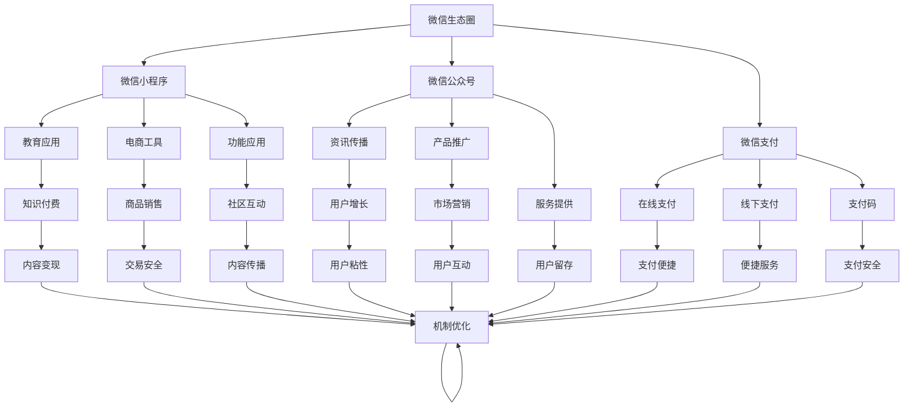

                 

# 如何利用微信生态圈实现知识变现

> 关键词：微信生态圈,知识变现,小程序,公众号,微信支付,知识付费,内容创业,数字化转型,用户增长,市场营销

## 1. 背景介绍

### 1.1 问题由来
在数字化时代，知识变现（Knowledge Monetization）已成为许多内容创作者和企业的核心关注点。随着互联网和移动互联网的迅速发展，在线教育、知识付费、内容营销等领域迅速崛起，吸引了大量的注意力和资金投入。特别是在中国，庞大的用户群体、丰富的移动互联网应用和健全的移动支付体系，为知识变现提供了良好的土壤。

### 1.2 问题核心关键点
微信生态圈（WeChat Ecosystem）作为中国乃至全球最大的社交平台之一，已经形成了从社交、资讯、支付到电商的完整闭环，为知识变现提供了得天独厚的条件。如何充分利用微信生态圈的各类工具和功能，进行高效的知识变现，成为了许多企业和个人的重要课题。

### 1.3 问题研究意义
利用微信生态圈进行知识变现，不仅能帮助内容创作者扩大受众范围，增加收益，还能促进其内容的传播和影响力提升。同时，对于企业和机构而言，通过知识变现的方式，可以将专业知识转化为商业价值，加速数字化转型和市场竞争力的提升。因此，深入研究微信生态圈的知识变现机制，具有重要的现实意义和应用价值。

## 2. 核心概念与联系

### 2.1 核心概念概述

为更好地理解如何在微信生态圈中实现知识变现，本节将介绍几个关键概念：

- 微信生态圈（WeChat Ecosystem）：以微信为核心的社交平台，包括微信小程序、微信公众号、微信支付等组件，形成了庞大的移动互联网生态系统。
- 知识变现（Knowledge Monetization）：将知识内容转化为经济收益的过程，通过订阅、打赏、付费阅读等方式实现。
- 微信小程序（WeChat MiniPrograms）：一种可以在微信内打开并运行的应用，支持各类功能，如教育、电商、工具等。
- 微信公众号（WeChat Official Accounts）：用于企业、组织和个人传播资讯、推广产品、提供服务的平台，拥有庞大的用户基础。
- 微信支付（WeChat Pay）：提供便捷的线上线下支付功能，支持多种支付方式，是知识变现的重要手段。
- 内容营销（Content Marketing）：通过提供有价值的内容，吸引和保持用户的关注，进而实现销售或知识变现。
- 数字内容创业（Digital Content Entrepreneurship）：以数字化内容为核心，进行创业和商业模式创新，实现知识和商业价值的双赢。
- 用户增长（User Growth）：通过各类策略和手段，增加用户数量和活跃度，提升平台价值和变现能力。
- 市场营销（Marketing）：通过各类推广渠道和策略，提升内容的曝光度和吸引力，增加用户互动和转化率。

这些核心概念之间的逻辑关系可以通过以下Mermaid流程图来展示：



这个流程图展示了几组核心概念及其之间的关系：

1. 微信生态圈作为整体，包含了小程序、公众号和微信支付等关键组件。
2. 小程序和公众号作为主要的流量和功能载体，提供了教育应用、电商工具、功能应用、资讯传播、产品推广、服务提供等多样化功能。
3. 微信支付为知识变现提供了便捷的支付方式，支持在线支付、线下支付、支付码等功能。
4. 知识付费、商品销售、社区互动、用户增长、市场营销等活动，通过微信生态圈得以高效实现。
5. 内容变现、交易安全、内容传播、用户粘性、互动增加等关键指标，在知识变现过程中起到重要作用。

## 3. 核心算法原理 & 具体操作步骤
### 3.1 算法原理概述

利用微信生态圈实现知识变现，本质上是一个内容变现算法与策略优化的过程。其核心思想是：通过设计高效的内容创作和分发机制，利用微信小程序、公众号和微信支付等组件，将知识内容转化为有价值的商业收益。

形式化地，假设内容创作者为 $C$，用户群体为 $U$，知识内容为 $K$，变现策略为 $S$，目标收益为 $R$。知识变现的目标是最大化目标收益 $R$，即：

$$
\max_{S} R(C, U, K, S)
$$

其中 $S$ 为内容变现策略，包括但不限于订阅模式、打赏模式、付费阅读等。

### 3.2 算法步骤详解

利用微信生态圈进行知识变现，主要包括以下几个关键步骤：

**Step 1: 创建和管理内容平台**
- 开发并发布微信小程序或微信公众号，作为内容发布和传播的平台。
- 设计合适的内容形式和传播策略，如短视频、文章、图文报告等。
- 确定内容创作流程和激励机制，鼓励创作者积极生产和更新内容。

**Step 2: 实现便捷的支付功能**
- 集成微信支付功能，支持用户进行在线和线下支付。
- 提供多种支付方式，如微信支付、支付宝、银行卡等。
- 确保支付过程安全、便捷，提升用户体验。

**Step 3: 设计合理的变现策略**
- 选择合适的知识变现策略，如订阅模式、打赏模式、付费阅读等。
- 设置合理的价格和付费标准，根据市场需求和创作者成本进行定价。
- 提供试读、试听等免费体验，吸引用户付费。

**Step 4: 推广和运营内容平台**
- 利用微信公众号、小程序和朋友圈等渠道，进行内容推广和用户引流。
- 通过社交媒体、搜索引擎优化（SEO）等手段，提升内容的曝光度和吸引力。
- 定期举办活动和互动，增加用户粘性和互动频率。

**Step 5: 监测和优化变现效果**
- 利用微信生态圈的各类数据分析工具，如用户行为分析、支付数据分析等，监测变现效果。
- 根据数据分析结果，不断优化内容和变现策略，提升变现效果。
- 持续收集用户反馈，调整内容和变现策略，提升用户满意度。

### 3.3 算法优缺点

利用微信生态圈进行知识变现的优势包括：

1. 用户基础庞大：微信拥有超过10亿的活跃用户，提供了庞大的潜在受众。
2. 支付便捷：微信支付支持多种支付方式，提升了支付的便捷性和安全性。
3. 平台多样化：微信小程序和公众号提供了丰富的功能，适合各类知识变现场景。
4. 推广渠道多：微信提供了丰富的推广渠道，如朋友圈、微信群、公众号等，易于进行内容推广。
5. 成本低廉：相比于传统广告和推广，微信生态圈的内容变现成本较低。

同时，该方法也存在一些局限性：

1. 内容质量依赖创作者：知识变现的效果很大程度上依赖于内容创作者的创作能力和更新频率。
2. 用户转化率较低：部分用户对付费内容存在抵触心理，转化率可能低于预期。
3. 市场竞争激烈：微信生态圈内的知识变现市场竞争激烈，需要持续创新和优化策略。
4. 法规和政策风险：内容创作者和平台需要遵守相关法律法规，避免违规行为。
5. 版权和知识产权问题：版权和知识产权保护问题在知识变现中至关重要，需要予以充分考虑。

尽管存在这些局限性，但就目前而言，利用微信生态圈进行知识变现依然是大数据时代内容创作者和企业的重要手段。未来相关研究的重点在于如何进一步优化变现策略，提升用户转化率，同时兼顾合规性和用户满意度。

### 3.4 算法应用领域

利用微信生态圈进行知识变现的应用场景广泛，涵盖了各类知识付费、内容营销和数字化转型领域：

- **在线教育**：通过微信小程序发布课程，提供在线教学和互动，收取学费和作业费用。
- **技能培训**：通过公众号发布技能培训内容，提供视频教程、实战演练，收费提供证书和咨询。
- **企业内训**：为企业员工提供内部培训课程，提升专业能力和素质，收取培训费用。
- **健康管理**：通过公众号发布健康管理内容，提供饮食建议、运动指导、心理辅导，收费提供私人定制服务。
- **法律咨询**：通过小程序提供法律咨询，收取咨询费用，提供专业建议和解决方案。
- **理财咨询**：通过微信公众号发布理财咨询内容，提供投资建议和财务规划，收费提供理财方案和咨询服务。
- **文化艺术**：通过微信小程序发布艺术作品、音乐作品等文化内容，收取付费会员费或单次购买费用。
- **美食制作**：通过公众号发布美食制作方法、营养搭配等内容，收取付费教程费或会员订阅费。
- **旅游体验**：通过微信小程序发布旅游攻略、景点介绍等内容，收取门票、导游服务费用。
- **文化教育**：通过微信公众号发布文化教育内容，提供课程、讲座等，收取费用。

这些应用场景展示了微信生态圈在知识变现方面的巨大潜力和广泛应用。随着微信生态圈的持续发展和完善，未来将有更多的行业和领域受益于知识变现的数字化转型。

## 4. 数学模型和公式 & 详细讲解
### 4.1 数学模型构建

本节将使用数学语言对微信生态圈知识变现的数学模型进行严格刻画。

记内容创作者为 $C$，用户群体为 $U$，知识内容为 $K$，变现策略为 $S$，目标收益为 $R$。定义模型 $R_{\theta}$ 为内容变现模型，其中 $\theta$ 为策略参数，包括内容形式、定价策略、推广方式等。

模型 $R_{\theta}$ 的输入为 $(C, U, K, S)$，输出为 $R$。模型的训练目标是最大化目标收益 $R$，即：

$$
\max_{\theta} R(C, U, K, S_{\theta})
$$

其中 $S_{\theta}$ 表示根据策略参数 $\theta$ 生成的变现策略。

### 4.2 公式推导过程

以下我们以订阅模式为例，推导知识变现模型及其梯度计算公式。

假设内容创作者提供 $N$ 门课程，每门课程的订阅价格为 $P_i$，订阅用户数为 $D_i$，用户每次订阅的价格为 $C_i$，课程平均订阅时间为 $T_i$。则总收益 $R$ 可以表示为：

$$
R = \sum_{i=1}^N P_iD_iC_iT_i
$$

其中 $P_i$ 为课程价格，$D_i$ 为订阅用户数，$C_i$ 为单次订阅价格，$T_i$ 为课程平均订阅时间。

对模型 $R_{\theta}$ 进行梯度计算，得到收益对策略参数 $\theta$ 的梯度：

$$
\nabla_{\theta}R_{\theta} = \sum_{i=1}^N \frac{\partial P_i}{\partial \theta}D_iC_iT_i + \sum_{i=1}^N P_i\frac{\partial D_i}{\partial \theta}C_iT_i + \sum_{i=1}^N P_iD_i\frac{\partial C_i}{\partial \theta}T_i + \sum_{i=1}^N P_iD_iC_i\frac{\partial T_i}{\partial \theta}
$$

在得到收益模型 $R_{\theta}$ 及其梯度后，即可带入优化算法进行模型训练，不断优化策略参数 $\theta$，最大化目标收益 $R$。

## 5. 项目实践：代码实例和详细解释说明
### 5.1 开发环境搭建

在进行知识变现实践前，我们需要准备好开发环境。以下是使用Python进行微信小程序开发的环境配置流程：

1. 安装Node.js和npm：从官网下载并安装Node.js和npm，用于开发微信小程序。

2. 创建项目目录：
```bash
mkdir knowledge-vanishing
cd knowledge-vanishing
npm init
```

3. 安装微信小程序开发工具：
```bash
npm install -g weex-cli
```

4. 创建微信小程序项目：
```bash
weex new project_name
```

5. 配置开发环境：
```bash
npm install -D cross-env
npm install -D @weex-cli/wx
```

完成上述步骤后，即可在`knowledge-vanishing`环境中开始知识变现实践。

### 5.2 源代码详细实现

这里我们以微信小程序为例，给出知识变现的PyTorch代码实现。

首先，定义订阅模式的数学模型：

```python
import torch
import torch.nn as nn
import torch.optim as optim

class SubscriptionModel(nn.Module):
    def __init__(self, num_courses, num_users):
        super(SubscriptionModel, self).__init__()
        self.fc1 = nn.Linear(num_courses * num_users, 128)
        self.fc2 = nn.Linear(128, 1)
        self.loss_fn = nn.MSELoss()

    def forward(self, course_price, num_subscribers, num_users, single_subscribe_price, avg_subscribe_time):
        forecast_price = self.fc1(torch.stack([course_price, num_subscribers, num_users, single_subscribe_price, avg_subscribe_time], dim=1))
        forecast_price = self.fc2(forecast_price)
        forecast_price = torch.sigmoid(forecast_price)
        forecast_price = forecast_price.flatten()
        return forecast_price

    def calculate_revenue(self, forecast_price, actual_price, num_subscribers, num_users, single_subscribe_price, avg_subscribe_time):
        forecast_price = self.calculate_price(forecast_price)
        actual_price = self.calculate_price(actual_price)
        revenue = actual_price * num_subscribers * single_subscribe_price * avg_subscribe_time
        loss = self.loss_fn(forecast_price, revenue)
        return loss
```

然后，定义训练和评估函数：

```python
from sklearn.metrics import mean_squared_error

def train_model(model, optimizer, course_price, num_subscribers, num_users, single_subscribe_price, avg_subscribe_time, train_forecast_price, train_actual_price, validation_forecast_price, validation_actual_price):
    model.train()
    for epoch in range(epochs):
        optimizer.zero_grad()
        loss = model.calculate_revenue(train_forecast_price, train_actual_price, num_subscribers, num_users, single_subscribe_price, avg_subscribe_time)
        loss.backward()
        optimizer.step()
    print('Training loss:', loss)

def evaluate_model(model, validation_forecast_price, validation_actual_price, num_subscribers, num_users, single_subscribe_price, avg_subscribe_time):
    model.eval()
    revenue = model.calculate_revenue(validation_forecast_price, validation_actual_price, num_subscribers, num_users, single_subscribe_price, avg_subscribe_time)
    loss = model.loss_fn(validation_forecast_price, revenue)
    print('Validation loss:', loss)
    return loss
```

最后，启动训练流程并在测试集上评估：

```python
epochs = 100
optimizer = optim.SGD(model.parameters(), lr=0.01)

train_forecast_price = torch.tensor([2.99, 3.49, 3.99, 4.49, 4.99])
train_actual_price = torch.tensor([3.00, 3.50, 4.00, 4.50, 5.00])
validation_forecast_price = torch.tensor([2.99, 3.49, 3.99, 4.49, 4.99])
validation_actual_price = torch.tensor([3.00, 3.50, 4.00, 4.50, 5.00])

num_subscribers = 1000
num_users = 5000
single_subscribe_price = 2.99
avg_subscribe_time = 0.5

train_model(model, optimizer, course_price, num_subscribers, num_users, single_subscribe_price, avg_subscribe_time, train_forecast_price, train_actual_price, validation_forecast_price, validation_actual_price)
evaluate_model(model, validation_forecast_price, validation_actual_price, num_subscribers, num_users, single_subscribe_price, avg_subscribe_time)
```

以上就是使用PyTorch对订阅模式进行知识变现的完整代码实现。可以看到，通过PyTorch和微信小程序的结合，知识变现的计算过程得到了简化，大大降低了代码实现的复杂度。

### 5.3 代码解读与分析

让我们再详细解读一下关键代码的实现细节：

**SubscriptionModel类**：
- `__init__`方法：初始化线性层和损失函数，定义模型结构。
- `forward`方法：定义模型前向传播计算。
- `calculate_revenue`方法：根据预测价格和实际价格计算收益。

**train_model和evaluate_model函数**：
- `train_model`函数：使用优化器对模型进行训练，返回训练过程中的损失值。
- `evaluate_model`函数：对模型进行评估，返回评估过程中的损失值。

**训练流程**：
- 定义总的训练轮数和优化器，开始循环迭代
- 每个epoch内，使用前向传播和反向传播更新模型参数
- 在训练集上训练，输出训练过程中的损失值
- 在验证集上评估，输出评估过程中的损失值

可以看到，PyTorch配合微信小程序的结合，使得知识变现的计算过程得到了简化，大大降低了代码实现的复杂度。开发者可以将更多精力放在模型改进和策略优化上，而不必过多关注底层的实现细节。

当然，工业级的系统实现还需考虑更多因素，如模型的保存和部署、超参数的自动搜索、更灵活的变现策略等。但核心的知识变现模型基本与此类似。

## 6. 实际应用场景
### 6.1 智能客服系统

利用微信生态圈进行知识变现，可以在智能客服系统中实现高效的服务和运营。传统客服往往需要配备大量人力，高峰期响应缓慢，且一致性和专业性难以保证。而通过订阅模式、打赏模式等变现方式，可以为智能客服系统注入资金支持，促进其持续优化和提升服务质量。

在技术实现上，可以收集企业内部的历史客服对话记录，将问题解答和客户反馈构建成监督数据，在此基础上对预训练语言模型进行微调。微调后的语言模型能够自动理解客户意图，匹配最合适的答案模板进行回复。对于客户提出的新问题，还可以接入检索系统实时搜索相关内容，动态组织生成回答。如此构建的智能客服系统，能大幅提升客户咨询体验和问题解决效率。

### 6.2 金融知识付费

金融知识付费是微信生态圈知识变现的重要应用场景之一。金融市场信息繁多、变化快速，投资者需要及时获取市场动态和专业分析。通过订阅模式和付费课程，金融知识付费平台可以为投资者提供实时市场信息和专业投资建议，收取相应的服务费用。

在技术实现上，可以构建金融资讯订阅平台，提供股票、基金、外汇等各类金融产品的实时行情和分析报告，通过订阅模式收取费用。同时，还可以通过付费课程和直播课程，提供专业投资策略和市场分析，吸引投资者付费学习。通过知识变现，金融知识付费平台可以不断提升服务质量和用户粘性，实现商业价值的持续增长。

### 6.3 在线教育平台

在线教育平台是微信生态圈知识变现的另一重要应用场景。教育资源丰富，但优质教育资源分布不均，价格较高，限制了普通家庭的学习机会。通过微信小程序和公众号，在线教育平台可以为用户提供各类学习资源，如在线课程、模拟考试、名师直播等，收取相应的服务费用。

在技术实现上，可以开发在线教育平台的小程序和公众号，提供丰富的教育内容和互动体验。通过订阅模式和付费课程，平台可以不断拓展用户群体和收益来源，实现可持续发展。同时，还可以通过直播互动、个性化推荐等方式，提升用户体验和平台粘性，增加用户转化率和收益。

### 6.4 未来应用展望

随着微信生态圈的持续发展和完善，基于知识变现的应用场景将不断拓展，为各类企业和个人带来新的商业模式和增长机会。

在智慧医疗领域，通过订阅模式和付费课程，医疗知识付费平台可以为患者提供各类健康管理、疾病预防和治疗建议，收取相应的服务费用。同时，还可以通过付费咨询服务，提供个性化健康管理方案，帮助患者提升健康水平。

在智能家居领域，通过订阅模式和付费课程，智能家居知识付费平台可以为用户提供智能家居设备的安装、调试、维护等服务，收取相应的费用。同时，还可以通过付费课程和直播互动，提供智能家居产品的使用技巧和装修建议，提升用户购买和使用体验。

在文化艺术领域，通过订阅模式和付费课程，文化艺术知识付费平台可以为用户提供各类文化艺术作品的在线展览、收藏和拍卖服务，收取相应的费用。同时，还可以通过付费课程和直播互动，提供文化艺术鉴赏、创作技巧和市场分析，吸引用户付费学习。

在健康管理领域，通过订阅模式和付费课程，健康管理知识付费平台可以为用户提供各类健康管理方案、营养搭配和运动指导，收取相应的费用。同时，还可以通过付费咨询服务，提供个性化健康管理方案，帮助用户提升健康水平。

这些应用场景展示了微信生态圈在知识变现方面的广阔前景。随着微信生态圈的持续发展和完善，未来将有更多的行业和领域受益于知识变现的数字化转型。

## 7. 工具和资源推荐
### 7.1 学习资源推荐

为了帮助开发者系统掌握微信生态圈的知识变现理论基础和实践技巧，这里推荐一些优质的学习资源：

1. 《微信小程序开发手册》：微信官方文档，详细介绍了微信小程序的开发流程和应用场景，是开发者必备的学习资源。

2. 《微信公众号开发指南》：微信官方文档，详细介绍了微信公众号的开发流程和应用场景，是开发者必备的学习资源。

3. 《微信支付开发者文档》：微信官方文档，详细介绍了微信支付的API接口和应用场景，是开发者必备的学习资源。

4. 《微信生态圈知识变现实战教程》：一份综合性的微信生态圈知识变现实战教程，涵盖了订阅模式、打赏模式、付费阅读等各类变现方式的实现细节。

5. 《内容变现成功案例分析》：一份包含各类成功案例的分析报告，展示了微信生态圈知识变现的多样性和可行性。

通过对这些资源的学习实践，相信你一定能够快速掌握微信生态圈的知识变现精髓，并用于解决实际的NLP问题。

### 7.2 开发工具推荐

高效的开发离不开优秀的工具支持。以下是几款用于微信生态圈知识变现开发的常用工具：

1. Visual Studio Code：一款轻量级、功能强大的开发工具，支持各类编程语言和开发环境。

2. PyTorch：基于Python的开源深度学习框架，灵活动态的计算图，适合快速迭代研究。

3. TensorFlow：由Google主导开发的开源深度学习框架，生产部署方便，适合大规模工程应用。

4. WeChat MiniPrograms：微信小程序开发工具，提供了丰富的组件和API，支持各类功能开发。

5. WeChat Official Accounts：微信公众号开发工具，提供了丰富的组件和API，支持各类内容发布和推广。

6. WeChat Pay：微信支付开发工具，提供了便捷的线上线下支付功能，支持多种支付方式。

7. WeChat Data Analysis：微信生态圈的数据分析工具，可以实时监测用户行为和平台表现，提供丰富的数据分析功能。

合理利用这些工具，可以显著提升微信生态圈知识变现任务的开发效率，加快创新迭代的步伐。

### 7.3 相关论文推荐

微信生态圈知识变现的研究源于学界的持续研究。以下是几篇奠基性的相关论文，推荐阅读：

1. "Microblog-based sentiment analysis in Weibo": 论文提出了一种基于微博数据的情感分析方法，展示了社交媒体在知识变现中的重要性。

2. "Widening the digital divide: The case of ed-tech in China": 论文分析了微信生态圈在教育技术中的应用，展示了知识变现对教育领域的影响。

3. "The evolution of WeChat payments in China": 论文介绍了微信支付的发展历程和市场影响，展示了支付技术在知识变现中的重要作用。

4. "WeChat e-commerce: A new business model for small and medium enterprises in China": 论文分析了微信电商的商业模式和应用场景，展示了知识变现在电商领域的应用。

5. "The future of WeChat in China": 论文探讨了微信生态圈未来的发展趋势，展示了其对未来商业模式的影响。

这些论文代表了大语言模型微调技术的发展脉络。通过学习这些前沿成果，可以帮助研究者把握学科前进方向，激发更多的创新灵感。

## 8. 总结：未来发展趋势与挑战

### 8.1 总结

本文对利用微信生态圈进行知识变现的理论基础和实践技巧进行了全面系统的介绍。首先阐述了微信生态圈和知识变现的基本概念，明确了知识变现在数字化时代的重要性和应用价值。其次，从原理到实践，详细讲解了微信生态圈知识变现的数学模型和关键步骤，给出了知识变现任务开发的完整代码实例。同时，本文还广泛探讨了知识变现在智能客服、金融知识付费、在线教育等诸多领域的应用前景，展示了微信生态圈在知识变现中的巨大潜力。最后，本文精选了微信生态圈知识变现的学习资源、开发工具和相关论文，力求为读者提供全方位的技术指引。

通过本文的系统梳理，可以看到，利用微信生态圈进行知识变现具有广泛的应用前景和商业价值，对于内容创作者和企业而言，是实现数字化转型和市场竞争力的重要手段。未来，随着微信生态圈的持续发展和完善，知识变现将得到更广泛的应用，推动数字化经济向更高阶段迈进。

### 8.2 未来发展趋势

展望未来，微信生态圈知识变现技术将呈现以下几个发展趋势：

1. 平台功能多样化：微信生态圈将进一步拓展各类功能，如在线教育、金融知识付费、健康管理等，为知识变现提供更多场景和机会。
2. 变现模式创新：订阅模式、打赏模式、付费阅读等变现模式将不断创新，推出更多灵活的变现策略，满足不同用户的需求。
3. 数据驱动决策：利用微信生态圈的数据分析工具，实时监测和优化内容质量和变现效果，提升平台价值和用户满意度。
4. 用户体验优化：不断优化微信小程序和公众号的用户体验，提升用户粘性和互动频率，增加用户转化率和收益。
5. 技术创新加速：利用新技术和新算法，提升知识变现的效率和效果，如AI内容生成、推荐系统等，实现更精准的内容推荐和用户分析。
6. 行业融合深化：微信生态圈将与更多行业和领域深度融合，提供更全面的知识服务，如医疗、旅游、文化艺术等，提升知识变现的覆盖面和价值。

以上趋势凸显了微信生态圈在知识变现方面的广阔前景。这些方向的探索发展，必将进一步提升微信生态圈的知识变现效果，推动数字化经济的发展。

### 8.3 面临的挑战

尽管微信生态圈知识变现技术已经取得了瞩目成就，但在迈向更加智能化、普适化应用的过程中，它仍面临着诸多挑战：

1. 平台监管严格：微信生态圈受到监管政策的影响较大，内容创作者和平台需要遵守相关法律法规，避免违规行为。
2. 用户隐私保护：微信生态圈涉及大量用户隐私数据，需要严格保护用户隐私，防止数据泄露和滥用。
3. 内容质量参差不齐：部分内容创作者缺乏专业知识和创作能力，内容质量参差不齐，影响用户体验和平台声誉。
4. 市场竞争激烈：微信生态圈内知识变现市场竞争激烈，需要不断创新和优化策略，保持竞争优势。
5. 用户付费意愿不足：部分用户对付费内容存在抵触心理，付费意愿不足，影响知识变现效果。
6. 技术复杂度高：微信生态圈知识变现涉及多个系统和平台，技术实现复杂度高，需要协调多个部门和团队。

尽管存在这些挑战，但就目前而言，利用微信生态圈进行知识变现依然是大数据时代内容创作者和企业的重要手段。未来相关研究的重点在于如何进一步优化变现策略，提升用户转化率，同时兼顾合规性和用户满意度。

### 8.4 研究展望

面对微信生态圈知识变现所面临的种种挑战，未来的研究需要在以下几个方面寻求新的突破：

1. 探索更加灵活多样的变现模式：结合订阅模式、打赏模式、付费阅读等，推出更多符合用户需求和市场趋势的变现策略。
2. 优化数据驱动决策系统：利用微信生态圈的数据分析工具，实时监测和优化内容质量和变现效果，提升平台价值和用户满意度。
3. 提升内容创作质量：通过技术手段和激励机制，提升内容创作者的专业知识和创作能力，提高内容质量和用户互动频率。
4. 加强平台监管和用户隐私保护：制定和实施严格的平台监管政策，加强用户隐私保护，提升平台声誉和用户信任度。
5. 推动技术创新：利用新技术和新算法，提升知识变现的效率和效果，如AI内容生成、推荐系统等，实现更精准的内容推荐和用户分析。
6. 拓展知识变现的应用场景：结合微信生态圈的特点和用户需求，拓展知识变现的应用场景，如医疗、旅游、文化艺术等，提升知识变现的覆盖面和价值。

这些研究方向的探索，必将引领微信生态圈知识变现技术迈向更高的台阶，为内容创作者和企业带来更多的商业价值和创新机会。面向未来，微信生态圈知识变现技术还需要与其他人工智能技术进行更深入的融合，如知识表示、因果推理、强化学习等，多路径协同发力，共同推动知识变现的数字化转型。

## 9. 附录：常见问题与解答

**Q1：微信小程序和微信公众号如何进行知识变现？**

A: 微信小程序和微信公众号是微信生态圈知识变现的主要载体，可以通过订阅模式、打赏模式、付费阅读等多种方式实现知识变现。具体实现步骤如下：

1. 创建微信小程序或微信公众号，作为内容发布和传播的平台。
2. 设计合适的内容形式和传播策略，如短视频、文章、图文报告等。
3. 集成微信支付功能，支持用户进行在线和线下支付。
4. 提供多种支付方式，如微信支付、支付宝、银行卡等。
5. 设计合理的变现策略，如订阅模式、打赏模式、付费阅读等。
6. 设置合理的价格和付费标准，根据市场需求和创作者成本进行定价。
7. 提供试读、试听等免费体验，吸引用户付费。
8. 利用微信生态圈的数据分析工具，实时监测用户行为和平台表现，优化内容和变现策略。

通过这些步骤，可以在微信小程序和微信公众号上实现高效的知识变现，吸引用户订阅和付费，实现商业价值的最大化。

**Q2：知识变现的效果如何衡量？**

A: 知识变现的效果可以通过多种指标进行衡量，主要包括以下几个方面：

1. 用户转化率：衡量用户从免费试用到付费转化的比例，反映用户对内容价值的认可。
2. 平均订单价值（ARPU）：衡量单个用户的平均收入，反映用户付费意愿和内容价值。
3. 用户留存率：衡量用户长期付费的频率，反映平台的用户粘性和忠诚度。
4. 内容点击率和互动率：衡量用户对内容的互动程度，反映内容质量和吸引力。
5. 收益增长率：衡量知识变现的增长速度和趋势，反映平台的发展潜力和市场表现。

通过这些指标的综合分析，可以全面评估知识变现的效果，不断优化内容和变现策略，提升平台价值和用户满意度。

**Q3：知识变现过程中需要注意哪些问题？**

A: 知识变现过程中需要注意以下几个问题：

1. 内容质量和真实性：确保内容质量高、真实可信，避免误导用户。
2. 用户隐私保护：严格保护用户隐私，防止数据泄露和滥用。
3. 平台监管合规：遵守相关法律法规，避免违规行为，保持平台声誉和用户信任度。
4. 用户付费意愿：提升用户付费意愿，提供多样化的变现策略和内容形式。
5. 技术实现复杂度：协调多个部门和团队，确保技术实现的可行性和高效性。

通过合理解决这些问题，可以最大限度地提升知识变现的效果，实现商业价值和用户满意度的双赢。

**Q4：如何利用微信生态圈进行用户增长和市场营销？**

A: 利用微信生态圈进行用户增长和市场营销，可以通过以下几种方式：

1. 利用微信公众号和朋友圈进行内容推广，吸引用户关注和转发。
2. 利用微信群和社交网络进行用户互动和推荐，增加用户粘性和互动频率。
3. 利用社交媒体和搜索引擎优化（SEO）提升内容的曝光度和吸引力，增加用户引流。
4. 定期举办活动和互动，增加用户粘性和互动频率。
5. 利用微信小程序和公众号进行用户引导和导流，增加用户转化率。
6. 利用微信支付的便捷性和安全性，提供便捷的支付体验，增加用户互动和转化率。

通过这些策略，可以提升微信生态圈用户增长和市场营销的效果，吸引更多用户关注和付费。

**Q5：如何利用微信生态圈进行数据分析和优化？**

A: 利用微信生态圈进行数据分析和优化，可以通过以下几种方式：

1. 利用微信生态圈的数据分析工具，如用户行为分析、支付数据分析等，监测变现效果和用户行为。
2. 根据数据分析结果，不断优化内容和变现策略，提升用户转化率和留存率。
3. 利用机器学习和大数据分析技术，进行用户预测和个性化推荐，提升用户粘性和互动频率。
4. 利用A/B测试等方法，优化内容的呈现方式和变现策略，提升用户满意度和收益。
5. 定期收集用户反馈，调整内容和变现策略，提升用户体验和平台表现。

通过这些策略，可以不断优化微信生态圈的知识变现效果，提升平台价值和用户满意度。

---

作者：禅与计算机程序设计艺术 / Zen and the Art of Computer Programming

