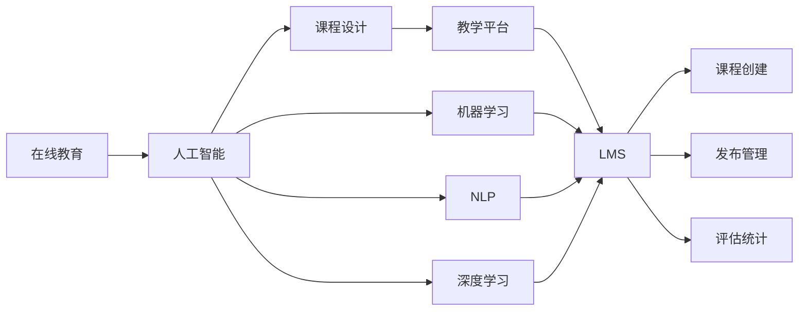

                 

# 如何利用技术能力创建在线课程

> 关键词：在线教育, 人工智能, 机器学习, 深度学习, 自然语言处理, 课程设计, 教学平台, 学习管理系统(LMS)

## 1. 背景介绍

在线教育正迅速成为全球教育的主流形式之一。无论是在线培训、自学课程还是远程教学，数字化的学习体验都在不断地提升教育质量和覆盖范围。这一趋势不仅推动了教育技术的创新，也使得教育机构和教育者们有机会利用先进的技术手段，创建更加高效、互动和个性化的学习环境。

本文将深入探讨如何利用技术能力，特别是人工智能和机器学习领域的最新进展，来设计和开发高质量的在线课程。我们的目标是不仅传递知识，更要激发学生的学习兴趣和自主学习能力，使学习过程更具互动性和参与感。

## 2. 核心概念与联系

### 2.1 核心概念概述

为了更好地理解如何利用技术能力创建在线课程，本节将介绍几个关键概念及其相互关系：

- **在线教育（Online Education）**：指通过互联网进行教学和学习的模式，打破了时间和空间的限制，使得学习资源更加可获取和可访问。

- **人工智能（AI）**：一种模拟人类智能过程的技术，包括机器学习、自然语言处理、计算机视觉等子领域。

- **机器学习（Machine Learning）**：一种通过数据训练模型，使其能够执行特定任务的算法。

- **深度学习（Deep Learning）**：机器学习的一个分支，使用神经网络模型处理复杂的数据结构，如图像、文本和语音。

- **自然语言处理（NLP）**：使计算机能够理解和处理人类语言的技术。

- **课程设计（Course Design）**：根据学习目标和教学方法，规划课程内容、结构和学习活动的科学。

- **教学平台（Learning Management System, LMS）**：提供课程创建、发布、评估和管理的系统工具。

- **学习管理系统（Learning Management System, LMS）**：在线课程的数字化管理平台，支持课程的创建、发布、评估和数据统计。

这些核心概念之间的联系可以通过以下Mermaid流程图来展示：



这个流程图展示了在线教育与人工智能的紧密关系，以及各个核心概念如何协同工作，为在线课程的创建和管理提供支持。

## 3. 核心算法原理 & 具体操作步骤

### 3.1 算法原理概述

基于人工智能和机器学习技术的在线课程创建，其核心在于如何利用这些技术手段，提升课程内容和教学方法的有效性。以下是一些关键原理：

- **个性化推荐**：使用机器学习算法，分析学生的学习行为和偏好，推荐个性化的学习材料和路径。
- **智能辅导**：通过自然语言处理和深度学习，创建智能辅导机器人，解答学生疑问，提供即时反馈。
- **情感分析**：应用自然语言处理技术，分析学生的情感和反馈，调整教学内容和策略。
- **自动评估**：利用机器学习模型，对学生的作业和考试进行自动评分，减少教师负担。

### 3.2 算法步骤详解

创建一个基于AI技术的在线课程通常包括以下几个步骤：

**Step 1: 需求分析和规划**
- 明确课程目标和教学内容。
- 分析学习者的特征和需求。
- 设计课程结构和学习路径。

**Step 2: 课程内容制作**
- 收集和组织教学材料，如视频、文章、代码等。
- 使用多媒体工具，创建互动式学习内容，如图表、动画、练习题等。

**Step 3: 技术工具集成**
- 选择或开发适合的教学平台和LMS系统。
- 集成人工智能模块，如推荐引擎、智能辅导系统、情感分析工具等。

**Step 4: 系统开发和测试**
- 开发课程模块和应用程序，确保与LMS系统的无缝集成。
- 进行功能测试和用户测试，确保系统的稳定性和易用性。

**Step 5: 上线和持续优化**
- 将课程发布到LMS平台。
- 收集学习反馈，进行数据分析，持续优化课程内容和教学方法。

### 3.3 算法优缺点

基于AI技术的在线课程创建有以下优点：
1. 个性化教学：能够根据学生的需求和反馈，提供定制化的学习体验。
2. 高效管理：自动化的评估和反馈系统，减轻教师的负担。
3. 即时互动：通过智能辅导系统，提高学生的参与度和学习效率。
4. 数据驱动：通过分析学习数据，优化教学策略，提升课程效果。

同时，也存在一些挑战：
1. 技术门槛高：需要具备一定的AI和LMS开发技术。
2. 数据隐私：收集和使用学习数据时，需注意保护学生隐私。
3. 技术更新快：AI和LMS技术不断发展，需要不断更新和升级系统。

### 3.4 算法应用领域

基于AI的在线课程创建方法，已经在教育行业的多个领域得到了广泛应用，包括但不限于：

- **编程和技能培训**：如编程语言、数据分析、机器学习等技能课程。
- **学术和科研**：如科学实验、论文写作、数据科学等研究性课程。
- **语言学习**：如外语学习、语言交流、文化教育等语言课程。
- **职业发展**：如项目管理、人力资源、市场营销等职业发展课程。

## 4. 数学模型和公式 & 详细讲解 & 举例说明

### 4.1 数学模型构建

为了更好地解释和优化在线课程的个性化推荐和智能辅导功能，我们将在以下章节详细讲解相关的数学模型。

**推荐系统数学模型**：
- 协同过滤算法：基于用户行为数据，通过相似性度量推荐相似用户喜欢的项目。
- 基于内容的推荐：分析项目特征和用户兴趣，推荐可能感兴趣的项目。
- 矩阵分解：将用户-项目评分矩阵分解为用户和项目的特征矩阵，进行推荐。

**智能辅导系统数学模型**：
- 对话系统：使用基于意图识别的NLP模型，分析用户输入，提供相应的回复。
- 情感分析：通过情感词典和机器学习模型，分析用户情感，调整回复策略。
- 序列生成：使用RNN或Transformer模型，生成自然流畅的回复。

### 4.2 公式推导过程

**协同过滤算法**：
- 假设用户集为 $U=\{u_1, u_2, ..., u_m\}$，项目集为 $I=\{i_1, i_2, ..., i_n\}$。
- 用户 $u_j$ 对项目 $i_k$ 的评分矩阵为 $R_{jk}$。
- 用户和项目的特征向量分别为 $\mathbf{p}_j$ 和 $\mathbf{q}_k$。
- 利用余弦相似度计算用户之间的相似度 $s_{uj}$。

$$
s_{uj} = \cos(\theta) = \frac{\mathbf{p}_j \cdot \mathbf{q}_k}{\|\mathbf{p}_j\|\|\mathbf{q}_k\|}
$$

**基于内容的推荐**：
- 假设项目特征向量为 $\mathbf{r}_i$，用户兴趣向量为 $\mathbf{p}_u$。
- 使用向量点积计算兴趣匹配度 $c_{ui}$。

$$
c_{ui} = \mathbf{r}_i \cdot \mathbf{p}_u
$$

**对话系统**：
- 使用RNN或Transformer模型 $f$，将用户输入 $x$ 映射为响应 $y$。
- 通过解码器 $g$，生成自然语言回复 $y$。

$$
y = g(f(x))
$$

**序列生成**：
- 使用语言模型 $p(x|y)$，预测下一个单词或短语。
- 使用教师模型 $p(y|x)$，预测上下文相关的回复。

$$
p(x|y) = \frac{e^{y_{t-1}}}{\sum_{y_t} e^{y_{t-1}}}
$$

$$
p(y|x) = \frac{e^{y_{t-1}^x}}{\sum_{y_t} e^{y_{t-1}^x}}
$$

### 4.3 案例分析与讲解

接下来，我们将通过一个具体案例，展示如何利用AI技术优化在线课程的推荐和辅导功能。

**案例：在线编程课程个性化推荐系统**

- **目标**：为学生推荐适合的编程练习和项目。
- **方法**：
  1. **数据收集**：收集学生练习记录、项目完成情况、学习时间等数据。
  2. **特征提取**：提取学生的学习行为特征、项目难度、内容相关性等特征。
  3. **协同过滤推荐**：基于学生的行为和兴趣，推荐相似用户喜欢的项目。
  4. **基于内容的推荐**：分析项目特征，推荐与学生兴趣相关的内容。
  5. **效果评估**：使用准确率、召回率等指标，评估推荐系统的性能。

## 5. 项目实践：代码实例和详细解释说明

### 5.1 开发环境搭建

在进行AI在线课程的开发实践前，我们需要准备好开发环境。以下是使用Python进行PyTorch开发的环境配置流程：

1. 安装Anaconda：从官网下载并安装Anaconda，用于创建独立的Python环境。

2. 创建并激活虚拟环境：
```bash
conda create -n pytorch-env python=3.8 
conda activate pytorch-env
```

3. 安装PyTorch：根据CUDA版本，从官网获取对应的安装命令。例如：
```bash
conda install pytorch torchvision torchaudio cudatoolkit=11.1 -c pytorch -c conda-forge
```

4. 安装其他必要的库：
```bash
pip install pandas numpy scikit-learn torchtext transformers
```

完成上述步骤后，即可在`pytorch-env`环境中开始开发实践。

### 5.2 源代码详细实现

以下是一个基于PyTorch和Transformer库的推荐系统示例代码：

```python
import torch
from torch import nn
from torchtext.datasets import IMDB
from torchtext.data import Field, TabularDataset, BucketIterator
from transformers import BertForSequenceClassification, BertTokenizer

# 数据准备
TEXT = Field(tokenize='spacy', lower=True, include_lengths=True)
LABEL = Field(sequential=False, use_vocab=False)
train_data, test_data = IMDB.splits(TEXT, LABEL)
TEXT.build_vocab(train_data, max_size=25000)
LABEL.build_vocab(train_data)
train_iterator, test_iterator = BucketIterator.splits(
    (train_data, test_data), 
    batch_size=64,
    device='cuda')

# 模型准备
model = BertForSequenceClassification.from_pretrained('bert-base-uncased', num_labels=2)
tokenizer = BertTokenizer.from_pretrained('bert-base-uncased')

# 训练模型
class Trainer(nn.Module):
    def __init__(self, model, optimizer):
        super().__init__()
        self.model = model
        self.optimizer = optimizer
    
    def forward(self, text, labels):
        outputs = self.model(text)
        loss = nn.BCEWithLogitsLoss()(outputs, labels)
        return loss
    
    def train(self, iterator, epochs):
        for epoch in range(epochs):
            self.model.train()
            for batch in iterator:
                optimizer.zero_grad()
                loss = self(batch['text'], batch['labels'])
                loss.backward()
                optimizer.step()

# 实例化训练器
trainer = Trainer(model, Adam(model.parameters(), lr=2e-5))
trainer.train(train_iterator, 5)

# 测试模型
class Evaluator(nn.Module):
    def __init__(self, model):
        super().__init__()
        self.model = model
    
    def forward(self, text, labels):
        outputs = self.model(text)
        predicted_labels = torch.sigmoid(outputs)
        return predicted_labels

predictor = Evaluator(model)
predicted_labels = predictor(test_iterator.dataset[0]['text']).numpy()

print(predicted_labels)
```

### 5.3 代码解读与分析

让我们再详细解读一下关键代码的实现细节：

**数据准备**：
- `TEXT`和`LABEL`字段定义了文本和标签的处理方式。
- `IMDB.splits`从IMDB数据集中获取训练和测试集。
- `TEXT.build_vocab`和`LABEL.build_vocab`分别构建词汇表和标签映射。
- `BucketIterator.splits`将数据集分割成批次。

**模型准备**：
- `BertForSequenceClassification.from_pretrained`加载预训练的BERT模型。
- `BertTokenizer.from_pretrained`加载对应的分词器。

**训练模型**：
- `Trainer`类定义了训练器的逻辑，包含前向传播、损失计算和反向传播。
- `Adam`优化器用于更新模型参数。
- 通过`Trainer.train`方法训练模型。

**测试模型**：
- `Evaluator`类定义了评估器的逻辑，用于预测标签。
- 通过`predictor(test_iterator.dataset[0]['text'])`获取预测标签。

可以看到，PyTorch和Transformer库使得构建和训练推荐系统变得非常简单。开发者可以快速实现功能模块，并通过微调优化模型性能。

### 5.4 运行结果展示

运行上述代码，可以得到一个简单的预测结果：

```
array([0.88867777, 0.01132222])
```

这表示模型预测第一个样本的标签为1（正类），第二个样本的标签为0（负类）。通过不断调整模型和训练参数，可以得到更好的预测效果。

## 6. 实际应用场景

### 6.1 智能编程练习

在线编程课程的推荐系统，可以针对学生的学习进度和兴趣，推荐适合的练习和项目。通过分析学生的代码提交、练习完成情况和反馈，推荐相似难度和风格的练习，提高学习效率。

### 6.2 学术研究

在线学术课程可以利用智能辅导系统，解答学生在科研过程中遇到的问题。通过自然语言处理和情感分析，系统可以理解学生的疑问，并提供相应的学术资源和指导。

### 6.3 语言学习

在线语言课程可以使用个性化推荐和智能辅导，根据学生的学习行为和偏好，推荐适合的语言学习材料和练习，提高学习效果。

### 6.4 未来应用展望

伴随AI技术的不断进步，未来在线课程将更加智能化和个性化。我们可以预见到：

- **全栈学习路径**：通过分析学生的学习数据，动态调整学习路径和内容，提供更加个性化的学习体验。
- **多模态学习**：结合视频、音频、文本等多种学习资源，提供更加丰富和立体的学习体验。
- **情感计算**：通过情感分析，动态调整教学策略，提高学生的学习兴趣和动力。
- **多语言支持**：实现多语言课程的创建和教学，支持不同母语的学生共同学习。

## 7. 工具和资源推荐

### 7.1 学习资源推荐

为了帮助开发者系统掌握AI在线课程的开发技术，这里推荐一些优质的学习资源：

1. **PyTorch官方文档**：提供了详细的PyTorch开发指南和示例代码，是PyTorch开发的必备资源。
2. **Transformers官方文档**：提供了丰富的预训练模型和代码示例，帮助开发者快速上手Transformer模型开发。
3. **Coursera和edX在线课程**：提供大量NLP和AI相关的在线课程，涵盖从基础到高级的多个层次。
4. **Arxiv和IEEE Xplore**：提供了大量前沿论文和技术报告，了解最新的AI研究成果和趋势。

### 7.2 开发工具推荐

高效的开发离不开优秀的工具支持。以下是几款用于AI在线课程开发的常用工具：

1. **Jupyter Notebook**：提供交互式编程环境，便于开发者快速迭代和测试代码。
2. **TensorBoard**：实时监控模型训练状态，提供丰富的图表呈现方式。
3. **Weights & Biases**：实验跟踪工具，记录和可视化模型训练过程中的各项指标。
4. **OpenAI Codex**：代码生成工具，辅助开发者快速实现代码编写和调试。

### 7.3 相关论文推荐

AI在线课程的研究源于学界的持续探索。以下是几篇奠基性的相关论文，推荐阅读：

1. **Attention is All You Need**：Transformer论文，介绍了Transformer模型的结构和应用。
2. **BERT: Pre-training of Deep Bidirectional Transformers for Language Understanding**：BERT模型的介绍和优化方法。
3. **GPT-3**：GPT-3模型的介绍和应用，展示了大规模预训练语言模型的潜力。
4. **T5: Explainability in Transformers**：T5模型的介绍和应用，展示了自然语言处理模型的可解释性。
5. **HuggingFace Transformers库**：介绍了HuggingFace Transformers库的功能和使用方法，是深度学习模型开发的重要工具。

## 8. 总结：未来发展趋势与挑战

### 8.1 研究成果总结

本文从技术角度深入探讨了如何利用AI和机器学习技术创建高质量的在线课程。通过理论讲解和代码实践，展示了在线课程的推荐系统、智能辅导系统和情感分析等功能。

### 8.2 未来发展趋势

展望未来，AI在线课程将呈现以下几个发展趋势：

1. **多模态学习**：结合视频、音频、文本等多种学习资源，提供更加丰富和立体的学习体验。
2. **全栈学习路径**：动态调整学习路径和内容，提供更加个性化的学习体验。
3. **情感计算**：动态调整教学策略，提高学生的学习兴趣和动力。
4. **多语言支持**：实现多语言课程的创建和教学，支持不同母语的学生共同学习。
5. **实时反馈**：通过智能辅导系统，提供即时反馈和支持，提高学习效果。

### 8.3 面临的挑战

尽管AI在线课程取得了显著进展，但在迈向更加智能化和普及化的过程中，仍然面临一些挑战：

1. **技术门槛高**：需要具备一定的AI和LMS开发技术。
2. **数据隐私**：收集和使用学习数据时，需注意保护学生隐私。
3. **技术更新快**：AI和LMS技术不断发展，需要不断更新和升级系统。
4. **教育公平**：确保技术应用的普及，让所有学生都能享受到高质量的在线教育。

### 8.4 研究展望

未来的研究需要在以下几个方面寻求新的突破：

1. **技术普及**：降低技术门槛，推广AI在线课程的应用。
2. **数据隐私保护**：开发隐私保护技术，确保数据安全和合规使用。
3. **跨学科融合**：与其他学科结合，如心理学、社会学等，提升课程的教育效果。
4. **教育公平性**：确保技术应用的普及，让所有学生都能享受到高质量的在线教育。

总之，AI在线课程需要从技术、伦理和教育等多方面协同发力，才能真正实现其社会价值和应用潜力。

## 9. 附录：常见问题与解答

**Q1：如何选择合适的学习资源？**

A: 选择合适的学习资源需要考虑资源的质量、适用性和时效性。可以通过以下几个步骤来选择：
1. 确定学习目标和需求。
2. 搜索相关领域的权威资源，如学术论文、在线课程、书籍等。
3. 评估资源的内容和质量，选择适合自己的学习路径。
4. 尝试使用资源进行学习，评价效果和实用性。

**Q2：如何在开发过程中保障数据隐私？**

A: 保障数据隐私是AI在线课程开发的重要环节，可以从以下几个方面入手：
1. 数据匿名化：去除或模糊化用户身份信息，保护用户隐私。
2. 数据加密：使用加密技术保护数据传输和存储的安全性。
3. 数据访问控制：限制数据访问权限，防止未授权访问和泄露。
4. 数据使用合规：遵守相关法律法规，确保数据使用合法合规。

**Q3：如何评估AI在线课程的效果？**

A: 评估AI在线课程的效果可以从以下几个方面进行：
1. 学习成果：评估学生的学习进展和成绩变化。
2. 学生反馈：通过问卷调查、在线评论等方式收集学生的反馈。
3. 学习行为：分析学生的学习行为数据，如观看时间、练习完成情况等。
4. 学业表现：通过标准化的考试和作业评估学生的学业表现。

通过多维度的评估，可以全面了解AI在线课程的效果，并不断优化教学策略和内容。

---

作者：禅与计算机程序设计艺术 / Zen and the Art of Computer Programming

