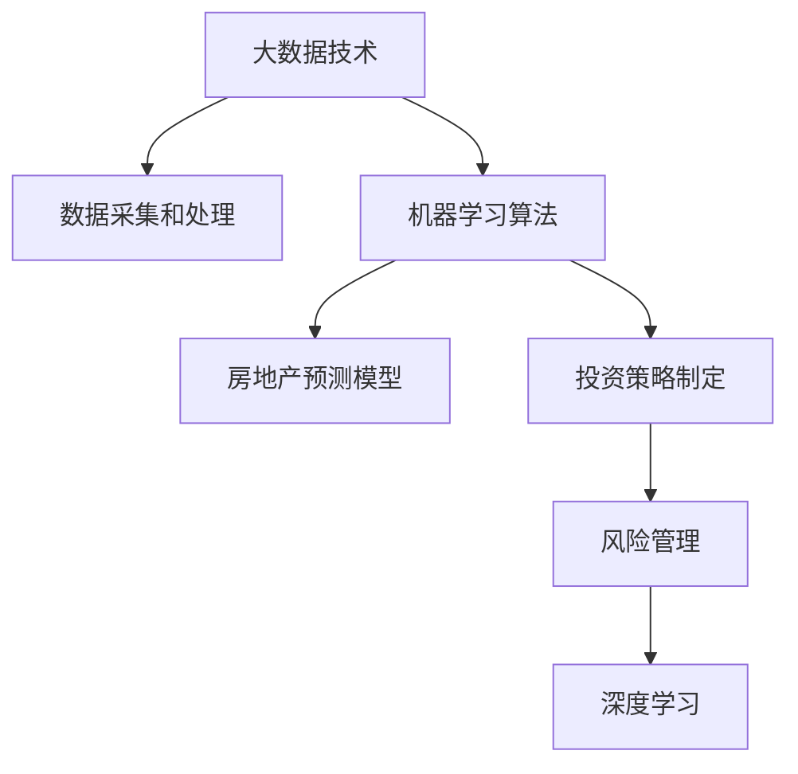

                 

# 如何利用技术能力进行房地产投资

> 关键词：大数据, 机器学习, 房地产预测, 投资策略, 风险管理, 深度学习

## 1. 背景介绍

### 1.1 问题由来

随着人工智能技术的快速发展，大数据和机器学习在房地产投资领域的应用日益增多。大数据技术能够处理和分析海量房地产数据，机器学习算法则可以从历史数据中挖掘出潜在的规律和趋势。因此，利用技术能力进行房地产投资，不仅可以提高投资决策的科学性和精确性，还能有效降低投资风险，提升投资回报率。

### 1.2 问题核心关键点

房地产投资的关键在于选择合适的地点和时间，以及预测未来房价的走势。利用技术手段进行房地产投资，主要包括以下几个方面：

- **数据采集和处理**：通过爬虫、API接口等方式收集房地产市场的相关数据，包括房价、租金、成交数量、房屋面积等。
- **数据建模和预测**：使用机器学习模型，如线性回归、决策树、随机森林等，对历史数据进行建模，预测未来房价的变化。
- **投资策略制定**：根据模型预测结果，制定投资策略，如确定投资区域、选择购买时机等。
- **风险管理**：通过技术手段评估投资风险，并采取相应的风险管理措施。

## 2. 核心概念与联系

### 2.1 核心概念概述

为更好地理解利用技术能力进行房地产投资，本节将介绍几个密切相关的核心概念：

- **大数据技术**：指处理和分析海量数据的技术，包括数据采集、数据清洗、数据存储、数据处理和数据可视化等环节。大数据技术能够帮助投资者从海量数据中提取有价值的信息，进行更加精准的投资决策。

- **机器学习算法**：指通过算法模型自动学习和优化，以发现数据中的规律和趋势。在房地产投资中，机器学习算法可以用于房价预测、市场趋势分析、投资风险评估等任务。

- **房地产预测模型**：指基于历史数据，利用机器学习算法建立的预测未来房价的模型。常见的预测模型包括线性回归模型、时间序列模型、随机森林模型等。

- **投资策略制定**：指根据市场预测结果，制定合适的投资策略，如选择投资区域、投资时机、投资金额等。

- **风险管理**：指通过技术手段评估投资风险，并采取相应的风险管理措施，如分散投资、设立止损点等。

- **深度学习**：指通过多层次神经网络进行学习和优化，可以处理更加复杂的数据和任务。在房地产投资中，深度学习可用于更复杂的预测和决策。

这些核心概念之间的逻辑关系可以通过以下Mermaid流程图来展示：



这个流程图展示了大数据技术、机器学习算法、房地产预测模型、投资策略制定、风险管理和深度学习之间的联系和逻辑关系。

## 3. 核心算法原理 & 具体操作步骤

### 3.1 算法原理概述

利用技术能力进行房地产投资，其核心在于通过数据驱动的方法，进行市场分析和预测，并制定相应的投资策略。具体流程包括：

1. **数据采集和处理**：收集房地产市场的相关数据，进行清洗和预处理。
2. **数据建模和预测**：使用机器学习算法对历史数据进行建模，预测未来房价的走势。
3. **投资策略制定**：根据模型预测结果，制定合适的投资策略。
4. **风险管理**：评估投资风险，并采取相应的风险管理措施。

### 3.2 算法步骤详解

#### 3.2.1 数据采集和处理

数据采集和处理是房地产投资的首要步骤，主要包括以下几个方面：

1. **数据来源**：
   - 公开数据：如政府发布的房地产市场报告、房产交易平台的数据等。
   - 第三方数据：如房产中介机构的数据、房产调查数据等。
   - 爬虫采集：使用爬虫技术，从各大房产平台和社交媒体上获取数据。

2. **数据清洗**：
   - 数据去重：去除重复的数据。
   - 数据异常处理：处理缺失值、异常值等。
   - 数据标准化：将不同来源的数据进行标准化处理，使其具有可比性。

#### 3.2.2 数据建模和预测

数据建模和预测是利用技术能力进行房地产投资的核心环节，主要包括以下几个步骤：

1. **特征工程**：
   - 特征选择：选择对房价预测有帮助的特征，如地理位置、房屋面积、市场活跃度等。
   - 特征变换：对特征进行编码、归一化、离散化等处理。

2. **模型选择和训练**：
   - 模型选择：选择合适的机器学习算法，如线性回归、决策树、随机森林等。
   - 模型训练：使用历史数据对模型进行训练，调整模型参数。

3. **模型评估和优化**：
   - 模型评估：使用验证集对模型进行评估，计算预测误差。
   - 模型优化：根据评估结果，调整模型参数，优化模型性能。

#### 3.2.3 投资策略制定

投资策略制定是根据模型预测结果，制定合适的投资策略，主要包括以下几个方面：

1. **投资区域选择**：
   - 选择市场潜力大的区域进行投资。
   - 分析区域经济、人口、交通等综合因素。

2. **投资时机选择**：
   - 根据房价预测结果，选择合适的购买时机。
   - 结合市场趋势和政策变化，调整投资计划。

3. **投资金额确定**：
   - 根据市场情况和自身资金状况，确定投资金额。
   - 分散投资，降低风险。

#### 3.2.4 风险管理

风险管理是房地产投资的重要环节，主要包括以下几个方面：

1. **风险评估**：
   - 评估市场风险：如政策风险、经济风险等。
   - 评估个体风险：如房价波动风险、市场流动性风险等。

2. **风险控制**：
   - 分散投资：将资金分散投资到不同区域或不同类型的房产。
   - 设立止损点：设置合理的止损点，及时止损。

### 3.3 算法优缺点

利用技术能力进行房地产投资，具有以下优点：

1. **数据驱动决策**：基于大量历史数据进行预测和决策，减少人为因素的影响，提高决策的科学性。
2. **实时性**：利用大数据和机器学习算法，可以实时分析市场数据，快速做出投资决策。
3. **精确性**：通过复杂的模型和算法，可以提高预测的精确度，减少投资风险。

同时，该方法也存在一定的局限性：

1. **数据质量要求高**：依赖于高质量、高时效性的数据，数据质量差将影响预测结果。
2. **模型复杂度高**：复杂的模型需要大量的计算资源和时间，不适用于小规模数据集。
3. **市场风险无法完全规避**：即使使用技术手段，也无法完全规避市场风险。

尽管存在这些局限性，但就目前而言，利用技术能力进行房地产投资是实现精准投资和风险管理的有效手段。未来相关研究的重点在于如何进一步降低技术手段对数据质量的要求，提高模型的实时性和精确性，同时兼顾市场风险的规避。

### 3.4 算法应用领域

利用技术能力进行房地产投资，在以下几个领域得到了广泛的应用：

1. **房地产市场分析**：利用大数据和机器学习算法，分析市场趋势、区域差异等，为投资者提供市场洞察。
2. **投资区域选择**：基于历史数据和模型预测，选择市场潜力大的区域进行投资。
3. **投资时机选择**：根据房价预测结果，选择最佳的投资时机。
4. **风险管理**：利用技术手段评估和控制投资风险，降低投资损失。
5. **投资组合优化**：使用多层次的机器学习模型，优化投资组合，提高投资回报率。

除了上述这些经典应用外，利用技术能力进行房地产投资还在更多场景中得到了创新性的应用，如智能城市规划、智慧住宅、房地产金融等，为房地产市场带来了新的机遇。

## 4. 数学模型和公式 & 详细讲解  
### 4.1 数学模型构建

本节将使用数学语言对利用技术能力进行房地产投资的过程进行更加严格的刻画。

设房地产市场的特征向量为 $\boldsymbol{x} \in \mathbb{R}^n$，其中 $n$ 为特征数量。设房价为 $y \in \mathbb{R}$，则线性回归模型可以表示为：

$$
y = \boldsymbol{w}^T \boldsymbol{x} + b
$$

其中 $\boldsymbol{w} \in \mathbb{R}^n$ 为权重向量，$b$ 为截距。

对于非线性关系，可以引入多项式特征或核函数，建立多项式回归模型或核函数回归模型。

### 4.2 公式推导过程

以下我们以线性回归模型为例，推导其预测结果及其梯度。

设样本集为 $D=\{(\boldsymbol{x}_i,y_i)\}_{i=1}^N$，则线性回归模型的损失函数可以表示为：

$$
\mathcal{L}(\boldsymbol{w}) = \frac{1}{2N} \sum_{i=1}^N (y_i - \boldsymbol{w}^T \boldsymbol{x}_i - b)^2
$$

根据梯度下降算法，模型的更新公式为：

$$
\boldsymbol{w} \leftarrow \boldsymbol{w} - \eta \nabla_{\boldsymbol{w}} \mathcal{L}(\boldsymbol{w}), \quad b \leftarrow b - \eta \nabla_b \mathcal{L}(\boldsymbol{w})
$$

其中 $\nabla_{\boldsymbol{w}} \mathcal{L}(\boldsymbol{w})$ 为损失函数对权重向量的梯度，$\nabla_b \mathcal{L}(\boldsymbol{w})$ 为损失函数对截距的梯度。

具体计算公式为：

$$
\nabla_{\boldsymbol{w}} \mathcal{L}(\boldsymbol{w}) = \frac{1}{N} \sum_{i=1}^N (y_i - \boldsymbol{w}^T \boldsymbol{x}_i - b) \boldsymbol{x}_i
$$

$$
\nabla_b \mathcal{L}(\boldsymbol{w}) = \frac{1}{N} \sum_{i=1}^N (y_i - \boldsymbol{w}^T \boldsymbol{x}_i - b)
$$

通过上述公式，可以对模型进行迭代优化，直到收敛为止。

### 4.3 案例分析与讲解

以某城市的房价预测为例，使用线性回归模型进行房价预测。首先，收集该城市的历史房价数据和房屋特征数据，并进行数据清洗和特征选择。然后，使用历史数据对模型进行训练，得到权重向量 $\boldsymbol{w}$ 和截距 $b$。最后，将新样本的特征向量代入模型，得到预测房价。

## 5. 项目实践：代码实例和详细解释说明
### 5.1 开发环境搭建

在进行房地产投资技术实践前，我们需要准备好开发环境。以下是使用Python进行Scikit-learn开发的开发环境配置流程：

1. 安装Anaconda：从官网下载并安装Anaconda，用于创建独立的Python环境。

2. 创建并激活虚拟环境：
```bash
conda create -n real-estate python=3.8 
conda activate real-estate
```

3. 安装Scikit-learn：
```bash
conda install scikit-learn
```

4. 安装其他相关库：
```bash
pip install pandas numpy matplotlib seaborn
```

完成上述步骤后，即可在`real-estate`环境中开始房地产投资技术实践。

### 5.2 源代码详细实现

下面我们以房价预测为例，给出使用Scikit-learn进行线性回归模型的PyTorch代码实现。

首先，定义线性回归模型：

```python
from sklearn.linear_model import LinearRegression
from sklearn.model_selection import train_test_split
import pandas as pd
import numpy as np
import matplotlib.pyplot as plt

# 读取数据
data = pd.read_csv('house_price.csv')

# 数据预处理
features = data[['area', 'rooms', 'bathrooms', 'price']]
target = data['price']
features.dropna(inplace=True)
target.dropna(inplace=True)

# 特征选择和编码
features = pd.get_dummies(features, drop_first=True)
X = features
y = target

# 模型训练和评估
X_train, X_test, y_train, y_test = train_test_split(X, y, test_size=0.2, random_state=42)

model = LinearRegression()
model.fit(X_train, y_train)

# 模型预测
y_pred = model.predict(X_test)

# 模型评估
print('R^2 score:', model.score(X_test, y_test))
```

然后，绘制预测结果与真实结果的对比图：

```python
plt.scatter(y_test, y_pred)
plt.xlabel('True Price')
plt.ylabel('Predicted Price')
plt.show()
```

### 5.3 代码解读与分析

让我们再详细解读一下关键代码的实现细节：

**数据预处理**：
- 读取数据：使用`pandas`读取CSV文件，加载数据。
- 数据清洗：使用`dropna`方法去除缺失值。
- 特征选择和编码：使用`get_dummies`方法将类别特征转换为哑变量。

**模型训练和评估**：
- 数据分割：使用`train_test_split`方法将数据集分割为训练集和测试集。
- 模型训练：使用`fit`方法训练线性回归模型。
- 模型预测：使用`predict`方法对测试集进行预测。
- 模型评估：使用`score`方法计算R^2 score。

**可视化**：
- 使用`matplotlib`绘制预测结果与真实结果的对比图。

可以看到，使用Scikit-learn进行线性回归模型实现非常简单，开发者可以将更多精力放在数据处理和模型优化上，而不必过多关注底层的实现细节。

当然，工业级的系统实现还需考虑更多因素，如模型的保存和部署、超参数的自动搜索、更灵活的特征选择等。但核心的预测范式基本与此类似。

## 6. 实际应用场景
### 6.1 智能房地产推荐系统

利用技术能力进行房地产投资，可以应用于智能房地产推荐系统的构建。传统的房地产推荐系统往往只依赖用户的历史浏览记录和评分，无法提供个性化的推荐结果。通过使用机器学习模型对用户行为和市场数据进行建模，可以构建更加智能的推荐系统。

在技术实现上，可以收集用户的历史浏览、点击、评分等行为数据，同时收集市场数据，如房价、租金、房屋面积等。将用户行为数据和市场数据作为模型输入，使用机器学习模型进行建模，预测用户的喜好和需求，从而提供更加个性化的推荐结果。

### 6.2 房地产市场预测系统

房地产市场预测系统可以根据历史数据和当前市场情况，预测未来的市场趋势和房价变化，帮助投资者做出更为合理的投资决策。

在技术实现上，可以收集历史房价数据和市场数据，如经济数据、政策数据等。使用机器学习模型对这些数据进行建模，预测未来的房价变化。系统可以根据市场预测结果，向投资者提供投资建议和风险提示。

### 6.3 风险管理与预警系统

房地产投资存在较高的风险，如市场波动、政策风险等。利用技术能力进行风险管理，可以构建实时风险预警系统，及时发现风险并采取相应的应对措施。

在技术实现上，可以收集市场数据和政策数据，使用机器学习模型对市场趋势进行预测。系统根据市场预测结果，实时评估投资组合的风险，并在风险超出预设阈值时，及时向投资者发出预警，提醒其调整投资策略。

### 6.4 未来应用展望

随着房地产投资技术的发展，基于技术能力进行房地产投资将呈现以下几个发展趋势：

1. **多模态数据融合**：未来将更加注重多模态数据的融合，如将房产图片、视频等视觉信息与文字信息结合，提高市场分析的精度。
2. **深度学习的应用**：未来将更多地应用深度学习模型，如卷积神经网络、循环神经网络等，提升模型的预测能力。
3. **实时化与自动化**：未来将更加注重实时化与自动化，实时分析市场数据，自动化调整投资策略，提高投资效率。
4. **个性化推荐**：未来将更加注重个性化推荐，根据用户的行为和需求，提供更加个性化的投资建议和风险提示。

这些趋势将进一步提升房地产投资技术的精度和效率，为投资者提供更为精准的投资建议和风险管理。

## 7. 工具和资源推荐
### 7.1 学习资源推荐

为了帮助开发者系统掌握房地产投资技术的基础知识和实践技巧，这里推荐一些优质的学习资源：

1. 《机器学习实战》系列博文：由机器学习专家撰写，详细介绍了机器学习的基本概念和经典模型，适合初学者入门。

2. 《Python深度学习》课程：由深度学习大牛编写，深入浅出地介绍了深度学习的基本原理和实践技巧，适合进阶学习。

3. 《房地产投资手册》书籍：系统介绍了房地产投资的基本理论和实践方法，适合房地产投资者参考。

4. 《大数据与房地产投资》在线课程：由大数据专家和房地产专家联合授课，涵盖大数据和房地产投资的基本知识和应用案例，适合全面学习。

5. 《房地产市场分析与投资策略》学术论文：系统分析了房地产市场的特点和投资策略，适合深入研究。

通过对这些资源的学习实践，相信你一定能够快速掌握房地产投资技术的精髓，并用于解决实际的房地产投资问题。

### 7.2 开发工具推荐

高效的开发离不开优秀的工具支持。以下是几款用于房地产投资技术开发的常用工具：

1. Python：基于Python的开源编程语言，灵活动态的计算图，适合快速迭代研究。

2. Scikit-learn：Python的机器学习库，提供丰富的机器学习算法和工具，适合快速实现和评估模型。

3. TensorFlow：由Google主导开发的深度学习框架，生产部署方便，适合大规模工程应用。

4. Jupyter Notebook：基于Web的交互式笔记本，方便代码编写和调试，适合快速原型开发。

5. Tableau：数据可视化工具，可以方便地进行数据探索和可视化，适合数据驱动决策。

合理利用这些工具，可以显著提升房地产投资技术的开发效率，加快创新迭代的步伐。

### 7.3 相关论文推荐

房地产投资技术的发展源于学界的持续研究。以下是几篇奠基性的相关论文，推荐阅读：

1. 《房地产市场动态预测模型》：研究了基于时间序列的房地产市场预测模型，介绍了模型的构建和应用。

2. 《基于机器学习的房地产投资决策方法》：探讨了基于机器学习的房地产投资决策方法，介绍了特征选择和模型评估等技术。

3. 《房地产投资组合优化》：研究了基于多层次机器学习模型的房地产投资组合优化方法，介绍了模型构建和优化策略。

4. 《房地产市场风险管理》：介绍了房地产市场风险的评估和管理方法，探讨了如何利用机器学习模型进行风险管理。

5. 《深度学习在房地产投资中的应用》：探讨了深度学习在房地产投资中的潜在应用，介绍了模型构建和优化技术。

这些论文代表了大数据和机器学习在房地产投资中的应用方向，通过学习这些前沿成果，可以帮助研究者把握学科前进方向，激发更多的创新灵感。

## 8. 总结：未来发展趋势与挑战

### 8.1 总结

本文对利用技术能力进行房地产投资的方法进行了全面系统的介绍。首先阐述了利用技术能力进行房地产投资的背景和意义，明确了技术手段在提升投资决策科学性和降低投资风险方面的独特价值。其次，从原理到实践，详细讲解了技术手段进行房地产投资的全流程，包括数据采集、处理、建模、预测和风险管理等环节。同时，本文还广泛探讨了技术手段在房地产推荐系统、市场预测、风险管理等多个领域的应用前景，展示了技术手段的广阔潜力。

通过本文的系统梳理，可以看到，利用技术能力进行房地产投资是实现精准投资和风险管理的有效手段。未来，伴随大数据和机器学习技术的持续演进，房地产投资技术将不断提升其精度和效率，为投资者提供更为精准的投资建议和风险管理。

### 8.2 未来发展趋势

展望未来，房地产投资技术将呈现以下几个发展趋势：

1. **技术手段多样化**：未来将更加注重多种技术手段的结合，如大数据、机器学习、深度学习等，提供更为精准的投资建议。
2. **实时化与自动化**：未来将更加注重实时化与自动化，实时分析市场数据，自动化调整投资策略，提高投资效率。
3. **多模态数据融合**：未来将更加注重多模态数据的融合，如将房产图片、视频等视觉信息与文字信息结合，提高市场分析的精度。
4. **深度学习的应用**：未来将更多地应用深度学习模型，如卷积神经网络、循环神经网络等，提升模型的预测能力。
5. **个性化推荐**：未来将更加注重个性化推荐，根据用户的行为和需求，提供更加个性化的投资建议和风险提示。

这些趋势将进一步提升房地产投资技术的精度和效率，为投资者提供更为精准的投资建议和风险管理。

### 8.3 面临的挑战

尽管利用技术能力进行房地产投资取得了显著成效，但在迈向更加智能化、普适化应用的过程中，仍面临诸多挑战：

1. **数据质量要求高**：依赖于高质量、高时效性的数据，数据质量差将影响预测结果。
2. **模型复杂度高**：复杂的模型需要大量的计算资源和时间，不适用于小规模数据集。
3. **市场风险无法完全规避**：即使使用技术手段，也无法完全规避市场风险。
4. **技术手段成本高**：技术手段的开发和维护需要大量的人力和财力投入。

尽管存在这些挑战，但就目前而言，利用技术能力进行房地产投资是实现精准投资和风险管理的有效手段。未来相关研究的重点在于如何进一步降低技术手段对数据质量的要求，提高模型的实时性和精确性，同时兼顾市场风险的规避和成本控制。

### 8.4 研究展望

面对房地产投资技术面临的种种挑战，未来的研究需要在以下几个方面寻求新的突破：

1. **数据质量提升**：探索更高效的数据采集和处理技术，提高数据质量，降低数据采集成本。
2. **模型优化与简化**：开发更加高效、简洁的模型，降低计算资源需求，提高模型的实时性。
3. **多层次模型融合**：将多种技术手段进行融合，提高预测的精度和稳定性。
4. **个性化推荐优化**：开发更智能、更个性化的推荐系统，提升用户体验和投资回报率。
5. **风险管理改进**：结合多种风险评估方法，提高风险管理的准确性和有效性。

这些研究方向的探索，必将引领房地产投资技术迈向更高的台阶，为投资者提供更为精准的投资建议和风险管理。面向未来，房地产投资技术还需要与其他人工智能技术进行更深入的融合，如知识表示、因果推理、强化学习等，多路径协同发力，共同推动房地产投资技术的进步。

## 9. 附录：常见问题与解答

**Q1：房地产投资技术是否适用于所有类型的房地产项目？**

A: 房地产投资技术适用于不同类型的房地产项目，但不同类型的项目需要根据其特点进行相应的数据采集、特征选择和模型构建。例如，住宅项目和商业项目在特征选择和预测模型上可能存在较大差异。

**Q2：如何选择合适的房地产数据来源？**

A: 选择合适的房地产数据来源，需要考虑数据的权威性、时效性和可获取性。一般来说，政府发布的公开数据和专业房地产中介机构的数据质量较高，但获取成本也相对较高。另外，社交媒体和房产平台的数据也是重要的信息来源，但需要进行数据清洗和验证。

**Q3：房地产投资技术中，数据处理和特征工程的重要性如何？**

A: 数据处理和特征工程是房地产投资技术的关键环节，直接影响模型的预测精度和应用效果。在数据处理中，需要去除噪声和异常值，进行数据标准化和归一化。在特征工程中，需要选择合适的特征并进行编码和变换，提高模型的预测能力。

**Q4：房地产投资技术中，模型的选择和优化有哪些建议？**

A: 在模型选择方面，应根据数据特点和预测任务选择合适的模型，如线性回归、决策树、随机森林等。在模型优化方面，应使用交叉验证、网格搜索等方法，调整模型参数，提高模型的预测精度。

**Q5：房地产投资技术中，如何评估和控制风险？**

A: 评估和控制房地产投资风险，需要结合市场数据和政策数据，使用风险评估模型进行风险评估。同时，应根据风险评估结果，采取相应的风险管理措施，如分散投资、设立止损点等。

通过本文的系统梳理，可以看到，利用技术能力进行房地产投资是实现精准投资和风险管理的有效手段。未来，伴随大数据和机器学习技术的持续演进，房地产投资技术将不断提升其精度和效率，为投资者提供更为精准的投资建议和风险管理。相信随着学界和产业界的共同努力，这些挑战终将一一被克服，房地产投资技术必将实现更广泛的应用，助力房地产市场的健康发展。

---

作者：禅与计算机程序设计艺术 / Zen and the Art of Computer Programming

