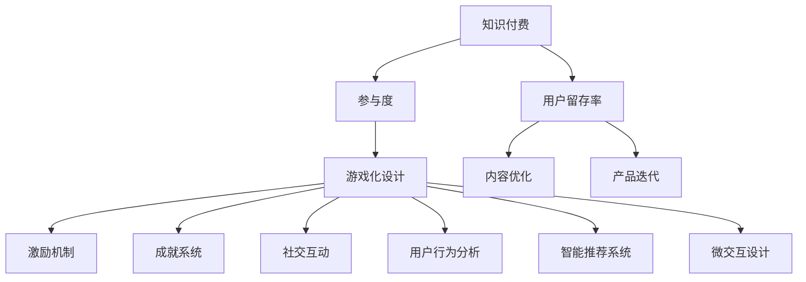

                 

# 如何利用游戏化设计提高知识付费的参与度

> 关键词：知识付费,参与度,游戏化设计,用户行为,数据驱动

## 1. 背景介绍

### 1.1 问题由来

在知识付费的时代，内容创作者如何吸引用户付费成为一大难题。传统的内容付费模式，往往依赖于内容的稀缺性和权威性，用户通过购买获取独家内容，但这种模式容易产生用户流失。而通过游戏化设计，可以更好地激发用户参与度，提升内容付费的可持续性。

游戏化设计将游戏化的元素，如积分、成就、等级等引入到非游戏场景，通过奖赏机制和互动性，使内容消费变得更加有趣、有价值。相比于传统的付费模式，游戏化设计不仅能够提升用户粘性，还能带动用户主动探索和学习，增强用户的自我驱动性和付费意愿。

### 1.2 问题核心关键点

游戏化设计的核心在于通过游戏化的元素和机制，使用户在内容消费的过程中获得愉悦体验，从而提升参与度。关键点包括：

- 激励机制：设计合理的激励体系，使用户获得成就感和满足感。
- 成就系统：通过积分、徽章、排名等设定，鼓励用户不断进步。
- 社交互动：引入社交元素，增强用户间的竞争与合作，提高参与度。
- 数据驱动：通过分析用户行为数据，优化游戏化设计，提升用户体验。

## 2. 核心概念与联系

### 2.1 核心概念概述

为更好地理解游戏化设计在知识付费中的应用，本节将介绍几个关键概念：

- 知识付费：指用户通过付费获取高质量内容，以满足自身知识和技能提升的需求。内容形式包括课程、文章、视频等，涵盖领域广泛，从编程、营销、到哲学、艺术等。

- 参与度：指用户对内容的活跃程度和互动频次，是衡量知识付费平台成功的关键指标。

- 游戏化设计：指将游戏化元素和机制引入非游戏场景，通过设定奖赏机制和互动性，提升用户体验。

- 用户行为分析：通过收集和分析用户行为数据，理解用户需求和行为模式，指导内容优化和产品迭代。

- 智能推荐系统：利用算法为用户推荐个性化的内容，提升用户体验和参与度。

- 微交互设计：通过微小而有效的交互方式，提升用户粘性和满意度。

- 用户留存率：指用户在一定时间内继续使用产品的概率，是衡量产品可持续性的重要指标。

这些概念之间的逻辑关系可以通过以下Mermaid流程图来展示：



这个流程图展示出知识付费系统、参与度、游戏化设计及其关键组成部分之间的联系，游戏化设计通过优化激励机制、成就系统、社交互动、智能推荐和微交互，最终提升用户留存率和参与度。

## 3. 核心算法原理 & 具体操作步骤
### 3.1 算法原理概述

游戏化设计的核心在于通过奖赏机制和互动性，激发用户的内在动机，使其在内容消费的过程中获得愉悦体验，从而提升参与度。具体原理如下：

1. 激励机制：通过积分、勋章、排行榜等设定，激发用户的成就感和荣誉感。用户获得奖赏后，会感到满足和自豪，从而更愿意继续消费。

2. 成就系统：通过设定不同层级的成就目标，使用户在完成任务时获得满足感。用户完成初级、中级、高级目标后，会逐步感到成就感，并提升参与度。

3. 社交互动：引入社交元素，如排行榜、好友挑战等，使用户感受到竞争和合作，增强互动性。

4. 数据驱动：通过分析用户行为数据，理解用户需求和行为模式，优化游戏化设计，提升用户体验。

5. 智能推荐：利用推荐算法，为用户推荐个性化的内容，满足用户需求，提升参与度。

### 3.2 算法步骤详解

以下是一个典型的游戏化设计流程，包括从需求分析、设计、实现到评估的各个阶段：

**Step 1: 需求分析**

1. 调研用户需求：通过问卷调查、用户访谈等手段，了解用户对知识付费的期望和需求。

2. 设定目标：明确游戏化设计的目标，如提升用户留存率、增加用户活跃度等。

**Step 2: 游戏化设计**

1. 确定核心元素：选择适合的游戏化元素，如积分、勋章、排行榜等。

2. 设计奖赏机制：设定奖赏标准和规则，如积分如何获得、如何兑换、排行榜如何计算等。

3. 构建成就系统：设计不同层级的成就目标，设定达成条件和奖励机制。

4. 引入社交互动：设计排行榜、好友挑战、社交分享等功能。

**Step 3: 实现与测试**

1. 开发游戏化功能：将设计好的游戏化元素和机制融入产品，进行开发和测试。

2. 收集用户反馈：通过用户测试、问卷调查等手段，收集用户对游戏化设计的反馈。

3. 优化设计：根据用户反馈，不断优化游戏化设计，提升用户体验。

**Step 4: 数据分析与评估**

1. 分析用户行为数据：通过分析用户数据，理解用户行为模式和需求。

2. 评估游戏化效果：通过数据分析评估游戏化设计的效果，如用户留存率、参与度等指标。

3. 持续改进：根据评估结果，持续改进游戏化设计，提升用户体验和参与度。

### 3.3 算法优缺点

游戏化设计具有以下优点：

1. 提升用户参与度：通过设定奖赏机制和互动性，激发用户的内在动机，提升用户参与度。

2. 增强用户粘性：通过激励机制和成就系统，增强用户粘性，使其更愿意继续消费。

3. 提升用户满意度：通过个性化推荐和社交互动，满足用户需求，提升用户满意度。

4. 灵活性强：游戏化设计可以根据不同用户群体进行个性化定制，提升用户体验。

同时，该方法也存在一定的局限性：

1. 成本较高：设计和开发游戏化功能需要较高的投入，尤其是在初期阶段。

2. 用户接受度有限：不是所有用户都对游戏化设计感兴趣，过度游戏化可能导致用户反感。

3. 数据隐私问题：游戏化设计需要收集用户行为数据，涉及用户隐私保护问题。

4. 复杂性高：游戏化设计需要综合考虑多个因素，设计和实现过程较为复杂。

尽管存在这些局限性，但就目前而言，游戏化设计仍然是一种提升知识付费参与度的有效手段。未来相关研究的重点在于如何降低成本、提升用户接受度，同时兼顾数据隐私和复杂性等因素。

### 3.4 算法应用领域

游戏化设计在知识付费领域的应用场景广泛，包括但不限于：

- 课程订阅：通过积分、勋章等设定，鼓励用户持续订阅课程，提升学习效果。

- 学习进度追踪：设定学习成就和进度追踪，使用户感受到成就感，提高学习动力。

- 互动讨论：引入社交互动功能，使用户在课程讨论区活跃，增强互动性。

- 在线测试：通过设置测试等级和奖励机制，激励用户完成测试，提升学习效果。

- 用户反馈：收集用户对课程的反馈，通过数据分析优化课程内容和设计。

- 活动激励：设计线上活动和挑战，使用户参与互动，提升参与度。

除了上述这些应用场景外，游戏化设计还被创新性地应用到更多领域，如健康管理、社交网络、教育平台等，为提高用户参与度提供了新的思路。

## 4. 数学模型和公式 & 详细讲解 & 举例说明
### 4.1 数学模型构建

本节将使用数学语言对游戏化设计进行更加严格的刻画。

记用户为 $U=\{u_1, u_2, ..., u_n\}$，知识付费内容为 $C=\{c_1, c_2, ..., c_m\}$。设用户完成内容 $c_i$ 获得的积分数为 $I_{ui}$，勋章数为 $J_{ui}$，排行榜排名为 $R_{ui}$，社交互动度为 $S_{ui}$。设内容 $c_i$ 的难度系数为 $D_i$，用户对内容 $c_i$ 的兴趣度为 $I_i$，完成度为 $C_i$。

定义用户完成内容 $c_i$ 获得的总评分 $P_{ui}$ 为：

$$
P_{ui} = w_1I_{ui} + w_2J_{ui} + w_3R_{ui} + w_4S_{ui}
$$

其中 $w_1, w_2, w_3, w_4$ 为各项指标的权重，需要通过数据分析确定。

定义用户对内容 $c_i$ 的综合评分 $G_{ui}$ 为：

$$
G_{ui} = f(P_{ui}, D_i, I_i, C_i)
$$

其中 $f$ 为评分函数，可以根据用户行为数据和内容特征进行建模。

### 4.2 公式推导过程

以下我们以学习进度追踪为例，推导激励机制和成就系统的计算公式。

设用户 $u$ 完成课程 $c$ 的进度为 $P_u = \frac{已完成课程数}{总课程数}$，已完成课程数记为 $N_{uc}$。课程 $c$ 的难度系数为 $D_c$，用户对课程 $c$ 的兴趣度为 $I_c$，完成度为 $C_c$。

用户 $u$ 完成课程 $c$ 获得的积分 $I_{uc}$ 为：

$$
I_{uc} = \alpha_u P_u^k \times I_c
$$

其中 $\alpha_u$ 为用户 $u$ 的激励系数，$k$ 为激励系数衰减因子，通常取 $0.95$。

用户 $u$ 获得勋章的条件为 $P_u > p$，其中 $p$ 为勋章级别。用户 $u$ 获得勋章后，按照如下公式更新其勋章数：

$$
J_{uc} = \begin{cases}
    J_{uc} + 1, & \text{如果完成课程} \\
    J_{uc}, & \text{如果未完成课程}
\end{cases}
$$

用户 $u$ 在排行榜上的排名 $R_u$ 为：

$$
R_u = \sum_{c_i} P_{ui} \times \frac{1}{D_i} \times I_i \times C_i
$$

用户 $u$ 的社交互动度 $S_u$ 为：

$$
S_u = \sum_{c_i} P_{ui} \times \frac{1}{D_i} \times I_i \times C_i \times S_{ci}
$$

其中 $S_{ci}$ 为内容 $c_i$ 的社交互动度，可以通过数据分析确定。

### 4.3 案例分析与讲解

以下我们以在线测试为例，展示如何设计游戏化机制。

假设内容创作者设计了一个在线测试，共分为三个难度等级：初级、中级、高级。用户完成每个等级的测试后，都会获得相应的积分和勋章。

**初级测试**：

- 难度系数 $D_1 = 0.5$
- 用户兴趣度 $I_1 = 0.7$
- 用户完成度 $C_1 = 0.9$
- 积分 $I_{u1} = 100$，勋章 $J_{u1} = 1$

**中级测试**：

- 难度系数 $D_2 = 0.8$
- 用户兴趣度 $I_2 = 0.9$
- 用户完成度 $C_2 = 0.8$
- 积分 $I_{u2} = 200$，勋章 $J_{u2} = 2$

**高级测试**：

- 难度系数 $D_3 = 1.0$
- 用户兴趣度 $I_3 = 1.0$
- 用户完成度 $C_3 = 0.6$
- 积分 $I_{u3} = 300$，勋章 $J_{u3} = 3$

用户 $u$ 完成三个等级测试后，获得的总评分 $P_u$ 为：

$$
P_u = 100 \times 0.9 \times 0.5 \times 0.7 + 200 \times 0.8 \times 0.8 \times 0.9 + 300 \times 0.6 \times 1.0 \times 1.0 = 810
$$

用户 $u$ 的综合评分 $G_u$ 为：

$$
G_u = f(810, 0.5, 0.7, 0.9)
$$

其中 $f$ 为评分函数，可以根据用户行为数据和内容特征进行建模。例如，可以使用线性回归模型来预测用户对测试的综合评分：

$$
G_u = 810 \times 0.8 + 0.2 \times (D_1 + D_2 + D_3) \times (I_1 + I_2 + I_3) \times (C_1 + C_2 + C_3)
$$

用户 $u$ 在排行榜上的排名 $R_u$ 为：

$$
R_u = G_u \times \frac{1}{0.5 \times 0.7 \times 0.9 \times 0.8 \times 0.8 \times 0.9 \times 0.6 \times 1.0 \times 1.0}
$$

用户 $u$ 的社交互动度 $S_u$ 为：

$$
S_u = G_u \times \frac{1}{0.5 \times 0.7 \times 0.9 \times 0.8 \times 0.8 \times 0.9 \times 0.6 \times 1.0 \times 1.0} \times S_1 \times S_2 \times S_3
$$

其中 $S_1, S_2, S_3$ 为内容 $c_1, c_2, c_3$ 的社交互动度，可以通过数据分析确定。

## 5. 项目实践：代码实例和详细解释说明
### 5.1 开发环境搭建

在进行游戏化设计实践前，我们需要准备好开发环境。以下是使用Python进行Flask开发的环境配置流程：

1. 安装Anaconda：从官网下载并安装Anaconda，用于创建独立的Python环境。

2. 创建并激活虚拟环境：
```bash
conda create -n flask-env python=3.8 
conda activate flask-env
```

3. 安装Flask：
```bash
pip install flask
```

4. 安装Flask-RESTful：
```bash
pip install flask-restful
```

5. 安装Flask-SQLAlchemy：
```bash
pip install flask-sqlalchemy
```

6. 安装Flask-WTF：
```bash
pip install flask-wtf
```

7. 安装Flask-Login：
```bash
pip install flask-login
```

完成上述步骤后，即可在`flask-env`环境中开始游戏化设计实践。

### 5.2 源代码详细实现

我们以学习进度追踪功能为例，给出使用Flask框架进行游戏化设计的PyTorch代码实现。

首先，定义数据库模型：

```python
from flask_sqlalchemy import SQLAlchemy
from flask_login import UserMixin, LoginManager
from werkzeug.security import generate_password_hash, check_password_hash

db = SQLAlchemy()
login_manager = LoginManager()
login_manager.init_app(app)

class User(UserMixin, db.Model):
    id = db.Column(db.Integer, primary_key=True)
    username = db.Column(db.String(30), unique=True, nullable=False)
    password_hash = db.Column(db.String(128))
    games = db.relationship('Game', backref='user', lazy=True)

@login_manager.user_loader
def load_user(user_id):
    return User.query.get(int(user_id))
```

然后，定义游戏模型：

```python
class Game(db.Model):
    id = db.Column(db.Integer, primary_key=True)
    user_id = db.Column(db.Integer, db.ForeignKey('user.id'), nullable=False)
    game_name = db.Column(db.String(30), nullable=False)
    progress = db.Column(db.Float)
    score = db.Column(db.Integer)
    level = db.Column(db.Integer)
    completed = db.Column(db.Boolean, default=False)

@login_manager.user_loader
def load_user(user_id):
    return User.query.get(int(user_id))
```

接着，定义游戏化逻辑：

```python
@app.route('/user/games', methods=['GET'])
def get_user_games():
    current_user = login_manager.current_user
    games = current_user.games
    game_dict = {game.id: {
        'name': game.game_name,
        'progress': game.progress,
        'score': game.score,
        'level': game.level,
        'completed': game.completed
    } for game in games}
    return jsonify(game_dict)

@app.route('/user/games/<int:game_id>/update', methods=['POST'])
def update_game(game_id):
    current_user = login_manager.current_user
    game = Game.query.get(game_id)
    game.progress = request.json['progress']
    game.score = request.json['score']
    game.level = request.json['level']
    game.completed = request.json['completed']
    db.session.commit()
    return jsonify({'success': True})

@app.route('/user/games/create', methods=['POST'])
def create_game():
    current_user = login_manager.current_user
    game_name = request.json['name']
    game = Game(user_id=current_user.id, game_name=game_name)
    db.session.add(game)
    db.session.commit()
    return jsonify({'success': True})
```

最后，定义游戏化数据展示：

```python
@app.route('/user/games/<int:game_id>/score', methods=['GET'])
def get_game_score(game_id):
    current_user = login_manager.current_user
    game = Game.query.get(game_id)
    return jsonify({'progress': game.progress, 'score': game.score, 'level': game.level, 'completed': game.completed})
```

以上是一个完整的Flask应用，用于实现学习进度追踪功能。开发者可以将以上代码封装为RESTful API，与前端页面进行交互，展示用户的成就系统和排行榜，使用户能够直观地看到自己的进步和成就。

### 5.3 代码解读与分析

让我们再详细解读一下关键代码的实现细节：

**User模型**：
- 定义了用户的基本信息，包括用户名、密码、游戏等。

**Game模型**：
- 定义了用户完成的游戏记录，包括游戏名称、进度、得分、等级、完成状态等。

**game_dict字典**：
- 将游戏记录转换为JSON格式，方便前端页面展示。

**update_game方法**：
- 根据客户端发来的请求，更新游戏记录的进度、得分、等级和完成状态。

**create_game方法**：
- 创建新游戏记录，并保存到数据库中。

**get_game_score方法**：
- 获取指定游戏的得分、进度、等级和完成状态。

可以看到，通过Flask框架和SQLAlchemy库，开发者可以轻松地实现游戏化功能，并通过RESTful API与前端页面进行数据交互。开发者还可以进一步优化游戏化设计，增加积分、勋章、排行榜等功能，以提升用户体验。

## 6. 实际应用场景
### 6.1 智能客服系统

在游戏化设计中，智能客服系统可以引入游戏元素，增强用户体验和参与度。例如，可以设计积分系统，用户通过解决客服问题获得积分，积分可用于兑换优惠券、免费咨询等奖励。同时，可以引入排行榜和好友挑战等功能，使用户感受到竞争和合作，提高用户粘性。

**积分系统**：

- 用户完成客服问题后，系统给予相应积分奖励。
- 积分可兑换优惠券、免费咨询等奖励。
- 积分排行榜展示用户积分排名，激励用户积极参与。

**排行榜和好友挑战**：

- 用户根据积分排名展示在排行榜上，提升成就感。
- 好友之间可发起挑战，比拼积分和排名。

通过游戏化设计，智能客服系统能够更加有趣和互动，使用户在解决问题的同时，感受到成就和乐趣，提高用户参与度和满意度。

### 6.2 金融理财平台

在金融理财平台中，游戏化设计可以提升用户的理财体验和参与度。例如，可以设计理财挑战，用户通过完成理财任务获得积分和奖励，如理财收益、优惠券等。同时，可以引入排行榜和好友挑战等功能，增强用户的竞争和合作意识。

**理财挑战**：

- 用户完成理财任务后，系统给予相应积分和奖励。
- 积分可用于兑换理财收益、优惠券等奖励。
- 理财挑战排行榜展示用户理财排名，激励用户积极参与。

**排行榜和好友挑战**：

- 用户根据理财收益排名展示在排行榜上，提升成就感。
- 好友之间可发起理财挑战，比拼理财收益和排名。

通过游戏化设计，金融理财平台能够更加有趣和互动，使用户在理财的同时，感受到成就和乐趣，提高用户参与度和满意度。

### 6.3 教育在线课程平台

在游戏化设计中，教育在线课程平台可以提升学生的学习体验和参与度。例如，可以设计学习成就系统，学生通过完成课程获得成就和积分，如课程证书、学习徽章等。同时，可以引入排行榜和好友挑战等功能，增强学生的竞争和合作意识。

**学习成就系统**：

- 学生完成课程后，系统给予相应成就和积分奖励。
- 成就和积分可用于兑换课程证书、学习徽章等奖励。
- 学习成就排行榜展示学生成就排名，激励学生积极参与。

**排行榜和好友挑战**：

- 学生根据成就排名展示在排行榜上，提升成就感。
- 好友之间可发起课程挑战，比拼成就和排名。

通过游戏化设计，教育在线课程平台能够更加有趣和互动，使用户在课程学习的同时，感受到成就和乐趣，提高学生参与度和满意度。

### 6.4 未来应用展望

随着游戏化设计的不断发展，其应用场景将更加广泛，为各行各业带来变革性影响。

在智慧医疗领域，游戏化设计可以提升病患对健康管理的积极性，通过设定积分、成就系统，激励病患积极监测健康数据，获得更多健康管理知识。

在智能教育领域，游戏化设计可以提升学生的学习积极性，通过设定成就系统、排行榜等，增强学生的竞争和合作意识，提升学习效果。

在智慧城市治理中，游戏化设计可以提升市民的参与度，通过设定任务积分、成就系统，鼓励市民积极参与城市管理，提升治理效率。

此外，在企业生产、社会治理、文娱传媒等众多领域，游戏化设计也将不断涌现，为提高用户参与度提供新的思路。相信随着技术的日益成熟，游戏化设计必将成为提升用户体验和参与度的重要手段，推动人工智能技术在各个领域的应用。

## 7. 工具和资源推荐
### 7.1 学习资源推荐

为了帮助开发者系统掌握游戏化设计的理论基础和实践技巧，这里推荐一些优质的学习资源：

1. 《游戏化设计：原理与实践》系列博文：由游戏化设计专家撰写，深入浅出地介绍了游戏化设计的原理、应用和实践技巧。

2. 《设计心理学》课程：斯坦福大学开设的设计心理学课程，涵盖了游戏化设计的心理学基础和设计原则。

3. 《游戏设计模式》书籍：详细介绍了各种游戏化设计模式和应用场景，帮助开发者系统掌握游戏化设计的方法。

4. Udacity的游戏设计课程：提供系统的游戏化设计学习路径，包括游戏设计基础、游戏化应用等课程。

5. Coursera的游戏化设计课程：由知名教育机构提供的游戏化设计课程，涵盖游戏化设计的理论基础和实践技巧。

通过对这些资源的学习实践，相信你一定能够快速掌握游戏化设计的精髓，并将其应用到知识付费平台中，提升用户参与度。
### 7.2 开发工具推荐

高效的开发离不开优秀的工具支持。以下是几款用于游戏化设计开发的常用工具：

1. Python：作为一门高效易用的编程语言，适合快速迭代研究。

2. Flask：轻量级的Web框架，适合开发RESTful API，进行游戏化功能的数据交互。

3. SQLAlchemy：Python的ORM框架，适合进行数据库操作，存储和管理游戏化数据。

4. Bootstrap：用于构建前端页面，提供丰富的UI组件和模板，方便游戏化设计的数据展示。

5. Bootstrap Theme：提供预定义的前端主题，可以快速搭建美观的游戏化页面。

6. Flask-Login：提供用户认证功能，适合游戏化设计中用户的登录和授权管理。

合理利用这些工具，可以显著提升游戏化设计的开发效率，加快创新迭代的步伐。

### 7.3 相关论文推荐

游戏化设计的发展源于学界的持续研究。以下是几篇奠基性的相关论文，推荐阅读：

1. A Study of User Experience in Gamification（游戏化设计对用户体验的影响）：探讨了游戏化设计对用户行为和心理的影响。

2. Gamification Theory: An Overview（游戏化设计的理论综述）：系统总结了游戏化设计的理论基础和实践方法。

3. Gamification: A Design Framework for Social Media（社交媒体中的游戏化设计框架）：提出了一套游戏化设计的框架，适用于社交媒体等平台。

4. Towards a Gameful Learning for Knowledge Sharing（知识共享中的游戏化学习）：探讨了游戏化设计在知识共享中的应用，提升了用户参与度和学习效果。

5. Gamification in e-Learning: A Systematic Review and Research Challenges（电子学习中的游戏化设计）：总结了游戏化设计在电子学习中的应用，提出了未来研究方向。

这些论文代表了大语言模型微调技术的发展脉络。通过学习这些前沿成果，可以帮助研究者把握学科前进方向，激发更多的创新灵感。

## 8. 总结：未来发展趋势与挑战

### 8.1 总结

本文对游戏化设计在知识付费中的应用进行了全面系统的介绍。首先阐述了游戏化设计的背景和意义，明确了游戏化设计在提升用户参与度方面的独特价值。其次，从原理到实践，详细讲解了游戏化设计的数学原理和关键步骤，给出了游戏化任务开发的完整代码实例。同时，本文还广泛探讨了游戏化设计在智能客服、金融理财、教育在线课程等多个领域的应用前景，展示了游戏化设计的巨大潜力。此外，本文精选了游戏化设计的学习资源，力求为开发者提供全方位的技术指引。

通过本文的系统梳理，可以看到，游戏化设计在知识付费系统中的重要性，能够通过设定奖赏机制和互动性，激发用户的内在动机，提升用户参与度。未来相关研究的重点在于如何降低成本、提升用户接受度，同时兼顾数据隐私和复杂性等因素。

### 8.2 未来发展趋势

展望未来，游戏化设计将呈现以下几个发展趋势：

1. 数据驱动的个性化设计：通过大数据和机器学习技术，分析用户行为数据，设计个性化的游戏化方案，提升用户体验。

2. 社交化游戏化：引入社交元素，增强用户间的竞争与合作，提高用户粘性。

3. 多模态游戏化：将游戏化设计扩展到图像、视频、语音等多模态数据，提升用户互动性和参与度。

4. 虚拟现实游戏化：结合虚拟现实技术，创造沉浸式游戏化体验，增强用户沉浸感和互动性。

5. 跨平台游戏化：设计跨平台的游戏化系统，支持多种设备和平台，提升用户便捷性。

以上趋势凸显了游戏化设计的广阔前景。这些方向的探索发展，必将进一步提升用户参与度和满意度，推动游戏化设计在各个领域的应用。

### 8.3 面临的挑战

尽管游戏化设计已经取得了瞩目成就，但在迈向更加智能化、普适化应用的过程中，它仍面临着诸多挑战：

1. 成本较高：设计和开发游戏化功能需要较高的投入，尤其是在初期阶段。

2. 用户接受度有限：不是所有用户都对游戏化设计感兴趣，过度游戏化可能导致用户反感。

3. 数据隐私问题：游戏化设计需要收集用户行为数据，涉及用户隐私保护问题。

4. 复杂性高：游戏化设计需要综合考虑多个因素，设计和实现过程较为复杂。

尽管存在这些局限性，但就目前而言，游戏化设计仍然是一种提升知识付费参与度的有效手段。未来相关研究的重点在于如何降低成本、提升用户接受度，同时兼顾数据隐私和复杂性等因素。

### 8.4 研究展望

面对游戏化设计所面临的挑战，未来的研究需要在以下几个方面寻求新的突破：

1. 探索无监督和半监督游戏化方法：摆脱对大规模用户数据的依赖，利用自监督学习、主动学习等无监督和半监督范式，最大限度利用非结构化数据，实现更加灵活高效的游戏化设计。

2. 研究参数高效和计算高效的游戏化范式：开发更加参数高效的微调方法，在固定大部分预训练参数的同时，只更新极少量的任务相关参数。同时优化游戏化系统的计算图，减少前向传播和反向传播的资源消耗，实现更加轻量级、实时性的部署。

3. 引入因果分析和博弈论工具：将因果分析方法引入游戏化设计，识别出游戏化设计的关键特征，增强游戏化设计建立稳定因果关系的能力，学习更加普适、鲁棒的用户行为模式。借助博弈论工具刻画用户行为和决策过程，主动探索并规避游戏化设计的脆弱点，提高系统稳定性。

4. 纳入伦理道德约束：在设计和实现游戏化系统时，考虑伦理和道德因素，避免游戏化设计带来的负面影响，如过度竞争、成瘾性等。

这些研究方向的探索，必将引领游戏化设计技术迈向更高的台阶，为构建安全、可靠、可解释、可控的智能系统铺平道路。面向未来，游戏化设计还需要与其他人工智能技术进行更深入的融合，如知识表示、因果推理、强化学习等，多路径协同发力，共同推动人工智能技术在各个领域的应用。只有勇于创新、敢于突破，才能不断拓展游戏化设计的边界，让智能技术更好地造福人类社会。

## 9. 附录：常见问题与解答

**Q1：游戏化设计是否适用于所有知识付费平台？**

A: 游戏化设计在大多数知识付费平台都能取得不错的效果，特别是对于数据量较小的平台。但对于一些特定领域的平台，如医学、法律等，游戏化设计需要针对具体场景进行优化，以达到最佳效果。

**Q2：游戏化设计的成本如何控制？**

A: 游戏化设计的成本主要体现在开发和测试阶段。可以通过以下几个方法进行控制：

1. 敏捷开发：采用敏捷开发方法，快速迭代设计方案，降低成本。

2. 云服务：利用云服务进行游戏化功能部署，降低硬件成本。

3. 自动化测试：采用自动化测试工具，减少测试成本。

4. 模块化设计：将游戏化功能模块化，便于重复利用和维护。

**Q3：游戏化设计如何提升用户体验？**

A: 游戏化设计通过设定奖赏机制和互动性，激发用户的内在动机，提升用户体验。关键在于：

1. 奖赏机制设计：设计合理的积分、勋章、排行榜等激励机制，使用户获得成就感和荣誉感。

2. 成就系统设计：设定不同层级的成就目标，使用户在完成任务时获得满足感。

3. 社交互动设计：引入社交元素，使用户感受到竞争和合作，增强互动性。

4. 数据驱动设计：通过分析用户行为数据，优化游戏化设计，提升用户体验。

**Q4：游戏化设计如何兼顾数据隐私？**

A: 游戏化设计需要收集用户行为数据，涉及用户隐私保护问题。可以通过以下几个方法进行保障：

1. 匿名化处理：将用户数据进行匿名化处理，保护用户隐私。

2. 数据安全：采用数据加密、访问控制等技术，确保数据安全。

3. 透明公开：向用户公开游戏化设计的目的和数据使用方式，获得用户信任。

4. 用户授权：在收集用户数据前，获取用户的明确授权，确保用户知情同意。

---

作者：禅与计算机程序设计艺术 / Zen and the Art of Computer Programming

