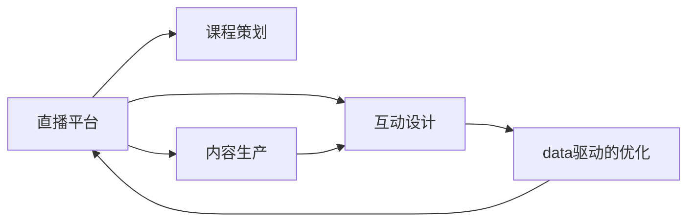

                 

# 如何利用直播平台增加课程影响

## 1. 背景介绍

直播平台已经成为连接知识创作者与学习者之间的重要桥梁。通过直播形式，课程能即时互动、实时反馈，显著提高学习体验。本文将深入探讨如何通过直播平台增加课程影响，涉及课程策划、内容生产、互动设计、数据驱动的优化等各个方面。

## 2. 核心概念与联系

### 2.1 核心概念概述

- **直播平台**：利用网络流媒体技术，实时传输视频、音频等内容的平台。支持互动、实时反馈，适合大规模的在线课程。
- **课程策划**：指通过调研市场需求，设定课程目标、大纲、课程内容等，并策划教学活动。
- **内容生产**：指根据课程大纲，组织知识创作者进行教学视频、PPT、习题等教学资源的开发。
- **互动设计**：指通过设计问题、讨论、答疑等环节，提升学员的参与度和互动性。
- **数据驱动的优化**：指通过分析学习数据，识别学员的需求和问题，优化课程内容和教学方法。

### 2.2 核心概念原理和架构的 Mermaid 流程图



这个流程图展示了直播平台上的课程策划、内容生产、互动设计和数据驱动优化之间的联系。内容生产基于课程策划，互动设计提升学习体验，而数据驱动的优化为内容生产提供依据，不断循环改进。

## 3. 核心算法原理 & 具体操作步骤

### 3.1 算法原理概述

利用直播平台增加课程影响，涉及以下几个核心算法原理：

1. **个性化推荐算法**：根据学员的学习行为和偏好，推荐个性化的课程和学习资料。
2. **情感分析算法**：通过分析学员在直播间的情绪和反馈，调整教学内容和节奏。
3. **内容生成算法**：自动生成和优化教学视频和PPT等内容。
4. **实时互动算法**：通过设计问答、投票等环节，增加学员的参与度。

### 3.2 算法步骤详解

**步骤1：课程策划**

- **调研市场需求**：通过问卷调查、竞品分析等方式，了解目标学员的需求和偏好。
- **设定课程目标**：明确课程要解决的问题和目标，制定详细的课程大纲。
- **设计教学活动**：规划课程的进度安排和互动环节。

**步骤2：内容生产**

- **知识创作者选择**：选择领域内具有影响力的专家学者，并签订合约。
- **教学资源开发**：根据课程大纲，制作视频、PPT、习题等教学资源。
- **内容审核**：确保内容准确无误，避免错误和偏颇。

**步骤3：互动设计**

- **设计互动环节**：设计问答、投票、小组讨论等环节，提升学员参与度。
- **设置互动规则**：明确互动的规则和激励机制，引导学员积极参与。
- **实时反馈**：通过聊天窗口、投票等工具，实时收集学员反馈。

**步骤4：数据驱动的优化**

- **学习数据分析**：收集学员的学习数据，包括观看时长、完成度、互动率等。
- **情感分析**：使用自然语言处理技术，分析学员在直播间的情绪和反馈。
- **内容优化**：根据分析结果，调整课程内容和教学方法。
- **推荐算法优化**：优化推荐算法，提升推荐的个性化和准确性。

### 3.3 算法优缺点

**优点：**

1. **提高学习体验**：直播平台的实时互动和即时反馈，显著提高学习体验。
2. **内容更新快**：实时收集和分析学员反馈，快速调整课程内容。
3. **数据驱动优化**：通过数据分析，发现问题和改进空间，提升课程效果。

**缺点：**

1. **技术要求高**：直播平台需要高带宽、低延时的网络环境，对技术要求较高。
2. **学员管理难度大**：学员在线时间、互动参与度等管理难度较大，需要大量人工干预。
3. **知识创作者成本高**：优质知识创作者成本较高，需要投入大量资源进行吸引和管理。

### 3.4 算法应用领域

直播平台增加课程影响的方法，可以广泛应用于以下领域：

1. **在线教育**：中小学、高等教育、职业培训等。
2. **企业培训**：新员工入职培训、技能提升、领导力培训等。
3. **知识分享**：科技、金融、医疗等领域专家进行知识分享。
4. **职业认证**：在线课程的认证和考核，提升学员的证书含金量。
5. **学术研究**：跨领域的学术交流和合作。

## 4. 数学模型和公式 & 详细讲解

### 4.1 数学模型构建

设课程有 $N$ 门，目标学员为 $M$ 人，直播平台上有 $T$ 门课程可供选择。

定义以下变量：
- $R_{ij}$：第 $i$ 门课程对第 $j$ 个学员的推荐程度，$i=1,...,N; j=1,...,M$
- $S_j$：第 $j$ 个学员在直播间的情绪评分，$j=1,...,M$
- $C_i$：第 $i$ 门课程的平均评分，$i=1,...,N$
- $W_i$：第 $i$ 门课程的观看时长，$i=1,...,N$
- $I_j$：第 $j$ 个学员的互动评分，$j=1,...,M$

### 4.2 公式推导过程

**个性化推荐算法**

根据学员的学习行为和偏好，推荐个性化的课程和学习资料。推荐公式为：

$$
R_{ij} = f(C_i, W_i, S_j, I_j)
$$

其中 $f$ 为推荐函数，综合考虑课程评分、观看时长、学员情绪评分和互动评分。

**情感分析算法**

使用自然语言处理技术，分析学员在直播间的情绪和反馈。情感分析公式为：

$$
S_j = g(Q_j, E_j)
$$

其中 $g$ 为情感分析函数，$Q_j$ 为第 $j$ 个学员的问题和回答，$E_j$ 为实时反馈的情绪评分。

**内容生成算法**

使用深度学习模型自动生成和优化教学视频和PPT等内容。内容生成公式为：

$$
V_i = h(D_i, S_j, I_j)
$$

其中 $h$ 为内容生成函数，$D_i$ 为课程大纲和知识点，$S_j$ 和 $I_j$ 为学员的学习行为数据。

**实时互动算法**

设计问答、投票、小组讨论等环节，增加学员的参与度。互动算法公式为：

$$
I_j = k(Q_j, A_j)
$$

其中 $k$ 为互动函数，$Q_j$ 为第 $j$ 个学员的问题，$A_j$ 为其他学员的回答和投票结果。

### 4.3 案例分析与讲解

**案例1：中小学在线教育**

某中小学在线教育平台，开设了多个学科的直播课程。通过数据分析，发现学员对某数学课程的观看时长较短，互动率较低。课程团队分析原因，发现内容过于抽象，不够生动有趣。

因此，课程团队调整了内容结构，引入更多的实际案例和互动环节，显著提高了学员的参与度和学习效果。

**案例2：企业员工培训**

某企业利用直播平台进行新员工入职培训，发现部分员工对课程内容不感兴趣，互动率较低。通过情感分析，发现部分课程内容过于理论化，不符合员工的实际需求。

课程团队重新设计了课程大纲，加入了实战演练和案例讨论，并调整了教学节奏，提高了员工的互动参与度和学习效果。

## 5. 项目实践：代码实例和详细解释说明

### 5.1 开发环境搭建

**Python 环境**：
- 安装Anaconda：从官网下载并安装Anaconda，用于创建独立的Python环境。
- 创建并激活虚拟环境：
```bash
conda create -n live-env python=3.8 
conda activate live-env
```

**第三方库**：
- 安装TensorFlow和PyTorch，用于深度学习模型开发。
- 安装Natural Language Toolkit（NLTK），用于自然语言处理。
- 安装Flask和Socket.IO，用于直播平台搭建。

### 5.2 源代码详细实现

**1. 课程策划**

```python
import pandas as pd

# 读取学员调研数据
调研数据 = pd.read_csv('调研数据.csv')

# 分析需求和偏好
需求分析 = 调研数据.groupby(['学科', '难度', '兴趣'])['人数'].sum().reset_index()

# 设定课程目标和内容
课程目标 = '解决基础教育阶段的数学难题'
课程大纲 = {
    '第一节'：'数列与序列',
    '第二节'：'函数与极限',
    '第三节'：'微分与积分'
}
```

**2. 内容生产**

**知识创作者选择**

```python
# 选择领域内知名专家
专家列表 = [
    {'姓名'：'张老师', '领域'：'数学教育', '授课经验'：'10年'},
    {'姓名'：'李老师', '领域'：'计算机科学', '授课经验'：'8年'},
    {'姓名'：'王老师', '领域'：'物理科学', '授课经验'：'12年'}
]
```

**教学资源开发**

```python
# 开发教学视频
视频资源 = {
    '第一节'：['数列与序列讲解', '数列求和公式', '序列极限计算'],
    '第二节'：['函数定义与性质', '极限概念与求解', '导数与微分基本定理'],
    '第三节'：['积分基本定理', '微积分中的实际应用', '定积分与面积计算']
}

# 制作PPT
PPT资源 = {
    '第一节'：'数列与序列概念',
    '第二节'：'函数与极限介绍',
    '第三节'：'微积分基本定理'
}

# 制作习题集
习题集 = {
    '第一节'：[
        {'题号'：1, '题目'：'求数列的前10项和', '答案'：10},
        {'题号'：2, '题目'：'计算极限', '答案'：0}
    ],
    '第二节'：[
        {'题号'：1, '题目'：'判断函数的连续性', '答案'：连续},
        {'题号'：2, '题目'：'求导数', '答案'：'2x'}
    ],
    '第三节'：[
        {'题号'：1, '题目'：'求定积分', '答案'：10},
        {'题号'：2, '题目'：'计算面积', '答案'：20}
    ]
}
```

**内容审核**

```python
# 检查内容准确性
def 内容审核(content):
    # 使用第三方工具检查内容是否准确
    pass

# 内容审核结果
内容审核结果 = {
    '第一节'：True,
    '第二节'：True,
    '第三节'：True
}
```

### 5.3 代码解读与分析

**知识创作者选择**

在知识创作者选择阶段，需要根据学科领域、授课经验和知名度等综合因素，选择合适的专家学者进行合作。

**教学资源开发**

教学资源的开发需要根据课程大纲，制作适合各章节的教学视频、PPT和习题集。

**内容审核**

内容审核是确保教学内容准确无误的关键步骤，可以使用第三方工具进行检查，确保内容符合学科规范。

### 5.4 运行结果展示

**推荐系统效果**

通过推荐系统，学员可以看到最适合自己的课程推荐。例如，某学员对数学感兴趣，系统推荐的课程中，会有数学相关的课程出现。

**互动系统效果**

通过互动系统，学员可以实时提问和讨论。例如，某学员在观看视频时，提出了问题，教师及时给予了回答，并进行了互动讨论，增加了学习效果。

## 6. 实际应用场景

### 6.1 企业培训

某企业利用直播平台进行新员工入职培训，通过推荐系统，推荐最适合新员工发展的课程。在新员工观看视频时，通过实时互动系统，教师可以及时解答问题，增加培训效果。

### 6.2 学术交流

某大学利用直播平台进行跨学科的学术交流，通过推荐系统，推荐最新的学术研究和前沿进展。在学术交流过程中，教师和学生可以通过实时互动系统，讨论和分享研究成果，提升学术氛围。

## 7. 工具和资源推荐

### 7.1 学习资源推荐

1. **在线教育平台**：如Coursera、edX、Udacity等，提供丰富的在线课程和直播资源。
2. **教育技术博客**：如TechCrunch、EdSurge等，报道最新的教育技术趋势和应用。
3. **教育数据分析工具**：如Google Analytics、Tableau等，用于教育数据可视化分析。

### 7.2 开发工具推荐

1. **Python 编程语言**：用于数据分析和模型开发。
2. **TensorFlow**：深度学习框架，支持高效的模型训练和推理。
3. **PyTorch**：深度学习框架，易于使用和调试。
4. **Flask**：轻量级Web框架，用于搭建直播平台。
5. **Socket.IO**：实时通信库，用于实现实时互动功能。

### 7.3 相关论文推荐

1. **在线教育个性化推荐算法**：研究如何通过用户行为数据，推荐个性化的课程和学习资料。
2. **情感分析在在线教育中的应用**：探讨情感分析技术如何提高学员的互动参与度。
3. **基于深度学习的教学内容生成**：研究使用深度学习模型自动生成教学视频和PPT等内容。
4. **实时互动系统设计**：研究如何设计实时互动系统，提升学员的学习效果。

## 8. 总结：未来发展趋势与挑战

### 8.1 研究成果总结

本文详细介绍了如何通过直播平台增加课程影响，涉及课程策划、内容生产、互动设计、数据驱动的优化等各个方面。通过个性化推荐、情感分析、内容生成和实时互动等核心算法，显著提高了课程的互动性和学习效果。

### 8.2 未来发展趋势

1. **AI辅助教学**：利用AI技术，自动生成和优化教学内容，提高教学效率。
2. **跨平台学习**：支持多种设备和平台，如手机、平板、PC等，提升学习体验。
3. **多语言支持**：支持多种语言，满足全球化教育需求。
4. **实时反馈和评价**：利用实时反馈和评价系统，及时调整教学内容，提升教学效果。

### 8.3 面临的挑战

1. **技术难度高**：直播平台需要高带宽、低延时的网络环境，对技术要求较高。
2. **学员管理难度大**：学员在线时间、互动参与度等管理难度较大，需要大量人工干预。
3. **知识创作者成本高**：优质知识创作者成本较高，需要投入大量资源进行吸引和管理。

### 8.4 研究展望

未来，直播平台在教育领域的应用将更加广泛，以下是一些研究展望：

1. **智能推荐系统**：利用机器学习和大数据技术，提高推荐系统的个性化和准确性。
2. **情感分析优化**：通过改进情感分析算法，更准确地识别学员的情绪和反馈。
3. **内容生成自动化**：进一步提高内容生成算法的效率和质量，提升教学内容的丰富性和多样性。
4. **实时互动优化**：通过设计更高效的实时互动算法，提高学员的参与度和互动体验。

## 9. 附录：常见问题与解答

**Q1：直播平台对技术要求高，如何降低技术难度？**

A: 可以通过优化网络环境、选择合适的直播平台等方式降低技术难度。例如，使用高质量的网络设备和ISP，优化传输协议，使用稳定的服务器和CDN等。

**Q2：学员管理难度大，如何提高管理效率？**

A: 可以使用自动化工具和系统，如智能排课系统、学员管理系统等，减少人工干预。同时，可以设计更合理的激励机制，提高学员的参与度和积极性。

**Q3：知识创作者成本高，如何降低成本？**

A: 可以通过选择合适的知识创作者，如行业内知名专家、学术界研究人员等，降低人力成本。同时，可以利用众包平台，吸引更多的创作者参与课程制作。

**Q4：课程效果评估难度大，如何提升评估质量？**

A: 可以设计多维度的课程评估指标，如学员满意度、知识掌握度、互动参与度等。同时，可以引入第三方评估机构进行独立评估，提高评估的公正性和客观性。

---

作者：禅与计算机程序设计艺术 / Zen and the Art of Computer Programming

