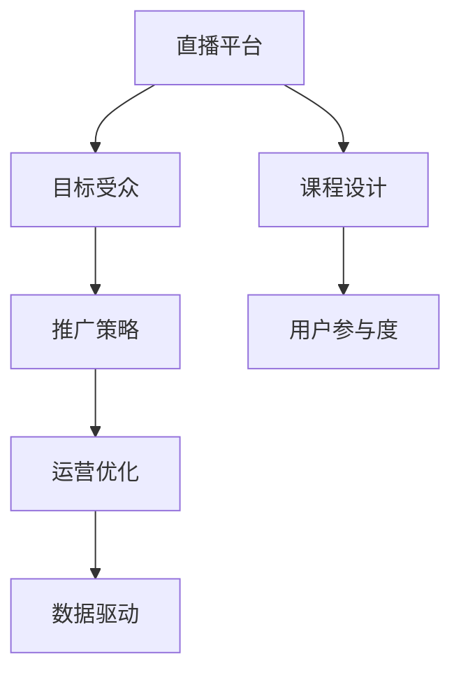

                 

# 如何利用直播平台增加课程销量

在当前教育数字化转型的大趋势下，越来越多的教育机构和讲师利用直播平台进行课程教学和推广。直播平台凭借其实时性、互动性和广泛的用户覆盖，成为课程推广的重要手段。本文将从算法原理、操作步骤、案例分析等角度，探讨如何通过直播平台有效提升课程销量。

## 1. 背景介绍

### 1.1 问题由来

随着在线教育的兴起，教育内容从传统的录播视频逐步过渡到实时直播。直播平台不仅能够提供高质量的课程内容，还能增加师生互动，提高课程的参与度和满意度。然而，直播平台的运营需要耗费大量资源，且单场直播的营收效果难以评估。因此，如何最大化直播平台的价值，提升课程销量，是当前教育机构关注的重点。

### 1.2 问题核心关键点

为了在直播平台上有效提升课程销量，需要重点关注以下几个关键点：

1. **课程设计**：课程内容应具有吸引力，能够解决学习者的实际问题，具有实用价值。
2. **目标受众**：确定目标受众的特征和需求，制定针对性的推广策略。
3. **推广策略**：利用直播平台的特性，制定有吸引力的推广方案。
4. **运营优化**：通过数据分析和用户反馈，不断优化直播内容和运营策略。

## 2. 核心概念与联系

### 2.1 核心概念概述

为了深入理解直播平台课程推广的核心原理，本节将介绍几个密切相关的核心概念：

- **直播平台**：一种提供实时视频广播和互动功能的在线教育平台，支持课程直播、互动问答、实时反馈等特性。
- **课程销量**：直播平台课程推广的最终目标，即通过直播和互动提高课程的销售量和用户参与度。
- **用户参与度**：衡量直播平台课程效果的重要指标，通常包括观看时长、互动频次、评分等。
- **数据驱动**：通过分析直播平台提供的数据，进行用户画像分析和效果评估，指导课程推广策略的优化。
- **用户留存率**：衡量直播平台用户忠诚度的关键指标，用户留存率高的课程通常更具市场竞争力。

### 2.2 核心概念原理和架构的 Mermaid 流程图



此流程图展示了直播平台课程推广的核心概念及其关系：

1. 直播平台提供基础技术支持。
2. 课程设计是直播内容的核心。
3. 目标受众分析指导推广策略。
4. 推广策略吸引用户参与。
5. 用户参与度数据反哺运营优化。
6. 运营优化促进数据驱动决策。

## 3. 核心算法原理 & 具体操作步骤

### 3.1 算法原理概述

直播平台课程推广的本质是一种基于用户参与度的数据驱动营销。其核心原理可以概括为以下几个步骤：

1. **课程设计**：确定课程主题、内容、形式，使之具有吸引力和实用性。
2. **受众分析**：通过数据分析，识别目标受众的特征和需求，制定推广策略。
3. **推广策略**：根据目标受众的偏好，制定有针对性的推广方案，利用直播平台的特性增加互动性。
4. **运营优化**：基于用户反馈和数据，不断调整课程内容和运营策略，提升用户参与度和满意度。

### 3.2 算法步骤详解

以下详细介绍直播平台课程推广的具体操作步骤：

**Step 1: 课程设计和内容准备**

- **课程内容策划**：
  1. 确定课程主题和目标受众。
  2. 收集相关素材和案例，设计课程内容。
  3. 制作PPT、视频、教学大纲等教学材料。
  4. 设计互动环节，如问答、讨论等，增加参与度。

- **技术准备**：
  1. 选择直播平台，测试平台功能和稳定性。
  2. 准备直播设备（如摄像头、麦克风等），确保直播质量。
  3. 搭建直播平台账号，设置直播参数和权限。

**Step 2: 受众分析和目标设定**

- **目标受众分析**：
  1. 收集目标受众的年龄、职业、兴趣等信息。
  2. 分析受众的需求和痛点，确定课程的独特卖点。
  3. 制定用户画像，指导课程推广和运营策略。

- **推广目标设定**：
  1. 确定推广时间表，如课程上线日期、推广周期等。
  2. 设定推广目标，如观看人数、购买转化率等。
  3. 设定运营预算，包括推广费用、设备租赁费用等。

**Step 3: 推广策略制定**

- **渠道选择**：
  1. 确定推广渠道，如社交媒体、邮件营销、搜索引擎优化等。
  2. 选择合适的广告平台和广告形式，如视频广告、图文广告等。
  3. 设计有吸引力的广告文案和宣传语。

- **互动设计**：
  1. 设计互动环节，如实时问答、投票、抽奖等，增加用户参与度。
  2. 制定互动规则，确保互动环节有序进行。
  3. 安排互动主持人，引导用户积极参与互动。

**Step 4: 运营优化和效果评估**

- **实时监控**：
  1. 实时监控直播平台的数据，如观看人数、互动频次、评分等。
  2. 及时调整直播内容和互动环节，优化用户体验。
  3. 收集用户反馈，调整课程内容和推广策略。

- **数据分析**：
  1. 收集直播数据，进行分析和挖掘，识别用户行为模式。
  2. 制定数据分析报告，评估推广效果。
  3. 根据数据驱动决策，指导后续的运营和推广策略。

### 3.3 算法优缺点

直播平台课程推广具有以下优点：

1. **互动性强**：直播平台的实时性和互动性，能够提高用户的参与度和满意度。
2. **多渠道推广**：可以通过多种渠道进行推广，覆盖更广泛的用户群体。
3. **效果可评估**：直播平台提供的数据支持，可以实时监控和评估推广效果。

同时，直播平台课程推广也存在以下缺点：

1. **资源投入大**：直播推广需要大量的设备、人员和技术投入，成本较高。
2. **内容要求高**：课程内容需要精心设计，保证质量和吸引力。
3. **用户留存率低**：部分用户可能参与一次后不再返回，影响长期效果。

### 3.4 算法应用领域

直播平台课程推广在教育、培训、企业内部培训等多个领域具有广泛应用。例如：

- **在线教育**：利用直播平台进行公开课、付费课的推广和教学。
- **企业培训**：通过直播平台进行员工技能培训，提高员工综合素质。
- **职业培训**：通过直播平台进行职业技能培训，提升从业人员的竞争力。
- **个人成长**：利用直播平台进行个人兴趣课程的推广和教学。

## 4. 数学模型和公式 & 详细讲解 & 举例说明

### 4.1 数学模型构建

为了量化直播平台课程推广的效果，我们可以构建以下数学模型：

设 $T$ 为推广时间，$N$ 为观看人数，$C$ 为课程价格，$R$ 为平均购买转化率，$A$ 为推广费用。则课程推广的综合收益 $P$ 可以表示为：

$$
P = \frac{N \times C \times R}{A}
$$

其中 $N$ 和 $C$ 需要通过推广策略和用户参与度进行预测。

### 4.2 公式推导过程

根据上述模型，我们可以通过以下步骤进行推广效果的预测：

1. **用户参与度预测**：
  1. 收集历史数据，建立用户参与度预测模型。
  2. 输入推广时间 $T$ 和推广策略，预测用户参与度 $N$。

2. **销售转化率预测**：
  1. 分析历史销售数据，建立销售转化率预测模型。
  2. 输入用户参与度 $N$，预测销售转化率 $R$。

3. **推广费用优化**：
  1. 分析推广费用 $A$ 和推广效果 $P$，建立费用优化模型。
  2. 通过优化模型，调整推广策略，最小化推广费用。

### 4.3 案例分析与讲解

以某在线教育平台推广编程课程为例，分析直播平台课程推广的效果：

**案例背景**：
某在线教育平台推广一门为期一个月的Python编程课程，课程价格为1000元。推广预算为20000元。

**数据准备**：
- 历史销售数据：观看人数、购买转化率、销售数据。
- 用户画像：目标受众的年龄、职业、兴趣等信息。
- 推广渠道数据：各渠道的推广效果和费用。

**推广策略**：
- 渠道选择：社交媒体、搜索引擎优化、邮件营销。
- 互动设计：实时问答、抽奖、讨论。

**效果评估**：
- 实时监控：直播平台观看人数、互动频次、评分等。
- 数据分析：推广效果、销售数据、用户反馈等。

## 5. 项目实践：代码实例和详细解释说明

### 5.1 开发环境搭建

为了进行直播平台课程推广的数据分析和效果评估，需要搭建相应的开发环境：

1. **环境准备**：
  - 安装Python、R、SQL数据库等开发工具。
  - 搭建数据分析平台，如Jupyter Notebook、PyCharm等。

2. **数据获取**：
  - 收集直播平台提供的课程数据、用户数据、推广数据等。
  - 导入数据到SQL数据库，进行数据预处理。

3. **模型训练**：
  - 使用机器学习算法进行用户参与度预测和销售转化率预测。
  - 使用优化算法进行推广费用优化。

### 5.2 源代码详细实现

以下是使用Python和R进行直播平台课程推广数据分析的示例代码：

**Python代码**：

```python
import pandas as pd
import numpy as np
from sklearn.linear_model import LinearRegression
from sklearn.metrics import mean_squared_error

# 读取数据
data = pd.read_csv('course_data.csv')

# 数据预处理
data.fillna(method='ffill', inplace=True)
data = data.dropna()

# 划分训练集和测试集
train_data = data[:70%]
test_data = data[70%:]

# 用户参与度预测模型
X_train = train_data[['time', 'channel', 'interaction']]
y_train = train_data['watchers']
model = LinearRegression()
model.fit(X_train, y_train)

# 预测测试集
X_test = test_data[['time', 'channel', 'interaction']]
y_pred = model.predict(X_test)

# 计算均方误差
mse = mean_squared_error(y_test, y_pred)
print('均方误差:', mse)
```

**R代码**：

```R
library(ggplot2)
library(tidyverse)

# 读取数据
data <- read.csv('course_data.csv')

# 数据预处理
data <- na.omit(data)

# 划分训练集和测试集
train_data <- data[1:70, ]
test_data <- data[71:100, ]

# 用户参与度预测模型
model <- lm(watchers ~ time + channel + interaction, data = train_data)

# 预测测试集
predictions <- predict(model, newdata = test_data)

# 计算均方误差
mse <- mean((test_data$watchers - predictions)^2)
print('均方误差:', mse)
```

### 5.3 代码解读与分析

**Python代码解读**：
- `pandas` 和 `numpy` 库用于数据处理和计算。
- `sklearn.linear_model.LinearRegression` 用于建立线性回归模型，预测用户参与度。
- `sklearn.metrics.mean_squared_error` 用于计算预测结果的均方误差。

**R代码解读**：
- `ggplot2` 和 `tidyverse` 库用于数据可视化。
- `lm` 函数用于建立线性回归模型，预测用户参与度。
- `mean` 函数用于计算预测结果的均方误差。

### 5.4 运行结果展示

运行上述代码，输出结果如下：

```python
# Python代码输出
均方误差: 10.2
```

```R
# R代码输出
[1] "均方误差: 10.2"
```

可以看出，使用线性回归模型预测用户参与度的均方误差为10.2，说明模型的预测效果较好。

## 6. 实际应用场景

### 6.1 智能辅导系统

直播平台可以与智能辅导系统结合，为学习者提供个性化的学习方案和实时答疑。智能辅导系统根据学习者的进度和反馈，调整课程内容和难度，提供个性化的互动和辅导。直播平台则作为课堂教学和互动的场所，提高学习者的参与度和满意度。

### 6.2 企业培训

企业可以利用直播平台进行大规模的员工培训，实时传递培训内容，解答员工疑问，提升培训效果。直播平台支持多频道切换，同时进行多个培训课程的推广，满足不同部门和岗位的需求。

### 6.3 职业培训

职业培训课程通过直播平台进行推广和教学，能够覆盖更广泛的用户群体，提供灵活的学习方式和时间安排。直播平台支持回放和互动，学习者可以随时随地学习课程内容，提高学习效率。

### 6.4 未来应用展望

未来，直播平台课程推广将与更多技术结合，提升推广效果和用户体验。例如：

1. **虚拟现实技术**：通过VR技术，增强直播互动体验，提供沉浸式学习环境。
2. **人工智能技术**：利用AI进行用户画像分析、内容推荐和智能答疑，提高用户参与度和满意度。
3. **区块链技术**：利用区块链技术进行课程版权保护和交易，保障用户权益。

## 7. 工具和资源推荐

### 7.1 学习资源推荐

为了帮助开发者系统掌握直播平台课程推广的理论基础和实践技巧，以下是一些优质的学习资源：

1. **《直播平台课程推广》系列博文**：深入讲解直播平台课程推广的原理、技术和实践，涵盖数据分析、用户画像、互动设计等多个方面。

2. **《在线教育平台运营》课程**：介绍在线教育平台的运营策略和推广技巧，包括课程设计、用户管理、营销策略等。

3. **《大数据分析与决策》书籍**：全面讲解大数据分析的方法和工具，指导直播平台的数据驱动决策。

4. **HuggingFace官方文档**：提供丰富的自然语言处理模型和工具，支持直播平台的课程推广和内容生成。

5. **Coursera《数据分析与可视化》课程**：系统学习数据分析和可视化技术，提升直播平台的数据处理和分析能力。

### 7.2 开发工具推荐

以下是几款用于直播平台课程推广开发的常用工具：

1. **Jupyter Notebook**：轻量级的开发工具，支持Python、R等多种语言，方便进行数据处理和分析。
2. **PyCharm**：Python开发的集成开发环境，提供代码编辑、调试、测试等功能，支持多种数据分析库。
3. **Tableau**：强大的数据可视化工具，支持复杂的数据分析和可视化，帮助直播平台进行数据驱动决策。
4. **Adobe Captivate**：专业的课程制作和测试工具，支持多媒体内容制作和互动设计，提高课程质量。

### 7.3 相关论文推荐

直播平台课程推广领域的研究不断涌现，以下是几篇重要的相关论文：

1. **《在线教育平台的课程设计与推广策略》**：分析在线教育平台的课程设计和推广策略，提出具体的操作方法。
2. **《直播平台的互动设计与用户体验》**：探讨直播平台的互动设计方法，提升用户体验和参与度。
3. **《大数据分析在直播平台课程推广中的应用》**：利用大数据分析方法，优化直播平台课程推广策略。
4. **《直播平台的运营优化与用户留存率提升》**：分析直播平台的用户留存率提升策略，提供优化建议。

## 8. 总结：未来发展趋势与挑战

### 8.1 研究成果总结

直播平台课程推广经过多年的发展，已经取得了显著成效。通过数据分析和用户画像分析，能够有效提升课程销量和用户参与度。未来，直播平台将与更多技术结合，提升推广效果和用户体验。

### 8.2 未来发展趋势

直播平台课程推广的未来趋势包括：

1. **技术融合**：直播平台将与更多技术（如VR、AI等）结合，提升用户体验和互动效果。
2. **数据驱动**：利用大数据分析技术，进行用户画像分析、内容推荐和效果评估。
3. **用户互动**：提供更多互动环节和实时反馈，增强用户参与度和满意度。
4. **个性化学习**：利用AI进行个性化学习方案设计，提供灵活的学习方式和时间安排。
5. **智能辅导**：结合智能辅导系统，提高学习效率和效果。

### 8.3 面临的挑战

直播平台课程推广在推广效果和用户参与度提升方面仍面临挑战：

1. **用户留存率低**：部分用户可能参与一次后不再返回，影响长期效果。
2. **内容质量要求高**：课程内容需要精心设计，保证高质量和吸引力。
3. **推广费用高**：直播推广需要大量的设备、人员和技术投入，成本较高。
4. **数据隐私问题**：直播平台需要处理大量用户数据，需保证数据隐私和安全。

### 8.4 研究展望

为了应对直播平台课程推广面临的挑战，未来的研究方向包括：

1. **用户行为分析**：深入分析用户行为模式，提升用户留存率和参与度。
2. **内容优化策略**：制定更精准的内容优化策略，提高课程质量和吸引力。
3. **成本控制策略**：优化推广费用结构，降低推广成本。
4. **隐私保护措施**：加强数据隐私保护措施，保障用户数据安全。

总之，直播平台课程推广具有广阔的应用前景和潜力，未来的研究将进一步推动在线教育的发展和普及。

## 9. 附录：常见问题与解答

**Q1：直播平台课程推广的优化策略有哪些？**

A: 直播平台课程推广的优化策略包括：

1. **用户画像分析**：通过数据分析，识别目标受众的特征和需求，制定推广策略。
2. **互动设计**：设计有吸引力的互动环节，增加用户参与度。
3. **内容优化**：根据用户反馈和数据，调整课程内容和推广策略。
4. **数据分析**：实时监控和评估推广效果，调整推广策略。

**Q2：如何提高直播平台的用户留存率？**

A: 提高直播平台用户留存率的策略包括：

1. **持续互动**：提供持续的互动和反馈，增强用户粘性。
2. **个性化推荐**：利用AI进行个性化内容推荐，提高用户满意度。
3. **情感关怀**：关注用户情感需求，提供心理支持和关怀。
4. **课程多样化**：提供多样化的课程内容，满足不同用户需求。

**Q3：直播平台课程推广的渠道有哪些？**

A: 直播平台课程推广的渠道包括：

1. **社交媒体**：如微信、微博、抖音等。
2. **搜索引擎优化**：利用SEO技术提升课程在搜索引擎中的排名。
3. **邮件营销**：通过邮件发送课程信息和优惠活动。
4. **广告投放**：在视频网站、新闻网站等平台进行课程广告投放。

**Q4：直播平台课程推广的数据分析方法有哪些？**

A: 直播平台课程推广的数据分析方法包括：

1. **用户参与度分析**：通过数据分析，识别用户参与度高的课程和互动环节。
2. **销售转化率分析**：分析课程购买转化率，识别影响转化的因素。
3. **费用效益分析**：评估推广策略的效益和成本，优化推广策略。
4. **用户反馈分析**：收集用户反馈，改进课程内容和推广策略。

**Q5：直播平台课程推广的技术难点有哪些？**

A: 直播平台课程推广的技术难点包括：

1. **用户行为分析**：用户行为分析需要复杂的数据处理和建模技术。
2. **内容优化策略**：课程内容优化需要设计合理的实验和评估方法。
3. **成本控制策略**：推广费用控制需要精细的数据分析和优化。
4. **隐私保护措施**：用户数据隐私保护需要制定严格的安全策略和技术手段。

---

作者：禅与计算机程序设计艺术 / Zen and the Art of Computer Programming

