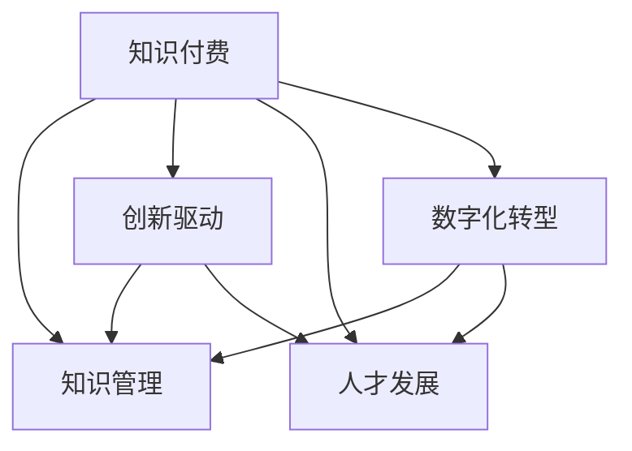

                 

# 如何利用知识付费实现产业升级与转型？

> 关键词：知识付费,产业升级,企业转型,数字化转型,技术应用,创新驱动,知识管理,人才发展

## 1. 背景介绍

### 1.1 问题由来

当前，全球经济正面临深刻的变革，数字化转型成为各行各业的重要战略方向。特别是新冠疫情的爆发，加速了企业向数字化、智能化转型的步伐。知识付费作为一种新型业态，以其高效、便捷、精准的特点，成为推动产业升级与转型的重要工具。

### 1.2 问题核心关键点

知识付费作为一种新型的商业模式，其核心在于通过知识传播与交流，实现知识资源的优化配置与利用。它不仅能够为消费者提供高质量的内容服务，还能推动企业内部的知识管理与创新驱动，促进人才发展与组织能力的提升。然而，如何科学有效地利用知识付费，使之成为产业升级与转型的关键驱动力，是当下企业需要重点关注的问题。

### 1.3 问题研究意义

研究如何利用知识付费实现产业升级与转型，对于推动经济高质量发展、提升企业竞争力、优化资源配置、激发创新活力具有重要意义。

1. **推动经济高质量发展**：知识付费通过知识分享与交流，推动社会知识的传播与积累，优化资源配置，促进经济结构的优化升级。
2. **提升企业竞争力**：知识付费能够提升企业内部知识管理水平，增强创新能力，提高企业竞争力。
3. **优化资源配置**：通过知识付费平台，企业可以快速获取所需的知识资源，优化资源配置，提升运营效率。
4. **激发创新活力**：知识付费有助于企业内部知识的共享与交流，激发创新活力，加速技术迭代与产品创新。

## 2. 核心概念与联系

### 2.1 核心概念概述

为更好地理解如何利用知识付费实现产业升级与转型，本节将介绍几个密切相关的核心概念：

- **知识付费**：基于互联网和移动互联网技术的知识传播与交流模式，通过付费方式获取高质量知识内容，实现知识的优化配置与利用。
- **知识管理**：对企业内部知识资源进行有效管理、共享与利用的过程，旨在提升企业知识资产的创造、共享与应用能力。
- **创新驱动**：通过知识的传播与交流，激发企业内部的创新活力，驱动技术、产品和服务的不断迭代升级。
- **人才发展**：通过知识付费平台，为员工提供持续的学习机会，提升人才素质，促进人才的全面发展。
- **数字化转型**：通过信息技术的应用，推动企业业务流程的数字化、智能化，实现资源的优化配置与利用。

这些核心概念之间的逻辑关系可以通过以下Mermaid流程图来展示：



这个流程图展示出知识付费与知识管理、创新驱动、人才发展、数字化转型之间的密切联系：

1. 知识付费是企业获取知识资源的有效途径，知识管理则是知识资源优化的重要手段。
2. 创新驱动依赖于知识管理与人才发展，是推动企业持续创新的核心动力。
3. 数字化转型需要知识管理和人才发展的支撑，同时通过技术手段优化知识资源的利用。

## 3. 核心算法原理 & 具体操作步骤
### 3.1 算法原理概述

利用知识付费实现产业升级与转型的核心算法原理主要包括以下几个方面：

1. **知识资源的有效获取与配置**：通过知识付费平台，企业能够快速获取所需的知识资源，并进行合理的配置与利用。
2. **知识共享与交流**：知识付费促进企业内部知识的共享与交流，提升员工的知识水平与创新能力。
3. **人才发展与培养**：通过知识付费，员工能够获得持续的学习机会，提升专业技能，促进人才的全面发展。
4. **创新驱动与技术迭代**：知识付费激发了企业内部的创新活力，推动技术、产品和服务的不断迭代升级。
5. **资源优化与运营效率提升**：通过数字化转型，企业能够优化资源配置，提升运营效率，实现高质量发展。

### 3.2 算法步骤详解

**Step 1: 制定知识付费策略**

- 确定企业内部的知识需求，选择合适的知识付费平台或定制开发知识付费系统。
- 制定知识付费的定价策略，考虑知识内容的价值、稀缺性、传播成本等因素，制定合理的价格。
- 建立知识付费的运营团队，负责内容管理、用户服务、市场推广等工作。

**Step 2: 内容设计与推荐**

- 设计高质量的知识内容，包括文章、视频、课程、电子书等。
- 建立内容管理系统，确保内容的质量与更新频率。
- 使用推荐算法，对内容进行精准推荐，提升用户的学习效率与体验。

**Step 3: 用户管理与交互**

- 建立用户管理系统，确保用户身份的真实性与合法性。
- 设计用户界面与交互方式，提升用户体验。
- 收集用户反馈，优化内容与平台服务。

**Step 4: 数据分析与优化**

- 收集用户行为数据，分析用户的学习路径、兴趣偏好、购买行为等。
- 使用数据分析工具，优化知识付费平台的运营策略。
- 定期评估知识付费的效果，持续改进与创新。

### 3.3 算法优缺点

**优点**：

1. **高效获取知识资源**：知识付费可以快速获取高质量的知识内容，提升企业的知识管理水平。
2. **促进知识共享与交流**：知识付费促进企业内部知识的共享与交流，提升员工的知识水平与创新能力。
3. **人才发展与培养**：通过知识付费，员工能够获得持续的学习机会，提升专业技能，促进人才的全面发展。
4. **创新驱动与技术迭代**：知识付费激发了企业内部的创新活力，推动技术、产品和服务的不断迭代升级。
5. **资源优化与运营效率提升**：通过数字化转型，企业能够优化资源配置，提升运营效率，实现高质量发展。

**缺点**：

1. **成本较高**：知识付费需要投入较多的资金与人力，尤其是初期阶段。
2. **内容质量参差不齐**：高质量的内容需要专业的团队进行制作，成本较高，容易出现内容质量参差不齐的情况。
3. **用户粘性不足**：用户对知识付费的粘性不足，流失率较高，需要持续优化用户体验与内容。
4. **平台运营风险**：知识付费平台需要持续运营，存在一定的技术与管理风险。

### 3.4 算法应用领域

知识付费在多个领域都有广泛的应用，以下是几个典型的应用场景：

1. **金融领域**：金融企业通过知识付费平台，获取投资分析、市场预测等知识内容，提升决策水平与运营效率。
2. **医疗健康**：医疗机构通过知识付费平台，获取医疗技术、病案分析等知识内容，提升医疗服务质量与患者满意度。
3. **教育培训**：教育培训机构通过知识付费平台，获取课程资源、教学方法等知识内容，提升教学质量与课程创新能力。
4. **人力资源**：人力资源公司通过知识付费平台，获取人力资源管理、员工培训等知识内容，提升人力资源服务质量。
5. **企业培训**：企业通过知识付费平台，获取企业内部知识管理、员工发展等知识内容，提升企业内部知识管理水平与员工素质。

## 4. 数学模型和公式 & 详细讲解 & 举例说明
### 4.1 数学模型构建

假设企业需要获取的知识内容数量为 $n$，每个内容的价格为 $p_i$，用户的学习效率为 $e_i$，用户对内容的支付意愿为 $w_i$，知识付费平台的运营成本为 $c$，则知识付费平台总收益 $R$ 可以表示为：

$$
R = \sum_{i=1}^n p_i e_i w_i - c
$$

其中 $e_i$ 可以表示为用户对内容的评价，$w_i$ 表示用户对价格的敏感度，$p_i$ 表示内容的价格。

### 4.2 公式推导过程

根据上述模型，知识付费平台的总收益 $R$ 可以进一步推导为：

$$
R = \sum_{i=1}^n p_i (e_i w_i - \frac{c}{p_i})
$$

假设 $e_i w_i$ 服从正态分布，则平均支付意愿 $w$ 可以表示为：

$$
w = \frac{\int_{-\infty}^{+\infty} p_i w_i f(w_i) dw_i}{\int_{-\infty}^{+\infty} p_i f(w_i) dw_i}
$$

其中 $f(w_i)$ 表示用户对内容的评价分布。

将 $w$ 带入上述模型中，可以得到：

$$
R = n p w - c
$$

在实际操作中，可以通过收集用户评价、支付意愿等数据，建立模型，预测总收益。

### 4.3 案例分析与讲解

以某企业的知识付费平台为例，该平台通过知识付费获得年均收益500万元，总运营成本为100万元，内容平均价格为500元，用户平均评价为4.0，平均支付意愿为0.8。根据上述模型，可以计算出：

$$
R = 500 \times 10^4 \times 4.0 \times 0.8 - 100 \times 10^4 = 1500 \times 10^4 - 100 \times 10^4 = 1400 \times 10^4
$$

因此，该企业的知识付费平台在有效的运营策略下，可以实现年均收益1400万元。

## 5. 项目实践：代码实例和详细解释说明
### 5.1 开发环境搭建

在进行知识付费平台开发前，我们需要准备好开发环境。以下是使用Python进行Django开发的环境配置流程：

1. 安装Anaconda：从官网下载并安装Anaconda，用于创建独立的Python环境。

2. 创建并激活虚拟环境：
```bash
conda create -n pythondjenv python=3.8 
conda activate pythondjenv
```

3. 安装Django：
```bash
pip install django
```

4. 安装相关第三方库：
```bash
pip install django-cors-headers django-guardian django-simple-ssl
```

5. 安装Django Rest Framework：
```bash
pip install djangorestframework
```

6. 安装Django Admin：
```bash
pip install django-admin
```

完成上述步骤后，即可在`pythondjenv`环境中开始知识付费平台开发。

### 5.2 源代码详细实现

下面以Django开发的知识付费平台为例，给出代码实现：

```python
from django.contrib.auth.models import User
from django.db import models
from django.urls import reverse
from django.contrib.auth import login, authenticate

# 用户模型
class UserProfile(models.Model):
    user = models.OneToOneField(User, on_delete=models.CASCADE)
    first_name = models.CharField(max_length=30, blank=True)
    last_name = models.CharField(max_length=30, blank=True)
    date_of_birth = models.DateField(blank=True, null=True)
    bio = models.TextField(blank=True)
    picture = models.ImageField(upload_to='profile_pics', blank=True)

# 内容模型
class Content(models.Model):
    title = models.CharField(max_length=255)
    description = models.TextField()
    category = models.CharField(max_length=100, blank=True)
    price = models.DecimalField(max_digits=10, decimal_places=2)
    learning_efficiency = models.FloatField()
    user = models.ForeignKey(UserProfile, on_delete=models.CASCADE)

# 订单模型
class Order(models.Model):
    user = models.ForeignKey(UserProfile, on_delete=models.CASCADE)
    content = models.ForeignKey(Content, on_delete=models.CASCADE)
    date_bought = models.DateTimeField(auto_now_add=True)
    amount_paid = models.DecimalField(max_digits=10, decimal_places=2)

# 视图函数
def content_detail(request, pk):
    content = get_object_or_404(Content, pk=pk)
    user = request.user
    if user.is_authenticated:
        orders = Order.objects.filter(content=content, user=user)
    else:
        orders = []
    return render(request, 'content_detail.html', {'content': content, 'orders': orders})

# 订单视图函数
def order_detail(request, pk):
    order = get_object_or_404(Order, pk=pk)
    return render(request, 'order_detail.html', {'order': order})
```

上述代码实现了知识付费平台的主要功能，包括用户模型、内容模型、订单模型等，以及对应的视图函数。通过这些模块，可以方便地对知识付费平台进行管理和运营。

### 5.3 代码解读与分析

以下是关键代码的实现细节：

**UserProfile模型**：
- `user`字段：与Django内置用户模型建立一对多关系，确保用户身份的真实性与合法性。
- `first_name`、`last_name`、`date_of_birth`、`bio`字段：用户的基本信息，可用于个性化展示。
- `picture`字段：用户头像，用于提升用户体验。

**Content模型**：
- `title`字段：内容的标题，用于展示。
- `description`字段：内容的详细描述，用于介绍。
- `category`字段：内容的分类，用于搜索与推荐。
- `price`字段：内容的价格，用于收费。
- `learning_efficiency`字段：用户对内容的评价，用于推荐与优化。
- `user`字段：内容的发布者，用于内容管理和权限控制。

**Order模型**：
- `user`字段：订单的购买者，用于用户管理与订单追踪。
- `content`字段：订单购买的知识内容，用于内容追踪与统计。
- `date_bought`字段：订单购买日期，用于记录订单历史记录。
- `amount_paid`字段：订单支付金额，用于财务统计。

**内容详情视图函数**：
- `content_detail`函数：获取指定的内容详情，并显示用户购买历史。

**订单详情视图函数**：
- `order_detail`函数：显示订单详情，包括订单信息、支付金额等。

通过这些代码模块，可以构建出一个完整的知识付费平台，支持内容的发布、购买、管理与统计。

## 6. 实际应用场景
### 6.1 金融领域

金融企业可以通过知识付费平台，获取投资分析、市场预测等知识内容，提升决策水平与运营效率。例如，某金融企业通过知识付费平台，获取了最新的市场分析报告，提升了投资决策的准确性与及时性，从而实现了更高的收益率。

### 6.2 医疗健康

医疗机构通过知识付费平台，获取医疗技术、病案分析等知识内容，提升医疗服务质量与患者满意度。例如，某医院通过知识付费平台，获取了最新的医疗技术资料，提高了医疗服务的标准化水平，从而提升了患者满意度与治疗效果。

### 6.3 教育培训

教育培训机构通过知识付费平台，获取课程资源、教学方法等知识内容，提升教学质量与课程创新能力。例如，某培训机构通过知识付费平台，获取了最新的教学方法，优化了课程设计，提升了教学质量，从而实现了更高的学员满意度与考试通过率。

### 6.4 人力资源

人力资源公司通过知识付费平台，获取人力资源管理、员工培训等知识内容，提升人力资源服务质量。例如，某人力资源公司通过知识付费平台，获取了最新的HR管理资料，优化了人力资源管理流程，提升了员工满意度与企业绩效。

### 6.5 企业培训

企业通过知识付费平台，获取企业内部知识管理、员工发展等知识内容，提升企业内部知识管理水平与员工素质。例如，某企业通过知识付费平台，获取了最新的员工培训资料，提升了员工的技能水平与工作效率，从而实现了更高的生产效率与企业竞争力。

## 7. 工具和资源推荐
### 7.1 学习资源推荐

为了帮助开发者系统掌握知识付费平台的开发与运营，这里推荐一些优质的学习资源：

1. **Django官方文档**：Django官方文档提供了丰富的开发教程与案例，是学习Django开发的必备资源。

2. **RESTful API设计指南**：这是一本关于RESTful API设计的经典书籍，介绍了如何设计高效、可扩展的API接口。

3. **Python网络编程**：这是一本关于Python网络编程的入门书籍，介绍了如何使用Python开发Web应用。

4. **微服务架构**：这是一本关于微服务架构的书籍，介绍了微服务的定义、设计原则与实践方法。

5. **知识付费平台实战**：这是一本实战类的书籍，介绍了如何从零到一构建知识付费平台。

6. **Django实战**：这是一本实战类的书籍，介绍了如何使用Django开发Web应用，包括用户管理、内容管理等模块。

### 7.2 开发工具推荐

高效的开发离不开优秀的工具支持。以下是几款用于知识付费平台开发的常用工具：

1. PyCharm：一款强大的Python开发工具，支持Django开发，集成了版本控制、调试、测试等功能。

2. VSCode：一款跨平台的开发工具，支持Python、JavaScript等多种编程语言，具有强大的插件生态。

3. Git：一款流行的版本控制系统，支持代码的协同开发与版本控制。

4. Docker：一款流行的容器化技术，支持应用的快速部署与测试。

5. Jenkins：一款流行的持续集成与持续部署工具，支持自动化测试与发布。

6. Kubernetes：一款流行的容器编排工具，支持大规模应用的部署与管理。

合理利用这些工具，可以显著提升知识付费平台的开发效率，加速创新迭代的步伐。

### 7.3 相关论文推荐

知识付费平台的成功开发与运营，离不开理论研究的支持。以下是几篇奠基性的相关论文，推荐阅读：

1. **《Knowledge Sharing and Collaboration in Online Learning Communities》**：这篇文章探讨了在线学习社区中的知识共享与协作机制，为知识付费平台的建设提供了理论基础。

2. **《A Survey of Knowledge Sharing Technologies》**：这篇文章综述了知识共享技术的发展，介绍了各种知识共享平台的设计与实现方法。

3. **《Platform Economy: Opportunities and Challenges》**：这篇文章探讨了平台经济的发展现状与挑战，为知识付费平台的运营提供了参考。

4. **《The Future of Knowledge Sharing》**：这篇文章预测了知识共享的未来发展方向，为知识付费平台的创新提供了思路。

通过学习这些前沿成果，可以帮助研究者把握知识付费平台的发展趋势，激发更多的创新灵感。

## 8. 总结：未来发展趋势与挑战
### 8.1 研究成果总结

本文对如何利用知识付费实现产业升级与转型进行了系统介绍。首先，我们阐述了知识付费在推动产业升级与转型中的重要作用，明确了知识付费在企业内部的知识管理、人才发展、创新驱动等方面的应用价值。其次，从原理到实践，详细讲解了知识付费平台的核心算法与操作步骤，给出了知识付费平台开发的完整代码实例。同时，本文还广泛探讨了知识付费在金融、医疗、教育、人力资源等领域的实际应用场景，展示了知识付费的巨大潜力。最后，本文精选了知识付费技术的各类学习资源，力求为读者提供全方位的技术指引。

通过本文的系统梳理，可以看到，知识付费平台的开发与运营，可以显著提升企业的知识管理水平与创新能力，推动产业升级与转型。未来，伴随知识付费技术的持续演进，相信知识付费将成为企业数字化转型的重要引擎，为经济高质量发展提供新的动力。

### 8.2 未来发展趋势

展望未来，知识付费平台的发展趋势主要包括以下几个方面：

1. **个性化推荐**：利用推荐算法，提升内容推荐的准确性与用户满意度，实现精准的内容匹配。
2. **社交化互动**：引入社交化功能，增加用户间的互动与交流，提升平台的用户粘性。
3. **移动化与在线化**：推动知识付费平台向移动化、在线化方向发展，提升用户的使用便捷性。
4. **多元化内容**：拓展内容形式与类型，涵盖视频、音频、图文等多种形式，满足用户的不同需求。
5. **全球化布局**：推动知识付费平台向全球化方向发展，拓展国际市场，提升全球影响力。
6. **技术创新**：引入先进技术，如区块链、AI、大数据等，提升平台的运营效率与用户体验。

以上趋势凸显了知识付费平台的发展前景，这些方向的探索发展，必将进一步提升知识付费平台的吸引力与竞争力，为知识资源的优化配置与利用提供新的动力。

### 8.3 面临的挑战

尽管知识付费平台在推动产业升级与转型方面取得了显著成就，但在迈向更加智能化、普适化应用的过程中，它仍面临着诸多挑战：

1. **内容质量与内容制作成本**：高质量的内容需要专业的团队进行制作，成本较高，容易出现内容质量参差不齐的情况。
2. **用户粘性与平台运营风险**：用户对知识付费的粘性不足，流失率较高，需要持续优化用户体验与内容。平台运营过程中存在一定的技术与管理风险。
3. **市场竞争**：知识付费平台面临来自其他平台的竞争，如何通过差异化战略，提升自身竞争力，需要持续创新与优化。
4. **知识共享与公平性**：知识付费平台需要平衡知识共享与平台收益之间的关系，避免出现知识垄断与不公平现象。
5. **数据隐私与安全**：知识付费平台需要保障用户数据的安全与隐私，防止数据泄露与滥用。

这些挑战需要通过持续的创新与优化来解决，只有不断地提升平台的用户体验与内容质量，才能保持知识付费平台的持续发展。

### 8.4 研究展望

未来的知识付费研究需要在以下几个方面寻求新的突破：

1. **个性化推荐算法**：研究更加精准、高效的推荐算法，提升用户的学习效率与体验。
2. **知识共享与协作机制**：研究知识共享与协作机制，提升用户间的互动与交流，增强知识分享的广泛性。
3. **知识付费平台的商业化**：研究知识付费平台的商业化策略，通过合理的定价策略与收益模型，实现平台与用户的共赢。
4. **知识付费平台的国际化**：推动知识付费平台向国际化方向发展，拓展国际市场，提升全球影响力。
5. **知识付费平台的可持续化**：研究知识付费平台的可持续化运营策略，通过高效的运营管理与市场推广，实现平台的长期发展。

这些研究方向将推动知识付费平台走向更高的台阶，为知识资源的优化配置与利用提供新的思路。

## 9. 附录：常见问题与解答

**Q1: 如何判断知识付费平台的内容质量？**

A: 判断知识付费平台的内容质量，可以从以下几个方面入手：
1. **用户评价**：通过收集用户的评价与反馈，评估内容的实用性与价值。
2. **内容更新频率**：评估内容的更新频率，确保内容的及时性与时效性。
3. **内容权威性**：评估内容的来源与作者，确保内容的权威性与可靠性。

**Q2: 知识付费平台的运营策略有哪些？**

A: 知识付费平台的运营策略主要包括以下几个方面：
1. **内容管理**：建立内容管理系统，确保内容的质量与更新频率。
2. **用户管理**：建立用户管理系统，确保用户身份的真实性与合法性。
3. **市场推广**：通过市场推广，提升平台的知名度与用户数量。
4. **客户服务**：提供优质的客户服务，提升用户满意度与平台粘性。
5. **数据分析**：通过数据分析，优化平台的运营策略，提升平台的用户体验。

**Q3: 知识付费平台应该如何定价？**

A: 知识付费平台的定价策略需要综合考虑内容价值、稀缺性、制作成本等因素。通常可以通过以下几种方式进行定价：
1. **按内容订阅**：用户按月或按年订阅内容，享受平台的全部服务。
2. **按单次购买**：用户按单次购买内容，享受特定的服务与权限。
3. **按项目付费**：用户按项目付费，享受特定的服务与内容。
4. **按浏览次数付费**：用户按浏览次数付费，享受特定的服务与内容。

合理定价策略需要根据平台的具体情况与用户需求进行灵活调整。

**Q4: 知识付费平台的未来发展方向有哪些？**

A: 知识付费平台的未来发展方向主要包括以下几个方面：
1. **个性化推荐**：利用推荐算法，提升内容推荐的准确性与用户满意度。
2. **社交化互动**：增加用户间的互动与交流，提升平台的用户粘性。
3. **移动化与在线化**：推动平台向移动化、在线化方向发展，提升用户的使用便捷性。
4. **多元化内容**：拓展内容形式与类型，涵盖视频、音频、图文等多种形式，满足用户的不同需求。
5. **全球化布局**：拓展国际市场，提升全球影响力。
6. **技术创新**：引入先进技术，如区块链、AI、大数据等，提升平台的运营效率与用户体验。

通过这些方向的探索发展，知识付费平台必将进一步提升自身的吸引力与竞争力，为知识资源的优化配置与利用提供新的动力。

---

作者：禅与计算机程序设计艺术 / Zen and the Art of Computer Programming

