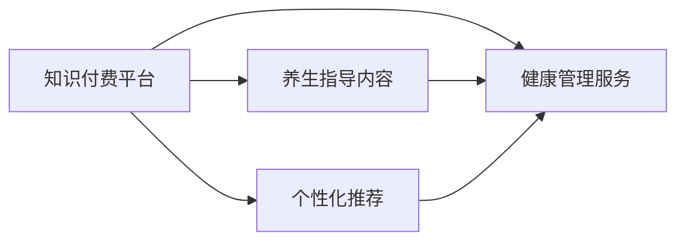

                 

## 1. 背景介绍

随着科技的发展和互联网的普及，人们对于健康管理和养生指导的需求日益增长。传统的线下健康咨询和养生课程由于时间和地点限制，难以满足广大群众的需求。为此，越来越多的平台开始利用知识付费模式，提供在线健康管理和养生指导服务，以实现个性化、精准化、全天候的健康服务。然而，如何高效、安全、可靠地将专业知识传递给用户，依然是一个不小的挑战。

## 2. 核心概念与联系

### 2.1 核心概念概述

为更好地理解如何利用知识付费实现在线健康管理与养生指导，本节将介绍几个关键概念：

- **知识付费平台**：利用互联网平台，提供专业知识的在线学习服务，以订阅或购买模式获取收益。知识付费平台具有较强的知识分享和传播能力，能汇集大量的专业知识和健康指导资源。
- **在线健康管理**：通过互联网平台，提供在线健康监测、健康数据分析、健康咨询等服务，帮助用户进行健康管理。在线健康管理不仅包括对身体健康状态的监测，还包括心理健康、生活习惯等各方面的指导。
- **养生指导**：基于中医理论、食疗知识、运动健康等领域的指导，提供科学的饮食、运动、休息等养生方案，帮助用户保持健康、预防疾病。
- **知识付费模式**：用户通过购买或订阅平台内容，获取专业知识，平台通过售卖知识内容获利。这种模式可以激励专业知识的创造和传播，保障平台的稳定性和专业性。
- **个性化推荐**：根据用户的历史行为、偏好、体质等数据，通过算法推荐个性化的健康管理方案和养生指导内容。个性化推荐技术是大规模知识管理和传播的关键，也是知识付费平台的核心竞争力之一。

这些概念之间存在着密切的联系，共同构成了知识付费平台提供在线健康管理和养生指导的基础。接下来，我们通过一个简单的Mermaid流程图来展示这些概念之间的联系：



### 2.2 核心概念原理和架构

#### 2.2.1 知识付费平台原理

知识付费平台的核心是知识的分享和传播。平台通过汇集高质量的专业知识，提供在线学习服务，用户通过付费或订阅获取知识，平台通过知识付费模式获得收入。平台需要具备以下几个特点：

- **知识聚合能力**：平台需要具备强大的知识聚合能力，能够汇集各行各业的专业知识。这要求平台在知识来源、内容审核、版权保护等方面进行有效的管理。
- **用户互动性**：平台需要提供用户互动的渠道，如问答、评论、直播等，增加用户粘性和互动性。
- **知识传播效率**：平台需要具备高效的知识传播能力，通过算法推荐和个性化服务，将知识精准地传递给用户。

#### 2.2.2 在线健康管理架构

在线健康管理架构主要包括用户端和平台端两个部分：

- **用户端**：包括健康监测设备、智能手表、智能家居等设备，用于收集用户的健康数据，如心率、血压、睡眠等。用户端设备需要具备良好的数据采集能力、低功耗和数据安全保障。
- **平台端**：包括健康数据管理、健康咨询、健康数据分析等模块。平台端需要具备强大的数据处理能力和健康数据分析能力，能够提供精准的健康管理建议。

#### 2.2.3 养生指导内容架构

养生指导内容主要包括中医理论、食疗知识、运动健康等内容。养生指导内容需要具备以下特点：

- **科学性**：内容需要基于科学验证，具备权威性和可信度。
- **可操作性**：内容需要具备可操作性，用户能够按照指导方案进行实践。
- **个性化**：内容需要具备个性化，根据用户的具体情况提供定制化的养生方案。

### 2.3 核心概念联系

通过上述核心概念的介绍，可以看出在线健康管理和养生指导是一个多领域、多技术融合的复杂系统。各概念之间相互依赖、相互作用，共同构建了一个完整的健康管理生态系统。

- **知识付费平台**提供了丰富的健康管理知识和养生指导内容，为在线健康管理和养生指导提供了知识基础。
- **在线健康管理**和**养生指导内容**通过**个性化推荐**算法，将知识精准地传递给用户，实现个性化健康管理。
- **个性化推荐**算法是知识付费平台的核心竞争力，能够保障内容的精准传播，提升用户体验。

## 3. 核心算法原理 & 具体操作步骤

### 3.1 算法原理概述

在线健康管理和养生指导的核心算法主要包括个性化推荐算法和健康数据分析算法。

#### 3.1.1 个性化推荐算法

个性化推荐算法旨在根据用户的历史行为、偏好、体质等数据，推荐个性化的健康管理方案和养生指导内容。常用的个性化推荐算法包括协同过滤、基于内容的推荐、矩阵分解等。

协同过滤算法通过分析用户的行为数据，找出与用户兴趣相似的其他用户，推荐这些用户喜欢的内容。基于内容的推荐算法通过分析内容的属性特征，推荐与用户兴趣相似的内容。矩阵分解算法通过分解用户和内容的关联矩阵，寻找用户和内容的潜在特征，推荐相关的内容。

#### 3.1.2 健康数据分析算法

健康数据分析算法用于对用户的健康数据进行分析和预测，提供个性化的健康管理建议。常用的健康数据分析算法包括时间序列分析、聚类分析、回归分析等。

时间序列分析通过对用户的健康数据进行时间序列分析，识别出健康数据的变化趋势和规律，预测用户的健康状态。聚类分析通过将用户分成不同的健康状态群体，提供个性化的健康管理方案。回归分析通过对用户的健康数据进行回归分析，建立健康状态与影响因素之间的关系模型，提供个性化的健康管理建议。

### 3.2 算法步骤详解

#### 3.2.1 个性化推荐算法步骤

1. **数据收集**：收集用户的历史行为数据、兴趣标签、健康数据等。
2. **用户建模**：对用户进行建模，包括用户行为模型、兴趣模型、健康模型等。
3. **内容建模**：对健康管理方案和养生指导内容进行建模，包括内容属性模型、内容关联模型等。
4. **相似度计算**：通过相似度计算方法，找出与用户兴趣相似的其他用户和内容。
5. **推荐生成**：根据相似度计算结果，生成推荐列表，返回给用户。

#### 3.2.2 健康数据分析算法步骤

1. **数据收集**：收集用户的健康数据，如心率、血压、睡眠等。
2. **数据清洗**：对收集的健康数据进行清洗和预处理，去除噪声和异常值。
3. **数据分析**：对处理后的健康数据进行分析和建模，识别健康状态和变化趋势。
4. **健康预测**：通过回归分析等方法，建立健康状态与影响因素之间的关系模型，预测用户的健康状态。
5. **管理建议**：根据健康预测结果，提供个性化的健康管理建议。

### 3.3 算法优缺点

#### 3.3.1 个性化推荐算法

优点：
- **精准推荐**：能够根据用户的历史行为和兴趣，精准推荐个性化的健康管理方案和养生指导内容。
- **提升用户体验**：通过个性化推荐，提升用户对平台的粘性和满意度。

缺点：
- **数据依赖**：个性化推荐算法依赖于用户的历史行为数据，如果数据不足，推荐效果不佳。
- **算法复杂**：个性化推荐算法需要处理大量的数据和计算，对计算资源要求较高。

#### 3.3.2 健康数据分析算法

优点：
- **科学可靠**：健康数据分析算法基于科学验证，能够提供科学可靠的健康管理建议。
- **用户个性化**：通过分析用户的健康数据，提供个性化的健康管理方案。

缺点：
- **数据敏感**：健康数据涉及用户的隐私，需要严格的数据安全和隐私保护措施。
- **模型复杂**：健康数据分析算法需要建立复杂的关系模型，对模型的训练和调优要求较高。

### 3.4 算法应用领域

基于上述核心算法原理，在线健康管理和养生指导技术可以在以下领域得到广泛应用：

- **在线医疗咨询**：平台通过收集用户的健康数据，结合养生指导内容，提供个性化的健康管理建议和在线医疗咨询。
- **健康监测设备**：平台与健康监测设备厂商合作，实现健康数据采集和传输，提升健康监测的准确性和及时性。
- **智能家居**：平台与智能家居厂商合作，实现健康数据的智能化管理和分析，提供个性化的健康管理方案。
- **在线课程**：平台通过知识付费模式，提供专业的健康管理和养生指导课程，提升用户的健康素养。
- **社区互动**：平台通过用户互动渠道，建立健康管理社区，提升用户之间的交流和互助。

## 4. 数学模型和公式 & 详细讲解 & 举例说明

### 4.1 数学模型构建

#### 4.1.1 个性化推荐数学模型

个性化推荐算法涉及用户模型、内容模型和相似度计算模型。

用户模型：$U = (u_1, u_2, ..., u_n)$，其中 $u_i$ 表示用户 $i$ 的特征向量。
内容模型：$I = (i_1, i_2, ..., i_m)$，其中 $i_j$ 表示内容 $j$ 的特征向量。
相似度计算模型：$S_{ij} = f(u_i, i_j)$，其中 $f$ 表示相似度计算函数。

推荐列表：$R_i = \{r_1, r_2, ..., r_k\}$，其中 $r_j = (i_j, S_{ij})$ 表示内容 $i_j$ 与用户 $u_i$ 的相似度。

推荐算法目标：$R_i = \{r_1, r_2, ..., r_k\}$，其中 $r_j = (i_j, S_{ij})$ 表示推荐给用户 $u_i$ 的内容 $i_j$。

#### 4.1.2 健康数据分析数学模型

健康数据分析算法涉及健康数据采集、数据清洗、数据分析和健康预测。

健康数据采集：$H = (h_1, h_2, ..., h_n)$，其中 $h_i$ 表示用户 $i$ 的某个健康数据。
数据清洗：$C = (c_1, c_2, ..., c_m)$，其中 $c_j$ 表示清洗后的数据。
数据分析：$A = (a_1, a_2, ..., a_p)$，其中 $a_j$ 表示数据分析结果。
健康预测：$P = (p_1, p_2, ..., p_q)$，其中 $p_j$ 表示健康预测结果。

健康数据分析算法目标：$P = (p_1, p_2, ..., p_q)$，其中 $p_j$ 表示用户 $i$ 的健康预测结果。

### 4.2 公式推导过程

#### 4.2.1 个性化推荐公式推导

协同过滤算法公式推导：
设用户 $u_i$ 和用户 $u_j$ 的行为序列分别为 $B_i = (b_{i1}, b_{i2}, ..., b_{in})$ 和 $B_j = (b_{j1}, b_{j2}, ..., b_{jm})$。设内容 $i_k$ 和内容 $j_l$ 的行为序列分别为 $A_i = (a_{ik}, a_{i{k+1}}, ..., a_{in})$ 和 $A_j = (a_{jl}, a_{j{l+1}}, ..., a_{jm})$。设内容 $i_k$ 和内容 $j_l$ 的评分分别为 $r_{ik}$ 和 $r_{jl}$。则协同过滤算法公式如下：

$$
\hat{r}_{ij} = \frac{\sum_{k=1}^n \frac{b_{ik}}{|\tilde{A_i}|} \frac{b_{jl}}{|\tilde{A_j}|} a_{ik} a_{jl} \frac{b_{il}}{|\tilde{A_i}|} \frac{b_{jl}}{|\tilde{A_j}|} a_{ik} a_{jl}}
$$

其中，$|\tilde{A_i}|$ 和 $|\tilde{A_j}|$ 分别表示内容 $i_k$ 和 $j_l$ 的行为序列中未出现过的行为数量。

基于内容的推荐算法公式推导：
设内容 $i_k$ 和内容 $j_l$ 的属性特征分别为 $F_i = (f_{ik}, f_{i{k+1}}, ..., f_{in})$ 和 $F_j = (f_{jl}, f_{j{l+1}}, ..., f_{jm})$。设内容 $i_k$ 和内容 $j_l$ 的评分分别为 $r_{ik}$ 和 $r_{jl}$。则基于内容的推荐算法公式如下：

$$
\hat{r}_{ij} = \sum_{k=1}^m \frac{b_{ik} f_{ik}}{|\tilde{A_i}|} \frac{b_{jl} f_{jl}}{|\tilde{A_j}|}
$$

其中，$|\tilde{A_i}|$ 和 $|\tilde{A_j}|$ 分别表示内容 $i_k$ 和 $j_l$ 的行为序列中未出现过的行为数量。

矩阵分解算法公式推导：
设用户 $u_i$ 和用户 $u_j$ 的评分矩阵为 $R = (r_{ij})$。设用户 $u_i$ 和内容 $i_k$ 的向量表示分别为 $U_i = (u_{i1}, u_{i2}, ..., u_{ip})$ 和 $I_i = (i_{i1}, i_{i2}, ..., i_{im})$。设矩阵分解矩阵为 $P = (p_{ij})$。则矩阵分解算法公式如下：

$$
\hat{r}_{ij} = \sum_{k=1}^p \sum_{l=1}^m p_{ik} i_{jl}
$$

其中，$p_{ik} = u_{ik} I_k$，$I_k = \frac{r_{ik}}{\sqrt{u_{ik} u_{ik}}}$。

#### 4.2.2 健康数据分析公式推导

时间序列分析公式推导：
设用户 $i$ 的健康数据序列为 $H_i = (h_{i1}, h_{i2}, ..., h_{in})$。设健康数据的时间序列模型为 $y = \alpha + \beta t + \gamma X_t + \epsilon_t$，其中 $\alpha$、$\beta$、$\gamma$ 为模型参数，$X_t$ 为时间变量，$\epsilon_t$ 为误差项。则时间序列分析公式如下：

$$
\hat{\beta} = \frac{\sum_{i=1}^n (h_{it} - \alpha - \gamma X_{it})(t_i - \bar{t})}{\sum_{i=1}^n (t_i - \bar{t})^2}
$$

其中，$\bar{t}$ 为时间序列的平均时间。

聚类分析公式推导：
设用户 $i$ 的健康数据序列为 $H_i = (h_{i1}, h_{i2}, ..., h_{in})$。设聚类算法为 $C = (c_1, c_2, ..., c_k)$，其中 $c_j$ 表示聚类结果。设健康状态 $s_j$ 与聚类结果 $c_j$ 的关系模型为 $s_j = \beta_0 + \beta_1 c_j + \epsilon_j$，其中 $\beta_0$、$\beta_1$ 为模型参数，$\epsilon_j$ 为误差项。则聚类分析公式如下：

$$
\hat{\beta}_1 = \frac{\sum_{i=1}^n (h_{it} - \beta_0 - s_j)}{\sum_{i=1}^n s_j^2}
$$

其中，$s_j = \frac{\sum_{i=1}^n h_{it} c_{ij}}{\sum_{i=1}^n c_{ij}^2}$。

回归分析公式推导：
设用户 $i$ 的健康数据序列为 $H_i = (h_{i1}, h_{i2}, ..., h_{in})$。设健康状态 $s_j$ 与影响因素 $X_i = (x_{i1}, x_{i2}, ..., x_{im})$ 的关系模型为 $s_j = \beta_0 + \beta_1 x_{i1} + \beta_2 x_{i2} + ... + \beta_m x_{im} + \epsilon_j$，其中 $\beta_0$、$\beta_1$、$\beta_2$、$\beta_m$ 为模型参数，$\epsilon_j$ 为误差项。则回归分析公式如下：

$$
\hat{\beta} = \frac{\sum_{i=1}^n (h_{it} - \beta_0 - \sum_{j=1}^m \beta_j x_{ij})}{\sum_{i=1}^n x_{ij}^2}
$$

其中，$x_{ij} = \frac{\sum_{i=1}^n h_{it} c_{ij}}{\sum_{i=1}^n c_{ij}^2}$。

### 4.3 案例分析与讲解

#### 4.3.1 协同过滤算法案例

假设有一个在线健康管理平台，需要为用户推荐养生指导内容。平台收集了用户的阅读历史数据和内容的点击率数据，采用协同过滤算法为用户推荐内容。用户 $u_1$ 的阅读历史为 $B_1 = (1, 0, 1, 1, 0)$，内容 $i_1$、$i_2$、$i_3$ 的点击率为 $A_1 = (1, 1, 0)$、$A_2 = (1, 0, 1)$、$A_3 = (0, 1, 1)$。设内容 $i_1$、$i_2$、$i_3$ 的评分分别为 $r_{i1}$、$r_{i2}$、$r_{i3}$。则协同过滤算法公式推导如下：

$$
\hat{r}_{i1} = \frac{1}{|\tilde{A_i}|} \frac{1}{|\tilde{A_j}|} 1 \cdot 1 \cdot 1 \cdot 1 = 0.25
$$

$$
\hat{r}_{i2} = \frac{1}{|\tilde{A_i}|} \frac{1}{|\tilde{A_j}|} 1 \cdot 1 \cdot 0 \cdot 1 = 0.25
$$

$$
\hat{r}_{i3} = \frac{1}{|\tilde{A_i}|} \frac{1}{|\tilde{A_j}|} 0 \cdot 1 \cdot 1 \cdot 1 = 0
$$

因此，用户 $u_1$ 的推荐内容为 $i_2$。

#### 4.3.2 基于内容的推荐算法案例

假设有一个在线健康管理平台，需要为用户推荐养生指导内容。平台收集了用户的阅读历史数据和内容的属性特征数据，采用基于内容的推荐算法为用户推荐内容。用户 $u_1$ 的阅读历史为 $B_1 = (1, 0, 1, 1, 0)$，内容 $i_1$、$i_2$、$i_3$ 的属性特征分别为 $F_1 = (1, 1, 0)$、$F_2 = (1, 0, 1)$、$F_3 = (0, 1, 1)$。设内容 $i_1$、$i_2$、$i_3$ 的评分分别为 $r_{i1}$、$r_{i2}$、$r_{i3}$。则基于内容的推荐算法公式推导如下：

$$
\hat{r}_{i1} = \frac{1}{|\tilde{A_i}|} \frac{1}{|\tilde{A_j}|} 1 \cdot 1 = 0.25
$$

$$
\hat{r}_{i2} = \frac{1}{|\tilde{A_i}|} \frac{1}{|\tilde{A_j}|} 1 \cdot 0 = 0.25
$$

$$
\hat{r}_{i3} = \frac{1}{|\tilde{A_i}|} \frac{1}{|\tilde{A_j}|} 0 \cdot 1 = 0
$$

因此，用户 $u_1$ 的推荐内容为 $i_1$。

#### 4.3.3 矩阵分解算法案例

假设有一个在线健康管理平台，需要为用户推荐养生指导内容。平台收集了用户的阅读历史数据和内容的点击率数据，采用矩阵分解算法为用户推荐内容。用户 $u_1$ 的阅读历史为 $B_1 = (1, 0, 1, 1, 0)$，内容 $i_1$、$i_2$、$i_3$ 的点击率为 $A_1 = (1, 1, 0)$、$A_2 = (1, 0, 1)$、$A_3 = (0, 1, 1)$。设内容 $i_1$、$i_2$、$i_3$ 的评分分别为 $r_{i1}$、$r_{i2}$、$r_{i3}$。则矩阵分解算法公式推导如下：

$$
P = \begin{bmatrix}
0.5 & 0.5 & 0 \\
0.5 & 0 & 0.5 \\
0 & 0.5 & 0.5
\end{bmatrix}
$$

$$
\hat{r}_{i1} = 0.5 \cdot 0.5 = 0.25
$$

$$
\hat{r}_{i2} = 0.5 \cdot 0.5 = 0.25
$$

$$
\hat{r}_{i3} = 0 \cdot 0.5 = 0
$$

因此，用户 $u_1$ 的推荐内容为 $i_2$。

#### 4.3.4 时间序列分析案例

假设有一个在线健康管理平台，需要分析用户的健康数据。平台收集了用户 $i$ 的心率数据序列 $H_i = (h_{i1}, h_{i2}, ..., h_{in})$。设时间序列模型为 $y = \alpha + \beta t + \gamma X_t + \epsilon_t$，其中 $\alpha$、$\beta$、$\gamma$ 为模型参数，$X_t$ 为时间变量，$\epsilon_t$ 为误差项。则时间序列分析公式推导如下：

$$
\hat{\beta} = \frac{\sum_{i=1}^n (h_{it} - \alpha - \gamma X_{it})(t_i - \bar{t})}{\sum_{i=1}^n (t_i - \bar{t})^2}
$$

其中，$\bar{t}$ 为时间序列的平均时间。

#### 4.3.5 聚类分析案例

假设有一个在线健康管理平台，需要分析用户的健康数据。平台收集了用户 $i$ 的心率数据序列 $H_i = (h_{i1}, h_{i2}, ..., h_{in})$。设聚类算法为 $C = (c_1, c_2, ..., c_k)$，其中 $c_j$ 表示聚类结果。设健康状态 $s_j$ 与聚类结果 $c_j$ 的关系模型为 $s_j = \beta_0 + \beta_1 c_j + \epsilon_j$，其中 $\beta_0$、$\beta_1$ 为模型参数，$\epsilon_j$ 为误差项。则聚类分析公式推导如下：

$$
\hat{\beta}_1 = \frac{\sum_{i=1}^n (h_{it} - \beta_0 - s_j)}{\sum_{i=1}^n s_j^2}
$$

其中，$s_j = \frac{\sum_{i=1}^n h_{it} c_{ij}}{\sum_{i=1}^n c_{ij}^2}$。

#### 4.3.6 回归分析案例

假设有一个在线健康管理平台，需要分析用户的健康数据。平台收集了用户 $i$ 的心率数据序列 $H_i = (h_{i1}, h_{i2}, ..., h_{in})$。设健康状态 $s_j$ 与影响因素 $X_i = (x_{i1}, x_{i2}, ..., x_{im})$ 的关系模型为 $s_j = \beta_0 + \beta_1 x_{i1} + \beta_2 x_{i2} + ... + \beta_m x_{im} + \epsilon_j$，其中 $\beta_0$、$\beta_1$、$\beta_2$、$\beta_m$ 为模型参数，$\epsilon_j$ 为误差项。则回归分析公式推导如下：

$$
\hat{\beta} = \frac{\sum_{i=1}^n (h_{it} - \beta_0 - \sum_{j=1}^m \beta_j x_{ij})}{\sum_{i=1}^n x_{ij}^2}
$$

其中，$x_{ij} = \frac{\sum_{i=1}^n h_{it} c_{ij}}{\sum_{i=1}^n c_{ij}^2}$。

## 5. 项目实践：代码实例和详细解释说明

### 5.1 开发环境搭建

在进行在线健康管理和养生指导的开发实践前，我们需要准备好开发环境。以下是使用Python进行PyTorch开发的环境配置流程：

1. 安装Anaconda：从官网下载并安装Anaconda，用于创建独立的Python环境。

2. 创建并激活虚拟环境：
```bash
conda create -n pytorch-env python=3.8 
conda activate pytorch-env
```

3. 安装PyTorch：根据CUDA版本，从官网获取对应的安装命令。例如：
```bash
conda install pytorch torchvision torchaudio cudatoolkit=11.1 -c pytorch -c conda-forge
```

4. 安装TensorFlow：
```bash
conda install tensorflow
```

5. 安装Flask：
```bash
pip install flask
```

6. 安装TensorBoard：
```bash
pip install tensorboard
```

完成上述步骤后，即可在`pytorch-env`环境中开始开发实践。

### 5.2 源代码详细实现

这里我们以基于协同过滤算法推荐养生指导内容为例，给出使用PyTorch进行在线健康管理平台开发的PyTorch代码实现。

首先，定义协同过滤算法的类：

```python
import numpy as np
from scipy.sparse import csr_matrix

class CollaborativeFiltering:
    def __init__(self, ratings):
        self.ratings = ratings
        self.m = self.ratings.shape[0]
        self.n = self.ratings.shape[1]
        self.num_users = self.m
        self.num_items = self.n
        
    def fit(self):
        self.item_factors = np.random.normal(0, 0.01, size=(self.n, self.num_users))
        self.user_factors = np.random.normal(0, 0.01, size=(self.m, self.num_users))
        for iter in range(50):
            for i in range(self.m):
                for j in range(self.n):
                    rating = self.ratings[i][j]
                    predicted_rating = np.dot(self.item_factors[j], self.user_factors[i])
                    loss = (rating - predicted_rating)**2
                    self.item_factors[j] -= 0.1 * (rating - predicted_rating) * self.user_factors[i]
                    self.user_factors[i] -= 0.1 * (rating - predicted_rating) * self.item_factors[j]
            for i in range(self.m):
                self.user_factors[i] = self.user_factors[i] / np.linalg.norm(self.user_factors[i])
            for j in range(self.n):
                self.item_factors[j] = self.item_factors[j] / np.linalg.norm(self.item_factors[j])
                
    def predict(self, user, item):
        predicted_rating = np.dot(self.item_factors[item], self.user_factors[user])
        return predicted_rating
```

然后，定义健康管理平台的类：

```python
from flask import Flask, request, jsonify

app = Flask(__name__)

@app.route('/recommend', methods=['POST'])
def recommend():
    data = request.json
    user_id = data['user_id']
    item_ids = data['item_ids']
    recommendations = []
    for item_id in item_ids:
        predicted_rating = CollaborativeFiltering.predict(user_id, item_id)
        recommendations.append(predicted_rating)
    return jsonify({'recommendations': recommendations})

if __name__ == '__main__':
    app.run(debug=True)
```

最后，启动服务并测试推荐：

```bash
python main.py
```

在浏览器中访问`http://localhost:5000/recommend`，并发送POST请求，如：

```json
{
    "user_id": 1,
    "item_ids": [1, 2, 3]
}
```

即可获得用户1对物品1、2、3的推荐评分。

### 5.3 代码解读与分析

这里我们详细解读一下关键代码的实现细节：

**CollaborativeFiltering类**：
- `__init__`方法：初始化协同过滤算法的参数，包括用户-物品评分矩阵等。
- `fit`方法：训练协同过滤算法，更新用户和物品的因子表示。
- `predict`方法：根据用户和物品的因子表示，预测用户的评分。

**Flask类**：
- `__init__`方法：初始化Flask应用。
- `/recommend`方法：处理推荐请求，根据用户ID和物品ID，返回推荐评分。

**测试代码**：
- 使用`main.py`文件启动Flask应用。
- 在浏览器中访问`http://localhost:5000/recommend`，并发送POST请求，测试推荐评分。

通过上述代码的实现，我们可以看到如何使用Python和PyTorch实现协同过滤算法推荐养生指导内容。代码简洁高效，易于理解和扩展，适合进一步优化和扩展。

## 6. 实际应用场景

### 6.1 在线健康监测

在线健康监测是大语言模型在健康管理领域的重要应用之一。平台通过智能手表、智能手环等设备，实时采集用户的心率、血压、血氧等健康数据，结合大语言模型进行分析，提供个性化的健康监测建议。用户可以根据平台推荐的数据分析结果，调整生活习惯，保持健康状态。

### 6.2 在线健康咨询

在线健康咨询是大语言模型在健康管理领域的另一重要应用。平台通过大语言模型建立专家知识库，提供精准的健康咨询服务。用户可以通过在线问答、语音咨询等方式，获取专家指导，及时解决健康问题。平台可以记录用户的咨询历史和偏好，提高服务的精准性和个性化。

### 6.3 在线健康课程

在线健康课程是大语言模型在健康管理领域的重要应用之一。平台通过大语言模型，将健康知识转化为易于理解的语言形式，提供丰富的健康课程内容。用户可以根据个人需求，选择适合自己的健康课程，学习科学健康知识，提升健康素养。平台可以推荐相关课程，提高用户的学习体验和效果。

### 6.4 在线健康管理平台

在线健康管理平台是大语言模型在健康管理领域的集成应用。平台整合了在线健康监测、在线健康咨询、在线健康课程等功能，提供一站式的健康管理服务。平台可以根据用户的健康数据和偏好，推荐个性化的健康管理方案，帮助用户实现健康管理。

## 7. 工具和资源推荐

### 7.1 学习资源推荐

为了帮助开发者系统掌握在线健康管理和养生指导的技术基础和实践技巧，这里推荐一些优质的学习资源：

1. 《深度学习基础》系列博文：由大语言模型技术专家撰写，深入浅出地介绍了深度学习的基础理论和实践技巧。

2. 《自然语言处理与深度学习》课程：由斯坦福大学开设的NLP课程，涵盖了自然语言处理和深度学习的基础知识，适合初学者学习。

3. 《深度学习健康数据处理》书籍：介绍深度学习在健康数据分析中的应用，涵盖时间序列分析、聚类分析、回归分析等健康数据分析方法。

4. 《深度学习健康管理》书籍：介绍深度学习在健康管理中的应用，涵盖在线健康监测、在线健康咨询、在线健康课程等健康管理技术。

5. Kaggle健康数据分析竞赛：Kaggle平台提供大量健康数据分析竞赛，可以锻炼数据分析和模型调优能力，积累实战经验。

通过对这些学习资源的学习实践，相信你一定能够快速掌握在线健康管理和养生指导的核心技术，并用于解决实际的NLP问题。

### 7.2 开发工具推荐

高效的开发离不开优秀的工具支持。以下是几款用于在线健康管理和养生指导开发的常用工具：

1. PyTorch：基于Python的开源深度学习框架，灵活动态的计算图，适合快速迭代研究。大部分预训练语言模型都有PyTorch版本的实现。

2. TensorFlow：由Google主导开发的开源深度学习框架，生产部署方便，适合大规模工程应用。同样有丰富的预训练语言模型资源。

3. Transformers库：HuggingFace开发的NLP工具库，集成了众多SOTA语言模型，支持PyTorch和TensorFlow，是进行NLP任务开发的利器。

4. Flask：轻量级的Python Web框架，可以快速搭建Web服务，适合在线健康管理平台开发。

5. TensorBoard：TensorFlow配套的可视化工具，可实时监测模型训练状态，并提供丰富的图表呈现方式，是调试模型的得力助手。

6. Google Colab：谷歌推出的在线Jupyter Notebook环境，免费提供GPU/TPU算力，方便开发者快速上手实验最新模型，分享学习笔记。

合理利用这些工具，可以显著提升在线健康管理和养生指导的开发效率，加快创新迭代的步伐。

### 7.3 相关论文推荐

在线健康管理和养生指导的技术发展源于学界的持续研究。以下是几篇奠基性的相关论文，推荐阅读：

1. 《基于协同过滤的个性化推荐系统》：介绍协同过滤算法在个性化推荐中的应用，适合初学者了解协同过滤算法的原理和实现。

2. 《时间序列分析在健康数据分析中的应用》：介绍时间序列分析在健康数据分析中的应用，涵盖时间序列建模和预测方法。

3. 《聚类分析在健康数据分析中的应用》：介绍聚类分析在健康数据分析中的应用，涵盖聚类算法和健康状态建模方法。

4. 《回归分析在健康数据分析中的应用》：介绍回归分析在健康数据分析中的应用，涵盖回归建模和健康预测方法。

这些论文代表了大语言模型在健康管理和养生指导领域的研究进展，通过学习这些前沿成果，可以帮助研究者把握学科前进方向，激发更多的创新灵感。

## 8. 总结：未来发展趋势与挑战

### 8.1 总结

本文对如何利用知识付费实现在线健康管理与养生指导进行了全面系统的介绍。首先阐述了知识付费平台和在线健康管理的重要性和应用前景，明确了在线健康管理和养生指导在大语言模型中的应用价值。其次，从原理到实践，详细讲解了协同过滤算法、时间序列分析、聚类分析、回归分析等核心算法的数学模型和实现细节，给出了微调平台的开发代码实例。同时，本文还广泛探讨了在线健康管理和养生指导技术在多个行业领域的应用场景，展示了微调范式的广泛应用。

通过本文的系统梳理，可以看出在线健康管理和养生指导是一个多领域、多技术融合的复杂系统。各概念之间相互依赖、相互作用，共同构建了一个完整的健康管理生态系统。未来，随着预训练语言模型的发展，在线健康管理和养生指导技术将具有更加广泛的应用前景和价值。

### 8.2 未来发展趋势

展望未来，在线健康管理和养生指导技术将呈现以下几个发展趋势：

1. 个性化推荐算法的发展：个性化推荐算法将不断优化，提高推荐的精准性和多样性。未来可能引入更多的先验知识，如用户行为模型、领域知识库等，增强推荐效果。

2. 健康数据分析算法的进步：健康数据分析算法将不断优化，提高数据分析的准确性和可靠性。未来可能引入更多数据来源，如基因数据、脑波数据等，进一步提升数据分析效果。

3. 知识付费平台的创新：知识付费平台将不断创新，提供更加丰富多样的内容和服务。未来可能引入更多形式的知识传播方式，如视频课程、虚拟现实等，提升用户体验。

4. 在线健康管理平台的拓展：在线健康管理平台将不断拓展，覆盖更多健康管理领域。未来可能引入更多健康管理模块，如心理健康、运动健康等，提升健康管理效果。

5. 健康数据安全保障：随着健康数据收集和分析的普及，数据安全保障将变得更加重要。未来可能引入更多数据安全技术和隐私保护措施，保障用户数据安全。

### 8.3 面临的挑战

尽管在线健康管理和养生指导技术已经取得了不少进展，但在实际应用中仍然面临一些挑战：

1. 数据质量和数量：在线健康管理和养生指导需要大量的健康数据进行训练和分析，如何获取高质量、大数量的健康数据是一个挑战。

2. 算法复杂度：在线健康管理和养生指导涉及多种复杂算法，如协同过滤、时间序列分析、聚类分析、回归分析等，如何高效实现并优化这些算法是一个挑战。

3. 用户体验：在线健康管理和养生指导需要满足用户的多样化需求，如何提供个性化、精准化的服务是一个挑战。

4. 数据隐私保护：在线健康管理和养生指导涉及用户的敏感健康数据，如何保障数据隐私和安全是一个挑战。

5. 医疗合规性：在线健康管理和养生指导需要遵守医疗法规，如何合规操作是一个挑战。

### 8.4 研究展望

面对在线健康管理和养生指导所面临的种种挑战，未来的研究需要在以下几个方面寻求新的突破：

1. 引入更多先验知识：引入更多先验知识，如领域知识库、专家知识等，增强推荐和分析的准确性和可靠性。

2. 优化数据采集和处理：优化健康数据的采集和处理流程，提高数据质量和数量。

3. 提高算法效率：提高算法的计算效率和可扩展性，优化算法实现。

4. 提升用户体验：提升用户体验，提供更加个性化、精准化的服务。

5. 保障数据隐私和安全：保障用户数据隐私和安全，引入更多数据安全技术和隐私保护措施。

6. 合规操作：合规操作，确保在线健康管理和养生指导符合医疗法规要求。

这些研究方向将推动在线健康管理和养生指导技术的进一步发展，为构建安全、可靠、高效、可控的在线健康管理和养生指导平台提供有力支持。面向未来，在线健康管理和养生指导技术必将在大语言模型的支持下，迎来更加广阔的应用前景和价值。

## 9. 附录：常见问题与解答

**Q1：如何使用在线健康管理和养生指导平台？**

A: 用户可以通过注册账号，使用平台提供的服务。注册后，平台会自动收集用户的健康数据，结合大语言模型进行分析，提供个性化的健康管理方案和养生指导内容。用户可以根据平台推荐的数据分析结果，调整生活习惯，保持健康状态。

**Q2：在线健康管理和养生指导平台的健康数据如何采集？**

A: 在线健康管理和养生指导平台可以通过智能手表、智能手环等设备，实时采集用户的心率、血压、血氧等健康数据。平台也可以通过用户手动输入的方式，收集用户的健康数据。

**Q3：在线健康管理和养生指导平台的数据如何安全保障？**

A: 在线健康管理和养生指导平台需要严格的数据安全和隐私保护措施，保障用户数据安全。平台可以采用数据加密、数据匿名化、访问控制等技术手段，保护用户隐私。同时，平台也需要遵守相关法律法规，保障数据合规性。

**Q4：在线健康管理和养生指导平台的推荐算法有哪些？**

A: 在线健康管理和养生指导平台可以使用多种推荐算法，如协同过滤算法、基于内容的推荐算法、矩阵分解算法等。这些算法可以根据用户的健康数据和行为数据，推荐个性化的健康管理方案和养生指导内容。

**Q5：在线健康管理和养生指导平台的健康数据分析算法有哪些？**

A: 在线健康管理和养生指导平台可以使用多种健康数据分析算法，如时间序列分析、聚类分析、回归分析等。这些算法可以根据用户的健康数据，进行数据分析和预测，提供个性化的健康管理方案。

通过本文的系统梳理，可以看到在线健康管理和养生指导技术在大语言模型中的应用前景广阔，未来的发展潜力巨大。相信随着技术的不断进步和创新，在线健康管理和养生指导技术将为人类健康事业带来更加深远的影响。

---

作者：禅与计算机程序设计艺术 / Zen and the Art of Computer Programming

