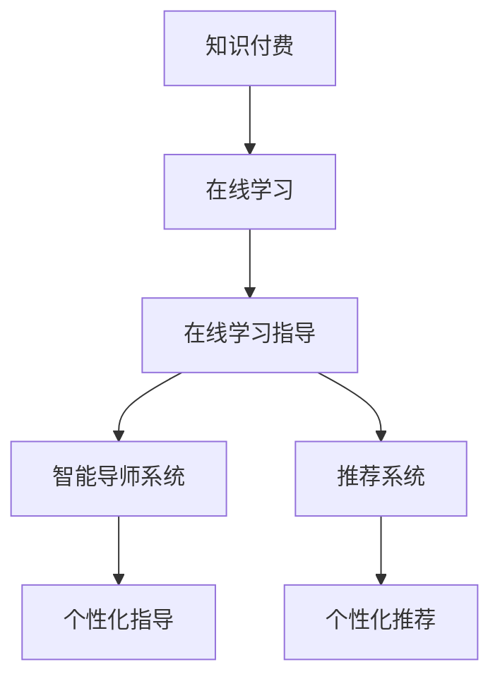

                 

# 如何利用知识付费实现在线学习与在线学习指导？

> 关键词：知识付费, 在线学习, 在线学习指导, 人工智能, 智能导师系统, 推荐系统

## 1. 背景介绍

在知识爆炸的时代，终身学习已成为个人和社会发展的必然趋势。然而，面对海量信息，如何高效、系统地获取知识，已成为一大难题。传统的课堂教学模式难以满足个性化和时效性的需求，而线下学习资源受限于时间和地点的限制，也难以满足广大学习者的需求。因此，如何借助技术手段，实现更高效、个性化的在线学习，成为当下亟需解决的问题。

知识付费作为一种新兴的教育模式，通过付费订阅优质的在线课程和专家资源，解决了获取高质量学习内容的问题。但仅仅订阅优质内容，并不能完全解决在线学习中的痛点，如学习动机不足、个性化指导缺失、学习效果难以评估等。为此，结合人工智能技术，开发智能导师系统和推荐系统，为在线学习提供个性化指导和智能推荐，成为一种有效的解决方案。

## 2. 核心概念与联系

### 2.1 核心概念概述

- **知识付费**：通过付费获取高质量、专业化的在线课程和内容，以满足学习者个性化、系统化的学习需求。知识付费平台如Coursera、Udemy、网易云课堂等，已为全球用户提供了丰富多样的学习资源。

- **在线学习**：通过互联网平台，获取视频、文本、音频等多种形式的在线学习资源，实现自主学习。在线学习打破了时间和空间的限制，极大地拓宽了学习的边界。

- **在线学习指导**：通过人工智能技术，为在线学习者提供智能化的学习指导，包括学习路径规划、学习动机激励、学习效果评估等。

- **智能导师系统**：一种结合人工智能技术，为学习者提供个性化指导的在线教育工具。通过分析学习者的行为数据，智能导师系统可以提供针对性的学习建议和指导。

- **推荐系统**：一种通过用户行为数据，为用户推荐个性化学习内容的技术。推荐系统可以提高用户的学习效率，提升学习体验。

这些概念之间的联系，可以通过以下Mermaid流程图来展示：



这个流程图展示了大语言模型的核心概念及其之间的关系：

1. 知识付费提供了优质、专业化的在线学习资源。
2. 在线学习打破了时间和空间的限制，为学习者提供自主学习环境。
3. 在线学习指导通过智能导师系统和推荐系统，提升学习效果。
4. 智能导师系统利用人工智能技术，提供个性化指导。
5. 推荐系统根据学习者的行为数据，推荐个性化学习内容。

## 3. 核心算法原理 & 具体操作步骤

### 3.1 算法原理概述

在线学习指导的核心在于，利用人工智能技术，分析学习者的行为数据，为其提供个性化、智能化的学习建议。智能导师系统和推荐系统正是基于这一原理，通过机器学习和数据挖掘技术，为学习者提供智能化的学习路径规划、个性化内容推荐和学习效果评估。

智能导师系统的核心算法包括：

- **行为分析**：通过分析学习者的点击、浏览、观看等行为数据，了解学习者的学习兴趣和进度。
- **个性化推荐**：根据学习者的行为数据，推荐符合其兴趣和学习进度的学习内容。
- **路径规划**：结合学习者的学习目标和进度，为其规划个性化的学习路径。
- **学习效果评估**：利用学习者学习过程中的互动数据，评估其学习效果，并给出反馈和建议。

推荐系统的核心算法包括：

- **协同过滤**：通过分析学习者的行为数据，推荐与学习者兴趣相似的学习内容。
- **基于内容的推荐**：通过分析学习内容的特点，推荐符合学习者兴趣的内容。
- **混合推荐**：结合协同过滤和基于内容的推荐，提高推荐系统的准确性和多样性。

### 3.2 算法步骤详解

#### 智能导师系统

1. **行为数据收集**：
   - 收集学习者的点击、浏览、观看、互动等行为数据，建立行为数据仓库。
   - 利用数据采集工具，如谷歌分析、百度统计等，实时记录学习者的行为数据。

2. **行为数据分析**：
   - 通过数据清洗和预处理，将行为数据转化为可用于分析的格式。
   - 利用机器学习算法，如决策树、随机森林、K-means聚类等，分析学习者的行为特征。

3. **个性化推荐**：
   - 利用协同过滤算法，根据学习者的行为数据，推荐相似的学习内容。
   - 利用基于内容的推荐算法，根据学习内容的特点，推荐符合学习者兴趣的内容。

4. **路径规划**：
   - 根据学习者的学习目标和进度，结合推荐内容，规划个性化的学习路径。
   - 利用时间序列分析算法，预测学习者未来的学习需求，调整路径规划。

5. **学习效果评估**：
   - 通过学习者学习过程中的互动数据，评估其学习效果。
   - 利用回归分析、分类算法等，预测学习者未来的学习表现，提供反馈和建议。

#### 推荐系统

1. **数据收集**：
   - 收集学习者的行为数据，如点击、浏览、评分、评论等。
   - 收集学习内容的特征数据，如课程名称、时长、难度、标签等。

2. **协同过滤**：
   - 利用协同过滤算法，根据学习者的行为数据，推荐相似的学习内容。
   - 采用基于矩阵分解的算法，如ALS（Alternating Least Squares），求解协同过滤模型。

3. **基于内容的推荐**：
   - 利用文本挖掘技术，提取学习内容的特征，如关键词、主题等。
   - 利用基于内容的推荐算法，如TF-IDF、BM25等，推荐符合学习者兴趣的内容。

4. **混合推荐**：
   - 结合协同过滤和基于内容的推荐算法，构建混合推荐系统。
   - 通过加权融合、特征融合等方式，提高推荐系统的准确性和多样性。

### 3.3 算法优缺点

智能导师系统和推荐系统具有以下优点：

- **个性化**：利用机器学习算法，根据学习者的行为数据，提供个性化的学习建议和内容推荐。
- **高效性**：自动分析学习者的行为数据，节省了大量的人工干预成本。
- **实时性**：利用实时数据，动态调整学习路径和推荐内容，提升学习效果。

然而，这些系统也存在一定的缺点：

- **数据依赖**：推荐系统的效果高度依赖于行为数据的质量，数据收集和处理过程繁琐。
- **冷启动问题**：新用户或学习内容未被充分标注，系统难以准确推荐。
- **模型复杂**：算法模型复杂，维护成本高，需要不断迭代优化。

### 3.4 算法应用领域

智能导师系统和推荐系统在教育、培训、在线课程等领域都有广泛的应用：

- **教育领域**：为学生提供个性化学习路径和内容推荐，提升学习效果。
- **职业培训**：为职业培训学员推荐个性化课程，提高培训效果和就业率。
- **企业培训**：为企业员工提供个性化培训内容和学习路径，提升员工技能和工作效率。
- **在线课程**：为课程学习者提供个性化推荐，提升学习体验和课程完成率。

## 4. 数学模型和公式 & 详细讲解 & 举例说明

### 4.1 数学模型构建

本节将使用数学语言对智能导师系统和推荐系统的核心算法进行更加严格的刻画。

设学习者 $U$，课程 $I$，用户与课程的评分矩阵 $R_{U \times I}$，行为矩阵 $B_{U \times I}$，用户特征向量 $\vec{p}_U$，课程特征向量 $\vec{q}_I$。

智能导师系统的核心算法包括行为分析、个性化推荐、路径规划和学习效果评估。推荐系统的核心算法包括协同过滤、基于内容的推荐和混合推荐。

### 4.2 公式推导过程

#### 智能导师系统

1. **行为分析**：
   - 利用TF-IDF算法，计算用户行为数据的权重向量 $\vec{b}_U$。
   - 利用K-means聚类算法，将用户分为不同的兴趣类别。

2. **个性化推荐**：
   - 利用协同过滤算法，求解推荐模型 $P$：
     \[
     P_{iu} = \hat{R}_{iu} + \hat{b}_{iu}
     \]
     其中 $\hat{R}_{iu} = \alpha \sum_{j \in N(u)} \frac{R_{iu}}{|\hat{N}(u)|}$
     \[
     \hat{b}_{iu} = \alpha \sum_{j \in N(u)} \frac{b_{iu}}{|\hat{N}(u)|}
     \]
   - 利用基于内容的推荐算法，计算课程与用户匹配度 $C_{iu}$：
     \[
     C_{iu} = \sum_{j=1}^k \vec{p}_{ui} \cdot \vec{q}_{ij}
     \]

3. **路径规划**：
   - 利用时间序列分析算法，预测用户未来的学习需求，调整学习路径。

4. **学习效果评估**：
   - 利用回归分析算法，预测用户的学习效果：
     \[
     e_u = \beta_0 + \beta_1 p_u + \beta_2 q_u
     \]
     其中 $e_u$ 为学习效果，$p_u$ 为用户兴趣，$q_u$ 为用户行为数据。

#### 推荐系统

1. **协同过滤**：
   - 利用ALS算法，求解协同过滤模型：
     \[
     \min_{P,Q} \sum_{(i,j) \in R} \| P_i Q_j^T - R_{ij} \|
     \]
     其中 $P_i$ 为用户向量，$Q_j$ 为课程向量。

2. **基于内容的推荐**：
   - 利用TF-IDF算法，提取课程特征向量 $\vec{q}_{ij}$。
   - 利用BM25算法，计算用户与课程匹配度 $C_{iu}$。

3. **混合推荐**：
   - 利用加权融合算法，融合协同过滤和基于内容的推荐算法：
     \[
     P_{iu} = (1-\gamma) \hat{R}_{iu} + \gamma C_{iu}
     \]
     其中 $\gamma$ 为融合权重，$\hat{R}_{iu}$ 为协同过滤推荐结果，$C_{iu}$ 为基于内容的推荐结果。

### 4.3 案例分析与讲解

以在线课程推荐为例，展示智能导师系统和推荐系统的具体应用。

#### 智能导师系统

1. **行为分析**：
   - 收集学习者点击、浏览、观看等行为数据，生成行为矩阵 $B_{U \times I}$。
   - 利用TF-IDF算法，计算用户行为数据的权重向量 $\vec{b}_U$。
   - 利用K-means聚类算法，将用户分为不同的兴趣类别。

2. **个性化推荐**：
   - 利用协同过滤算法，求解推荐模型 $P$：
     \[
     P_{iu} = \hat{R}_{iu} + \hat{b}_{iu}
     \]
     其中 $\hat{R}_{iu} = \alpha \sum_{j \in N(u)} \frac{R_{iu}}{|\hat{N}(u)|}$
     \[
     \hat{b}_{iu} = \alpha \sum_{j \in N(u)} \frac{b_{iu}}{|\hat{N}(u)|}
     \]
   - 利用基于内容的推荐算法，计算课程与用户匹配度 $C_{iu}$：
     \[
     C_{iu} = \sum_{j=1}^k \vec{p}_{ui} \cdot \vec{q}_{ij}
     \]

3. **路径规划**：
   - 利用时间序列分析算法，预测用户未来的学习需求，调整学习路径。

4. **学习效果评估**：
   - 利用回归分析算法，预测用户的学习效果：
     \[
     e_u = \beta_0 + \beta_1 p_u + \beta_2 q_u
     \]
     其中 $e_u$ 为学习效果，$p_u$ 为用户兴趣，$q_u$ 为用户行为数据。

#### 推荐系统

1. **协同过滤**：
   - 利用ALS算法，求解协同过滤模型：
     \[
     \min_{P,Q} \sum_{(i,j) \in R} \| P_i Q_j^T - R_{ij} \|
     \]
     其中 $P_i$ 为用户向量，$Q_j$ 为课程向量。

2. **基于内容的推荐**：
   - 利用TF-IDF算法，提取课程特征向量 $\vec{q}_{ij}$。
   - 利用BM25算法，计算用户与课程匹配度 $C_{iu}$。

3. **混合推荐**：
   - 利用加权融合算法，融合协同过滤和基于内容的推荐算法：
     \[
     P_{iu} = (1-\gamma) \hat{R}_{iu} + \gamma C_{iu}
     \]
     其中 $\gamma$ 为融合权重，$\hat{R}_{iu}$ 为协同过滤推荐结果，$C_{iu}$ 为基于内容的推荐结果。

## 5. 项目实践：代码实例和详细解释说明

### 5.1 开发环境搭建

在进行智能导师系统和推荐系统开发前，我们需要准备好开发环境。以下是使用Python进行PyTorch开发的环境配置流程：

1. 安装Anaconda：从官网下载并安装Anaconda，用于创建独立的Python环境。

2. 创建并激活虚拟环境：
```bash
conda create -n pytorch-env python=3.8 
conda activate pytorch-env
```

3. 安装PyTorch：根据CUDA版本，从官网获取对应的安装命令。例如：
```bash
conda install pytorch torchvision torchaudio cudatoolkit=11.1 -c pytorch -c conda-forge
```

4. 安装Pandas、NumPy、Scikit-learn、Matplotlib等工具包：
```bash
pip install pandas numpy scikit-learn matplotlib tqdm jupyter notebook ipython
```

完成上述步骤后，即可在`pytorch-env`环境中开始智能导师系统和推荐系统的开发。

### 5.2 源代码详细实现

下面我们以在线课程推荐为例，给出使用PyTorch进行推荐系统的PyTorch代码实现。

首先，定义用户和课程的特征向量：

```python
from torch.utils.data import Dataset
import torch
import pandas as pd

class CourseDataset(Dataset):
    def __init__(self, data, interaction, user_idx, course_idx, user_feature, course_feature):
        self.interaction = interaction
        self.user_idx = user_idx
        self.course_idx = course_idx
        self.user_feature = user_feature
        self.course_feature = course_feature
        
    def __len__(self):
        return len(self.interaction)
    
    def __getitem__(self, item):
        user_idx = self.user_idx[item]
        course_idx = self.course_idx[item]
        user_feature = self.user_feature[item]
        course_feature = self.course_feature[item]
        
        return {'user_idx': user_idx, 
                'course_idx': course_idx,
                'user_feature': user_feature,
                'course_feature': course_feature}
```

然后，定义推荐模型：

```python
from torch.nn import Parameter, Embedding, Linear, ReLU, BCEWithLogitsLoss
from torch.utils.data import DataLoader
from torch.optim import Adam

class RecommendationModel(torch.nn.Module):
    def __init__(self, num_users, num_courses, hidden_dim, dropout_rate):
        super(RecommendationModel, self).__init__()
        self.user_embedding = Embedding(num_users, hidden_dim)
        self.course_embedding = Embedding(num_courses, hidden_dim)
        self.interaction_embedding = Linear(hidden_dim * 2, hidden_dim)
        self.output_layer = Linear(hidden_dim, 1)
        self.dropout = torch.nn.Dropout(dropout_rate)
        self.loss = BCEWithLogitsLoss()
        
    def forward(self, user_idx, course_idx, user_feature, course_feature):
        user_embed = self.user_embedding(user_idx)
        course_embed = self.course_embedding(course_idx)
        interaction_embed = self.interaction_embedding(torch.cat([user_embed, course_embed], dim=1))
        interaction_embed = self.dropout(interaction_embed)
        output = self.output_layer(interaction_embed)
        return output
```

接着，定义训练和评估函数：

```python
from torch.utils.data import DataLoader
from tqdm import tqdm
from sklearn.metrics import roc_auc_score

device = torch.device('cuda') if torch.cuda.is_available() else torch.device('cpu')
model.to(device)

def train_epoch(model, dataset, optimizer):
    dataloader = DataLoader(dataset, batch_size=64, shuffle=True)
    model.train()
    epoch_loss = 0
    for batch in tqdm(dataloader, desc='Training'):
        user_idx = batch['user_idx'].to(device)
        course_idx = batch['course_idx'].to(device)
        user_feature = batch['user_feature'].to(device)
        course_feature = batch['course_feature'].to(device)
        model.zero_grad()
        outputs = model(user_idx, course_idx, user_feature, course_feature)
        loss = model.loss(outputs, batch['target'])
        epoch_loss += loss.item()
        loss.backward()
        optimizer.step()
    return epoch_loss / len(dataloader)

def evaluate(model, dataset, batch_size):
    dataloader = DataLoader(dataset, batch_size=64)
    model.eval()
    preds, labels = [], []
    with torch.no_grad():
        for batch in tqdm(dataloader, desc='Evaluating'):
            user_idx = batch['user_idx'].to(device)
            course_idx = batch['course_idx'].to(device)
            user_feature = batch['user_feature'].to(device)
            course_feature = batch['course_feature'].to(device)
            batch_preds = model(user_idx, course_idx, user_feature, course_feature).sigmoid().to('cpu').tolist()
            batch_labels = batch['target'].to('cpu').tolist()
            for pred in batch_preds:
                preds.append(pred[0])
                labels.append(batch_labels[0])
                
    print('AUC score:', roc_auc_score(labels, preds))
```

最后，启动训练流程并在测试集上评估：

```python
epochs = 5
batch_size = 64

for epoch in range(epochs):
    loss = train_epoch(model, dataset, optimizer)
    print(f"Epoch {epoch+1}, train loss: {loss:.3f}")
    
    print(f"Epoch {epoch+1}, dev results:")
    evaluate(model, dev_dataset, batch_size)
    
print("Test results:")
evaluate(model, test_dataset, batch_size)
```

以上就是使用PyTorch进行在线课程推荐系统的完整代码实现。可以看到，得益于PyTorch的强大封装，我们可以用相对简洁的代码完成推荐模型的开发。

### 5.3 代码解读与分析

让我们再详细解读一下关键代码的实现细节：

**CourseDataset类**：
- `__init__`方法：初始化用户、课程的特征向量等关键组件。
- `__len__`方法：返回数据集的样本数量。
- `__getitem__`方法：对单个样本进行处理，将用户、课程特征向量转化为模型所需的输入。

**RecommendationModel类**：
- `__init__`方法：定义推荐模型的神经网络结构。
- `forward`方法：定义前向传播过程，计算推荐结果。

**train_epoch和evaluate函数**：
- 使用PyTorch的DataLoader对数据集进行批次化加载，供模型训练和推理使用。
- 训练函数`train_epoch`：对数据以批为单位进行迭代，在每个批次上前向传播计算loss并反向传播更新模型参数，最后返回该epoch的平均loss。
- 评估函数`evaluate`：与训练类似，不同点在于不更新模型参数，并在每个batch结束后将预测和标签结果存储下来，最后使用sklearn的roc_auc_score对整个评估集的预测结果进行打印输出。

**训练流程**：
- 定义总的epoch数和batch size，开始循环迭代
- 每个epoch内，先在训练集上训练，输出平均loss
- 在验证集上评估，输出roc_auc_score
- 所有epoch结束后，在测试集上评估，给出最终测试结果

可以看到，PyTorch配合Scikit-learn、Pandas等工具，使得推荐系统的代码实现变得简洁高效。开发者可以将更多精力放在数据处理、模型改进等高层逻辑上，而不必过多关注底层的实现细节。

当然，工业级的系统实现还需考虑更多因素，如模型的保存和部署、超参数的自动搜索、更灵活的任务适配层等。但核心的推荐范式基本与此类似。

## 6. 实际应用场景

### 6.1 在线教育平台

在线教育平台如Coursera、Udemy、网易云课堂等，通过智能导师系统和推荐系统，为学习者提供个性化学习路径和内容推荐。学习者可以基于自身兴趣和进度，选择最适合自己的学习内容，提升学习效率和效果。

以Coursera为例，平台利用行为分析、个性化推荐和路径规划算法，为学习者推荐课程，优化学习路径。学习者可以根据平台推荐，自主选择课程进行学习，提高学习效果。

### 6.2 企业培训系统

企业培训系统如知鸟、学堂在线等，通过智能导师系统和推荐系统，为员工提供个性化培训内容和学习路径。员工可以根据自己的职业发展需求，选择最适合自己的培训课程，提升职业技能和工作效率。

企业培训系统利用行为分析、个性化推荐和路径规划算法，为员工推荐培训课程，优化学习路径。员工可以根据系统推荐，自主选择培训课程进行学习，提高培训效果和职业发展速度。

### 6.3 在线课程推荐系统

在线课程推荐系统如爱课程、慕课网等，通过智能导师系统和推荐系统，为课程学习者提供个性化推荐。学习者可以根据平台推荐，选择最适合自己的课程进行学习，提升学习体验和课程完成率。

在线课程推荐系统利用协同过滤、基于内容的推荐和混合推荐算法，为学习者推荐课程。学习者可以根据系统推荐，自主选择课程进行学习，提高课程完成率和学习效果。

### 6.4 未来应用展望

随着智能导师系统和推荐系统的不断发展，在线学习将变得更加高效、个性化和智能。未来，基于大语言模型的微调技术将进一步提升智能导师系统和推荐系统的效果，提供更加精准的学习路径和内容推荐。

在智慧医疗领域，基于微调的语言模型，智能导师系统和推荐系统可以为医疗知识学习提供个性化指导，提高医护人员的学习效果。

在智能教育领域，微调技术可应用于作业批改、学情分析、知识推荐等方面，因材施教，促进教育公平，提高教学质量。

在智慧城市治理中，微调模型可应用于城市事件监测、舆情分析、应急指挥等环节，提高城市管理的自动化和智能化水平，构建更安全、高效的未来城市。

此外，在企业生产、社会治理、文娱传媒等众多领域，基于大模型微调的智能导师系统和推荐系统也将不断涌现，为经济社会发展注入新的动力。相信随着技术的日益成熟，微调方法将成为人工智能落地应用的重要范式，推动人工智能技术在垂直行业的规模化落地。

## 7. 工具和资源推荐
### 7.1 学习资源推荐

为了帮助开发者系统掌握智能导师系统和推荐技术的理论基础和实践技巧，这里推荐一些优质的学习资源：

1. 《深度学习与推荐系统》系列博文：由大模型技术专家撰写，深入浅出地介绍了推荐系统的原理、算法和应用。

2. 《推荐系统实战》课程：国内知名大学开设的推荐系统在线课程，涵盖推荐系统的基础理论、算法实现和实际案例。

3. 《推荐系统》书籍：经典推荐系统著作，系统讲解了协同过滤、基于内容的推荐、混合推荐等推荐算法。

4. 《Python推荐系统实践》书籍：面向初学者的推荐系统实战指南，涵盖PyTorch、TensorFlow等工具的推荐系统实现。

5. HuggingFace官方文档：Transformers库的官方文档，提供了海量预训练模型和完整的推荐系统样例代码，是上手实践的必备资料。

通过对这些资源的学习实践，相信你一定能够快速掌握智能导师系统和推荐技术的精髓，并用于解决实际的在线学习问题。
###  7.2 开发工具推荐

高效的开发离不开优秀的工具支持。以下是几款用于智能导师系统和推荐系统开发的常用工具：

1. PyTorch：基于Python的开源深度学习框架，灵活动态的计算图，适合快速迭代研究。大部分预训练语言模型都有PyTorch版本的实现。

2. TensorFlow：由Google主导开发的开源深度学习框架，生产部署方便，适合大规模工程应用。同样有丰富的预训练语言模型资源。

3. Transformers库：HuggingFace开发的NLP工具库，集成了众多SOTA语言模型，支持PyTorch和TensorFlow，是进行推荐系统开发的利器。

4. Weights & Biases：模型训练的实验跟踪工具，可以记录和可视化模型训练过程中的各项指标，方便对比和调优。与主流深度学习框架无缝集成。

5. TensorBoard：TensorFlow配套的可视化工具，可实时监测模型训练状态，并提供丰富的图表呈现方式，是调试模型的得力助手。

6. Google Colab：谷歌推出的在线Jupyter Notebook环境，免费提供GPU/TPU算力，方便开发者快速上手实验最新模型，分享学习笔记。

合理利用这些工具，可以显著提升智能导师系统和推荐系统的开发效率，加快创新迭代的步伐。

### 7.3 相关论文推荐

智能导师系统和推荐技术的发展源于学界的持续研究。以下是几篇奠基性的相关论文，推荐阅读：

1. 《Adaptive Recommender Systems for Scalable Personalization》：介绍了个性化推荐系统的算法和实现，包括协同过滤、基于内容的推荐、混合推荐等。

2. 《Learning to Rank with Gradient Descent》：提出了基于梯度下降的排序学习算法，为推荐系统提供了优化目标函数。

3. 《Integrating Ranking and Clustering for Recommender Systems》：研究了将排序学习和聚类算法结合，提高推荐系统的多样性和准确性。

4. 《A Hybrid Approach for Recommender Systems Based on Multi-objective Optimization》：提出了基于多目标优化的推荐算法，优化推荐结果的多样性和准确性。

5. 《A Knowledge Graph based Approach for Personalized Recommendation》：研究了将知识图谱与推荐系统结合，提高推荐系统的个性化和精度。

这些论文代表了大语言模型微调技术的发展脉络。通过学习这些前沿成果，可以帮助研究者把握学科前进方向，激发更多的创新灵感。

## 8. 总结：未来发展趋势与挑战

### 8.1 总结

本文对基于大语言模型的智能导师系统和推荐系统进行了全面系统的介绍。首先阐述了智能导师系统和推荐系统在在线学习中的重要性，明确了其个性化推荐、行为分析、路径规划和学习效果评估的核心功能。其次，从原理到实践，详细讲解了智能导师系统和推荐系统的数学模型和算法步骤，给出了推荐系统的完整代码实例。同时，本文还广泛探讨了智能导师系统和推荐系统在在线教育、企业培训、在线课程等多个领域的应用前景，展示了智能导师系统和推荐系统的大规模应用潜力。此外，本文精选了智能导师系统和推荐技术的各类学习资源，力求为读者提供全方位的技术指引。

通过本文的系统梳理，可以看到，基于大语言模型的智能导师系统和推荐系统正在成为在线学习的重要支撑，极大地提升了学习效率和个性化水平。利用这些技术，学习者可以根据自身兴趣和进度，选择最适合自己的学习路径和内容，实现自主学习。企业培训系统也可以根据员工需求，推荐最合适的培训课程，提升培训效果和职业发展速度。未来，伴随大语言模型和微调方法的持续演进，智能导师系统和推荐系统必将进一步优化学习体验，拓展应用场景，为人工智能技术的产业化贡献更多力量。

### 8.2 未来发展趋势

展望未来，智能导师系统和推荐系统将呈现以下几个发展趋势：

1. **个性化推荐精度提升**：随着预训练语言模型的发展，推荐系统的精度将进一步提升。通过微调等技术，推荐系统可以更好地理解用户兴趣，提供更加精准的个性化推荐。

2. **多模态数据融合**：未来的推荐系统将融合图像、语音、文本等多种模态的数据，实现更加全面的用户画像建模，提升推荐系统的多样性和准确性。

3. **知识图谱结合**：通过将推荐系统与知识图谱结合，推荐系统可以更好地理解语义关系，提供更加全面和精准的推荐。

4. **实时性增强**：未来的推荐系统将具备更高的实时性，能够根据用户实时行为数据，动态调整推荐内容。

5. **模型效率优化**：通过模型压缩、低秩分解等技术，推荐系统的模型效率将进一步提升，降低计算和存储成本。

6. **隐私保护加强**：未来的推荐系统将更加注重用户隐私保护，采用差分隐私、联邦学习等技术，保障用户数据安全。

### 8.3 面临的挑战

尽管智能导师系统和推荐系统已经取得了瞩目成就，但在迈向更加智能化、普适化应用的过程中，它仍面临着诸多挑战：

1. **数据隐私问题**：推荐系统需要收集大量用户行为数据，如何保护用户隐私，避免数据泄露，将是重要挑战。

2. **冷启动问题**：新用户或推荐内容未被充分标注，系统难以准确推荐，需要通过预训练等技术解决。

3. **鲁棒性不足**：推荐系统面对恶意攻击、数据噪声等问题时，容易出现误推荐。如何提高推荐系统的鲁棒性，是一个亟待解决的问题。

4. **计算资源消耗大**：大规模推荐系统需要大量计算资源，如何优化计算效率，降低计算成本，需要不断探索新的算法和技术。

5. **多样性和公平性**：推荐系统容易出现过度个性化，导致多样性和公平性不足。如何平衡推荐系统的个性化和多样性，是一个重要挑战。

6. **模型可解释性**：推荐系统的决策过程难以解释，难以进行调试和优化。如何提高模型的可解释性，是未来研究的重要方向。

这些挑战凸显了智能导师系统和推荐技术的应用难点。未来研究需要从数据隐私、算法优化、模型鲁棒性等多个方面寻求突破，才能更好地满足用户需求，实现高质量的个性化推荐。

### 8.4 研究展望

面对智能导师系统和推荐系统所面临的挑战，未来的研究需要在以下几个方面寻求新的突破：

1. **数据隐私保护**：采用差分隐私、联邦学习等技术，保护用户数据隐私，增强用户信任。

2. **冷启动问题**：通过预训练、半监督学习等技术，解决新用户或推荐内容的冷启动问题，提高推荐系统的准确性。

3. **模型鲁棒性增强**：引入对抗训练、鲁棒学习等技术，提高推荐系统的鲁棒性，防止恶意攻击和数据噪声的影响。

4. **计算效率优化**：通过模型压缩、低秩分解等技术，优化推荐系统的计算效率，降低计算成本。

5. **多样性和公平性提升**：引入多样性引导算法、公平性优化算法，平衡推荐系统的个性化和多样性，提升推荐系统的公平性和多样性。

6. **模型可解释性增强**：引入因果分析、逻辑回归等技术，增强推荐系统的可解释性，提高模型的可信度和可靠性。

这些研究方向的探索，必将引领智能导师系统和推荐系统走向更高的台阶，为在线学习提供更加高效、智能、公平、安全的推荐服务。面向未来，智能导师系统和推荐系统将进一步拓展应用场景，为人工智能技术的产业化贡献更多力量。

## 9. 附录：常见问题与解答

**Q1：智能导师系统和推荐系统有哪些优势？**

A: 智能导师系统和推荐系统具有以下优势：

- **个性化推荐**：利用机器学习算法，根据用户行为数据，提供个性化的推荐。
- **高效性**：自动分析用户行为数据，节省了大量的人工干预成本。
- **实时性**：利用实时数据，动态调整推荐内容，提升推荐效果。
- **系统化**：通过分析用户行为数据，为学习者提供系统化的学习路径和内容推荐。

**Q2：智能导师系统和推荐系统如何处理冷启动问题？**

A: 智能导师系统和推荐系统可以通过以下方法处理冷启动问题：

- **预训练**：利用预训练语言模型，对新用户和新内容进行预训练，提高系统的初始推荐精度。
- **半监督学习**：利用少量标注数据和大量未标注数据，进行半监督学习，提升系统的推荐精度。
- **协同过滤**：利用协同过滤算法，根据已有用户的行为数据，为新用户推荐内容。
- **知识图谱结合**：利用知识图谱中的语义关系，为新用户推荐内容。

**Q3：智能导师系统和推荐系统在实际应用中需要注意哪些问题？**

A: 智能导师系统和推荐系统在实际应用中需要注意以下问题：

- **数据隐私**：保护用户隐私，避免数据泄露。
- **冷启动**：新用户或推荐内容未被充分标注，系统难以准确推荐。
- **鲁棒性**：推荐系统面对恶意攻击、数据噪声等问题时，容易出现误推荐。
- **计算效率**：大规模推荐系统需要大量计算资源，如何优化计算效率，降低计算成本。
- **多样性和公平性**：推荐系统容易出现过度个性化，导致多样性和公平性不足。
- **模型可解释性**：推荐系统的决策过程难以解释，难以进行调试和优化。

合理利用这些工具，可以显著提升智能导师系统和推荐系统的开发效率，加快创新迭代的步伐。

综上所述，智能导师系统和推荐系统作为人工智能在在线学习领域的重要应用，将极大地提升学习效率和个性化水平。通过不断优化和完善这些技术，未来将能够为学习者提供更加高效、智能、公平、安全的推荐服务，推动在线学习的发展和普及。

