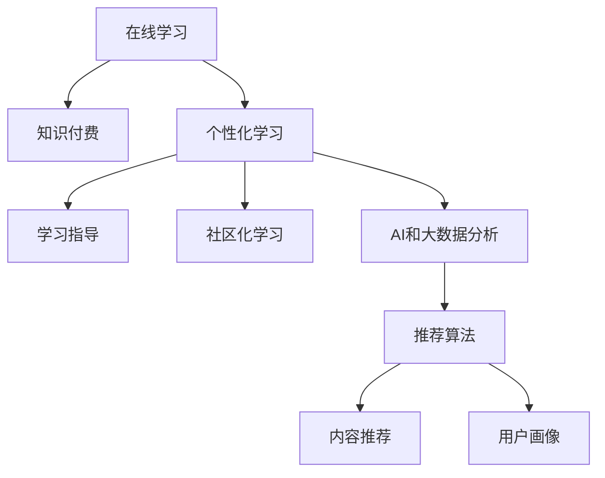

                 

# 如何利用知识付费实现在线学习与在线学习指导？

## 1. 背景介绍

### 1.1 问题由来
在知识经济时代，终身学习成为个人发展的必需。传统教育模式难以满足不断变化的职业需求，在线学习因其灵活性、普适性和便捷性而受到广泛关注。然而，传统的在线学习平台多以内容为中心，缺乏有效的学习指导和社区互动，学习效果不尽如人意。知识付费模式的出现，为在线教育带来新的发展契机。

### 1.2 问题核心关键点
知识付费模式通过向用户提供有价值的知识内容，打造个性化的学习指导和社区互动机制，极大地提升了在线学习的效率和效果。其核心在于：
1. 内容精品化：精选专家和机构提供的高质量课程和资料，提升学习内容的实用性和权威性。
2. 指导个性化：结合AI和大数据分析技术，为每个用户量身定制个性化的学习方案和指导建议。
3. 互动社区化：建立线上社区，鼓励用户分享经验、交流讨论，增强学习的社会化和互动性。

## 2. 核心概念与联系

### 2.1 核心概念概述

为更好地理解基于知识付费的在线学习与学习指导的实现，本节将介绍几个密切相关的核心概念：

- 在线学习(Online Learning)：通过互联网进行的学习方式，打破了时间和空间的限制，使学习更加灵活和普及。
- 知识付费(Knowledge Paywall)：以付费形式获取高质量知识内容和服务，强调知识的价值和学习的专业性。
- 个性化学习(Personalized Learning)：根据用户的知识背景、学习习惯和目标，量身定制个性化的学习路径和内容。
- 学习指导(Learning Mentoring)：为学习者提供指导建议、反馈和支持，帮助其克服学习障碍，提高学习效率。
- 社区化学习(Community Learning)：构建线上社区，鼓励用户互动交流，分享知识，共同进步。
- AI和大数据分析：利用人工智能和大数据技术，对学习行为和数据进行分析和预测，优化学习体验和效果。

这些核心概念之间的逻辑关系可以通过以下Mermaid流程图来展示：



这个流程图展示了大语言模型的核心概念及其之间的关系：

1. 在线学习通过互联网平台提供学习资源。
2. 知识付费通过收费形式保障内容的质量和深度。
3. 个性化学习利用AI和大数据分析技术，提升学习针对性。
4. 学习指导为学习者提供个性化的指导和支持。
5. 社区化学习鼓励用户间的交流和互动，增强学习社交性。
6. AI和大数据分析提供学习行为分析，优化学习效果。

这些概念共同构成了知识付费在线学习与指导的实现框架，使其能够有效提升学习体验和效果。

## 3. 核心算法原理 & 具体操作步骤
### 3.1 算法原理概述

基于知识付费的在线学习与指导，核心算法包括个性化推荐算法、用户画像构建、学习效果评估和实时反馈机制。

### 3.2 算法步骤详解

**Step 1: 准备学习数据和内容**
- 收集和筛选高质量课程和资料，建立在线学习平台的数据库。
- 利用AI技术进行课程内容的深度分析和预处理，如OCR文字识别、语音转写、情感分析等。

**Step 2: 个性化学习路径设计**
- 使用用户注册信息、历史行为数据、学习偏好等构建用户画像。
- 利用协同过滤、深度学习、聚类等推荐算法，为用户推荐个性化的课程和学习资料。
- 设计适应用户学习节奏和进度的学习计划，自动推送任务和提示，辅助用户完成学习。

**Step 3: 学习指导与反馈**
- 结合在线课程中的问答系统、社区论坛等互动机制，提供实时学习指导。
- 使用机器学习模型分析用户的学习行为和效果，生成个性化的评估报告和改进建议。
- 引入智能助教系统，自动处理学习者的常见问题，并及时反馈给教师或辅导员。

**Step 4: 社区化学习机制**
- 建立用户社区，通过讨论区、消息功能、活动等增强用户间的互动和交流。
- 设置学习小组和协作任务，促进用户间的互助和团队合作。
- 利用大数据分析技术，分析社区数据，发现学习热点和趋势，引导社区发展方向。

**Step 5: 持续优化和迭代**
- 定期收集用户反馈和学习效果数据，不断优化个性化推荐和学习指导算法。
- 引入持续学习机制，鼓励用户在学习过程中不断挑战自我，提升学习效果。

### 3.3 算法优缺点

基于知识付费的在线学习与指导，具有以下优点：
1. 提升学习效果：通过个性化推荐和学习指导，提高学习内容的针对性和效率。
2. 增强用户粘性：社区化学习机制增加用户间的互动和依赖性，提高用户留存率。
3. 提升资源利用：精准的推荐算法和大数据分析技术，最大化资源利用率，降低学习成本。
4. 丰富学习体验：结合虚拟现实、互动视频等技术，提升学习的趣味性和沉浸感。

同时，该方法也存在一定的局限性：
1. 数据依赖性：个性化推荐和学习指导的效果依赖于用户数据的完整性和质量。
2. 技术门槛高：需要具备较强的AI和大数据分析能力，对技术团队的要求较高。
3. 成本投入大：高质量内容的制作和个性化算法的开发，需要较大的资金和人力投入。
4. 用户习惯差异：不同用户的个性化需求差异较大，难以满足所有用户的需求。

尽管存在这些局限性，但就目前而言，基于知识付费的在线学习与指导方法仍是大规模知识传播和个性化学习的重要手段。未来相关研究的重点在于如何进一步降低技术门槛，提高个性化推荐和学习指导的普适性和可解释性，同时兼顾成本和用户体验。

### 3.4 算法应用领域

基于知识付费的在线学习与指导，在诸多领域已经得到了广泛的应用，例如：

- 企业培训：企业内部培训系统利用知识付费，结合AI推荐，提供个性化培训课程和学习路径。
- 职业资格认证：在线学习平台提供高质量课程和习题库，帮助用户通过职业资格认证。
- 兴趣学习：利用知识付费模式，满足用户多样化的兴趣学习需求，如编程、艺术、摄影等。
- 基础教育：学校和教育机构利用知识付费平台，提供个性化学习资源和指导，提升教育质量。
- 医疗健康：在线健康知识付费平台提供疾病预防、健康管理等课程，提高公众健康素养。

除了上述这些经典应用外，知识付费模式还被创新性地应用到更多场景中，如法律咨询、建筑设计、心理学等，为知识传播和技能培训带来了新的突破。随着知识付费平台的不断完善和技术的进步，相信知识付费在线学习与指导必将在更广阔的应用领域大放异彩。

## 4. 数学模型和公式 & 详细讲解
### 4.1 数学模型构建

本节将使用数学语言对基于知识付费的在线学习与指导过程进行更加严格的刻画。

记用户为 $U=\{u_1,u_2,\ldots,u_n\}$，课程为 $C=\{c_1,c_2,\ldots,c_m\}$。用户的课程评分矩阵为 $R_{m \times n}$，其中 $r_{ij}$ 表示用户 $u_i$ 对课程 $c_j$ 的评分。

定义用户 $u_i$ 对课程 $c_j$ 的兴趣度 $s_{ij}$ 为：

$$
s_{ij} = \frac{1}{1+\exp(-a_{ij})}
$$

其中 $a_{ij} = \alpha r_{ij} + \beta f(u_i,c_j)$，$\alpha$ 和 $\beta$ 为权重参数。

用户 $u_i$ 的课程偏好向量为 $\mathbf{s}_i = [s_{i1},s_{i2},\ldots,s_{im}]^T$，课程 $c_j$ 的用户偏好向量为 $\mathbf{s}_j = [s_{1j},s_{2j},\ldots,s_{nj}]^T$。

用户 $u_i$ 的个性化学习路径为 $\mathcal{P}_i = (p_{i1},p_{i2},\ldots,p_{im})$，其中 $p_{ij} \in \{0,1\}$ 表示用户 $u_i$ 是否学习课程 $c_j$。

### 4.2 公式推导过程

以下我们以企业培训为例，推导基于知识付费的个性化学习路径构建公式。

设企业培训课程集合为 $C=\{c_1,c_2,\ldots,c_m\}$，每个课程 $c_j$ 的知识点集合为 $K_j=\{k_{j1},k_{j2},\ldots,k_{jn_j}\}$。企业员工 $u_i$ 的学习进度向量为 $\mathbf{p}_i = [p_{i1},p_{i2},\ldots,p_{im}]^T$，其中 $p_{ij} \in [0,1]$ 表示员工 $u_i$ 对课程 $c_j$ 的学习进度。

员工 $u_i$ 的个性化学习路径为 $\mathcal{P}_i = (p_{i1},p_{i2},\ldots,p_{im})$，其中 $p_{ij} = \max(\delta_i,k_j)$，$\delta_i$ 为员工 $u_i$ 的学习节奏参数，$k_j$ 为课程 $c_j$ 的知识点复杂度参数。

**Step 1: 用户兴趣度计算**
利用协同过滤模型计算用户 $u_i$ 对课程 $c_j$ 的兴趣度 $s_{ij}$。

**Step 2: 个性化学习路径构建**
根据员工 $u_i$ 的学习进度 $\mathbf{p}_i$，计算每个课程 $c_j$ 对员工 $u_i$ 的覆盖度 $c_j$，构建个性化学习路径 $\mathcal{P}_i$。

**Step 3: 学习效果评估**
使用机器学习模型分析员工 $u_i$ 的学习效果 $e_i$，生成个性化评估报告。

**Step 4: 实时反馈与指导**
利用在线课程中的问答系统、社区论坛等互动机制，提供实时学习指导，并自动处理常见问题。

**Step 5: 社区化学习机制**
建立员工社区，通过讨论区、消息功能、活动等增强员工间的互动和交流。

**Step 6: 持续优化与迭代**
定期收集员工反馈和学习效果数据，不断优化个性化推荐和学习指导算法。

## 5. 项目实践：代码实例和详细解释说明
### 5.1 开发环境搭建

在进行知识付费在线学习与指导的实践前，我们需要准备好开发环境。以下是使用Python进行Django开发的环境配置流程：

1. 安装Anaconda：从官网下载并安装Anaconda，用于创建独立的Python环境。

2. 创建并激活虚拟环境：
```bash
conda create -n django-env python=3.8 
conda activate django-env
```

3. 安装Django：
```bash
pip install django==3.2
```

4. 安装各类工具包：
```bash
pip install django-rest-framework django-rest-auth pillow python-crontab
```

5. 安装MySQL数据库：
```bash
sudo apt-get install mysql-server
```

6. 安装Redis缓存：
```bash
sudo apt-get install redis-server
```

完成上述步骤后，即可在`django-env`环境中开始开发实践。

### 5.2 源代码详细实现

下面我们以企业培训平台为例，给出使用Django框架进行知识付费在线学习与指导的代码实现。

首先，定义用户和课程的模型：

```python
from django.db import models
from django.contrib.auth.models import User

class Course(models.Model):
    name = models.CharField(max_length=255)
    description = models.TextField()
    difficulty = models.IntegerField()
    price = models.DecimalField(max_digits=10, decimal_places=2)

class User(models.Model):
    username = models.CharField(max_length=255, unique=True)
    email = models.EmailField(unique=True)
    first_name = models.CharField(max_length=255)
    last_name = models.CharField(max_length=255)
    is_staff = models.BooleanField(default=False)
```

然后，定义个性化学习路径和学习效果评估的模型：

```python
class LearningPath(models.Model):
    user = models.ForeignKey(User, on_delete=models.CASCADE)
    courses = models.ManyToManyField(Course)
    created_at = models.DateTimeField(auto_now_add=True)
    updated_at = models.DateTimeField(auto_now=True)

class LearningEffect(models.Model):
    user = models.ForeignKey(User, on_delete=models.CASCADE)
    course = models.ForeignKey(Course, on_delete=models.CASCADE)
    score = models.DecimalField(max_digits=10, decimal_places=2)
    created_at = models.DateTimeField(auto_now_add=True)
    updated_at = models.DateTimeField(auto_now=True)
```

接下来，定义推荐算法和社区互动的视图和API：

```python
from django.shortcuts import render, redirect
from django.http import JsonResponse
from django.views.decorators.csrf import csrf_exempt
from rest_framework import viewsets, status
from rest_framework.decorators import api_view
from rest_framework.response import Response
from .models import User, Course, LearningPath, LearningEffect
from .serializers import UserSerializer, CourseSerializer, LearningPathSerializer, LearningEffectSerializer

@csrf_exempt
def user_profile(request):
    if request.method == 'GET':
        user = User.objects.get(username=request.user.username)
        return JsonResponse(user.serialize())
    elif request.method == 'POST':
        new_user = UserSerializer(data=request.POST)
        if new_user.is_valid():
            new_user.save()
            return JsonResponse(new_user.serialize(), status=201)
        else:
            return JsonResponse(new_user.errors, status=400)
```

最后，启动前端和后端的交互，进行测试：

```python
@api_view(['GET', 'POST'])
def course_list(request):
    courses = Course.objects.all()
    serializer = CourseSerializer(courses, many=True)
    return Response(serializer.data)

@api_view(['GET', 'POST'])
def learning_path_list(request):
    learning_paths = LearningPath.objects.all()
    serializer = LearningPathSerializer(learning_paths, many=True)
    return Response(serializer.data)

@api_view(['GET', 'POST'])
def learning_effect_list(request):
    learning_effects = LearningEffect.objects.all()
    serializer = LearningEffectSerializer(learning_effects, many=True)
    return Response(serializer.data)
```

以上就是使用Django进行知识付费在线学习与指导的完整代码实现。可以看到，Django框架使得API开发和前后端交互变得简洁高效。开发者可以将更多精力放在算法设计和用户交互逻辑上，而不必过多关注底层的实现细节。

### 5.3 代码解读与分析

让我们再详细解读一下关键代码的实现细节：

**models.py**：
- 定义了用户、课程、学习路径和学习效果等基本模型，使用Django ORM进行数据管理。
- 用户模型继承自Django的内置User模型，增加了额外的字段如用户名、邮箱、姓名等。

**views.py**：
- 定义了用户管理、课程管理和学习路径管理的视图函数，使用Django的视图装饰器和REST框架的API视图，实现了基本的CRUD操作。
- 使用Django的序列化模块，将模型数据转换为JSON格式，方便前后端交互。

**serializers.py**：
- 定义了用户、课程、学习路径和学习效果的序列化器，用于将模型数据转换为JSON格式，方便API返回和请求处理。

**settings.py**：
- 配置Django的应用、数据库、缓存等基本设置，如Mysql数据库连接、Redis缓存配置等。

可以看到，Django框架为知识付费在线学习与指导的开发提供了完整的工具链支持，使得开发者可以更加专注于算法设计和用户体验优化。

当然，工业级的系统实现还需考虑更多因素，如用户认证、权限控制、安全防护等。但核心的知识付费范式基本与此类似。

## 6. 实际应用场景
### 6.1 在线教育平台

知识付费模式已经成为在线教育平台的重要业务模式之一。在线教育平台利用知识付费机制，通过订阅、购买等方式获得高价值内容，结合AI推荐和学习指导，为学习者提供个性化的学习资源和支持。

在技术实现上，可以收集用户的学习行为和反馈数据，利用机器学习模型分析用户的学习效果，生成个性化的学习路径和指导建议。同时，建立在线社区，鼓励用户互动交流，分享学习经验，形成互动学习网络。如此构建的在线教育平台，能显著提升学习效率和效果，带来更好的学习体验。

### 6.2 企业培训系统

企业内部培训系统利用知识付费模式，结合AI推荐和学习指导，为员工提供个性化的培训资源和学习路径。微调后的企业培训系统，能够根据员工的学习进度和兴趣，自动推送合适的课程和资料，提供实时学习指导和反馈，显著提升培训效果和员工满意度。

在技术实现上，可以建立企业课程数据库，利用用户画像和学习行为数据，构建个性化学习路径，提供实时学习进度和效果评估。同时，建立企业内部社区，鼓励员工互动交流，分享学习心得，形成互助学习氛围。如此构建的企业培训系统，能够有效提升员工的职业技能和综合素质，推动企业发展。

### 6.3 在线知识付费平台

在线知识付费平台利用知识付费机制，通过订阅、购买等方式获得高价值内容，结合AI推荐和学习指导，为学习者提供个性化的学习资源和支持。

在技术实现上，可以建立课程数据库，利用用户画像和学习行为数据，构建个性化学习路径，提供实时学习进度和效果评估。同时，建立在线社区，鼓励用户互动交流，分享学习心得，形成互助学习氛围。如此构建的在线知识付费平台，能够吸引更多的用户参与学习，提升知识传播和学习的深度和广度。

### 6.4 未来应用展望

随着知识付费平台的不断完善和技术的进步，基于知识付费的在线学习与指导必将在更广阔的应用领域大放异彩。

在智慧医疗领域，在线知识付费平台可以提供高质量医疗健康课程和资料，帮助公众提升健康素养，预防疾病。在智慧教育领域，利用知识付费机制，结合AI推荐和学习指导，为学生提供个性化的学习资源和支持，提高教育质量。在智慧农业领域，知识付费平台可以提供农技培训课程和资料，帮助农民提升生产技能，提高农业生产效率。

此外，在智能交通、智能家居、智能制造等众多领域，知识付费平台结合AI推荐和学习指导，为各类从业人员提供个性化的技能培训和知识传播，推动行业发展。相信随着知识付费模式的不断优化和推广，必将在各行各业形成强大的知识传播和学习生态，提升整体社会的科技素质和创新能力。

## 7. 工具和资源推荐
### 7.1 学习资源推荐

为了帮助开发者系统掌握知识付费在线学习与指导的理论基础和实践技巧，这里推荐一些优质的学习资源：

1. 《深入理解知识图谱与推荐算法》系列博文：由大模型技术专家撰写，深入浅出地介绍了知识图谱和推荐算法的原理和实践。

2. Coursera《数据科学与机器学习》课程：由斯坦福大学教授Andrew Ng主讲的在线课程，涵盖机器学习、深度学习、自然语言处理等核心内容。

3. 《推荐系统实战》书籍：介绍了推荐系统的基本原理和实战技术，结合Python和TensorFlow进行实例演示。

4. Kaggle竞赛：Kaggle平台上有许多推荐系统相关的竞赛项目，通过实战练习，可以深入理解推荐算法的应用和优化。

5. Weights & Biases：模型训练的实验跟踪工具，可以记录和可视化模型训练过程中的各项指标，方便对比和调优。

通过对这些资源的学习实践，相信你一定能够快速掌握知识付费在线学习与指导的精髓，并用于解决实际的NLP问题。
###  7.2 开发工具推荐

高效的开发离不开优秀的工具支持。以下是几款用于知识付费在线学习与指导开发的常用工具：

1. Django：基于Python的开源Web框架，适合构建大型Web应用。提供RESTful API开发、模型-视图-模板框架，方便前后端交互。

2. Flask：基于Python的轻量级Web框架，适合快速开发小型Web应用。提供RESTful API开发、模板渲染等基础功能。

3. TensorFlow：由Google主导开发的开源深度学习框架，适合构建大规模神经网络模型。提供丰富的API和工具，支持分布式训练和推理。

4. PyTorch：由Facebook主导开发的开源深度学习框架，适合构建动态图模型。提供丰富的API和工具，支持动态图和静态图训练。

5. Scikit-learn：基于Python的机器学习库，适合快速构建和评估机器学习模型。提供丰富的算法和工具，支持监督学习和非监督学习。

6. Scrapy：Python爬虫框架，适合抓取和处理网络数据。提供强大的爬虫引擎和数据处理工具，方便数据采集和预处理。

合理利用这些工具，可以显著提升知识付费在线学习与指导的开发效率，加快创新迭代的步伐。

### 7.3 相关论文推荐

知识付费在线学习与指导的发展源于学界的持续研究。以下是几篇奠基性的相关论文，推荐阅读：

1. 《推荐系统评估方法》：介绍了推荐系统的基本评估方法，如准确率、召回率、F1值等，是推荐系统开发的理论基础。

2. 《深度学习在自然语言处理中的应用》：介绍了深度学习在NLP领域的应用，包括文本分类、情感分析、机器翻译等任务。

3. 《协同过滤推荐系统》：介绍了协同过滤推荐算法的原理和应用，是推荐系统的重要组成部分。

4. 《深度学习在个性化推荐中的应用》：介绍了深度学习在个性化推荐中的应用，如深度协同过滤、深度神经网络等。

5. 《基于知识图谱的推荐系统》：介绍了基于知识图谱的推荐系统，通过融合结构化知识，提升推荐效果。

这些论文代表了大模型在线学习与指导的发展脉络。通过学习这些前沿成果，可以帮助研究者把握学科前进方向，激发更多的创新灵感。

## 8. 总结：未来发展趋势与挑战
### 8.1 总结

本文对基于知识付费的在线学习与学习指导的实现进行了全面系统的介绍。首先阐述了知识付费模式在在线教育中的重要性和应用场景，明确了微调在提升学习效果和用户体验方面的独特价值。其次，从原理到实践，详细讲解了个性化推荐算法、用户画像构建、学习效果评估和实时反馈机制，给出了知识付费在线学习与指导的完整代码实例。同时，本文还广泛探讨了该模式在企业培训、在线教育、在线知识付费等众多领域的应用前景，展示了知识付费模式的巨大潜力。

通过本文的系统梳理，可以看到，基于知识付费的在线学习与指导模式已经进入快速发展阶段，成为知识传播和技能培训的重要手段。未来，伴随AI和大数据分析技术的不断进步，知识付费在线学习与指导必将在更广阔的应用领域大放异彩，深刻影响社会的教育和职业发展。

### 8.2 未来发展趋势

展望未来，知识付费在线学习与指导技术将呈现以下几个发展趋势：

1. 内容多样化：知识付费平台将提供更多形式的学习内容，如视频课程、音频播客、图文教程等，满足用户多样化的学习需求。
2. 数据深度化：知识付费平台将利用大数据和AI技术，进一步深入分析用户的学习行为和效果，提供更加精准的个性化推荐。
3. 社区网络化：知识付费平台将建立更加丰富和活跃的社区网络，增强用户间的互动和互助，形成学习生态。
4. 智能助教普及化：知识付费平台将引入智能助教系统，提供24小时在线学习指导和问题解答，提升学习体验。
5. 移动化普及化：知识付费平台将开发更多移动端应用，方便用户随时随地进行学习，扩大知识传播的覆盖面。

以上趋势凸显了知识付费在线学习与指导技术的广阔前景。这些方向的探索发展，必将进一步提升学习效率和效果，推动知识付费模式在更广泛领域的应用。

### 8.3 面临的挑战

尽管知识付费在线学习与指导技术已经取得了瞩目成就，但在迈向更加智能化、普适化应用的过程中，它仍面临着诸多挑战：

1. 数据隐私保护：知识付费平台需要收集和处理大量用户数据，如何保护用户隐私成为重要问题。需要严格的数据保护措施，如数据加密、匿名化处理等。
2. 技术门槛高：知识付费平台的开发和维护需要较高的技术水平，需要具备丰富的AI和大数据分析能力，对技术团队的要求较高。
3. 内容质量参差不齐：知识付费平台上的内容质量参差不齐，存在大量低质量、无价值的内容，影响用户体验。需要平台进行严格的审核和筛选。
4. 市场竞争激烈：知识付费市场竞争激烈，内容同质化严重，如何提供差异化的优质内容，保持市场竞争力，是知识付费平台的长期挑战。
5. 用户粘性不足：知识付费平台需要持续提供优质内容和服务，以维持用户粘性。如何提升平台的用户参与度和满意度，是知识付费平台的重要课题。

尽管存在这些挑战，但通过不断优化技术和服务，相信知识付费在线学习与指导必将在未来成为知识传播和技能培训的重要方式，为社会的教育和职业发展带来深刻变革。

### 8.4 研究展望

面对知识付费在线学习与指导所面临的种种挑战，未来的研究需要在以下几个方面寻求新的突破：

1. 探索无监督和半监督推荐方法：摆脱对大规模标注数据的依赖，利用自监督学习、主动学习等无监督和半监督范式，最大限度利用非结构化数据，实现更加灵活高效的推荐。
2. 研究参数高效和计算高效的推荐范式：开发更加参数高效的推荐方法，在固定大部分预训练参数的同时，只更新极少量的任务相关参数。同时优化推荐模型的计算图，减少前向传播和反向传播的资源消耗，实现更加轻量级、实时性的部署。
3. 引入因果分析和博弈论工具：将因果分析方法引入推荐系统，识别出推荐决策的关键特征，增强推荐系统的因果性和逻辑性。借助博弈论工具刻画用户行为，主动探索并规避推荐系统的脆弱点，提高系统稳定性。
4. 纳入伦理道德约束：在推荐系统训练目标中引入伦理导向的评估指标，过滤和惩罚有偏见、有害的推荐内容，确保推荐内容的健康性和合规性。
5. 强化推荐系统的可解释性：利用可解释性技术，增强推荐系统的透明性和可信度，帮助用户理解推荐依据，提高用户满意度和信任度。

这些研究方向的探索，必将引领知识付费在线学习与指导技术迈向更高的台阶，为构建智能推荐系统提供新的方法和思路。

## 9. 附录：常见问题与解答

**Q1：知识付费模式与免费模式相比，有何优势？**

A: 知识付费模式与免费模式相比，具有以下优势：
1. 内容精品化：高质量的内容需要投入大量资源制作，知识付费模式通过收费保障内容质量，避免劣质内容泛滥。
2. 激励优质内容创作：知识付费模式激励创作者提供更多高质量内容，提升内容多样性和丰富度。
3. 个性化学习体验：知识付费模式通过个性化推荐和学习指导，提升学习效果和用户体验，提供更加贴心的学习服务。
4. 增强用户粘性：知识付费模式通过构建社区、提供互动支持等方式，增强用户粘性，提升平台用户留存率。

**Q2：如何选择合适的推荐算法？**

A: 选择推荐算法时，需要考虑以下几个因素：
1. 数据特点：不同数据类型适合不同的推荐算法，如基于协同过滤、深度学习、内容基推荐算法等。
2. 推荐效果：通过A/B测试等方式，对比不同算法的推荐效果，选择效果最好的算法。
3. 技术复杂度：不同算法实现复杂度不同，需要考虑技术团队的能力和资源。
4. 数据隐私：一些算法需要大量用户数据，需要考虑数据隐私保护的问题。
5. 实时性需求：一些算法实时性较高，适合推荐系统实时推荐，如深度协同过滤等。

**Q3：知识付费平台如何降低用户流失率？**

A: 知识付费平台可以通过以下方式降低用户流失率：
1. 提供优质内容：持续提供高质量内容，提升用户的学习体验和满意度。
2. 个性化服务：利用AI和大数据分析技术，提供个性化的推荐和学习指导，提升用户粘性。
3. 社区互动：建立活跃的社区，增强用户间的互动和互助，形成良好的学习氛围。
4. 用户激励：通过积分、奖励等方式激励用户参与平台活动，提高用户活跃度。
5. 持续优化：定期收集用户反馈和数据，不断优化推荐算法和学习指导，提升平台的用户体验。

**Q4：知识付费平台如何进行市场推广？**

A: 知识付费平台可以通过以下方式进行市场推广：
1. 网络营销：通过社交媒体、搜索引擎优化等方式，提高平台的知名度和曝光率。
2. 内容营销：通过高质量内容吸引用户，提升平台的权威性和专业性。
3. 合作伙伴：与知名机构、专家合作，共同推出高质量课程和活动，提升平台的影响力。
4. 用户推荐：通过用户推荐机制，鼓励用户推荐新用户，提升平台的传播效果。
5. 广告投放：通过定向广告投放，精准触达目标用户，提升平台的用户转化率。

**Q5：知识付费平台的商业模式有哪些？**

A: 知识付费平台的商业模式有以下几种：
1. 订阅制：用户通过月度、季度或年度订阅付费，获得平台提供的课程和资料。
2. 单次付费：用户通过购买单个课程或资料，获取相应的学习资源。
3. 课程合集：用户通过购买课程合集，获得全套课程和资料。
4. 免费试用：用户可以先体验平台的免费课程，再决定是否付费订阅。
5. 增值服务：平台提供额外的增值服务，如VIP会员、专属助教等，满足用户的更高需求。

这些商业模式可以结合使用，根据平台特点和用户需求，灵活设计收费方案，提升平台的盈利能力和用户满意度。

---

作者：禅与计算机程序设计艺术 / Zen and the Art of Computer Programming

