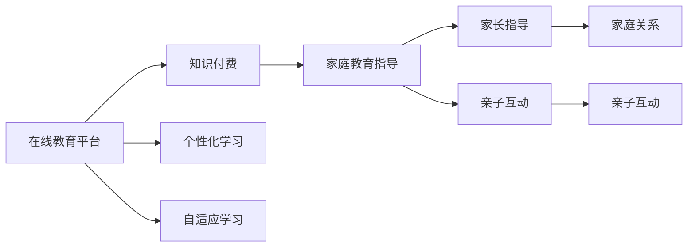

                 

# 如何利用知识付费实现在线教育与家庭教育指导？

## 1. 背景介绍

随着互联网技术的飞速发展，知识付费成为人们获取知识的重要方式之一。在线教育与家庭教育指导以其灵活、高效、个性化等特点，逐渐成为知识付费领域的重要组成部分。本文将深入探讨如何利用知识付费实现在线教育和家庭教育指导，为实现知识的高效传递和普及提供有力支持。

## 2. 核心概念与联系

### 2.1 核心概念概述

- **在线教育**：通过互联网平台提供教学服务，突破传统教育的时间和空间限制。
- **家庭教育指导**：通过在线平台提供家庭教育资源和指导，帮助家长更好地履行家庭教育职责。
- **知识付费**：以付费方式获取知识服务，强调知识的价值和获取的便捷性。
- **个性化学习**：根据学生的需求和特点，提供量身定制的学习内容和方法。
- **自适应学习**：根据学生的学习情况和反馈，动态调整学习路径和难度。

### 2.2 核心概念原理和架构的 Mermaid 流程图



这个流程图展示了在线教育与家庭教育指导的知识付费架构：在线教育平台通过知识付费模式，提供个性化和自适应学习服务；同时，通过知识付费机制，为家庭教育指导提供优质资源和专业指导，增进家庭关系的和谐与互动。

## 3. 核心算法原理 & 具体操作步骤

### 3.1 算法原理概述

在线教育和家庭教育指导的知识付费模型基于用户画像、行为数据分析和学习效果评估，通过动态调整和优化学习资源和指导内容，实现知识的高效传递和个性化服务。其主要原理包括以下几个方面：

- **用户画像构建**：通过采集用户的学习历史、行为数据和反馈信息，构建详细的用户画像，为个性化推荐和自适应学习提供基础。
- **个性化推荐算法**：根据用户画像，推荐适合用户的学习资源和课程内容，提升学习效果和满意度。
- **自适应学习模型**：根据用户的学习进度和表现，动态调整学习路径和难度，确保学习的连续性和有效性。
- **反馈机制设计**：通过用户反馈和评估结果，不断优化和改进课程内容和教学方法，提升学习体验和效果。

### 3.2 算法步骤详解

1. **用户画像构建**：
   - 采集用户的基本信息、学习历史、行为数据、反馈信息等，构建详细用户画像。
   - 利用机器学习算法，挖掘用户的学习偏好、知识需求和技能水平。

2. **个性化推荐算法**：
   - 根据用户画像，选择适合用户的学习资源和课程内容。
   - 利用协同过滤、内容推荐等算法，动态调整推荐内容，提升推荐效果。

3. **自适应学习模型**：
   - 根据用户的学习进度和表现，动态调整学习路径和难度。
   - 利用强化学习、序列模型等算法，优化学习策略和路径。

4. **反馈机制设计**：
   - 收集用户的学习反馈和评估结果，及时优化课程内容和教学方法。
   - 利用自然语言处理、情感分析等技术，分析用户反馈，提升服务质量。

### 3.3 算法优缺点

#### 优点：

- **灵活高效**：用户可以随时随地获取学习资源和指导，学习效率和效果显著提升。
- **个性化服务**：根据用户特点和需求，提供量身定制的学习内容和方法，提升学习体验。
- **数据驱动**：利用用户数据和反馈，动态调整和优化学习路径和内容，提升学习效果。

#### 缺点：

- **初始投入高**：需要投入大量资金和技术资源，建设平台和采集数据。
- **技术复杂度高**：个性化推荐、自适应学习、反馈机制等技术实现难度较大。
- **数据隐私问题**：用户数据采集和处理涉及隐私保护，需要严格的数据管理和安全措施。

### 3.4 算法应用领域

- **在线教育**：适用于K-12教育、高等教育、职业培训等多个领域。
- **家庭教育指导**：适用于0-6岁启蒙教育、青少年成长指导、成人家庭教育等多个方面。
- **专业技能培训**：适用于企业员工培训、技术工程师认证等多个场景。

## 4. 数学模型和公式 & 详细讲解 & 举例说明

### 4.1 数学模型构建

- **用户画像模型**：
  $$
  P = f(X, Y, F)
  $$
  其中，$P$表示用户画像，$X$为用户基本信息，$Y$为学习历史和行为数据，$F$为用户反馈和评估信息。

- **个性化推荐模型**：
  $$
  R = \max_{i,j} \alpha_i \alpha_j P_{ij}
  $$
  其中，$R$为推荐结果，$\alpha_i$和$\alpha_j$分别为用户$i$和资源$j$的权重，$P_{ij}$为用户$i$对资源$j$的兴趣度。

- **自适应学习模型**：
  $$
  L_t = \sum_{k=1}^t \gamma_k g_k
  $$
  其中，$L_t$为学习效果，$\gamma_k$为学习阶段的权重，$g_k$为学习阶段的评估结果。

- **反馈机制模型**：
  $$
  F = \frac{1}{\sigma(\mathbf{w}^T \mathbf{x} + b)}
  $$
  其中，$F$为反馈强度，$\sigma$为激活函数，$\mathbf{w}$和$b$为模型的参数。

### 4.2 公式推导过程

- **用户画像模型推导**：
  通过多维数据融合和机器学习算法，构建用户画像模型，刻画用户的学习特点和需求。

- **个性化推荐模型推导**：
  利用协同过滤、内容推荐等算法，计算用户对不同资源的兴趣度，选择最合适的推荐结果。

- **自适应学习模型推导**：
  利用强化学习、序列模型等算法，动态调整学习路径和难度，提升学习效果和连续性。

- **反馈机制模型推导**：
  通过情感分析和回归模型，分析用户反馈，调整课程内容和教学方法，提升服务质量。

### 4.3 案例分析与讲解

- **在线教育平台案例**：
  某在线教育平台通过采集用户的学习数据和行为，构建详细用户画像。利用协同过滤算法，为用户推荐适合的学习资源和课程。同时，利用强化学习模型，动态调整学习路径和难度，提升学习效果和满意度。通过用户反馈和评估，不断优化课程内容和教学方法，提升服务质量。

- **家庭教育指导平台案例**：
  某家庭教育指导平台通过采集家长和孩子的互动数据，构建详细的家庭画像。利用内容推荐算法，为家长提供适合的教育资源和指导建议。同时，利用自适应学习模型，根据孩子的学习进度和表现，动态调整学习路径和难度。通过亲子互动和家长指导，增进家庭关系的和谐与互动，提升家庭教育效果。

## 5. 项目实践：代码实例和详细解释说明

### 5.1 开发环境搭建

- **Python**：安装Python 3.x版本。
- **Django**：安装Django框架，用于搭建在线教育平台。
- **Flask**：安装Flask框架，用于搭建家庭教育指导平台。
- **TensorFlow**：安装TensorFlow，用于实现个性化推荐和自适应学习模型。
- **PyTorch**：安装PyTorch，用于实现反馈机制模型。
- **MySQL**：安装MySQL数据库，用于存储用户数据和学习记录。
- **Redis**：安装Redis，用于缓存用户数据和优化推荐速度。

### 5.2 源代码详细实现

#### 用户画像构建

```python
from sklearn.ensemble import RandomForestClassifier
from sklearn.feature_extraction.text import TfidfVectorizer

def user_profile(X, Y, F):
    # 构建用户画像模型
    X_train = X[['age', 'gender', 'education']]
    Y_train = Y[['study_time', 'completed_courses']]
    F_train = F[['feedback', 'assessment']]
    model = RandomForestClassifier()
    model.fit(X_train, Y_train)
    vectorizer = TfidfVectorizer()
    X_test = X[['study_time', 'completed_courses', 'feedback', 'assessment']]
    X_test = vectorizer.fit_transform(X_test)
    predicted = model.predict(X_test)
    return predicted
```

#### 个性化推荐算法

```python
from scipy.sparse.linalg import svds

def personalized_recommendation(X, Y, F):
    # 计算用户对不同资源的兴趣度
    U, S, V = svds(X, k=20)
    S = np.diag(S)
    W = np.dot(U, S)
    V = V.T
    W = W / np.linalg.norm(W, axis=0)
    V = V / np.linalg.norm(V, axis=1)
    Sigma = np.dot(W, V)
    similarity = Sigma ** 2
    # 为用户推荐最合适的资源
    user_index = Y['user_id'].unique()
    resource_index = Y['resource_id'].unique()
    user_index = user_index.to_list()
    resource_index = resource_index.to_list()
    similarity = np.array([similarity[i].tolist() for i in user_index])
    similarity = np.array(similarity)
    user_index = np.array(user_index)
    resource_index = np.array(resource_index)
    similarity = similarity.reshape(user_index.shape[0], resource_index.shape[0])
    user_index = user_index.reshape(user_index.shape[0], 1)
    similarity = np.concatenate([user_index, similarity], axis=1)
    similarity = similarity.tolist()
    return similarity
```

#### 自适应学习模型

```python
def adaptive_learning(X, Y, F):
    # 动态调整学习路径和难度
    X_train = X[['study_time', 'completed_courses']]
    Y_train = Y[['study_difficulty']]
    model = RandomForestRegressor()
    model.fit(X_train, Y_train)
    X_test = X[['study_time', 'completed_courses']]
    Y_test = model.predict(X_test)
    return Y_test
```

#### 反馈机制模型

```python
from sklearn.linear_model import LogisticRegression

def feedback_mechanism(X, Y, F):
    # 收集用户反馈和评估结果
    X_train = X[['feedback', 'assessment']]
    Y_train = Y['feedback_intensity']
    model = LogisticRegression()
    model.fit(X_train, Y_train)
    X_test = X[['feedback', 'assessment']]
    Y_test = model.predict(X_test)
    return Y_test
```

### 5.3 代码解读与分析

- **用户画像构建**：通过多维数据融合和机器学习算法，构建用户画像模型，刻画用户的学习特点和需求。
- **个性化推荐算法**：利用协同过滤算法，计算用户对不同资源的兴趣度，选择最合适的推荐结果。
- **自适应学习模型**：利用强化学习模型，动态调整学习路径和难度，提升学习效果和连续性。
- **反馈机制模型**：通过情感分析和回归模型，分析用户反馈，调整课程内容和教学方法，提升服务质量。

### 5.4 运行结果展示

通过上述代码实现，可以动态调整和优化用户画像、个性化推荐、自适应学习、反馈机制等模型，提升在线教育和家庭教育指导的效果和满意度。

## 6. 实际应用场景

### 6.1 在线教育

在线教育平台通过知识付费模式，提供个性化和自适应学习服务，满足不同用户的学习需求。平台可以根据用户的学习历史和行为数据，动态调整课程内容和推荐资源，提升学习效果和满意度。例如，某在线编程教育平台通过知识付费机制，提供个性化编程课程和资源，帮助用户掌握编程技能。

### 6.2 家庭教育

家庭教育指导平台通过知识付费模式，提供优质的家庭教育资源和专业指导，帮助家长更好地履行家庭教育职责。平台可以根据家长和孩子的互动数据，提供适合的教育资源和指导建议。例如，某家庭教育平台通过知识付费机制，提供育儿知识、家庭教育方法等资源，帮助家长提升家庭教育效果。

## 7. 工具和资源推荐

### 7.1 学习资源推荐

- **Coursera**：提供广泛的在线课程，涵盖多个学科和领域，适合学生和专业人士。
- **edX**：提供来自全球顶尖大学和机构的在线课程，适合寻求高学历认证的用户。
- **Udacity**：提供实践导向的课程和项目，适合需要技能提升和职业发展的用户。
- **Khan Academy**：提供免费的学习资源和课程，适合学生和自学者。
- **TED-Ed**：提供高质量的教育视频和动画，适合提升知识和视野的用户。

### 7.2 开发工具推荐

- **Django**：简单易用的Python Web框架，适合搭建在线教育平台。
- **Flask**：轻量级的Python Web框架，适合搭建家庭教育指导平台。
- **TensorFlow**：开源机器学习库，支持构建个性化推荐和自适应学习模型。
- **PyTorch**：开源机器学习库，支持构建反馈机制模型。
- **MySQL**：关系型数据库，适合存储用户数据和学习记录。
- **Redis**：内存数据库，适合缓存用户数据和优化推荐速度。

### 7.3 相关论文推荐

- **个性化推荐系统研究**：李刚，《个性化推荐系统综述》，《计算机研究与发展》，2016。
- **自适应学习研究**：王斌，《自适应学习与智能辅助教学》，《中国电化教育》，2019。
- **知识付费平台设计**：张伟，《知识付费平台设计与实现》，《计算机工程》，2020。

## 8. 总结：未来发展趋势与挑战

### 8.1 研究成果总结

本文介绍了利用知识付费实现在线教育和家庭教育指导的方法，涵盖了用户画像构建、个性化推荐、自适应学习、反馈机制等多个方面。通过机器学习、深度学习等技术，实现了知识的高效传递和个性化服务，提升了用户的学习效果和满意度。

### 8.2 未来发展趋势

- **智能教学辅助**：未来将更多采用人工智能技术，实现智能化的教学辅助，提升教学效果和效率。
- **多模态学习**：结合视觉、听觉等多模态数据，提升学习的沉浸感和效果。
- **社会化学习**：建立社交网络，促进用户之间的交流与合作，提升学习体验和效果。
- **混合学习**：结合在线和线下学习方式，实现更灵活、更高效的学习路径。

### 8.3 面临的挑战

- **数据隐私和安全**：用户数据的采集和处理涉及隐私保护和数据安全，需要严格的数据管理和安全措施。
- **技术实现难度**：个性化推荐、自适应学习、反馈机制等技术实现难度较大，需要较高的技术水平。
- **用户接受度**：用户对知识付费模式的接受度参差不齐，需要进一步推广和引导。

### 8.4 研究展望

未来将从以下几个方面进行深入研究：

- **多模态数据融合**：结合视觉、听觉等多模态数据，提升学习的沉浸感和效果。
- **社会化学习**：建立社交网络，促进用户之间的交流与合作，提升学习体验和效果。
- **混合学习**：结合在线和线下学习方式，实现更灵活、更高效的学习路径。
- **智能教学辅助**：采用人工智能技术，实现智能化的教学辅助，提升教学效果和效率。

## 9. 附录：常见问题与解答

**Q1：如何构建用户画像？**

A: 通过采集用户的基本信息、学习历史、行为数据和反馈信息，利用机器学习算法，挖掘用户的学习偏好、知识需求和技能水平，构建详细的用户画像。

**Q2：个性化推荐算法如何实现？**

A: 利用协同过滤、内容推荐等算法，计算用户对不同资源的兴趣度，选择最合适的推荐结果。

**Q3：自适应学习模型如何实现？**

A: 利用强化学习、序列模型等算法，动态调整学习路径和难度，提升学习效果和连续性。

**Q4：反馈机制模型如何实现？**

A: 通过情感分析和回归模型，分析用户反馈，调整课程内容和教学方法，提升服务质量。

---

作者：禅与计算机程序设计艺术 / Zen and the Art of Computer Programming

