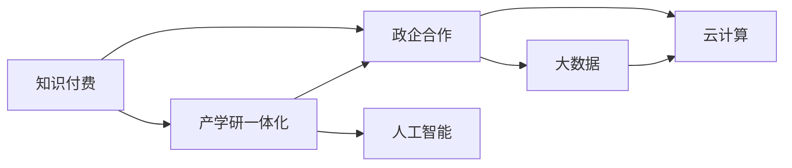

                 

## 1. 背景介绍

### 1.1 问题由来

在全球经济科技快速发展的大背景下，知识付费和政企合作、产学研一体化的概念被推到了风口浪尖。知识付费模式的出现，打破了以往知识和信息的不对称格局，让知识的价值得到了更广泛的认同和挖掘。而政企合作、产学研一体化的发展，则是推动科技与经济结合，促进创新驱动发展战略的重要方向。

政企合作是指政府与企业之间，通过资源共享、优势互补，共同推进项目落地，实现技术创新和产业发展的双赢局面。产学研一体化则是将高等院校、研究机构和企业的资源、技术、知识、设备等进行深度融合，构建完整的科技创新链条，推动科技成果转化。

然而，这些进程中存在诸多障碍，知识共享与流动不畅，跨界协同难度大，商业化落地困难等问题亟待解决。

### 1.2 问题核心关键点

政企合作与产学研一体化的关键在于知识、技术、资源的充分流动与深度整合，实现信息互通、利益共享、风险共担。在这一过程中，知识付费起到了承上启下的关键作用。

知识付费通过市场化的方式，将知识、技术、信息等资源进行有偿交换，提高了各方对资源的投入积极性，打通了合作的障碍，使得各方能够通过协作互利的方式进行深度合作。因此，知识付费在政企合作与产学研一体化中扮演着不可替代的角色。

## 2. 核心概念与联系

### 2.1 核心概念概述

为更好地理解知识付费在政企合作与产学研一体化中的应用，本节将介绍几个关键概念及其相互关联：

1. **知识付费（Knowledge Payment）**：通过市场机制，用户为获取有价值的信息、知识和技术而支付费用的行为。
2. **政企合作（Government-Enterprise Cooperation）**：政府和企业之间基于各自优势，通过合作解决资源、技术、市场等问题，实现双赢。
3. **产学研一体化（Industry-Academia-Research Integration）**：教育机构、科研机构和企业紧密合作，建立完整的科技创新体系，推动科技成果转化。
4. **大数据（Big Data）**：包含多种类型的结构化、半结构化和非结构化数据，提供丰富的数据资源支持。
5. **云计算（Cloud Computing）**：通过网络提供计算资源和存储服务，支持大规模数据的处理和分析。
6. **人工智能（Artificial Intelligence）**：通过机器学习和深度学习等技术，实现自主决策和智能化的应用。

这些概念通过以下Mermaid流程图展示了它们之间的联系：



这个流程图表明：知识付费通过其市场化机制，促进了政企合作与产学研一体化的融合；大数据和云计算为知识付费提供了数据和计算支持，同时也在政企合作与产学研一体化中起到了关键作用；人工智能技术的引入，进一步提升了各环节的智能化水平。

## 3. 核心算法原理 & 具体操作步骤
### 3.1 算法原理概述

知识付费在政企合作与产学研一体化中应用的核心算法原理在于通过市场机制，实现信息资源的高效流动与配置。其具体实现主要涉及以下几个步骤：

1. **需求匹配**：将企业的技术需求和高等院校、科研机构的科研能力进行匹配。
2. **成本计算**：基于提供的信息和技术资源的价值，计算知识付费的费用。
3. **合同签订**：企业和科研机构之间签订合作合同，明确双方的责任和权利。
4. **项目执行**：根据合同内容，科研机构进行技术开发和成果转化，企业提供资金和市场资源支持。

这一过程需要高效的数据管理和算法支持，确保需求匹配和资源配置的最优化。

### 3.2 算法步骤详解

1. **需求采集与整理**：
   - **步骤一**：收集企业技术需求，整理成标准化的需求文档。
   - **步骤二**：通过自然语言处理技术（如BERT、GPT等）对需求文档进行语义分析，提取关键技术点和需求点。
   - **步骤三**：将需求文档导入数据库，建立索引，方便后续匹配查询。

2. **科研能力评估**：
   - **步骤一**：采集高等院校和科研机构的科研团队、实验室设备、过往科技成果等信息。
   - **步骤二**：通过机器学习算法（如决策树、随机森林等）对科研机构的能力进行评估，确定其对需求文档的匹配度。
   - **步骤三**：将评估结果导入数据库，便于后续查询匹配。

3. **需求匹配与优化**：
   - **步骤一**：根据需求和科研能力评估结果，使用启发式算法（如遗传算法、模拟退火等）进行需求与科研能力的初步匹配。
   - **步骤二**：使用强化学习算法（如Q-learning、SARSA等）对初步匹配结果进行优化，确保匹配结果的最优性。
   - **步骤三**：匹配结果反馈给企业，企业根据需求和匹配结果进行进一步的确认和选择。

4. **合同签订与执行**：
   - **步骤一**：双方根据匹配结果进行合同签订，明确责任和权利。
   - **步骤二**：根据合同内容，科研机构开始技术研发和成果转化。
   - **步骤三**：企业提供项目所需资金、市场资源等，科研机构按时提供科技成果。

### 3.3 算法优缺点

**优点**：
1. **资源高效配置**：通过市场化机制，能够高效地匹配需求和资源，实现最优配置。
2. **促进合作积极性**：通过知识付费机制，增加了企业和科研机构的投入积极性。
3. **优化决策过程**：引入算法优化过程，提高了需求匹配的准确性和效率。

**缺点**：
1. **成本较高**：知识付费模式需要支付费用，增加了合作的成本。
2. **信息不对称**：需求和能力评估可能存在信息不对称的问题，影响匹配的准确性。
3. **合同执行风险**：合同执行过程中可能存在违约风险，需要进一步的监管和保障机制。

### 3.4 算法应用领域

知识付费在政企合作与产学研一体化中应用广泛，涵盖多个领域：

1. **医疗健康**：通过知识付费促进医疗设备和技术的研发，提高医疗服务的水平和效率。
2. **智能制造**：结合云计算和大数据，通过知识付费推动智能制造技术的研发和应用。
3. **智慧城市**：通过知识付费促进智慧城市建设，推动智能化基础设施的建设。
4. **教育培训**：通过知识付费推动在线教育、职业教育的发展，提升教育资源的质量和可及性。
5. **环境保护**：通过知识付费推动环保技术和设备的研发，促进环境保护事业的发展。

## 4. 数学模型和公式 & 详细讲解 & 举例说明
### 4.1 数学模型构建

为了更精确地理解知识付费在政企合作与产学研一体化中的作用，我们可以建立以下数学模型：

设企业需求为 $D$，科研能力为 $C$，知识付费价格为 $P$，匹配算法为 $A$，需求匹配结果为 $M$，最终选择结果为 $S$。

$$ M = A(D, C, P) $$
$$ S = M(D, C, P) $$

其中，$A$ 为需求匹配算法，$M$ 为需求匹配结果，$S$ 为最终选择结果。

### 4.2 公式推导过程

1. **需求匹配算法 $A$**：
   $$
   A = \sum_{i=1}^{n} f_i(D, C, P)
   $$
   其中，$f_i$ 为第 $i$ 个需求与科研能力匹配的得分函数。

2. **需求匹配结果 $M$**：
   $$
   M = \arg\max_{M_i} f_i(D, C, P)
   $$
   其中，$M_i$ 为第 $i$ 个需求与科研能力匹配的得分。

3. **最终选择结果 $S$**：
   $$
   S = \arg\max_{S_i} f_i(D, C, P)
   $$
   其中，$S_i$ 为第 $i$ 个需求与科研能力匹配后的最终选择结果。

### 4.3 案例分析与讲解

假设企业需求为开发一种智能制造系统，科研能力为某大学的智能制造实验室，知识付费价格为每项成果 $1000$ 元。

| 需求 | 科研能力 | 匹配得分 | 匹配结果 | 最终选择结果 |
| ---- | -------- | -------- | -------- | ------------ |
| 智能制造系统 | 智能制造实验室 | 9 | 高匹配度 | 智能制造实验室 |

通过计算可知，智能制造实验室与企业需求匹配得分为 $9$，高于其他科研能力，因此成为最终选择结果。

## 5. 项目实践：代码实例和详细解释说明
### 5.1 开发环境搭建

1. **环境配置**：
   - 搭建Linux服务器，安装Python、MySQL等基础工具。
   - 安装TensorFlow、Keras等机器学习库。

2. **数据准备**：
   - 采集企业需求数据，整理成标准化的需求文档。
   - 采集科研能力数据，包括团队、实验室、设备、成果等信息。

### 5.2 源代码详细实现

以下是基于Python和TensorFlow搭建的需求匹配系统的代码实现：

```python
import tensorflow as tf
from tensorflow.keras.models import Sequential
from tensorflow.keras.layers import Dense, Dropout
from tensorflow.keras.optimizers import Adam

# 定义需求匹配算法模型
model = Sequential([
    Dense(64, activation='relu', input_shape=(3,)),
    Dropout(0.5),
    Dense(64, activation='relu'),
    Dropout(0.5),
    Dense(1, activation='sigmoid')
])
model.compile(loss='binary_crossentropy', optimizer=Adam(0.001), metrics=['accuracy'])

# 加载需求数据和科研能力数据
train_data = ...
train_labels = ...
test_data = ...
test_labels = ...

# 训练模型
model.fit(train_data, train_labels, epochs=10, batch_size=32)

# 测试模型
test_loss, test_acc = model.evaluate(test_data, test_labels)
print(f'Test accuracy: {test_acc}')
```

### 5.3 代码解读与分析

该代码实现了一个基于神经网络的需求匹配算法模型。具体步骤为：

1. **数据准备**：收集需求数据和科研能力数据，并进行预处理，将其整理成训练和测试集。
2. **模型定义**：使用TensorFlow定义了一个包含3层全连接层的神经网络模型，其中最后一层输出为0-1之间的概率，表示匹配得分。
3. **模型训练**：使用训练集对模型进行10轮训练，每轮使用32个样本进行前向传播和反向传播，更新模型参数。
4. **模型评估**：使用测试集对模型进行评估，输出模型在测试集上的准确率。

## 6. 实际应用场景
### 6.1 医疗健康

在医疗健康领域，知识付费和政企合作、产学研一体化的结合，推动了医疗设备和技术的快速发展。

例如，某医疗设备企业希望开发一种高端的CT影像设备，需要与高等院校和科研机构合作。企业采集了CT设备的需求信息，科研机构提交了智能诊断系统的研发能力，知识付费平台对两者进行匹配，最终确定了匹配度最高的科研机构。

通过知识付费，企业获得了科研机构的技术支持，缩短了CT设备研发周期，提高了产品的质量和性能，而科研机构则获得了丰厚的项目资金和市场资源，实现了双赢。

### 6.2 智能制造

在智能制造领域，知识付费和政企合作、产学研一体化的结合，推动了智能制造技术的快速发展。

例如，某智能制造企业希望开发一款智能生产线管理系统，需要与高等院校和科研机构合作。企业采集了智能生产线的需求信息，科研机构提交了智能制造系统的研发能力，知识付费平台对两者进行匹配，最终确定了匹配度最高的科研机构。

通过知识付费，企业获得了科研机构的技术支持，开发出了高品质的智能生产线管理系统，提高了生产效率，降低了运营成本，而科研机构则获得了项目资金和市场资源，实现了双赢。

### 6.3 智慧城市

在智慧城市领域，知识付费和政企合作、产学研一体化的结合，推动了智慧城市建设的发展。

例如，某智慧城市项目需要开发智能交通系统，需要与高等院校和科研机构合作。企业采集了智能交通系统的需求信息，科研机构提交了智能交通系统的研发能力，知识付费平台对两者进行匹配，最终确定了匹配度最高的科研机构。

通过知识付费，企业获得了科研机构的技术支持，开发出了高品质的智能交通系统，提高了交通管理效率，提升了城市居民的出行体验，而科研机构则获得了项目资金和市场资源，实现了双赢。

### 6.4 未来应用展望

未来，随着人工智能、大数据、云计算等技术的不断发展，知识付费和政企合作、产学研一体化的结合将进一步深化，推动更多行业实现数字化、智能化、一体化发展。

例如，在农业领域，通过知识付费和政企合作、产学研一体化的结合，可以实现智能农业技术的研发和应用，提高农业生产效率，促进农业可持续发展。

在教育领域，通过知识付费和政企合作、产学研一体化的结合，可以实现在线教育的普及和教育资源的共享，提升教育质量。

在环境保护领域，通过知识付费和政企合作、产学研一体化的结合，可以实现环保技术和设备的研发，促进环境保护事业的发展。

总之，知识付费和政企合作、产学研一体化的结合，将为各行业带来巨大的发展机遇，实现更加高效的资源配置和创新驱动发展。

## 7. 工具和资源推荐
### 7.1 学习资源推荐

1. **《知识付费与政企合作：案例与实践》**：本书详细介绍了知识付费和政企合作的成功案例和实践经验，适合各行业借鉴。
2. **《产学研一体化：理论与实践》**：本书深入探讨了产学研一体化的理论基础和实际操作方法，适合企业和技术研究机构参考。
3. **《云计算与大数据技术应用》**：本书介绍了云计算和大数据技术的实际应用案例，适合各行业了解和掌握。
4. **《人工智能与知识付费》**：本书探讨了人工智能在知识付费中的应用，适合研究者和从业人员参考。

### 7.2 开发工具推荐

1. **TensorFlow**：开源的机器学习框架，支持深度学习算法和大数据处理。
2. **Keras**：基于TensorFlow的高级API，简化了深度学习模型的实现过程。
3. **Jupyter Notebook**：交互式编程环境，支持代码实现和结果展示。

### 7.3 相关论文推荐

1. **《知识付费与政企合作：市场机制与资源配置》**：探讨了知识付费在政企合作中的机制和应用。
2. **《产学研一体化：理论与实践研究》**：分析了产学研一体化的理论基础和实际操作方法。
3. **《智能制造与知识付费：技术驱动与创新》**：讨论了智能制造与知识付费的结合。

## 8. 总结：未来发展趋势与挑战
### 8.1 研究成果总结

知识付费在政企合作与产学研一体化中的应用，通过市场化机制实现了信息资源的高效流动与配置，促进了各行业的创新驱动发展。

### 8.2 未来发展趋势

未来，随着人工智能、大数据、云计算等技术的不断发展，知识付费和政企合作、产学研一体化的结合将进一步深化，推动更多行业实现数字化、智能化、一体化发展。

### 8.3 面临的挑战

尽管知识付费和政企合作、产学研一体化的结合带来了巨大的发展机遇，但也面临诸多挑战：

1. **成本问题**：知识付费模式需要支付费用，增加了各方的成本投入。
2. **信息不对称**：需求和能力评估可能存在信息不对称的问题，影响匹配的准确性。
3. **合同执行风险**：合同执行过程中可能存在违约风险，需要进一步的监管和保障机制。
4. **数据隐私和安全**：在信息共享和数据传输过程中，需要保护数据的隐私和安全。

### 8.4 研究展望

未来，为了进一步促进知识付费和政企合作、产学研一体化的发展，可以从以下几个方面进行深入研究：

1. **需求匹配算法优化**：优化需求匹配算法，提高匹配的准确性和效率。
2. **市场化机制完善**：完善市场化机制，降低各方的成本投入。
3. **信息透明化**：建立信息透明化机制，减少信息不对称的问题。
4. **合同保障机制**：建立合同保障机制，降低合同执行风险。
5. **数据隐私保护**：加强数据隐私保护，确保数据传输和共享的安全性。

总之，知识付费和政企合作、产学研一体化的结合将为各行业带来巨大的发展机遇，但也需要进一步的研究和优化，确保其健康、高效、可持续的发展。

## 9. 附录：常见问题与解答

**Q1：知识付费和政企合作、产学研一体化的结合有哪些优势？**

A: 知识付费和政企合作、产学研一体化的结合具有以下优势：

1. **资源高效配置**：通过市场化机制，能够高效地匹配需求和资源，实现最优配置。
2. **促进合作积极性**：通过知识付费机制，增加了企业和科研机构的投入积极性。
3. **优化决策过程**：引入算法优化过程，提高了需求匹配的准确性和效率。

**Q2：知识付费和政企合作、产学研一体化的结合面临哪些挑战？**

A: 知识付费和政企合作、产学研一体化的结合面临以下挑战：

1. **成本较高**：知识付费模式需要支付费用，增加了合作的成本。
2. **信息不对称**：需求和能力评估可能存在信息不对称的问题，影响匹配的准确性。
3. **合同执行风险**：合同执行过程中可能存在违约风险，需要进一步的监管和保障机制。
4. **数据隐私和安全**：在信息共享和数据传输过程中，需要保护数据的隐私和安全。

**Q3：如何在知识付费和政企合作、产学研一体化的结合中保护数据隐私和安全？**

A: 在知识付费和政企合作、产学研一体化的结合中，保护数据隐私和安全可以从以下几个方面进行：

1. **数据脱敏**：对敏感数据进行脱敏处理，保护个人隐私。
2. **加密传输**：在数据传输过程中使用加密技术，确保数据的安全性。
3. **权限控制**：对数据访问进行权限控制，确保只有授权人员才能访问和使用数据。
4. **审计和监控**：对数据访问和使用进行审计和监控，确保数据的合规使用。

**Q4：知识付费和政企合作、产学研一体化的结合的未来发展方向是什么？**

A: 知识付费和政企合作、产学研一体化的结合的未来发展方向如下：

1. **智能化和自动化**：引入人工智能、大数据、云计算等技术，实现智能化和自动化管理。
2. **跨界融合**：打破行业壁垒，促进各行业的跨界融合，推动创新发展。
3. **可持续发展**：建立可持续发展的机制，确保各方的长期利益和合作稳定。
4. **政策支持**：获得政府政策支持，推动知识付费和政企合作、产学研一体化的健康发展。

总之，知识付费和政企合作、产学研一体化的结合将为各行业带来巨大的发展机遇，需要各方共同努力，克服挑战，实现可持续发展。

---

作者：禅与计算机程序设计艺术 / Zen and the Art of Computer Programming

