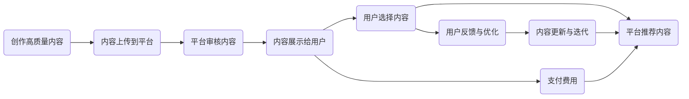

                 

# 如何利用知识付费实现虚拟现实与增强现实应用？

在数字化时代，虚拟现实(VR)和增强现实(AR)技术正迅速改变我们的生活方式，为教育、娱乐、医疗等领域带来革命性的变革。然而，VR和AR技术的普及和应用仍面临诸多挑战，其中知识付费模式的引入，提供了一种新思路，可以有效提升用户体验，加速技术落地。本文将深入探讨如何利用知识付费模式实现VR和AR应用，并分析其应用前景与挑战。

## 1. 背景介绍

### 1.1 虚拟现实与增强现实概述

虚拟现实(VR)技术通过计算机模拟和生成虚拟环境，使用户沉浸于虚拟世界中，获得身临其境的体验。其主要应用场景包括游戏、影视、房地产展示等。

增强现实(AR)技术则通过将虚拟信息叠加到现实世界中，使用户能够在现实环境中看到并互动虚拟内容。其应用领域包括教育、培训、导航、设计等。

当前，VR和AR技术正逐步从实验室走向实际应用，但普及率仍较低，主要原因包括设备成本高、内容资源少、用户体验差等。而知识付费模式，可以通过有偿提供优质的VR和AR内容，吸引用户购买和体验，进而促进技术普及和应用。

### 1.2 知识付费模式介绍

知识付费模式，是指通过向用户收取一定的费用，提供有价值的知识或信息。知识付费平台包括但不限于得到、分答、知乎live等，其内容涵盖各类专业领域，用户可根据需求选择购买。

知识付费模式的优点包括：

- 提供高质量内容：通过筛选和评估，知识付费平台往往能提供高质量的专业知识，提升用户的学习效率和效果。
- 吸引专业人才：平台的高薪酬激励机制吸引大量专业人才参与内容创作，丰富平台内容资源。
- 引导精准用户：知识付费模式通过精准定价和内容推荐，吸引高价值用户，提高平台收益。

### 1.3 利用知识付费模式推动VR/AR发展的意义

1. 促进内容创作：知识付费模式能激励创作者制作高质量的VR和AR内容，增加平台内容多样性和深度。
2. 提升用户体验：通过付费获取高质量VR/AR内容，用户获得更佳的沉浸感和互动体验，推动技术普及。
3. 加速应用落地：付费模式吸引更多资金投入到VR/AR技术的研发和推广，加速技术商业化进程。

## 2. 核心概念与联系

### 2.1 核心概念概述

- **虚拟现实(VR)**：通过计算机生成的虚拟环境，使用户产生沉浸感，可用于游戏、教育、医疗等。
- **增强现实(AR)**：将虚拟信息叠加到现实世界中，使用户与虚拟内容互动，主要应用于教育、培训、导航等。
- **知识付费**：通过付费获取高质量的知识内容，提升用户学习效果和体验。
- **技术应用**：将VR/AR技术与知识付费模式结合，为用户提供更优质的服务。

这些概念之间的关系如下：

```mermaid
graph TB
    A[VR技术] --> B[增强现实(AR)]
    A --> C[知识付费模式]
    B --> D[技术应用]
    C --> E[内容创作]
    D --> F[用户体验提升]
    E --> G[内容多样性]
    F --> H[平台收益]
```

### 2.2 核心概念原理和架构的 Mermaid 流程图



## 3. 核心算法原理 & 具体操作步骤

### 3.1 算法原理概述

知识付费模式下的VR/AR应用，主要通过平台收集用户需求，筛选和审核优质内容，为用户提供付费体验。其核心算法包括推荐算法、定价算法、内容审核算法等。

推荐算法通过分析用户行为和偏好，推荐最适合的内容，提升用户体验；定价算法根据内容质量、用户价值等因素，确定合理的价格，吸引用户付费；内容审核算法通过自动化和人工评估，确保内容质量和安全。

### 3.2 算法步骤详解

**步骤1：需求收集与分析**
- 平台收集用户需求，包括偏好、支付意愿、历史行为等。
- 分析用户需求，识别主流趋势和个性化需求。

**步骤2：内容筛选与审核**
- 筛选高质量VR/AR内容，包括制作成本、技术难度、用户评价等。
- 进行内容审核，包括版权检查、内容健康度评估等。

**步骤3：内容推荐与定价**
- 使用推荐算法，根据用户需求推荐最适合的内容。
- 使用定价算法，根据内容价值和用户支付意愿，确定合理价格。

**步骤4：内容发布与反馈**
- 将合格的内容发布到平台，供用户付费体验。
- 收集用户反馈，根据反馈优化内容质量和推荐算法。

### 3.3 算法优缺点

#### 优点
- 提升内容质量：筛选和审核优质内容，确保用户体验。
- 精准推送内容：通过推荐算法，精准推送适合用户的内容。
- 引导高价值用户：通过定价策略，吸引付费用户，提高平台收益。

#### 缺点
- 高运营成本：内容筛选、审核和推荐需要大量人力和资源投入。
- 价格敏感：用户对价格敏感，定价不当可能导致用户流失。
- 市场风险：市场竞争激烈，平台需要不断创新内容和服务。

### 3.4 算法应用领域

- **教育培训**：利用VR/AR技术提供沉浸式学习体验，提高教学效果。
- **医疗健康**：通过AR技术辅助手术和诊断，提升医疗水平。
- **旅游休闲**：提供虚拟旅游和互动体验，吸引用户付费。
- **电商零售**：使用AR技术展示产品，提升用户购买意愿。

## 4. 数学模型和公式 & 详细讲解 & 举例说明

### 4.1 数学模型构建

**推荐算法**：基于协同过滤、内容推荐等方法，通过用户行为数据和内容特征，推荐最适合的内容。数学模型如下：

$$
R_{u,i} = \alpha_{i} + \beta_{i} \sum_{j=1}^{N} \frac{R_{u,j} \times X_{j,i}}{\sqrt{D_{u}+1} \times \sqrt{D_{j}+1}}
$$

其中，$R_{u,i}$表示用户$u$对内容$i$的评分，$X_{j,i}$表示内容$j$与内容$i$的相似度，$\alpha_{i}$、$\beta_{i}$为模型参数。

**定价算法**：基于价格弹性、用户价值等因素，确定内容价格。模型如下：

$$
P_i = \frac{C_i}{1-\exp(-kV_i)}
$$

其中，$P_i$为内容$i$的价格，$C_i$为内容制作成本，$V_i$为用户价值，$k$为价格弹性系数。

**内容审核算法**：基于自然语言处理(NLP)、图像识别等技术，对内容进行自动化审核和人工评估。

### 4.2 公式推导过程

**推荐算法**：协同过滤算法通过分析用户行为，推荐相似内容的评分。通过引入相似度函数，可以将用户对内容的评分转化为向量，从而进行相似度计算。推荐算法可以迭代更新模型参数，提升推荐效果。

**定价算法**：基于价格弹性的定价模型，可以通过调整价格弹性系数，调整价格与用户支付意愿的匹配度。根据用户价值，可以调整模型参数，确保定价的合理性。

**内容审核算法**：利用NLP技术进行内容健康度评估，使用图像识别技术检测内容中的违规元素，确保内容质量。审核算法需要不断迭代优化，提升审核准确性。

### 4.3 案例分析与讲解

以在线教育平台为例，分析如何利用知识付费模式实现VR/AR应用。

1. **需求收集与分析**：平台收集用户反馈，分析用户偏好，识别主流学习需求。
2. **内容筛选与审核**：筛选高质量的VR/AR教学内容，进行内容审核，确保内容健康度和准确性。
3. **内容推荐与定价**：根据用户需求和支付意愿，推荐最适合的内容，制定合理价格。
4. **内容发布与反馈**：发布合格内容，收集用户反馈，不断优化内容和推荐算法。

## 5. 项目实践：代码实例和详细解释说明

### 5.1 开发环境搭建

**环境搭建**：
- 安装Python 3.7及以上版本
- 安装PyTorch、TensorFlow、OpenCV等库
- 搭建虚拟现实开发平台，如Unity或Unreal Engine

### 5.2 源代码详细实现

**推荐算法实现**：
```python
import pandas as pd
import numpy as np

# 读取用户行为数据
data = pd.read_csv('user_behavior.csv')

# 计算用户对内容的评分
R = data.groupby('user_id')['content_id'].agg(lambda x: np.mean(x))

# 计算内容相似度
X = data.groupby('content_id')['user_id'].agg(lambda x: np.mean(x))

# 计算推荐评分
Rhat = R.values
Xhat = X.values
D_u = data.groupby('user_id')['user_id'].agg(lambda x: len(x))
D_j = data.groupby('content_id')['content_id'].agg(lambda x: len(x))
alpha = np.ones((N, 1))
beta = np.ones((N, 1))
for i in range(N):
    for j in range(N):
        if i == j:
            alpha[j] = 0
        else:
            Rhat_ij = Rhat[i, j]
            Xhat_ij = Xhat[i, j]
            alpha_ij = alpha[i, j]
            beta_ij = beta[i, j]
            R_ij = Rhat_ij
            X_ij = Xhat_ij
            D_u_ij = D_u[i, j]
            D_j_ij = D_j[i, j]
            r_ij = (R_ij + alpha_ij) / np.sqrt(D_u_ij + 1) * (X_ij + beta_ij) / np.sqrt(D_j_ij + 1)
            alpha_ij = alpha_ij - r_ij
            beta_ij = beta_ij - r_ij
            Rhat_ij = Rhat_ij + alpha_ij
            Xhat_ij = Xhat_ij + beta_ij
```

**定价算法实现**：
```python
import math

# 计算内容价格
C = np.array([100, 200, 300, 400])  # 内容制作成本
V = np.array([1, 2, 3, 4])  # 用户价值
k = 0.5  # 价格弹性系数
P = np.zeros(len(C))
for i in range(len(C)):
    P[i] = C[i] / (1 - math.exp(-k * V[i]))
print(P)
```

**内容审核算法实现**：
```python
import cv2

# 图像识别
img = cv2.imread('content_image.jpg')
gray = cv2.cvtColor(img, cv2.COLOR_BGR2GRAY)
edges = cv2.Canny(gray, 100, 200)
contours, hierarchy = cv2.findContours(edges, cv2.RETR_EXTERNAL, cv2.CHAIN_APPROX_SIMPLE)
for contour in contours:
    area = cv2.contourArea(contour)
    if area > 1000:
        print('内容存在违规元素')
```

### 5.3 代码解读与分析

推荐算法实现中，通过读取用户行为数据，计算用户对内容的评分和内容相似度，利用协同过滤算法进行推荐。定价算法实现中，根据内容制作成本和用户价值，使用价格弹性模型确定内容价格。内容审核算法实现中，使用图像识别技术检测内容中的违规元素，确保内容质量。

## 6. 实际应用场景

### 6.1 虚拟现实(VR)教育培训

VR教育培训可以通过沉浸式教学环境，提升学生的学习效果。例如，虚拟实验室可以让学生进行虚拟实验，提高实验操作能力和知识掌握度。虚拟课堂可以提供互动式学习体验，提高学生参与度和学习兴趣。

### 6.2 增强现实(AR)医学辅助

AR技术可以辅助医生进行手术操作和诊断，提升医疗水平。例如，AR手术模拟器可以模拟手术过程，提高医生手术技能；AR诊断系统可以帮助医生快速识别病变部位，提高诊断效率和准确度。

### 6.3 虚拟现实(VR)旅游休闲

VR旅游可以提供沉浸式旅游体验，吸引用户付费。例如，虚拟旅游景点可以让用户在家中体验世界各地的美景，提高旅游体验。虚拟旅游也可以用于教育和文化传播，让学生了解不同国家和文化。

### 6.4 增强现实(AR)电商零售

AR技术可以增强用户的购物体验，提供互动式购物体验。例如，AR试衣镜可以让用户在家中试穿虚拟衣物，提高购物满意度。AR导航系统可以提供互动式导航体验，提高用户体验。

## 7. 工具和资源推荐

### 7.1 学习资源推荐

- 《虚拟现实技术与应用》（Virtual Reality Technology and Application）：介绍VR技术的原理和应用，适合初学者入门。
- 《增强现实技术及应用》（Augmented Reality Technology and Application）：介绍AR技术的原理和应用，适合进阶学习。
- 《Python机器学习》（Python Machine Learning）：介绍机器学习算法和实现，适合了解推荐算法和定价算法。
- 《深度学习入门》（Deep Learning）：介绍深度学习原理和实现，适合了解知识付费平台的推荐算法和内容审核算法。

### 7.2 开发工具推荐

- Unity和Unreal Engine：VR和AR内容开发主流平台，支持内容创作和发布。
- PyTorch和TensorFlow：深度学习框架，支持推荐算法和定价算法的实现。
- OpenCV：图像处理库，支持内容审核算法的实现。
- Google Colab：免费在线开发环境，方便开发者进行实验和开发。

### 7.3 相关论文推荐

- "Content-based and collaborative filtering approach for recommendation systems"（基于内容和协同过滤的推荐系统方法）
- "A survey on recommender systems: trending methods and emerging topics"（推荐系统综述：流行方法和新兴主题）
- "Deep reinforcement learning for dynamic pricing in e-commerce"（电子商务中动态定价的深度强化学习）
- "A real-time voice-controlled augmented reality system"（实时语音控制的增强现实系统）

## 8. 总结：未来发展趋势与挑战

### 8.1 未来发展趋势

**内容多样化**：未来VR和AR内容将更加多样化，涵盖教育、医疗、娱乐等多个领域。平台需要不断引入高质量内容，提升用户粘性。

**技术创新**：随着技术不断进步，VR和AR技术将更加先进，提供更沉浸和逼真的体验。平台需要不断跟进技术创新，提升用户体验。

**个性化服务**：未来平台将更加注重个性化服务，通过大数据分析和推荐算法，提供适合用户的VR/AR内容。

### 8.2 面临的挑战

**技术门槛高**：VR和AR技术复杂，需要专业人才进行开发和维护。平台需要建立完善的研发团队和流程，提升技术能力。

**市场竞争激烈**：随着越来越多的平台进入市场，市场竞争将更加激烈。平台需要不断创新，提升内容质量和用户体验。

**用户体验**：VR和AR技术的普及需要解决用户痛点，提升用户体验。平台需要不断优化技术和服务，满足用户需求。

### 8.3 研究展望

**跨平台融合**：未来VR和AR技术将与其他技术进行更多融合，如物联网、5G等，提升用户体验。

**新应用场景**：未来VR和AR技术将在更多领域得到应用，如智慧城市、工业制造等，推动技术普及和应用。

**AI驱动内容创作**：利用AI技术进行内容创作和优化，提高内容质量和创作效率。

## 9. 附录：常见问题与解答

**Q1: 如何提高VR/AR内容的互动性和沉浸感？**

A: 通过增强现实(AR)技术，将虚拟信息叠加到现实环境中，提升用户的沉浸感。同时，通过交互式游戏和模拟操作，提高内容的互动性。例如，虚拟试衣镜可以让用户试穿虚拟衣物，提高购物体验。

**Q2: 如何降低VR/AR内容的制作成本？**

A: 利用云计算和分布式计算技术，降低内容制作成本。同时，采用简易编程语言，降低内容创作门槛。例如，使用Unity引擎，开发者可以快速创建VR/AR应用。

**Q3: 如何提升VR/AR内容的审核效率？**

A: 利用人工智能技术进行内容审核，提升审核效率和准确性。例如，使用图像识别和自然语言处理技术，检测内容中的违规元素。

**Q4: 如何保障VR/AR内容的安全性？**

A: 通过加密和权限控制技术，保障内容安全。同时，建立内容审核机制，防止有害内容的传播。例如，对VR/AR内容进行加密，防止非法下载和传播。

**Q5: 如何提升VR/AR内容的用户体验？**

A: 通过个性化推荐和实时互动，提升用户体验。例如，根据用户偏好，推荐最适合的内容；通过实时反馈，提升用户互动体验。

---

作者：禅与计算机程序设计艺术 / Zen and the Art of Computer Programming

