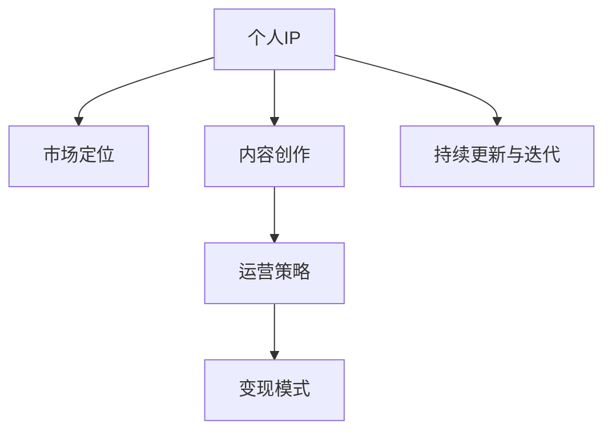

                 

# 如何利用知识付费打造个人IP

在知识经济时代，利用知识付费打造个人品牌（IP）已成为许多人追求的目标。通过建立权威、专业的在线知识体系，个人IP不仅能实现自我价值，还能带来丰厚的经济回报。本文将深入探讨如何通过知识付费打造个人IP，包括市场定位、内容创作、运营策略等方面的全面指导。

## 1. 背景介绍

### 1.1 问题由来
随着互联网和移动互联网的迅猛发展，人们获取信息的渠道日益多元化，传统的一对多教育模式逐渐被打破。知识付费作为一种新型的知识传播方式，让专业人士能以高效、精准、个性化的方式传递知识，从而获得市场的认可和用户的信任。个人IP正是这种趋势下的产物，通过知识付费，个人不仅能分享自己的专业见解，还能建立品牌影响力，实现经济收益。

### 1.2 问题核心关键点
- **定位与目标受众**：明确自身的专业领域，并精准定位目标用户群体。
- **内容质量与价值**：高质量、有深度的内容是吸引用户和建立信任的基础。
- **运营策略与工具**：选择合适的平台和工具，制定有效的运营策略，扩大个人IP的影响力。
- **变现模式与收益结构**：构建合理的变现模式，实现知识付费的经济效益。
- **持续更新与迭代**：保持内容的新鲜度和更新频率，满足用户不断变化的需求。

### 1.3 问题研究意义
在知识付费领域，个人IP不仅能够带来丰厚的收益，还能形成以个人为中心的知识社区，推动行业发展。本文旨在帮助读者全面了解如何利用知识付费打造个人IP，从市场定位到变现模式，提供详尽的策略和建议。

## 2. 核心概念与联系

### 2.1 核心概念概述
- **个人IP**：指个人品牌，通过内容、形象、声音等元素在特定领域内建立独特识别度和知名度。
- **知识付费**：指通过互联网平台为用户提供高质量知识内容，用户以付费形式获取的商业模式。
- **市场定位**：指明确个人IP在目标市场中的独特位置和差异化优势。
- **内容创作**：指结合专业知识与市场需求，生产有价值的内容。
- **运营策略**：指在特定平台上推广和运营个人IP的策略。
- **变现模式**：指通过知识付费实现经济收益的方法和渠道。

这些核心概念之间的逻辑关系可以通过以下Mermaid流程图来展示：



这个流程图展示了个体在利用知识付费打造个人IP过程中，各环节的相互依赖和支持。

## 3. 核心算法原理 & 具体操作步骤

### 3.1 算法原理概述
个人IP的打造基于知识付费，其实质上是一种信息的提供与获取的交易。用户通过付费购买知识，个人IP提供专业和高质量的内容。以下是打造个人IP的算法原理：

1. **用户需求分析**：分析目标用户的痛点、兴趣、行为等，确定个人IP的内容定位。
2. **内容规划与设计**：根据用户需求，设计有价值、可操作的内容。
3. **内容生产与发布**：利用专业技能和工具，制作内容，并在知识付费平台上发布。
4. **用户互动与反馈**：通过互动和反馈，了解用户需求，调整和优化内容。
5. **变现与收益**：实现个人IP的商业变现，积累经济资本。

### 3.2 算法步骤详解
个人IP的打造过程大致分为以下几步：

1. **市场调研与分析**：
   - 通过问卷调查、社交媒体分析等方式，了解目标用户需求。
   - 分析市场竞争情况，确定差异化的市场定位。
   - 识别市场需求和潜在机会。

2. **内容规划与设计**：
   - 根据市场调研结果，设计课程大纲、视频内容等。
   - 确定内容形式，如文字、视频、音频、互动直播等。
   - 制定内容生产计划和时间表。

3. **内容生产与发布**：
   - 使用专业工具和技术，制作高质量内容。
   - 选择适合的知识付费平台发布内容。
   - 制作营销宣传材料，吸引用户关注。

4. **用户互动与反馈**：
   - 通过社交媒体、评论区等方式与用户互动。
   - 收集用户反馈，调整和优化内容。
   - 提供答疑服务，增强用户粘性。

5. **变现与收益**：
   - 设置合理的课程价格和付费模式。
   - 利用平台的广告分成、会员服务等方式实现变现。
   - 积累经济资本，进行再投资或扩大规模。

### 3.3 算法优缺点
个人IP利用知识付费的优势包括：
- **高效性**：通过平台可以快速接触到目标用户。
- **灵活性**：内容形式多样化，适应不同用户需求。
- **权威性**：专业知识和权威认证提升信服力。

缺点主要包括：
- **竞争激烈**：市场竞争激烈，优质内容难以脱颖而出。
- **运营成本**：内容制作、平台推广需要投入时间和资源。
- **用户粘性**：需要不断更新内容，维持用户兴趣。

### 3.4 算法应用领域
个人IP的知识付费应用领域广泛，涵盖以下几个方面：

1. **教育培训**：如编程、设计、金融等领域的专业课程。
2. **健康养生**：营养、运动、心理健康等健康知识分享。
3. **生活技能**：如厨艺、手工制作、时间管理等。
4. **创业与投资**：商业计划、市场分析、投资策略等。
5. **艺术与文化**：绘画、音乐、文学等艺术领域的知识分享。

## 4. 数学模型和公式 & 详细讲解 & 举例说明

### 4.1 数学模型构建
个人IP的知识付费过程可以建模为以下函数：

$$ f(x) = k \cdot g(x) \cdot h(x) \cdot i(x) $$

其中，$x$ 代表用户需求、内容质量和平台运营等输入变量，$k$ 为常数，代表个人IP的潜在价值。$g(x)$ 为内容生产函数，$h(x)$ 为运营策略函数，$i(x)$ 为变现模型函数。

### 4.2 公式推导过程
推导过程主要涉及以下几个方面：

1. **用户需求分析**：
   - 使用问卷调查、社交媒体分析等方法，收集用户数据。
   - 建立用户需求模型：$u(x) = w_1 \cdot a_1 + w_2 \cdot a_2 + \cdots + w_n \cdot a_n$

2. **内容生产**：
   - 内容质量评价函数：$c(q) = f(q) = m \cdot e(q)$
   - 其中 $m$ 为内容质量系数，$e(q)$ 为内容制作难度函数。

3. **运营策略**：
   - 运营策略影响函数：$r(s) = p \cdot v(s)$
   - 其中 $p$ 为平台推广系数，$v(s)$ 为策略实施效率函数。

4. **变现模型**：
   - 变现收益函数：$m(t) = l \cdot n(t)$
   - 其中 $l$ 为单次购买收益，$n(t)$ 为购买频次函数。

### 4.3 案例分析与讲解
以下是一个具体的案例分析：

1. **案例背景**：某科技博主利用知识付费打造个人IP。
2. **市场调研**：通过社交媒体数据分析，发现科技爱好者对最新技术趋势和应用案例有浓厚兴趣。
3. **内容规划**：每月推出一堂深度讲解AI新技术的课程，配合实时技术新闻和案例分析。
4. **内容生产**：使用专业的视频制作工具和脚本，制作高质量的课程内容。
5. **平台运营**：在知识付费平台如B站、喜马拉雅上发布课程，并利用微博、微信公众号进行推广。
6. **用户互动**：在评论区和私人社群中与用户互动，解答问题，增强粘性。
7. **变现**：通过平台分成和广告合作，实现收益。

## 5. 项目实践：代码实例和详细解释说明

### 5.1 开发环境搭建
知识付费IP的实践开发需要以下环境：

1. **编程语言**：Python
2. **开发框架**：Flask、FastAPI
3. **内容制作工具**：Adobe Creative Suite、Premiere Pro
4. **知识付费平台**：Ko-fi、Patreon、小鹅通
5. **数据分析工具**：Excel、Tableau、Python Pandas
6. **部署环境**：AWS、Google Cloud

### 5.2 源代码详细实现
以下是一个简单的Flask服务示例，用于管理课程和用户互动：

```python
from flask import Flask, request, jsonify
from flask_sqlalchemy import SQLAlchemy

app = Flask(__name__)
app.config['SQLALCHEMY_DATABASE_URI'] = 'sqlite:///courses.db'
db = SQLAlchemy(app)

class Course(db.Model):
    id = db.Column(db.Integer, primary_key=True)
    title = db.Column(db.String(255))
    description = db.Column(db.Text)
    price = db.Column(db.Float)
    instructor = db.Column(db.String(255))

@app.route('/courses', methods=['POST'])
def add_course():
    course_data = request.json
    new_course = Course(title=course_data['title'], description=course_data['description'], price=course_data['price'], instructor=course_data['instructor'])
    db.session.add(new_course)
    db.session.commit()
    return jsonify({'message': 'Course added successfully'}), 201

@app.route('/courses', methods=['GET'])
def get_courses():
    courses = Course.query.all()
    course_data = [{'id': course.id, 'title': course.title, 'description': course.description, 'price': course.price, 'instructor': course.instructor} for course in courses]
    return jsonify(course_data)

if __name__ == '__main__':
    db.create_all()
    app.run(debug=True)
```

### 5.3 代码解读与分析
以上代码实现了一个简单的Flask应用，用于管理课程数据：

1. **数据库设置**：使用SQLite作为本地数据库，方便开发和测试。
2. **模型定义**：定义课程实体，包含课程标题、描述、价格和讲师信息。
3. **路由定义**：实现添加课程和获取课程列表的功能。
4. **功能实现**：通过API接口，实现课程数据的增删改查。

### 5.4 运行结果展示
在运行上述代码后，可以通过浏览器访问http://localhost:5000/courses，实现课程数据的查看和添加。

## 6. 实际应用场景

### 6.1 教育培训
某编程培训机构利用知识付费打造编程技术系列课程，通过YouTube视频和知识星球社群，吸引了数千名学员。

### 6.2 健康养生
某营养师通过知识付费分享健康饮食和运动课程，吸引了大量关注健康的人群，并开设了付费会员计划。

### 6.3 生活技能
某生活技能博主通过知识付费平台推出各类手工艺、烹饪课程，满足居家用户的多样化需求。

### 6.4 未来应用展望
未来，知识付费将更加普及，个人IP通过持续创新和优化，将实现更广泛的传播和影响。利用人工智能、大数据等技术，能够更好地分析用户需求，提供个性化服务，实现更高效的变现模式。

## 7. 工具和资源推荐

### 7.1 学习资源推荐
1. **《知识付费：从0到1打造IP》**：详细讲解知识付费的商业模型和运营策略。
2. **《知识付费营销实战》**：提供了具体的营销策略和案例分析。
3. **《内容变现：打造个人IP的商业战略》**：涵盖内容创作和变现的多元化路径。
4. **Coursera和Udemy**：全球领先的在线教育平台，提供丰富的课程和认证机会。

### 7.2 开发工具推荐
1. **Flask和FastAPI**：轻量级Python Web框架，易于上手和扩展。
2. **Ko-fi和Patreon**：主流的知识付费平台，支持多种货币和支付方式。
3. **Zoom和Teams**：视频会议和协作工具，用于在线互动和直播。
4. **Tableau和Power BI**：数据可视化工具，帮助分析用户数据。

### 7.3 相关论文推荐
1. **《知识付费的兴起与挑战》**：探讨知识付费市场的现状和未来发展趋势。
2. **《基于用户行为的知识付费推荐系统》**：研究如何通过用户行为数据进行内容推荐。
3. **《知识付费平台的商业模式分析》**：剖析不同类型的知识付费平台及其商业模型。

## 8. 总结：未来发展趋势与挑战

### 8.1 研究成果总结
本文从市场定位、内容创作、运营策略和变现模式四个方面，详细探讨了如何通过知识付费打造个人IP。通过案例分析和代码示例，展示了具体的实践路径和方法。

### 8.2 未来发展趋势
1. **技术融合**：利用人工智能和大数据分析，提升知识付费的内容质量和用户互动。
2. **平台创新**：开发新的知识付费平台，提供更丰富多样的变现渠道。
3. **内容创新**：结合多元化的内容形式，如视频、直播、互动游戏等，提升用户体验。

### 8.3 面临的挑战
1. **内容质量**：持续产出高质量、有深度的内容，是知识付费的核心挑战。
2. **用户粘性**：保持用户兴趣和粘性，是长期运营的关键。
3. **市场竞争**：面对激烈的市场竞争，需要不断创新和优化。

### 8.4 研究展望
1. **多模态内容**：结合视频、音频、图文等多模态内容，提升用户学习体验。
2. **用户定制**：利用用户画像和行为数据，提供个性化的内容和推荐。
3. **商业变现**：探索更多元化的变现模式，如会员制、订阅制、会员增值服务等。

## 9. 附录：常见问题与解答

**Q1：如何选择合适的知识付费平台？**

A: 根据个人IP的定位和目标用户群体选择合适的平台。考虑平台的知名度、用户规模、交易手续费等因素。

**Q2：如何提高课程的互动性？**

A: 利用直播、问答环节等方式，增加用户互动。通过社群和粉丝团建立用户粘性。

**Q3：如何实现内容的持续更新？**

A: 建立内容生产团队，制定定期更新计划。利用AI辅助创作工具，提高内容产出效率。

**Q4：如何应对市场竞争？**

A: 不断创新和优化课程内容，保持市场竞争力。利用社交媒体和网络营销，扩大品牌影响力。

**Q5：如何提升知识付费的经济效益？**

A: 通过平台分成、广告合作、会员服务等多种渠道实现变现。合理定价，提供优质内容和服务。

---

作者：禅与计算机程序设计艺术 / Zen and the Art of Computer Programming

