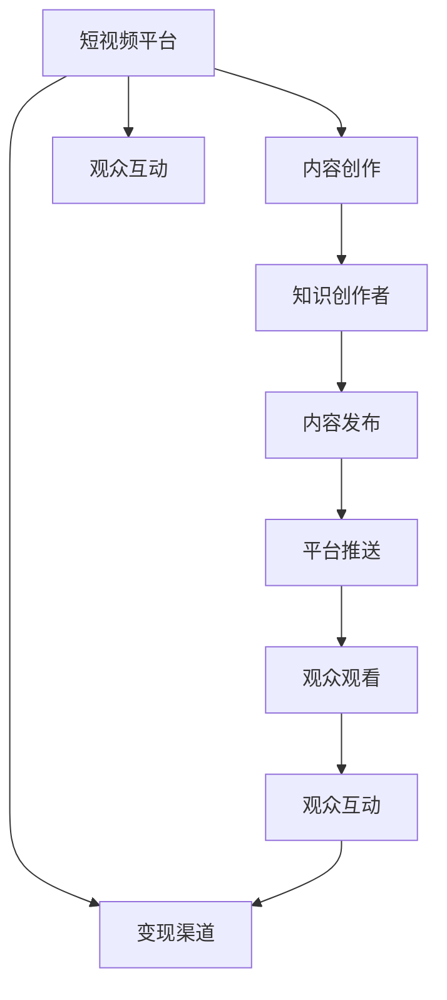

                 

# 如何利用短视频平台实现知识变现

## 1. 背景介绍

随着移动互联网的迅速发展，短视频平台如抖音、快手、Bilibili等，逐渐成为人们获取信息、学习新知的重要渠道。这些平台通过短视频的形式，将复杂的学习内容简化为简短、生动、易于消化的形式，打破了传统学习的时空限制。同时，短视频平台也为知识创作者提供了一个展示才华、变现知识的舞台。本文将探讨如何利用短视频平台实现知识变现，分析其背后的核心概念、算法原理和具体操作步骤，并结合具体案例，详细介绍其应用实践。

## 2. 核心概念与联系

### 2.1 核心概念概述

为更好地理解短视频平台知识变现的原理和架构，本节将介绍几个关键概念：

- **知识变现(Knowledge Monetization)**：指通过传播知识、提供价值来获取经济回报的过程。在短视频平台中，知识变现通常通过视频广告、打赏、知识付费、电商合作等多种方式实现。

- **短视频平台(Short Video Platforms)**：如抖音、快手、Bilibili等，以短视频为核心内容，提供信息传播、娱乐互动、社交分享等功能，成为知识变现的重要媒介。

- **知识创作者(Knowledge Creators)**：利用短视频平台分享专业知识和技能，包括教育博主、技术专家、健身教练等。他们通过内容创新、粉丝互动等方式，吸引大量观众，并通过平台提供的变现机制获得经济收益。

- **观众互动(Audience Engagement)**：指观众通过点赞、评论、分享等方式与内容创作者互动，提升内容的影响力和传播效果，是知识变现的重要推动力。

- **变现渠道(Monetization Channels)**：包括广告收入、粉丝打赏、知识付费、电商导流等，是知识创作者通过平台获得经济回报的主要途径。

### 2.2 核心概念原理和架构的 Mermaid 流程图



该流程图展示了短视频平台知识变现的基本流程：
1. **内容创作**：知识创作者制作短视频内容，上传至平台。
2. **平台推送**：平台根据算法推荐，将内容推送给目标观众。
3. **观众观看**：观众观看视频，进行点赞、评论等互动。
4. **观众互动**：互动数据反馈给创作者和平台，平台根据数据调整推荐策略。
5. **变现渠道**：根据创作者设定，观众通过广告、打赏等方式支持创作者，创作者获得经济收益。

## 3. 核心算法原理 & 具体操作步骤

### 3.1 算法原理概述

短视频平台知识变现的核心算法原理主要基于以下几个方面：

- **推荐算法(Recommendation Algorithms)**：平台利用协同过滤、内容过滤等算法，将短视频内容推荐给最可能感兴趣的用户，提高观众观看率和创作者曝光度。
- **个性化推荐(Personalized Recommendations)**：根据用户历史行为和兴趣，推荐相关内容，提升用户体验和创作者收益。
- **内容优化(Content Optimization)**：创作者通过数据分析，调整视频风格、内容长度等，以提高观众互动率和变现效果。
- **变现机制(Monetization Mechanisms)**：平台提供广告、打赏、知识付费等变现渠道，创作者根据内容设定，获得经济回报。

### 3.2 算法步骤详解

以下是短视频平台知识变现的核心算法步骤：

**Step 1: 内容创作与上传**
- 知识创作者根据兴趣和专长，制作短视频内容，并进行编辑、上传至平台。

**Step 2: 平台推荐与推送**
- 平台根据用户兴趣、历史行为、社交网络等信息，利用推荐算法将视频推送至目标用户。
- 推荐算法通常包括协同过滤、内容过滤、基于深度学习的推荐模型等。

**Step 3: 观众互动与反馈**
- 观众观看视频后，通过点赞、评论、分享等方式进行互动，平台根据这些数据调整推荐策略，进一步优化推荐效果。
- 互动数据反馈给创作者，创作者根据反馈调整内容策略，提高观众互动率和变现效果。

**Step 4: 变现渠道与收益**
- 创作者根据平台提供的选项，设置视频广告、打赏、知识付费等变现方式。
- 观众通过点击广告、打赏等方式支持创作者，创作者获得经济收益。

### 3.3 算法优缺点

基于短视频平台知识变现的算法具有以下优点：
1. **高效性**：推荐算法能够快速将内容推送至目标观众，提高观看率和创作者曝光度。
2. **灵活性**：创作者可以根据平台提供的选项，灵活设置变现渠道，最大化收益。
3. **互动性**：观众互动反馈机制，帮助创作者调整内容策略，提升观众满意度。

但同时也存在以下缺点：
1. **算法偏见**：推荐算法可能存在偏见，导致部分内容无法覆盖到目标观众。
2. **创作者收益不稳定**：创作者收益依赖平台推荐和观众互动，可能存在较大波动。
3. **内容质量参差不齐**：大量低质量内容可能降低平台整体用户体验，影响创作者收益。

### 3.4 算法应用领域

基于短视频平台知识变现的算法广泛应用于各类知识变现场景，例如：

- **教育博主**：利用平台推荐算法，分享教育资源，获得观众打赏和广告收入。
- **技术专家**：通过技术讲解、编程教程等内容，吸引技术爱好者关注，并通过知识付费、商品导流等方式变现。
- **健身教练**：制作健身教学视频，吸引健身爱好者观看和互动，通过平台提供的变现机制获得收益。
- **健康顾问**：分享健康知识，吸引用户关注，通过电商导流、知识付费等方式进行变现。

这些应用场景展示了短视频平台知识变现的多样性和广泛性，为知识创作者提供了丰富的变现途径。

## 4. 数学模型和公式 & 详细讲解 & 举例说明

### 4.1 数学模型构建

为简化问题，假设短视频平台为一个线性回归模型，输入为观众特征向量 $x$，输出为观众观看时长 $y$。模型的目标是最小化预测值和真实值之间的均方误差：

$$
\min_{\theta} \sum_{i=1}^N (y_i - \hat{y}_i)^2
$$

其中，$\hat{y}_i = \theta^T x_i$，$\theta$ 为模型参数，$N$ 为观众总数。

### 4.2 公式推导过程

利用梯度下降法，最小化均方误差，得到模型参数的更新公式：

$$
\theta \leftarrow \theta - \eta \nabla_{\theta} \mathcal{L}(\theta) = \theta - \eta \frac{1}{N} \sum_{i=1}^N (2y_i - 2\hat{y}_i)x_i
$$

其中，$\eta$ 为学习率，$\nabla_{\theta} \mathcal{L}(\theta)$ 为损失函数对模型参数的梯度。

在实际应用中，平台通常使用随机梯度下降(SGD)或批量梯度下降(BGD)等优化算法，不断更新模型参数，以提高预测准确率。

### 4.3 案例分析与讲解

假设某教育博主在平台上分享了一门编程课程。根据历史数据，博主选取了目标观众特征向量 $x = [观看时长, 点赞数量, 关注人数]^T$，预测观众观看时长 $y = \theta^T x$。

将数据代入模型参数更新公式，得到：

$$
\theta \leftarrow \theta - \eta \frac{1}{N} \sum_{i=1}^N (2y_i - 2\hat{y}_i)x_i
$$

平台根据更新后的模型参数，调整推荐算法，将课程视频推荐给最可能感兴趣的观众，观众观看后进行互动，创作者获得收益。

## 5. 项目实践：代码实例和详细解释说明

### 5.1 开发环境搭建

在进行短视频平台知识变现的开发前，我们需要准备好开发环境。以下是使用Python进行PyTorch开发的环境配置流程：

1. 安装Anaconda：从官网下载并安装Anaconda，用于创建独立的Python环境。

2. 创建并激活虚拟环境：
```bash
conda create -n pytorch-env python=3.8 
conda activate pytorch-env
```

3. 安装PyTorch：根据CUDA版本，从官网获取对应的安装命令。例如：
```bash
conda install pytorch torchvision torchaudio cudatoolkit=11.1 -c pytorch -c conda-forge
```

4. 安装TensorFlow：
```bash
pip install tensorflow
```

5. 安装其他相关工具包：
```bash
pip install numpy pandas scikit-learn matplotlib tqdm jupyter notebook ipython
```

完成上述步骤后，即可在`pytorch-env`环境中开始开发实践。

### 5.2 源代码详细实现

以下是一个简单的Python代码示例，演示如何利用机器学习模型进行短视频平台知识变现的预测：

```python
import torch
import torch.nn as nn
import torch.optim as optim
from sklearn.datasets import make_regression

# 构建数据集
X, y = make_regression(n_samples=1000, n_features=3, noise=0.1, random_state=42)
X = torch.tensor(X, dtype=torch.float32)
y = torch.tensor(y, dtype=torch.float32)

# 定义模型
class RegressionModel(nn.Module):
    def __init__(self, input_size, output_size):
        super(RegressionModel, self).__init__()
        self.linear = nn.Linear(input_size, output_size)
    
    def forward(self, x):
        return self.linear(x)

# 定义损失函数和优化器
model = RegressionModel(3, 1)
criterion = nn.MSELoss()
optimizer = optim.SGD(model.parameters(), lr=0.01)

# 训练模型
for epoch in range(1000):
    optimizer.zero_grad()
    output = model(X)
    loss = criterion(output, y)
    loss.backward()
    optimizer.step()
    
    if (epoch+1) % 100 == 0:
        print(f"Epoch {epoch+1}, loss: {loss.item():.3f}")

# 测试模型
test_X = torch.tensor([[1.0, 2.0, 3.0]], dtype=torch.float32)
output = model(test_X)
print(f"Prediction for {test_X[0].tolist()}: {output.tolist()[0][0]:.3f}")
```

以上代码实现了一个简单的线性回归模型，用于预测观众观看时长。通过不断训练模型，调整模型参数，以提高预测准确率。

### 5.3 代码解读与分析

让我们再详细解读一下关键代码的实现细节：

**数据集生成**：
- 使用`make_regression`函数生成包含3个特征和1个目标变量的数据集，其中目标变量有1000个样本。
- 将数据集转换为PyTorch张量，并设置数据类型为浮点数。

**模型定义**：
- 定义一个线性回归模型，包含一个线性层，将输入特征映射到输出变量。
- 在`forward`方法中，将输入特征通过线性层得到输出。

**损失函数和优化器**：
- 使用均方误差损失函数`MSELoss`计算预测值与真实值之间的误差。
- 定义随机梯度下降优化器`SGD`，更新模型参数。

**模型训练**：
- 在每个epoch中，计算模型的输出、损失，并反向传播更新模型参数。
- 每隔100个epoch输出一次训练过程中的损失值。

**模型测试**：
- 使用训练好的模型对新样本进行预测，并输出预测结果。

## 6. 实际应用场景

### 6.1 教育博主变现

在短视频平台上，教育博主利用平台推荐算法，将教育资源推荐给目标观众。观众通过观看、点赞、评论等方式与博主互动，博主通过平台提供的广告、知识付费、商品导流等变现渠道获得收益。例如，某编程博主分享编程教程，通过课程广告、付费订阅等方式，吸引大量观众，实现知识变现。

### 6.2 技术专家变现

技术专家在平台上分享技术讲解、编程教程等内容，通过观众互动和平台提供的变现机制，实现知识变现。例如，某技术专家分享深度学习课程，通过视频广告、观众打赏等方式，吸引大量观众，获得经济收益。

### 6.3 健身教练变现

健身教练制作健身教学视频，通过平台推荐算法，吸引健身爱好者观看和互动，并通过平台提供的变现机制，实现知识变现。例如，某健身教练分享健身训练视频，通过观众打赏、商品导流等方式，获得经济收益。

### 6.4 健康顾问变现

健康顾问分享健康知识，通过平台推荐算法，吸引用户关注，并通过平台提供的变现机制，实现知识变现。例如，某健康顾问分享健康饮食知识，通过观众打赏、知识付费等方式，获得经济收益。

## 7. 工具和资源推荐

### 7.1 学习资源推荐

为了帮助开发者系统掌握短视频平台知识变现的理论基础和实践技巧，这里推荐一些优质的学习资源：

1. **《深度学习实战》系列博文**：由大模型技术专家撰写，深入浅出地介绍了深度学习在短视频平台变现中的应用，包括推荐算法、内容优化、变现机制等。

2. **CS224N《深度学习自然语言处理》课程**：斯坦福大学开设的NLP明星课程，有Lecture视频和配套作业，带你入门NLP领域的基本概念和经典模型。

3. **《自然语言处理与深度学习》书籍**：清华大学出版社出版的书籍，全面介绍了自然语言处理的基本概念和深度学习在NLP中的应用，包括短视频平台知识变现。

4. **PyTorch官方文档**：PyTorch的官方文档，提供了海量深度学习模型的实现和优化方法，是进行短视频平台变现实践的必备资料。

5. **HuggingFace官方文档**：HuggingFace提供的自然语言处理工具库，集成了众多预训练语言模型，是进行短视频平台变现的重要工具。

通过对这些资源的学习实践，相信你一定能够快速掌握短视频平台知识变现的精髓，并用于解决实际的NLP问题。

### 7.2 开发工具推荐

高效的开发离不开优秀的工具支持。以下是几款用于短视频平台知识变现开发的常用工具：

1. **PyTorch**：基于Python的开源深度学习框架，灵活动态的计算图，适合快速迭代研究。

2. **TensorFlow**：由Google主导开发的开源深度学习框架，生产部署方便，适合大规模工程应用。

3. **Transformers库**：HuggingFace开发的NLP工具库，集成了众多预训练语言模型，是进行短视频平台变现的重要工具。

4. **Weights & Biases**：模型训练的实验跟踪工具，可以记录和可视化模型训练过程中的各项指标，方便对比和调优。

5. **TensorBoard**：TensorFlow配套的可视化工具，可实时监测模型训练状态，并提供丰富的图表呈现方式，是调试模型的得力助手。

6. **Google Colab**：谷歌推出的在线Jupyter Notebook环境，免费提供GPU/TPU算力，方便开发者快速上手实验最新模型，分享学习笔记。

合理利用这些工具，可以显著提升短视频平台知识变现的开发效率，加快创新迭代的步伐。

### 7.3 相关论文推荐

短视频平台知识变现技术的发展源于学界的持续研究。以下是几篇奠基性的相关论文，推荐阅读：

1. **Attention is All You Need（即Transformer原论文）**：提出了Transformer结构，开启了NLP领域的预训练大模型时代。

2. **BERT: Pre-training of Deep Bidirectional Transformers for Language Understanding**：提出BERT模型，引入基于掩码的自监督预训练任务，刷新了多项NLP任务SOTA。

3. **Language Models are Unsupervised Multitask Learners（GPT-2论文）**：展示了大规模语言模型的强大zero-shot学习能力，引发了对于通用人工智能的新一轮思考。

4. **Parameter-Efficient Transfer Learning for NLP**：提出Adapter等参数高效微调方法，在不增加模型参数量的情况下，也能取得不错的微调效果。

5. **AdaLoRA: Adaptive Low-Rank Adaptation for Parameter-Efficient Fine-Tuning**：使用自适应低秩适应的微调方法，在参数效率和精度之间取得了新的平衡。

这些论文代表了大模型微调技术的发展脉络。通过学习这些前沿成果，可以帮助研究者把握学科前进方向，激发更多的创新灵感。

## 8. 总结：未来发展趋势与挑战

### 8.1 总结

本文对短视频平台知识变现方法进行了全面系统的介绍。首先阐述了知识变现的背景和意义，明确了短视频平台在知识变现中的核心概念和算法原理。其次，从原理到实践，详细讲解了短视频平台知识变现的数学模型和具体操作步骤，给出了完整的代码实例。同时，本文还探讨了知识变现在教育博主、技术专家、健身教练、健康顾问等不同应用场景中的具体实现。最后，本文精选了知识变现的各类学习资源，力求为开发者提供全方位的技术指引。

通过本文的系统梳理，可以看到，短视频平台知识变现技术正在成为NLP领域的重要范式，极大地拓展了预训练语言模型的应用边界，催生了更多的落地场景。得益于短视频平台的便捷性、高互动性和传播效率，知识变现成为创作者快速变现的重要手段。未来，伴随技术的发展和应用的深入，短视频平台知识变现将迎来更加广阔的前景。

### 8.2 未来发展趋势

展望未来，短视频平台知识变现技术将呈现以下几个发展趋势：

1. **内容个性化**：平台将进一步提升推荐算法，根据用户兴趣和行为，提供个性化推荐，提高用户观看率和创作者收益。

2. **内容多样化**：创作者将更多样化地利用短视频平台，分享教育、技术、健身、健康等多个领域的知识，提升内容丰富度和吸引力。

3. **变现渠道多样化**：平台将提供更多元化的变现渠道，如直播打赏、知识付费、电商合作等，满足创作者和观众的多样化需求。

4. **技术创新**：随着深度学习、自然语言处理等技术的进步，平台将不断优化推荐算法、内容优化、变现机制等，提高平台整体性能和用户体验。

5. **创作者生态**：平台将进一步优化创作者激励机制，提升创作者活力和产出质量，形成良性循环。

### 8.3 面临的挑战

尽管短视频平台知识变现技术已经取得了显著成效，但在迈向更加智能化、普适化应用的过程中，仍面临诸多挑战：

1. **内容质量参差不齐**：大量低质量内容可能降低平台整体用户体验，影响创作者收益。

2. **创作者收益不稳定**：创作者收益依赖平台推荐和观众互动，可能存在较大波动。

3. **算法偏见**：推荐算法可能存在偏见，导致部分内容无法覆盖到目标观众。

4. **创作者权益保护**：平台需要平衡用户互动与创作者权益，防止盗版和侵权行为。

5. **内容审核机制**：平台需要建立严格的内容审核机制，防止有害信息的传播，保障用户安全。

### 8.4 研究展望

面对短视频平台知识变现所面临的挑战，未来的研究需要在以下几个方面寻求新的突破：

1. **内容审核与监管**：开发高效的内容审核机制，防止有害信息的传播，保障用户安全。

2. **创作者激励与权益保护**：优化创作者激励机制，保障创作者权益，提升创作者活力。

3. **算法公平与透明度**：研究公平性、透明性强的推荐算法，防止算法偏见，提升推荐效果。

4. **多模态内容推荐**：开发能够融合文本、图像、视频等多模态信息的推荐算法，提升内容推荐效果。

5. **知识图谱与协同过滤**：将知识图谱、协同过滤等技术引入推荐算法，提升推荐效果和用户满意度。

这些研究方向的探索，必将引领短视频平台知识变现技术迈向更高的台阶，为知识创作者提供更优质的变现途径，为观众提供更丰富、更高质量的内容。

## 9. 附录：常见问题与解答

**Q1：短视频平台知识变现是否适用于所有领域？**

A: 短视频平台知识变现在大多数领域上都能取得一定的效果，尤其是对视频内容形式要求较高的领域，如教育、技术、健身等。但对于一些内容形式不适合或变现模式不支持的领域，如新闻、文学等，可能效果有限。

**Q2：如何选择适合的内容变现模式？**

A: 创作者应根据自身内容和观众需求，选择合适的变现模式。一般来说，广告、打赏、知识付费、电商导流等变现模式各有优缺点。广告模式适用于观众规模较大的内容，打赏模式适用于高质量内容，知识付费适用于专业性和深度要求较高的内容，电商导流适用于展示和销售产品的视频内容。

**Q3：如何提高内容推荐效果？**

A: 提高内容推荐效果需要多方面的努力，包括：
1. 提升视频质量，包括画质、音质、剪辑等。
2. 优化视频标题、描述，吸引观众点击和观看。
3. 利用标签、关键词优化视频SEO，提升在平台上的可见性。
4. 通过数据分析，调整视频风格、内容长度等，以提高观众互动率和变现效果。

**Q4：如何优化创作者收益？**

A: 创作者应积极参与平台活动，提升曝光度和观众互动率，争取更多观众打赏和平台推荐。同时，创作者可以通过内容多样化、直播互动等方式，提升观众粘性，增加变现机会。

**Q5：短视频平台知识变现的未来发展方向是什么？**

A: 短视频平台知识变现的未来发展方向包括：
1. 内容多样化，创作者分享更多样化的内容形式，提升平台内容丰富度。
2. 变现渠道多元化，平台提供更多元化的变现途径，满足创作者和观众的多样化需求。
3. 推荐算法优化，提升内容推荐效果和创作者收益。
4. 创作者激励机制优化，提升创作者活力和产出质量。

这些方向将为短视频平台知识变现带来更多创新和突破，为创作者提供更加优质的变现途径。

---

作者：禅与计算机程序设计艺术 / Zen and the Art of Computer Programming

