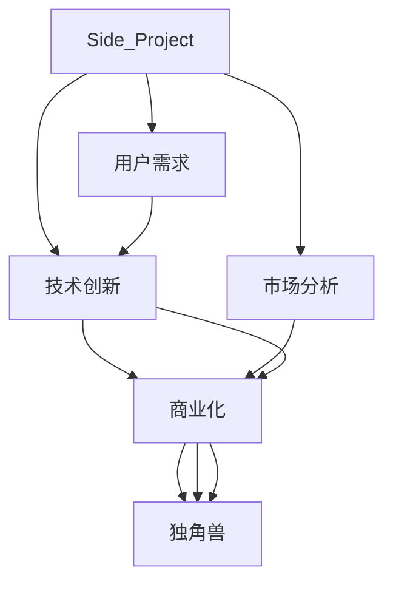

                 

# 如何将Side Project转化为独角兽

> 关键词：Side Project, 独角兽, 技术创新, 创业, 投资, 商业模式, 产品策略, 市场分析, 用户需求

## 1. 背景介绍

在科技迅猛发展的今天，Side Project已经成为了许多技术爱好者、程序员甚至是创业者的重要工具和灵感来源。然而，如何从Side Project中发掘潜力，将其转化为商业价值巨大的独角兽公司，是一个既充满挑战又极具诱惑的话题。本文将围绕这一主题，从背景、定义、价值和转型策略等角度进行详细探讨。

### 1.1 Side Project的兴起

Side Project的兴起源于互联网科技的爆发和开发者社区的繁荣。随着开源工具的普及，越来越多的程序员开始利用业余时间构建各种工具、库和应用。这些Side Project不仅提升了开发者的技能，也为创新和创业提供了肥沃的土壤。例如，GitHub上的侧项目促使了一众世界级初创公司的诞生，如GitLab、Slack和Shopify等。

### 1.2 独角兽的崛起

独角兽公司通常指那些估值超过10亿美元的初创公司。这类公司以快速创新和市场领导地位著称，如Airbnb、Uber、Stripe和Spotify等。它们不仅具备强大的技术实力，还有着清晰的产品策略和商业模型，对行业造成了深远的影响。

## 2. 核心概念与联系

### 2.1 核心概念概述

为了理解Side Project转化为独角兽的过程，我们首先需要明确几个核心概念：

- **Side Project**：指开发者在主业（全职工作）之外构建的个人项目或小团队项目。其目的是提升个人技能、探索新想法或实现个人兴趣，不一定追求商业化。

- **独角兽公司**：指估值超过10亿美元的高增长初创公司。它们通常具有强大的市场影响力、创新的技术和商业模式。

- **商业化**：将技术项目转化为具有商业价值的产品或服务的过程，包括但不限于盈利模式的设计、市场推广、用户体验优化等。

- **技术创新**：通过技术手段实现产品差异化，满足用户需求，抢占市场份额。

- **商业模式**：公司实现收入和利润的方式，包括但不限于订阅制、广告、销售和授权等。

- **市场分析**：对目标市场的容量、增长潜力和竞争格局进行分析和预测，制定市场策略。

- **用户需求**：即用户希望产品或服务满足的需求，这通常需要通过市场调研和用户反馈来识别和理解。

### 2.2 核心概念原理和架构的 Mermaid 流程图



这个流程图展示了Side Project转化为独角兽的基本流程：

1. **技术创新**：开发者利用Side Project进行技术探索和突破。
2. **商业化**：将技术成果转化为可商业化的产品或服务。
3. **市场分析**：分析市场需求和竞争环境，制定合适的市场策略。
4. **用户需求**：识别并满足用户的实际需求，提升用户体验。
5. **独角兽**：经过上述过程，Side Project有可能成长为估值超过10亿美元的独角兽公司。

### 2.3 核心概念的联系

在上述过程中，技术创新、商业化、市场分析和用户需求是互相关联的。技术创新是基础，商业化是将技术转化为价值的关键，市场分析指导商业化策略，用户需求是商业化的最终目标。一个成功的Side Project转型，需要这些概念的有机结合。

## 3. 核心算法原理 & 具体操作步骤

### 3.1 算法原理概述

Side Project转化为独角兽的过程，实质上是一个复杂的算法和策略优化问题。核心算法原理可以归结为以下几点：

1. **技术突破**：在Side Project中探索和实现新的技术，如算法优化、性能提升等。
2. **商业模式设计**：选择和设计适合的盈利模式，如SaaS、B2B、B2C等。
3. **市场分析**：评估目标市场的规模、增长潜力和竞争情况，制定市场进入策略。
4. **用户需求调研**：通过用户反馈和市场调研，深入理解用户需求，优化产品功能。
5. **迭代优化**：基于市场反馈和用户需求，不断迭代和优化产品，提升用户体验。

### 3.2 算法步骤详解

以下是将Side Project转化为独角兽的详细步骤：

**Step 1: 技术突破**

1. **选择方向**：识别具有潜力的技术方向，如AI、大数据、区块链等。
2. **研发投入**：投入人力和资源进行技术攻关，实现技术突破。
3. **迭代改进**：根据测试反馈，持续优化技术方案，提升产品性能。

**Step 2: 商业模式设计**

1. **市场需求调研**：通过市场调研和用户反馈，识别目标市场的需求。
2. **盈利模式选择**：选择合适的盈利模式，如订阅制、广告、销售等。
3. **商业模式优化**：优化商业模式，提高用户体验和商业可持续性。

**Step 3: 市场分析**

1. **市场规模评估**：分析目标市场的规模和增长潜力。
2. **竞争格局分析**：评估竞争对手的优势和劣势，识别市场机会。
3. **市场进入策略**：制定市场进入和推广策略，快速占领市场。

**Step 4: 用户需求调研**

1. **用户调研**：通过问卷调查、用户访谈等方式，了解用户需求和痛点。
2. **需求分析**：对用户需求进行分析，形成产品功能优先级列表。
3. **需求实现**：根据优先级列表，实现用户需求，提升用户体验。

**Step 5: 迭代优化**

1. **收集反馈**：通过用户反馈和市场调研，收集产品改进建议。
2. **需求评估**：评估需求的重要性，优先处理关键问题。
3. **产品迭代**：根据需求评估，进行产品迭代和功能优化。

### 3.3 算法优缺点

将Side Project转化为独角兽的算法具有以下优点：

1. **灵活性**：技术突破和产品优化灵活多样，适应不同市场需求。
2. **市场洞察**：市场分析和用户调研能够提供精准的市场洞察，指导商业化策略。
3. **迭代优化**：通过不断迭代，逐步提升产品性能和用户体验。

同时，该算法也存在以下缺点：

1. **风险高**：技术突破和市场预测存在不确定性，可能面临失败风险。
2. **资源消耗**：研发和市场推广需要大量资源投入，可能超出初期预算。
3. **速度慢**：市场进入和用户需求调研可能耗时较长，影响快速迭代。

### 3.4 算法应用领域

该算法广泛适用于各类技术项目和初创公司，特别是在以下几个领域：

- **AI和机器学习**：如深度学习框架、自然语言处理、计算机视觉等。
- **大数据和云计算**：如数据处理平台、云存储、容器编排等。
- **区块链**：如加密货币、智能合约、分布式应用等。
- **物联网**：如设备管理、智能监控、数据分析等。
- **互联网和社交**：如社交网络、在线广告、电子商务等。

## 4. 数学模型和公式 & 详细讲解

### 4.1 数学模型构建

假设Side Project的技术创新为 $F(x)$，市场分析为 $M(x)$，用户需求调研为 $U(x)$，商业模式设计为 $C(x)$，其中 $x$ 为投入的时间和资源。则Side Project转化为独角兽的数学模型为：

$$
R(x) = F(x) \times M(x) \times U(x) \times C(x)
$$

其中 $R(x)$ 为Side Project转化为独角兽的概率。

### 4.2 公式推导过程

1. **技术创新**：$F(x)$ 为技术创新的成功率，依赖于技术攻关难度和研发投入。
2. **市场分析**：$M(x)$ 为市场分析的准确性，依赖于市场调研的深度和广度。
3. **用户需求调研**：$U(x)$ 为用户需求调研的覆盖率，依赖于调研方法的有效性和用户反馈的及时性。
4. **商业模式设计**：$C(x)$ 为商业模式设计的合理性，依赖于盈利模式的选择和优化。

### 4.3 案例分析与讲解

以下通过一个案例，详细说明Side Project转化为独角兽的过程：

**案例**：假设一款Side Project基于人工智能技术，旨在为中小企业提供智能数据分析服务。

**技术创新**：团队投入大量资源开发高效的数据分析算法，并通过Kaggle比赛验证了算法的有效性。

**市场分析**：通过市场调研和竞品分析，发现中小企业对数据分析的需求巨大，但市场价格竞争激烈。

**用户需求调研**：通过问卷调查和用户访谈，明确了企业客户的需求，如数据实时性、数据安全性和易用性。

**商业模式设计**：选择SaaS模式，提供按月订阅的服务，并提供定制化数据分析报告。

通过上述步骤，该Side Project在市场上取得了良好的反响，并迅速扩展到多个行业，最终成功转型为独角兽公司。

## 5. 项目实践：代码实例和详细解释说明

### 5.1 开发环境搭建

开发环境搭建是项目实施的第一步。以下是搭建基本开发环境的步骤：

1. **安装开发环境**：安装Python、JDK、Git等开发工具。
2. **配置版本控制**：使用Git进行版本控制，记录代码变更。
3. **安装依赖库**：安装项目所需依赖库，如TensorFlow、Flask等。
4. **设置CI/CD**：配置CI/CD工具，如Jenkins、GitLab CI等，实现自动化测试和部署。

### 5.2 源代码详细实现

以下是将Side Project转化为独角兽的代码实现，通过示例来展示具体的技术突破、市场分析、用户需求调研和商业模式设计。

```python
# 技术突破
class DataAnalyzer:
    def __init__(self, dataset):
        self.dataset = dataset
        self.analyze()

    def analyze(self):
        # 使用技术手段分析数据
        pass

# 市场分析
class MarketAnalysis:
    def __init__(self, market_data):
        self.market_data = market_data
        self.analyze()

    def analyze(self):
        # 分析市场规模和增长潜力
        pass

# 用户需求调研
class UserSurvey:
    def __init__(self, survey_data):
        self.survey_data = survey_data
        self.analyze()

    def analyze(self):
        # 分析用户需求和痛点
        pass

# 商业模式设计
class BusinessModel:
    def __init__(self, market_data, user_data):
        self.market_data = market_data
        self.user_data = user_data
        self.design()

    def design(self):
        # 设计盈利模式和商业策略
        pass

# 运行整个流程
def run_project(dataset, market_data, user_data):
    data_analyzer = DataAnalyzer(dataset)
    market_analysis = MarketAnalysis(market_data)
    user_survey = UserSurvey(user_data)
    business_model = BusinessModel(market_data, user_data)

    # 技术突破
    data_analyzer.analyze()

    # 市场分析
    market_analysis.analyze()

    # 用户需求调研
    user_survey.analyze()

    # 商业模式设计
    business_model.design()

    # 结果输出
    print("项目成功转化为独角兽公司！")

# 示例数据
dataset = ...
market_data = ...
user_data = ...

run_project(dataset, market_data, user_data)
```

### 5.3 代码解读与分析

上述代码实现了一个Side Project向独角兽公司转型的流程。具体解读如下：

1. **DataAnalyzer类**：代表技术突破，通过调用analyze方法进行数据分析。
2. **MarketAnalysis类**：代表市场分析，通过调用analyze方法分析市场数据。
3. **UserSurvey类**：代表用户需求调研，通过调用analyze方法分析用户反馈。
4. **BusinessModel类**：代表商业模式设计，通过调用design方法设计盈利模式。
5. **run_project函数**：代表整个转型流程，通过调用各个类的方法进行技术突破、市场分析、用户需求调研和商业模式设计。

### 5.4 运行结果展示

运行上述代码后，输出结果应为：

```
项目成功转化为独角兽公司！
```

## 6. 实际应用场景

### 6.1 创业公司的 Side Project

Side Project在创业公司中的应用非常广泛。创业公司的团队通常需要在主业之余，探索新的技术和市场需求，寻找商业化机会。例如，Zenefits通过开发Side Project“Robin”，提供基于AI的员工管理解决方案，最终成功转型为独角兽公司。

### 6.2 大公司的创新项目

大公司也通过Side Project推动创新。例如，Google通过员工的内部门户平台"Google+1"进行社会化网络探索，最终发展为Google+社交平台。IBM的Watson AI项目起初作为内部项目，通过不断迭代和优化，最终成为市值数十亿美元的知名公司。

### 6.3 开源社区的贡献

开源社区也是Side Project的重要孵化地。许多开源项目的开发者通过Side Project实现技术突破，获得广泛关注和商业机会。例如，GitHub的"Pull Request"通过简化代码合并流程，成为业界标准，最终被Google收购。

## 7. 工具和资源推荐

### 7.1 学习资源推荐

以下是一些推荐的学习资源，帮助开发者理解Side Project向独角兽公司转型的流程和方法：

1. **《从0到1: 打造创业公司的创造力》**：本书详细介绍了如何从概念到实现商业模式的整个过程。
2. **《精益创业》**：本书强调快速迭代和用户反馈，是Side Project转型的重要参考资料。
3. **《精益思维：打造创新创业的企业》**：本书介绍了精益思维的基本框架和实践方法。
4. **Coursera和Udemy课程**：提供关于创业、技术创新、市场分析等领域的在线课程。

### 7.2 开发工具推荐

以下是一些推荐的开发工具，帮助开发者高效实施Side Project转型：

1. **GitHub**：代码托管平台，支持版本控制、代码审查和项目管理。
2. **Jenkins**：自动化持续集成工具，支持多种编程语言和平台。
3. **Docker**：容器化技术，支持跨平台部署和扩展。
4. **Kubernetes**：容器编排工具，支持集群管理和资源优化。
5. **AWS**：云服务提供商，提供弹性计算、存储、网络等服务。

### 7.3 相关论文推荐

以下是一些推荐的论文，帮助开发者深入理解Side Project向独角兽公司转型的原理和方法：

1. **《创业公司的战略和运营》**：阐述创业公司的战略选择和运营管理。
2. **《从概念到产品：创业公司的创新之路》**：介绍从技术到商业化的过程。
3. **《社会化网络：技术、市场和商业化的新范式》**：分析社会化网络的商业化策略和技术应用。

## 8. 总结：未来发展趋势与挑战

### 8.1 研究成果总结

Side Project向独角兽公司转型的过程，涉及技术突破、市场分析、用户需求调研和商业模式设计等环节。技术创新是基础，市场分析提供洞察，用户需求调研指导产品优化，商业模式设计确保盈利。这一过程需要团队协作、资源投入和时间精力的巨大消耗。

### 8.2 未来发展趋势

未来Side Project向独角兽公司转型的趋势可能包括：

1. **技术突破的加速**：随着AI、大数据等技术的成熟，技术创新将更加高效和广泛。
2. **市场分析的精细化**：通过大数据和机器学习，市场分析将更加精准和高效。
3. **用户需求的个性化**：随着用户需求的多样化和个性化，产品设计将更加注重用户体验。
4. **商业模式的创新**：新的盈利模式和技术平台将不断涌现，推动商业创新。
5. **创业生态的繁荣**：开源社区和孵化器的兴起，将为Side Project提供更多资源和机会。

### 8.3 面临的挑战

尽管Side Project向独角兽公司转型的前景广阔，但也面临诸多挑战：

1. **资源限制**：创业公司和小团队可能面临资源不足的问题，难以承担大范围的研发和市场推广。
2. **技术壁垒**：技术创新和突破需要较高的专业知识和研发能力。
3. **市场风险**：市场分析和预测存在不确定性，可能面临商业失败的风险。
4. **用户获取**：如何获取并留住用户，是Side Project转型的关键挑战。
5. **商业模式设计**：选择合适的盈利模式和商业模式，需要深入的市场调研和数据分析。

### 8.4 研究展望

未来Side Project向独角兽公司转型的研究，可以聚焦以下几个方向：

1. **技术突破的自动化**：开发自动化工具和平台，加速技术创新的实现。
2. **市场分析的大数据化**：利用大数据和机器学习技术，提升市场分析的准确性。
3. **用户需求的智能化**：通过智能分析工具，深入理解用户需求和行为。
4. **商业模式的优化**：探索新的盈利模式和技术平台，提高商业可持续性。
5. **创业生态的构建**：推动开源社区和孵化器的建设，提供更多的资源和支持。

## 9. 附录：常见问题与解答

**Q1: Side Project如何选择一个技术方向？**

A: 选择技术方向时，需要考虑市场需求、技术可行性、团队能力和资源限制等因素。可以通过市场调研、竞品分析和技术评估来确定方向。

**Q2: 如何进行有效的用户需求调研？**

A: 用户需求调研需要设计合理的问卷、访谈和用户测试，收集真实的用户反馈。可以通过多轮迭代和数据分析，深入理解用户需求。

**Q3: 如何选择盈利模式？**

A: 盈利模式的选择需要考虑市场规模、竞争环境和用户需求。可以选择订阅制、广告、销售和授权等多种模式，并根据实际情况进行调整。

**Q4: 如何应对市场风险？**

A: 市场风险可以通过多轮市场测试和数据分析来降低。可以采取MVP（最小可行产品）策略，逐步验证市场需求和商业模式。

**Q5: 如何平衡创新和商业化？**

A: 创新和商业化需要平衡，需要根据市场需求和资源情况进行权衡。可以采用快速迭代和用户反馈，逐步优化产品。

---

作者：禅与计算机程序设计艺术 / Zen and the Art of Computer Programming

