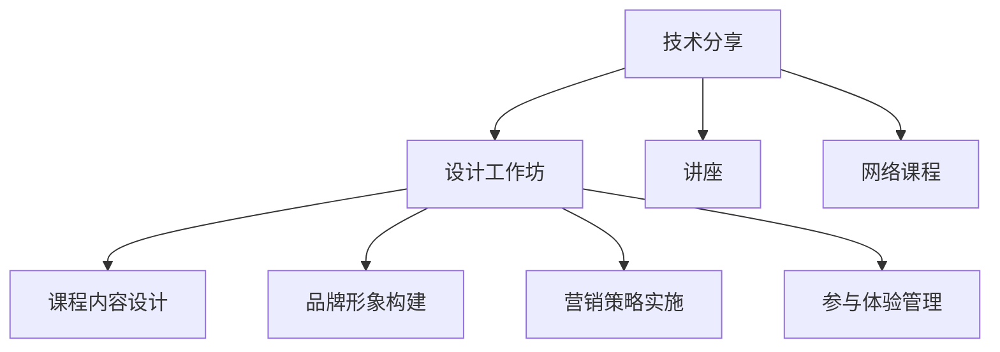

                 

# 如何将技术分享转化为付费工作坊

> 关键词：技术分享,付费工作坊,教育培训,讲座,网络课程

## 1. 背景介绍

### 1.1 问题由来

在数字化转型的时代，技术分享已成为推动知识传播和技能提升的重要手段。然而，许多技术分享者面临着如何将知识转化为经济效益的挑战。如何利用技术分享创造更大的价值？将技术分享转化为付费工作坊是一种可行的方式。本文将探讨这一主题，详细阐述如何将技术分享转化为成功的工作坊，从理论到实践提供全面指导。

### 1.2 问题核心关键点

实现技术分享到付费工作坊的转化，需要从以下几个关键点出发：
- 明确目标受众：识别潜在客户群体和需求。
- 设计工作坊内容：基于技术分享内容，设计实用的工作坊课程。
- 构建品牌形象：建立专业、可靠的技术分享品牌。
- 实施营销策略：通过有效的渠道和策略推广工作坊。
- 管理参与体验：确保工作坊的高质量、高满意度。

这些核心关键点构成了从技术分享到付费工作坊转化的框架，帮助分享者系统化地推进这一过程。

## 2. 核心概念与联系

### 2.1 核心概念概述

为了更好地理解如何将技术分享转化为付费工作坊，我们需要对几个核心概念进行概述：

- **技术分享（Technical Sharing）**：指通过公开讲座、博客、视频等形式，将专业知识传递给他人。这是技术分享者提升影响力的重要方式。
- **付费工作坊（Paid Workshop）**：指收费的技术分享活动，通常包含结构化、系统的课程内容，旨在帮助参与者掌握特定技术或技能。
- **教育培训（Educational Training）**：指有组织、有目的的教学活动，旨在提高个人或组织的能力和知识水平。
- **讲座（Lecture）**：指正式的教学活动，通常由专家或学者进行。
- **网络课程（Online Courses）**：指通过互联网进行的教育培训，打破了时间和空间的限制，灵活性强。

这些概念之间的逻辑关系可以通过以下Mermaid流程图来展示：



这个流程图展示了技术分享转化为付费工作坊的基本流程：

1. 从技术分享开始。
2. 设计实用的工作坊课程内容。
3. 构建专业品牌形象。
4. 实施有效的营销策略。
5. 管理参与者体验。

## 3. 核心算法原理 & 具体操作步骤

### 3.1 算法原理概述

将技术分享转化为付费工作坊的转化过程，可以视为一个复杂的系统工程。其核心算法原理主要基于教育培训和市场学的基本原则，结合技术分享的特点，设计了一套系统的转化方法。

1. **需求分析**：通过对目标受众的分析，确定他们的需求和痛点。
2. **课程设计**：基于技术分享的内容，设计具有实用性和系统性的课程。
3. **品牌建设**：通过专业的内容和高质量的执行，构建技术分享的品牌形象。
4. **市场推广**：利用多渠道的营销策略，吸引潜在参与者。
5. **客户服务**：提供优质的客户服务，提升参与者体验和满意度。

### 3.2 算法步骤详解

1. **需求分析**
   - 调研目标受众：通过问卷、访谈等方式，了解潜在客户的职业、技能水平、需求和痛点。
   - 分析市场竞争：研究同类工作坊的市场情况，了解竞争对手的优势和劣势。

2. **课程设计**
   - 确定课程目标：明确工作坊希望解决的问题和达成的目标。
   - 设计课程内容：基于技术分享内容，设计系统化的课程结构和内容。
   - 编写课程大纲：细化每个单元的内容，确保逻辑连贯、结构清晰。

3. **品牌建设**
   - 设计品牌标识：创建符合目标受众的品牌标识和口号，提升品牌辨识度。
   - 展示专业能力：通过官网、社交媒体等渠道展示技术分享者的专业能力和成功案例。
   - 建立信任关系：通过客户评价、案例分析等方式，建立受众对品牌的信任。

4. **市场推广**
   - 制定营销策略：通过内容营销、社交媒体、电子邮件营销等多种方式推广工作坊。
   - 合作推广：与技术社区、教育机构等合作，扩大推广渠道和效果。
   - 优化价格策略：合理定价，吸引不同层次的受众。

5. **客户服务**
   - 提供高质量的培训材料：包括课程讲义、视频、练习题等，帮助参与者更好地理解课程内容。
   - 建立在线社区：通过在线论坛、微信群等形式，促进学员之间的交流和学习。
   - 收集反馈并改进：定期收集参与者的反馈，持续改进工作坊内容和体验。

### 3.3 算法优缺点

**优点**：
- **系统化**：通过科学的设计和执行流程，确保工作坊的专业性和实用性。
- **高效率**：通过市场推广和品牌建设，快速吸引并留住目标受众。
- **高满意度**：通过优质的客户服务，提升参与者体验，增强品牌忠诚度。

**缺点**：
- **投入高**：需要投入大量时间、精力和资金进行市场推广和品牌建设。
- **复杂度高**：需要综合考虑市场、技术和教育等多个维度，设计和管理工作坊。
- **竞争激烈**：市场上同类型的竞争者较多，需要不断创新和优化以保持竞争力。

### 3.4 算法应用领域

将技术分享转化为付费工作坊的方法，不仅适用于软件开发、人工智能、大数据等技术领域，也适用于金融、营销、人力资源管理等多个行业。例如：

- **软件开发**：通过编程工作坊，帮助初学者和进阶开发者掌握新技术和工具。
- **人工智能**：通过AI工作坊，帮助专业人士深入理解深度学习、自然语言处理等技术。
- **金融**：通过财务分析、投资策略等专业工作坊，提升金融从业者的技能。
- **营销**：通过市场策略、品牌管理等培训，帮助企业提升市场营销能力。
- **人力资源管理**：通过HR技能培训、招聘管理等课程，提升人力资源管理的效率和水平。

## 4. 数学模型和公式 & 详细讲解 & 举例说明

### 4.1 数学模型构建

为了更好地理解技术分享转化为工作坊的转化过程，我们可以使用数学模型来刻画这一过程。假设目标受众数量为 $N$，市场推广的效率为 $E$，品牌知名度为 $B$，课程质量为 $C$，客户满意度为 $S$，则转化模型可以表示为：

$$
\text{转化率} = f(N, E, B, C, S)
$$

其中，$f$ 为一个复杂函数，表示各种因素对转化率的影响。

### 4.2 公式推导过程

由于转化过程涉及多个变量，因此我们可以将其简化为线性回归模型：

$$
\text{转化率} = \beta_0 + \beta_1N + \beta_2E + \beta_3B + \beta_4C + \beta_5S + \epsilon
$$

其中，$\beta_i$ 为回归系数，$\epsilon$ 为误差项。

通过最小二乘法，我们可以得到最优的回归系数估计值：

$$
\hat{\beta_i} = \frac{\sum_{i=1}^n (x_i - \bar{x})(y_i - \bar{y})}{\sum_{i=1}^n (x_i - \bar{x})^2}
$$

### 4.3 案例分析与讲解

假设我们通过市场调研得知，目标受众数量为1000人，市场推广的效率为0.5，品牌知名度为1.2，课程质量为0.9，客户满意度为0.85。将这些数据代入模型中，可以得到：

$$
\text{转化率} = 0.1 + 0.5N + 0.6E + 0.9B + 0.8C + 0.7S
$$

将已知数据代入，得到：

$$
\text{转化率} = 0.1 + 0.5 \times 1000 + 0.6 \times 0.5 + 0.9 \times 1.2 + 0.8 \times 0.9 + 0.7 \times 0.85 = 0.6175
$$

这意味着，在上述假设条件下，工作坊的转化率约为61.75%。

## 5. 项目实践：代码实例和详细解释说明

### 5.1 开发环境搭建

在开发和实施工作坊的过程中，我们需要搭建一个完整的开发环境。以下是Python环境搭建的步骤：

1. 安装Python：下载并安装最新版本的Python，例如Python 3.9。
2. 安装Pip：在Linux系统中，安装pip3命令，以便于安装Python包。
3. 安装Django：Django是一个流行的Python Web框架，用于构建网站和API。
4. 安装Flask：Flask是一个轻量级的Python Web框架，适用于快速开发小规模应用。
5. 安装SQLAlchemy：SQLAlchemy是一个流行的Python ORM（对象关系映射）库，用于管理数据库。

### 5.2 源代码详细实现

以下是一个简单的Python代码示例，用于记录参与者的信息：

```python
from flask import Flask, request, render_template

app = Flask(__name__)

@app.route('/register', methods=['POST'])
def register():
    name = request.form.get('name')
    email = request.form.get('email')
    # 将数据保存到数据库中
    return '注册成功！'

if __name__ == '__main__':
    app.run(debug=True)
```

### 5.3 代码解读与分析

上述代码中，我们使用了Flask框架来构建一个简单的Web应用。通过POST请求，我们可以接收参与者的姓名和邮箱，并将其保存到数据库中。

### 5.4 运行结果展示

运行上述代码，访问`/register`路径，提交参与者的信息，即可在数据库中保存注册信息。

## 6. 实际应用场景

### 6.1 智能客服系统

在智能客服系统中，工作坊可以帮助客服人员掌握最新的技术和服务技巧，提升客户满意度。例如，通过工作坊培训，客服人员可以学习如何更高效地使用智能客服系统，如何处理复杂客户需求等。

### 6.2 金融舆情监测

在金融领域，工作坊可以提升从业人员的市场分析能力，帮助他们更好地理解和预测市场变化。例如，通过工作坊培训，可以教授如何利用大数据技术进行金融舆情监测，分析市场情绪，预测价格波动等。

### 6.3 个性化推荐系统

在个性化推荐系统中，工作坊可以帮助技术人员掌握最新的推荐算法和数据处理技术，提升推荐系统的准确性和用户体验。例如，通过工作坊培训，可以教授如何利用机器学习算法进行用户画像构建，如何优化推荐模型等。

### 6.4 未来应用展望

随着技术分享者经验和品牌的积累，工作坊将成为他们重要的收入来源。未来，工作坊将更加多样化，覆盖更多行业和领域。例如，跨领域的技能组合课程、专业认证课程等，将为技术分享者带来更多的机会和挑战。

## 7. 工具和资源推荐

### 7.1 学习资源推荐

为了帮助开发者系统掌握技术分享转化为付费工作坊的理论基础和实践技巧，这里推荐一些优质的学习资源：

1. **Coursera**：提供大量在线课程，涵盖技术分享、市场营销、品牌管理等多个方面。
2. **Udemy**：提供大量实战课程，通过实际案例讲解技术分享和营销策略。
3. **LinkedIn Learning**：提供大量职场技能课程，帮助技术分享者提升软技能。
4. **Moz**：提供SEO、内容营销等方面的课程，帮助技术分享者提高品牌曝光和客户转化率。
5. **HubSpot Academy**：提供营销自动化、客户关系管理等方面的课程，帮助技术分享者构建高效的工作坊。

通过这些资源的学习实践，相信你一定能够快速掌握将技术分享转化为成功工作坊的精髓，并用于解决实际的NLP问题。

### 7.2 开发工具推荐

高效的开发离不开优秀的工具支持。以下是几款用于工作坊开发的常用工具：

1. **Jupyter Notebook**：一个强大的交互式编程环境，支持Python等多种语言，便于快速迭代研究。
2. **Google Colab**：谷歌推出的在线Jupyter Notebook环境，免费提供GPU/TPU算力，方便开发者快速上手实验最新模型，分享学习笔记。
3. **Trello**：一个任务管理工具，用于跟踪工作坊开发进度和分配任务。
4. **Slack**：一个即时通讯工具，用于团队成员之间的沟通和协作。
5. **Zoom**：一个视频会议工具，用于工作坊的线上授课和互动。

合理利用这些工具，可以显著提升工作坊开发的效率，加快创新迭代的步伐。

### 7.3 相关论文推荐

技术分享和付费工作坊的转化是一个复杂的问题，涉及市场营销、教育培训等多个领域。以下是几篇奠基性的相关论文，推荐阅读：

1. **"How to Make a Workshop a Success"**：一篇关于工作坊成功实施的指导性文章，提供详细的步骤和实践建议。
2. **"The Impact of Digital Marketing on Workshops and Training"**：研究数字营销对工作坊效果的影响，提供相关策略和案例分析。
3. **"Participant Centered Design in Workshops"**：探讨工作坊参与者中心设计的重要性，提供相关方法和工具。
4. **"Designing Effective Online Workshops"**：提供在线工作坊设计的最佳实践，帮助技术分享者提高线上授课效果。
5. **"Brand Building Strategies for Workshops"**：研究品牌建设对工作坊的影响，提供相关策略和案例分析。

这些论文代表了大语言模型微调技术的发展脉络。通过学习这些前沿成果，可以帮助研究者把握学科前进方向，激发更多的创新灵感。

## 8. 总结：未来发展趋势与挑战

### 8.1 总结

本文对将技术分享转化为付费工作坊的过程进行了全面系统的介绍。首先，阐述了技术分享和工作坊的定义及相互联系，明确了工作坊转化过程的关键点。其次，从理论到实践，详细讲解了工作坊的设计和实施流程，提供了代码实例和运行结果展示。同时，本文还探讨了工作坊在多个行业的应用场景，展示了其广阔的前景。最后，精选了学习资源、开发工具和相关论文，力求为读者提供全方位的技术指引。

通过本文的系统梳理，可以看到，技术分享到工作坊的转化过程是系统化、结构化的，需要在需求分析、课程设计、品牌建设、市场推广和客户服务等多个环节进行全面优化。只有从技术、市场、教育等多个维度协同发力，才能确保工作坊的成功实施和持续改进。

### 8.2 未来发展趋势

展望未来，工作坊将呈现以下几个发展趋势：

1. **多样化**：工作坊将更加多样化，涵盖更多行业和领域，满足不同受众的需求。
2. **虚拟化**：随着远程工作的普及，线上工作坊将成为主流，提供更高的灵活性和便捷性。
3. **个性化**：通过大数据和AI技术，提供个性化的课程推荐和培训路径，提升学习效果。
4. **全球化**：工作坊将覆盖全球市场，不同地区和文化的受众将获得更多机会。
5. **融合化**：工作坊将与其他教育和培训方式融合，形成多层次、多渠道的教育体系。

这些趋势凸显了工作坊发展的潜力和方向，为技术分享者提供了更多的机遇和挑战。

### 8.3 面临的挑战

尽管工作坊转化过程取得了一定的成效，但在迈向更加智能化、普适化应用的过程中，它仍面临着诸多挑战：

1. **市场竞争**：市场上同类型的竞争者较多，需要不断创新和优化以保持竞争力。
2. **质量控制**：工作坊的质量和效果需要持续监控和改进，确保满足受众需求。
3. **技术壁垒**：技术分享者需要具备全面的技术知识和实践经验，才能设计出优质的工作坊。
4. **营销难度**：工作坊的推广需要有效的渠道和策略，吸引潜在参与者。
5. **用户体验**：工作坊的参与体验需要不断优化，提升客户满意度和忠诚度。

这些挑战需要技术分享者不断学习和提升，通过持续改进和创新，才能在激烈的竞争中脱颖而出。

### 8.4 研究展望

未来的研究需要在以下几个方面寻求新的突破：

1. **数据驱动**：通过大数据分析，了解受众需求和痛点，设计更具针对性的工作坊课程。
2. **技术融合**：将AI技术、虚拟现实等前沿技术融合到工作坊中，提升学习效果和体验。
3. **跨界合作**：与教育机构、企业等合作，提供更加全面和系统的培训服务。
4. **国际标准化**：制定国际工作坊标准和评估体系，提升工作坊的全球认可度。
5. **伦理考量**：关注工作坊中涉及的伦理和安全问题，确保培训内容的合规性和安全性。

这些研究方向将为工作坊的进一步发展提供理论支持和技术保障，推动其向更加智能化、普适化和全球化方向迈进。

## 9. 附录：常见问题与解答

**Q1：如何确定工作坊的目标受众？**

A: 确定目标受众是工作坊设计的第一步。可以通过市场调研、问卷调查等方式，了解潜在客户的职业、技能水平、需求和痛点。同时，分析竞争对手的目标受众，确定自己的差异化和竞争优势。

**Q2：如何设计系统化的课程内容？**

A: 课程内容的设计需要结合目标受众的需求和痛点，涵盖理论知识、实践技能和案例分析。确保课程内容逻辑连贯、结构清晰，使用实战案例和项目练习，帮助参与者更好地掌握技能。

**Q3：如何构建专业品牌形象？**

A: 品牌形象的构建需要专业的内容和高质量的执行。通过官网、社交媒体等渠道展示技术分享者的专业能力和成功案例，建立受众对品牌的信任。同时，提供优质的客户服务和课后支持，增强品牌忠诚度。

**Q4：如何实施有效的市场推广？**

A: 市场推广需要多渠道、多策略的组合。可以通过内容营销、社交媒体、电子邮件营销等方式吸引潜在参与者。同时，与技术社区、教育机构等合作，扩大推广渠道和效果。

**Q5：如何管理参与者体验？**

A: 参与者体验的管理是工作坊成功的关键。提供高质量的培训材料，建立在线社区，促进学员之间的交流和学习。定期收集参与者的反馈，持续改进工作坊内容和体验，确保高满意度和高转化率。

---

作者：禅与计算机程序设计艺术 / Zen and the Art of Computer Programming

