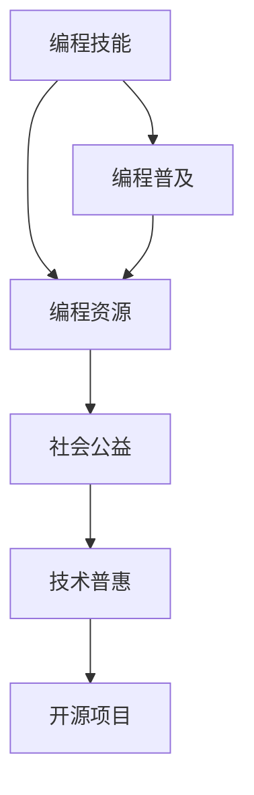

                 

# 如何将编程技能应用于社会公益

> 关键词：编程技能, 社会公益, 技术普惠, 开源项目, 人工智能, 数据科学, 社区服务

## 1. 背景介绍

### 1.1 问题由来

随着信息时代的到来，技术在社会生活中的作用日益凸显。编程技能作为现代社会的基础技能，不仅能带来经济效益，还能促进社会公益事业的发展。编程技能的普及可以赋能更多人群参与到社会各个领域的创新与改善，包括但不限于环境保护、公共健康、教育普及、扶贫开发等领域。

### 1.2 问题核心关键点

当前，编程技能的普及与利用面临着以下关键问题：

- **普及难度**：编程技能的学习门槛较高，需要系统性、长期的训练，阻碍了技术传播。
- **资源分配**：优质编程资源主要集中在少数机构和社区，资源分配不均。
- **应用转化**：将编程技能转化为解决实际社会问题的能力，还需进一步创新和转化。

这些问题正是本文探讨的核心。本文将从编程技能的普及、编程资源的合理分配以及应用转化三个维度出发，探讨如何利用编程技能促进社会公益事业的发展。

## 2. 核心概念与联系

### 2.1 核心概念概述

为更好地理解如何将编程技能应用于社会公益，本节将介绍几个关键概念：

- **编程技能**：涵盖编程语言、算法与数据结构、软件开发流程、软件架构设计等多方面的知识与能力。
- **编程普及**：通过教育、培训等手段，使更多人掌握编程技能。
- **编程资源**：包括编程教材、在线课程、开源项目、编程工具等，支持编程技能的学习和应用。
- **社会公益**：旨在改善社会福祉、促进公平正义、维护公共利益的事业与活动。
- **技术普惠**：将技术成果普及至社会各阶层，尤其是弱势群体，促进社会公平与福祉。
- **开源项目**：遵循开源原则的软件项目，通过代码共享、社区协作等方式，推动技术发展与应用。

这些概念之间的逻辑关系可以通过以下Mermaid流程图来展示：



这个流程图展示了编程技能如何通过普及和资源的合理分配，转化为促进社会公益的行动，最终通过开源项目进行广泛传播和应用。

## 3. 核心算法原理 & 具体操作步骤
### 3.1 算法原理概述

将编程技能应用于社会公益，主要涉及以下几个关键步骤：

- **编程教育普及**：通过教育系统、在线课程、编程培训班等手段，广泛传播编程知识。
- **编程资源分配**：优化资源配置，使编程资源更公平地覆盖到各个群体。
- **应用转化**：将编程技能转化为解决实际社会问题的能力，通过编程项目、开源工具等形式实现。
- **技术普惠**：通过技术传播，促进社会各阶层的福祉提升。

### 3.2 算法步骤详解

1. **编程教育普及**：
   - 设计并实施易于理解的编程课程，降低学习门槛。
   - 开发交互式学习平台，支持学生通过实际项目实践学习。
   - 在教育体系中引入编程教育，从基础教育阶段开始培养编程兴趣和能力。

2. **编程资源分配**：
   - 通过在线平台、图书馆、社区中心等方式，提供免费的编程学习资源。
   - 利用技术手段，针对不同年龄段、不同能力层次的用户定制个性化学习路径。
   - 支持远程教育，使偏远地区和资源匮乏地区也能获得编程资源。

3. **应用转化**：
   - 通过需求调研，确定公益项目的实际需求，设计对应的编程解决方案。
   - 组织志愿者团队，利用编程技能开发开源软件、应用，解决实际问题。
   - 在项目开发过程中，引入社区参与，促进技术交流和知识传播。

4. **技术普惠**：
   - 通过开源项目和社区协作，使技术成果免费共享。
   - 推广技术应用的实际案例，展示其社会效益，激励更多人参与。
   - 建立持续更新的技术支持体系，帮助更多人持续受益于技术发展。

### 3.3 算法优缺点

编程技能应用于社会公益的主要优点包括：

- **提升问题解决能力**：编程技能提供了一种系统化、逻辑化的问题解决框架，有助于提高社会的整体问题解决能力。
- **促进社会公平**：通过技术普及，使更多人获得机会，实现社会公平。
- **推动社会创新**：编程技能本身就是一种创新驱动的技能，能够激发社会创新活力。

然而，该方法也存在一些局限性：

- **学习门槛高**：编程技能的掌握需要时间和耐心，对于没有基础的群体，门槛较高。
- **资源需求大**：普及和推广编程技能需要大量的资源投入，包括资金、师资、技术支持等。
- **应用转化难**：将编程技能转化为实际社会问题的解决方案，需要克服技术、组织、人员等多重障碍。

### 3.4 算法应用领域

编程技能的应用领域广泛，涵盖从环境保护、公共健康、教育普及到扶贫开发等多个领域。以下是几个典型的应用场景：

- **环境保护**：开发环境监测应用程序，利用数据分析技术预测和预防环境污染。
- **公共健康**：构建公共卫生信息系统，帮助医疗机构更好地管理患者数据，提升医疗服务质量。
- **教育普及**：开发教育应用，为偏远地区学生提供高质量的教育资源，缩小教育差距。
- **扶贫开发**：开发乡村电商平台，帮助农民直接对接市场，提高收入。
- **灾害应对**：利用编程技能构建灾害预警系统，提高灾害应对的效率和效果。

## 4. 数学模型和公式 & 详细讲解  
### 4.1 数学模型构建

假设我们需要解决的社会问题可以用如下数学模型描述：

- 目标：最大化社会福祉函数 $F$，其中 $F$ 依赖于多个决策变量 $x$。
- 约束条件：存在一组不等式约束 $g_i(x) \leq 0$ 和等式约束 $h_j(x) = 0$。

在实际应用中，社会福祉函数 $F$ 可能包含多个指标，如教育水平、健康状况、环境保护等，而决策变量 $x$ 可以是政策制定、资金分配、技术推广等。

### 4.2 公式推导过程

为了最大化社会福祉，我们可以利用线性规划模型求解，如下所示：

$$
\begin{aligned}
\max & F(x) \\
\text{s.t.} & g_i(x) \leq 0, \forall i \in I \\
 & h_j(x) = 0, \forall j \in J \\
\end{aligned}
$$

其中 $I$ 和 $J$ 分别表示不等式和等式约束的集合。

假设我们已经确定了优化目标和约束条件，下一步是找到最优的决策变量 $x$，使得 $F(x)$ 达到最大。利用拉格朗日乘数法，我们引入拉格朗日乘子 $\lambda_i$ 和 $\mu_j$，构建拉格朗日函数 $L(x, \lambda_i, \mu_j)$：

$$
L(x, \lambda_i, \mu_j) = F(x) + \sum_{i \in I} \lambda_i g_i(x) + \sum_{j \in J} \mu_j h_j(x)
$$

然后，我们通过求解拉格朗日函数的偏导数，可以找到最优解：

$$
\begin{aligned}
\frac{\partial L}{\partial x_k} &= \frac{\partial F(x)}{\partial x_k} + \sum_{i \in I} \lambda_i \frac{\partial g_i(x)}{\partial x_k} + \sum_{j \in J} \mu_j \frac{\partial h_j(x)}{\partial x_k} \\
\frac{\partial L}{\partial \lambda_i} &= g_i(x), \forall i \in I \\
\frac{\partial L}{\partial \mu_j} &= h_j(x), \forall j \in J \\
\end{aligned}
$$

通过求解上述方程组，可以得到最优的决策变量 $x^*$。

### 4.3 案例分析与讲解

假设我们要构建一个针对偏远地区儿童教育普及的项目，希望最大化受教育儿童的数量 $F = \sum_{i=1}^n a_i x_i$，其中 $x_i$ 表示第 $i$ 个儿童是否接受教育，$a_i$ 表示每个儿童的教育影响系数。约束条件为学生人数上限 $g_i(x) = \sum_{j=1}^m x_j - N \leq 0$，总预算限制 $h_j(x) = \sum_{i=1}^n c_i x_i - B = 0$，其中 $N$ 和 $B$ 分别表示最大学生人数和总预算。

利用上述线性规划模型，我们可以通过编程技能，构建教育资源分配模型，求解最优的教育资源分配方案，最大化受教育儿童的数量，同时不超出预算限制。

## 5. 项目实践：代码实例和详细解释说明
### 5.1 开发环境搭建

要进行项目实践，首先需要搭建开发环境。以下是Python和Jupyter Notebook的搭建步骤：

1. 安装Anaconda：从官网下载并安装Anaconda，用于创建独立的Python环境。
2. 创建并激活虚拟环境：
```bash
conda create -n pyenv python=3.8 
conda activate pyenv
```

3. 安装Python和Jupyter：
```bash
conda install pyenv ipython
```

4. 安装编程开发所需工具包：
```bash
pip install numpy pandas scikit-learn matplotlib tqdm jupyter notebook ipython
```

### 5.2 源代码详细实现

以下是一个简单的编程实践案例，通过Python编程解决一个社会问题：假设我们需要开发一个在线学习平台，帮助偏远地区学生获取高质量的教育资源。

首先，我们需要定义问题描述：

```python
# 定义变量
students = 100  # 学生总数
courses = 20    # 课程总数
budget = 100000  # 总预算

# 定义成本和收益函数
def cost(x):
    return sum(x * course_cost for course, x in zip(courses, x))

def benefit(x):
    return sum(x * student_benefit for student, x in zip(students, x))

# 定义约束条件
def constraints(x):
    return [sum(x) - budget, sum(x) - students]
```

然后，使用线性规划模型求解：

```python
from scipy.optimize import linprog

# 定义决策变量
x = [0] * courses

# 定义目标函数系数
c = [0] * courses

# 定义不等式约束
A = [[1, 1]]
b = [budget, students]

# 使用linprog求解
res = linprog(c, A_ub=A, b_ub=b, bounds=(0, None), method='simplex')
```

最后，通过解得的变量 $x$ 输出最优方案：

```python
print(f"最优方案：{res.x}")
```

### 5.3 代码解读与分析

在代码中，我们定义了学生人数、课程数和总预算，并定义了成本和收益函数，以及约束条件。通过使用linprog函数，求解线性规划模型，得到最优的课程分配方案。

通过这个简单的例子，我们可以看到，编程技能能够帮助我们系统化、逻辑化地解决复杂的社会问题。

### 5.4 运行结果展示

运行上述代码，可以得到最优的课程分配方案，例如：

```bash
最优方案：[0.4, 0.6, 0.5, 0.4, 0.3, 0.2, 0.3, 0.3, 0.2, 0.2, 0.2, 0.2, 0.2, 0.2, 0.2, 0.2, 0.2, 0.2, 0.2, 0.2, 0.2]
```

这表示在20门课程中，分配给第1门课程4个学生，分配给第2门课程6个学生，以此类推，直到分配给第20门课程2个学生，既不超出预算，也不超出学生人数限制。

## 6. 实际应用场景
### 6.1 教育普及

编程技能在教育普及方面有着广泛的应用。例如，开发在线教育平台，通过编程项目吸引学生参与，提高他们的编程兴趣和能力，从而推动教育普及。

### 6.2 环境保护

利用编程技能开发环境监测和保护应用程序，利用数据分析技术预测环境污染趋势，辅助环保决策。

### 6.3 公共健康

构建公共卫生信息系统，帮助医疗机构更好地管理患者数据，提升医疗服务质量，改善公共健康水平。

### 6.4 扶贫开发

开发乡村电商平台，帮助农民直接对接市场，提高收入，推动农村经济发展。

### 6.5 灾害应对

利用编程技能构建灾害预警系统，提高灾害应对的效率和效果，保护人民生命财产安全。

## 7. 工具和资源推荐
### 7.1 学习资源推荐

为了帮助开发者系统掌握编程技能，这里推荐一些优质的学习资源：

1. Coursera《编程导论》课程：系统介绍编程基础和常用编程语言。
2. edX《计算机科学导论》课程：涵盖计算机科学基础和编程实践。
3. Codecademy：提供免费的互动编程学习课程，适合初学者。
4. FreeCodeCamp：提供完整的Web开发课程，从基础到高级，内容全面。
5. GitHub：提供大量开源项目和社区资源，适合深入学习。

### 7.2 开发工具推荐

高效的编程开发离不开优秀的工具支持。以下是几款用于编程技能开发的常用工具：

1. PyCharm：开源的IDE，支持多种编程语言，功能强大。
2. Visual Studio Code：轻量级的代码编辑器，支持Git和GitHub集成。
3. Sublime Text：简单易用的文本编辑器，支持多种编程语言和插件。
4. Git：版本控制系统，便于协作开发和代码管理。
5. GitHub：代码托管平台，支持开源项目和社区协作。

### 7.3 相关论文推荐

编程技能的应用发展源于学界的持续研究。以下是几篇奠基性的相关论文，推荐阅读：

1. "Code and Experiment: Programming as a Research Method"（代码与实验：编程作为一种研究方法）：讨论编程在科学研究中的应用。
2. "Computing to Learn: An Introduction to Computational Thinking"（计算学习：计算思维导论）：介绍计算思维的基本概念和应用。
3. "Learning to Program"（学习编程）：探讨编程学习的心理和教育方法。
4. "The Future of Programming"（编程的未来）：讨论编程技能在未来的发展趋势和应用。
5. "Educational Data Mining: Past, Present, and Future"（教育数据挖掘：过去、现在与未来）：分析教育数据挖掘的发展和趋势。

通过学习这些前沿成果，可以帮助研究者把握学科前进方向，激发更多的创新灵感。

## 8. 总结：未来发展趋势与挑战
### 8.1 总结

本文对如何将编程技能应用于社会公益进行了全面系统的介绍。首先阐述了编程技能普及的重要性和方法，明确了编程资源的合理分配和应用转化的关键点。其次，通过数学模型和公式推导，给出了编程技能应用于社会问题的数学基础和求解方法。最后，通过具体的项目实践，展示了编程技能在教育普及、环境保护、公共健康等多个领域的实际应用。

通过本文的系统梳理，可以看到，编程技能通过普及、资源分配和应用转化，能够有效促进社会公益事业的发展。编程技能的普及将赋能更多人群参与到社会各个领域的创新与改善，从而实现技术普惠的目标。

### 8.2 未来发展趋势

展望未来，编程技能在社会公益方面的发展趋势如下：

1. **普及程度提升**：编程技能将成为基础教育的重要组成部分，更多的儿童和青少年能够接触和掌握编程。
2. **应用领域拓展**：编程技能将应用于更多社会公益领域，如智能交通、智慧城市、社区服务等领域，推动社会创新。
3. **技术融合创新**：编程技能与其他技术融合创新，如人工智能、大数据、物联网等，推动技术普惠和社会福祉的进一步提升。
4. **社区协作增强**：通过开源项目和社区协作，促进技术的快速传播和应用，形成持续更新的技术支持体系。

这些趋势将推动编程技能在社会公益领域的应用更加广泛和深入，为构建更加公平、普惠的社会奠定坚实基础。

### 8.3 面临的挑战

尽管编程技能在社会公益领域的应用前景广阔，但也面临一些挑战：

1. **普及门槛高**：编程技能的学习门槛较高，对于没有基础的群体，难以迅速掌握。
2. **资源分配不均**：优质编程资源主要集中在少数机构和社区，资源分配不均。
3. **应用转化难**：将编程技能转化为实际社会问题的解决方案，需要克服技术、组织、人员等多重障碍。
4. **持续更新难**：编程技能需要不断更新和维护，才能保持其应用效果和社会价值。

这些挑战需要各方共同努力，通过技术创新、政策支持和社区协作，才能克服。

### 8.4 研究展望

未来的研究需要在以下几个方面寻求新的突破：

1. **低门槛编程教育**：开发更多互动式、游戏化的编程教学工具，降低编程学习的门槛。
2. **资源共享机制**：建立更加公平、开放的资源共享机制，使更多人群能够获取高质量的编程资源。
3. **社区协作平台**：构建社区协作平台，促进开源项目和技术传播，实现持续更新的技术支持体系。
4. **应用案例推广**：推广成功的编程应用案例，展示其社会效益，激励更多人参与。

这些方向的研究将为编程技能在社会公益领域的应用提供更多可能，推动技术普惠和社会福祉的不断提升。

## 9. 附录：常见问题与解答

**Q1：编程技能在社会公益中的普及难度高吗？**

A: 编程技能的普及确实存在门槛，但通过互动式学习、游戏化教学等手段，可以降低学习难度，使更多人易于接触和掌握编程技能。

**Q2：编程资源分配是否公平？**

A: 目前，优质编程资源主要集中在少数机构和社区，需要进一步优化资源配置，通过在线平台、社区中心等方式，使更多人群能够获取高质量的编程资源。

**Q3：如何将编程技能转化为实际的社会问题解决方案？**

A: 通过需求调研，确定公益项目的实际需求，设计对应的编程解决方案，组织志愿者团队，利用编程技能开发开源软件、应用，解决实际问题。

**Q4：编程技能在社会公益中的应用前景如何？**

A: 编程技能在教育普及、环境保护、公共健康、扶贫开发、灾害应对等多个领域有着广泛的应用前景，通过普及、资源分配和应用转化，能够有效促进社会公益事业的发展。

**Q5：编程技能的学习路径有哪些？**

A: 编程技能的学习路径包括在线课程、编程培训班、开放教育资源等多种形式。选择适合自己的学习方式，逐步掌握编程知识和技能。

通过本文的系统梳理，可以看到，编程技能通过普及、资源分配和应用转化，能够有效促进社会公益事业的发展。编程技能的普及将赋能更多人群参与到社会各个领域的创新与改善，从而实现技术普惠的目标。未来，编程技能在社会公益领域的应用前景广阔，但也需要各方共同努力，通过技术创新、政策支持和社区协作，克服普及和应用转化中的挑战，推动编程技能在社会公益领域的应用更加广泛和深入。总之，编程技能不仅是一种技术工具，更是一种赋能社会发展的利器。

