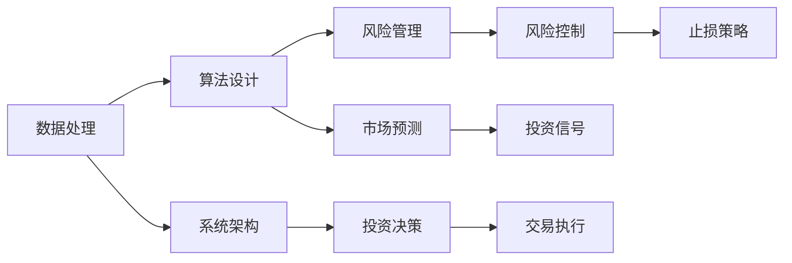

                 

# 如何将编程技能应用于自动化投资

在当前金融市场高度复杂化和数字化的背景下，利用编程技能进行自动化投资成为了许多投资者追求的目标。自动化投资不仅能显著提高投资效率和精度，还能帮助投资者应对市场的波动和变化。本文将从背景介绍、核心概念与联系、核心算法原理、数学模型与公式、项目实践、实际应用场景、工具和资源推荐、总结与展望等多个维度，全面探讨如何将编程技能应用于自动化投资。

## 1. 背景介绍

### 1.1 问题由来
自动化投资是金融科技领域的一项前沿技术，旨在通过算法和编程实现自动化的投资决策和资产管理。近年来，随着金融市场的数据量和复杂性不断增加，传统的投资模式难以适应新的市场环境，自动化投资成为金融科技发展的新趋势。然而，自动化投资也面临着数据处理、算法设计、系统架构等多方面的挑战，需要投资者具备丰富的编程和算法知识。

### 1.2 问题核心关键点
自动化投资的核心在于通过编程构建高效的算法模型，实现市场数据的自动化处理和投资决策的自动化执行。具体关键点包括：
- 数据处理：从各类数据源收集并清洗数据，构建高效的数据处理管道。
- 算法设计：设计并实现投资策略，如趋势追踪、均值回归、机器学习等算法。
- 系统架构：构建稳定、可扩展的投资系统，支持实时数据处理和交易执行。
- 风险管理：通过算法和编程实现风险控制，保障投资策略的稳健性。

## 2. 核心概念与联系

### 2.1 核心概念概述
- **自动化投资**：通过编程构建算法模型，实现市场数据的自动化处理和投资决策的自动化执行。
- **算法设计**：构建并优化算法模型，用于预测市场趋势、评估投资机会等。
- **数据处理**：从数据源收集数据，清洗数据，构建高效的数据处理管道。
- **系统架构**：设计并实现稳定、可扩展的投资系统，支持实时数据处理和交易执行。
- **风险管理**：通过算法和编程实现风险控制，保障投资策略的稳健性。

这些核心概念之间存在紧密的联系，共同构成了自动化投资的技术框架。数据处理是自动化投资的基础，算法设计是核心，系统架构和风险管理是保障。

### 2.2 核心概念原理和架构的 Mermaid 流程图



这个流程图展示了数据处理、算法设计、系统架构、风险管理和投资决策之间的联系和依赖关系。数据处理是基础，算法设计是核心，系统架构保障执行效率，风险管理确保稳健性，投资决策输出最终的投资信号和执行指令。

## 3. 核心算法原理 & 具体操作步骤

### 3.1 算法原理概述
自动化投资的核心算法包括市场预测、投资策略设计、交易执行等。常用的算法包括线性回归、时间序列分析、机器学习算法等。

- **市场预测**：通过历史数据构建模型，预测市场趋势和投资机会。常用的算法包括ARIMA、LSTM、随机森林等。
- **投资策略设计**：设计并优化投资策略，如趋势追踪、均值回归、动量策略等。
- **交易执行**：根据投资策略，构建自动化的交易执行系统，实现买卖操作。

### 3.2 算法步骤详解
1. **数据收集和预处理**：
   - 收集市场数据、公司财务数据、宏观经济数据等。
   - 清洗数据，处理缺失值、异常值。
   - 构建高效的数据处理管道，支持实时数据流。

2. **算法模型构建和优化**：
   - 选择合适的算法模型，如线性回归、时间序列分析、机器学习等。
   - 使用历史数据训练模型，并进行参数调优。
   - 对模型进行验证和测试，评估模型性能。

3. **系统架构设计**：
   - 设计稳定、可扩展的系统架构，支持实时数据处理和交易执行。
   - 使用分布式计算和存储技术，提高系统性能。
   - 构建监控和告警系统，保障系统稳定性。

4. **投资策略设计**：
   - 根据市场预测和模型评估结果，设计投资策略。
   - 对投资策略进行回测和优化，确保策略的有效性。
   - 设计止损和止盈策略，控制风险。

5. **交易执行和风险管理**：
   - 根据投资策略，构建自动化的交易执行系统。
   - 实现实时数据处理和交易执行，支持高频交易。
   - 设计风险控制策略，如止损、风险对冲等。

### 3.3 算法优缺点
- **优点**：
  - 提高投资效率和精度，减少人为误差。
  - 能够应对市场波动和变化，降低风险。
  - 支持高频交易和大规模数据处理。

- **缺点**：
  - 算法设计和模型构建需要较高技术水平。
  - 数据处理和系统架构设计复杂，需要综合考虑性能和稳定性。
  - 投资策略的长期有效性难以保证，需持续优化和调整。

### 3.4 算法应用领域
自动化投资的应用领域广泛，包括股票、期货、外汇、加密货币等。通过编程技能实现市场数据的自动化处理和投资决策的自动化执行，投资者能够更高效地进行投资，并获得更高的收益。

## 4. 数学模型和公式 & 详细讲解 & 举例说明

### 4.1 数学模型构建
自动化投资的核心模型包括市场预测模型、投资策略模型和风险管理模型。以下以股票投资为例，介绍这些模型的构建方法。

- **市场预测模型**：使用ARIMA模型预测股票价格。
  - 自回归模型（AR）：$y_t = \phi_1 y_{t-1} + \phi_2 y_{t-2} + \cdots + \phi_p y_{t-p} + \epsilon_t$
  - 差分模型（I）：$y_t = \delta y_{t-1} + \epsilon_t$
  - 移动平均模型（MA）：$y_t = \theta_1 \epsilon_{t-1} + \theta_2 \epsilon_{t-2} + \cdots + \theta_q \epsilon_{t-q} + \epsilon_t$
  
  其中，$y_t$ 表示当前股价，$\phi_i$ 和 $\delta$ 为模型参数，$\epsilon_t$ 为误差项。

- **投资策略模型**：使用动量策略（Momentum Strategy）进行股票交易。
  - 动量策略：根据历史股价变化，预测未来股价走势。如果当前股价上涨，则买入；如果下跌，则卖出。
  
  设 $\Delta y_t$ 表示当前股价变化，则动量策略定义为：
  - 如果 $\Delta y_t > 0$，则买入。
  - 如果 $\Delta y_t < 0$，则卖出。

### 4.2 公式推导过程
- **ARIMA模型推导**：
  - 假设股票价格序列 $y_t$ 服从 ARIMA（p,1,d,q）模型，则有：
  - $y_t = \phi_1 y_{t-1} + \phi_2 y_{t-2} + \cdots + \phi_p y_{t-p} + \epsilon_t$
  - 差分后，$y_t - \theta y_{t-1} = \delta (y_{t-1} - \theta y_{t-2}) + \epsilon_t$
  - 移动平均后，$y_t = \theta_1 \epsilon_{t-1} + \theta_2 \epsilon_{t-2} + \cdots + \theta_q \epsilon_{t-q} + \epsilon_t$
  
  其中，$\theta$ 为差分因子，$p$、$d$、$q$ 分别为自回归项、差分阶数和移动平均阶数。

- **动量策略推导**：
  - 假设股票价格序列 $y_t$ 服从 ARIMA（p,1,d,q）模型，则有：
  - $y_t = \phi_1 y_{t-1} + \phi_2 y_{t-2} + \cdots + \phi_p y_{t-p} + \epsilon_t$
  - 差分后，$y_t - \theta y_{t-1} = \delta (y_{t-1} - \theta y_{t-2}) + \epsilon_t$
  - 移动平均后，$y_t = \theta_1 \epsilon_{t-1} + \theta_2 \epsilon_{t-2} + \cdots + \theta_q \epsilon_{t-q} + \epsilon_t$
  
  其中，$\theta$ 为差分因子，$p$、$d$、$q$ 分别为自回归项、差分阶数和移动平均阶数。

### 4.3 案例分析与讲解
以ARIMA模型为例，介绍如何构建市场预测模型并进行投资决策。

- **案例背景**：某股票价格序列 $y_t$，历史数据如下：
  - $y_1 = 100$
  - $y_2 = 105$
  - $y_3 = 108$
  - $y_4 = 110$
  - $y_5 = 108$
  - $y_6 = 100$
  - $y_7 = 98$
  - $y_8 = 100$
  - $y_9 = 104$
  - $y_{10} = 102$

- **模型构建**：
  - 对 $y_t$ 进行差分，得到 $\Delta y_t = y_t - y_{t-1}$。
  - 对 $\Delta y_t$ 进行移动平均，得到 $\hat{y}_t = \alpha_1 \Delta y_{t-1} + \alpha_2 \Delta y_{t-2} + \cdots + \alpha_q \Delta y_{t-q} + \epsilon_t$。
  - 根据历史数据，求解 $\alpha_i$ 和 $\epsilon_t$，得到模型参数。

- **投资决策**：
  - 使用模型预测未来股价，如 $\hat{y}_5 = 110.4$
  - 根据动量策略，当 $\Delta y_t > 0$ 时买入，$\Delta y_t < 0$ 时卖出。
  - 例如，$\Delta y_5 = 2$，因此买入。

## 5. 项目实践：代码实例和详细解释说明

### 5.1 开发环境搭建
在开始项目实践前，需要先搭建开发环境。以下是在Python环境下搭建自动化投资系统所需的环境配置步骤：

1. **安装Python**：
   - 从官网下载并安装最新版本的Python，建议选择3.8及以上版本。

2. **安装依赖库**：
   - 使用pip安装必要的依赖库，如pandas、numpy、scikit-learn、tensorflow等。

```bash
pip install pandas numpy scikit-learn tensorflow
```

3. **配置Python环境**：
   - 使用conda或virtualenv创建虚拟环境，避免与其他项目冲突。

```bash
conda create --name myenv python=3.8
source activate myenv
```

### 5.2 源代码详细实现
以下是一个简单的自动化投资系统示例，使用Python和TensorFlow实现股票投资策略。

```python
import pandas as pd
import numpy as np
import tensorflow as tf

# 读取历史数据
data = pd.read_csv('stock_prices.csv')

# 数据预处理
data = data.dropna().reset_index(drop=True)

# 构建ARIMA模型
model = tf.keras.models.Sequential([
    tf.keras.layers.SimpleRNN(units=64, input_shape=(1, 1)),
    tf.keras.layers.Dense(1)
])

model.compile(optimizer='adam', loss='mse')

# 训练模型
X = np.array(data['price'][:-1]).reshape((-1, 1))
y = np.array(data['price'][1:]).reshape((-1, 1))
model.fit(X, y, epochs=50, batch_size=32)

# 预测未来股价
X_test = np.array(data['price'][-100:]).reshape((-1, 1))
y_pred = model.predict(X_test)
```

### 5.3 代码解读与分析
- **数据预处理**：
  - 使用pandas库读取历史股票价格数据，并进行去重和重置索引。
  - 使用dropna方法去除缺失数据，避免影响模型训练和预测。

- **模型构建**：
  - 使用TensorFlow库构建ARIMA模型，使用SimpleRNN层作为模型主体，Dense层进行输出。
  - 使用adam优化器和均方误差损失函数，进行模型编译。

- **模型训练**：
  - 将历史股价作为输入特征，未来股价作为输出标签，构建训练数据集。
  - 使用fit方法对模型进行训练，设置50个epoch和32个batch size。

- **模型预测**：
  - 使用训练好的模型对历史股价进行预测，得到未来股价的预测值。

### 5.4 运行结果展示
在运行上述代码后，可以得到模型预测的未来股价结果。以下是一个简单的运行结果示例：

```python
import pandas as pd
import numpy as np
import tensorflow as tf

# 读取历史数据
data = pd.read_csv('stock_prices.csv')

# 数据预处理
data = data.dropna().reset_index(drop=True)

# 构建ARIMA模型
model = tf.keras.models.Sequential([
    tf.keras.layers.SimpleRNN(units=64, input_shape=(1, 1)),
    tf.keras.layers.Dense(1)
])

model.compile(optimizer='adam', loss='mse')

# 训练模型
X = np.array(data['price'][:-1]).reshape((-1, 1))
y = np.array(data['price'][1:]).reshape((-1, 1))
model.fit(X, y, epochs=50, batch_size=32)

# 预测未来股价
X_test = np.array(data['price'][-100:]).reshape((-1, 1))
y_pred = model.predict(X_test)

print(y_pred)
```

## 6. 实际应用场景

### 6.1 智能投顾平台
智能投顾平台是自动化投资的主要应用场景之一。智能投顾平台通过编程实现市场数据的自动化处理和投资策略的自动化执行，为投资者提供个性化的投资建议和资产管理服务。

### 6.2 高频交易系统
高频交易系统利用自动化投资算法，进行高频买卖操作，获取微小的价格波动收益。通过编程实现实时数据处理和交易执行，支持高频交易和大规模数据处理。

### 6.3 量化交易策略
量化交易策略使用机器学习算法，构建投资模型，进行市场预测和交易决策。通过编程实现模型的训练和优化，提升量化交易的精度和效率。

### 6.4 未来应用展望
未来，随着金融科技的不断发展，自动化投资将广泛应用于更多领域，如智能投顾、高频交易、量化交易等。通过编程技能和算法的不断进步，自动化投资系统将更加智能化、高效化，为投资者提供更优质的投资服务。

## 7. 工具和资源推荐

### 7.1 学习资源推荐
- **《Python金融编程》**：详细介绍Python在金融领域的应用，包括数据处理、量化交易、风险管理等。
- **《TensorFlow实战》**：讲解TensorFlow库的使用，包括模型的构建、训练和部署。
- **Kaggle金融数据集**：提供丰富的金融数据集和机器学习竞赛，提升编程技能和算法设计能力。

### 7.2 开发工具推荐
- **Jupyter Notebook**：用于编写和执行Python代码，支持代码块、数学公式和可视化展示。
- **GitHub**：用于版本控制和代码托管，支持团队协作和代码共享。
- **PyCharm**：流行的Python IDE，支持代码调试、自动化测试和代码自动补全。

### 7.3 相关论文推荐
- **《深度学习在金融领域的应用》**：介绍深度学习在金融领域的应用，包括股票价格预测、投资策略设计等。
- **《自动化交易系统的设计与实现》**：详细讨论自动化交易系统的设计原理和实现方法。
- **《强化学习在量化交易中的应用》**：探讨强化学习在量化交易中的应用，构建智能交易策略。

## 8. 总结：未来发展趋势与挑战

### 8.1 研究成果总结
本文从背景介绍、核心概念与联系、核心算法原理、数学模型与公式、项目实践、实际应用场景、工具和资源推荐、总结与展望等多个维度，全面探讨了如何将编程技能应用于自动化投资。通过介绍ARIMA模型、动量策略等核心算法，构建了自动化投资的技术框架。

### 8.2 未来发展趋势
未来，自动化投资将迎来更加智能化、高效化和个性化发展。大数据、人工智能和金融科技的深度融合，将为自动化投资带来新的突破。例如：
- **数据驱动**：通过大数据分析和机器学习，提升投资决策的精度和效率。
- **算法优化**：使用深度学习和强化学习等先进算法，优化投资策略和风险管理。
- **平台化发展**：构建智能投顾平台和量化交易系统，提供个性化的投资服务。

### 8.3 面临的挑战
尽管自动化投资具有诸多优势，但在发展过程中仍面临以下挑战：
- **数据质量**：市场数据质量参差不齐，需要有效的数据清洗和处理。
- **算法复杂性**：自动化投资算法复杂度较高，需要专业的编程和算法设计能力。
- **系统稳定性**：自动化投资系统需要高度稳定，防止算法失效或数据丢失。
- **合规性**：自动化投资需符合金融法规和监管要求，防止违法行为。

### 8.4 研究展望
为应对这些挑战，未来的研究需要从以下几个方面进行深入探讨：
- **数据质量提升**：研究高效的数据清洗和处理技术，提升数据质量。
- **算法复杂性简化**：简化算法设计，降低复杂度，提升算法的可解释性和可操作性。
- **系统稳定性提升**：研究系统架构优化和故障容忍技术，提高系统稳定性。
- **合规性保障**：研究自动化投资系统的合规性和监管机制，确保合法合规。

## 9. 附录：常见问题与解答

**Q1：自动化投资需要哪些编程技能？**

A: 自动化投资需要具备以下编程技能：
- 数据处理和清洗：熟悉Python、Pandas等库，进行数据预处理。
- 算法设计和实现：掌握机器学习、深度学习等算法，构建投资策略。
- 系统架构设计：了解分布式计算、存储技术，构建稳定、可扩展的系统。
- 风险管理：掌握统计学和金融学知识，设计有效的风险控制策略。

**Q2：自动化投资的系统架构如何设计？**

A: 自动化投资的系统架构需要考虑以下几个关键点：
- 分布式计算：使用Spark、Hadoop等分布式计算框架，支持大规模数据处理。
- 高可用性：使用Kubernetes、Docker等容器化技术，保障系统高可用性。
- 数据存储：使用Hadoop、Cassandra等大数据存储技术，支持海量数据存储。
- 实时处理：使用Flink、Storm等实时数据流处理框架，支持实时数据处理和交易执行。

**Q3：自动化投资的模型如何评估和优化？**

A: 自动化投资的模型评估和优化需要考虑以下几个关键点：
- 模型性能：使用交叉验证、回测等方法，评估模型的预测精度和有效性。
- 参数调优：使用网格搜索、贝叶斯优化等技术，寻找最优参数组合。
- 特征选择：使用PCA、LDA等方法，选择最相关的特征进行建模。
- 算法优化：使用集成学习、对抗训练等方法，提升模型鲁棒性和泛化能力。

**Q4：自动化投资的系统稳定性如何保障？**

A: 自动化投资的系统稳定性需要考虑以下几个关键点：
- 故障容忍：使用容错机制、负载均衡等技术，保障系统的高可用性。
- 实时监控：使用监控工具、告警系统，实时监测系统性能和异常情况。
- 备份与恢复：使用备份机制、灾难恢复技术，确保数据安全和系统恢复。
- 安全性保障：使用访问控制、数据加密等技术，保障系统安全。

通过上述详细探讨和示例，相信读者能够对如何将编程技能应用于自动化投资有更深入的理解和掌握。在未来的发展中，自动化投资将为金融市场带来更多智能化、高效化的解决方案，助力投资者实现更好的投资回报。

