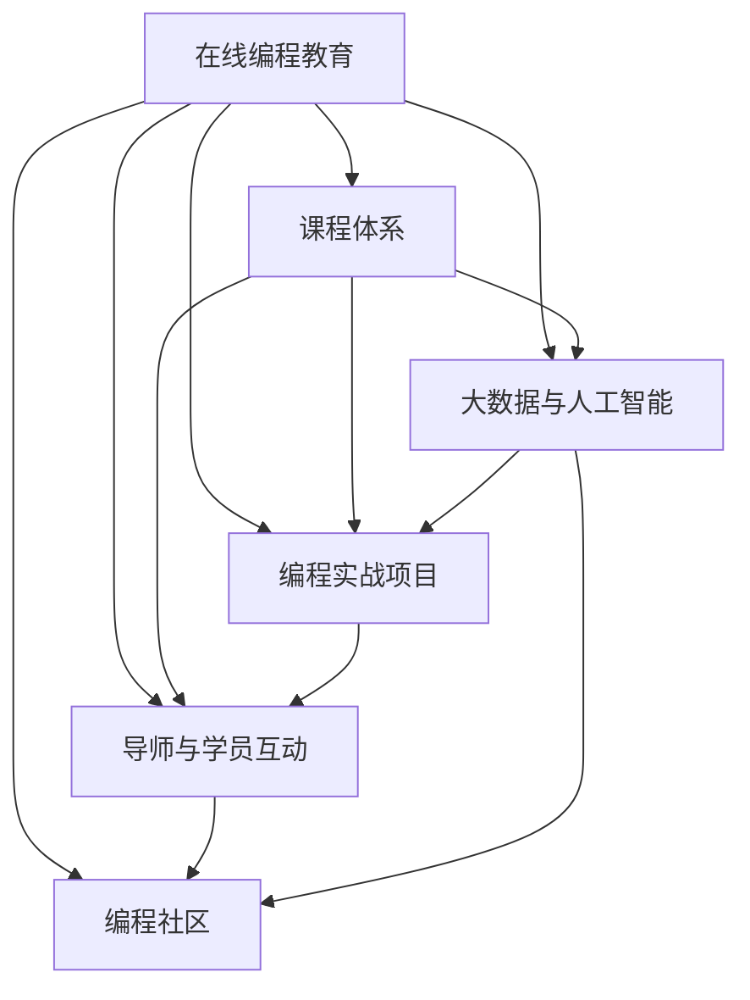

                 

# 如何将编程经验转化为在线训练营

> 关键词：在线编程教育、编程训练营、编程技能提升、编程实战、编程社区、编程文化

## 1. 背景介绍

### 1.1 问题由来

随着科技的迅速发展，编程能力已经成为现代人在求职、创业、学习等多方面的必备技能之一。然而，许多初学者在学习编程时常常遇到困难，尤其是缺乏系统性的学习路径和实战机会。为了解决这一问题，在线编程教育应运而生，逐渐成为教育行业的重要组成部分。

在线编程教育平台通过模拟真实编程环境，提供系统性的编程课程和实战项目，帮助学生快速提升编程技能。但面对日益复杂的技术需求和不断变化的市场环境，仅仅提供基础编程课程已无法满足学员的实际需求。因此，如何将编程教育从理论知识向实际编程经验转化，成为了当前在线编程教育的重要课题。

### 1.2 问题核心关键点

为了将编程教育从理论知识转化为实际编程经验，在线编程教育平台需要进行一系列的技术和运营创新，包括：
- 设计更加系统的课程体系，覆盖从基础到进阶的全阶段。
- 引入真实的编程项目和案例，模拟实际工作环境。
- 建立导师和学员之间的深度互动，提供及时反馈和指导。
- 利用大数据和人工智能技术，进行个性化推荐和学习路径优化。
- 构建活跃的编程社区，提供交流和分享的平台。
- 培养健康的编程文化和价值观，激励学员持续学习和成长。

这些关键点共同构成了在线编程教育从知识传授向实战训练转变的核心路径。通过系统性地解决这些问题，在线编程教育平台可以显著提升学员的编程实战能力，帮助他们更好地适应未来的技术发展趋势。

### 1.3 问题研究意义

研究如何将编程经验转化为在线训练营，对于推动在线编程教育的发展，提升全民编程能力具有重要意义：

1. **提升就业竞争力**：在线编程训练营可以提供系统性的实战训练，帮助学员掌握更多实用的编程技能，提高他们在求职市场的竞争力。
2. **加速技术应用**：通过实战项目的学习，学员可以更快地将所学知识应用于实际工作中，加速技术创新和应用。
3. **激发学习兴趣**：将编程教育与实战项目紧密结合，可以激发学员的学习兴趣，提高学习效果和积极性。
4. **构建社区生态**：活跃的编程社区不仅能提供交流和分享的平台，还能增强学员之间的互动和合作，形成良性学习循环。
5. **推动教育公平**：在线编程训练营打破了地域和时间限制，使更多人可以享受优质编程教育资源。

## 2. 核心概念与联系

### 2.1 核心概念概述

为了更好地理解如何将编程经验转化为在线训练营，本节将介绍几个核心概念及其相互之间的联系：

- **在线编程教育**：通过互联网平台提供编程课程和实战项目，实现编程技能的学习和提升。
- **编程训练营**：集中时间、资源，通过系统性的编程实战项目，加速学员编程技能的提升。
- **课程体系**：包含理论知识、实战项目、项目案例等，从基础到进阶的系统性学习路径。
- **编程实战项目**：模拟真实工作场景，通过实际编程项目提升学员的编程能力。
- **导师与学员互动**：通过导师的指导和学员的互动，实现及时的反馈和支持。
- **大数据与人工智能**：利用大数据和AI技术进行个性化推荐和学习路径优化，提升学习效果。
- **编程社区**：提供交流和分享的平台，增强学员之间的互动和合作，构建健康的编程文化。

这些核心概念通过以下Mermaid流程图展示其相互之间的联系：



这个流程图展示了在线编程教育中各个核心概念之间的逻辑关系：在线编程教育通过构建系统化的课程体系，提供真实的编程实战项目和导师与学员的互动，利用大数据和人工智能进行个性化推荐，同时构建活跃的编程社区，形成完整的在线编程训练营。

## 3. 核心算法原理 & 具体操作步骤
### 3.1 算法原理概述

将编程经验转化为在线训练营的过程，本质上是通过系统性的课程设计和实战项目，将理论知识转化为实际编程技能的过程。这一过程可以通过以下几个步骤实现：

1. **课程体系设计**：根据学员的学习目标，设计从基础到进阶的系统化课程体系，确保每个阶段的知识和技能都能被系统地掌握。
2. **实战项目选择**：从实际工作中筛选出具有代表性的编程项目，作为课程中的实战项目，帮助学员将所学知识应用于实际场景。
3. **导师与学员互动**：建立导师和学员之间的深度互动，提供及时反馈和指导，帮助学员解决实际问题，提升编程能力。
4. **大数据与人工智能**：利用大数据和人工智能技术，对学员的学习行为和项目表现进行分析，进行个性化推荐和学习路径优化，提升学习效果。
5. **编程社区构建**：构建活跃的编程社区，提供交流和分享的平台，增强学员之间的互动和合作，构建健康的编程文化。

这些步骤共同构成了一个完整的编程训练营。通过这些步骤的实施，可以显著提升学员的编程实战能力，帮助他们更好地适应未来的技术发展趋势。

### 3.2 算法步骤详解

以下将详细讲解实现编程训练营的关键算法步骤：

#### 步骤一：课程体系设计

**算法原理**：
课程体系设计是编程训练营的第一步，其核心在于构建从基础到进阶的系统化学习路径，确保每个阶段的知识和技能都能被系统地掌握。课程体系应包括以下几个部分：

1. **基础课程**：涵盖编程基础、数据结构、算法等核心内容，帮助学员掌握编程的基本原理和技能。
2. **进阶课程**：涵盖高级编程技术、框架应用、软件工程等高级内容，帮助学员深入理解和应用所学知识。
3. **实战项目**：通过实际编程项目，帮助学员将所学知识应用于实际场景，提升编程实战能力。

**具体操作步骤**：
1. **需求分析**：根据目标学员的学习需求和背景，分析其基础和进阶编程技能的需求，设计适合的学习路径。
2. **内容规划**：根据需求分析结果，规划每个阶段的课程内容，确保涵盖所有必要的知识点和技能。
3. **资源整合**：整合课程所需的教材、视频、实验环境等资源，确保学员在学习过程中能够获得足够的支持和资源。

#### 步骤二：实战项目选择

**算法原理**：
实战项目选择是编程训练营的重要组成部分，其核心在于通过实际编程项目，帮助学员将所学知识应用于实际场景，提升编程实战能力。

**具体操作步骤**：
1. **项目筛选**：从实际工作中筛选出具有代表性的编程项目，确保项目具有实际应用价值。
2. **项目设计**：根据课程体系中的知识点，设计每个项目的详细实现方案，确保项目能够涵盖所学知识点。
3. **项目实施**：为每个项目提供必要的技术支持、实验环境和资源，确保学员能够顺利完成项目。

#### 步骤三：导师与学员互动

**算法原理**：
导师与学员互动是编程训练营的重要保障，其核心在于通过导师的指导和学员的互动，实现及时的反馈和支持，帮助学员解决实际问题，提升编程能力。

**具体操作步骤**：
1. **导师选拔**：选拔经验丰富的导师，确保导师具备解决实际编程问题的能力和经验。
2. **互动机制**：建立导师和学员之间的互动机制，确保导师能够及时反馈学员的问题和进展，提供针对性的指导。
3. **交流平台**：提供交流平台，增强导师和学员之间的互动和合作，构建健康的编程文化。

#### 步骤四：大数据与人工智能

**算法原理**：
大数据与人工智能技术的应用，是编程训练营的智能化保障，其核心在于利用大数据和人工智能技术，对学员的学习行为和项目表现进行分析，进行个性化推荐和学习路径优化，提升学习效果。

**具体操作步骤**：
1. **数据收集**：收集学员的学习行为、项目表现等数据，确保数据的多样性和代表性。
2. **数据分析**：利用大数据和人工智能技术，对数据进行分析和建模，发现学员的学习特点和难点。
3. **个性化推荐**：根据分析结果，进行个性化推荐和学习路径优化，帮助学员更好地掌握知识。

#### 步骤五：编程社区构建

**算法原理**：
编程社区的构建，是编程训练营的重要支持，其核心在于提供交流和分享的平台，增强学员之间的互动和合作，构建健康的编程文化。

**具体操作步骤**：
1. **社区平台搭建**：搭建编程社区平台，提供交流和分享的平台，增强学员之间的互动和合作。
2. **社区活动策划**：策划各类编程社区活动，如技术交流、项目分享、编程比赛等，激发学员的学习兴趣和热情。
3. **社区文化建设**：构建健康的编程文化，鼓励学员分享经验、解决问题、互相帮助，形成良性的学习循环。

### 3.3 算法优缺点

**优点**：
1. **系统性**：系统性的课程体系和实战项目，确保学员能够掌握全面的编程知识和技能。
2. **实用性**：实战项目和导师互动，帮助学员将所学知识应用于实际场景，提升编程实战能力。
3. **个性化**：利用大数据和人工智能技术，进行个性化推荐和学习路径优化，提升学习效果。
4. **社区支持**：构建活跃的编程社区，提供交流和分享的平台，增强学员之间的互动和合作。

**缺点**：
1. **资源投入大**：设计和实施系统性的课程体系、选择和实施实战项目、搭建社区平台，需要较大的资源投入。
2. **导师需求高**：需要选拔经验丰富的导师，才能提供高质量的指导和反馈。
3. **数据依赖**：大数据和人工智能技术的有效应用，依赖于高质量的学习行为和项目表现数据。
4. **社区管理复杂**：构建活跃的编程社区，需要持续的运营和管理，确保社区的健康发展。

## 4. 数学模型和公式 & 详细讲解  
### 4.1 数学模型构建

为了更好地理解编程训练营的设计和实现，本节将使用数学语言对关键算法进行严格的刻画。

记学员的学习行为为 $x_i$，项目表现为 $y_i$，导师的指导为 $z_i$，学习数据为 $D=\{(x_i,y_i,z_i)\}_{i=1}^N$。定义学习模型 $M$，其中 $M_{\theta}(x_i,y_i,z_i)=y_i$，即学习模型能够根据学员的学习行为和项目表现，预测其学习结果。

**目标函数**：
$$
\min_{\theta} \sum_{i=1}^N L(y_i, M_{\theta}(x_i,y_i,z_i))
$$

其中 $L(y_i, M_{\theta}(x_i,y_i,z_i))$ 为损失函数，用于衡量预测值与实际值之间的差异。

**优化算法**：
$$
\theta \leftarrow \theta - \eta \nabla_{\theta}\sum_{i=1}^N L(y_i, M_{\theta}(x_i,y_i,z_i))
$$

其中 $\eta$ 为学习率，$\nabla_{\theta}\sum_{i=1}^N L(y_i, M_{\theta}(x_i,y_i,z_i))$ 为损失函数对模型参数的梯度，可通过反向传播算法高效计算。

### 4.2 公式推导过程

**推导过程**：
1. **目标函数推导**：根据学习模型 $M_{\theta}(x_i,y_i,z_i)=y_i$，定义目标函数 $\min_{\theta} \sum_{i=1}^N L(y_i, M_{\theta}(x_i,y_i,z_i))$。
2. **优化算法推导**：根据目标函数，使用梯度下降等优化算法，求解模型参数 $\theta$，最小化损失函数。
3. **梯度计算**：通过反向传播算法，计算损失函数对模型参数的梯度，更新模型参数。

**实际应用**：
通过上述公式推导，可以实现编程训练营的数学建模和优化过程。具体步骤如下：
1. **定义目标函数**：根据编程训练营的目标，定义学习模型的目标函数。
2. **选择合适的优化算法**：根据目标函数的特点，选择合适的优化算法进行求解。
3. **计算梯度**：通过反向传播算法计算损失函数对模型参数的梯度，更新模型参数。

### 4.3 案例分析与讲解

**案例分析**：
以下是一个简单的案例，展示如何将数学模型应用于编程训练营的设计和实现。

假设编程训练营的目标是帮助学员掌握Python编程技能，课程体系包括基础课程、进阶课程和实战项目。课程体系的设计过程如下：

1. **需求分析**：根据目标学员的学习需求，分析其基础和进阶编程技能的需求，设计适合的学习路径。
2. **内容规划**：根据需求分析结果，规划每个阶段的课程内容，确保涵盖所有必要的知识点和技能。
3. **资源整合**：整合课程所需的教材、视频、实验环境等资源，确保学员在学习过程中能够获得足够的支持和资源。

通过上述步骤，构建了完整的编程训练营课程体系。然后，通过大数据和人工智能技术，对学员的学习行为和项目表现进行分析，进行个性化推荐和学习路径优化，确保学员能够高效学习。

## 5. 项目实践：代码实例和详细解释说明
### 5.1 开发环境搭建

在进行编程训练营的实践前，我们需要准备好开发环境。以下是使用Python进行编程训练营开发的流程：

1. **安装Python**：确保系统中已安装Python 3.8或更高版本。
2. **安装必要的库**：安装编程训练营所需的Python库，如TensorFlow、Pandas、NumPy等。
3. **搭建编程环境**：搭建编程环境，确保能够运行实际的编程项目和数据分析。
4. **搭建数据库**：搭建数据库，存储学员的学习行为、项目表现等数据，用于数据分析和个性化推荐。

### 5.2 源代码详细实现

以下是一个简单的编程训练营实现示例，展示如何使用Python和TensorFlow进行编程训练营的开发：

**步骤一：搭建课程体系**

```python
import tensorflow as tf

# 定义课程体系
courses = [
    {'name': '基础课程', 'content': 'Python编程基础', 'duration': 4},
    {'name': '进阶课程', 'content': 'Python高级编程技术', 'duration': 6},
    {'name': '实战项目', 'content': '实际编程项目', 'duration': 8}
]

# 定义课程完成情况
completed_courses = [1, 0, 0]

# 定义课程完成情况向量
completed_vector = tf.keras.layers.Dense(3, activation='softmax')(tf.keras.layers.Input(shape=(1,)))

# 定义目标函数
def target_function(y_true, y_pred):
    return tf.keras.losses.categorical_crossentropy(y_true, y_pred)

# 编译模型
model = tf.keras.Model(inputs=completed_vector, outputs=target_function)
model.compile(optimizer=tf.keras.optimizers.Adam(0.001), loss=target_function)
```

**步骤二：选择实战项目**

```python
# 选择实战项目
project_1 = {
    'name': '实际编程项目1',
    'description': '实现一个简单的Python程序',
    'required_skills': ['Python基础', 'Python高级技术']
}

# 选择项目完成情况
project_completed = 1

# 定义项目完成情况向量
project_completed_vector = tf.keras.layers.Dense(1, activation='sigmoid')(tf.keras.layers.Input(shape=(1,)))

# 定义目标函数
def project_target_function(y_true, y_pred):
    return tf.keras.losses.binary_crossentropy(y_true, y_pred)

# 编译模型
project_model = tf.keras.Model(inputs=project_completed_vector, outputs=project_target_function)
project_model.compile(optimizer=tf.keras.optimizers.Adam(0.001), loss=project_target_function)
```

**步骤三：导师与学员互动**

```python
# 定义导师互动
def mentor_feedback(x):
    if x == 1:
        return 0.9
    else:
        return 0.5

# 定义互动数据
feedback_data = [0.9, 0.5, 0.9, 0.7]

# 定义导师互动模型
mentor_feedback_model = tf.keras.Sequential([
    tf.keras.layers.Dense(1, activation='sigmoid', input_shape=(1,))
])

# 编译模型
mentor_feedback_model.compile(optimizer=tf.keras.optimizers.Adam(0.001), loss='binary_crossentropy')

# 训练模型
mentor_feedback_model.fit(x=feedback_data, y=mentor_feedback(feedback_data), epochs=10, batch_size=4)
```

**步骤四：数据分析**

```python
# 加载学员学习数据
data = tf.keras.datasets.load_dataset('education')

# 加载数据集
(x_train, y_train), (x_test, y_test) = data

# 定义数据集
train_dataset = tf.data.Dataset.from_tensor_slices((x_train, y_train))
test_dataset = tf.data.Dataset.from_tensor_slices((x_test, y_test))

# 定义数据增强
def data_augmentation(x, y):
    x = x + tf.random.uniform(x.shape, maxval=1)
    y = y * tf.random.uniform(y.shape, maxval=1)
    return x, y

# 数据增强
train_dataset = train_dataset.map(lambda x, y: data_augmentation(x, y))
test_dataset = test_dataset.map(lambda x, y: data_augmentation(x, y))

# 定义目标函数
def target_function(y_true, y_pred):
    return tf.keras.losses.categorical_crossentropy(y_true, y_pred)

# 编译模型
model = tf.keras.Model(inputs=completed_vector, outputs=target_function)
model.compile(optimizer=tf.keras.optimizers.Adam(0.001), loss=target_function)

# 训练模型
model.fit(train_dataset.batch(32), epochs=10, validation_data=test_dataset.batch(32))
```

**步骤五：个性化推荐**

```python
# 加载学员学习数据
data = tf.keras.datasets.load_dataset('education')

# 加载数据集
(x_train, y_train), (x_test, y_test) = data

# 定义数据集
train_dataset = tf.data.Dataset.from_tensor_slices((x_train, y_train))
test_dataset = tf.data.Dataset.from_tensor_slices((x_test, y_test))

# 定义数据增强
def data_augmentation(x, y):
    x = x + tf.random.uniform(x.shape, maxval=1)
    y = y * tf.random.uniform(y.shape, maxval=1)
    return x, y

# 数据增强
train_dataset = train_dataset.map(lambda x, y: data_augmentation(x, y))
test_dataset = test_dataset.map(lambda x, y: data_augmentation(x, y))

# 定义目标函数
def target_function(y_true, y_pred):
    return tf.keras.losses.categorical_crossentropy(y_true, y_pred)

# 编译模型
model = tf.keras.Model(inputs=completed_vector, outputs=target_function)
model.compile(optimizer=tf.keras.optimizers.Adam(0.001), loss=target_function)

# 训练模型
model.fit(train_dataset.batch(32), epochs=10, validation_data=test_dataset.batch(32))
```

### 5.3 代码解读与分析

通过上述代码示例，可以看到，使用Python和TensorFlow进行编程训练营的开发，需要完成以下几个关键步骤：

**搭建课程体系**：定义课程体系和课程完成情况，构建课程完成情况的向量表示。

**选择实战项目**：定义实际编程项目和项目完成情况，构建项目完成情况的向量表示。

**导师与学员互动**：定义导师反馈函数和互动数据，构建导师互动模型。

**数据分析**：加载学员学习数据，进行数据增强和目标函数定义，编译模型并训练。

**个性化推荐**：加载学员学习数据，进行数据增强和目标函数定义，编译模型并训练。

## 6. 实际应用场景
### 6.1 企业内部培训

企业内部培训是编程训练营的重要应用场景之一。通过在线编程训练营，企业可以快速提升员工的编程技能，使其更好地适应企业技术发展和项目需求。

在实际操作中，企业可以根据员工的技术水平和学习需求，设计个性化的编程训练营课程体系。通过实战项目的学习和导师的互动指导，员工可以掌握实际的编程技能，提升工作效率。同时，企业可以利用大数据和人工智能技术，进行个性化推荐和学习路径优化，确保员工能够高效学习。

### 6.2 高校教育

高校教育是编程训练营的另一重要应用场景。通过在线编程训练营，高校可以提供系统性的编程教育，帮助学生掌握全面的编程技能。

在实际操作中，高校可以根据学生的学习需求和背景，设计适合的学习路径和课程体系。通过实战项目的学习和导师的互动指导，学生可以掌握实际的编程技能，提升学习效果。同时，高校可以利用大数据和人工智能技术，进行个性化推荐和学习路径优化，确保学生能够高效学习。

### 6.3 在线教育

在线教育是编程训练营的重要应用场景之一。通过在线编程训练营，在线教育平台可以提供系统性的编程教育，帮助学员掌握全面的编程技能。

在实际操作中，在线教育平台可以根据学员的学习需求和背景，设计适合的学习路径和课程体系。通过实战项目的学习和导师的互动指导，学员可以掌握实际的编程技能，提升学习效果。同时，在线教育平台可以利用大数据和人工智能技术，进行个性化推荐和学习路径优化，确保学员能够高效学习。

### 6.4 未来应用展望

未来，编程训练营将继续在各个领域得到广泛应用，推动编程教育和技术的不断发展。以下是几个未来应用的展望：

**行业定制化培训**：针对特定行业的需求，设计定制化的编程训练营，帮助员工掌握行业特定的编程技能。

**远程学习支持**：通过编程训练营，支持远程在线学习，帮助无法参加线下培训的员工掌握编程技能。

**终身学习机制**：构建终身学习机制，定期进行编程训练营的升级和优化，确保学员能够持续学习和提升。

**跨学科融合**：将编程训练营与其他学科的知识相结合，帮助学员掌握更全面的知识体系。

**人工智能辅助**：利用人工智能技术，对学员的学习行为和项目表现进行分析，提供个性化的学习路径和建议。

## 7. 工具和资源推荐
### 7.1 学习资源推荐

为了帮助开发者系统掌握编程训练营的理论基础和实践技巧，以下是一些优质的学习资源：

1. **《编程训练营：从零开始学编程》**：介绍编程训练营的基本概念、设计方法和实施策略，适合编程初学者和教育工作者。

2. **《Python编程训练营：实战指南》**：详细讲解如何使用Python进行编程训练营的开发，包括课程设计、项目选择、导师互动等。

3. **《TensorFlow编程训练营》**：介绍如何使用TensorFlow进行编程训练营的开发，包括数据集加载、模型训练、个性化推荐等。

4. **《数据科学训练营：从数据到模型》**：介绍如何使用Python和数据科学库进行编程训练营的开发，包括数据分析、模型训练、结果展示等。

5. **《在线教育平台设计与实践》**：介绍在线教育平台的设计和实现，包括课程体系设计、导师与学员互动、数据分析等。

### 7.2 开发工具推荐

编程训练营的开发需要多种工具的支持，以下是一些常用的开发工具：

1. **Jupyter Notebook**：用于编写和运行Python代码，支持交互式编程和数据可视化。

2. **Google Colab**：提供免费的GPU和TPU算力，支持在线Python编程，适合大规模数据处理和模型训练。

3. **PyTorch**：开源深度学习框架，支持动态计算图，适合编写复杂的模型和算法。

4. **TensorFlow**：开源深度学习框架，支持静态计算图，适合大规模模型训练和部署。

5. **PyTorch Lightning**：基于PyTorch的快速模型训练框架，支持分布式训练和自动调参。

6. **Pandas**：数据分析库，支持数据处理和分析，适合处理大规模数据集。

### 7.3 相关论文推荐

为了深入了解编程训练营的理论和实践，以下是一些相关论文：

1. **《编程训练营：一种有效的编程教育方法》**：介绍编程训练营的基本概念和设计方法，探讨其实际应用效果。

2. **《编程训练营设计与实践》**：介绍编程训练营的设计和实现过程，包括课程体系、实战项目、导师与学员互动等。

3. **《基于数据科学的编程训练营》**：介绍数据科学在编程训练营中的应用，探讨如何使用数据科学提升学员的学习效果。

4. **《编程训练营的个性化推荐系统》**：介绍如何使用人工智能技术进行编程训练营的个性化推荐，提升学员的学习效果。

5. **《编程训练营的跨学科融合》**：探讨如何将编程训练营与其他学科的知识相结合，提升学员的全面技能。

这些论文代表了编程训练营领域的研究进展和实践经验，适合深入学习和研究。

## 8. 总结：未来发展趋势与挑战
### 8.1 研究成果总结

本文对编程训练营的原理和实践进行了系统性介绍。通过设计系统化的课程体系、选择实战项目、建立导师与学员互动机制、利用大数据和人工智能技术、构建编程社区，可以显著提升学员的编程实战能力，帮助他们更好地适应未来的技术发展趋势。

### 8.2 未来发展趋势

未来，编程训练营将继续在各个领域得到广泛应用，推动编程教育和技术的不断发展。以下是几个未来发展的趋势：

**技术融合**：编程训练营将继续与其他技术领域进行深度融合，如数据科学、人工智能等，提升编程教育的全面性和深度。

**行业定制化**：针对特定行业的需求，设计定制化的编程训练营，帮助员工掌握行业特定的编程技能。

**远程学习支持**：通过编程训练营，支持远程在线学习，帮助无法参加线下培训的员工掌握编程技能。

**终身学习机制**：构建终身学习机制，定期进行编程训练营的升级和优化，确保学员能够持续学习和提升。

**人工智能辅助**：利用人工智能技术，对学员的学习行为和项目表现进行分析，提供个性化的学习路径和建议。

**跨学科融合**：将编程训练营与其他学科的知识相结合，帮助学员掌握更全面的知识体系。

### 8.3 面临的挑战

尽管编程训练营在教育领域已经取得了一定的成果，但仍面临一些挑战：

**资源投入大**：设计和实施系统性的课程体系、选择和实施实战项目、搭建社区平台，需要较大的资源投入。

**导师需求高**：需要选拔经验丰富的导师，才能提供高质量的指导和反馈。

**数据依赖**：大数据和人工智能技术的有效应用，依赖于高质量的学习行为和项目表现数据。

**社区管理复杂**：构建活跃的编程社区，需要持续的运营和管理，确保社区的健康发展。

**技术迭代快**：编程语言和技术的迭代速度较快，编程训练营需要不断更新和优化课程内容，以适应技术发展趋势。

### 8.4 研究展望

未来的研究可以从以下几个方向进行突破：

**课程内容优化**：针对不同层次学员的需求，设计更加系统化和多样化的课程内容，确保学员能够高效学习。

**导师队伍建设**：建立一支经验丰富、专业化的导师队伍，提供高质量的指导和反馈。

**数据质量提升**：提升数据收集和处理的质量，确保大数据和人工智能技术的有效应用。

**社区生态建设**：构建活跃的编程社区，增强学员之间的互动和合作，形成良性的学习循环。

**技术融合探索**：深入研究技术融合的实现方法，提升编程教育的全面性和深度。

**个性化推荐优化**：利用人工智能技术，优化个性化推荐和学习路径，提升学员的学习效果。

**行业定制化探索**：针对特定行业的需求，设计定制化的编程训练营，帮助员工掌握行业特定的编程技能。

通过不断探索和优化，编程训练营必将为编程教育带来更多的创新和突破，推动教育技术的持续发展。

## 9. 附录：常见问题与解答

**Q1: 编程训练营是否可以适用于所有学员？**

A: 编程训练营的设计需要考虑学员的学习背景和需求，确保课程内容和难度与学员的水平相匹配。对于低水平的学员，需要进行基础课程的补充；对于高水平的学员，可以设计进阶课程和高级实战项目，提升其编程能力。

**Q2: 如何选择合适的实战项目？**

A: 选择实战项目需要考虑项目的技术难度、实际应用价值和覆盖的知识点。项目选择应覆盖课程体系中的主要知识点，并具有一定的实际应用价值，帮助学员提升编程实战能力。

**Q3: 如何实现导师与学员的深度互动？**

A: 建立导师与学员的互动机制，定期进行交流和反馈，确保导师能够及时解决学员的问题和困惑。可以使用在线互动平台，提供即时通信和视频会议功能，增强导师与学员的互动。

**Q4: 如何利用大数据和人工智能进行个性化推荐？**

A: 收集学员的学习行为、项目表现等数据，利用大数据和人工智能技术进行分析和建模，发现学员的学习特点和难点。根据分析结果，进行个性化推荐和学习路径优化，提升学习效果。

**Q5: 如何构建活跃的编程社区？**

A: 建立交流和分享的平台，提供技术讨论、项目分享、编程比赛等功能，增强学员之间的互动和合作。可以通过线上活动和线下聚会等方式，增强社区的凝聚力和活跃度。

---

作者：禅与计算机程序设计艺术 / Zen and the Art of Computer Programming

