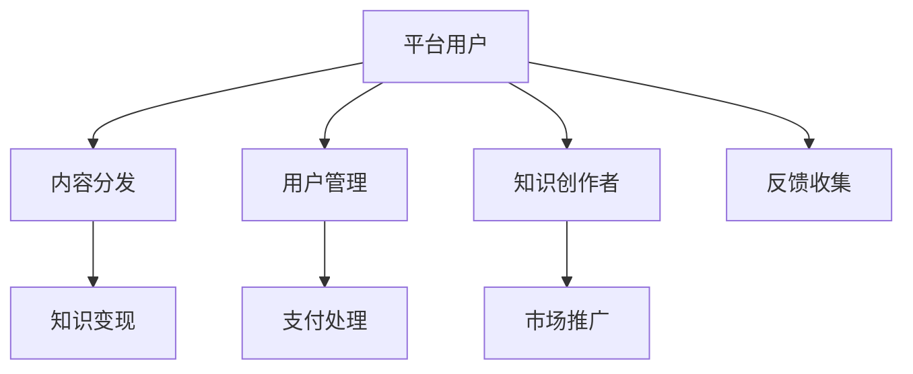

                 

# 如何打造个人知识付费平台

## 1. 背景介绍

在数字化转型的浪潮中，知识付费平台已成为信息时代的重要产物，通过聚合优质内容、连接知识创作者与用户，为信息不对称的鸿沟架设桥梁。个人知识付费平台的崛起，为个体知识分子提供了新的发展机遇，也拓展了知识传播的广度和深度。本文将围绕如何打造个人知识付费平台的核心问题，深入探讨其架构设计、核心算法、系统实现、运营策略等方面，帮助读者系统掌握这一领域的理论和实践。

## 2. 核心概念与联系

### 2.1 核心概念概述

为清晰理解个人知识付费平台的设计与实现，以下是对相关核心概念的简要介绍：

- **个人知识付费平台**：基于互联网的在线平台，通过聚合并分发个人知识创作者的原创内容，让用户以付费形式获取知识。平台提供内容分发、用户管理、支付处理、市场推广等多方面功能，支持知识变现。

- **知识创作者**：指拥有专业知识和技能，通过平台发布原创内容，以获得经济收益的个人或组织。

- **平台用户**：通过支付平台费用，获取知识创作者提供的个性化、专业化的知识服务，提升自身能力和素养的用户群体。

- **内容分发**：将知识创作者的原创内容，通过推荐算法、用户评论、搜索等形式，呈现给平台用户，满足其知识获取需求。

- **知识变现**：通过平台提供的技术和市场支持，知识创作者能够将专业知识转化为经济收益，形成良性循环。

- **用户管理**：平台提供用户账户管理、订阅关系管理、反馈收集等功能，提升用户体验和平台粘性。

- **支付处理**：处理用户支付，确保平台资金安全和交易透明，降低用户支付风险。

- **市场推广**：通过社交媒体、广告投放、内容营销等手段，推广平台内容，吸引更多用户加入。

这些概念通过互联网技术相互关联，构成了一个完整的个人知识付费平台体系。

### 2.2 核心概念原理和架构的 Mermaid 流程图



这个图展示了个人知识付费平台的核心流程：用户通过平台获取知识创作者提供的内容，同时平台也通过用户管理、支付处理、市场推广等环节，支持知识创作者的内容变现和平台运营。

## 3. 核心算法原理 & 具体操作步骤

### 3.1 算法原理概述

个人知识付费平台的核心算法设计，集中在内容分发、个性化推荐、用户行为分析、内容质量评估等方面。通过算法，平台能够高效匹配用户与内容，提升用户体验和平台活跃度。

### 3.2 算法步骤详解

**内容分发算法**：

1. **用户画像构建**：利用用户历史行为数据（如浏览记录、搜索历史、订阅内容等），构建用户画像，包含用户的兴趣偏好、活跃时间、消费习惯等信息。

2. **内容质量评估**：基于内容创作者的资质、内容质量、用户评价等指标，对知识创作者的原创内容进行质量评估，确保平台内容的高水准。

3. **内容推荐算法**：通过协同过滤、内容相似度匹配等技术，将用户画像与内容质量评估结果结合，生成个性化推荐列表，展示给用户。

**个性化推荐算法**：

1. **协同过滤**：基于用户历史行为和内容元数据，找到与当前用户兴趣相似的其他用户，分析这些用户曾订阅和浏览过的内容，为用户推荐。

2. **内容相似度匹配**：利用TF-IDF、Word2Vec等技术，计算内容向量，找到与用户偏好内容相似的其他内容，推荐给用户。

3. **混合推荐**：结合协同过滤和内容相似度匹配算法，生成综合推荐结果，提升推荐效果。

**用户行为分析算法**：

1. **用户行为建模**：使用时间序列分析、序列推荐等方法，建模用户行为序列，识别用户兴趣变化趋势。

2. **行为预测**：基于用户行为数据，预测用户后续可能感兴趣的内容，指导平台内容的动态调整。

**内容质量评估算法**：

1. **用户反馈分析**：收集用户对内容的评价和反馈，利用情感分析等技术，评估内容质量。

2. **质量指标设计**：设定内容点赞数、评论数、订阅数等指标，作为内容质量评估的参考。

3. **内容审核机制**：引入专家评审、算法审核等多重机制，确保内容健康合规。

### 3.3 算法优缺点

- **优点**：
  - 算法驱动的内容分发，能够高效匹配用户和内容，提升用户体验。
  - 个性化推荐算法，通过协同过滤、内容相似度匹配等技术，提升用户粘性和留存率。
  - 用户行为分析，帮助平台理解用户需求，优化内容和推广策略。
  - 内容质量评估，确保平台内容的高质量和健康性。

- **缺点**：
  - 算法需要大量数据支持，对于新用户和低活跃用户，推荐效果可能较差。
  - 算法模型复杂，可能存在一定的偏差和误判。
  - 用户行为数据的隐私保护，需要严格的合规处理。

### 3.4 算法应用领域

个人知识付费平台的核心算法，广泛应用于内容分发、个性化推荐、用户行为分析、内容质量评估等多个环节，具体包括：

- **内容分发**：通过算法匹配用户和内容，提高内容的曝光率和点击率。
- **个性化推荐**：根据用户兴趣，推荐个性化内容，提升用户体验。
- **用户行为分析**：分析用户行为数据，预测用户需求，指导内容和推广策略调整。
- **内容质量评估**：确保平台内容质量和合规性，提升用户信任感。

## 4. 数学模型和公式 & 详细讲解 & 举例说明

### 4.1 数学模型构建

以内容推荐算法为例，构建推荐模型的数学模型：

设用户集合为 $U$，内容集合为 $I$，用户 $u$ 对内容 $i$ 的评分 $r_{ui}$ 为 $1$ 或 $0$，表示是否对内容感兴趣。构建用户-内容评分矩阵 $R$：

$$
R = \{r_{ui}\}_{u \in U, i \in I}
$$

设内容向量表示为 $X_i$，用户向量表示为 $Y_u$，用户 $u$ 对内容 $i$ 的评分预测值 $\hat{r}_{ui}$ 为：

$$
\hat{r}_{ui} = \frac{\sum_{j \in N(u)} w_j \cdot X_j^T \cdot Y_u}{\sqrt{\sum_{j \in N(u)} X_j^T \cdot X_j} + \epsilon}
$$

其中 $N(u)$ 表示与用户 $u$ 相似的其他用户，$w_j$ 为相似度权重，$\epsilon$ 为平滑项，避免分母为零。

### 4.2 公式推导过程

将评分预测值与真实评分 $r_{ui}$ 进行误差计算，得到损失函数：

$$
L = \frac{1}{|U|}\sum_{u \in U}\sum_{i \in I}(r_{ui}-\hat{r}_{ui})^2
$$

利用梯度下降法，求解损失函数最小值，得到模型的优化参数 $\theta$：

$$
\theta = \arg\min_{\theta} L
$$

其中 $\theta$ 包括用户向量 $Y_u$ 和内容向量 $X_i$ 的参数。

### 4.3 案例分析与讲解

以知乎平台为例，分析内容推荐算法的具体实现：

知乎平台的推荐算法主要基于协同过滤和内容相似度匹配。对于用户 $u$，平台通过分析其历史浏览记录和点赞行为，构建用户向量 $Y_u$。同时，根据内容的质量评估指标和用户评分，构建内容向量 $X_i$。

用户对内容 $i$ 的评分预测值 $\hat{r}_{ui}$ 为：

$$
\hat{r}_{ui} = \frac{\sum_{j \in N(u)} w_j \cdot X_j^T \cdot Y_u}{\sqrt{\sum_{j \in N(u)} X_j^T \cdot X_j} + \epsilon}
$$

其中 $N(u)$ 为与用户 $u$ 兴趣相似的其他用户集合，$w_j$ 为相似度权重。

通过计算用户对内容的评分预测值，并排序生成推荐列表，知乎平台实现了个性化推荐，提升了用户活跃度和满意度。

## 5. 项目实践：代码实例和详细解释说明

### 5.1 开发环境搭建

为了开发个人知识付费平台，需要以下开发环境：

- **服务器环境**：搭建高性能服务器，支持Python、Web框架（如Django、Flask等）、数据库（如MySQL、PostgreSQL）等。
- **Python环境**：安装必要的Python库，如TensorFlow、Scikit-Learn、Pandas等。
- **Web开发工具**：使用Django、Flask等Web框架，开发前后端功能。
- **数据库管理**：使用MySQL、PostgreSQL等关系型数据库，管理用户、内容、订单等数据。
- **前端框架**：使用React、Vue等前端框架，开发用户界面。
- **容器化部署**：使用Docker、Kubernetes等容器技术，实现应用的高可用性和自动化管理。

### 5.2 源代码详细实现

以下以Django框架为例，介绍个人知识付费平台的核心代码实现：

```python
from django.db import models
from django.contrib.auth.models import AbstractUser

# 用户模型
class User(AbstractUser):
    pass

# 内容模型
class Content(models.Model):
    title = models.CharField(max_length=255)
    content = models.TextField()
    author = models.ForeignKey(User, on_delete=models.CASCADE)
    create_date = models.DateTimeField(auto_now_add=True)

# 订单模型
class Order(models.Model):
    user = models.ForeignKey(User, on_delete=models.CASCADE)
    content = models.ForeignKey(Content, on_delete=models.CASCADE)
    order_date = models.DateTimeField(auto_now_add=True)
    order_status = models.CharField(max_length=20)
```

上述代码展示了Django框架下，用户、内容和订单的基本模型定义。用户模型继承自Django内置的AbstractUser，内容模型定义了标题、内容、作者等字段，订单模型记录了用户对内容的购买信息。

### 5.3 代码解读与分析

**用户模型**：

```python
from django.contrib.auth.models import AbstractUser

class User(AbstractUser):
    pass
```

用户模型继承自Django的内置用户模型AbstractUser，实现了用户身份的创建、登录、注册等基本功能。同时，通过添加额外字段，可以记录用户的基本信息和行为数据。

**内容模型**：

```python
class Content(models.Model):
    title = models.CharField(max_length=255)
    content = models.TextField()
    author = models.ForeignKey(User, on_delete=models.CASCADE)
    create_date = models.DateTimeField(auto_now_add=True)
```

内容模型定义了内容的标题、正文、作者、创建时间等字段，并通过作者字段，实现了内容与用户之间的关联。同时，通过添加创建时间字段，记录内容的发布时间。

**订单模型**：

```python
class Order(models.Model):
    user = models.ForeignKey(User, on_delete=models.CASCADE)
    content = models.ForeignKey(Content, on_delete=models.CASCADE)
    order_date = models.DateTimeField(auto_now_add=True)
    order_status = models.CharField(max_length=20)
```

订单模型记录了用户对内容的购买信息，包括用户、内容、订单时间、订单状态等字段。通过设置外键，实现了用户与内容之间的关联。

### 5.4 运行结果展示

通过上述代码实现，可以搭建一个基本的个人知识付费平台。用户在平台上浏览内容、购买订阅，平台通过算法推荐相关内容，并处理支付订单。

## 6. 实际应用场景

个人知识付费平台的实际应用场景丰富，包括但不限于：

- **职业培训**：通过平台发布职业相关的课程和培训内容，帮助用户提升职业技能。
- **技能学习**：提供各类兴趣和技能课程，如编程、设计、语言学习等，满足用户多样化学习需求。
- **投资理财**：发布财经和投资相关的知识和策略，帮助用户进行投资决策。
- **家庭教育**：提供各类学科知识和教学资源，支持家庭教育和在线辅导。
- **健康生活**：提供健康饮食、运动、心理等方面的知识，提升用户生活质量。
- **创意创作**：发布各类创意和艺术作品，支持创作者和用户的互动和交流。

## 7. 工具和资源推荐

### 7.1 学习资源推荐

- **《算法设计与分析》**：针对算法原理与实际应用，提供了详实的学习内容。
- **《机器学习实战》**：通过实战项目，讲解机器学习模型的构建与优化。
- **《Python网络爬虫开发实战》**：介绍了爬虫技术在数据采集和处理中的应用。
- **《Web应用安全开发》**：讲解Web应用常见安全漏洞和防护措施。
- **《大数据技术与应用》**：讲解大数据处理与分析技术，支持平台数据管理。

### 7.2 开发工具推荐

- **Django**：流行的Web开发框架，支持快速开发后端应用。
- **Flask**：轻量级Web框架，灵活方便，适合小型项目开发。
- **MySQL**：稳定的关系型数据库，支持高并发和高可用性。
- **PostgreSQL**：先进的数据库管理系统，支持复杂查询和大数据分析。
- **React**：流行的前端框架，支持组件化开发和动态渲染。
- **Docker**：容器化技术，支持应用的高可用和弹性扩展。
- **Kubernetes**：容器编排工具，支持应用的自动化管理和部署。

### 7.3 相关论文推荐

- **《基于协同过滤的推荐系统研究》**：介绍协同过滤算法的原理与应用。
- **《基于深度学习的推荐系统研究》**：介绍深度学习在推荐系统中的应用。
- **《用户行为分析在推荐系统中的应用》**：介绍用户行为分析在推荐系统中的应用。
- **《内容质量评估方法研究》**：介绍内容质量评估的多种方法和技术。

## 8. 总结：未来发展趋势与挑战

### 8.1 总结

本文系统介绍了个人知识付费平台的构建与实现，从核心概念到算法原理，再到项目实践，全面覆盖了平台的设计与开发流程。通过实例分析，展示了算法在内容分发、个性化推荐、用户行为分析等方面的应用，帮助读者深入理解平台的运行机制和关键技术。

个人知识付费平台的兴起，为个体知识分子提供了新的发展机遇，也拓展了知识传播的广度和深度。通过算法驱动，平台能够高效匹配用户和内容，提升用户体验和平台粘性。未来，伴随技术的不断演进，平台将支持更多个性化的内容和服务，实现知识变现的持续增长。

### 8.2 未来发展趋势

个人知识付费平台未来可能的发展趋势包括：

1. **多模态融合**：平台将支持视频、音频等多模态内容，提升用户的互动和体验。
2. **社交功能增强**：平台将支持用户互动、评论、点赞等功能，增强用户粘性。
3. **个性化推荐优化**：通过更先进的算法，提升推荐效果和精准度。
4. **内容质量控制**：引入专家评审、内容审核等机制，确保平台内容的高质量和安全。
5. **技术架构升级**：采用更高效的技术架构，支持平台的快速扩展和迭代。

### 8.3 面临的挑战

平台在发展过程中，面临以下挑战：

1. **内容质量控制**：平台需要建立严格的内容审核机制，确保内容的健康性和合规性。
2. **用户隐私保护**：用户数据隐私保护需要严格合规，确保平台数据的合法性和安全性。
3. **技术架构复杂**：平台涉及前后端开发、数据库管理、容器化部署等技术，技术栈复杂。
4. **市场竞争激烈**：市场竞争激烈，平台需要不断创新，保持市场竞争力。

### 8.4 研究展望

针对平台面临的挑战，未来研究的方向包括：

1. **内容审核机制**：引入人工智能技术，提升内容审核的效率和准确性。
2. **用户隐私保护**：采用区块链技术，保护用户数据隐私，确保平台数据的安全性。
3. **技术架构优化**：采用微服务架构，支持应用的弹性扩展和快速迭代。
4. **市场竞争力提升**：通过算法优化和创新，提升平台的推荐效果和用户体验，保持市场竞争力。

## 9. 附录：常见问题与解答

**Q1：个人知识付费平台有哪些关键功能模块？**

A: 个人知识付费平台的关键功能模块包括：

- **用户管理模块**：负责用户注册、登录、个人信息管理等功能。
- **内容发布模块**：支持知识创作者发布内容，包括文章、视频、音频等。
- **内容推荐模块**：根据用户兴趣和行为，推荐个性化内容，提升用户体验。
- **订单管理模块**：处理用户购买订单，支持内容付费和订阅服务。
- **支付处理模块**：支持多种支付方式，确保支付安全和便捷。
- **市场推广模块**：通过社交媒体、广告投放等手段，推广平台内容，吸引更多用户。

**Q2：平台如何进行内容审核？**

A: 平台进行内容审核的步骤如下：

1. **内容提交**：知识创作者通过平台提交原创内容。
2. **内容审核**：平台使用算法和专家评审相结合的方式，对内容进行初步审核。
3. **专家评审**：邀请领域专家对内容进行评审，确保内容质量。
4. **内容发布**：经过审核和评审的内容，发布在平台上。

**Q3：平台如何进行个性化推荐？**

A: 平台进行个性化推荐的步骤如下：

1. **用户画像构建**：利用用户历史行为数据，构建用户画像，包含用户的兴趣偏好、活跃时间、消费习惯等信息。
2. **内容质量评估**：基于内容质量评估指标，对知识创作者的原创内容进行质量评估，确保平台内容的高水准。
3. **内容推荐算法**：通过协同过滤、内容相似度匹配等技术，将用户画像与内容质量评估结果结合，生成个性化推荐列表。

**Q4：平台如何处理支付订单？**

A: 平台处理支付订单的步骤如下：

1. **订单创建**：用户在平台上浏览内容，选择购买后，创建订单。
2. **支付处理**：平台处理用户支付，确保支付安全和透明。
3. **订单管理**：记录订单信息，更新用户和内容的关联关系。
4. **订单执行**：用户支付完成后，平台执行订单，推送内容给用户。

**Q5：平台如何处理用户反馈？**

A: 平台处理用户反馈的步骤如下：

1. **收集反馈**：用户对内容进行评价和反馈，平台收集反馈数据。
2. **数据分析**：利用情感分析等技术，分析用户反馈内容。
3. **内容调整**：根据用户反馈，调整内容发布策略和推荐算法。
4. **用户沟通**：与知识创作者和用户沟通，了解反馈原因，优化平台服务。

---

作者：禅与计算机程序设计艺术 / Zen and the Art of Computer Programming

