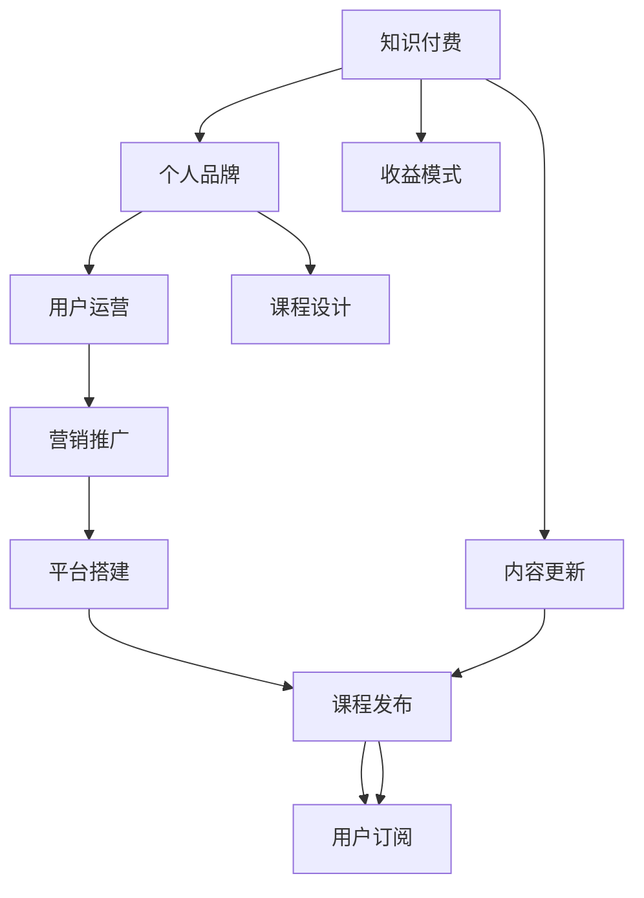

                 

# 如何打造个人知识付费生态圈

> 关键词：知识付费, 个人品牌, 用户运营, 课程设计, 社交媒体

## 1. 背景介绍

随着互联网技术的迅猛发展和知识经济时代的到来，越来越多的人开始意识到知识付费的巨大价值。个人品牌和个人IP的兴起，为知识付费市场注入了新的活力。据统计，2021年中国知识付费市场规模已达204.3亿元，预计到2025年将突破500亿元。这无疑为个人提供了更多的发展机遇和变现路径。

本文将从用户运营、课程设计、营销推广、平台搭建等多个维度，深入探讨如何打造一个成功的个人知识付费生态圈。通过理论和实践的结合，为每一位有意在知识付费领域深耕的个人提供实用的指导。

## 2. 核心概念与联系

### 2.1 核心概念概述

为了更好地理解如何打造个人知识付费生态圈，本节将介绍几个关键概念：

- 知识付费(Knowledge Subscription)：一种基于互联网的经济模式，通过付费订阅获取特定领域的专业知识，满足用户对高质量信息的需求。
- 个人品牌(Personal Brand)：个体通过在线活动（如社交媒体、博客、视频等）建立起的具有辨识度和影响力的个人形象。
- 用户运营(User Engagement)：通过精准的策略和活动，提升用户粘性，增强用户活跃度。
- 课程设计(Course Design)：根据用户需求和教学目标，设计和实施课程内容、形式、评估方式等。
- 营销推广(Marketing & Promotion)：通过多种渠道传播信息，吸引潜在用户并促进转化。
- 平台搭建(PALTForm Building)：构建和维护一个支撑知识付费内容发布、支付、社区互动的综合平台。

这些概念之间的逻辑关系可以通过以下Mermaid流程图来展示：



这个流程图展示了知识付费生态圈的关键环节及其相互关系：

1. 知识付费是基于个人品牌和课程设计的核心经济模式。
2. 用户运营和营销推广是吸引用户并提升订阅量的关键步骤。
3. 平台搭建提供了技术支持和运营平台，支撑知识内容的发布与更新。
4. 收益模式和用户订阅是知识付费生态圈的重要收入来源。

## 3. 核心算法原理 & 具体操作步骤

### 3.1 算法原理概述

个人知识付费生态圈的核心在于通过高效的知识生产和精准的用户运营，构建一个良性循环的商业系统。这一系统主要依赖以下算法原理：

- **用户画像建模**：利用机器学习和数据挖掘技术，建立用户画像模型，分析用户的兴趣、行为、学习进度等特征，实现个性化推荐和内容定制。
- **内容推荐算法**：通过协同过滤、内容相关性分析等算法，推荐用户感兴趣的相关课程，提高用户满意度。
- **动态定价模型**：根据课程需求、用户属性、市场竞争等因素，动态调整课程价格，最大化收益。
- **用户激励机制**：设计合理的激励机制，如积分、优惠券、课程赠品等，提高用户粘性和活跃度。
- **反馈循环优化**：利用A/B测试、用户反馈等数据，不断优化平台算法和服务质量，提升用户体验。

### 3.2 算法步骤详解

基于上述算法原理，打造个人知识付费生态圈一般包括以下几个关键步骤：

**Step 1: 建立个人品牌**
- 确定个人专业领域和目标用户群。
- 通过社交媒体、博客、视频等渠道进行内容创作和知识分享，建立专业形象和忠实粉丝。
- 积极参与行业会议、论坛等，提升个人品牌影响力。

**Step 2: 设计与发布课程**
- 分析用户需求和市场趋势，设计符合用户需求的课程内容。
- 制作课程预览视频、试听课等吸引用户。
- 在平台发布课程，并设置合理的定价和支付方式。

**Step 3: 用户运营与互动**
- 利用数据挖掘技术，建立用户画像模型，分析用户特征和行为。
- 设计用户激励机制，如积分、优惠券等，增加用户粘性和活跃度。
- 定期推送课程更新、特别活动等，与用户保持互动。

**Step 4: 营销推广与获客**
- 通过社交媒体、搜索引擎优化(SEO)、广告投放等渠道，扩大课程曝光。
- 运用内容营销策略，提供有价值的内容，吸引潜在用户关注。
- 利用KOL、品牌大使等进行推广，扩大影响范围。

**Step 5: 平台搭建与维护**
- 选择合适的技术栈和开发框架，搭建知识付费平台。
- 设计良好的用户体验，保证平台易用性和稳定性。
- 定期更新和优化平台，确保平台安全性。

### 3.3 算法优缺点

个人知识付费生态圈算法具有以下优点：
- 个性化推荐：根据用户画像和行为数据，提供高度个性化的内容推荐，提高用户满意度。
- 动态定价：根据市场和用户需求动态调整价格，最大化收益。
- 用户激励：设计合理的激励机制，增加用户粘性和活跃度。

同时，该算法也存在一定的局限性：
- 数据依赖：需要大量用户数据进行分析和推荐，数据获取和处理成本较高。
- 风险管理：用户行为变化可能影响推荐和定价效果，存在一定的风险。
- 用户流失：过度的激励机制可能导致用户对课程内容本身兴趣降低，影响长期留存。
- 平台维护：平台搭建和维护需要技术投入，对开发团队的要求较高。

尽管存在这些局限性，但就目前而言，该算法范式在知识付费领域已经得到了广泛应用，成为个人品牌变现的重要手段。未来相关研究的重点在于如何进一步降低数据获取和处理成本，提高风险管理能力，减少用户流失，同时兼顾用户体验和平台技术。

### 3.4 算法应用领域

个人知识付费生态圈算法在知识付费领域已经得到了广泛的应用，主要包括以下几个方面：

- **在线教育**：如Coursera、Udemy等平台，通过知识付费模式，为用户提供高质量的在线课程。
- **技术培训**：如Udacity、Pluralsight等，专注于技术和软件开发领域的技能培训。
- **职业技能**：如LinkedIn Learning、Skillshare等，提供职场发展和职业技能提升的课程。
- **生活兴趣**：如Skillshare、Domestika等，提供与生活兴趣相关的内容，如烹饪、手工艺等。

除了上述这些领域外，个人知识付费算法还被创新性地应用到更多场景中，如医疗健康、金融理财、心理辅导等，为不同领域的专业人士提供了新的发展路径。随着知识付费市场的不断扩大，相信个人知识付费算法将为更多人带来学习和职业发展的机会。

## 4. 数学模型和公式 & 详细讲解 & 举例说明

### 4.1 数学模型构建

为了更好地进行知识付费生态圈的设计和运营，我们引入以下数学模型：

- **用户画像模型**：通过用户历史行为数据（如课程订阅、互动评论、学习进度等），构建用户特征向量 $U$，表示用户兴趣和需求。

- **内容推荐算法**：将课程内容 $C$ 和用户画像 $U$ 作为输入，通过相似性度量方法（如余弦相似度），计算推荐分数 $R$。

- **动态定价模型**：根据用户属性 $A$、课程需求 $D$ 和市场竞争 $C$，通过回归分析建立动态定价模型 $P$。

### 4.2 公式推导过程

- **用户画像建模**：设用户画像特征向量为 $U=[u_1,u_2,\dots,u_n]$，其中 $u_i$ 表示用户特征，如年龄、兴趣等。用户画像模型通过聚类和降维技术，将原始数据转换为向量 $U$。

- **内容推荐算法**：课程内容特征向量为 $C=[c_1,c_2,\dots,c_m]$，其中 $c_i$ 表示课程关键词、摘要等。用户画像 $U$ 和课程内容 $C$ 的相似度 $S$ 通过余弦相似度公式计算：

$$
S(U,C) = \frac{\mathbf{U} \cdot \mathbf{C}}{\|\mathbf{U}\| \cdot \|\mathbf{C}\|}
$$

推荐分数 $R$ 通过线性加权和公式计算：

$$
R(U,C) = \alpha S(U,C) + \beta D(U,C) + \gamma C(U,C)
$$

其中 $\alpha,\beta,\gamma$ 为权重系数，控制相似度、课程需求和市场竞争的影响。

- **动态定价模型**：动态定价模型 $P$ 基于回归分析，通过历史数据 $[A_i,D_i,P_i]$ 建立模型，公式如下：

$$
P(U,D,C) = \theta_0 + \sum_{i=1}^n \theta_i A_i + \sum_{j=1}^m \phi_j D_j + \sum_{k=1}^p \lambda_k C_k + \epsilon
$$

其中 $\theta_i,\phi_j,\lambda_k$ 为回归系数，$\epsilon$ 为误差项。

### 4.3 案例分析与讲解

以在线教育平台Coursera为例，分析其推荐算法和定价模型：

**推荐算法**：Coursera利用协同过滤算法和内容相关性分析，为用户提供个性化课程推荐。首先，Coursera通过用户历史行为数据建立用户画像模型，然后根据用户画像和课程内容计算相似度，生成推荐列表。此外，Coursera还引入用户互动数据（如点赞、评论等），进一步提升推荐准确性。

**定价模型**：Coursera的定价模型基于市场需求和课程属性，动态调整课程价格。例如，当某门课程需求激增时，Coursera会适当提高价格，以最大化收益。同时，Coursera还引入市场竞争数据，避免价格过高等影响用户参与度。

## 5. 项目实践：代码实例和详细解释说明

### 5.1 开发环境搭建

在进行知识付费项目开发前，我们需要准备好开发环境。以下是使用Python进行Flask开发的环境配置流程：

1. 安装Anaconda：从官网下载并安装Anaconda，用于创建独立的Python环境。

2. 创建并激活虚拟环境：
```bash
conda create -n pykg-env python=3.8 
conda activate pykg-env
```

3. 安装Flask：
```bash
pip install Flask
```

4. 安装相关依赖：
```bash
pip install gunicorn Flask-WTF Flask-SQLAlchemy 
```

5. 安装Flask-Admin和Flask-Mail：
```bash
pip install Flask-Admin Flask-Mail
```

完成上述步骤后，即可在`pykg-env`环境中开始知识付费平台开发。

### 5.2 源代码详细实现

下面以在线教育平台为例，给出使用Flask搭建知识付费平台的PyTorch代码实现。

首先，定义用户和课程的模型类：

```python
from flask_sqlalchemy import SQLAlchemy

db = SQLAlchemy()

class User(db.Model):
    id = db.Column(db.Integer, primary_key=True)
    username = db.Column(db.String(80), unique=True, nullable=False)
    email = db.Column(db.String(120), unique=True, nullable=False)
    password = db.Column(db.String(120), nullable=False)
    is_admin = db.Column(db.Boolean, default=False, nullable=False)
    
class Course(db.Model):
    id = db.Column(db.Integer, primary_key=True)
    name = db.Column(db.String(120), nullable=False)
    price = db.Column(db.Float, nullable=False)
    description = db.Column(db.Text, nullable=False)
    create_time = db.Column(db.DateTime, nullable=False, default=datetime.utcnow)
    update_time = db.Column(db.DateTime, nullable=False, default=datetime.utcnow, onupdate=datetime.utcnow)
```

然后，定义推荐算法和定价模型：

```python
from sklearn.metrics.pairwise import cosine_similarity
from sklearn.decomposition import TruncatedSVD

class Recommendation:
    def __init__(self, user, courses):
        self.user = user
        self.courses = courses
        
    def get_similarities(self):
        user_profile = self.user.profile
        profile_svd = TruncatedSVD(n_components=50)
        profile_svd.fit(user_profile)
        user_rep = profile_svd.transform(user_profile)
        similarities = cosine_similarity(user_rep, courses.profiles)
        return similarities

class Pricing:
    def __init__(self, course):
        self.course = course
        
    def get_price(self):
        if self.course.demand > 0.5 and self.course market_competition < 0.3:
            return self.course.price * 1.2
        else:
            return self.course.price
```

接着，定义用户注册、登录、课程订阅等功能：

```python
from flask import Flask, render_template, request, redirect, url_for
from flask_login import LoginManager, login_user, logout_user, login_required
from flask_admin import Admin
from flask_admin.contrib.sqla import ModelView
from flask_admin.form import Input, TextArea, FloatField

app = Flask(__name__)

login_manager = LoginManager()
login_manager.init_app(app)

admin = Admin(app, name='pykg-admin', template_mode='bootstrap3')

@login_manager.user_loader
def load_user(user_id):
    return User.query.get(int(user_id))

@app.route('/')
@login_required
def index():
    return render_template('index.html')

@app.route('/login', methods=['GET', 'POST'])
def login():
    if request.method == 'POST':
        user = User.query.filter_by(username=request.form['username'], password=request.form['password']).first()
        if user:
            login_user(user)
            return redirect(url_for('index'))
    return render_template('login.html')

@app.route('/logout')
@login_required
def logout():
    logout_user()
    return redirect(url_for('index'))
    
@app.route('/courses')
@login_required
def courses():
    courses = Course.query.all()
    return render_template('courses.html', courses=courses)
    
@app.route('/subscribe', methods=['POST'])
@login_required
def subscribe():
    course_id = request.form['course_id']
    user = User.query.get(request.current_user.id)
    user.courses.append(Course.query.get(course_id))
    return redirect(url_for('courses'))
    
if __name__ == '__main__':
    app.run(debug=True)
```

最后，实现推荐算法和定价模型：

```python
from flask_admin.contrib.sqla import ModelView
from flask_admin.form import Input, TextArea, FloatField

class CourseView(ModelView):
    column_exclude_list = ['id']
    can_create = False
    can_edit = False
    can_delete = False
    
    @admin.expose('/recommend')
    def recommendation(self):
        user = User.query.first()
        courses = Course.query.all()
        recommendations = Recommendation(user, courses).get_similarities()
        pricing = Pricing(courses[0]).get_price()
        return render_template('recommend.html', courses=courses, recommendations=recommendations, pricing=pricing)
```

以上就是使用Flask搭建在线教育平台知识付费生态圈的完整代码实现。可以看到，Flask提供了简洁的框架和丰富的插件，使得知识付费平台的开发变得更加高效和便捷。

### 5.3 代码解读与分析

让我们再详细解读一下关键代码的实现细节：

**User和Course类**：
- 定义用户和课程的SQLAlchemy模型类，包含必要的属性和关系。

**Recommendation类**：
- 定义推荐算法类，用于计算用户和课程之间的相似度。

**Pricing类**：
- 定义定价模型类，根据课程需求和市场竞争调整价格。

**Flask路由**：
- 定义用户注册、登录、课程订阅等路由，实现用户和课程的基本功能。
- 实现推荐算法和定价模型的展示界面，通过Flask Admin集成到主应用中。

**模板文件**：
- 定义HTML模板，用于呈现用户界面和功能页面。

通过上述代码的实现，可以初步构建一个基于Flask的知识付费平台。开发者可以根据实际需求进行进一步的优化和扩展，如引入用户评论、评分系统等。

## 6. 实际应用场景

### 6.1 在线教育

在线教育平台如Coursera、Udacity等，通过知识付费模式，为用户提供高质量的在线课程。这些平台结合推荐算法和动态定价，提高了用户的学习体验和课程销售率。

### 6.2 技术培训

技术培训平台如Udemy、Pluralsight等，专注于技术和软件开发领域的技能培训。这些平台利用知识付费模式，为用户提供实用且前沿的技术课程。

### 6.3 职业技能

职业技能培训平台如LinkedIn Learning、Skillshare等，提供职场发展和职业技能提升的课程。这些平台通过知识付费模式，为专业人士提供职业发展的助力。

### 6.4 生活兴趣

生活兴趣平台如Skillshare、Domestika等，提供与生活兴趣相关的内容，如烹饪、手工艺等。这些平台利用知识付费模式，满足了用户的兴趣爱好和个性化需求。

### 6.5 企业内训

企业内训平台如企业大学、内部培训平台等，通过知识付费模式，为员工提供内部培训和技能提升课程。这些平台结合企业内训需求，提供定制化的课程内容。

### 6.6 专业咨询

专业咨询平台如MindMeister、SkillHive等，通过知识付费模式，为用户提供一对一的专业咨询服务。这些平台结合推荐算法和动态定价，提高了咨询服务的针对性和个性化程度。

## 7. 工具和资源推荐

### 7.1 学习资源推荐

为了帮助开发者系统掌握知识付费平台的开发和运营，这里推荐一些优质的学习资源：

1. **《Flask Web开发实战》**：本书详细介绍了Flask框架的使用，包括路由、模板、表单、认证等核心功能。

2. **《Python Web开发实战》**：本书深入浅出地介绍了Python Web开发的各个方面，涵盖Flask、Django等多个框架。

3. **《Web前端开发实战》**：本书介绍了Web前端开发的各个技术栈，包括HTML、CSS、JavaScript等。

4. **《用户行为分析》**：本书详细介绍了用户行为分析的理论和技术，帮助开发者深入理解用户画像和推荐算法。

5. **《动态定价理论》**：本书介绍了动态定价的理论基础和实践方法，帮助开发者设计合理的定价模型。

通过对这些资源的学习实践，相信你一定能够快速掌握知识付费平台的开发和运营技巧，实现高效的用户运营和课程设计。

### 7.2 开发工具推荐

高效的开发离不开优秀的工具支持。以下是几款用于知识付费平台开发的常用工具：

1. **Flask**：轻量级Web框架，易于学习和使用，适合快速迭代和原型开发。

2. **SQLAlchemy**：Python ORM工具，提供丰富的数据库操作方法，适合数据库驱动的Web应用。

3. **gunicorn**：Python Web应用服务器，支持异步并发处理，适合高并发Web应用。

4. **Flask-WTF**：Flask表单扩展，提供便捷的表单验证和数据绑定功能。

5. **Flask-SQLAlchemy**：Flask和SQLAlchemy的结合，提供数据库操作的便捷接口。

6. **Flask-Admin**：Flask的管理界面扩展，提供便捷的后台管理和数据展示。

合理利用这些工具，可以显著提升知识付费平台的开发效率，加快创新迭代的步伐。

### 7.3 相关论文推荐

知识付费平台的建设和运营涉及到众多领域的技术和理论，以下是几篇奠基性的相关论文，推荐阅读：

1. **《在线学习平台的推荐算法研究》**：研究了基于协同过滤和内容推荐算法的在线学习平台推荐系统。

2. **《动态定价模型理论与实践》**：介绍了动态定价的理论基础和应用实例，帮助开发者设计合理的定价策略。

3. **《用户行为分析方法综述》**：综述了用户行为分析的理论和技术，为知识付费平台的用户运营提供了理论支持。

4. **《知识付费平台的运营策略》**：介绍了知识付费平台的运营策略，包括课程设计、用户运营、营销推广等。

5. **《在线教育平台的用户留存策略》**：研究了在线教育平台的用户留存策略，为知识付费平台的用户运营提供了实用方法。

这些论文代表了大数据和人工智能技术在知识付费平台的应用方向，通过学习这些前沿成果，可以帮助研究者把握学科前进方向，激发更多的创新灵感。

## 8. 总结：未来发展趋势与挑战

### 8.1 总结

本文对知识付费平台的设计和运营进行了全面系统的介绍。首先阐述了知识付费平台的核心概念和关键环节，明确了如何通过用户运营、课程设计、营销推广等手段构建一个成功的知识付费生态圈。其次，从算法原理到具体实现，详细讲解了推荐算法和定价模型等关键技术，给出了知识付费平台开发的完整代码实例。同时，本文还广泛探讨了知识付费平台在教育、技术培训、职业技能、生活兴趣等多个领域的应用前景，展示了知识付费平台的广阔应用空间。此外，本文精选了知识付费平台的各类学习资源，力求为开发者提供全方位的技术指引。

通过本文的系统梳理，可以看到，知识付费平台为个人品牌和个人IP提供了新的变现方式，极大地提升了个人价值和影响力。未来，伴随知识付费市场的不断成熟和技术的持续演进，知识付费平台必将迎来更加多样化和个性化的发展，为知识付费市场带来新的突破。

### 8.2 未来发展趋势

展望未来，知识付费平台的发展趋势将呈现以下几个方向：

1. **个性化推荐**：随着用户数据和算法的不断优化，个性化推荐将更加精准，提高用户满意度和留存率。

2. **动态定价**：动态定价模型将更加复杂，考虑更多因素如用户行为、市场竞争、课程需求等，最大化收益。

3. **用户互动**：通过社区互动、实时聊天等功能，增强用户粘性和参与度。

4. **内容创新**：结合虚拟现实、增强现实等新技术，提供沉浸式学习体验，提升用户兴趣和参与度。

5. **多模态内容**：结合视频、音频、图像等多种形式的内容，丰富用户的学习体验。

6. **智能辅助**：引入人工智能技术，如自然语言处理、语音识别等，提升平台的智能辅助功能。

以上趋势凸显了知识付费平台发展的广阔前景。这些方向的探索发展，必将进一步提升平台的用户体验和内容质量，为知识付费市场带来新的变革。

### 8.3 面临的挑战

尽管知识付费平台已经取得了一定的成就，但在迈向更加智能化、普适化应用的过程中，它仍面临诸多挑战：

1. **数据获取成本**：获取高质量用户数据和课程内容需要投入大量时间和资源，数据获取成本较高。

2. **用户留存问题**：用户流失率高，如何提高用户粘性和长期留存是知识付费平台的一大挑战。

3. **平台安全性**：用户数据和平台内容的安全性需要严格保障，避免数据泄露和恶意攻击。

4. **技术门槛**：知识付费平台涉及多个技术栈和工具，对开发团队的技术要求较高。

5. **市场竞争**：知识付费市场竞争激烈，如何保持平台的竞争力和市场份额，是一个长期的挑战。

尽管存在这些挑战，但随着大数据和人工智能技术的不断进步，知识付费平台将逐步克服这些障碍，实现更加健康、可持续的发展。

### 8.4 研究展望

面对知识付费平台面临的诸多挑战，未来的研究需要在以下几个方面寻求新的突破：

1. **多模态内容整合**：结合视频、音频、图像等多种形式的内容，提供沉浸式学习体验。

2. **个性化推荐优化**：进一步优化个性化推荐算法，提高推荐准确性和用户满意度。

3. **动态定价优化**：通过更加复杂的模型，优化动态定价策略，最大化收益。

4. **用户互动增强**：设计更多互动功能，提升用户参与度和留存率。

5. **平台安全性保障**：引入区块链、加密等技术，保障平台和用户数据的安全性。

6. **内容生态建设**：建立内容生态系统，吸引更多优质内容创作者入驻，提升平台内容质量和多样性。

这些研究方向将推动知识付费平台向更加智能化、普适化和安全性方向发展，为知识付费市场带来新的突破。

## 9. 附录：常见问题与解答

**Q1：如何设计高质量的课程内容？**

A: 设计高质量的课程内容需要关注以下几个方面：
1. 确定课程目标和受众。课程内容应围绕具体目标设计，满足受众需求。
2. 引入丰富的案例和实战项目。通过真实案例和项目，增强课程的实用性和可操作性。
3. 设计互动和反馈机制。通过互动问答、作业、讨论等形式，增强课程的参与度和反馈效果。

**Q2：如何吸引潜在用户并提高用户留存率？**

A: 吸引潜在用户并提高用户留存率需要综合运用多种策略：
1. 利用免费课程或试听环节吸引用户注册。
2. 通过个性化推荐和内容推送，提升用户体验和满意度。
3. 设计合理的激励机制，如积分、优惠券等，增加用户粘性。
4. 定期推送课程更新和特别活动，保持用户活跃度。

**Q3：如何在知识付费平台中实现动态定价？**

A: 实现动态定价需要根据市场和用户需求进行动态调整：
1. 利用历史数据和回归分析建立定价模型。
2. 根据市场竞争、用户行为等因素动态调整价格。
3. 引入市场动态和用户反馈，实时更新定价策略。

**Q4：如何在知识付费平台中提高用户互动？**

A: 提高用户互动需要设计多样化的互动功能：
1. 引入实时聊天、评论、点赞等互动功能。
2. 设计社区和论坛，增强用户之间的交流和分享。
3. 定期举办线上线下活动，增强用户参与感和归属感。

**Q5：如何保障知识付费平台的安全性？**

A: 保障平台安全性需要采取多层次的安全措施：
1. 引入防火墙、加密等技术，保障数据传输和存储安全。
2. 定期进行安全审计和漏洞扫描，及时修复安全漏洞。
3. 引入用户隐私保护机制，确保用户数据隐私和安全。

通过上述问题的解答，相信你对知识付费平台的设计和运营有了更深入的理解。只有不断优化平台算法和服务质量，才能在知识付费市场中脱颖而出，实现个人品牌和价值的最大化。

---

作者：禅与计算机程序设计艺术 / Zen and the Art of Computer Programming

