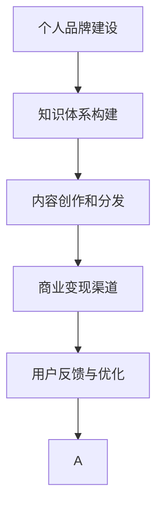

                 

# 如何打造个人知识付费矩阵

## 1. 背景介绍

在知识经济时代，个人品牌和个人IP的崛起，为知识付费提供了广阔的市场空间。如何构建个人知识付费矩阵，形成持续收益的商业模式，成为众多知识工作者关注的焦点。本文将从理论到实践，系统讲解如何打造个人知识付费矩阵，帮助知识工作者构建自己的知识体系和品牌影响力。

## 2. 核心概念与联系

### 2.1 核心概念概述

在打造个人知识付费矩阵的过程中，需要掌握几个核心概念及其内在联系：

- **个人品牌建设**：塑造具有独特价值和个性的个人品牌，吸引目标受众，形成品牌认知和信任。
- **知识体系构建**：梳理、整合自己的知识体系，形成系统化的内容输出，提升内容的针对性和可传播性。
- **内容创作和分发**：高效创作和分发有价值的内容，吸引、留存用户，实现知识变现。
- **商业变现渠道**：选择合适的商业变现渠道，如课程、咨询、订阅、服务等，实现知识收入的多样化。
- **用户反馈与优化**：收集用户反馈，持续优化内容与商业模式，提升用户体验和满意度和忠诚度。

这些概念之间相互联系，形成一个良性循环的系统。只有各个环节协同配合，才能真正打造一个成功的知识付费矩阵。

### 2.2 核心概念原理和架构的 Mermaid 流程图



此图展示了个人品牌建设、知识体系构建、内容创作与分发、商业变现渠道和用户反馈与优化之间的逻辑关系，每一个环节都是不可或缺的。

## 3. 核心算法原理 & 具体操作步骤

### 3.1 算法原理概述

打造个人知识付费矩阵的过程，实际上是一个以个人知识体系为核心的内容变现系统。该系统的构建需要遵循以下算法原理：

1. **数据采集与加工**：收集并加工与个人品牌和知识体系相关的数据。
2. **知识图谱构建**：构建知识图谱，梳理个人知识体系，形成系统化的知识结构。
3. **内容生成与分发**：利用自然语言处理（NLP）、计算机视觉（CV）等技术，生成高质量的内容，并通过社交媒体、博客、视频平台等渠道分发。
4. **数据分析与优化**：通过数据分析技术，监测内容分发效果，优化内容策略。
5. **商业变现**：通过商业变现渠道，如课程销售、会员订阅、咨询服务等，实现知识变现。

### 3.2 算法步骤详解

#### 3.2.1 数据采集与加工

1. **数据来源**：
   - 个人博客、社交媒体、公共演讲、书籍、学术论文等。
   - 通过专业平台如知乎、豆瓣、B站等，获取相关领域的高质量内容。

2. **数据清洗**：
   - 去除重复、无价值、不相关的数据。
   - 使用爬虫技术自动收集数据，利用数据清洗工具如Python的Pandas库、Apache Spark等，进行数据预处理。

3. **数据加工**：
   - 结构化数据：使用SQL数据库进行数据整理，如分表、索引等。
   - 非结构化数据：使用NLP技术进行自然语言处理，提取关键词、实体、情感等信息。

#### 3.2.2 知识图谱构建

1. **知识图谱定义**：
   - 知识图谱是一张描述实体之间关系的图，用于表示个人知识体系。
   - 构建知识图谱，首先需要定义实体类型和关系类型。

2. **知识图谱构建工具**：
   - 使用如Neo4j、YAGO等知识图谱工具，或使用GraphDB等商业化解决方案。

3. **知识图谱填充**：
   - 使用数据采集得到的知识，填充知识图谱，建立实体和实体之间的关系。
   - 利用图数据库的技术优势，高效存储和查询知识图谱。

#### 3.2.3 内容生成与分发

1. **内容生成工具**：
   - 使用如GPT-3、BERT等自然语言生成模型，生成高质量的内容。
   - 利用Python的Jupyter Notebook、Markdown等工具进行内容创作和编辑。

2. **内容分发渠道**：
   - 主流社交媒体平台如微信、微博、抖音等。
   - 博客平台如简书、知乎、CSDN等。
   - 视频平台如B站、优酷、YouTube等。

3. **内容分发策略**：
   - 根据内容类型，选择不同的分发渠道。如长文内容适合博客，短视频内容适合抖音。
   - 利用社交媒体平台的话题标签、热门话题等，提高内容曝光率。

#### 3.2.4 数据分析与优化

1. **数据分析工具**：
   - 使用Python的Pandas、Numpy、Scikit-Learn等工具，进行数据统计和分析。
   - 利用商业智能工具如Tableau、Power BI等，进行可视化分析。

2. **数据分析内容**：
   - 关注内容的阅读量、点赞量、评论量、转发量等。
   - 分析受众画像、兴趣标签等，优化内容策略。

3. **内容优化方法**：
   - 利用A/B测试，比较不同内容形式的受众反馈。
   - 根据受众反馈，调整内容策略，提升内容质量。

#### 3.2.5 商业变现

1. **商业变现渠道**：
   - 通过在线课程平台如Coursera、Udemy等，销售课程。
   - 提供付费咨询或一对一辅导服务。
   - 开通付费订阅服务，提供专属内容或资讯。
   - 推出线上线下结合的线下活动，如讲座、研讨会等。

2. **商业变现策略**：
   - 根据受众需求，推出针对性的产品和服务。
   - 使用平台如微盟、微信营销等工具，提升商业变现效率。
   - 利用社交电商等新兴渠道，开拓新的收入来源。

### 3.3 算法优缺点

#### 3.3.1 算法优点

1. **高效内容生产**：
   - 利用AI技术，高效生成高质量的内容，提升内容创作效率。
   - 构建知识图谱，梳理知识体系，形成系统化的内容输出。

2. **精准受众定位**：
   - 利用数据分析技术，精准定位目标受众，提高内容的传播效果。
   - 根据受众反馈，持续优化内容，提升用户满意度和忠诚度。

3. **多渠道分发**：
   - 通过多种分发渠道，覆盖更多用户，实现内容最大化的曝光。
   - 利用不同渠道的特性，提高内容的分发效果。

#### 3.3.2 算法缺点

1. **内容质量依赖**：
   - 内容质量依赖于作者个人能力和数据质量，需要持续投入。
   - 部分内容生成技术如GPT-3等，仍存在生成内容过于泛化、缺乏深度的缺点。

2. **商业模式局限**：
   - 单一商业模式如课程销售，可能难以覆盖更广泛的用户群体。
   - 内容分发渠道有限，难以完全满足不同用户需求。

3. **平台依赖性强**：
   - 依赖于各大平台的流量分配机制，对平台政策变化敏感。
   - 平台佣金较高，利润分配比例可能对个人收益有影响。

### 3.4 算法应用领域

个人知识付费矩阵的应用领域非常广泛，不仅限于教育培训、咨询指导等领域。以下列举几个典型应用场景：

1. **技术博客**：
   - 技术专家通过博客分享专业知识和行业动态，吸引技术爱好者。
   - 通过广告、付费文章、会员订阅等方式变现。

2. **心理咨询**：
   - 心理专家提供在线咨询、一对一定期辅导等服务。
   - 通过专业平台如简单心理、知乎付费咨询等渠道变现。

3. **健康指导**：
   - 健康专家提供营养、运动、心理等健康指导。
   - 通过视频课程、付费文章、会员社群等方式变现。

4. **商业分析**：
   - 商业分析师提供市场分析、项目管理、战略规划等服务。
   - 通过在线课程、咨询项目、顾问服务等方式变现。

5. **创意设计**：
   - 设计师提供品牌设计、UI/UX设计、插画等创意服务。
   - 通过作品展示、定制项目、会员订阅等方式变现。

## 4. 数学模型和公式 & 详细讲解 & 举例说明

### 4.1 数学模型构建

在打造个人知识付费矩阵的过程中，可以构建一个综合性的数学模型，来描述知识变现过程。假设个人品牌价值为B，知识体系价值为K，内容分发渠道价值为C，商业变现渠道价值为T，则整体知识付费矩阵的价值模型为：

$$
V = B + K + C + T
$$

其中：

- B：个人品牌价值，表示个人品牌在市场中的认可度和影响力。
- K：知识体系价值，表示个人知识体系的深度和广度。
- C：内容分发渠道价值，表示内容分发渠道的覆盖面和影响力。
- T：商业变现渠道价值，表示商业变现渠道的丰富性和变现效率。

### 4.2 公式推导过程

1. **品牌价值计算**：
   - 个人品牌价值B的计算公式为：
   - $$ B = \sum_{i=1}^n b_i $$
   - 其中 $b_i$ 为第i个品牌维度（如知名度、美誉度等）的评分。

2. **知识体系价值计算**：
   - 知识体系价值K的计算公式为：
   - $$ K = \sum_{j=1}^m k_j $$
   - 其中 $k_j$ 为第j个知识维度的评分（如专业深度、知识广度等）。

3. **内容分发渠道价值计算**：
   - 内容分发渠道价值C的计算公式为：
   - $$ C = \sum_{l=1}^p c_l $$
   - 其中 $c_l$ 为第l个分发渠道的评分（如社交媒体平台、博客、视频平台等）。

4. **商业变现渠道价值计算**：
   - 商业变现渠道价值T的计算公式为：
   - $$ T = \sum_{q=1}^r t_q $$
   - 其中 $t_q$ 为第q个变现渠道的评分（如课程销售、会员订阅、咨询、线下活动等）。

### 4.3 案例分析与讲解

以某知名技术专家为例，其个人品牌价值B、知识体系价值K、内容分发渠道价值C、商业变现渠道价值T分别为8、7、9、10。代入公式计算其整体价值：

$$
V = B + K + C + T = 8 + 7 + 9 + 10 = 34
$$

表明该专家在知识付费矩阵构建方面已经具备较强的实力。

## 5. 项目实践：代码实例和详细解释说明

### 5.1 开发环境搭建

在开发个人知识付费矩阵的过程中，需要使用Python、MySQL、TensorFlow等工具。以下是在Linux环境下搭建Python和MySQL开发环境的步骤：

1. 安装Python和MySQL：
   - 安装Python：
   ```bash
   sudo apt update
   sudo apt install python3 python3-pip
   ```
   - 安装MySQL：
   ```bash
   sudo apt update
   sudo apt install mysql-server
   ```

2. 安装Python的Pandas库和TensorFlow：
   ```bash
   pip install pandas
   pip install tensorflow
   ```

3. 搭建MySQL数据库：
   - 启动MySQL服务器：
   ```bash
   sudo systemctl start mysql
   ```
   - 创建数据库和表：
   ```sql
   CREATE DATABASE knowledge_matrix;
   USE knowledge_matrix;
   CREATE TABLE articles (
     id INT PRIMARY KEY AUTO_INCREMENT,
     title VARCHAR(255) NOT NULL,
     content TEXT NOT NULL,
     read_count INT DEFAULT 0,
     create_time TIMESTAMP DEFAULT CURRENT_TIMESTAMP
   );
   ```

### 5.2 源代码详细实现

以下是一个简单的代码实例，用于构建知识图谱并存储到MySQL数据库中：

```python
import mysql.connector
from transformers import GPT2Tokenizer, GPT2LMHeadModel
from pymongo import MongoClient

# 连接MySQL数据库
cnx = mysql.connector.connect(user='root', password='password',
                             host='127.0.0.1', database='knowledge_matrix')
cursor = cnx.cursor()

# 连接MongoDB数据库
client = MongoClient('mongodb://localhost:27017/')
db = client['knowledge_matrix']
coll = db['articles']

# 加载GPT-2模型
tokenizer = GPT2Tokenizer.from_pretrained('gpt2')
model = GPT2LMHeadModel.from_pretrained('gpt2')

# 生成一篇文章
article = '人工智能是未来的核心技术之一，无论是在金融、医疗、教育等领域，都有着广泛的应用。本文将详细探讨人工智能的发展趋势和应用场景，帮助读者更好地理解这一变革性的技术。'
inputs = tokenizer(article, return_tensors='pt')
outputs = model.generate(inputs.input_ids, max_length=512)
decoded_article = tokenizer.decode(outputs[0], skip_special_tokens=True)

# 将文章存储到MySQL数据库
query = "INSERT INTO articles (title, content) VALUES (%s, %s)"
values = (decoded_article, article)
cursor.execute(query, values)
cnx.commit()

# 将文章存储到MongoDB数据库
coll.insert_one({'_id': 'article_1', 'title': decoded_article, 'content': article})
```

### 5.3 代码解读与分析

1. **数据库连接**：
   - 使用Python的MySQLdb模块连接MySQL数据库，使用MongoDB的pymongo模块连接MongoDB数据库。

2. **GPT-2模型生成文章**：
   - 使用Hugging Face的Transformers库加载GPT-2模型，生成文章。
   - 使用GPT-2模型生成文章，并将生成的文本保存到MySQL和MongoDB数据库中。

3. **文章存储**：
   - 将文章保存到MySQL和MongoDB数据库中，实现多源数据存储。

### 5.4 运行结果展示

运行上述代码，将会看到MySQL和MongoDB数据库中成功存储了生成的文章。通过查询MySQL和MongoDB数据库，可以验证文章存储的正确性。

## 6. 实际应用场景

### 6.1 技术博客

1. **场景描述**：
   - 技术博客的运营者通过分享技术文章、解答技术问题等方式，吸引技术爱好者。
   - 通过广告收入、付费文章订阅、技术培训等方式变现。

2. **关键技术**：
   - 利用自然语言处理技术，生成高质量的技术文章。
   - 利用数据分析技术，优化内容策略，提升内容传播效果。
   - 利用广告平台如Google AdSense、阿里云广告等，实现商业变现。

3. **应用案例**：
   - 某知名技术博客通过分享最新的深度学习技术，吸引了大量技术爱好者。
   - 通过提供付费文章订阅和技术培训服务，实现了每月稳定的收入。

### 6.2 心理咨询

1. **场景描述**：
   - 心理咨询师通过在线咨询、一对一辅导等方式，为患者提供心理支持。
   - 通过心理咨询平台如简单心理、知乎付费咨询等渠道变现。

2. **关键技术**：
   - 利用NLP技术，生成心理分析报告。
   - 利用数据分析技术，优化咨询策略，提升用户满意度。
   - 利用心理咨询平台提供付费咨询服务。

3. **应用案例**：
   - 某知名心理咨询师通过提供心理分析和在线咨询服务，吸引了大量用户。
   - 通过心理咨询平台提供付费咨询服务，实现了稳定的收入。

### 6.3 健康指导

1. **场景描述**：
   - 健康专家通过在线提供健康指导、营养建议等服务，帮助用户保持健康。
   - 通过视频课程、付费文章、会员社群等方式变现。

2. **关键技术**：
   - 利用健康数据收集技术，生成个性化的健康指导方案。
   - 利用数据分析技术，优化健康指导策略，提升用户体验。
   - 利用视频平台如B站、优酷等，提供付费视频课程。

3. **应用案例**：
   - 某知名健康专家通过提供个性化的健康指导服务，吸引了大量健康爱好者。
   - 通过视频课程和会员社群服务，实现了稳定的收入。

## 7. 工具和资源推荐

### 7.1 学习资源推荐

1. **《数据科学导论》**：
   - 介绍数据科学和机器学习的基础知识和实战技能。
   - 包含大量案例和实践代码，帮助读者掌握数据科学的应用。

2. **《Python数据科学手册》**：
   - 详细讲解Python在数据科学中的应用，涵盖数据清洗、数据可视化、数据分析等。
   - 提供大量实战案例，帮助读者掌握Python编程技巧。

3. **《深度学习》**：
   - 介绍深度学习的基本原理和应用场景，涵盖神经网络、卷积神经网络、循环神经网络等。
   - 提供大量深度学习框架如TensorFlow、PyTorch的使用示例，帮助读者掌握深度学习技术。

4. **《商业智能实战》**：
   - 介绍商业智能的基本概念和技术，涵盖数据仓库、数据挖掘、BI工具等。
   - 提供大量商业智能工具如Tableau、Power BI的使用案例，帮助读者掌握商业智能的应用。

### 7.2 开发工具推荐

1. **Jupyter Notebook**：
   - 提供交互式编程环境，支持多种编程语言和工具。
   - 适合进行数据探索、模型训练、数据分析等任务。

2. **TensorFlow**：
   - 开源深度学习框架，提供丰富的API和工具，支持模型训练、推理等任务。
   - 支持GPU、TPU等高性能计算设备，提高模型训练效率。

3. **MySQL**：
   - 开源关系型数据库，提供高性能的数据存储和查询功能。
   - 支持复杂的数据查询和事务处理，适合存储和查询大量数据。

4. **MongoDB**：
   - 开源NoSQL数据库，适合存储非结构化数据。
   - 支持分布式部署和高可用性，适合大规模数据存储和查询。

### 7.3 相关论文推荐

1. **《深度学习在自然语言处理中的应用》**：
   - 介绍深度学习在自然语言处理中的应用，涵盖语言模型、文本分类、情感分析等任务。
   - 提供大量深度学习框架如TensorFlow、PyTorch的使用示例，帮助读者掌握深度学习技术。

2. **《自然语言处理的未来》**：
   - 讨论自然语言处理技术的未来发展方向，涵盖多模态语言处理、语义理解、知识图谱等。
   - 提供大量前沿技术的研究成果和应用案例，帮助读者掌握自然语言处理技术的最新进展。

3. **《数据科学在商业智能中的应用》**：
   - 介绍数据科学在商业智能中的应用，涵盖数据仓库、数据挖掘、BI工具等。
   - 提供大量商业智能工具如Tableau、Power BI的使用案例，帮助读者掌握商业智能的应用。

4. **《人工智能伦理与法规》**：
   - 讨论人工智能技术的伦理和法规问题，涵盖数据隐私、算法偏见、伦理审查等。
   - 提供大量人工智能伦理和法规的研究成果和实践案例，帮助读者掌握人工智能技术的伦理和法规问题。

## 8. 总结：未来发展趋势与挑战

### 8.1 研究成果总结

在打造个人知识付费矩阵的过程中，我们总结了以下几个关键研究成果：

1. **知识体系构建**：
   - 通过构建知识图谱，梳理个人知识体系，形成系统化的内容输出。
   - 利用数据采集和加工技术，获取高质量的输入数据。

2. **内容生成与分发**：
   - 利用AI技术，高效生成高质量的内容，提升内容创作效率。
   - 利用数据分析技术，优化内容策略，提升内容传播效果。

3. **商业变现**：
   - 选择合适的商业变现渠道，如在线课程、付费咨询、会员订阅等。
   - 利用商业智能工具，提升商业变现效率。

### 8.2 未来发展趋势

在未来的发展中，个人知识付费矩阵将呈现出以下几个趋势：

1. **多渠道分发**：
   - 利用多渠道分发技术，覆盖更多用户，实现内容最大化的曝光。
   - 利用不同渠道的特性，提高内容的分发效果。

2. **个性化推荐**：
   - 利用推荐系统技术，实现个性化推荐，提升用户体验。
   - 利用用户行为数据，动态调整推荐策略。

3. **跨平台协作**：
   - 利用API接口，实现跨平台协作，提升内容的一致性和连贯性。
   - 利用分布式存储和计算技术，实现内容的快速存储和分发。

4. **社区建设**：
   - 利用社区平台，建立用户互动的社区，增强用户粘性。
   - 利用社区功能，提供互动内容、问答、论坛等。

### 8.3 面临的挑战

在打造个人知识付费矩阵的过程中，我们面临以下几个挑战：

1. **内容质量依赖**：
   - 内容质量依赖于作者个人能力和数据质量，需要持续投入。
   - 部分内容生成技术如GPT-3等，仍存在生成内容过于泛化、缺乏深度的缺点。

2. **商业模式局限**：
   - 单一商业模式如课程销售，可能难以覆盖更广泛的用户群体。
   - 内容分发渠道有限，难以完全满足不同用户需求。

3. **平台依赖性强**：
   - 依赖于各大平台的流量分配机制，对平台政策变化敏感。
   - 平台佣金较高，利润分配比例可能对个人收益有影响。

### 8.4 研究展望

在未来的研究中，我们将重点关注以下几个方向：

1. **深度学习与自然语言处理**：
   - 探索深度学习在自然语言处理中的应用，涵盖语言模型、文本分类、情感分析等任务。
   - 开发更加高效、准确的内容生成模型。

2. **商业智能与数据科学**：
   - 利用商业智能技术，提升商业变现效率。
   - 利用数据科学技术，优化内容策略，提升用户体验。

3. **跨领域知识整合**：
   - 探索跨领域知识整合技术，将不同领域的知识进行有效整合。
   - 利用知识图谱技术，构建更为丰富的知识体系。

4. **人工智能伦理与法规**：
   - 探讨人工智能技术的伦理和法规问题，涵盖数据隐私、算法偏见、伦理审查等。
   - 制定更加规范的人工智能应用标准。

通过以上研究，我们相信能够构建更加高效、智能、稳定的个人知识付费矩阵，为知识工作者提供更加广泛的应用场景和商业机会。

## 9. 附录：常见问题与解答

**Q1: 如何选择合适的商业变现渠道？**

A: 选择合适的商业变现渠道，需要考虑以下几个方面：
1. **受众特点**：
   - 根据受众的年龄、性别、职业等特征，选择适合的变现渠道。
   - 利用数据分析工具，了解受众的偏好和需求。

2. **内容特点**：
   - 根据内容类型和特点，选择合适的变现渠道。
   - 如长文内容适合文章订阅，视频内容适合视频平台。

3. **平台特点**：
   - 根据平台的特点和优势，选择合适的变现渠道。
   - 如课程销售适合在线课程平台，付费咨询适合专业咨询平台。

**Q2: 如何提升内容创作的效率？**

A: 提升内容创作效率，可以从以下几个方面入手：
1. **利用AI技术**：
   - 利用自然语言生成技术，生成高质量的内容。
   - 利用数据采集和加工技术，获取高质量的输入数据。

2. **内容模板化**：
   - 制定内容模板，提升内容创作的规范性。
   - 利用模板生成工具，快速生成内容。

3. **团队协作**：
   - 组建内容团队，分工合作，提升内容创作的效率。
   - 利用项目管理工具，协调团队成员的工作进度。

**Q3: 如何构建知识图谱？**

A: 构建知识图谱，需要遵循以下几个步骤：
1. **定义实体类型**：
   - 定义实体类型，如技术、产品、人物等。
   - 使用工具如YAGO、DBpedia等，获取实体类型的数据。

2. **定义关系类型**：
   - 定义关系类型，如技术与应用、产品与用户等。
   - 利用领域知识，定义关系类型的语义。

3. **知识图谱填充**：
   - 利用数据采集技术，获取实体和关系的数据。
   - 使用工具如Neo4j、GraphDB等，构建知识图谱。

4. **知识图谱查询**：
   - 利用查询工具，进行实体和关系的查询。
   - 利用可视化工具，展示知识图谱的结构和关系。

通过以上步骤，可以构建一个高效的知识图谱，为知识工作者提供系统化的知识支撑。

**Q4: 如何利用推荐系统提升用户体验？**

A: 利用推荐系统提升用户体验，需要遵循以下几个步骤：
1. **数据收集与处理**：
   - 收集用户的行为数据，如阅读历史、点赞历史、评论历史等。
   - 利用数据处理技术，提取用户兴趣和行为特征。

2. **模型训练**：
   - 选择适合的推荐算法，如协同过滤、基于内容的推荐等。
   - 利用推荐系统框架如TensorFlow、PyTorch等，训练推荐模型。

3. **个性化推荐**：
   - 利用推荐系统，生成个性化的推荐结果。
   - 利用推荐算法，动态调整推荐策略。

4. **反馈与优化**：
   - 收集用户对推荐结果的反馈，优化推荐算法。
   - 利用A/B测试，评估推荐策略的效果。

通过以上步骤，可以构建一个高效、个性化的推荐系统，提升用户对内容的满意度和粘性。

