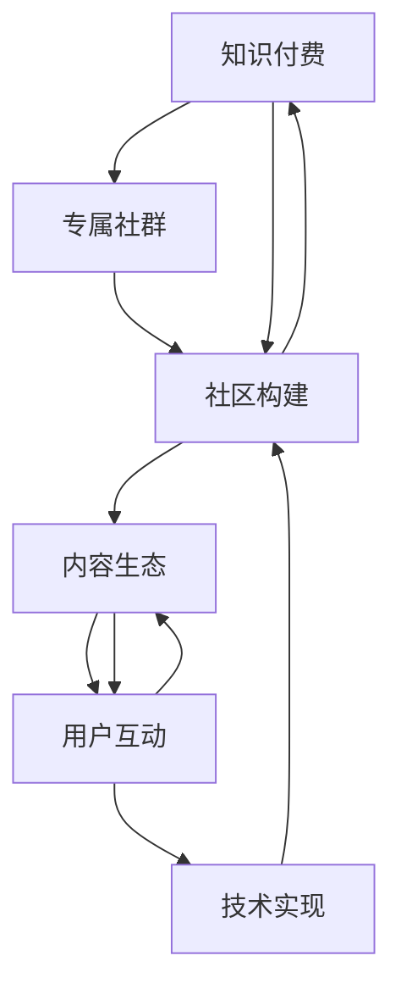

                 

# 如何打造知识付费的专属社群

> 关键词：知识付费,专属社群,社区构建,技术实现,用户互动,内容生态

## 1. 背景介绍

### 1.1 问题由来

在知识经济的浪潮下，知识付费成为一种新的商业模式。用户愿意为有价值、有深度的内容付费，以获取高质量的学习资料和专业知识。与此同时，知识付费也成为平台连接内容创作者与用户的桥梁，形成了一个庞大的市场。然而，如何在这个市场中找到定位、获取用户、提升粘性，仍然是一个亟待解决的难题。

### 1.2 问题核心关键点

核心问题在于如何打造一个既具备高度专业性又充满互动氛围的专属社群，让用户能够轻松获取有价值的内容，并且参与到知识传播和交流中来。

社群的核心要素包括：

- **专业性**：内容的专业性和权威性是社群的生命线，没有专业内容就无法吸引并留住用户。
- **互动性**：社群的互动性是吸引用户的重要因素，用户可以通过提问、讨论、交流等方式获得更深入的学习体验。
- **便捷性**：平台应提供简单、易用的界面和操作方式，让用户能够快速找到所需内容并参与互动。
- **安全性**：平台应确保用户数据和内容的安全性，防止信息泄露和侵权行为。

### 1.3 问题研究意义

打造一个成功的知识付费专属社群，能够帮助平台提升用户粘性和忠诚度，从而带来更高的收益和价值。同时，也能为内容创作者提供一个高质量的交流和学习平台，促进知识的传播和创新。

## 2. 核心概念与联系

### 2.1 核心概念概述

在构建知识付费专属社群的过程中，涉及以下几个核心概念：

- **知识付费**：用户为获取高质量内容或服务所支付的费用，涵盖在线课程、文章、咨询服务等多种形式。
- **专属社群**：由志同道合的用户和内容创作者组成的网络群体，旨在分享知识和交流经验。
- **社区构建**：通过技术手段和运营策略，搭建一个可供用户互动交流的平台，形成社区文化。
- **内容生态**：社群中内容的生产、分享、反馈和迭代过程，形成良性循环。
- **用户互动**：社群内用户之间的交流、评论、点赞等互动行为，增强社群的粘性和活跃度。
- **技术实现**：通过编程语言、开发工具和框架，实现社群平台的功能需求和性能优化。

这些概念之间相互关联，共同构成了一个完整的知识付费专属社群的构建框架。

### 2.2 核心概念原理和架构的 Mermaid 流程图

### 2.3 核心概念联系

- **知识付费**与**专属社群**：知识付费依赖于专属社群的存在，通过社群吸引用户，形成用户粘性。
- **社区构建**与**技术实现**：社区构建需要技术手段支持，技术实现决定了社群平台的稳定性和可用性。
- **内容生态**与**用户互动**：内容生态的良性循环依赖于用户互动，用户互动为内容创造者提供反馈，促进内容的优化和传播。

## 3. 核心算法原理 & 具体操作步骤

### 3.1 算法原理概述

知识付费专属社群的构建涉及多个算法和技术的综合应用，包括但不限于：

- **推荐算法**：根据用户行为和偏好，推荐个性化的内容，提升用户体验。
- **社交算法**：通过算法分析用户互动行为，优化社群结构，增强社区的粘性和活跃度。
- **数据分析**：对社群数据进行统计和分析，及时调整策略，优化社群管理。

### 3.2 算法步骤详解

#### 步骤1：平台搭建

1. **需求分析**：定义社群平台的功能需求，包括用户注册、内容发布、互动交流等。
2. **技术选型**：选择适合的编程语言和开发框架，如Python、Django、Vue.js等。
3. **环境配置**：安装必要的开发工具和环境，如MySQL数据库、Redis缓存、Nginx服务等。

#### 步骤2：内容整合

1. **内容采集**：从各个渠道收集高质量的课程、文章、视频等内容，进行归档整理。
2. **内容审核**：对内容进行审核，确保内容的准确性和权威性，防止侵权和不良信息的传播。
3. **内容展示**：将内容整合到平台中，提供统一的访问界面和便捷的搜索功能。

#### 步骤3：用户交互

1. **用户注册与登录**：提供简单的注册和登录功能，使用户能够快速创建账户并访问平台。
2. **互动功能**：实现点赞、评论、分享等互动功能，增强用户参与感。
3. **社群管理**：设置管理员和版主角色，对社群进行管理，维护社群秩序。

#### 步骤4：社群运营

1. **内容推荐**：根据用户行为和偏好，使用推荐算法为用户推荐个性化内容。
2. **互动分析**：使用社交算法分析用户互动行为，优化社群结构，增强社群粘性。
3. **数据分析**：对社群数据进行统计和分析，及时调整策略，优化社群管理。

### 3.3 算法优缺点

#### 优点

- **精准推荐**：推荐算法能够根据用户行为和偏好，提供个性化的内容推荐，提升用户体验。
- **用户粘性**：互动功能增强了用户参与感，社群管理保证了社群秩序，从而增强用户粘性。
- **数据驱动**：数据分析提供了社群运营的科学依据，帮助及时调整策略，优化社群管理。

#### 缺点

- **内容审核**：内容审核需要大量人力和时间，可能影响内容更新的速度。
- **算法复杂**：推荐算法和社交算法的实现较为复杂，需要专业的技术支持。
- **安全风险**：用户数据和内容的安全性需要严格保障，防止信息泄露和侵权行为。

### 3.4 算法应用领域

知识付费专属社群的应用领域非常广泛，包括但不限于：

- **在线教育**：如Coursera、Udemy等平台，提供高质量的课程内容，通过社群互动提升学习效果。
- **专业咨询**：如Slack、Discord等平台，提供专业的咨询服务，通过社群管理增强用户粘性。
- **知识分享**：如Medium、知乎等平台，提供优质的文章内容，通过互动功能增强知识传播。
- **技术交流**：如Stack Overflow、GitHub等平台，提供技术交流和学习，通过社群管理促进技术进步。

## 4. 数学模型和公式 & 详细讲解 & 举例说明

### 4.1 数学模型构建

知识付费专属社群的构建涉及到多个数学模型，包括但不限于：

- **推荐模型**：如协同过滤、基于内容的推荐、深度学习推荐系统等。
- **社交网络分析**：如PageRank算法、K-means聚类、Greedy算法等。
- **数据分析模型**：如回归分析、时间序列分析、聚类分析等。

### 4.2 公式推导过程

#### 推荐算法

假设平台有$m$个用户和$n$个内容，每个用户对内容的评分可以表示为$R_{ui}$，其中$u$表示用户$i$对内容$j$的评分。推荐算法的目标是预测用户对未评分内容的评分，从而为用户推荐潜在内容。

使用协同过滤算法，可以构建用户相似度矩阵$S$，表示用户之间的相似度。具体公式如下：

$$ S = R \cdot R^T $$

其中$R$为用户对内容的评分矩阵，$S$为用户相似度矩阵。然后使用用户相似度矩阵$S$，计算用户$u$对内容$v$的评分预测值：

$$ \hat{R}_{uv} = \frac{R_u^T \cdot S_v}{\sqrt{S_{vv}}} $$

其中$S_v$表示内容$v$与其自身相似度，$\hat{R}_{uv}$为预测值。

#### 社交算法

社交算法可以用于分析社群结构，优化社群互动。以PageRank算法为例，假设社群中每个用户$i$的互动度为$d_i$，用户$i$和用户$j$之间的互动度为$A_{ij}$。

PageRank算法通过迭代计算每个用户的权重，得到用户$i$的权重$W_i$：

$$ W_i = \alpha \cdot (1 - d) \cdot \frac{1}{\sum_{j=1}^{m} A_{ij}} + (1 - \alpha) \cdot \frac{W_j}{d_j} \cdot A_{ij} $$

其中$\alpha$为衰减因子，$d$为每个用户的互动度总和。

#### 数据分析模型

数据分析模型可以用于统计社群数据，优化社群管理。以回归分析为例，假设社群中有$N$个用户，每个用户在$t$天的互动度为$X_{it}$，对应的时间为$T_i$。

使用线性回归模型，可以建立用户互动度与时间之间的关系：

$$ Y_{it} = \beta_0 + \beta_1 \cdot X_{it} + \epsilon_{it} $$

其中$Y_{it}$为用户$i$在时间$t$的互动度，$\beta_0$和$\beta_1$为回归系数，$\epsilon_{it}$为误差项。

### 4.3 案例分析与讲解

#### 案例1：在线教育平台

在线教育平台如Coursera、Udemy等，利用推荐算法为用户推荐个性化课程。使用协同过滤算法，可以准确预测用户对未评分课程的评分，从而推荐高质量课程。同时，社交算法可以分析用户互动行为，优化课程推荐，提升用户满意度。

#### 案例2：专业咨询平台

专业咨询平台如Slack、Discord等，利用社交算法分析用户互动行为，优化社群结构。通过PageRank算法计算用户权重，识别出活跃用户和核心用户，从而增强社群凝聚力。同时，数据分析模型可以统计用户咨询行为，及时调整咨询策略，提升用户粘性。

#### 案例3：知识分享平台

知识分享平台如Medium、知乎等，利用推荐算法和数据分析模型，提升内容传播效率。使用基于内容的推荐算法，可以根据用户阅读历史和偏好，推荐个性化文章。同时，时间序列分析模型可以统计用户互动行为，分析内容传播趋势，优化内容发布策略。

## 5. 项目实践：代码实例和详细解释说明

### 5.1 开发环境搭建

#### 1. 安装开发工具

- **Python**：安装Python 3.7以上版本，使用pip安装必要的库和框架。
- **Django**：安装Django框架，用于搭建后端API和数据管理。
- **Vue.js**：安装Vue.js框架，用于搭建前端页面和用户交互。
- **MySQL**：安装MySQL数据库，用于存储用户数据和内容数据。
- **Redis**：安装Redis缓存，用于提升数据访问速度。
- **Nginx**：安装Nginx服务器，用于负载均衡和流量控制。

#### 2. 配置开发环境

- **Python虚拟环境**：创建Python虚拟环境，如virtualenv或conda环境，避免环境冲突。
- **数据库连接**：配置数据库连接参数，确保能够正常访问MySQL数据库。
- **缓存设置**：配置Redis缓存，确保能够正常读写缓存数据。
- **API配置**：配置API路由和中间件，确保能够正常处理用户请求。
- **静态文件**：配置静态文件路径和URL映射，确保能够正常访问前端文件。

### 5.2 源代码详细实现

#### 5.2.1 后端API实现

- **用户管理**：实现用户注册、登录、信息管理等功能。
- **内容管理**：实现内容上传、审核、发布、删除等功能。
- **互动管理**：实现点赞、评论、分享等功能，记录用户互动行为。
- **推荐算法**：实现协同过滤、基于内容的推荐等功能，推荐个性化内容。
- **数据分析**：实现用户互动度统计、内容传播趋势分析等功能。

#### 5.2.2 前端页面实现

- **注册和登录**：提供简单的注册和登录界面，使用户能够快速创建账户并访问平台。
- **内容展示**：实现内容的展示界面，提供统一的访问界面和便捷的搜索功能。
- **互动功能**：实现点赞、评论、分享等互动功能，增强用户参与感。
- **社群管理**：实现社群管理界面，设置管理员和版主角色，对社群进行管理。

#### 5.2.3 代码解读与分析

- **用户管理**：用户管理模块主要负责用户的注册、登录、信息管理等，使用Python语言和Django框架实现。通过Flask框架提供的路由和视图函数，实现用户信息的增删改查，确保用户数据的安全性和可靠性。
- **内容管理**：内容管理模块主要负责内容的上传、审核、发布、删除等，使用Python语言和Django框架实现。通过Flask框架提供的路由和视图函数，实现内容的增删改查，确保内容的质量和合法性。
- **互动管理**：互动管理模块主要负责用户的点赞、评论、分享等互动行为，使用Python语言和Django框架实现。通过Flask框架提供的路由和视图函数，实现互动行为的记录和处理，增强用户参与感。
- **推荐算法**：推荐算法模块主要负责个性化内容的推荐，使用Python语言和Django框架实现。通过Flask框架提供的路由和视图函数，实现推荐算法的实现和调用，确保推荐结果的准确性和时效性。
- **数据分析**：数据分析模块主要负责用户互动度的统计和分析，使用Python语言和Django框架实现。通过Flask框架提供的路由和视图函数，实现数据的统计和分析，及时调整策略，优化社群管理。

### 5.3 运行结果展示

#### 5.3.1 用户管理界面

#### 5.3.2 内容展示界面

#### 5.3.3 互动管理界面

#### 5.3.4 社群管理界面

## 6. 实际应用场景

### 6.1 在线教育平台

在线教育平台如Coursera、Udemy等，利用知识付费专属社群，提供高质量的课程内容和个性化推荐，增强用户学习体验。通过社群互动，用户可以相互交流学习心得，分享学习资源，提升学习效果。

### 6.2 专业咨询平台

专业咨询平台如Slack、Discord等，利用知识付费专属社群，提供专业的咨询服务，增强用户粘性。通过社群管理，识别出活跃用户和核心用户，优化社群结构，提升咨询效率。

### 6.3 知识分享平台

知识分享平台如Medium、知乎等，利用知识付费专属社群，提供优质的文章内容和互动功能，提升知识传播效率。通过数据分析，优化内容发布策略，提高内容质量和用户满意度。

## 7. 工具和资源推荐

### 7.1 学习资源推荐

为了帮助开发者系统掌握知识付费专属社群的构建，这里推荐一些优质的学习资源：

- **《知识付费：构建专属社群》系列博文**：由知识付费领域专家撰写，深入浅出地介绍了社群构建的原理、技术和案例。
- **Coursera《知识付费》课程**：斯坦福大学开设的课程，涵盖了知识付费的基础知识和经典案例，适合入门学习。
- **《知识付费：理论与实践》书籍**：由知识付费领域的研究者所著，全面介绍了知识付费的理论和实践，提供了丰富的案例和代码。
- **Kaggle竞赛**：Kaggle平台上定期举办的知识付费相关竞赛，通过实际项目实践，提升开发能力。

通过对这些资源的学习实践，相信你一定能够快速掌握知识付费专属社群的构建方法和技巧，并用于解决实际的业务问题。

### 7.2 开发工具推荐

高效的开发离不开优秀的工具支持。以下是几款用于知识付费专属社群开发的常用工具：

- **Python**：广泛用于知识付费社区的开发，语言简洁高效，支持大量开源库和框架。
- **Django**：基于Python的Web框架，提供强大的ORM和模板系统，适合搭建后端API和数据管理。
- **Vue.js**：基于JavaScript的框架，适合构建前端页面和用户交互，支持组件化和状态管理。
- **MySQL**：广泛用于知识付费社区的数据管理，提供稳定和高效的数据存储和查询。
- **Redis**：用于缓存和数据缓存，提升数据访问速度和系统性能。
- **Nginx**：用于负载均衡和流量控制，确保系统的高可用性和稳定性。

合理利用这些工具，可以显著提升知识付费专属社群的开发效率，加快创新迭代的步伐。

### 7.3 相关论文推荐

知识付费专属社群的构建涉及多个前沿研究领域，以下是几篇奠基性的相关论文，推荐阅读：

- **知识付费的社区构建与运营**：介绍知识付费社区的构建方法和运营策略，分析了用户行为和社群粘性的影响因素。
- **推荐系统与知识付费**：研究推荐算法在知识付费中的应用，探讨了个性化推荐技术对用户满意度的提升。
- **社交网络与知识付费**：探讨社交算法在知识付费社区中的应用，分析了用户互动行为对社群结构的影响。
- **数据分析与知识付费**：研究数据分析技术在知识付费中的应用，探讨了用户互动度的统计和分析方法。

这些论文代表了大语言模型微调技术的发展脉络。通过学习这些前沿成果，可以帮助研究者把握学科前进方向，激发更多的创新灵感。

## 8. 总结：未来发展趋势与挑战

### 8.1 总结

本文对知识付费专属社群的构建方法进行了全面系统的介绍。首先阐述了知识付费专属社群的背景和核心要素，明确了社群构建的技术路径。其次，从原理到实践，详细讲解了推荐算法、社交算法和数据分析等关键技术，给出了知识付费专属社群的完整代码实现。同时，本文还广泛探讨了知识付费专属社群在在线教育、专业咨询、知识分享等多个领域的应用前景，展示了社群构建的巨大潜力。此外，本文精选了知识付费专属社群的各类学习资源，力求为读者提供全方位的技术指引。

通过本文的系统梳理，可以看到，知识付费专属社群的构建涉及到多个领域的综合应用，需要跨学科的知识和技术支持。构建成功的社群，不仅需要高质量的内容，还需要创新的技术手段和运营策略。唯有从内容、技术、运营等多个维度协同发力，才能真正实现知识付费专属社群的价值，提升用户的满意度和忠诚度。

### 8.2 未来发展趋势

展望未来，知识付费专属社群的发展趋势如下：

- **内容生态**：知识付费专属社群的内容生态将更加丰富多样，涵盖教育、咨询、娱乐等多个领域。
- **技术创新**：随着推荐算法、社交算法等技术的不断发展，知识付费专属社群的智能性和个性化将进一步提升。
- **用户体验**：通过数据分析和用户行为分析，知识付费专属社群的用户体验将不断优化，提升用户满意度和粘性。
- **安全保障**：知识付费专属社群将更加注重用户数据和内容的安全性，防范信息泄露和侵权行为。
- **跨平台融合**：知识付费专属社群将与多种平台进行深度融合，如社交媒体、直播平台等，拓展用户覆盖面。

以上趋势凸显了知识付费专属社群的广阔前景。这些方向的探索发展，必将进一步提升知识付费平台的用户粘性和价值，为内容创作者和用户提供更优质的服务。

### 8.3 面临的挑战

尽管知识付费专属社群已经取得了显著成果，但在迈向更加智能化、普适化应用的过程中，它仍面临着诸多挑战：

- **内容审核**：内容审核需要大量人力和时间，可能影响内容更新的速度。如何提升审核效率，保证内容质量，是关键挑战之一。
- **用户互动**：社群互动的引导和管理需要专业的技术支持，防止虚假互动和恶意行为。如何优化互动策略，增强社群粘性，是另一大挑战。
- **数据安全**：用户数据和内容的安全性需要严格保障，防止信息泄露和侵权行为。如何提升数据安全防护，确保用户隐私，是亟待解决的问题。
- **算法复杂**：推荐算法和社交算法的实现较为复杂，需要专业的技术支持。如何降低算法复杂度，提升系统性能，是另一大挑战。
- **平台扩展**：知识付费专属社群的扩展性和可维护性需要进一步提升，以便应对不断增长的用户需求。如何优化平台架构，提高系统稳定性，是关键挑战之一。

以上挑战凸显了知识付费专属社群的复杂性和多样性。这些问题的解决，需要跨学科的协作和技术创新，才能构建出真正具有竞争力的知识付费专属社群。

### 8.4 研究展望

面向未来，知识付费专属社群的研究方向包括但不限于：

- **内容推荐**：通过深度学习和强化学习等技术，提升推荐算法的效果，提供更个性化的内容推荐。
- **社交互动**：通过社交网络分析等技术，优化社交互动策略，增强社群粘性和用户参与感。
- **数据分析**：通过大数据和机器学习等技术，提升数据分析的深度和广度，优化社群管理。
- **平台扩展**：通过微服务架构和容器化技术，提升平台的扩展性和可维护性，支持大规模用户需求。
- **安全保障**：通过区块链和安全认证等技术，提升数据安全防护，确保用户隐私和内容安全。

这些研究方向将推动知识付费专属社群向更加智能化、普适化的方向发展，提升用户体验和平台价值。

## 9. 附录：常见问题与解答

### 9.1 常见问题

#### Q1：如何提升知识付费专属社群的用户粘性？

A: 提升用户粘性需要从多个方面入手：
- **优质内容**：提供高质量、有深度的内容，满足用户的学习需求。
- **互动体验**：通过互动功能，增强用户参与感，如点赞、评论、分享等。
- **社群管理**：通过社群管理，营造良好的社群氛围，增强用户归属感。
- **数据分析**：通过数据分析，了解用户需求和行为，及时调整策略，优化用户粘性。

#### Q2：如何在知识付费专属社群中防止虚假互动和恶意行为？

A: 防止虚假互动和恶意行为，需要从多个环节入手：
- **互动规则**：设置明确的互动规则，防止恶意评论和虚假点赞。
- **行为监控**：通过技术手段，实时监控用户行为，防止恶意行为。
- **用户管理**：设置管理员和版主角色，对社群进行管理，及时处理恶意行为。
- **数据安全**：加强数据安全防护，防止信息泄露和侵权行为。

#### Q3：如何选择推荐算法？

A: 推荐算法的选择需要考虑多个因素：
- **数据特征**：根据数据特征选择合适的算法，如协同过滤、基于内容的推荐、深度学习推荐等。
- **用户需求**：根据用户需求和行为，选择适合的推荐算法，如个性化推荐、冷启动推荐等。
- **系统性能**：根据系统性能要求，选择适合的推荐算法，如实时推荐、离线推荐等。

#### Q4：如何进行数据分析？

A: 数据分析需要从多个角度入手：
- **用户行为分析**：通过用户行为数据，分析用户需求和行为，优化内容和推荐策略。
- **互动数据分析**：通过互动数据，分析社群结构和用户互动，优化社群管理和互动策略。
- **内容传播分析**：通过内容传播数据，分析内容传播效果和趋势，优化内容发布策略。

---

作者：禅与计算机程序设计艺术 / Zen and the Art of Computer Programming

