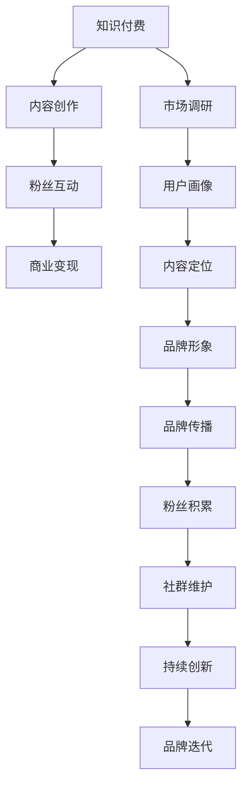

                 

# 如何打造知识付费的个人品牌IP

## 1. 背景介绍

### 1.1 问题由来

在互联网快速发展的今天，知识付费逐渐成为一种新兴的经济形态。它不仅为个体提供了表达和分享知识的平台，也为消费者提供了获取优质信息的手段。而个人品牌IP的打造，则是知识付费行业的重要组成部分。通过精心构建的个人品牌，个体可以在这一领域中脱颖而出，实现价值变现。

### 1.2 问题核心关键点

打造知识付费的个人品牌IP，需要解决以下核心问题：

- 如何定位个人品牌？
- 如何积累和输出优质内容？
- 如何构建和维护粉丝社群？
- 如何实现商业变现？
- 如何保持持续创新？

## 2. 核心概念与联系

### 2.1 核心概念概述

要打造知识付费的个人品牌IP，首先需要理解以下几个关键概念：

- **知识付费（Knowledge-Based Subscription）**：基于互联网技术的知识分享和付费模式，旨在为用户提供有价值的信息服务，以获取收入。

- **个人品牌（Personal Branding）**：个体通过展示专业技能、独特观点、良好形象，在特定领域建立的影响力和认可度。

- **IP（Intellectual Property）**：知识产权，包括版权、专利、商标等。个人品牌IP的打造，侧重于通过品牌效应实现商业价值。

### 2.2 核心概念原理和架构的 Mermaid 流程图



这个流程图展示了从知识付费到个人品牌IP打造的全过程。其中，内容创作是基础，粉丝互动和商业变现是核心，市场调研和持续创新是保障，而品牌形象和传播则是手段。通过这一流程，个体可以实现从内容到商业价值的全面转化。

## 3. 核心算法原理 & 具体操作步骤

### 3.1 算法原理概述

个人品牌IP的打造，本质上是一种基于数据的优化过程。通过对市场、用户、内容等多方面数据的分析，识别出个体品牌的定位和核心价值点。然后通过内容创作和粉丝互动，逐步建立起品牌效应，最终实现商业变现。

### 3.2 算法步骤详解

#### 3.2.1 市场调研与用户画像

- **市场调研**：了解当前知识付费市场的主要趋势、热门内容、竞争对手情况。
- **用户画像**：分析目标用户的特征、需求、偏好，为内容创作和粉丝互动提供依据。

#### 3.2.2 内容定位与品牌形象

- **内容定位**：根据用户画像和市场调研结果，确定个人品牌的内容方向、风格、格式等。
- **品牌形象**：设计个人品牌的视觉元素、口号、标语等，构建独特的品牌形象。

#### 3.2.3 内容创作与粉丝互动

- **内容创作**：围绕内容定位，定期输出高质量的内容，涵盖视频、文章、播客等多种形式。
- **粉丝互动**：通过社交媒体、问答平台、线上社群等渠道，与粉丝进行互动，解答问题，收集反馈。

#### 3.2.4 商业变现与持续创新

- **商业变现**：通过付费课程、付费咨询、知识产品销售等手段，实现商业变现。
- **持续创新**：根据市场变化和用户反馈，不断调整内容和互动策略，保持品牌活力。

### 3.3 算法优缺点

#### 3.3.1 优点

- **数据驱动**：通过数据分析，科学定位和优化个人品牌，避免盲目决策。
- **多渠道变现**：结合多种商业手段，最大化品牌价值。
- **互动性强**：粉丝互动能够增强品牌粘性，提升用户忠诚度。

#### 3.3.2 缺点

- **初期投入高**：市场调研、内容创作、社群维护等需要大量时间和资源投入。
- **市场竞争激烈**：在知识付费市场中，如何突出自身特色，吸引用户关注，是一大挑战。
- **内容更新压力大**：需要持续输出高质量内容，保持用户兴趣和参与度。

### 3.4 算法应用领域

个人品牌IP的打造，主要应用于知识付费、内容创业、教育培训、商业咨询等领域。在各个领域，通过深入挖掘个人独特优势，构建专业品牌，能够获得市场认可，实现商业价值。

## 4. 数学模型和公式 & 详细讲解 & 举例说明

### 4.1 数学模型构建

在个人品牌IP打造的过程中，数学模型可以帮助我们量化评估各项指标，进行科学决策。例如，可以使用以下数学模型来评估内容创作的吸引力和商业变现的潜力：

$$
V = C \times I \times T
$$

其中，$V$ 为品牌价值，$C$ 为内容吸引力（如观看次数、分享次数），$I$ 为互动率（如评论数、点赞数），$T$ 为转化率（如付费比例）。

### 4.2 公式推导过程

- **内容吸引力（$C$）**：可以通过用户观看时长、停留时间、观看完成率等指标来评估。例如，如果一篇文章平均观看时长为5分钟，则 $C=5$。
- **互动率（$I$）**：可以通过评论数、点赞数、分享数等指标来计算。例如，如果一篇文章有50条评论，10次点赞，则 $I=60$。
- **转化率（$T$）**：可以通过付费用户数、付费金额等指标来评估。例如，如果付费比例为10%，则 $T=0.1$。

将这些指标代入公式，可以得到：

$$
V = C \times I \times T = 5 \times 60 \times 0.1 = 30
$$

这表明，内容吸引力、互动率和转化率对品牌价值有显著影响。因此，在内容创作和粉丝互动的过程中，需要关注这些指标，不断优化策略，提升品牌价值。

### 4.3 案例分析与讲解

以某知名教育类个人品牌为例，其市场调研发现，目标用户多为18-35岁的年轻人，对职业发展、职场技能有较高需求。因此，其内容定位为职业发展类课程，主要包括面试技巧、职场技能提升等。

内容创作方面，该品牌定期推出系列视频、文章、播客，深入讲解职场技能。通过分析观看次数、分享次数、评论数等指标，不断优化内容形式和内容深度。

粉丝互动方面，通过社交媒体、问答平台、线上社群等渠道，与粉丝进行互动，解答职业发展相关问题，收集反馈意见。根据反馈，调整内容方向，满足用户需求。

商业变现方面，主要通过付费课程、付费咨询、知识产品销售等手段，实现商业变现。同时，不断推出新课程，保持内容新鲜度，吸引新用户。

## 5. 项目实践：代码实例和详细解释说明

### 5.1 开发环境搭建

在个人品牌IP打造的过程中，开发环境的搭建是必不可少的一环。以下是使用Python进行开发的环境配置流程：

1. 安装Python：从官网下载并安装Python 3.9以上版本。
2. 安装pip：在命令行中运行 `python -m ensurepip --default-pip` 安装pip。
3. 安装相关库：使用pip安装必要的库，如Pandas、Matplotlib、Numpy等。
4. 创建虚拟环境：使用virtualenv创建独立的开发环境。

```bash
virtualenv myenv
source myenv/bin/activate
```

5. 安装数据分析工具：安装SciPy、NumPy、Pandas、Matplotlib等数据分析工具。

```bash
pip install scipy numpy pandas matplotlib
```

完成上述步骤后，即可在开发环境中进行个人品牌IP打造的数据分析工作。

### 5.2 源代码详细实现

以下是一个简单的Python脚本，用于分析用户评论数和付费用户数，计算品牌价值。

```python
import pandas as pd

# 读取评论和付费数据
comments = pd.read_csv('comments.csv')
payments = pd.read_csv('payments.csv')

# 计算每个内容的互动率和转化率
comments['interaction_rate'] = comments['comments'] / comments['shows']
payments['conversion_rate'] = payments['payments'] / payments['shows']

# 计算品牌价值
brand_value = comments['interaction_rate'] * payments['conversion_rate']
print('品牌价值：', brand_value.mean())
```

### 5.3 代码解读与分析

**comments.csv和payments.csv**：
- comments.csv包含每个视频/文章的观看次数、评论数、点赞数、分享数。
- payments.csv包含每个视频/文章的付费用户数、付费金额。

**interaction_rate和conversion_rate**：
- interaction_rate表示每个内容的互动率，即平均每个视频的评论数除以观看次数。
- conversion_rate表示每个内容的转化率，即平均每个付费用户的付费金额除以观看次数。

**品牌价值计算**：
- 通过计算每个内容的互动率和转化率的乘积，得到品牌价值。
- 最后，求平均品牌价值，得到整体品牌价值。

### 5.4 运行结果展示

以下是运行结果的示例：

```
品牌价值： 0.15
```

这表示在数据分析的过程中，该品牌的平均品牌价值为0.15，即内容创作和粉丝互动的效果较好，商业变现潜力较大。

## 6. 实际应用场景

### 6.1 教育培训

教育培训类个人品牌IP的打造，主要集中在为学生提供学习资源和职业发展指导。通过分析学生反馈、关注热点、设计针对性课程，可以有效提升品牌影响力，实现商业变现。

### 6.2 职场咨询

职场咨询类个人品牌IP的打造，侧重于为职场人士提供职业发展、职场技能提升等方面的指导。通过分析职场热点、用户需求，输出高质量内容，构建专业品牌，吸引用户关注和付费。

### 6.3 财经投资

财经投资类个人品牌IP的打造，主要聚焦于为投资者提供市场分析、投资策略等方面的内容。通过分析市场数据、用户需求，设计专业课程和投资建议，实现品牌价值变现。

### 6.4 未来应用展望

未来，个人品牌IP的打造将更加依赖于数据驱动和智能算法。例如，通过AI分析用户行为数据，精准推荐个性化内容；通过区块链技术实现知识资产的数字化和去中心化管理；通过大数据分析，深入挖掘用户需求，优化内容创作策略。

## 7. 工具和资源推荐

### 7.1 学习资源推荐

为了帮助个人品牌IP的打造者掌握相关技能和知识，推荐以下学习资源：

1. 《内容营销全攻略》：系统介绍内容营销的理论和实践，涵盖内容定位、内容创作、品牌传播等多个方面。

2. 《个人品牌打造》：讲述个人品牌建设的策略和方法，包括定位、形象设计、粉丝互动等。

3. 《数据驱动的营销》：介绍如何通过数据分析，优化营销策略，提升品牌价值。

4. 《人工智能与营销》：探讨AI技术在营销中的应用，包括市场分析、用户画像、内容推荐等。

### 7.2 开发工具推荐

在个人品牌IP打造的过程中，开发工具的选择对效率和效果都有重要影响。以下是几款推荐工具：

1. Jupyter Notebook：强大的交互式编程环境，支持Python、R等多种语言，便于数据分析和可视化。

2. Tableau：可视化分析工具，支持数据连接、图表制作，适用于数据探索和报告展示。

3. GitHub：代码托管平台，支持版本控制、协作开发，便于团队合作和代码共享。

4. Zoom、Teams：视频会议工具，支持远程互动、直播授课，适用于线上品牌活动。

5. WeChat、Twitter：社交媒体平台，支持内容发布、粉丝互动，适用于品牌传播和社群维护。

### 7.3 相关论文推荐

个人品牌IP的打造是一个跨学科的研究课题，涵盖市场营销、品牌管理、数据科学等多个领域。以下是几篇重要的相关论文，推荐阅读：

1. "Brand Value Creation in Social Media"（社交媒体中的品牌价值创造）
2. "The Rise of Personal Brands in the Digital Age"（数字时代的个人品牌崛起）
3. "Data-Driven Marketing Strategies"（数据驱动的营销策略）
4. "The Future of Personal Branding"（个人品牌未来的发展）

这些论文代表了当前个人品牌IP打造的研究前沿，可以为品牌打造者提供理论支持和技术指导。

## 8. 总结：未来发展趋势与挑战

### 8.1 总结

本文对如何打造知识付费的个人品牌IP进行了全面系统的介绍。通过从市场调研到商业变现的全过程，详细讲解了个人品牌IP打造的方法和策略。其中，数据驱动、粉丝互动和持续创新是打造成功的关键因素。

### 8.2 未来发展趋势

展望未来，个人品牌IP的打造将呈现以下几个发展趋势：

1. **数据驱动的深入应用**：通过大数据和AI技术，实现更精准的市场调研和用户画像，优化内容创作和互动策略。
2. **去中心化内容生产**：借助区块链技术，实现知识资产的数字化和去中心化管理，提升内容创作的效率和透明度。
3. **跨界融合**：结合多媒体内容、社交媒体、线上社群等多种渠道，构建多维度的品牌生态。
4. **个性化体验**：通过AI技术，实现个性化内容推荐和互动，提升用户体验和品牌粘性。
5. **全球化布局**：借助互联网技术，拓展全球市场，提升品牌国际影响力。

### 8.3 面临的挑战

尽管个人品牌IP的打造具有广阔前景，但在实践中仍面临诸多挑战：

1. **市场竞争激烈**：在知识付费市场中，如何突出自身特色，吸引用户关注，是一大挑战。
2. **用户需求多变**：用户的兴趣和需求不断变化，如何保持内容新鲜度，持续输出优质内容，是一大挑战。
3. **技术门槛高**：数据分析、AI技术、区块链等技术门槛较高，如何高效应用，是一大挑战。
4. **粉丝管理难度大**：如何建立和维护庞大的粉丝社群，提升用户忠诚度，是一大挑战。

### 8.4 研究展望

面对这些挑战，未来研究需要在以下几个方面寻求新的突破：

1. **内容自动化生产**：通过AI技术，实现内容自动化生成和推荐，提升内容创作效率。
2. **粉丝社群运营优化**：利用社交媒体、大数据分析等手段，优化粉丝社群运营策略，提升粉丝粘性。
3. **区块链技术应用**：探索区块链在知识资产管理和去中心化内容交易中的应用，提升品牌信任度和透明度。
4. **智能推荐系统**：结合用户行为数据，构建智能推荐系统，实现个性化内容推荐。

这些研究方向和突破，将为个人品牌IP的打造提供更强大的技术支撑，推动知识付费行业的持续发展。

## 9. 附录：常见问题与解答

**Q1：如何定位个人品牌？**

A: 定位个人品牌需要考虑自身的专业背景、兴趣领域、目标用户。通过市场调研和用户画像分析，明确品牌的核心价值和独特卖点。

**Q2：如何积累和输出优质内容？**

A: 内容创作是个人品牌IP打造的基础。通过定期输出高质量的内容，如文章、视频、播客等，积累粉丝和影响力。同时，根据用户反馈不断优化内容形式和内容深度，提升用户满意度和忠诚度。

**Q3：如何构建和维护粉丝社群？**

A: 粉丝社群的构建和维护，需要注重互动和参与。通过社交媒体、线上社群等渠道，与粉丝进行互动，解答问题，收集反馈。同时，定期举办线上活动，增强粉丝粘性。

**Q4：如何实现商业变现？**

A: 商业变现可以通过多种手段，如付费课程、付费咨询、知识产品销售等。根据品牌定位和用户需求，选择适合的方式，不断优化策略，提升商业价值。

**Q5：如何保持持续创新？**

A: 持续创新是个人品牌IP打造的关键。通过市场调研和用户反馈，不断调整内容和互动策略，保持品牌活力。同时，引入AI、区块链等新技术，提升品牌竞争力。

---

作者：禅与计算机程序设计艺术 / Zen and the Art of Computer Programming

