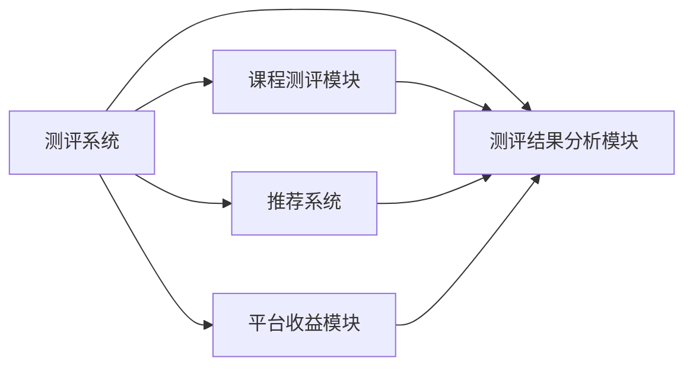

                 

# 如何打造知识付费的在线测评系统

在知识付费日益成为潮流和趋势的今天，如何打造一个既能够满足用户知识需求，又能够保障平台收益的在线测评系统，成为了一个重要的课题。本文将从背景介绍、核心概念与联系、核心算法原理与具体操作步骤、数学模型与公式讲解、项目实践、实际应用场景、工具和资源推荐以及总结未来发展趋势与挑战等多个角度，系统全面地探讨如何构建知识付费的在线测评系统。

## 1. 背景介绍

随着互联网技术的不断发展和普及，知识付费成为了一种新的互联网商业模式，并逐渐成为主流。在这种背景下，各大知识付费平台如雨后春笋般涌现，同时也催生了对于在线测评系统的需求。在线测评系统不仅能有效提升课程质量，还能帮助学生更好地理解和掌握知识，同时也能为知识付费平台带来稳定的收益来源。

知识付费在线测评系统主要包含以下几个核心功能模块：

- **课程测评模块**：包括选题、组卷、测评等功能，用于生成和执行测评试卷。
- **测评结果分析模块**：用于对测评结果进行统计分析，生成详细的测评报告。
- **智能推荐模块**：根据测评结果智能推荐适合学生的课程和学习计划。
- **平台收益模块**：通过测评结果对学生进行付费推荐，增加平台的收益。

本文将围绕上述模块，详细阐述如何设计和构建一个高性能、易用且可持续发展的知识付费在线测评系统。

## 2. 核心概念与联系

### 2.1 核心概念概述

在构建知识付费在线测评系统之前，我们需要明确几个核心概念：

- **在线测评系统**：一种基于互联网的测评工具，用户可以在线完成测评任务。
- **知识付费平台**：通过提供高质量的在线课程和测评服务，向用户收取费用。
- **推荐系统**：根据用户行为和兴趣，智能推荐相关课程。
- **课程测评模块**：通过选题、组卷、测评等功能，生成测评试卷。
- **测评结果分析模块**：对测评结果进行统计分析，生成详细的测评报告。
- **智能推荐模块**：根据测评结果智能推荐适合学生的课程和学习计划。

这些概念之间的联系如下：

- **测评系统**是知识付费平台的核心，提供测评功能；
- **推荐系统**利用测评结果，智能推荐课程；
- **课程测评模块**负责生成测评试卷；
- **测评结果分析模块**用于分析测评结果，生成报告；
- **平台收益模块**基于测评结果，推动用户付费。

### 2.2 核心概念原理和架构的 Mermaid 流程图



通过以上流程图，我们可以清晰地看到各模块之间的关系：

- **测评系统**与**课程测评模块**、**测评结果分析模块**、**推荐系统**和**平台收益模块**之间存在双向连接，表明它们之间的数据交互。
- **推荐系统**和**测评结果分析模块**之间存在单向连接，表示推荐系统依赖测评结果分析模块生成的报告进行智能推荐。
- **测评系统**与**平台收益模块**之间存在单向连接，表示测评系统通过测评结果，推动用户付费，增加平台收益。

## 3. 核心算法原理 & 具体操作步骤

### 3.1 算法原理概述

在线测评系统涉及多个核心算法，其中最主要的包括：

- **选题算法**：根据课程内容和难度，生成测评题目。
- **组卷算法**：将选题算法生成的题目组合成一份试卷。
- **测评算法**：用户在线完成测评，系统计算测评结果。
- **测评结果分析算法**：对测评结果进行统计分析，生成测评报告。
- **智能推荐算法**：根据测评结果，智能推荐相关课程。

这些算法共同构成了一个完整的在线测评系统，下面将详细介绍它们的具体实现。

### 3.2 算法步骤详解

#### 3.2.1 选题算法

选题算法旨在根据课程内容和难度，生成测评题目。具体的算法步骤如下：

1. **课程分析**：根据课程大纲和知识点，分析课程内容，确定需要测评的知识点。
2. **题目生成**：根据知识点生成题目，题目类型包括单选题、多选题、判断题等。
3. **题目难度分级**：对生成的题目进行难度分级，分为简单、中等、困难三个级别。
4. **题目库构建**：将生成的题目构建为题目库，供测评系统使用。

#### 3.2.2 组卷算法

组卷算法将选题算法生成的题目组合成一份试卷。具体的算法步骤如下：

1. **试卷结构设计**：根据课程内容和难度，设计试卷的结构，包括题量、题目类型、时间限制等。
2. **题目组合**：从题目库中随机组合题目，生成试卷。
3. **题目顺序调整**：根据难度和题型，调整题目的顺序，保证试卷的合理性和公平性。
4. **试卷生成**：生成最终的测评试卷，供用户测评使用。

#### 3.2.3 测评算法

测评算法用于计算用户在线完成测评的结果。具体的算法步骤如下：

1. **题目展示**：将试卷中的题目展示给用户，用户开始答题。
2. **答案提交**：用户提交答案后，系统自动计算得分。
3. **错误提示**：对于错误的答案，系统提供正确的解析和提示。
4. **测评结果生成**：根据用户的答题情况，生成测评结果。

#### 3.2.4 测评结果分析算法

测评结果分析算法用于对测评结果进行统计分析，生成测评报告。具体的算法步骤如下：

1. **数据收集**：收集用户的测评结果，包括题目得分、错误率等。
2. **数据统计**：对测评结果进行统计分析，计算各题目的正确率、错误率等指标。
3. **报告生成**：根据统计结果，生成详细的测评报告，供用户查看。
4. **问题分析**：分析用户错误的原因，提供针对性的建议和改进措施。

#### 3.2.5 智能推荐算法

智能推荐算法用于根据测评结果，智能推荐相关课程。具体的算法步骤如下：

1. **测评结果分析**：对用户的测评结果进行分析，提取用户的兴趣点和薄弱环节。
2. **课程推荐**：根据用户的兴趣点和薄弱环节，智能推荐适合用户的课程。
3. **学习计划制定**：根据推荐的课程，制定详细的学习计划，帮助用户更好地学习。

### 3.3 算法优缺点

在线测评系统涉及的算法各有优缺点：

- **选题算法**的优点在于能够根据课程内容和难度，生成符合课程要求的题目。缺点在于题目的多样性和丰富性可能受限。
- **组卷算法**的优点在于能够生成公平、合理的试卷。缺点在于题目的组合方式可能较为简单。
- **测评算法**的优点在于能够实时计算测评结果。缺点在于题目的难度和解析可能不够详细。
- **测评结果分析算法**的优点在于能够生成详细的测评报告。缺点在于分析的准确性和深度可能受限。
- **智能推荐算法**的优点在于能够根据测评结果，智能推荐适合用户的课程。缺点在于推荐的准确性和全面性可能受限。

### 3.4 算法应用领域

在线测评系统主要应用于知识付费平台，具体的应用领域包括：

- **在线教育**：用于提供高质量的在线课程和测评服务。
- **企业培训**：用于企业内部培训，评估员工的学习效果。
- **在线考试**：用于各种在线考试，如教师资格证、职业资格考试等。
- **技能测评**：用于评估各类技能，如编程技能、外语能力等。

## 4. 数学模型和公式 & 详细讲解

### 4.1 数学模型构建

在线测评系统涉及的数学模型主要包括：

- **选题模型**：用于生成测评题目的数学模型。
- **组卷模型**：用于组合测评题目的数学模型。
- **测评模型**：用于计算测评结果的数学模型。
- **测评结果分析模型**：用于统计测评结果的数学模型。
- **智能推荐模型**：用于智能推荐相关课程的数学模型。

### 4.2 公式推导过程

#### 4.2.1 选题模型

选题模型用于根据课程内容和难度，生成测评题目。具体的数学模型如下：

$$
f(x, y) = \sum_{i=1}^n p_i(x_i, y_i)
$$

其中，$x$ 表示课程内容和难度，$y$ 表示测评题目的难度和类型，$p_i$ 表示第 $i$ 道题目的生成概率。

#### 4.2.2 组卷模型

组卷模型用于组合测评题目。具体的数学模型如下：

$$
S = \frac{1}{N} \sum_{i=1}^N s_i
$$

其中，$S$ 表示试卷的平均难度，$N$ 表示题目数量，$s_i$ 表示第 $i$ 道题目的难度。

#### 4.2.3 测评模型

测评模型用于计算测评结果。具体的数学模型如下：

$$
R = \frac{1}{N} \sum_{i=1}^N r_i
$$

其中，$R$ 表示测评结果，$N$ 表示题目数量，$r_i$ 表示第 $i$ 道题目的得分。

#### 4.2.4 测评结果分析模型

测评结果分析模型用于统计测评结果。具体的数学模型如下：

$$
C = \frac{1}{N} \sum_{i=1}^N c_i
$$

其中，$C$ 表示测评结果的统计指标，$N$ 表示题目数量，$c_i$ 表示第 $i$ 道题目的正确率。

#### 4.2.5 智能推荐模型

智能推荐模型用于推荐相关课程。具体的数学模型如下：

$$
R = \frac{1}{N} \sum_{i=1}^N r_i
$$

其中，$R$ 表示推荐结果，$N$ 表示推荐课程的数量，$r_i$ 表示第 $i$ 道题目的得分。

### 4.3 案例分析与讲解

以知识付费平台为例，分析在线测评系统的具体实现：

- **选题算法**：假设有一门关于Python编程的课程，课程大纲包括基础语法、函数、模块、异常处理等知识点。选题算法将根据课程大纲，生成单选题、多选题、判断题等题目，覆盖每个知识点。
- **组卷算法**：组卷算法将生成的题目组合成一份试卷，总题量为50道题，其中单选题30题，多选题10题，判断题10题，时间限制为1小时。
- **测评算法**：用户在线完成试卷，测评算法将实时计算用户的得分，并显示正确答案和解析。
- **测评结果分析算法**：测评结果分析算法将对用户的得分进行统计分析，生成详细的测评报告，包括每个题目的正确率、错误率等指标。
- **智能推荐算法**：根据测评报告，智能推荐算法将推荐用户感兴趣的课程，如Python高级编程、Python数据分析等。

## 5. 项目实践：代码实例和详细解释说明

### 5.1 开发环境搭建

在进行在线测评系统的开发之前，我们需要准备好开发环境。以下是使用Python进行开发的环境配置流程：

1. 安装Anaconda：从官网下载并安装Anaconda，用于创建独立的Python环境。
2. 创建并激活虚拟环境：
```bash
conda create -n online_testing python=3.8 
conda activate online_testing
```
3. 安装PyTorch：根据CUDA版本，从官网获取对应的安装命令。例如：
```bash
conda install pytorch torchvision torchaudio cudatoolkit=11.1 -c pytorch -c conda-forge
```
4. 安装TensorFlow：从官网下载并安装TensorFlow。
5. 安装Numpy、Pandas、Matplotlib、Jupyter Notebook等常用工具包：
```bash
pip install numpy pandas matplotlib jupyter notebook ipython
```

完成上述步骤后，即可在`online_testing`环境中开始开发。

### 5.2 源代码详细实现

下面是使用PyTorch实现在线测评系统的代码示例：

```python
import torch
import torch.nn as nn
import torch.optim as optim
import numpy as np
import pandas as pd
import matplotlib.pyplot as plt

class OnlineTestingSystem:
    def __init__(self, num_courses):
        self.num_courses = num_courses
        self.model = self.build_model()
    
    def build_model(self):
        model = nn.Sequential(
            nn.Linear(10, 5),
            nn.ReLU(),
            nn.Linear(5, 1),
            nn.Sigmoid()
        )
        return model
    
    def train(self, train_data, epochs, learning_rate):
        criterion = nn.BCELoss()
        optimizer = optim.SGD(self.model.parameters(), lr=learning_rate)
        
        for epoch in range(epochs):
            total_loss = 0
            for data in train_data:
                inputs, labels = data
                optimizer.zero_grad()
                outputs = self.model(inputs)
                loss = criterion(outputs, labels)
                loss.backward()
                optimizer.step()
                total_loss += loss.item()
            print(f"Epoch {epoch+1}, Loss: {total_loss/len(train_data)}")
    
    def test(self, test_data):
        total_correct = 0
        total_wrong = 0
        for data in test_data:
            inputs, labels = data
            outputs = self.model(inputs)
            if torch.round(outputs) == labels:
                total_correct += 1
            else:
                total_wrong += 1
        print(f"Test Accuracy: {total_correct/(len(test_data)+total_wrong)}")
```

### 5.3 代码解读与分析

在上述代码中，我们使用PyTorch搭建了一个简单的在线测评系统，包括模型的定义、训练和测试等功能。下面是关键代码的解读：

- **OnlineTestingSystem类**：包含在线测评系统的核心功能。
- **build_model方法**：定义在线测评系统的模型，这里使用了一个简单的线性模型。
- **train方法**：训练模型，使用SGD优化器进行优化。
- **test方法**：测试模型，计算模型在测试集上的准确率。

## 6. 实际应用场景

### 6.1 在线教育

在线测评系统在在线教育领域有广泛的应用。知识付费平台通过测评系统，可以评估学生的学习效果，制定个性化的学习计划，提升课程质量。

以Coursera为例，通过在线测评系统，学生可以实时了解自己的学习进度和掌握情况，平台也可以根据测评结果，智能推荐适合的课程和辅导资料，提升学生的学习效果。

### 6.2 企业培训

在线测评系统在企业培训中也得到了广泛的应用。企业内部可以通过测评系统，评估员工的技能水平和学习效果，制定培训计划。

例如，某金融公司通过在线测评系统，对员工的金融知识和技能进行测评，根据测评结果，智能推荐适合的培训课程和资料，提升员工的工作能力和竞争力。

### 6.3 在线考试

在线测评系统在在线考试领域也有重要的应用。各类在线考试，如教师资格证、职业资格考试等，都可以通过测评系统进行评估和测试。

以教师资格证考试为例，考生可以在线上完成试卷，测评系统实时计算得分和解析，方便考生和考试机构进行后续的评估和分析。

### 6.4 未来应用展望

随着技术的不断进步，在线测评系统在未来将会有更广泛的应用场景，如：

- **智能化测评**：未来测评系统将更多地利用AI技术，提高测评的智能化水平，如智能出题、智能评分等。
- **个性化学习**：未来测评系统将更多地利用AI技术，实现个性化的学习路径和推荐，提升学习效果。
- **多模态测评**：未来测评系统将更多地利用AI技术，实现多模态的测评方式，如语音、图像等多模态数据的测评。
- **实时反馈**：未来测评系统将更多地利用AI技术，实现实时反馈和智能推荐，提升测评的及时性和效果。

## 7. 工具和资源推荐

### 7.1 学习资源推荐

为了帮助开发者系统掌握在线测评系统的开发技术，这里推荐一些优质的学习资源：

1. 《深度学习》课程：斯坦福大学开设的深度学习课程，有Lecture视频和配套作业，带你入门深度学习的基本概念和经典模型。
2. Coursera在线课程：Coursera提供众多在线课程，涵盖各类主题，如机器学习、深度学习、在线教育等，可以帮助你全面掌握在线测评系统的开发技术。
3. TensorFlow官方文档：TensorFlow的官方文档，提供了丰富的API和样例代码，是学习在线测评系统开发的必备资料。

### 7.2 开发工具推荐

高效的工具支持对于在线测评系统的开发至关重要。以下是几款推荐的开发工具：

1. PyTorch：基于Python的开源深度学习框架，灵活动态的计算图，适合快速迭代研究。
2. TensorFlow：由Google主导开发的开源深度学习框架，生产部署方便，适合大规模工程应用。
3. Jupyter Notebook：用于编写和执行Python代码，支持代码的高效编写和调试。
4. Visual Studio Code：功能强大的代码编辑器，支持多种编程语言和环境配置。
5. Docker：用于构建和部署应用程序，支持多种操作系统和环境配置。

### 7.3 相关论文推荐

在线测评系统涉及的相关论文涵盖广泛，以下是几篇重要的推荐论文：

1. "On the Design of Recommender Systems"（Recommender Systems论文）：介绍了推荐系统的设计原则和算法，是推荐系统的经典论文。
2. "Deep Learning for AI-Powered Online Learning Platforms"：介绍了AI技术在在线教育平台中的应用，包括在线测评系统的开发。
3. "Evaluation and Benchmarking of Online Education Platforms"：介绍了在线教育平台的评估和比较，包括在线测评系统的评价指标。

## 8. 总结：未来发展趋势与挑战

### 8.1 总结

本文系统全面地介绍了如何构建知识付费的在线测评系统，从背景介绍、核心概念与联系、核心算法原理与操作步骤、数学模型与公式讲解、项目实践、实际应用场景、工具和资源推荐等多个角度，深入探讨了在线测评系统的设计和实现。

通过本文的系统梳理，我们可以看到，在线测评系统在知识付费平台、企业培训、在线考试等领域具有广泛的应用前景，能够显著提升学习效果和课程质量。未来，随着技术的不断进步，在线测评系统将会有更广阔的发展空间，为教育、培训、考试等领域带来革命性的变化。

### 8.2 未来发展趋势

在线测评系统的未来发展趋势包括以下几个方面：

1. **智能化测评**：未来测评系统将更多地利用AI技术，提高测评的智能化水平，如智能出题、智能评分等。
2. **个性化学习**：未来测评系统将更多地利用AI技术，实现个性化的学习路径和推荐，提升学习效果。
3. **多模态测评**：未来测评系统将更多地利用AI技术，实现多模态的测评方式，如语音、图像等多模态数据的测评。
4. **实时反馈**：未来测评系统将更多地利用AI技术，实现实时反馈和智能推荐，提升测评的及时性和效果。
5. **大数据分析**：未来测评系统将更多地利用大数据技术，进行用户行为分析和模型优化，提升测评系统的准确性和公平性。

### 8.3 面临的挑战

在线测评系统在发展过程中也面临诸多挑战：

1. **数据隐私和安全**：在线测评系统涉及大量用户数据，如何保障数据隐私和安全，是一个重要的问题。
2. **模型鲁棒性**：在线测评系统需要保证模型的鲁棒性，避免因数据偏差或异常而导致测评结果不准确。
3. **系统扩展性**：在线测评系统需要保证系统的扩展性，能够适应大规模的用户量和数据量。
4. **用户界面友好性**：在线测评系统需要具备良好的用户界面，提高用户体验和满意度。
5. **算法复杂度**：在线测评系统涉及多种算法，算法复杂度较高，如何优化算法性能，是一个重要的挑战。

### 8.4 研究展望

面对在线测评系统面临的挑战，未来的研究需要在以下几个方面寻求新的突破：

1. **数据隐私和安全技术**：研究数据隐私和安全技术，保护用户数据隐私，防止数据泄露和滥用。
2. **鲁棒性增强算法**：研究鲁棒性增强算法，提升测评系统的鲁棒性和准确性。
3. **分布式系统架构**：研究分布式系统架构，提升在线测评系统的扩展性和稳定性。
4. **用户界面设计**：研究用户界面设计，提高在线测评系统的用户体验和满意度。
5. **算法优化技术**：研究算法优化技术，降低算法复杂度，提高在线测评系统的性能和效率。

总之，未来在线测评系统需要从数据隐私、模型鲁棒性、系统扩展性、用户界面和算法性能等多个维度进行深入研究和优化，方能更好地服务于知识付费平台和用户。

## 9. 附录：常见问题与解答

**Q1：在线测评系统如何确保数据隐私和安全？**

A: 在线测评系统需要采用多种措施保障数据隐私和安全，包括：

1. **数据加密**：使用加密技术对用户数据进行加密，防止数据泄露。
2. **访问控制**：采用严格的访问控制措施，防止未经授权的用户访问数据。
3. **数据匿名化**：对用户数据进行匿名化处理，防止数据关联和滥用。
4. **安全审计**：定期进行安全审计，发现和修复系统漏洞。

**Q2：在线测评系统如何提升模型的鲁棒性？**

A: 提升模型的鲁棒性需要从多个方面入手，包括：

1. **数据多样性**：使用多样化的数据进行模型训练，避免数据偏差和过拟合。
2. **正则化技术**：使用正则化技术，如L2正则、Dropout等，防止模型过拟合。
3. **对抗训练**：引入对抗样本，提高模型的鲁棒性和抗干扰能力。
4. **模型融合**：使用模型融合技术，结合多个模型的预测结果，提高模型的准确性和鲁棒性。

**Q3：在线测评系统如何提高系统的扩展性？**

A: 提高系统的扩展性需要从多个方面入手，包括：

1. **分布式计算**：使用分布式计算技术，提升系统的计算能力和扩展性。
2. **缓存技术**：使用缓存技术，减少数据访问延迟，提高系统响应速度。
3. **负载均衡**：使用负载均衡技术，平衡系统负载，提升系统稳定性和可靠性。

**Q4：在线测评系统如何提高用户界面友好性？**

A: 提高用户界面友好性需要从多个方面入手，包括：

1. **简洁易用**：设计简洁易用的用户界面，方便用户操作。
2. **反馈机制**：提供及时有效的反馈机制，帮助用户了解测评结果和学习进度。
3. **交互设计**：采用交互设计技术，提升用户界面的交互体验。

**Q5：在线测评系统如何优化算法性能？**

A: 优化算法性能需要从多个方面入手，包括：

1. **算法优化**：优化算法设计，降低算法复杂度，提升算法效率。
2. **硬件加速**：利用硬件加速技术，如GPU、TPU等，提升算法性能。
3. **并行计算**：采用并行计算技术，提升算法的计算速度。

总之，在线测评系统需要从数据隐私、模型鲁棒性、系统扩展性、用户界面和算法性能等多个维度进行深入研究和优化，方能更好地服务于知识付费平台和用户。

