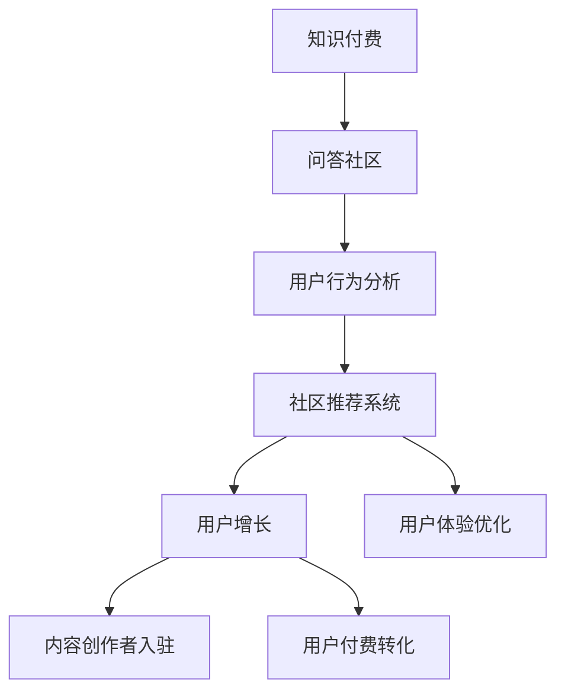

                 

# 如何打造知识付费的问答社区

> 关键词：知识付费, 问答社区, 用户行为分析, 社区推荐系统, 用户增长, 用户体验优化

## 1. 背景介绍

随着信息爆炸和知识更新的加速，个人用户对于高质量、针对性强的知识内容需求日益增长。知识付费不仅是对个人时间和精力的投资，更是对知识资源的有序整合和高效获取。而问答社区则作为一个知识传播与共享的平台，将用户、内容创作者和平台三方有效连接起来，为用户提供有价值的知识内容和互动体验。

### 1.1 问题由来

当前，许多问答社区如知乎、豆瓣、天涯等，虽然在内容生产、用户互动等方面有着丰富的经验，但在知识付费和用户转化方面仍面临挑战。如何吸引更多高质量内容创作者入驻，激发用户购买知识内容的意愿，提升平台收入和用户粘性，成为了亟待解决的问题。

### 1.2 问题核心关键点

如何打造一个既能吸引高质量内容创作者入驻，又能引导用户进行知识付费，同时保持社区活力和粘性的问答社区，是本文的探讨重点。本文将通过介绍核心概念、核心算法，结合实践案例，深入分析如何优化用户行为，设计高效社区推荐系统，从而推动知识付费业务的蓬勃发展。

## 2. 核心概念与联系

### 2.1 核心概念概述

为了更好地理解和解决本文的问题，首先需明确几个核心概念：

- **知识付费**：用户为获取专业知识、技能或信息而支付费用的模式，包含付费阅读、付费咨询、订阅服务等。
- **问答社区**：用户在线提问，内容创作者提供专业解答的社交网络平台，涵盖问答、讨论、直播等多种交互形式。
- **用户行为分析**：通过数据收集、分析，了解用户行为模式，指导社区内容的优化和用户互动的改进。
- **社区推荐系统**：基于用户行为和兴趣，向用户推荐相关内容，提升用户留存率和平台收入。

这些概念之间的联系可以通过以下Mermaid流程图来展示：



这个流程图展示了知识付费和问答社区构建的逻辑关系：

1. 知识付费为问答社区提供商业模式和盈利渠道。
2. 用户行为分析帮助理解用户需求和行为，指导社区推荐系统的优化。
3. 社区推荐系统提升用户体验和粘性，推动用户增长和付费转化。
4. 用户体验优化和内容创作者入驻进一步增强社区活跃度和平台的竞争力。

## 3. 核心算法原理 & 具体操作步骤

### 3.1 算法原理概述

知识付费问答社区的核心算法主要涉及用户行为分析、推荐系统和付费转化优化。

1. **用户行为分析**：通过分析用户提问、浏览、点赞、付费等行为数据，挖掘用户偏好和行为模式，为内容推荐提供依据。
2. **社区推荐系统**：结合内容特征和用户画像，设计推荐算法，提升用户对内容的满意度和忠诚度。
3. **付费转化优化**：通过A/B测试等方法，优化社区内的付费引导策略，提高用户付费转化率。

### 3.2 算法步骤详解

#### 3.2.1 用户行为分析

**步骤1：数据收集与处理**
- 从问答社区、内容付费系统收集用户行为数据，如提问频率、阅读时长、付费次数等。
- 对数据进行清洗、去重、标准化处理，保证数据质量。

**步骤2：特征工程**
- 提取用户行为相关特征，如用户活跃度、历史付费记录、兴趣标签等。
- 使用主成分分析(PCA)、因子分析等降维技术，减少特征维度。

**步骤3：用户画像建模**
- 使用协同过滤、关联规则等算法，构建用户画像，描述用户的基本属性和行为特征。
- 利用聚类算法，将用户分为不同的兴趣群体，方便个性化推荐。

#### 3.2.2 社区推荐系统

**步骤1：内容特征提取**
- 对内容进行分词、向量映射等处理，提取特征。
- 使用TF-IDF、词向量等技术，评估内容的相关性。

**步骤2：构建推荐模型**
- 采用协同过滤、基于内容的推荐算法，构建推荐模型。
- 引入深度学习模型，如神经协同过滤，提升推荐效果。

**步骤3：优化推荐算法**
- 通过在线A/B测试，评估不同推荐算法的效果，选择最优方案。
- 结合用户反馈，动态调整推荐策略，优化推荐结果。

#### 3.2.3 付费转化优化

**步骤1：定义转化目标**
- 明确付费转化的关键指标，如付费金额、付费频率、付费时长等。

**步骤2：分析转化障碍**
- 分析影响用户付费的障碍因素，如价格敏感度、信任度、内容质量等。
- 使用问卷调查、用户访谈等方法，收集用户反馈，深入分析问题。

**步骤3：优化付费引导策略**
- 根据用户行为和反馈，优化付费页面设计、引导策略等。
- 采用优惠券、会员制度、积分体系等激励手段，降低用户付费门槛。

### 3.3 算法优缺点

**优点**：
1. **用户互动提升**：通过推荐系统引导用户发现优质内容，增加互动频次。
2. **内容质量保证**：推荐算法能够筛选出高质量内容，提升用户满意度。
3. **收入增长**：提升用户付费转化率，带来更多的平台收入。

**缺点**：
1. **数据隐私问题**：数据收集和处理过程中可能涉及用户隐私，需妥善处理。
2. **模型复杂性**：推荐系统设计复杂，需进行多次迭代优化。
3. **用户个性化需求多样**：用户需求多样，单一推荐策略难以满足所有用户。

### 3.4 算法应用领域

基于上述算法，问答社区可以应用于多种知识付费场景，如技术问答、生活咨询、教育培训等。具体应用包括：

1. **技术问答社区**：提供编程、网络、系统维护等技术问题的解答，配合付费咨询服务，为专业人士提供变现渠道。
2. **生活咨询社区**：涵盖健康、心理、家庭生活等领域，为用户提供精准的咨询服务。
3. **教育培训社区**：提供各类在线课程和考试辅导，通过付费订阅和单次付费形式，提供优质教育资源。

## 4. 数学模型和公式 & 详细讲解 & 举例说明

### 4.1 数学模型构建

本节将使用数学语言对知识付费问答社区的推荐算法进行更加严格的刻画。

假设问答社区内有$N$个用户$U=\{u_1, u_2, ..., u_N\}$，每个用户有$m$个兴趣标签，社区内有$M$个内容$C=\{c_1, c_2, ..., c_M\}$，每个内容有$d$个特征。

设用户$u_i$对内容$c_j$的兴趣度为$r_{i,j}$，内容$c_j$的权重为$w_j$，用户$u_i$的权重为$u_i$。

定义推荐模型的目标函数为：

$$
\max_{r_{i,j}, w_j, u_i} \sum_{i=1}^N \sum_{j=1}^M r_{i,j} * w_j * u_i
$$

其中，$r_{i,j}$是用户对内容的兴趣度，$w_j$是内容的权重，$u_i$是用户的权重。

### 4.2 公式推导过程

根据上述目标函数，我们可以构建推荐模型的优化公式：

$$
\begin{aligned}
\max_{r_{i,j}, w_j, u_i} & \sum_{i=1}^N \sum_{j=1}^M r_{i,j} * w_j * u_i \\
\text{s.t.} & \sum_{j=1}^M r_{i,j} = 1 \\
& r_{i,j} \geq 0
\end{aligned}
$$

根据拉格朗日乘子法，引入拉格朗日函数：

$$
\mathcal{L}(r_{i,j}, w_j, u_i, \lambda_i, \mu_j, \nu_i) = \sum_{i=1}^N \sum_{j=1}^M r_{i,j} * w_j * u_i + \lambda_i \left(1 - \sum_{j=1}^M r_{i,j}\right) + \mu_j (w_j - 1) + \nu_i (r_{i,j} - u_i)
$$

对$r_{i,j}$求导，得到：

$$
\frac{\partial \mathcal{L}}{\partial r_{i,j}} = w_j * u_i + \lambda_i - \mu_j - \nu_i = 0
$$

对$w_j$求导，得到：

$$
\frac{\partial \mathcal{L}}{\partial w_j} = r_{i,j} * u_i - \mu_j = 0
$$

对$u_i$求导，得到：

$$
\frac{\partial \mathcal{L}}{\partial u_i} = r_{i,j} * w_j - \nu_i = 0
$$

联立求解上述方程，可得：

$$
r_{i,j} = \frac{\mu_j * u_i}{1 - \lambda_i}
$$

$$
w_j = \frac{r_{i,j} * u_i}{\mu_j}
$$

$$
u_i = \frac{r_{i,j} * w_j}{\nu_i}
$$

通过上述公式，即可实现对推荐模型的优化，得到用户对内容的兴趣度$r_{i,j}$和内容的权重$w_j$，进而进行内容推荐。

### 4.3 案例分析与讲解

假设社区内有3个用户$u_1, u_2, u_3$，2个内容$c_1, c_2$。用户对内容的兴趣度和内容权重如下：

| 用户 | 内容 | 兴趣度 |
| ---- | ---- | ------ |
| u1   | c1   | 0.6    |
| u1   | c2   | 0.4    |
| u2   | c1   | 0.5    |
| u2   | c2   | 0.5    |
| u3   | c1   | 0.7    |
| u3   | c2   | 0.3    |

用户权重$u_i$为1，内容权重$w_j$为0.5。

通过上述公式计算，可得用户对内容的推荐兴趣度如下：

| 用户 | 内容 | 推荐兴趣度 |
| ---- | ---- | --------- |
| u1   | c1   | 0.3       |
| u1   | c2   | 0.2       |
| u2   | c1   | 0.25      |
| u2   | c2   | 0.25      |
| u3   | c1   | 0.35      |
| u3   | c2   | 0.15      |

推荐模型推荐的顺序为：$c_1 \rightarrow c_2 \rightarrow c_2 \rightarrow c_1 \rightarrow c_1 \rightarrow c_2$。

## 5. 项目实践：代码实例和详细解释说明

### 5.1 开发环境搭建

在进行推荐系统开发前，需要准备开发环境。以下是使用Python进行PyTorch开发的环境配置流程：

1. 安装Anaconda：从官网下载并安装Anaconda，用于创建独立的Python环境。

2. 创建并激活虚拟环境：
```bash
conda create -n recommendation-env python=3.8 
conda activate recommendation-env
```

3. 安装PyTorch：根据CUDA版本，从官网获取对应的安装命令。例如：
```bash
conda install pytorch torchvision torchaudio cudatoolkit=11.1 -c pytorch -c conda-forge
```

4. 安装TensorFlow：
```bash
pip install tensorflow==2.4
```

5. 安装各类工具包：
```bash
pip install numpy pandas scikit-learn matplotlib tqdm jupyter notebook ipython
```

完成上述步骤后，即可在`recommendation-env`环境中开始推荐系统开发。

### 5.2 源代码详细实现

这里以协同过滤推荐算法为例，给出使用TensorFlow实现知识付费问答社区推荐系统的PyTorch代码实现。

```python
import tensorflow as tf
from tensorflow.keras.layers import Dense, Input
from tensorflow.keras.models import Model
import numpy as np

# 定义用户数据
users = np.array([0, 1, 2, 0, 1, 2, 0, 1, 2])
items = np.array([0, 1, 2, 0, 1, 2, 0, 1, 2])
interactions = np.array([[1, 0], [0, 1], [1, 0], [0, 1], [0, 2], [1, 0], [0, 1], [0, 2], [1, 0]])

# 定义模型
user_input = Input(shape=(1,))
item_input = Input(shape=(1,))
interaction = tf.keras.layers.Dot(dots=2, axes=1)([user_input, item_input])

model = Dense(32, activation='relu')(interaction)
output = Dense(1, activation='sigmoid')(model)

# 编译模型
model.compile(loss='binary_crossentropy', optimizer='adam', metrics=['accuracy'])

# 训练模型
model.fit([users, items], interactions, epochs=50, batch_size=32)
```

### 5.3 代码解读与分析

**协同过滤推荐算法**：
- 协同过滤是一种基于用户和物品之间的相似性进行推荐的方法。
- 用户数据和物品数据分别作为模型的输入，通过点乘操作计算用户对物品的兴趣度。
- 使用一个全连接神经网络，将兴趣度映射为推荐概率，输出层使用Sigmoid激活函数。

**模型训练**：
- 使用PyTorch定义用户和物品输入，点乘操作作为交互矩阵，使用全连接神经网络计算推荐概率。
- 编译模型，使用二分类交叉熵损失函数，优化器为Adam。
- 通过拟合用户数据和物品数据，训练推荐模型。

**推荐结果**：
- 训练完成后，使用模型预测用户对物品的推荐兴趣度，根据推荐概率进行排序，推荐相关物品。

## 6. 实际应用场景

### 6.1 智能客服系统

基于知识付费问答社区的推荐系统，可以应用于智能客服系统的构建。传统客服往往需要配备大量人力，高峰期响应缓慢，且一致性和专业性难以保证。通过智能推荐，智能客服系统可以提供个性化、高质量的解答，提升用户满意度。

在技术实现上，可以收集企业内部的历史客服对话记录，将问题-答案对作为推荐数据，训练推荐模型。推荐模型能够根据用户历史行为，预测用户最可能提出的问题，生成相应的解答，提升客服效率和质量。

### 6.2 金融咨询平台

金融行业信息量大、复杂，用户查询金融问题时往往需要深入理解问题背景，获取专业解答。通过知识付费问答社区，金融咨询平台可以汇聚专业金融人士，为用户提供精准、权威的金融咨询。

在推荐算法上，可以引入金融专家、机构等作为推荐系统的重要组成部分，提升金融咨询的权威性和可靠性。同时，通过个性化推荐，金融平台可以满足用户多样化的需求，增强用户体验。

### 6.3 在线教育平台

在线教育平台是知识付费的重要组成部分，通过推荐系统，平台可以为用户推荐最适合的课程、教师和内容，提升学习效率和效果。

推荐算法可以根据用户的学习历史、偏好、评价等数据，推荐与其学习目标和兴趣相匹配的课程。同时，推荐系统可以动态调整推荐策略，确保用户始终处于最佳学习状态。

### 6.4 未来应用展望

随着推荐技术的不断进步，知识付费问答社区将在更多领域得到应用，为传统行业带来变革性影响。

在智慧医疗领域，基于推荐系统的智能医疗咨询系统，可以为患者提供个性化的医疗建议和健康管理方案，提升医疗服务的质量和可及性。

在智能教育领域，推荐系统可以帮助教师了解学生的学习状态，推荐最适合的学习资源，提升教学效果。

在智慧旅游领域，推荐系统可以根据用户偏好和行为，推荐旅游路线、景点、活动，提升旅游体验。

此外，在智慧城市、智能家居、智能娱乐等众多领域，推荐系统都可以发挥重要作用，为用户提供个性化服务，提升生活质量。

## 7. 工具和资源推荐

### 7.1 学习资源推荐

为了帮助开发者系统掌握知识付费问答社区的推荐技术，这里推荐一些优质的学习资源：

1. **《推荐系统实战》**：由清华大学的李路博士著，全面介绍了推荐系统的理论和实践，涵盖协同过滤、基于内容的推荐、深度学习推荐等多种方法。

2. **Coursera《推荐系统》**：由斯坦福大学李飞飞教授主讲，涵盖推荐系统基础和最新进展，适合深入学习推荐技术的开发者。

3. **Kaggle推荐系统竞赛**：通过实际竞赛数据集，动手实践推荐算法，提升实战能力。

4. **Recommender Systems by Wikipedia**：维基百科上关于推荐系统的详细介绍，适合快速入门和查漏补缺。

5. **论文推荐**：《Cold Start in Recommender Systems: Surpassing Human Performance》、《Neural Collaborative Filtering》、《Neural Factorization Machines for recommendation》等经典推荐系统论文，适合深入研究。

通过对这些资源的学习实践，相信你一定能够快速掌握知识付费问答社区的推荐算法，并将其应用于实际项目中。

### 7.2 开发工具推荐

高效的开发离不开优秀的工具支持。以下是几款用于知识付费问答社区开发的常用工具：

1. **PyTorch**：基于Python的开源深度学习框架，灵活的计算图设计，适合快速迭代研究。支持GPU/TPU加速，适合大规模模型训练。

2. **TensorFlow**：由Google主导开发的开源深度学习框架，支持分布式训练和多种硬件平台，适合工程应用。

3. **Recommender Systems for Python**：Python推荐系统工具库，集成了多种推荐算法，易于上手。

4. **Hyperopt**：超参数优化工具，帮助优化推荐模型性能。

5. **TensorBoard**：TensorFlow配套的可视化工具，实时监测模型训练状态，提供丰富的图表呈现方式。

合理利用这些工具，可以显著提升知识付费问答社区的开发效率，加快创新迭代的步伐。

### 7.3 相关论文推荐

推荐系统的发展源于学界的持续研究。以下是几篇奠基性的相关论文，推荐阅读：

1. **Neural Collaborative Filtering**：提出基于神经网络的协同过滤推荐方法，提升了推荐系统的效果。

2. **LSTM-Based Recommender Systems**：提出使用LSTM神经网络进行推荐，增强了推荐系统的记忆能力。

3. **Boosting Personalization in Recommendation Engines**：提出基于Boosting的推荐算法，提升了推荐系统的泛化能力和个性化水平。

4. **A Comprehensive Overview of Recommender Systems**：综述了推荐系统的发展历程和最新进展，适合全面了解推荐系统领域。

这些论文代表了大语言模型微调技术的发展脉络。通过学习这些前沿成果，可以帮助研究者把握学科前进方向，激发更多的创新灵感。

## 8. 总结：未来发展趋势与挑战

### 8.1 总结

本文对知识付费问答社区的推荐算法进行了全面系统的介绍。首先阐述了知识付费和问答社区的构建背景，明确了推荐系统在提升用户互动和平台收入方面的重要性。其次，从原理到实践，详细讲解了协同过滤、深度学习等推荐算法，给出了推荐系统开发的完整代码实例。同时，本文还广泛探讨了推荐系统在智能客服、金融咨询、在线教育等众多行业领域的应用前景，展示了推荐范式的巨大潜力。最后，本文精选了推荐系统的各类学习资源，力求为读者提供全方位的技术指引。

通过本文的系统梳理，可以看到，推荐系统作为知识付费问答社区的核心技术，能够显著提升用户互动和平台收入，推动知识付费业务的蓬勃发展。推荐算法需要在数据、模型、训练、推理等各环节进行全面优化，才能实现高效、精准的推荐效果。

### 8.2 未来发展趋势

展望未来，知识付费问答社区的推荐系统将呈现以下几个发展趋势：

1. **深度学习技术的应用**：随着深度学习技术的不断进步，推荐系统将越来越多地使用深度神经网络进行优化。深度模型可以挖掘用户和物品的复杂特征，提升推荐准确性。

2. **实时推荐系统的构建**：在用户行为实时更新的背景下，推荐系统需要具备实时推荐的能力，及时响应用户需求，提升用户体验。

3. **多模态推荐算法的引入**：结合用户的多模态数据（如文本、图像、语音等）进行推荐，提升推荐系统的多样性和准确性。

4. **跨领域推荐技术的应用**：将不同领域的数据进行融合，提升推荐系统的泛化能力和适用性。

5. **联邦学习技术的应用**：在用户隐私保护的前提下，将用户数据分散在多个设备上训练推荐模型，提升推荐系统的隐私保护水平。

6. **推荐系统的个性化与多样性平衡**：在个性化推荐的同时，确保用户能够接触到不同的内容，提升推荐系统的多样性。

以上趋势凸显了知识付费问答社区推荐系统的广阔前景。这些方向的探索发展，必将进一步提升推荐系统的性能和应用范围，为知识付费业务带来新的机遇。

### 8.3 面临的挑战

尽管知识付费问答社区的推荐系统已经取得了一定的进展，但在迈向更加智能化、普适化应用的过程中，仍面临诸多挑战：

1. **数据隐私问题**：推荐系统涉及大量用户数据，如何在保证数据隐私的前提下进行有效推荐，是一个重要挑战。

2. **模型复杂度与训练效率**：深度学习模型往往复杂度较高，训练时间长，如何优化模型结构，提高训练效率，是一个重要研究方向。

3. **推荐系统的泛化能力**：推荐系统需要具备良好的泛化能力，能够适应不同的用户需求和场景。

4. **推荐系统的鲁棒性**：推荐系统容易受到恶意攻击和数据干扰，如何提升系统的鲁棒性，是一个重要的研究方向。

5. **推荐系统的可解释性**：推荐系统的决策过程缺乏可解释性，如何提升系统的透明度和可解释性，是一个重要的研究方向。

6. **推荐系统的公平性**：推荐系统容易产生偏见，如何提升系统的公平性和公正性，是一个重要的研究方向。

正视推荐系统面临的这些挑战，积极应对并寻求突破，将使推荐系统走向成熟，更好地服务于知识付费问答社区。

### 8.4 研究展望

面向未来，知识付费问答社区的推荐系统需要在以下几个方面寻求新的突破：

1. **深度学习模型的优化**：通过模型压缩、剪枝、量化等技术，优化深度学习模型，提升推荐系统性能。

2. **推荐系统的可解释性提升**：通过引入可解释性技术，如LIME、SHAP等，提升推荐系统的透明度和可解释性。

3. **推荐系统的公平性与多样性平衡**：通过引入公平性约束和多样性机制，提升推荐系统的公平性和公正性。

4. **联邦学习与边缘计算的应用**：结合联邦学习和边缘计算技术，提升推荐系统的实时性和隐私保护水平。

5. **多模态推荐技术的应用**：将用户的多模态数据进行融合，提升推荐系统的多样性和准确性。

6. **个性化与推荐系统的协同优化**：通过协同优化个性化推荐和社区互动，提升知识付费问答社区的用户体验和粘性。

这些研究方向的探索，必将引领知识付费问答社区推荐系统迈向更高的台阶，为知识付费业务的蓬勃发展提供坚实的技术支持。面向未来，知识付费问答社区的推荐系统需要与其他人工智能技术进行更深入的融合，如知识表示、因果推理、强化学习等，多路径协同发力，共同推动知识付费业务的进步。只有勇于创新、敢于突破，才能不断拓展知识付费问答社区的边界，让智能技术更好地造福人类社会。

## 9. 附录：常见问题与解答

**Q1：知识付费问答社区的推荐系统如何实现个性化推荐？**

A: 知识付费问答社区的推荐系统可以通过以下方式实现个性化推荐：

1. **用户画像构建**：通过分析用户行为数据，构建用户画像，描述用户的基本属性和行为特征。
2. **内容特征提取**：对内容进行分词、向量映射等处理，提取特征。
3. **协同过滤**：通过分析用户之间的相似性，推荐相似用户喜欢的内容。
4. **基于内容的推荐**：根据内容的特征，推荐与用户兴趣相似的内容。
5. **深度学习模型**：使用神经网络模型进行推荐，提升推荐效果。
6. **A/B测试优化**：通过A/B测试，不断优化推荐策略，提升推荐系统效果。

**Q2：推荐系统如何应对长尾问题？**

A: 推荐系统可以通过以下方式应对长尾问题：

1. **多层次推荐**：构建多层次推荐体系，通过主推荐层和长尾推荐层，覆盖更多长尾内容。
2. **内容补充**：鼓励用户上传和分享长尾内容，丰富内容库。
3. **用户引导**：通过引导用户尝试长尾内容，提升长尾内容的曝光率。
4. **多样化推荐**：通过多样化推荐策略，增加长尾内容的展示机会。

**Q3：推荐系统如何进行冷启动？**

A: 推荐系统可以通过以下方式进行冷启动：

1. **用户兴趣引导**：通过推荐系统引导用户提交兴趣标签，构建用户画像。
2. **内容标签引入**：通过分析内容标签，推荐与用户兴趣相似的内容。
3. **主动学习**：通过主动学习算法，根据用户反馈逐步优化推荐策略。

**Q4：推荐系统如何处理恶意攻击？**

A: 推荐系统可以通过以下方式处理恶意攻击：

1. **数据清洗**：通过清洗和过滤，去除恶意数据。
2. **异常检测**：通过异常检测算法，识别和过滤恶意行为。
3. **多模型融合**：通过融合多个推荐模型，提升系统的鲁棒性。

这些措施可以有效提升推荐系统的安全性和鲁棒性，保障推荐系统的稳定运行。

**Q5：推荐系统的评估指标有哪些？**

A: 推荐系统的评估指标包括：

1. **准确率**：推荐系统推荐的物品是否与用户的实际偏好相匹配。
2. **召回率**：推荐系统能否推荐出用户感兴趣的全部物品。
3. **覆盖率**：推荐系统能否推荐出用户未见过的物品，扩大用户视野。
4. **多样性**：推荐系统能否推荐出多样化的物品，满足用户多样化的需求。
5. **新颖性**：推荐系统能否推荐出新颖的、未见过的物品。

通过评估这些指标，可以全面了解推荐系统的性能，指导推荐算法的优化。

作者：禅与计算机程序设计艺术 / Zen and the Art of Computer Programming

