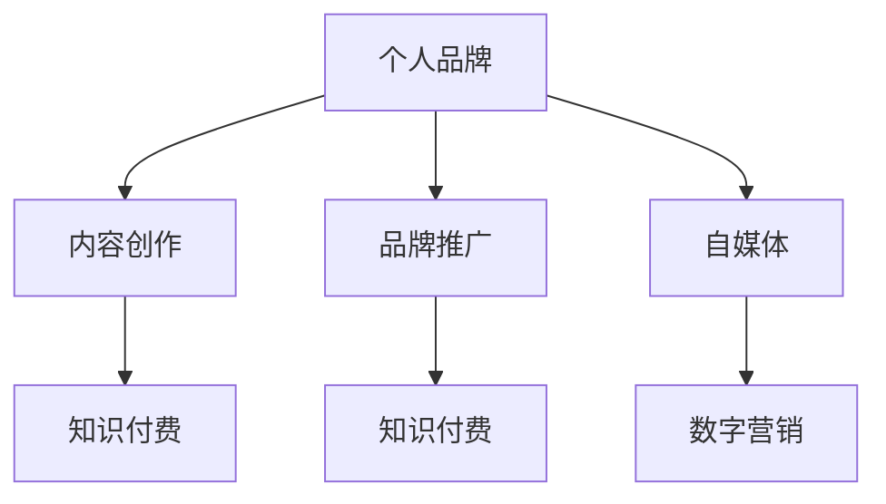

                 

# 如何打造程序员知识付费个人品牌

> 关键词：知识付费, 个人品牌, 程序员, 技术写作, 自媒体, 数字营销

## 1. 背景介绍

在快速发展的技术时代，个人品牌建设显得尤为重要。特别是对于程序员而言，个人品牌不仅能提升职业竞争力，还能开辟新的收入渠道，如知识付费、咨询培训等。本文将深入探讨如何打造程序员知识付费个人品牌，从职业规划、内容创作、品牌推广等方面提供全面指导。

### 1.1 问题由来

在互联网普及和技术迭代加速的今天，技术从业者不仅需要掌握专业技能，还需要具备良好的自我营销能力。传统以技术为核心的发展模式已经不足以满足职业发展的需求，个人品牌化成为了许多技术人才的共识。然而，如何在技术密集型行业建立一个令人信服的个人品牌，是一个值得深思的问题。

### 1.2 问题核心关键点

- **个人品牌定位**：明确自己的专长领域，找到目标受众，并持续输出与之相关的优质内容。
- **内容创作**：高质量、持续不断的内容输出是建立个人品牌的关键。
- **品牌推广**：借助有效的数字营销策略，扩大个人品牌影响力。
- **收益模式**：探索合理的知识付费形式，实现品牌变现。

## 2. 核心概念与联系

### 2.1 核心概念概述

本节将介绍几个与个人品牌建设密切相关的核心概念：

- **个人品牌**：在特定领域内，个人通过独特的人格特质和专业技能，在社会公众中建立起来的独特形象和声誉。
- **知识付费**：用户为获取知识而支付费用的行为，常见形式包括在线课程、付费文章、咨询服务等。
- **自媒体**：通过互联网平台进行自我宣传和内容发布，建立个人影响力。
- **数字营销**：利用数字渠道和技术手段，进行产品或品牌推广，提升品牌影响力。

这些概念之间的逻辑关系可以通过以下Mermaid流程图来展示：



这个流程图展示了个体品牌建设的流程：

1. 通过内容创作建立品牌形象。
2. 利用品牌推广扩大影响力。
3. 通过自媒体平台进行持续曝光。
4. 借助数字营销手段进行品牌变现。

## 3. 核心算法原理 & 具体操作步骤
### 3.1 算法原理概述

打造程序员个人品牌，其实质上是一种基于内容价值的品牌营销策略。通过持续输出高质量、有价值的技术内容，吸引目标受众，从而在市场中建立起个人品牌的权威性和影响力。

具体而言，可以分为以下几个步骤：

1. **品牌定位**：明确自己的技术专长和兴趣点，确定品牌的目标受众。
2. **内容创作**：针对目标受众的需求，创作高质量、有价值的内容。
3. **品牌推广**：利用数字营销策略，提升内容曝光度和品牌影响力。
4. **变现模式**：探索适合的知识付费形式，实现个人品牌的商业化。

### 3.2 算法步骤详解

#### 3.2.1 品牌定位

- **自我评估**：明确自己的核心竞争力，例如技术深度、项目经验、教育背景等。
- **目标受众**：分析潜在受众的特征，如技术水平、行业需求、关注点等。
- **差异化定位**：根据自身优势和市场需求，找到独特的品牌定位，如成为某领域的权威讲师、技术咨询顾问、开源项目贡献者等。

#### 3.2.2 内容创作

- **选题策略**：根据目标受众的需求，选择相关技术话题，如最新技术趋势、实际项目经验分享、技术难题解决等。
- **内容形式**：选择适合的内容形式，如博客文章、技术视频、在线课程、电子书等。
- **内容质量**：确保内容的深度、广度和实用性，避免泛泛而谈或过于专业化难以理解。

#### 3.2.3 品牌推广

- **平台选择**：选择合适的自媒体平台，如技术博客、视频网站、社交媒体等。
- **营销策略**：运用数字营销手段，如SEO优化、社交媒体互动、邮件营销等，提升内容曝光。
- **品牌曝光**：通过持续、高质量的内容输出，提高个人品牌的知名度和信任度。

#### 3.2.4 变现模式

- **知识付费**：开设在线课程、发布付费文章、提供技术咨询服务等。
- **品牌合作**：与技术公司、教育机构等进行品牌合作，获取商业机会。
- **广告收入**：在个人品牌相关的自媒体平台上设置广告，获取广告收入。

### 3.3 算法优缺点

#### 3.3.1 优点

- **价值提升**：通过个人品牌的建设，可以显著提升技术影响力，获取更多职业机会。
- **收入多样化**：除了传统工资收入，还可以获得知识付费、品牌合作等多种形式的高价值回报。
- **自我满足**：通过创作和分享，实现个人价值的最大化，获得成就感和自我满足。

#### 3.3.2 缺点

- **时间成本高**：品牌建设需要大量的时间和精力，可能会影响日常工作。
- **市场竞争激烈**：技术领域竞争激烈，建立品牌需具备较强的技术能力和营销能力。
- **收益周期长**：品牌建设往往需要较长时间的积累和沉淀，短期内难以看到明显回报。

### 3.4 算法应用领域

个人品牌建设的应用领域广泛，不仅限于技术领域，还包括设计、营销、教育等多个行业。在技术领域，个人品牌建设主要体现在以下几个方面：

- **技术博客**：通过撰写高质量的技术文章，建立技术权威，吸引技术从业者关注。
- **技术视频**：通过录制技术讲解视频，提升品牌知名度，扩大受众基础。
- **在线课程**：通过开设技术课程，传授专业知识，获取学员支持和推荐。
- **开源项目**：通过贡献高质量的开源项目，提升技术实力，增强个人影响力。

## 4. 数学模型和公式 & 详细讲解 & 举例说明

本节将使用数学语言对个人品牌建设的核心过程进行详细解释。

### 4.1 数学模型构建

**品牌影响力模型**：

$$
\text{Influence} = \text{Content Quality} \times \text{Content Frequency} \times \text{Target Reach} \times \text{Engagement Rate}
$$

- **Content Quality**：内容质量，反映内容的深度、实用性和创新性。
- **Content Frequency**：内容频率，指单位时间内发布内容的数量和周期。
- **Target Reach**：目标受众范围，指内容能够影响和触及的目标用户数。
- **Engagement Rate**：用户互动率，指用户对内容的互动程度，如点赞、评论、分享等。

### 4.2 公式推导过程

通过上述模型，可以推导出提升品牌影响力的几个关键策略：

1. **提升内容质量**：通过不断学习和实践，提升技术深度和广度，增强内容的专业性和实用性。
2. **增加内容频率**：保持内容输出的持续性和规律性，定期发布新内容，吸引更多关注。
3. **扩大目标受众**：通过社交媒体、技术社区等渠道，扩大内容曝光，触达更多潜在受众。
4. **提高用户互动率**：鼓励用户参与讨论，积极回复评论，增强用户粘性和互动率。

### 4.3 案例分析与讲解

以某技术博主为例，其通过以下策略提升品牌影响力：

- **内容质量**：撰写深入浅出的技术文章，分享实际项目经验，解决技术难题。
- **内容频率**：每周定期发布新内容，保持内容输出的连续性。
- **目标受众**：通过社交媒体和技术社区，扩大内容触及范围，吸引技术从业者关注。
- **用户互动率**：积极回复评论，引导用户参与讨论，增强社区互动氛围。

## 5. 项目实践：代码实例和详细解释说明
### 5.1 开发环境搭建

要进行个人品牌建设，首先需要搭建一个适合的内容创作和发布环境。以下是一些必要的工具和平台：

- **技术博客平台**：如Medium、GitHub Pages等，提供博客创建和管理功能。
- **内容创作工具**：如VS Code、Atom、Sublime Text等，用于撰写技术文章。
- **视频录制工具**：如OBS Studio、Adobe Premiere Pro等，用于录制和编辑技术视频。
- **社交媒体平台**：如Twitter、LinkedIn、Github等，用于品牌推广和内容分享。

### 5.2 源代码详细实现

**技术博客文章撰写**：

```bash
# VS Code打开博客文章撰写界面
```

**技术视频录制和编辑**：

```bash
# OBS Studio录制技术视频
# Adobe Premiere Pro编辑视频
```

**社交媒体内容发布**：

```bash
# 使用API或自动化工具将内容发布至社交媒体平台
```

### 5.3 代码解读与分析

这些工具和平台提供了个人品牌建设所需的基本功能，开发者可以依据自身需求选择适合的开发工具和内容发布平台。技术文章撰写和视频录制的过程，需要具备一定的技术能力和内容创作能力。社交媒体内容发布，则需要一定的数字营销技能，确保内容能够高效曝光，吸引目标受众。

### 5.4 运行结果展示

**技术博客文章**：

- **标题**：深入浅出技术文章示例
- **内容摘要**：该文章详细介绍了最新技术趋势，并结合实际项目案例，讲解了技术的实现和应用。
- **用户互动**：文章发布后，通过社交媒体推广，获得大量评论和分享，提升品牌知名度。

**技术视频**：

- **标题**：视频讲解技术问题
- **视频内容**：讲解了一个实际的技术问题，并提供了详细的解决方案。
- **用户互动**：视频上传至视频平台，通过技术社区推广，吸引大量观看和点赞，提升品牌影响力。

## 6. 实际应用场景

### 6.1 技术博客

通过技术博客，可以持续输出高质量的技术内容，吸引技术从业者关注。技术博客不仅提升品牌知名度，还能展示技术实力，获取更多职业机会。例如，一位专注于数据分析的博主，通过撰写一系列关于数据科学的文章，逐渐建立起了行业内的权威地位，吸引了许多数据分析师和企业关注。

### 6.2 技术视频

技术视频相较于文章，具有更高的吸引力和互动性，能够快速吸引受众关注。例如，某技术视频网站博主，通过录制一系列编程技巧和项目演示视频，吸引了大量技术爱好者的关注，并逐步转变为付费课程讲师，实现收入多元化。

### 6.3 在线课程

在线课程是将技术知识系统化、结构化输出的有效形式，能快速提升品牌影响力。例如，某架构师博主通过录制系列架构设计课程，吸引了大量学员，不仅提升了品牌知名度，还获得了课程销售和咨询服务的收入。

## 7. 工具和资源推荐

### 7.1 学习资源推荐

- **《打造个人品牌》系列课程**：教你如何从零开始建立个人品牌，包括品牌定位、内容创作、营销策略等。
- **《技术写作指南》书籍**：详细讲解如何撰写高质量的技术文章和视频，提升内容质量。
- **《数字营销基础》课程**：提供数字营销的基本知识和技能，帮助提升品牌推广能力。

### 7.2 开发工具推荐

- **VS Code**：轻量级的代码编辑器，支持多种编程语言和插件扩展，适合技术写作。
- **OBS Studio**：免费的开源视频录制软件，功能强大，适合技术视频录制。
- **Adobe Premiere Pro**：专业的视频编辑工具，支持多种视频格式和特效处理。
- **Hootsuite**：社交媒体管理工具，帮助统一管理多平台内容发布和互动。

### 7.3 相关论文推荐

- **《个人品牌建设与数字化营销》**：探讨了个人品牌建设的重要性和方法，强调了内容质量和数字营销的作用。
- **《技术博客与内容营销》**：分析了技术博客在品牌建设中的角色，如何通过技术文章提升品牌影响力。

## 8. 总结：未来发展趋势与挑战

### 8.1 研究成果总结

本文系统介绍了如何打造程序员知识付费个人品牌，从品牌定位、内容创作、品牌推广、变现模式等方面提供了全面指导。通过持续输出高质量内容，利用数字营销手段提升品牌影响力，探索合理的知识付费形式，实现品牌变现。

### 8.2 未来发展趋势

- **内容多样化**：未来个人品牌建设将更加多元化，除了技术内容，还将包含更多非技术领域的知识和经验。
- **互动化增强**：互动和社区建设将成为品牌建设的重要环节，通过增强用户互动，提升品牌粘性。
- **国际化拓展**：随着全球化趋势加剧，个人品牌建设也将跨越地域限制，面向全球受众。

### 8.3 面临的挑战

- **内容持续性**：如何保持内容的持续性和创新性，避免内容质量下降和受众流失。
- **市场竞争**：技术领域竞争激烈，如何保持品牌优势，持续提升技术水平和市场竞争力。
- **品牌传播**：如何高效传播品牌信息，在激烈的市场中脱颖而出。

### 8.4 研究展望

- **AI辅助创作**：利用AI技术辅助内容创作，提升创作效率和质量。
- **个性化推荐**：通过个性化推荐系统，精准推送内容给目标受众。
- **跨平台协同**：将个人品牌建设与社交媒体、视频网站等平台进行协同，实现品牌影响力最大化。

## 9. 附录：常见问题与解答

**Q1: 个人品牌建设的初期阶段应该关注哪些关键点？**

A: 初期阶段应该关注以下几点：
1. **品牌定位**：明确自己的核心竞争力，找到目标受众。
2. **内容输出**：持续发布高质量、有价值的内容。
3. **平台选择**：选择合适的自媒体平台进行内容发布。

**Q2: 如何平衡技术写作和日常工作？**

A: 可以通过以下几点平衡技术写作和日常工作：
1. **时间管理**：制定详细的时间表，合理分配时间。
2. **写作习惯**：培养写作习惯，利用零碎时间积累内容。
3. **团队协作**：组建技术写作团队，分工合作，提高效率。

**Q3: 如何提高内容互动率？**

A: 可以通过以下几点提高内容互动率：
1. **互动话题**：选择受众感兴趣的话题，吸引用户参与讨论。
2. **即时回复**：积极回复评论，增强用户互动。
3. **内容质量**：保证内容质量，提升用户满意度。

**Q4: 如何选择合适的自媒体平台？**

A: 可以通过以下几点选择合适的自媒体平台：
1. **目标受众**：根据目标受众的特点，选择适合的平台。
2. **内容形式**：选择适合内容形式的平台，如技术博客、视频网站、社交媒体等。
3. **平台流量**：选择流量大、用户活跃的平台，提高内容曝光。

---

作者：禅与计算机程序设计艺术 / Zen and the Art of Computer Programming

