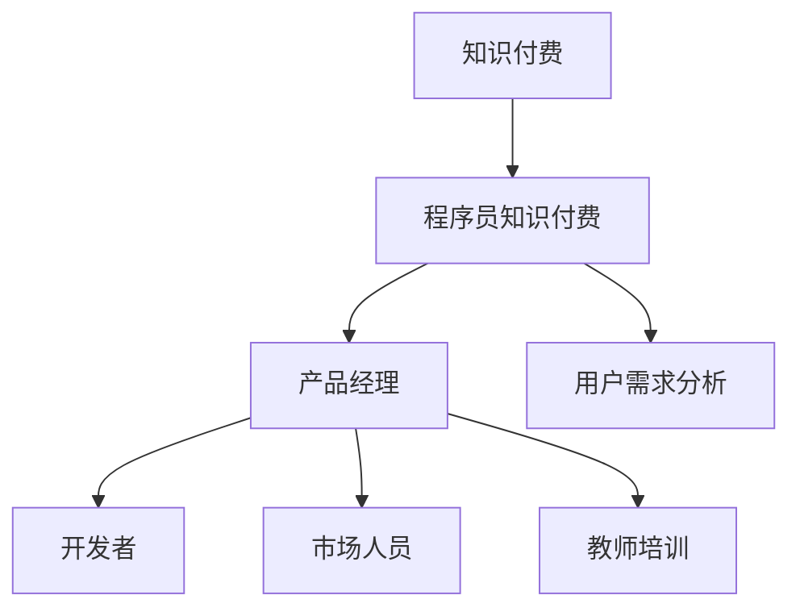

                 

# 如何打造高收益的程序员知识付费产品

> 关键词：知识付费, 程序员, 产品经理, 营销策略, 用户需求, 收益最大化, 数据驱动, 课程设计, 教师培训, 市场调研

## 1. 背景介绍

随着技术日新月异的发展，越来越多的程序员意识到学习新技能的重要性。然而，自学过程中的资源获取、进度追踪、问题解决等难题却让他们望而却步。知识付费平台应运而生，满足了程序员在高效、系统化学习新技能方面的需求。本文旨在探讨如何打造一款高收益的程序员知识付费产品，帮助产品经理、开发者、市场人员和教师从零到一搭建一个成功的知识付费平台。

## 2. 核心概念与联系

### 2.1 核心概念概述

为了更好地理解如何打造高收益的程序员知识付费产品，我们首先介绍几个关键概念：

- **知识付费**：指消费者为获取知识和技能，付费购买线上课程、咨询、资讯等服务的商业模式。
- **程序员知识付费**：特指针对程序员群体的知识付费平台，旨在提供高效、系统、实用、紧跟技术趋势的编程课程和教程。
- **产品经理**：负责知识付费产品的整体策划、运营和市场推广的团队成员。
- **开发者**：构建和维护知识付费平台的技术团队，包括前端、后端、测试等岗位。
- **市场人员**：负责市场调研、用户增长、广告投放等，是产品推广的关键力量。
- **教师培训**：为优质课程的教师提供培训，确保课程内容的准确性和实用性。
- **用户需求分析**：通过市场调研和用户反馈，深入理解目标用户的需求，指导课程设计和产品迭代。

这些核心概念之间的联系可以通过以下Mermaid流程图来展示：



这个流程图展示了知识付费平台如何通过产品经理、开发者、市场人员、教师培训和用户需求分析等关键环节，构建出一款符合目标用户需求的程序员知识付费产品。

## 3. 核心算法原理 & 具体操作步骤

### 3.1 算法原理概述

打造高收益的程序员知识付费产品，关键在于理解用户需求，设计出有价值的内容，同时通过有效的营销策略和运营手段吸引并留住用户。我们可以从以下五个方面入手：

1. **用户需求分析**：通过市场调研和用户反馈，确定目标用户群体的需求和痛点。
2. **课程设计与内容制作**：设计符合用户需求的高质量课程内容，并邀请资深开发者制作。
3. **平台搭建与技术实现**：利用先进的开发工具和技术，构建高效、易用的知识付费平台。
4. **市场推广与用户获取**：通过精准的广告投放、社区互动、口碑传播等手段，吸引用户注册和购买课程。
5. **用户留存与收益最大化**：通过优秀的用户体验和多样化的服务，提升用户粘性和复购率。

### 3.2 算法步骤详解

#### 3.2.1 用户需求分析

**步骤1：市场调研**
- 调研目标：了解市场现状和用户需求。
- 方法：问卷调查、用户访谈、竞品分析。
- 输出：目标用户画像、需求痛点列表。

**步骤2：用户反馈收集**
- 渠道：在线问卷、社交媒体、客户支持。
- 频率：定期收集用户反馈。
- 输出：用户满意度、课程评价、改进建议。

**步骤3：需求整合与优先级排序**
- 方法：数据整理、需求分析、专家评审。
- 输出：需求优先级列表、功能需求文档。

#### 3.2.2 课程设计与内容制作

**步骤1：确定课程主题**
- 方法：用户调研、专家咨询、行业趋势分析。
- 输出：课程主题列表。

**步骤2：设计课程结构**
- 方法：用户需求分析、教育心理学、课程设计原则。
- 输出：课程大纲、教学计划。

**步骤3：制作课程内容**
- 方法：邀请行业专家、资深开发者、教育工作者。
- 输出：课程视频、文档、练习题、测试题。

**步骤4：优化课程呈现**
- 方法：用户体验设计、交互设计、多媒体制作。
- 输出：课程界面、视频剪辑、动画效果。

#### 3.2.3 平台搭建与技术实现

**步骤1：需求分析与设计**
- 方法：用户体验设计、技术架构设计。
- 输出：平台功能需求、技术架构方案。

**步骤2：技术选型与开发**
- 工具：Vue.js、React、Node.js、Django、Flask。
- 方法：模块化开发、敏捷开发、代码审查。
- 输出：平台后端、前端、数据库、API。

**步骤3：测试与优化**
- 方法：单元测试、集成测试、性能测试、负载测试。
- 输出：Bug报告、性能数据、优化方案。

#### 3.2.4 市场推广与用户获取

**步骤1：确定目标用户**
- 方法：人口统计分析、用户行为分析。
- 输出：目标用户人群。

**步骤2：选择推广渠道**
- 方法：社交媒体、搜索引擎、广告平台、合作伙伴。
- 输出：推广渠道方案、广告预算。

**步骤3：制定推广策略**
- 方法：SEO优化、内容营销、社交媒体互动、用户推荐。
- 输出：推广计划、执行时间表。

**步骤4：监控与调整**
- 方法：数据分析、用户行为分析、A/B测试。
- 输出：推广效果分析、优化方案。

#### 3.2.5 用户留存与收益最大化

**步骤1：提升用户体验**
- 方法：界面优化、功能完善、用户支持。
- 输出：用户满意度提升、用户粘性增强。

**步骤2：增加用户粘性**
- 方法：社区建设、互动功能、会员体系。
- 输出：社区活跃度提升、会员数量增加。

**步骤3：促进复购**
- 方法：个性化推荐、积分系统、优惠活动。
- 输出：复购率提升、ARPU增加。

### 3.3 算法优缺点

**优点**：
1. **用户导向**：通过深入的用户需求分析，确保产品内容符合市场需求。
2. **多样化服务**：提供多样化的课程和功能，满足不同用户需求。
3. **高效开发**：通过敏捷开发和模块化设计，提升开发效率。
4. **精准营销**：通过数据驱动的推广策略，提高用户获取和留存率。

**缺点**：
1. **成本高**：高质量内容的制作和平台开发需要大量时间和资金投入。
2. **市场竞争激烈**：知识付费市场竞争激烈，需要持续创新和优化。
3. **用户期望高**：用户期望内容质量高、更新频率快，对平台运营要求高。
4. **用户流失风险**：用户流失率高，需要不断优化用户体验和留存策略。

### 3.4 算法应用领域

该算法已经在多个知识付费平台得到广泛应用，如Coursera、Udacity、慕课网等。具体应用领域包括但不限于：

- **在线编程课程**：如Python、Java、C++等编程语言的教学。
- **技术趋势**：如人工智能、区块链、云计算等新兴技术的入门和进阶课程。
- **软件开发框架**：如Spring、React、Vue等框架的实战教学。
- **数据科学**：如数据挖掘、机器学习、大数据分析等课程。
- **项目管理**：如敏捷开发、Scrum、Kanban等项目管理方法的教学。

## 4. 数学模型和公式 & 详细讲解 & 举例说明

### 4.1 数学模型构建

我们可以用以下数学模型来描述知识付费产品的用户获取和留存过程：

**用户获取模型**：

$$ P_{acquisition} = f(S_{target}, P_{ad}, C_{budget}, D_{channels}, E_{strategy}) $$

其中：
- $P_{acquisition}$：目标用户获取率。
- $S_{target}$：目标用户人群。
- $P_{ad}$：广告投放策略。
- $C_{budget}$：广告预算。
- $D_{channels}$：推广渠道。
- $E_{strategy}$：市场推广策略。

**用户留存模型**：

$$ P_{retention} = f(C_{content}, U_{experience}, A_{activity}, M_{monitoring}, F_{feedback}) $$

其中：
- $P_{retention}$：用户留存率。
- $C_{content}$：课程内容。
- $U_{experience}$：用户体验。
- $A_{activity}$：用户活跃度。
- $M_{monitoring}$：用户行为监测。
- $F_{feedback}$：用户反馈。

### 4.2 公式推导过程

**用户获取模型推导**：

假设目标用户获取模型为线性回归模型，输入变量 $X$ 包括目标用户人群 $S_{target}$、广告投放策略 $P_{ad}$、广告预算 $C_{budget}$、推广渠道 $D_{channels}$ 和市场推广策略 $E_{strategy}$，输出变量 $Y$ 为用户获取率 $P_{acquisition}$。

$$ P_{acquisition} = \beta_0 + \beta_1S_{target} + \beta_2P_{ad} + \beta_3C_{budget} + \beta_4D_{channels} + \beta_5E_{strategy} + \epsilon $$

**用户留存模型推导**：

假设用户留存模型为逻辑回归模型，输入变量 $X$ 包括课程内容 $C_{content}$、用户体验 $U_{experience}$、用户活跃度 $A_{activity}$、用户行为监测 $M_{monitoring}$ 和用户反馈 $F_{feedback}$，输出变量 $Y$ 为用户留存率 $P_{retention}$。

$$ \log\left(\frac{P_{retention}}{1-P_{retention}}\right) = \alpha_0 + \alpha_1C_{content} + \alpha_2U_{experience} + \alpha_3A_{activity} + \alpha_4M_{monitoring} + \alpha_5F_{feedback} + \epsilon $$

### 4.3 案例分析与讲解

**案例1：Udacity的编程课程**

- **用户需求分析**：通过在线问卷和用户访谈，了解目标用户对编程技能的需求和痛点。
- **课程设计与内容制作**：邀请资深开发者设计课程大纲，并邀请行业专家制作高质量视频内容。
- **平台搭建与技术实现**：利用React、Django等技术，构建高效、易用的知识付费平台。
- **市场推广与用户获取**：通过谷歌广告、社交媒体推广、合作伙伴营销等手段，吸引用户注册和购买课程。
- **用户留存与收益最大化**：通过提供个性化的课程推荐、社区互动、积分体系等，提升用户粘性和复购率。

**案例2：慕课网的PMP课程**

- **用户需求分析**：通过市场调研和用户反馈，确定项目管理领域的用户需求。
- **课程设计与内容制作**：邀请资深项目经理设计课程结构，并制作实战视频内容。
- **平台搭建与技术实现**：利用Vue.js、Node.js等技术，构建PMP课程平台。
- **市场推广与用户获取**：通过SEO优化、内容营销、邮件营销等手段，吸引PMP认证考试的用户。
- **用户留存与收益最大化**：通过提供个性化的学习路径、社区支持、考试服务、积分体系等，提升用户留存率和复购率。

## 5. 项目实践：代码实例和详细解释说明

### 5.1 开发环境搭建

**步骤1：环境准备**
- 安装Node.js和npm。
- 安装Vue.js、Django等开发工具。

**步骤2：项目初始化**
- 创建项目目录。
- 初始化npm包管理工具。
- 安装相关的npm包。

### 5.2 源代码详细实现

**前端代码示例**：

```javascript
// 用户注册模块
Vue.component('user-register', {
  template: `
    <form @submit.prevent="register">
      <input v-model="username" placeholder="用户名" />
      <input v-model="password" type="password" placeholder="密码" />
      <button>注册</button>
    </form>
  `,
  methods: {
    register() {
      // 调用API提交注册信息
    }
  }
})

// 课程列表模块
Vue.component('course-list', {
  template: `
    <div v-for="course in courses" :key="course.id">
      <h2>{{ course.title }}</h2>
      <p>{{ course.description }}</p>
      <button @click="buyCourse(course.id)">购买</button>
    </div>
  `,
  methods: {
    buyCourse(id) {
      // 调用API购买课程
    }
  }
})
```

**后端代码示例**：

```python
# 用户注册API
from flask import Flask, request
from flask_sqlalchemy import SQLAlchemy

app = Flask(__name__)
app.config['SQLALCHEMY_DATABASE_URI'] = 'sqlite:///users.db'
db = SQLAlchemy(app)

class User(db.Model):
    id = db.Column(db.Integer, primary_key=True)
    username = db.Column(db.String(50), unique=True)
    password = db.Column(db.String(50))

@app.route('/register', methods=['POST'])
def register():
    data = request.get_json()
    user = User(username=data['username'], password=hashlib.sha256(data['password'].encode()).hexdigest())
    db.session.add(user)
    db.session.commit()
    return '注册成功'

# 课程列表API
class Course(db.Model):
    id = db.Column(db.Integer, primary_key=True)
    title = db.Column(db.String(100))
    description = db.Column(db.String(500))

@app.route('/courses', methods=['GET'])
def get_courses():
    courses = Course.query.all()
    return jsonify([{'id': course.id, 'title': course.title, 'description': course.description} for course in courses])
```

### 5.3 代码解读与分析

**前端代码解读**：
- 用户注册模块：通过Vue组件，实现用户注册功能。
- 课程列表模块：展示课程列表，点击购买按钮后调用API购买课程。

**后端代码解读**：
- 用户注册API：通过Flask框架，实现用户注册功能。
- 课程列表API：展示课程列表，并返回课程信息。

## 6. 实际应用场景

### 6.1 企业内训平台

企业可以利用知识付费平台进行内训，提升员工的技能水平和生产力。通过构建企业专属的知识库和课程体系，实现内部知识传承和创新。平台可以支持课程订阅、考核评估、证书颁发等功能，助力企业人才培养。

### 6.2 在线教育平台

在线教育平台通过知识付费，提供高质量的编程、技术、金融等课程，帮助用户系统学习新知识，提升职业竞争力。平台通过多种营销手段，吸引用户注册和购买课程，并采用差异化的订阅和付费模式，满足不同用户需求。

### 6.3 职业认证平台

职业认证平台利用知识付费，为专业技术人员提供认证考试培训，帮助他们通过专业资格考试，获取职业资格证书。平台提供多样化的课程内容、在线测试和考试服务，为考试准备提供全方位的支持。

### 6.4 未来应用展望

未来，知识付费平台将进一步拓展应用场景，如健康管理、心理咨询、金融投资等，为更多行业提供系统化、个性化的知识服务。通过大数据和人工智能技术，平台将实现用户行为的精准分析和个性化推荐，提升用户体验和平台价值。

## 7. 工具和资源推荐

### 7.1 学习资源推荐

1. **《知识付费：理论与实践》**：详细讲解知识付费的商业模式和运营策略，帮助产品经理、开发者、市场人员掌握知识付费的核心技术。
2. **Coursera、Udacity、慕课网**：提供丰富的编程课程和实战项目，帮助用户系统学习新技能。
3. **Google Analytics、Adobe Analytics**：通过数据分析工具，帮助市场人员和产品经理理解用户行为和市场趋势。
4. **HackerRank、LeetCode**：提供在线编程练习平台，帮助用户提升编程技能。
5. **Coursera Developer Program**：为开发者提供免费的课程和认证，帮助他们学习新技能，提升职业竞争力。

### 7.2 开发工具推荐

1. **Vue.js**：高效的前端开发框架，支持组件化开发和响应式设计。
2. **React**：流行的前端开发框架，支持复杂UI设计和动态数据管理。
3. **Node.js**：高性能的后端开发平台，支持异步编程和事件驱动。
4. **Flask**：轻量级的Python框架，支持快速开发和部署Web应用。
5. **Django**：全面的Python框架，支持复杂的Web应用开发和数据库管理。
6. **Kubernetes**：容器编排工具，支持大规模分布式应用的部署和运维。

### 7.3 相关论文推荐

1. **《知识付费平台的用户行为研究》**：分析知识付费平台的用户行为模式，提出优化策略。
2. **《深度学习在知识付费平台中的应用》**：探索深度学习技术在知识付费平台中的应用，提升内容推荐和个性化推荐效果。
3. **《知识付费平台的商业模式创新》**：探讨知识付费平台的商业模式创新，提出新的盈利模式和用户增长策略。
4. **《知识付费平台的用户获取与留存模型》**：建立用户获取与留存模型，优化平台的用户获取和留存策略。
5. **《知识付费平台的社交网络分析》**：通过社交网络分析技术，提升平台的用户互动和社区建设。

## 8. 总结：未来发展趋势与挑战

### 8.1 研究成果总结

本文系统探讨了如何打造高收益的程序员知识付费产品，从用户需求分析、课程设计与内容制作、平台搭建与技术实现、市场推广与用户获取、用户留存与收益最大化等方面，提出了详细的解决方案。通过分析案例，展示了知识付费平台在企业内训、在线教育、职业认证等领域的应用。

### 8.2 未来发展趋势

1. **个性化推荐**：通过大数据和机器学习技术，实现用户行为的精准分析和个性化推荐，提升用户粘性和满意度。
2. **社区建设**：构建用户社区，增强用户互动和社交功能，提升平台活跃度和用户粘性。
3. **内容多样化**：引入更多行业领域的课程内容，提升平台的覆盖范围和用户吸引力。
4. **国际化拓展**：将知识付费平台扩展到国际市场，为全球用户提供高质量的知识服务。
5. **AR/VR技术**：利用AR/VR技术，提供沉浸式学习体验，提升课程互动性和用户参与度。

### 8.3 面临的挑战

1. **内容制作成本高**：高质量内容的制作需要大量时间和资金投入，难以快速迭代。
2. **用户获取难**：知识付费市场竞争激烈，用户获取成本高，需要持续创新和优化。
3. **用户粘性低**：用户流失率高，需要不断优化用户体验和留存策略。
4. **市场监管严格**：知识付费平台需要遵守相关法律法规，保证内容质量和安全。

### 8.4 研究展望

未来的研究可以从以下几个方面进行探索：

1. **内容生态建设**：构建开放的内容生态，吸引更多开发者和专家参与课程制作。
2. **技术创新**：利用前沿技术，如AI、AR/VR、区块链等，提升平台功能和用户体验。
3. **市场拓展**：探索新的市场机会，将知识付费平台扩展到更多领域和地区。
4. **伦理规范**：制定行业规范和伦理标准，保障用户隐私和数据安全。

## 9. 附录：常见问题与解答

**Q1：如何确定目标用户人群？**

A：通过市场调研和用户访谈，了解目标用户的需求和行为特点。建立用户画像，确定目标用户人群。

**Q2：如何提高广告投放效果？**

A：选择合适的推广渠道，设置精准的广告投放策略，定期优化广告预算。利用数据分析工具，监测广告效果，调整投放策略。

**Q3：如何设计课程内容？**

A：通过用户需求分析，确定课程主题和内容结构。邀请行业专家和开发者制作高质量课程内容。

**Q4：如何进行用户行为监测？**

A：利用数据分析工具，如Google Analytics、Adobe Analytics，实时监测用户行为和平台表现。根据数据结果，调整优化策略。

**Q5：如何提升用户留存率？**

A：提供优质的课程内容、良好的用户体验、个性化的推荐服务、丰富的社区活动。建立积分体系和会员制度，增强用户粘性。

---

作者：禅与计算机程序设计艺术 / Zen and the Art of Computer Programming

