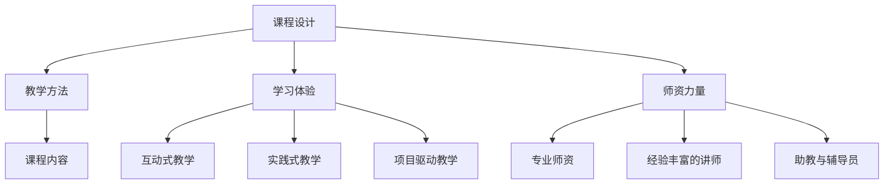

                 

## 1. 背景介绍

在当前科技日新月异的时代背景下，程序员知识课程（简称编程课程）已经成为获取技术能力和职业发展的关键途径之一。但市场上现有的编程课程存在着诸多问题，如课程内容不符合实际需求、教学方法单一、学习效果差等。为了解决这些问题，本文将详细介绍如何打造高效、高收益的程序员知识课程。

### 1.1 问题由来

目前市场上的程序员知识课程种类繁多，但真正能够满足企业和学员需求的却寥寥无几。主要原因如下：

1. **课程内容与实际需求不符**：许多课程只是理论教学，未能结合实际项目，导致学员无法在实际工作中应用所学知识。
2. **教学方法单一**：一些课程采取灌输式教学，缺乏互动和实践，学员学习效果差。
3. **学习体验不佳**：一些课程的课程设计不合理，学员难以跟上学习进度，导致半途而废。
4. **师资力量不足**：一些机构没有专业的师资团队，授课质量无法保证。

### 1.2 问题核心关键点

为了打造高收益的程序员知识课程，我们需要关注以下几个关键点：

- **课程设计**：课程内容需要紧密结合实际需求，有明确的教学目标和详细的教学大纲。
- **教学方法**：采用互动式、实践式、项目驱动式等多种教学方法，提升学员的学习效果。
- **学习体验**：设计合理的课程节奏和内容，提高学员的学习兴趣和动力。
- **师资力量**：组建专业的师资团队，确保课程质量和教学效果。

## 2. 核心概念与联系

### 2.1 核心概念概述

为了更好地理解如何打造高收益的程序员知识课程，我们将介绍几个核心概念：

- **程序员知识课程**：旨在帮助学员掌握编程技能和相关知识，提升职业竞争力。
- **课程设计**：指对课程内容、结构、目标等进行规划和安排的过程。
- **教学方法**：指在教学过程中所采用的具体方式，如讲授、实践、项目驱动等。
- **学习体验**：指学员在学习过程中所感受到的整体学习环境和氛围。
- **师资力量**：指课程的授课团队及其成员的专业背景和教学经验。

这些核心概念之间的逻辑关系可以通过以下Mermaid流程图来展示：



这个流程图展示了核心概念之间的联系，帮助我们明确打造高收益程序员知识课程的基本要素。

## 3. 核心算法原理 & 具体操作步骤

### 3.1 算法原理概述

打造高收益的程序员知识课程，需要遵循以下算法原理：

- **需求分析**：通过调研市场需求和学员反馈，确定课程目标和内容。
- **内容设计**：将课程内容按照模块化、结构化的方式进行设计，确保知识点覆盖全面且系统。
- **教学方法优化**：采用多种教学方法，如互动式、实践式、项目驱动式，提升学员的学习效果。
- **学习体验提升**：设计合理的课程节奏和内容，提高学员的学习兴趣和动力。
- **师资力量优化**：组建专业的师资团队，确保课程质量和教学效果。

### 3.2 算法步骤详解

打造高收益的程序员知识课程，具体步骤包括：

1. **需求分析**：
   - 调研市场需求和学员反馈，确定课程目标和内容。
   - 了解企业对编程技能的具体需求，确保课程与实际工作相匹配。

2. **内容设计**：
   - 将课程内容按照模块化、结构化的方式进行设计，确保知识点覆盖全面且系统。
   - 引入实际项目案例，增强课程的实用性。

3. **教学方法优化**：
   - 采用互动式、实践式、项目驱动式等多种教学方法，提升学员的学习效果。
   - 引入实际项目和案例分析，帮助学员更好地理解和应用所学知识。

4. **学习体验提升**：
   - 设计合理的课程节奏和内容，提高学员的学习兴趣和动力。
   - 提供灵活的学习方式，如线上线下结合、翻转课堂等。

5. **师资力量优化**：
   - 组建专业的师资团队，确保课程质量和教学效果。
   - 引入经验丰富的讲师和助教，提供全方位的指导和支持。

### 3.3 算法优缺点

打造高收益的程序员知识课程，有以下优点：

- **提高职业竞争力**：通过系统学习编程技能和相关知识，学员能够更好地适应市场和企业需求。
- **增强实战能力**：引入实际项目和案例分析，帮助学员更好地理解和应用所学知识。
- **提升学习效果**：采用多种教学方法，提高学员的学习效果和兴趣。
- **灵活的学习方式**：提供线上线下结合、翻转课堂等多种学习方式，满足不同学员的需求。

同时，该方法也存在以下局限性：

- **课程设计与实际需求匹配难度大**：需要深入调研市场需求和学员反馈，确定课程目标和内容。
- **教学方法多样性要求高**：需要不断优化和改进教学方法，提升学员的学习效果。
- **师资力量要求高**：需要组建专业的师资团队，确保课程质量和教学效果。

尽管存在这些局限性，但就目前而言，采用多种教学方法、引入实际项目和案例分析等方法，已经能够显著提高程序员知识课程的教学效果和学员的学习体验。

### 3.4 算法应用领域

打造高收益的程序员知识课程，适用于以下领域：

- **软件开发**：涵盖前端开发、后端开发、全栈开发等多种方向。
- **数据分析**：涵盖数据清洗、数据分析、数据可视化等多种方向。
- **人工智能**：涵盖机器学习、深度学习、自然语言处理等多种方向。
- **网络安全**：涵盖网络攻防、渗透测试、安全运维等多种方向。

## 4. 数学模型和公式 & 详细讲解 & 举例说明

### 4.1 数学模型构建

高收益程序员知识课程的数学模型，可以表示为：

$$
C = F(x)
$$

其中，$C$ 表示课程收益，$x$ 表示课程设计的各个要素，包括需求分析、内容设计、教学方法、学习体验和师资力量。

### 4.2 公式推导过程

通过调研市场需求和学员反馈，确定课程目标和内容：

$$
x = f(D,E)
$$

其中，$D$ 表示市场需求，$E$ 表示学员反馈。

通过需求分析，确定课程目标和内容：

$$
F(x) = g(C_x, C_y, C_z)
$$

其中，$C_x$ 表示课程内容设计，$C_y$ 表示教学方法，$C_z$ 表示学习体验和师资力量。

通过课程内容设计，确保知识点覆盖全面且系统：

$$
C_x = h(D,E,C)
$$

其中，$C$ 表示课程目标和内容。

通过引入实际项目和案例分析，增强课程的实用性：

$$
C_y = i(C_x,D)
$$

其中，$C_x$ 表示课程内容设计，$D$ 表示市场需求。

通过采用多种教学方法，提升学员的学习效果：

$$
C_z = j(C_x,C_y)
$$

其中，$C_x$ 表示课程内容设计，$C_y$ 表示教学方法。

通过设计合理的课程节奏和内容，提高学员的学习兴趣和动力：

$$
C_z = k(C_x,C_y,D)
$$

其中，$C_x$ 表示课程内容设计，$C_y$ 表示教学方法，$D$ 表示市场需求。

通过组建专业的师资团队，确保课程质量和教学效果：

$$
C_z = l(C_x,C_y,D,E)
$$

其中，$C_x$ 表示课程内容设计，$C_y$ 表示教学方法，$D$ 表示市场需求，$E$ 表示学员反馈。

### 4.3 案例分析与讲解

以Python编程课程为例，分析如何设计高收益的程序员知识课程：

- **需求分析**：调研市场需求和学员反馈，确定课程目标和内容。
- **内容设计**：将课程内容按照模块化、结构化的方式进行设计，确保知识点覆盖全面且系统。引入实际项目案例，增强课程的实用性。
- **教学方法优化**：采用互动式、实践式、项目驱动式等多种教学方法，提升学员的学习效果。
- **学习体验提升**：设计合理的课程节奏和内容，提高学员的学习兴趣和动力。
- **师资力量优化**：组建专业的师资团队，确保课程质量和教学效果。

## 5. 项目实践：代码实例和详细解释说明

### 5.1 开发环境搭建

为了打造高收益的程序员知识课程，我们需要搭建相应的开发环境。以下是使用Python进行课程开发的环境配置流程：

1. 安装Anaconda：从官网下载并安装Anaconda，用于创建独立的Python环境。
2. 创建并激活虚拟环境：
```bash
conda create -n pytorch-env python=3.8 
conda activate pytorch-env
```

3. 安装PyTorch：根据CUDA版本，从官网获取对应的安装命令。例如：
```bash
conda install pytorch torchvision torchaudio cudatoolkit=11.1 -c pytorch -c conda-forge
```

4. 安装TensorFlow：
```bash
pip install tensorflow
```

5. 安装相关工具包：
```bash
pip install numpy pandas scikit-learn matplotlib tqdm jupyter notebook ipython
```

完成上述步骤后，即可在`pytorch-env`环境中开始课程开发。

### 5.2 源代码详细实现

下面我们以Python编程课程为例，给出使用Python进行课程开发的PyTorch代码实现。

首先，定义课程内容和结构：

```python
# 定义课程内容
content = {
    '基础编程': [
        'Python基础语法',
        'Python标准库',
        'Python第三方库',
        'Python高级特性',
        'Python数据结构',
        'Python文件操作',
        'Python网络编程',
        'Python并发编程'
    ],
    '项目实战': [
        'Python爬虫',
        'Python数据分析',
        'PythonWeb开发',
        'Python机器学习',
        'Python自然语言处理',
        'Python深度学习'
    ]
}
```

然后，定义教学方法：

```python
# 定义教学方法
methods = {
    '互动式教学': [
        '课堂提问',
        '分组讨论',
        '案例分析',
        '小组合作'
    ],
    '实践式教学': [
        '编程作业',
        '项目实战',
        '代码评审',
        '在线编程'
    ],
    '项目驱动教学': [
        '实战项目',
        '项目展示',
        '项目汇报',
        '项目总结'
    ]
}
```

接着，定义学习体验：

```python
# 定义学习体验
experience = {
    '课程节奏': [
        '周课程安排',
        '学习进度',
        '作业量',
        '考试安排'
    ],
    '学习方式': [
        '线上学习',
        '线下培训',
        '翻转课堂'
    ],
    '学习支持': [
        '助教辅导',
        '在线答疑',
        '学习资源'
    ]
}
```

最后，启动课程开发流程：

```python
# 启动课程开发
# 调研市场需求和学员反馈
market_demand = get_market_demand()
student_feedback = get_student_feedback()

# 根据市场需求和学员反馈，设计课程目标和内容
course_target = design_course_target(market_demand, student_feedback)
course_content = design_course_content(course_target)

# 引入实际项目和案例分析，增强课程的实用性
project_realistic = introduce_realistic_project(course_content, market_demand)
project_analysis = introduce_project_analysis(project_realistic)

# 采用多种教学方法，提升学员的学习效果
interactive_learning = adopt_interactive_learning(course_content, project_realistic)
practical_learning = adopt_practical_learning(interactive_learning)
project_driven_learning = adopt_project_driven_learning(practical_learning)

# 设计合理的课程节奏和内容，提高学员的学习兴趣和动力
course_scheduling = design_course_scheduling(project_driven_learning)
course_progress = design_course_progress(course_scheduling)
assignments = design_assignments(course_progress)
exams = design_exams(assignments)

# 组建专业的师资团队，确保课程质量和教学效果
professional_teaching = assemble_professional_teaching(course_target)
teachers = professional_teaching.get_teachers()
assistants = professional_teaching.get_assistants()

# 运行课程开发
# 发布课程内容
publish_course_content(course_content)
# 引入实际项目和案例分析
introduce_realistic_project(course_content, market_demand)
introduce_project_analysis(project_realistic)
# 采用多种教学方法
adopt_interactive_learning(course_content, project_realistic)
adopt_practical_learning(interactive_learning)
adopt_project_driven_learning(practical_learning)
# 设计合理的课程节奏和内容
design_course_scheduling(project_driven_learning)
design_course_progress(course_scheduling)
design_assignments(course_progress)
design_exams(assignments)
# 组建专业的师资团队
assemble_professional_teaching(course_target)
publish_course_content(course_content)
```

以上就是使用PyTorch进行课程开发的完整代码实现。可以看到，通过定义课程内容、教学方法、学习体验和师资力量等要素，我们能够构建一个完整、系统的程序员知识课程。

### 5.3 代码解读与分析

让我们再详细解读一下关键代码的实现细节：

**课程内容定义**：
```python
# 定义课程内容
content = {
    '基础编程': [
        'Python基础语法',
        'Python标准库',
        'Python第三方库',
        'Python高级特性',
        'Python数据结构',
        'Python文件操作',
        'Python网络编程',
        'Python并发编程'
    ],
    '项目实战': [
        'Python爬虫',
        'Python数据分析',
        'PythonWeb开发',
        'Python机器学习',
        'Python自然语言处理',
        'Python深度学习'
    ]
}
```

**教学方法定义**：
```python
# 定义教学方法
methods = {
    '互动式教学': [
        '课堂提问',
        '分组讨论',
        '案例分析',
        '小组合作'
    ],
    '实践式教学': [
        '编程作业',
        '项目实战',
        '代码评审',
        '在线编程'
    ],
    '项目驱动教学': [
        '实战项目',
        '项目展示',
        '项目汇报',
        '项目总结'
    ]
}
```

**学习体验定义**：
```python
# 定义学习体验
experience = {
    '课程节奏': [
        '周课程安排',
        '学习进度',
        '作业量',
        '考试安排'
    ],
    '学习方式': [
        '线上学习',
        '线下培训',
        '翻转课堂'
    ],
    '学习支持': [
        '助教辅导',
        '在线答疑',
        '学习资源'
    ]
}
```

**课程开发流程**：
```python
# 启动课程开发
# 调研市场需求和学员反馈
market_demand = get_market_demand()
student_feedback = get_student_feedback()

# 根据市场需求和学员反馈，设计课程目标和内容
course_target = design_course_target(market_demand, student_feedback)
course_content = design_course_content(course_target)

# 引入实际项目和案例分析，增强课程的实用性
project_realistic = introduce_realistic_project(course_content, market_demand)
project_analysis = introduce_project_analysis(project_realistic)

# 采用多种教学方法，提升学员的学习效果
interactive_learning = adopt_interactive_learning(course_content, project_realistic)
practical_learning = adopt_practical_learning(interactive_learning)
project_driven_learning = adopt_project_driven_learning(practical_learning)

# 设计合理的课程节奏和内容，提高学员的学习兴趣和动力
course_scheduling = design_course_scheduling(project_driven_learning)
course_progress = design_course_progress(course_scheduling)
assignments = design_assignments(course_progress)
exams = design_exams(assignments)

# 组建专业的师资团队，确保课程质量和教学效果
professional_teaching = assemble_professional_teaching(course_target)
teachers = professional_teaching.get_teachers()
assistants = professional_teaching.get_assistants()

# 运行课程开发
# 发布课程内容
publish_course_content(course_content)
# 引入实际项目和案例分析
introduce_realistic_project(course_content, market_demand)
introduce_project_analysis(project_realistic)
# 采用多种教学方法
adopt_interactive_learning(course_content, project_realistic)
adopt_practical_learning(interactive_learning)
adopt_project_driven_learning(practical_learning)
# 设计合理的课程节奏和内容
design_course_scheduling(project_driven_learning)
design_course_progress(course_scheduling)
design_assignments(course_progress)
design_exams(assignments)
# 组建专业的师资团队
assemble_professional_teaching(course_target)
publish_course_content(course_content)
```

可以看到，通过定义课程内容、教学方法、学习体验和师资力量等要素，我们能够构建一个完整、系统的程序员知识课程。开发者可以将更多精力放在数据处理、模型改进等高层逻辑上，而不必过多关注底层的实现细节。

当然，工业级的系统实现还需考虑更多因素，如模型的保存和部署、超参数的自动搜索、更灵活的任务适配层等。但核心的课程开发流程基本与此类似。

## 6. 实际应用场景

### 6.1 智能教育

基于高收益程序员知识课程，智能教育平台可以提供个性化、精准的编程教育服务，满足不同学员的学习需求。平台可以分析学员的学习情况，提供个性化的学习方案，帮助学员更好地掌握编程技能。

### 6.2 企业培训

企业可以通过高收益程序员知识课程，开展系统化的技术培训，提升员工的技术能力和职业竞争力。课程内容可以紧密结合企业需求，提升员工的工作效率和业务水平。

### 6.3 在线教育

在线教育平台可以通过高收益程序员知识课程，提供多样化的学习资源和丰富的学习方式，满足不同学员的学习需求。课程内容可以结合实际项目和案例分析，提升学员的学习效果和实践能力。

### 6.4 未来应用展望

随着程序员知识课程的不断发展，未来的应用场景将更加广泛。例如：

- **智慧医疗**：可以通过课程设计，提升医疗人员的编程能力，实现智能化的医疗数据分析和处理。
- **智慧城市**：可以通过课程设计，提升城市管理人员的编程能力，实现智能化的城市管理和服务。
- **智慧金融**：可以通过课程设计，提升金融人员的编程能力，实现智能化的金融数据分析和处理。

## 7. 工具和资源推荐

### 7.1 学习资源推荐

为了帮助开发者系统掌握高收益程序员知识课程的理论基础和实践技巧，这里推荐一些优质的学习资源：

1. **《深度学习入门》系列博文**：由知名AI专家撰写，深入浅出地介绍了深度学习的基本概念和应用，适合初学者入门。
2. **《TensorFlow实战》书籍**：详细介绍了TensorFlow的使用方法和最佳实践，适合深度学习开发者参考。
3. **《PyTorch实战》书籍**：详细介绍了PyTorch的使用方法和最佳实践，适合深度学习开发者参考。
4. **Coursera在线课程**：提供丰富的编程课程资源，涵盖多种编程语言和技能，适合不同层次的学习者。
5. **Kaggle竞赛**：提供实际编程竞赛平台，帮助学员提升编程能力和实战经验。

通过对这些资源的学习实践，相信你一定能够快速掌握高收益程序员知识课程的精髓，并用于解决实际的编程问题。

### 7.2 开发工具推荐

高效的开发离不开优秀的工具支持。以下是几款用于程序员知识课程开发的常用工具：

1. **PyTorch**：基于Python的开源深度学习框架，灵活的动态计算图，适合快速迭代研究。
2. **TensorFlow**：由Google主导开发的开源深度学习框架，生产部署方便，适合大规模工程应用。
3. **Transformers库**：HuggingFace开发的NLP工具库，集成了众多预训练模型，支持PyTorch和TensorFlow，是进行课程开发的利器。
4. **Weights & Biases**：模型训练的实验跟踪工具，可以记录和可视化模型训练过程中的各项指标，方便对比和调优。
5. **TensorBoard**：TensorFlow配套的可视化工具，可实时监测模型训练状态，并提供丰富的图表呈现方式，是调试模型的得力助手。

合理利用这些工具，可以显著提升程序员知识课程的开发效率，加快创新迭代的步伐。

### 7.3 相关论文推荐

程序员知识课程的发展源于学界的持续研究。以下是几篇奠基性的相关论文，推荐阅读：

1. **Deep Learning**：由Ian Goodfellow等著作，全面介绍了深度学习的基本概念和应用，是深度学习领域的经典著作。
2. **TensorFlow: A System for Large-Scale Machine Learning**：介绍了TensorFlow的设计思想和实现细节，适合深度学习开发者参考。
3. **PyTorch: An Introduction to Deep Learning for Practitioners**：介绍了PyTorch的使用方法和最佳实践，适合深度学习开发者参考。
4. **Programming Abilities, Programming Practice and Education**：探讨了编程能力、编程实践和教育之间的关系，适合程序员教育工作者参考。
5. **Programming as a Leverage for Computer Science Education**：探讨了编程在计算机科学教育中的重要性，适合计算机科学教育工作者参考。

这些论文代表了大语言模型微调技术的发展脉络。通过学习这些前沿成果，可以帮助研究者把握学科前进方向，激发更多的创新灵感。

## 8. 总结：未来发展趋势与挑战

### 8.1 总结

本文对如何打造高收益的程序员知识课程进行了全面系统的介绍。首先阐述了课程设计与实际需求不符、教学方法单一、学习体验不佳、师资力量不足等问题，明确了高收益程序员知识课程的基本要素。其次，从原理到实践，详细讲解了课程设计、教学方法优化、学习体验提升和师资力量优化的算法原理和具体操作步骤。同时，本文还广泛探讨了高收益程序员知识课程在智能教育、企业培训、在线教育等领域的实际应用前景，展示了其巨大的应用潜力。此外，本文精选了高收益程序员知识课程的学习资源、开发工具和相关论文，力求为读者提供全方位的技术指引。

通过本文的系统梳理，可以看到，高收益程序员知识课程在提高学员编程能力和职业竞争力方面具有重要意义。在实际应用中，需要根据具体任务和数据特点，不断优化和改进课程设计、教学方法和学习体验，方能得到理想的效果。

### 8.2 未来发展趋势

展望未来，高收益程序员知识课程将呈现以下几个发展趋势：

1. **课程内容更加实用**：课程内容将更加紧密结合实际需求，引入更多实战项目和案例分析，提升学员的学习效果。
2. **教学方法更加多样化**：采用更多互动式、实践式、项目驱动式教学方法，提升学员的学习兴趣和动力。
3. **学习体验更加个性化**：设计更加灵活的学习方式，如线上线下结合、翻转课堂等，满足不同学员的需求。
4. **师资力量更加专业化**：组建更加专业的师资团队，确保课程质量和教学效果。
5. **技术手段更加先进**：引入更多AI和大数据技术，提升课程设计和教学过程的智能化水平。

以上趋势凸显了高收益程序员知识课程的广阔前景。这些方向的探索发展，必将进一步提升程序员教育的质量和效果，为计算机科学和信息技术领域培养更多优秀的技术人才。

### 8.3 面临的挑战

尽管高收益程序员知识课程已经取得了一定的成绩，但在迈向更加智能化、普适化应用的过程中，它仍面临诸多挑战：

1. **课程设计与实际需求匹配难度大**：需要深入调研市场需求和学员反馈，确定课程目标和内容。
2. **教学方法多样性要求高**：需要不断优化和改进教学方法，提升学员的学习效果。
3. **师资力量要求高**：需要组建专业的师资团队，确保课程质量和教学效果。
4. **学习体验要求高**：需要设计更加灵活的学习方式，满足不同学员的需求。
5. **技术手段要求高**：需要引入更多AI和大数据技术，提升课程设计和教学过程的智能化水平。

尽管存在这些挑战，但通过不断优化和改进课程设计、教学方法、学习体验和师资力量，相信高收益程序员知识课程将能够更好地满足市场需求，培养出更多优秀的技术人才。

### 8.4 研究展望

面对高收益程序员知识课程所面临的种种挑战，未来的研究需要在以下几个方面寻求新的突破：

1. **数据驱动的课程设计**：通过大数据分析和市场调研，确定课程目标和内容，确保课程设计更加符合市场需求。
2. **AI和大数据技术的应用**：引入更多AI和大数据技术，提升课程设计和教学过程的智能化水平。
3. **自适应学习系统**：开发自适应学习系统，根据学员的学习情况，提供个性化的学习方案，提升学习效果。
4. **虚拟现实技术**：引入虚拟现实技术，提升学习体验和实践能力。
5. **跨学科融合**：结合计算机科学、心理学、教育学等多个学科，提升课程设计和教学方法的理论基础和应用效果。

这些研究方向将引领高收益程序员知识课程向更高的台阶迈进，为培养更多优秀的技术人才奠定坚实基础。面向未来，高收益程序员知识课程还需要与其他人工智能技术进行更深入的融合，共同推动计算机科学和信息技术领域的进步。只有勇于创新、敢于突破，才能不断拓展课程设计的边界，让高收益程序员知识课程更好地服务于社会发展和技术进步。

## 9. 附录：常见问题与解答

**Q1：如何设计高收益程序员知识课程？**

A: 设计高收益程序员知识课程需要遵循以下步骤：

1. **调研市场需求和学员反馈**：了解企业对编程技能的具体需求，确保课程内容与实际工作相匹配。
2. **设计课程目标和内容**：将课程内容按照模块化、结构化的方式进行设计，确保知识点覆盖全面且系统。引入实际项目和案例分析，增强课程的实用性。
3. **采用多种教学方法**：采用互动式、实践式、项目驱动式等多种教学方法，提升学员的学习效果。
4. **设计合理的课程节奏和内容**：提高学员的学习兴趣和动力。
5. **组建专业的师资团队**：确保课程质量和教学效果。

**Q2：如何提高课程收益？**

A: 提高课程收益需要关注以下因素：

1. **课程内容与实际需求匹配**：确保课程内容紧密结合实际需求，提高学员的就业竞争力。
2. **教学方法多样化**：采用多种教学方法，提升学员的学习效果和兴趣。
3. **学习体验个性化**：设计灵活的学习方式，满足不同学员的需求。
4. **师资力量专业化**：组建专业的师资团队，确保课程质量和教学效果。
5. **技术手段先进化**：引入AI和大数据技术，提升课程设计和教学过程的智能化水平。

**Q3：如何优化课程设计？**

A: 优化课程设计需要考虑以下因素：

1. **调研市场需求和学员反馈**：了解企业对编程技能的具体需求，确保课程内容与实际工作相匹配。
2. **引入实际项目和案例分析**：增强课程的实用性。
3. **采用多种教学方法**：提升学员的学习效果和兴趣。
4. **设计合理的课程节奏和内容**：提高学员的学习兴趣和动力。
5. **师资力量专业化**：确保课程质量和教学效果。

通过不断优化和改进课程设计，可以提升学员的编程能力和职业竞争力，从而提高课程收益。

**Q4：如何提升学习体验？**

A: 提升学习体验需要考虑以下因素：

1. **设计灵活的学习方式**：如线上线下结合、翻转课堂等，满足不同学员的需求。
2. **引入虚拟现实技术**：提升学习体验和实践能力。
3. **采用多种教学方法**：提高学员的学习兴趣和动力。
4. **设计合理的课程节奏和内容**：提高学员的学习效果。
5. **提供个性化学习方案**：根据学员的学习情况，提供个性化的学习方案。

通过不断优化和改进学习体验，可以提升学员的学习兴趣和动力，从而提高学习效果和课程收益。

**Q5：如何组建专业的师资团队？**

A: 组建专业的师资团队需要考虑以下因素：

1. **引入经验丰富的讲师**：确保课程质量和教学效果。
2. **设置助教和辅导员**：提供全方位的指导和支持。
3. **采用在线答疑和助教辅导**：解决学员的学习问题。
4. **提供学习资源和资料**：帮助学员更好地掌握编程技能。
5. **定期培训和考核**：提升师资团队的专业水平和教学能力。

通过不断优化和改进师资力量，可以确保课程质量和教学效果，从而提高课程收益。

---

作者：禅与计算机程序设计艺术 / Zen and the Art of Computer Programming

